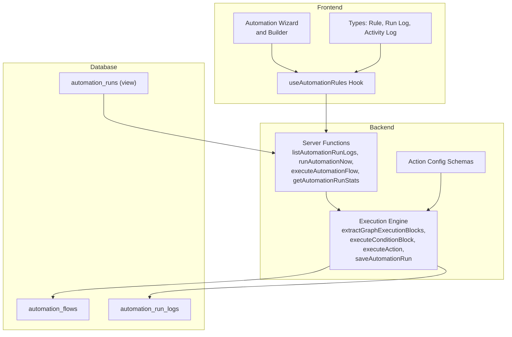
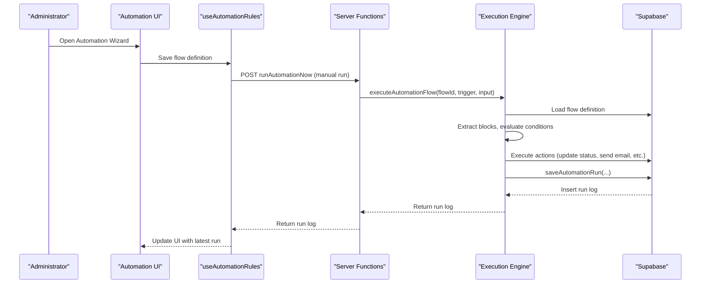
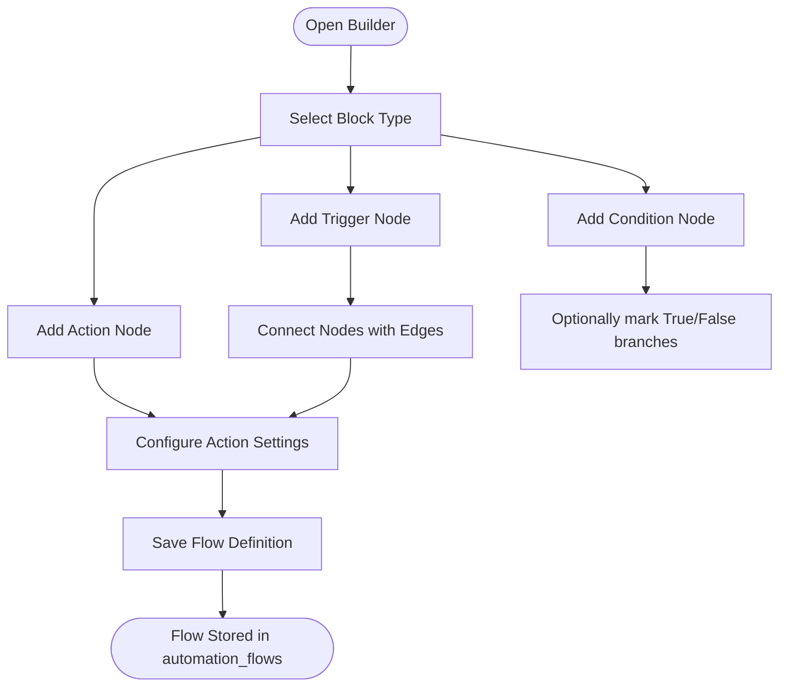
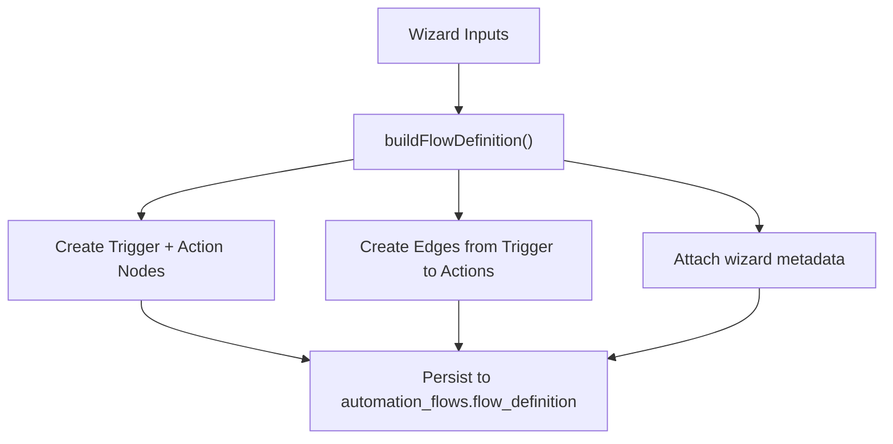
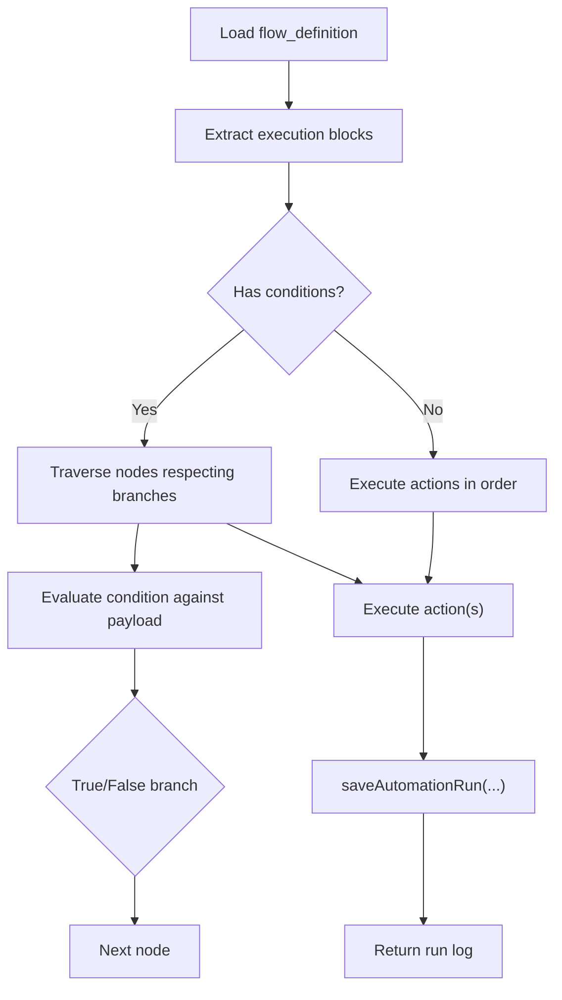
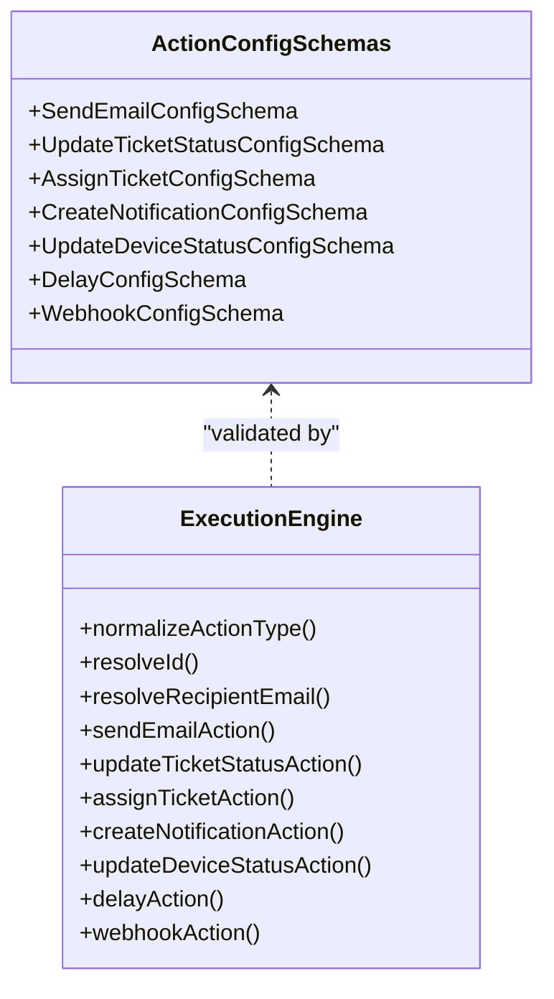
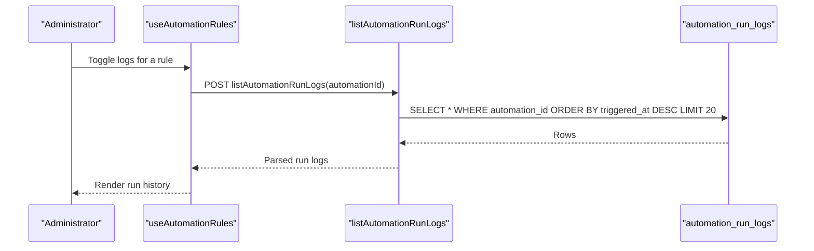
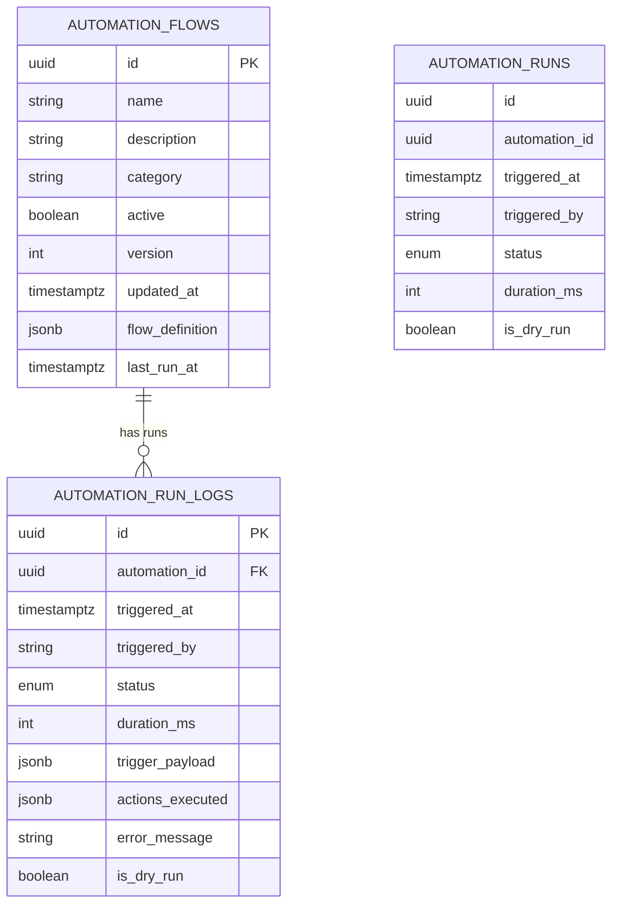
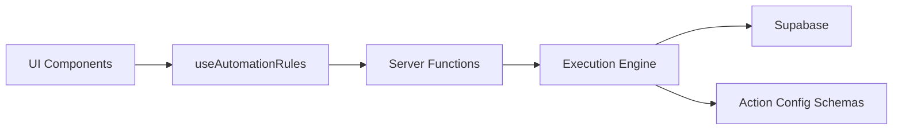

# Automation System

<cite>
**Referenced Files in This Document**
- [automation.ts](file://src/types/automation.ts)
- [index.ts](file://src/components/automations/index.ts)
- [useAutomationRules.ts](file://src/hooks/useAutomationRules.ts)
- [AutomationBuilder.tsx](file://src/components/pcready/automation/AutomationBuilder.tsx)
- [automation-runs.ts](file://src/lib/automation-runs.ts)
- [automation-runs.server.ts](file://src/lib/automation-runs.server.ts)
- [automations.ts](file://src/lib/queries/automations.ts)
- [20260504123000_create_automation_flows.sql](file://supabase/migrations/20260504123000_create_automation_flows.sql)
- [20260507133000_automation_run_logs.sql](file://supabase/migrations/20260507133000_automation_run_logs.sql)
- [20260515160000_automation_runs_view.sql](file://supabase/migrations/20260515160000_automation_runs_view.sql)
</cite>

## Table of Contents
1. [Introduction](#introduction)
2. [Project Structure](#project-structure)
3. [Core Components](#core-components)
4. [Architecture Overview](#architecture-overview)
5. [Detailed Component Analysis](#detailed-component-analysis)
6. [Dependency Analysis](#dependency-analysis)
7. [Performance Considerations](#performance-considerations)
8. [Troubleshooting Guide](#troubleshooting-guide)
9. [Conclusion](#conclusion)
10. [Appendices](#appendices)

## Introduction
This document explains the automation system that powers rule-based workflow automation. It covers how triggers and actions are configured, how the flow builder and wizard work, supported trigger and action types, run management and monitoring, and operational guidance for administrators and developers. The system stores automation flows as JSON with nodes and edges, supports manual runs and dry runs, and persists execution logs with structured outcomes.

## Project Structure
The automation system spans frontend UI, backend server functions, and Supabase database schemas:
- Frontend:
  - Wizard and builder for designing flows
  - Hooks for listing, creating, updating, toggling, duplicating, archiving, and running automations
  - Types for rules, run logs, and activity logs
- Backend:
  - Server functions to list run logs, run automations now, compute stats, and execute flows
  - Execution engine that evaluates conditions, executes actions, and persists logs
  - Validation schemas for action configurations
- Database:
  - Tables and views for automation flows and run logs

**Diagram sources**
- [AutomationBuilder.tsx:1-527](file://src/components/pcready/automation/AutomationBuilder.tsx#L1-L527)
- [useAutomationRules.ts:1-413](file://src/hooks/useAutomationRules.ts#L1-L413)
- [automation-runs.ts:1-211](file://src/lib/automation-runs.ts#L1-L211)
- [automation-runs.server.ts:1-800](file://src/lib/automation-runs.server.ts#L1-L800)
- [automation.ts:1-72](file://src/types/automation.ts#L1-L72)
- [20260504123000_create_automation_flows.sql](file://supabase/migrations/20260504123000_create_automation_flows.sql)
- [20260507133000_automation_run_logs.sql](file://supabase/migrations/20260507133000_automation_run_logs.sql)
- [20260515160000_automation_runs_view.sql](file://supabase/migrations/20260515160000_automation_runs_view.sql)

**Section sources**
- [index.ts:1-7](file://src/components/automations/index.ts#L1-L7)
- [useAutomationRules.ts:1-413](file://src/hooks/useAutomationRules.ts#L1-L413)
- [automation-runs.ts:1-211](file://src/lib/automation-runs.ts#L1-L211)
- [automation-runs.server.ts:1-800](file://src/lib/automation-runs.server.ts#L1-L800)
- [automation.ts:1-72](file://src/types/automation.ts#L1-L72)

## Core Components
- AutomationRule and related types define persisted rules, flow definitions, and metadata.
- The builder/wizard constructs flows from trigger, condition, and action nodes.
- Hooks orchestrate CRUD operations, run execution, and statistics.
- Server functions expose secure endpoints for manual runs, dry runs, and stats.
- Execution engine evaluates conditions, executes actions, and persists logs.

Key type definitions:
- AutomationRule: fields include identifiers, lifecycle flags, versioning, timestamps, and flow_definition.
- AutomationRunLog: fields capture run status, duration, trigger payload, executed actions, and error messages.
- ActivityLog: generic audit log entries for automation and other system events.

**Section sources**
- [automation.ts:23-72](file://src/types/automation.ts#L23-L72)

## Architecture Overview
The automation system follows a flow-based architecture:
- Triggers initiate flows (e.g., ticket creation, status change, scheduled execution).
- Conditions branch the flow based on payload evaluation.
- Actions perform side effects (e.g., update ticket status, send email, create notifications).
- Execution results and errors are recorded in run logs with structured details.

**Diagram sources**
- [useAutomationRules.ts:318-349](file://src/hooks/useAutomationRules.ts#L318-L349)
- [automation-runs.ts:94-108](file://src/lib/automation-runs.ts#L94-L108)
- [automation-runs.server.ts:59-207](file://src/lib/automation-runs.server.ts#L59-L207)

## Detailed Component Analysis

### Flow Definition and Builder
The builder allows constructing flows from draggable blocks:
- Trigger palette: ticket creation, ticket status change, scheduled execution
- Condition palette: field/operator/value comparisons
- Action palette: assign technician, send notification, create ticket, delay, webhook

The builder serializes nodes and edges into a flow_definition stored in the automation_flows table. Properties can be edited inline, including condition expressions and action-specific configs (e.g., webhook URL and payload).

**Diagram sources**
- [AutomationBuilder.tsx:196-275](file://src/components/pcready/automation/AutomationBuilder.tsx#L196-L275)
- [AutomationBuilder.tsx:119-152](file://src/components/pcready/automation/AutomationBuilder.tsx#L119-L152)

**Section sources**
- [AutomationBuilder.tsx:196-275](file://src/components/pcready/automation/AutomationBuilder.tsx#L196-L275)
- [AutomationBuilder.tsx:119-152](file://src/components/pcready/automation/AutomationBuilder.tsx#L119-L152)

### Wizard-to-Flow Conversion
The wizard collects user selections and converts them into a flow_definition with explicit nodes and edges. It also records a wizard metadata snapshot for traceability.

**Diagram sources**
- [useAutomationRules.ts:135-231](file://src/hooks/useAutomationRules.ts#L135-L231)

**Section sources**
- [useAutomationRules.ts:135-231](file://src/hooks/useAutomationRules.ts#L135-L231)

### Execution Engine and Flow Traversal
The execution engine:
- Loads the flow definition
- Extracts execution blocks (conditions and actions) from nodes
- Evaluates conditions against the trigger payload and traverses edges accordingly
- Executes actions or simulates them during dry runs
- Persists run logs with structured action results and error details

**Diagram sources**
- [automation-runs.server.ts:94-207](file://src/lib/automation-runs.server.ts#L94-L207)
- [automation-runs.server.ts:301-360](file://src/lib/automation-runs.server.ts#L301-L360)
- [automation-runs.server.ts:362-384](file://src/lib/automation-runs.server.ts#L362-L384)

**Section sources**
- [automation-runs.server.ts:94-207](file://src/lib/automation-runs.server.ts#L94-L207)
- [automation-runs.server.ts:301-384](file://src/lib/automation-runs.server.ts#L301-L384)

### Action Types and Configurations
Supported actions include:
- Update ticket status
- Assign ticket
- Send email
- Create notification
- Update device status
- Delay
- Webhook

Each action has a dedicated configuration schema validated before execution. The execution engine resolves entity IDs from either the action config or the trigger payload and performs the operation, returning structured results and errors.

**Diagram sources**
- [automation-runs.server.ts:532-574](file://src/lib/automation-runs.server.ts#L532-L574)
- [automation-runs.server.ts:576-627](file://src/lib/automation-runs.server.ts#L576-L627)
- [automation-runs.server.ts:629-714](file://src/lib/automation-runs.server.ts#L629-L714)
- [automation-runs.server.ts:716-772](file://src/lib/automation-runs.server.ts#L716-L772)
- [automation-runs.server.ts:774-800](file://src/lib/automation-runs.server.ts#L774-L800)

**Section sources**
- [automation-runs.server.ts:532-772](file://src/lib/automation-runs.server.ts#L532-L772)

### Run Management and Monitoring
- Manual runs and dry runs are initiated via server functions.
- Run logs capture status, duration, trigger payload, executed actions, and error messages.
- Statistics compute health indicators and KPIs for dashboards.
- A view exposes recent runs for convenient querying.

**Diagram sources**
- [useAutomationRules.ts:300-316](file://src/hooks/useAutomationRules.ts#L300-L316)
- [automation-runs.ts:77-92](file://src/lib/automation-runs.ts#L77-L92)

**Section sources**
- [useAutomationRules.ts:300-316](file://src/hooks/useAutomationRules.ts#L300-L316)
- [automation-runs.ts:77-92](file://src/lib/automation-runs.ts#L77-L92)
- [automation-runs.ts:144-210](file://src/lib/automation-runs.ts#L144-L210)

### Database Schema and Views
- automation_flows: stores rule metadata and flow_definition (nodes, edges, meta).
- automation_run_logs: stores execution results and outcomes.
- automation_runs: a view aggregating recent runs for reporting.

**Diagram sources**
- [20260504123000_create_automation_flows.sql](file://supabase/migrations/20260504123000_create_automation_flows.sql)
- [20260507133000_automation_run_logs.sql](file://supabase/migrations/20260507133000_automation_run_logs.sql)
- [20260515160000_automation_runs_view.sql](file://supabase/migrations/20260515160000_automation_runs_view.sql)

**Section sources**
- [20260504123000_create_automation_flows.sql](file://supabase/migrations/20260504123000_create_automation_flows.sql)
- [20260507133000_automation_run_logs.sql](file://supabase/migrations/20260507133000_automation_run_logs.sql)
- [20260515160000_automation_runs_view.sql](file://supabase/migrations/20260515160000_automation_runs_view.sql)

## Dependency Analysis
- UI depends on hooks for data fetching and mutations.
- Hooks depend on server functions for run execution and stats.
- Server functions depend on the execution engine and database access.
- Execution engine depends on action schemas and external services (email, notifications).

**Diagram sources**
- [useAutomationRules.ts:1-413](file://src/hooks/useAutomationRules.ts#L1-L413)
- [automation-runs.ts:1-211](file://src/lib/automation-runs.ts#L1-L211)
- [automation-runs.server.ts:1-800](file://src/lib/automation-runs.server.ts#L1-L800)

**Section sources**
- [useAutomationRules.ts:1-413](file://src/hooks/useAutomationRules.ts#L1-L413)
- [automation-runs.ts:1-211](file://src/lib/automation-runs.ts#L1-L211)
- [automation-runs.server.ts:1-800](file://src/lib/automation-runs.server.ts#L1-L800)

## Performance Considerations
- Prefer minimal branching and shallow graphs to reduce traversal overhead.
- Use dry runs to validate complex flows before enabling them.
- Keep action configurations concise and avoid heavy payloads in trigger_payload.
- Monitor run durations and error rates via run logs and dashboard KPIs.
- Archive inactive rules to reduce query volume on automation_flows.

## Troubleshooting Guide
Common issues and resolutions:
- Automation conflicts
  - Cause: Multiple rules targeting the same event or resource.
  - Resolution: Design mutually exclusive conditions and use categories/tags to organize rules.
- Execution failures
  - Cause: Invalid action config, missing IDs in payload, or external service errors.
  - Resolution: Inspect run logs for error_message and action details; fix schemas and payload fields.
- Performance bottlenecks
  - Cause: Deeply nested conditions or long action chains.
  - Resolution: Simplify flows, leverage delays judiciously, and split large flows into smaller ones.
- Dry run discrepancies
  - Cause: Different behavior in simulation vs. real execution.
  - Resolution: Use dry runs to validate; adjust action configs and payload expectations.

Debugging techniques:
- Use the run log drawer to inspect actions_executed and error_message.
- Trigger manual runs with explicit triggerPayload to reproduce scenarios.
- Compute health and KPIs to detect trends and failing flows.
- Enable guided mode in the builder to ensure correct node types and connections.

**Section sources**
- [useAutomationRules.ts:300-349](file://src/hooks/useAutomationRules.ts#L300-L349)
- [automation-runs.ts:144-210](file://src/lib/automation-runs.ts#L144-L210)
- [automation-runs.server.ts:198-225](file://src/lib/automation-runs.server.ts#L198-L225)

## Conclusion
The automation system provides a robust, extensible framework for building rule-based workflows. Administrators can design flows visually, while developers can extend action types and validations. The execution engine ensures reliable logging and monitoring, enabling effective troubleshooting and optimization.

## Appendices

### Trigger Types
- Ticket created
- Ticket status changed
- Scheduled execution

These are surfaced in the builder’s trigger palette and used to populate the flow definition.

**Section sources**
- [AutomationBuilder.tsx:199-214](file://src/components/pcready/automation/AutomationBuilder.tsx#L199-L214)

### Action Types and Examples
- Update ticket status
- Assign ticket
- Send email
- Create notification
- Update device status
- Delay
- Webhook

Examples of configuration patterns are defined by the action schemas and validated during execution.

**Section sources**
- [automation-runs.server.ts:532-574](file://src/lib/automation-runs.server.ts#L532-L574)
- [automation-runs.server.ts:576-627](file://src/lib/automation-runs.server.ts#L576-L627)
- [automation-runs.server.ts:629-714](file://src/lib/automation-runs.server.ts#L629-L714)
- [automation-runs.server.ts:716-772](file://src/lib/automation-runs.server.ts#L716-L772)
- [automation-runs.server.ts:774-800](file://src/lib/automation-runs.server.ts#L774-L800)

### Configuration Options
- Rule metadata: name, description, category, active, version, summary, last_run_at.
- Flow definition: nodes, edges, meta (including wizard snapshot and archival/paused flags).
- Action configs: strict schemas for each action type (e.g., email subject/body, status enums, webhook URL).
- Scheduling: represented as a scheduled execution trigger in the builder.

**Section sources**
- [automation.ts:23-36](file://src/types/automation.ts#L23-L36)
- [automation.ts:4-19](file://src/types/automation.ts#L4-L19)
- [AutomationBuilder.tsx:232-275](file://src/components/pcready/automation/AutomationBuilder.tsx#L232-L275)

### Relationships Between Rules, Workflows, and Events
- Rules are stored in automation_flows and activated/deactivated via UI.
- Ticket/device events feed trigger payloads that drive flow execution.
- Run logs connect executions to rules and provide audit trails.

**Section sources**
- [automations.ts:1-179](file://src/lib/queries/automations.ts#L1-L179)
- [automation-runs.server.ts:59-207](file://src/lib/automation-runs.server.ts#L59-L207)