# Automation System

<cite>
**Referenced Files in This Document**
- [automation.ts](file://src/types/automation.ts)
- [index.ts](file://src/components/automations/index.ts)
- [useAutomationRules.ts](file://src/hooks/useAutomationRules.ts)
- [AutomationBuilder.tsx](file://src/components/pcready/automation/AutomationBuilder.tsx)
- [automation-runs.ts](file://src/lib/automation-runs.ts)
- [automation-runs.server.ts](file://src/lib/automation-runs.server.ts)
- [automations.ts](file://src/lib/queries/automations.ts)
- [AutomationWizard.tsx](file://src/components/automations/AutomationWizard.tsx)
- [TriggerStep.tsx](file://src/components/automations/steps/TriggerStep.tsx)
- [ConditionsStep.tsx](file://src/components/automations/steps/ConditionsStep.tsx)
- [ActionsStep.tsx](file://src/components/automations/steps/ActionsStep.tsx)
- [ScheduleStep.tsx](file://src/components/automations/steps/ScheduleStep.tsx)
- [ReviewStep.tsx](file://src/components/automations/steps/ReviewStep.tsx)
- [AutomationRuleCard.tsx](file://src/components/automations/AutomationRuleCard.tsx)
- [GlobalRunLogsPanel.tsx](file://src/components/automations/GlobalRunLogsPanel.tsx)
- [DryRunDialog.tsx](file://src/components/automations/DryRunDialog.tsx)
- [AutomationKpiCard.tsx](file://src/components/automations/AutomationKpiCard.tsx)
- [20260504123000_create_automation_flows.sql](file://supabase/migrations/20260504123000_create_automation_flows.sql)
- [20260507133000_automation_run_logs.sql](file://supabase/migrations/20260507133000_automation_run_logs.sql)
- [20260515160000_automation_runs_view.sql](file://supabase/migrations/20260515160000_automation_runs_view.sql)
</cite>

## Update Summary
**Changes Made**
- Added comprehensive wizard-based rule management with five-step process
- Enhanced rule cards with improved UI/UX and health monitoring
- Implemented global logging panel for system-wide automation monitoring
- Added advanced dry-run testing capabilities with step-by-step visualization
- Introduced KPI dashboard components for automation performance tracking
- Updated trigger types to include checklist completion and enhanced scheduling options

## Table of Contents
1. [Introduction](#introduction)
2. [Project Structure](#project-structure)
3. [Core Components](#core-components)
4. [Architecture Overview](#architecture-overview)
5. [Detailed Component Analysis](#detailed-component-analysis)
6. [Wizard-Based Rule Management](#wizard-based-rule-management)
7. [Enhanced Monitoring and Dashboard](#enhanced-monitoring-and-dashboard)
8. [Dependency Analysis](#dependency-analysis)
9. [Performance Considerations](#performance-considerations)
10. [Troubleshooting Guide](#troubleshooting-guide)
11. [Conclusion](#conclusion)
12. [Appendices](#appendices)

## Introduction
This document explains the comprehensive automation system that powers rule-based workflow automation. The system has undergone a major overhaul featuring a wizard-based rule management interface, enhanced dashboard components, advanced monitoring capabilities, and improved UI/UX. It covers how triggers and actions are configured through an intuitive five-step wizard, how the flow builder and enhanced rule cards work, supported trigger and action types, run management and monitoring, and operational guidance for administrators and developers.

## Project Structure
The automation system spans frontend UI components, backend server functions, and Supabase database schemas with significant enhancements:
- Frontend:
  - Five-step wizard for designing automation rules with trigger selection, conditions, actions, scheduling, and review
  - Enhanced rule cards with health monitoring, summary previews, and expanded detail panels
  - Global logging panel for system-wide automation monitoring and filtering
  - Advanced dry-run testing with step-by-step visualization
  - KPI dashboard components for performance tracking
  - Hooks for listing, creating, updating, toggling, duplicating, archiving, and running automations
  - Types for rules, run logs, and activity logs
- Backend:
  - Server functions to list run logs, run automations now, compute stats, and execute flows
  - Execution engine that evaluates conditions, executes actions, and persists logs
  - Validation schemas for action configurations
- Database:
  - Tables and views for automation flows and run logs

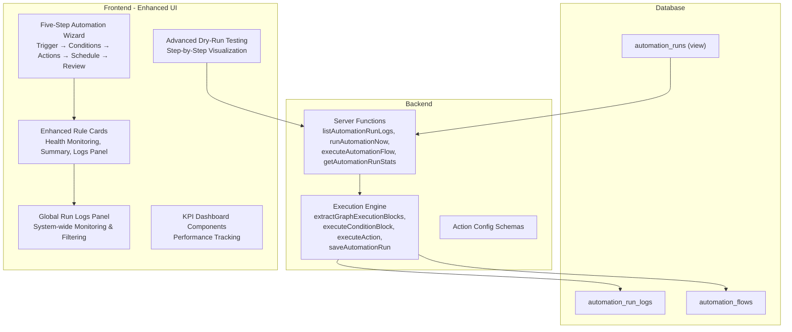

**Diagram sources**
- [AutomationWizard.tsx:15-21](file://src/components/automations/AutomationWizard.tsx#L15-L21)
- [AutomationRuleCard.tsx:65-145](file://src/components/automations/AutomationRuleCard.tsx#L65-L145)
- [GlobalRunLogsPanel.tsx:31-103](file://src/components/automations/GlobalRunLogsPanel.tsx#L31-L103)
- [DryRunDialog.tsx:18-82](file://src/components/automations/DryRunDialog.tsx#L18-L82)
- [AutomationKpiCard.tsx:4-51](file://src/components/automations/AutomationKpiCard.tsx#L4-L51)

**Section sources**
- [index.ts:1-7](file://src/components/automations/index.ts#L1-L7)
- [useAutomationRules.ts:1-413](file://src/hooks/useAutomationRules.ts#L1-L413)
- [automation-runs.ts:1-211](file://src/lib/automation-runs.ts#L1-L211)
- [automation-runs.server.ts:1-800](file://src/lib/automation-runs.server.ts#L1-L800)
- [automation.ts:1-72](file://src/types/automation.ts#L1-L72)

## Core Components
- **Enhanced AutomationRule and related types** define persisted rules, flow definitions, and metadata with wizard snapshots.
- **Five-Step Wizard Interface** constructs flows through intuitive step-by-step configuration:
  - Step 1: Trigger selection with comprehensive event types
  - Step 2: Optional conditions with logical operators
  - Step 3: Action configuration with multiple automation types
  - Step 4: Scheduling options (cron and interval)
  - Step 5: Review and validation before saving
- **Enhanced Rule Cards** provide comprehensive rule management with:
  - Health status indicators (healthy, degraded, error)
  - Summary previews extracted from wizard metadata
  - Expanded detail panels with statistics and logs
  - Quick action buttons for editing, running, testing, and managing rules
- **Global Logging Panel** offers system-wide monitoring with:
  - Real-time log viewing across all automation rules
  - Advanced filtering by rule, status, and date range
  - Export capabilities and detailed execution insights
- **Advanced Dry-Run Testing** provides step-by-step execution visualization
- **KPI Dashboard Components** enable performance tracking and monitoring
- Hooks orchestrate CRUD operations, run execution, and statistics
- Server functions expose secure endpoints for manual runs, dry runs, and stats
- Execution engine evaluates conditions, executes actions, and persists logs

Key type definitions:
- AutomationRule: fields include identifiers, lifecycle flags, versioning, timestamps, and enhanced flow_definition with wizard metadata
- AutomationRunLog: fields capture run status, duration, trigger payload, executed actions, and error messages
- ActivityLog: generic audit log entries for automation and other system events

**Section sources**
- [automation.ts:23-72](file://src/types/automation.ts#L23-L72)
- [AutomationWizard.tsx:15-21](file://src/components/automations/AutomationWizard.tsx#L15-L21)
- [AutomationRuleCard.tsx:65-145](file://src/components/automations/AutomationRuleCard.tsx#L65-L145)
- [GlobalRunLogsPanel.tsx:31-103](file://src/components/automations/GlobalRunLogsPanel.tsx#L31-L103)

## Architecture Overview
The automation system follows an enhanced flow-based architecture with wizard-based rule management:
- **Enhanced Triggers** initiate flows (ticket creation, status change, checklist completion, scheduled execution, manual triggers)
- **Conditional Logic** branches the flow based on payload evaluation with logical operators
- **Multi-Type Actions** perform side effects (update ticket status, send email, create notifications, assign tickets, update device status)
- **Comprehensive Monitoring** captures execution results, health status, and error details with real-time dashboard integration

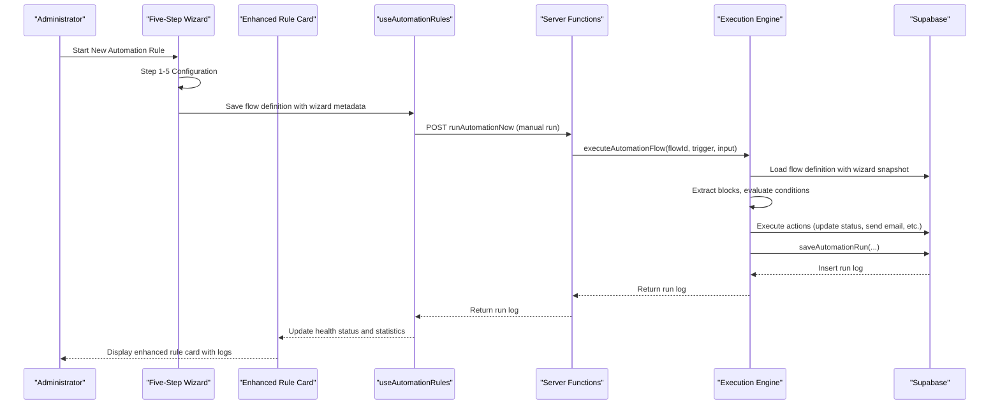

**Diagram sources**
- [AutomationWizard.tsx:83-97](file://src/components/automations/AutomationWizard.tsx#L83-L97)
- [useAutomationRules.ts:318-349](file://src/hooks/useAutomationRules.ts#L318-L349)
- [automation-runs.ts:94-108](file://src/lib/automation-runs.ts#L94-L108)
- [automation-runs.server.ts:59-207](file://src/lib/automation-runs.server.ts#L59-L207)

## Detailed Component Analysis

### Enhanced Flow Definition and Wizard Interface
The wizard interface provides a comprehensive five-step process for constructing automation flows:
- **Step 1: Trigger Selection** - Choose from ticket creation, ticket updates, checklist completion, scheduled execution, or manual triggers
- **Step 2: Conditions** - Add optional logical conditions with operators like equals, not equals, greater than, less than, contains, starts with, ends with, priority checks, and tag searches
- **Step 3: Actions** - Configure multiple action types including email sending, ticket status updates, notifications, device status changes, and ticket assignment
- **Step 4: Scheduling** - Set up cron expressions or interval-based schedules for automated execution
- **Step 5: Review** - Preview and validate the complete rule configuration before saving

The wizard generates a flow_definition with embedded wizard metadata for traceability and enhanced rule management.

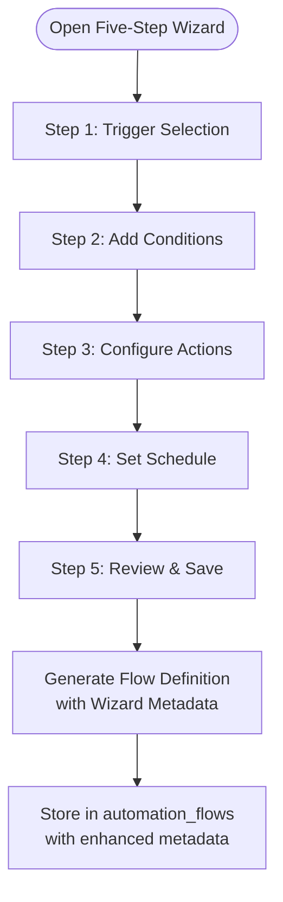

**Diagram sources**
- [AutomationWizard.tsx:15-21](file://src/components/automations/AutomationWizard.tsx#L15-L21)
- [TriggerStep.tsx:4-45](file://src/components/automations/steps/TriggerStep.tsx#L4-L45)
- [ConditionsStep.tsx:8-18](file://src/components/automations/steps/ConditionsStep.tsx#L8-L18)
- [ActionsStep.tsx:7-27](file://src/components/automations/steps/ActionsStep.tsx#L7-L27)
- [ScheduleStep.tsx:1-39](file://src/components/automations/steps/ScheduleStep.tsx#L1-L39)

**Section sources**
- [AutomationWizard.tsx:15-21](file://src/components/automations/AutomationWizard.tsx#L15-L21)
- [TriggerStep.tsx:4-45](file://src/components/automations/steps/TriggerStep.tsx#L4-L45)
- [ConditionsStep.tsx:8-18](file://src/components/automations/steps/ConditionsStep.tsx#L8-L18)
- [ActionsStep.tsx:7-27](file://src/components/automations/steps/ActionsStep.tsx#L7-L27)
- [ScheduleStep.tsx:1-39](file://src/components/automations/steps/ScheduleStep.tsx#L1-L39)
- [ReviewStep.tsx:28-42](file://src/components/automations/steps/ReviewStep.tsx#L28-L42)

### Enhanced Rule Cards with Health Monitoring
The enhanced rule cards provide comprehensive rule management and monitoring capabilities:
- **Health Status Indicators** - Visual indicators showing healthy, degraded, or error states
- **Summary Previews** - Extracted from wizard metadata showing trigger type, condition count, and action types
- **Statistics Display** - Success/error counts, execution totals, and last run timestamps
- **Expanded Detail Panels** - Access to detailed logs, statistics, and rule configuration
- **Quick Action Buttons** - Edit, run, test, duplicate, archive, version history, and delete operations

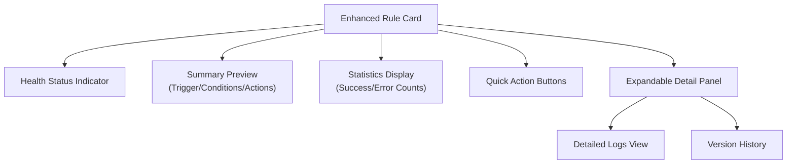

**Diagram sources**
- [AutomationRuleCard.tsx:65-145](file://src/components/automations/AutomationRuleCard.tsx#L65-L145)
- [AutomationRuleCard.tsx:284-295](file://src/components/automations/AutomationRuleCard.tsx#L284-L295)

**Section sources**
- [AutomationRuleCard.tsx:65-145](file://src/components/automations/AutomationRuleCard.tsx#L65-L145)
- [AutomationRuleCard.tsx:284-295](file://src/components/automations/AutomationRuleCard.tsx#L284-L295)

### Global Logging Panel for System-Wide Monitoring
The global logging panel provides comprehensive monitoring across all automation rules:
- **System-Wide Log Viewing** - View execution logs from all automation rules in a single interface
- **Advanced Filtering** - Filter by rule, status (success, error, dry-run, skipped), and date range
- **Detailed Execution Insights** - View trigger payloads, execution details, and action results
- **Export Capabilities** - Export logs to CSV for analysis and reporting
- **Real-Time Updates** - Refresh functionality to see latest execution results

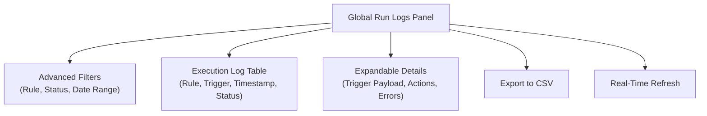

**Diagram sources**
- [GlobalRunLogsPanel.tsx:31-103](file://src/components/automations/GlobalRunLogsPanel.tsx#L31-L103)
- [GlobalRunLogsPanel.tsx:126-261](file://src/components/automations/GlobalRunLogsPanel.tsx#L126-L261)

**Section sources**
- [GlobalRunLogsPanel.tsx:31-103](file://src/components/automations/GlobalRunLogsPanel.tsx#L31-L103)
- [GlobalRunLogsPanel.tsx:126-261](file://src/components/automations/GlobalRunLogsPanel.tsx#L126-L261)

### Advanced Dry-Run Testing with Step-by-Step Visualization
The enhanced dry-run testing provides comprehensive execution simulation:
- **Step-by-Step Execution** - Visualize trigger evaluation, condition checking, and action execution
- **Status Indicators** - Pass/skip/error indicators for each execution step
- **Detailed Results** - View action results, errors, and execution details
- **Interactive Testing** - Test automation rules before deployment with confidence

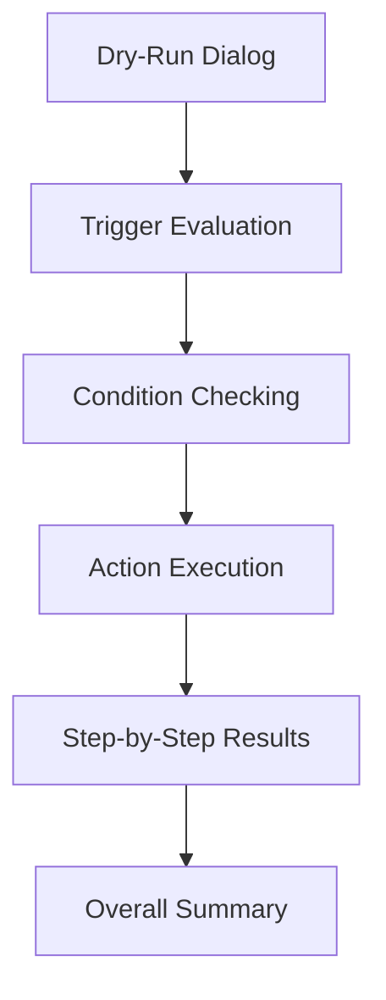

**Diagram sources**
- [DryRunDialog.tsx:18-82](file://src/components/automations/DryRunDialog.tsx#L18-L82)
- [DryRunDialog.tsx:85-112](file://src/components/automations/DryRunDialog.tsx#L85-L112)

**Section sources**
- [DryRunDialog.tsx:18-82](file://src/components/automations/DryRunDialog.tsx#L18-L82)
- [DryRunDialog.tsx:85-112](file://src/components/automations/DryRunDialog.tsx#L85-L112)

### Enhanced Action Types and Configurations
The system supports comprehensive action types with enhanced configuration options:
- **Email Actions** - Send emails with recipient, subject, body, and HTML support
- **Ticket Operations** - Update ticket status, assign tickets, and manage ticket lifecycle
- **Notification Systems** - Create in-app notifications with customizable types, titles, and links
- **Device Management** - Update device statuses and track asset lifecycle
- **Conditional Logic** - Actions can be configured to work with trigger-provided IDs or manual inputs

Each action type includes comprehensive configuration schemas validated before execution, with support for dynamic field resolution from trigger payloads.

**Section sources**
- [ActionsStep.tsx:29-44](file://src/components/automations/steps/ActionsStep.tsx#L29-L44)
- [ActionsStep.tsx:112-281](file://src/components/automations/steps/ActionsStep.tsx#L112-L281)

### Enhanced Run Management and Monitoring
The enhanced monitoring system provides comprehensive execution tracking:
- **Manual Runs and Dry Runs** - Initiated via wizard interface with step-by-step feedback
- **Health Monitoring** - Real-time health status tracking with automatic status indicators
- **Statistics Computation** - Automated computation of success/error rates and performance metrics
- **Enhanced Logging** - Structured action results, error details, and execution timelines
- **Dashboard Integration** - KPI components for performance tracking and trend analysis

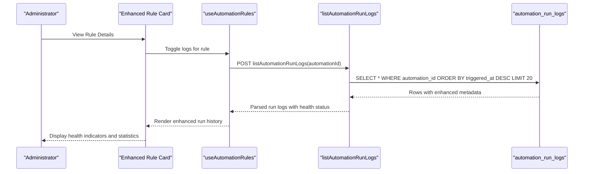

**Diagram sources**
- [useAutomationRules.ts:300-316](file://src/hooks/useAutomationRules.ts#L300-L316)
- [automation-runs.ts:77-92](file://src/lib/automation-runs.ts#L77-L92)
- [AutomationRuleCard.tsx:40-63](file://src/components/automations/AutomationRuleCard.tsx#L40-L63)

**Section sources**
- [useAutomationRules.ts:300-316](file://src/hooks/useAutomationRules.ts#L300-L316)
- [automation-runs.ts:77-92](file://src/lib/automation-runs.ts#L77-L92)
- [automation-runs.ts:144-210](file://src/lib/automation-runs.ts#L144-L210)
- [AutomationRuleCard.tsx:40-63](file://src/components/automations/AutomationRuleCard.tsx#L40-L63)

### Database Schema and Views
The database schema supports the enhanced automation system:
- **automation_flows**: Stores rule metadata, flow_definition with wizard snapshots, and enhanced metadata
- **automation_run_logs**: Stores execution results with enhanced status tracking and detailed action results
- **automation_runs**: Enhanced view with comprehensive run information for reporting and monitoring

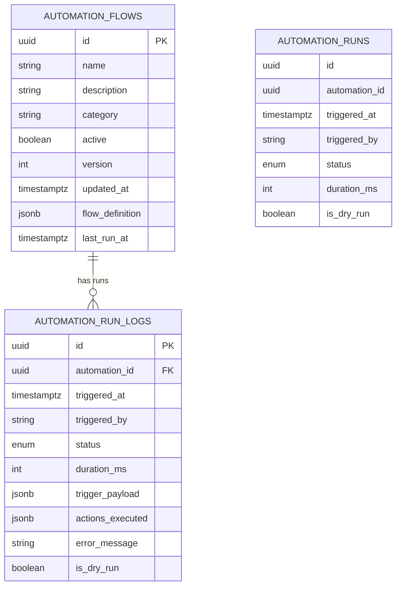

**Diagram sources**
- [20260504123000_create_automation_flows.sql](file://supabase/migrations/20260504123000_create_automation_flows.sql)
- [20260507133000_automation_run_logs.sql](file://supabase/migrations/20260507133000_automation_run_logs.sql)
- [20260515160000_automation_runs_view.sql](file://supabase/migrations/20260515160000_automation_runs_view.sql)

**Section sources**
- [20260504123000_create_automation_flows.sql](file://supabase/migrations/20260504123000_create_automation_flows.sql)
- [20260507133000_automation_run_logs.sql](file://supabase/migrations/20260507133000_automation_run_logs.sql)
- [20260515160000_automation_runs_view.sql](file://supabase/migrations/20260515160000_automation_runs_view.sql)

## Wizard-Based Rule Management

### Five-Step Process Overview
The wizard interface guides users through a structured five-step process for creating automation rules:

**Step 1: Trigger Selection**
- Choose from comprehensive trigger types: ticket creation, ticket updates, checklist completion, scheduled execution, or manual triggers
- Each trigger type includes contextual help and configuration options
- Scheduled triggers support cron expressions for precise timing control

**Step 2: Conditions Configuration**
- Add optional logical conditions using various comparison operators
- Supports field-based comparisons, priority checks, and tag-based filtering
- Conditions can be reordered and logically combined for complex rule logic

**Step 3: Action Configuration**
- Configure multiple action types with comprehensive parameter sets
- Actions automatically resolve IDs from trigger payloads when available
- Supports both immediate execution and deferred operations

**Step 4: Scheduling Setup**
- Configure optional scheduling for recurring automation execution
- Supports cron expressions for precise timing control
- Includes interval-based scheduling for regular execution intervals

**Step 5: Review and Validation**
- Comprehensive preview of the complete rule configuration
- Automatic validation of required fields and logical consistency
- Change notes for version tracking and audit trail

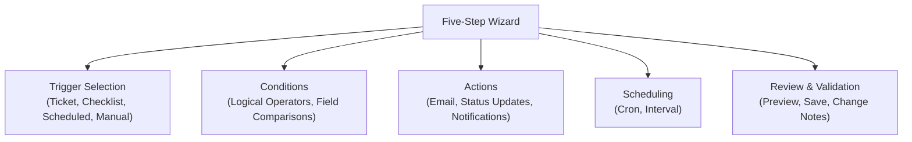

**Diagram sources**
- [AutomationWizard.tsx:15-21](file://src/components/automations/AutomationWizard.tsx#L15-L21)
- [TriggerStep.tsx:4-45](file://src/components/automations/steps/TriggerStep.tsx#L4-L45)
- [ConditionsStep.tsx:8-18](file://src/components/automations/steps/ConditionsStep.tsx#L8-L18)
- [ActionsStep.tsx:7-27](file://src/components/automations/steps/ActionsStep.tsx#L7-L27)
- [ScheduleStep.tsx:14-23](file://src/components/automations/steps/ScheduleStep.tsx#L14-L23)

**Section sources**
- [AutomationWizard.tsx:15-21](file://src/components/automations/AutomationWizard.tsx#L15-L21)
- [TriggerStep.tsx:4-45](file://src/components/automations/steps/TriggerStep.tsx#L4-L45)
- [ConditionsStep.tsx:8-18](file://src/components/automations/steps/ConditionsStep.tsx#L8-L18)
- [ActionsStep.tsx:7-27](file://src/components/automations/steps/ActionsStep.tsx#L7-L27)
- [ScheduleStep.tsx:14-23](file://src/components/automations/steps/ScheduleStep.tsx#L14-L23)
- [ReviewStep.tsx:94-191](file://src/components/automations/steps/ReviewStep.tsx#L94-L191)

### Wizard Metadata and Traceability
The wizard generates comprehensive metadata for each rule:
- **Wizard Snapshot** - Complete configuration captured at creation time
- **Summary Generation** - Automatic rule summaries for quick identification
- **Change Tracking** - Version numbers and change notes for audit purposes
- **Configuration Validation** - Built-in validation during the wizard process

**Section sources**
- [AutomationWizard.tsx:83-97](file://src/components/automations/AutomationWizard.tsx#L83-L97)
- [ReviewStep.tsx:94-102](file://src/components/automations/steps/ReviewStep.tsx#L94-L102)

## Enhanced Monitoring and Dashboard

### Health Monitoring and Status Indicators
The enhanced monitoring system provides comprehensive health tracking:
- **Real-Time Health Status** - Automatic calculation of rule health based on execution patterns
- **Visual Indicators** - Color-coded badges showing healthy, degraded, or error states
- **Performance Metrics** - Success rates, error rates, and execution timing analysis
- **Trend Analysis** - Historical performance tracking for optimization

### KPI Dashboard Components
The system includes specialized KPI components for performance tracking:
- **Automated Value Display** - Clean, readable displays for key performance metrics
- **Trend Indicators** - Visual indicators showing performance improvements or declines
- **Color-Coded Status** - Green for positive trends, red for negative trends, neutral for stable
- **Flexible Configuration** - Support for various metric types and display formats

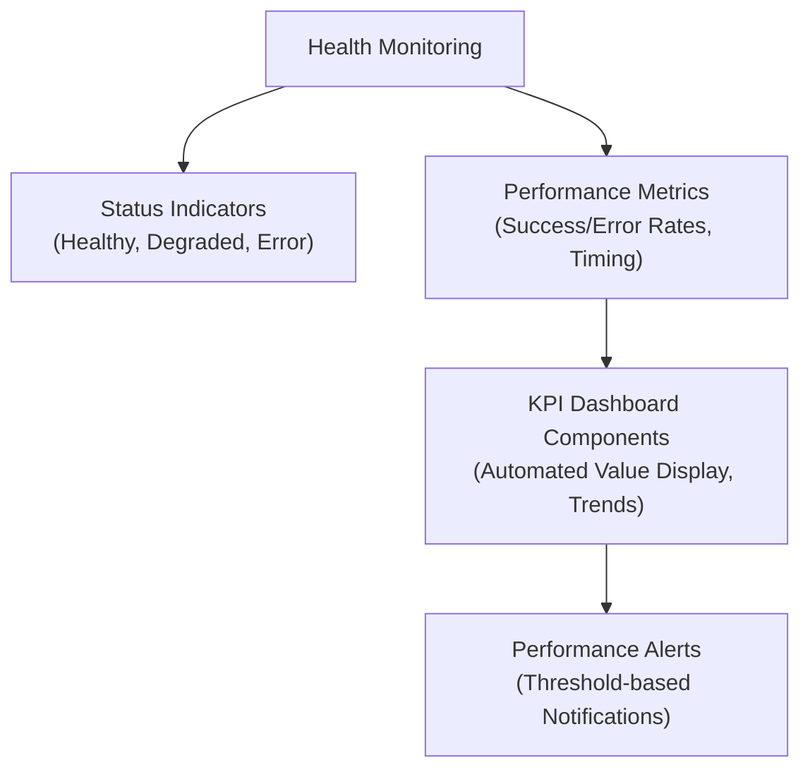

**Diagram sources**
- [AutomationRuleCard.tsx:40-63](file://src/components/automations/AutomationRuleCard.tsx#L40-L63)
- [AutomationKpiCard.tsx:4-51](file://src/components/automations/AutomationKpiCard.tsx#L4-L51)

**Section sources**
- [AutomationRuleCard.tsx:40-63](file://src/components/automations/AutomationRuleCard.tsx#L40-L63)
- [AutomationKpiCard.tsx:4-51](file://src/components/automations/AutomationKpiCard.tsx#L4-L51)

### Global Monitoring and Filtering
The global logging panel provides enterprise-level monitoring capabilities:
- **System-Wide Visibility** - View all automation rule executions in a unified interface
- **Advanced Filtering** - Filter by rule, status, date range, and execution type
- **Export Functionality** - Export execution logs for analysis and compliance
- **Real-Time Updates** - Automatic refresh to show latest execution results
- **Detailed Execution Analysis** - View trigger payloads, action results, and error details

**Section sources**
- [GlobalRunLogsPanel.tsx:31-103](file://src/components/automations/GlobalRunLogsPanel.tsx#L31-L103)
- [GlobalRunLogsPanel.tsx:126-261](file://src/components/automations/GlobalRunLogsPanel.tsx#L126-L261)

## Dependency Analysis
The enhanced automation system maintains clear dependency relationships:
- **UI Components** depend on hooks for data fetching and mutations
- **Wizard Interface** coordinates step-by-step configuration with validation
- **Rule Cards** integrate with monitoring systems for health status display
- **Global Logs Panel** provides centralized monitoring across all rules
- **Hooks** depend on server functions for run execution and stats
- **Server Functions** depend on the execution engine and database access
- **Execution Engine** depends on action schemas and external services (email, notifications)

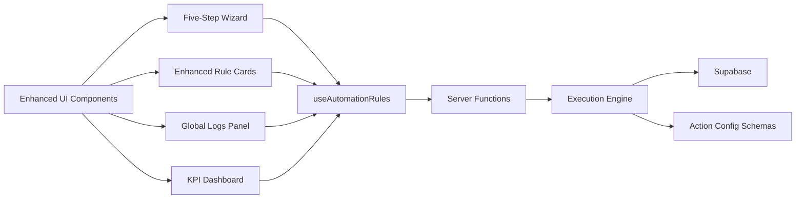

**Diagram sources**
- [AutomationWizard.tsx:1-261](file://src/components/automations/AutomationWizard.tsx#L1-L261)
- [AutomationRuleCard.tsx:1-299](file://src/components/automations/AutomationRuleCard.tsx#L1-L299)
- [GlobalRunLogsPanel.tsx:1-300](file://src/components/automations/GlobalRunLogsPanel.tsx#L1-L300)
- [AutomationKpiCard.tsx:1-52](file://src/components/automations/AutomationKpiCard.tsx#L1-L52)
- [useAutomationRules.ts:1-413](file://src/hooks/useAutomationRules.ts#L1-L413)
- [automation-runs.ts:1-211](file://src/lib/automation-runs.ts#L1-L211)
- [automation-runs.server.ts:1-800](file://src/lib/automation-runs.server.ts#L1-L800)

**Section sources**
- [AutomationWizard.tsx:1-261](file://src/components/automations/AutomationWizard.tsx#L1-L261)
- [AutomationRuleCard.tsx:1-299](file://src/components/automations/AutomationRuleCard.tsx#L1-L299)
- [GlobalRunLogsPanel.tsx:1-300](file://src/components/automations/GlobalRunLogsPanel.tsx#L1-L300)
- [AutomationKpiCard.tsx:1-52](file://src/components/automations/AutomationKpiCard.tsx#L1-L52)
- [useAutomationRules.ts:1-413](file://src/hooks/useAutomationRules.ts#L1-L413)
- [automation-runs.ts:1-211](file://src/lib/automation-runs.ts#L1-L211)
- [automation-runs.server.ts:1-800](file://src/lib/automation-runs.server.ts#L1-L800)

## Performance Considerations
The enhanced automation system includes several performance optimizations:
- **Efficient Rule Loading** - Wizard metadata enables faster rule loading and rendering
- **Optimized Monitoring Queries** - Global logs panel uses efficient filtering and pagination
- **Health Status Caching** - Rule cards cache health status to reduce API calls
- **Lazy Loading** - Expanded detail panels load on demand to improve initial page performance
- **Minimal Branching** - Wizard interface encourages simple rule designs for better performance
- **Dry-Run Optimization** - Step-by-step dry-run testing helps identify performance issues early
- **Archival Strategy** - Inactive rules can be archived to reduce query volume on automation_flows

## Troubleshooting Guide
Enhanced troubleshooting capabilities address common automation issues:

**Enhanced Automation Conflicts**
- **Cause**: Multiple rules targeting the same event or resource
- **Resolution**: Use wizard's validation features and global logs panel to identify conflicts
- **Prevention**: Leverage rule categorization and scheduling to avoid overlap

**Execution Failures**
- **Cause**: Invalid action configuration, missing IDs in payload, or external service errors
- **Resolution**: Use dry-run testing for step-by-step failure analysis
- **Monitoring**: Global logs panel provides detailed error information and execution traces

**Performance Bottlenecks**
- **Cause**: Complex conditions, deep action chains, or inefficient scheduling
- **Resolution**: Use health monitoring to identify slow-running rules
- **Optimization**: Simplify wizard configurations, leverage caching, and optimize action sequences

**Dry-Run Discrepancies**
- **Cause**: Differences between simulation and actual execution environments
- **Resolution**: Use advanced dry-run testing with step-by-step visualization
- **Validation**: Test with realistic trigger payloads and edge cases

**Enhanced Debugging Techniques**
- **Wizard Validation**: Use built-in validation to catch configuration errors early
- **Global Logs Panel**: Filter and analyze execution logs across all rules
- **Health Monitoring**: Track rule performance trends and identify degradation
- **KPI Dashboards**: Monitor key performance indicators for system-wide health
- **Change Tracking**: Use version history to identify when issues were introduced

**Section sources**
- [useAutomationRules.ts:300-349](file://src/hooks/useAutomationRules.ts#L300-L349)
- [automation-runs.ts:144-210](file://src/lib/automation-runs.ts#L144-L210)
- [automation-runs.server.ts:198-225](file://src/lib/automation-runs.server.ts#L198-L225)
- [DryRunDialog.tsx:18-82](file://src/components/automations/DryRunDialog.tsx#L18-L82)
- [GlobalRunLogsPanel.tsx:31-103](file://src/components/automations/GlobalRunLogsPanel.tsx#L31-L103)

## Conclusion
The enhanced automation system provides a comprehensive, enterprise-grade solution for rule-based workflow automation. The five-step wizard interface simplifies complex automation rule creation, while enhanced monitoring capabilities provide deep visibility into system performance. The global logging panel, health monitoring, and KPI dashboards enable effective oversight and optimization. Administrators benefit from intuitive rule management interfaces, while developers gain powerful extension points for custom actions and integrations. The system's robust execution engine ensures reliable logging and monitoring, supporting both day-to-day operations and strategic automation initiatives.

## Appendices

### Enhanced Trigger Types
The wizard interface supports comprehensive trigger types:
- **Ticket Created** - When new tickets are opened
- **Ticket Updated** - When existing tickets are modified
- **Checklist Completed** - When preparation checklists are finished
- **Scheduled Execution** - Cron-based timed execution
- **Manual Trigger** - Human-initiated execution

These triggers are presented through an intuitive card-based interface with visual indicators and configuration options.

**Section sources**
- [TriggerStep.tsx:4-45](file://src/components/automations/steps/TriggerStep.tsx#L4-L45)
- [AutomationWizard.tsx:15-21](file://src/components/automations/AutomationWizard.tsx#L15-L21)

### Enhanced Action Types and Configuration
The wizard supports comprehensive action types with detailed configuration:
- **Email Actions** - Recipient, subject, body, HTML support
- **Ticket Operations** - Status updates, assignment management
- **Notification Systems** - In-app notifications with customizable types
- **Device Management** - Status updates and lifecycle tracking
- **Conditional Processing** - Automatic ID resolution from trigger payloads

Each action type includes comprehensive configuration schemas validated during the wizard process.

**Section sources**
- [ActionsStep.tsx:29-44](file://src/components/automations/steps/ActionsStep.tsx#L29-L44)
- [ActionsStep.tsx:112-281](file://src/components/automations/steps/ActionsStep.tsx#L112-L281)

### Enhanced Configuration Options
The wizard-based system provides comprehensive configuration options:
- **Rule Metadata** - Name, description, category, active status, version tracking
- **Flow Definition** - Enhanced with wizard snapshots, validation, and summary generation
- **Action Configurations** - Strict schemas for each action type with validation
- **Scheduling Options** - Cron expressions and interval-based scheduling
- **Change Tracking** - Version numbers and change notes for audit trails

**Section sources**
- [automation.ts:23-36](file://src/types/automation.ts#L23-L36)
- [automation.ts:4-19](file://src/types/automation.ts#L4-L19)
- [AutomationWizard.tsx:83-97](file://src/components/automations/AutomationWizard.tsx#L83-L97)

### Enhanced Relationships Between Rules, Workflows, and Events
The enhanced system maintains clear relationships between automation components:
- **Rules** are stored in automation_flows with wizard metadata and enhanced tracking
- **Ticket/Device Events** feed trigger payloads that drive flow execution
- **Global Logs** connect executions to rules with comprehensive audit trails
- **Health Monitoring** tracks rule performance and system-wide automation health
- **KPI Dashboards** provide performance insights and trend analysis

**Section sources**
- [automations.ts:1-179](file://src/lib/queries/automations.ts#L1-L179)
- [automation-runs.server.ts:59-207](file://src/lib/automation-runs.server.ts#L59-L207)
- [GlobalRunLogsPanel.tsx:126-261](file://src/components/automations/GlobalRunLogsPanel.tsx#L126-L261)