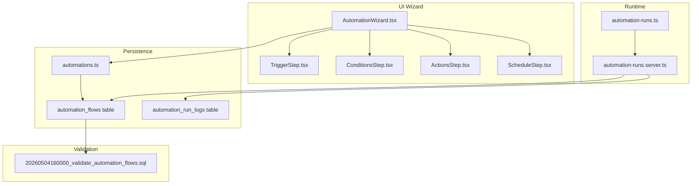
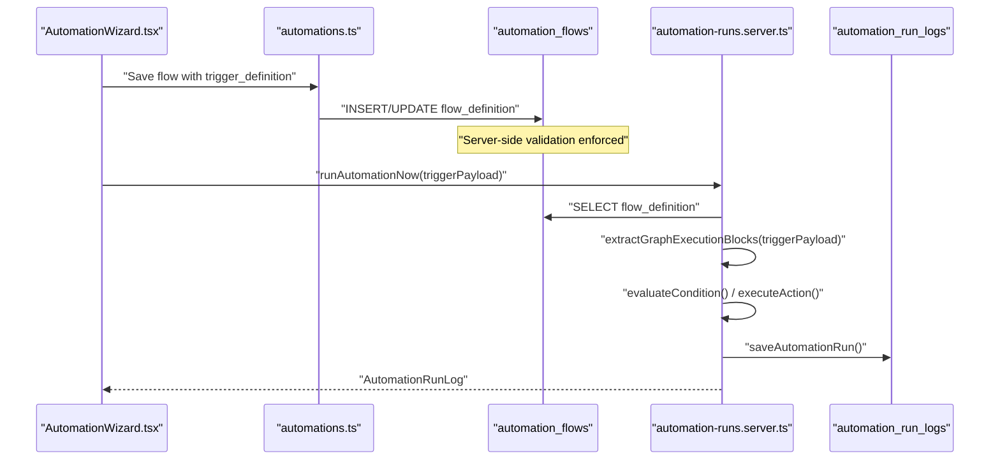
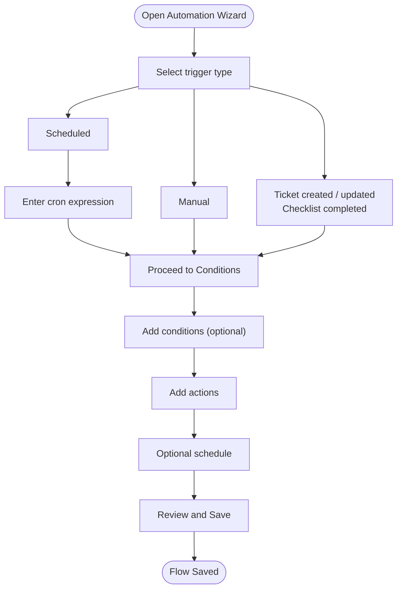
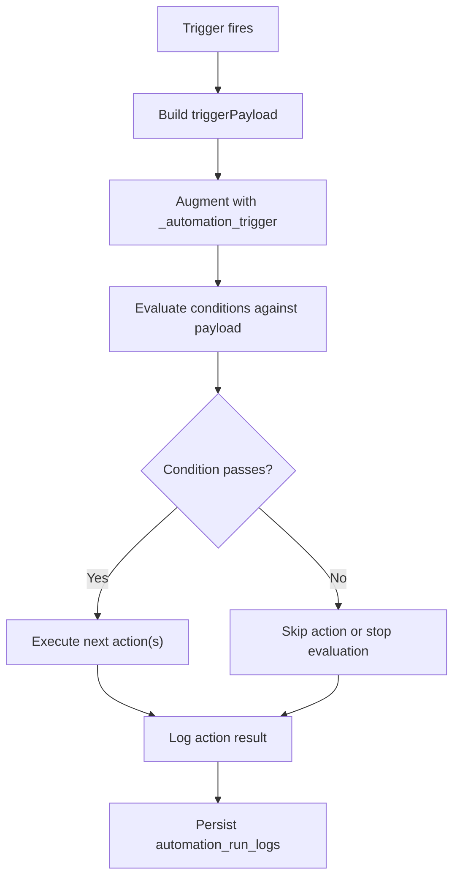
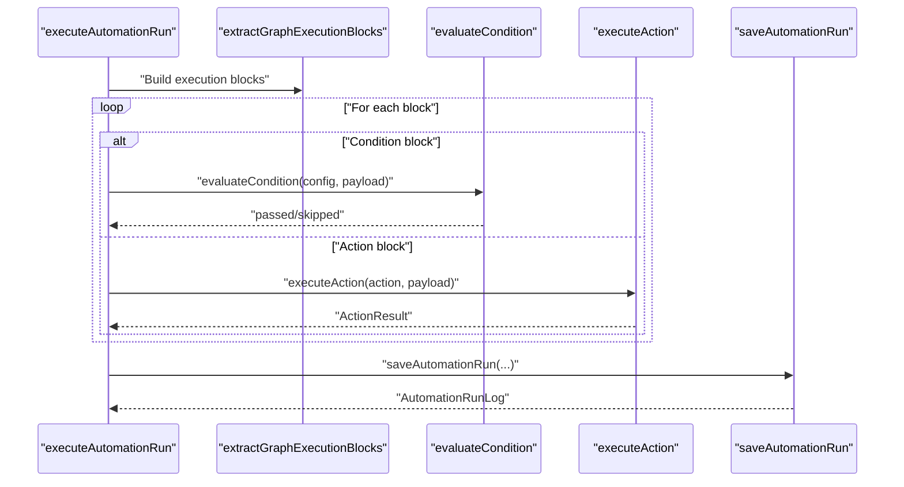
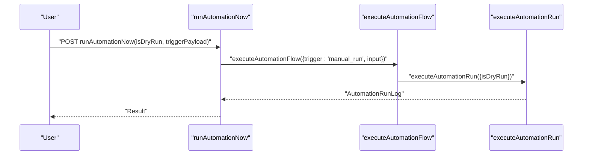
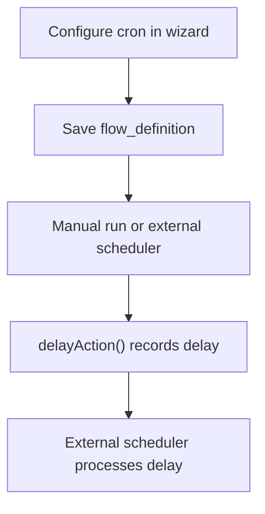
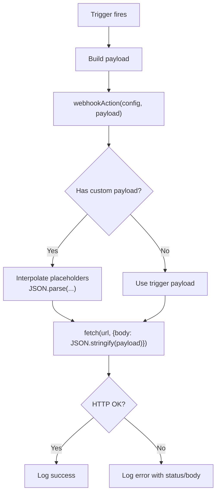
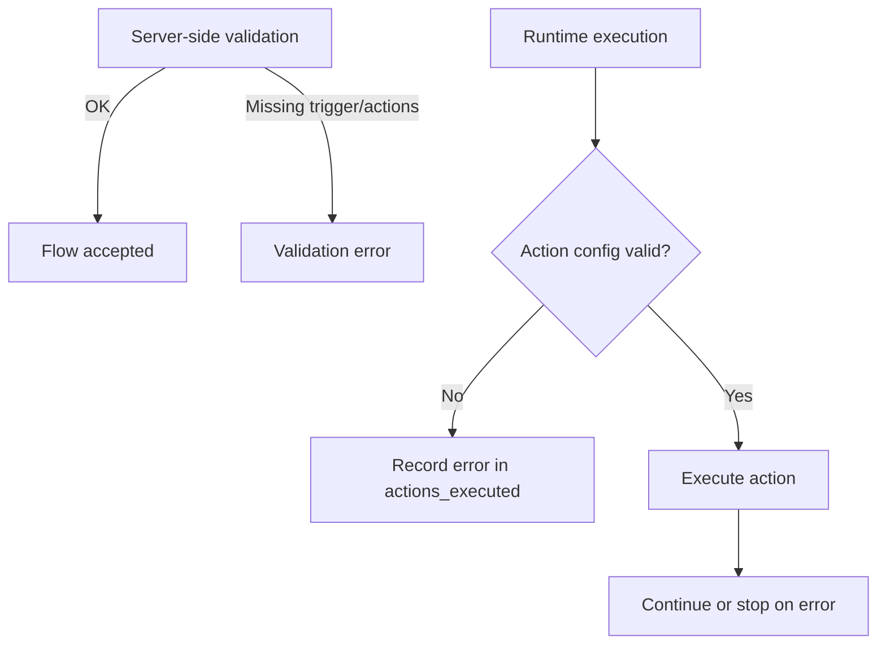
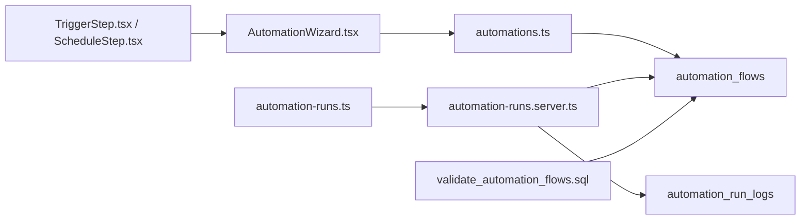

# Automation Triggers

<cite>
**Referenced Files in This Document**
- [TriggerStep.tsx](file://src/components/automations/steps/TriggerStep.tsx)
- [ScheduleStep.tsx](file://src/components/automations/steps/ScheduleStep.tsx)
- [AutomationWizard.tsx](file://src/components/automations/AutomationWizard.tsx)
- [automation.ts](file://src/types/automation.ts)
- [automation-runs.ts](file://src/lib/automation-runs.ts)
- [automation-runs.server.ts](file://src/lib/automation-runs.server.ts)
- [automations.ts](file://src/lib/queries/automations.ts)
- [20260504160000_validate_automation_flows.sql](file://supabase/migrations/20260504160000_validate_automation_flows.sql)
</cite>

## Table of Contents
1. [Introduction](#introduction)
2. [Project Structure](#project-structure)
3. [Core Components](#core-components)
4. [Architecture Overview](#architecture-overview)
5. [Detailed Component Analysis](#detailed-component-analysis)
6. [Dependency Analysis](#dependency-analysis)
7. [Performance Considerations](#performance-considerations)
8. [Troubleshooting Guide](#troubleshooting-guide)
9. [Conclusion](#conclusion)

## Introduction
This document explains how automation triggers are configured and managed in the system. It covers supported trigger types (manual, system events, scheduled, and webhook-based), the trigger payload structure, trigger evaluation and flow execution, validation and error handling, performance characteristics, conflict resolution, priority handling, and best practices. It also provides concrete configuration examples for common scenarios such as ticket creation, status changes, and device assignments.

## Project Structure
The automation trigger system spans UI wizard components, runtime execution logic, and backend validation. The UI wizard captures trigger, condition, and action definitions, which are persisted into the automation flows table. The runtime executes flows based on triggers and payloads, logging outcomes and notifying failures.

**Diagram sources**
- [AutomationWizard.tsx:13-86](file://src/components/automations/AutomationWizard.tsx#L13-L86)
- [TriggerStep.tsx:14-39](file://src/components/automations/steps/TriggerStep.tsx#L14-L39)
- [ScheduleStep.tsx:15-35](file://src/components/automations/steps/ScheduleStep.tsx#L15-L35)
- [automation-runs.ts:77-142](file://src/lib/automation-runs.ts#L77-L142)
- [automation-runs.server.ts:59-207](file://src/lib/automation-runs.server.ts#L59-L207)
- [automations.ts:4-66](file://src/lib/queries/automations.ts#L4-L66)
- [20260504160000_validate_automation_flows.sql:6-50](file://supabase/migrations/20260504160000_validate_automation_flows.sql#L6-L50)

**Section sources**
- [AutomationWizard.tsx:13-86](file://src/components/automations/AutomationWizard.tsx#L13-L86)
- [TriggerStep.tsx:14-39](file://src/components/automations/steps/TriggerStep.tsx#L14-L39)
- [ScheduleStep.tsx:15-35](file://src/components/automations/steps/ScheduleStep.tsx#L15-L35)
- [automation-runs.ts:77-142](file://src/lib/automation-runs.ts#L77-L142)
- [automation-runs.server.ts:59-207](file://src/lib/automation-runs.server.ts#L59-L207)
- [automations.ts:4-66](file://src/lib/queries/automations.ts#L4-L66)
- [20260504160000_validate_automation_flows.sql:6-50](file://supabase/migrations/20260504160000_validate_automation_flows.sql#L6-L50)

## Core Components
- Trigger definition capture: The wizard collects a trigger type and optional configuration (for example, cron expressions for scheduled triggers).
- Flow definition persistence: The wizard composes a flow definition containing trigger, conditions, actions, and optional schedule metadata, saved to the automation_flows table.
- Runtime execution: The runtime loads a flow, evaluates conditions against the trigger payload, and executes actions. It logs outcomes to automation_run_logs.
- Validation: A server-side migration enforces that flows include either a wizard-based trigger/actions or nodes-based trigger/actions.

Key types and schemas:
- AutomationRunLog and related types define the shape of run logs and action results.
- Run-time input schemas define how manual runs and dry runs are invoked.

**Section sources**
- [TriggerStep.tsx:14-39](file://src/components/automations/steps/TriggerStep.tsx#L14-L39)
- [AutomationWizard.tsx:74-86](file://src/components/automations/AutomationWizard.tsx#L74-L86)
- [automation.ts:47-72](file://src/types/automation.ts#L47-L72)
- [automation-runs.ts:66-75](file://src/lib/automation-runs.ts#L66-L75)
- [20260504160000_validate_automation_flows.sql:6-50](file://supabase/migrations/20260504160000_validate_automation_flows.sql#L6-L50)

## Architecture Overview
The trigger lifecycle:
- UI captures trigger configuration and persists it as part of the flow definition.
- Manual or scheduled triggers initiate runtime execution.
- The runtime evaluates conditions against the trigger payload and executes actions.
- Outcomes are logged and failures are surfaced to administrators.

**Diagram sources**
- [AutomationWizard.tsx:74-86](file://src/components/automations/AutomationWizard.tsx#L74-L86)
- [automations.ts:37-66](file://src/lib/queries/automations.ts#L37-L66)
- [automation-runs.server.ts:94-207](file://src/lib/automation-runs.server.ts#L94-L207)
- [20260504160000_validate_automation_flows.sql:6-50](file://supabase/migrations/20260504160000_validate_automation_flows.sql#L6-L50)

## Detailed Component Analysis

### Trigger Types and Configuration
Supported trigger types captured in the UI include:
- Ticket created
- Ticket updated
- Checklist completed
- Scheduled

Scheduled triggers accept a cron expression. The wizard stores the trigger definition alongside conditions and actions.

**Diagram sources**
- [TriggerStep.tsx:14-39](file://src/components/automations/steps/TriggerStep.tsx#L14-L39)
- [ScheduleStep.tsx:15-35](file://src/components/automations/steps/ScheduleStep.tsx#L15-L35)
- [AutomationWizard.tsx:74-86](file://src/components/automations/AutomationWizard.tsx#L74-L86)

**Section sources**
- [TriggerStep.tsx:14-39](file://src/components/automations/steps/TriggerStep.tsx#L14-L39)
- [ScheduleStep.tsx:15-35](file://src/components/automations/steps/ScheduleStep.tsx#L15-L35)
- [AutomationWizard.tsx:74-86](file://src/components/automations/AutomationWizard.tsx#L74-L86)

### Trigger Payload Structure and Event Data Formats
Triggers carry a structured payload that actions consume. The runtime augments the payload with a trigger identifier and passes it through the flow evaluation and action execution pipeline. The payload supports nested fields accessed via dot notation for conditions.

- Trigger payload augmentation: The runtime adds a trigger identifier to the payload before evaluation.
- Access patterns: Conditions evaluate fields using dot notation against the payload.
- Example fields commonly present: identifiers such as ticket_id, assignee_id, and other entity identifiers depending on the trigger source.

**Diagram sources**
- [automation-runs.server.ts:66-76](file://src/lib/automation-runs.server.ts#L66-L76)
- [automation-runs.server.ts:387-404](file://src/lib/automation-runs.server.ts#L387-L404)

**Section sources**
- [automation-runs.server.ts:66-76](file://src/lib/automation-runs.server.ts#L66-L76)
- [automation-runs.server.ts:387-404](file://src/lib/automation-runs.server.ts#L387-L404)

### Trigger Evaluation and Flow Execution Engine
The runtime extracts execution blocks from the flow definition and evaluates them in order:
- Extracts trigger and action blocks from either wizard metadata or nodes graph.
- Evaluates conditions against the trigger payload; if a condition fails, subsequent actions may be skipped.
- Executes actions and records results; errors terminate the run and are logged.

**Diagram sources**
- [automation-runs.server.ts:94-207](file://src/lib/automation-runs.server.ts#L94-L207)
- [automation-runs.server.ts:301-341](file://src/lib/automation-runs.server.ts#L301-L341)
- [automation-runs.server.ts:362-385](file://src/lib/automation-runs.server.ts#L362-L385)
- [automation-runs.server.ts:990-1050](file://src/lib/automation-runs.server.ts#L990-L1050)

**Section sources**
- [automation-runs.server.ts:94-207](file://src/lib/automation-runs.server.ts#L94-L207)
- [automation-runs.server.ts:301-341](file://src/lib/automation-runs.server.ts#L301-L341)
- [automation-runs.server.ts:362-385](file://src/lib/automation-runs.server.ts#L362-L385)
- [automation-runs.server.ts:990-1050](file://src/lib/automation-runs.server.ts#L990-L1050)

### Manual Triggers
Manual triggers are initiated by users through the UI or APIs. They support:
- Immediate execution with optional trigger payload.
- Dry-run mode to preview outcomes without side effects.

**Diagram sources**
- [automation-runs.ts:94-108](file://src/lib/automation-runs.ts#L94-L108)
- [automation-runs.ts:128-142](file://src/lib/automation-runs.ts#L128-L142)
- [automation-runs.server.ts:59-76](file://src/lib/automation-runs.server.ts#L59-L76)
- [automation-runs.server.ts:94-207](file://src/lib/automation-runs.server.ts#L94-L207)

**Section sources**
- [automation-runs.ts:94-108](file://src/lib/automation-runs.ts#L94-L108)
- [automation-runs.ts:128-142](file://src/lib/automation-runs.ts#L128-L142)
- [automation-runs.server.ts:59-76](file://src/lib/automation-runs.server.ts#L59-L76)
- [automation-runs.server.ts:94-207](file://src/lib/automation-runs.server.ts#L94-L207)

### System Events
System events are represented by trigger types such as “Ticket created” and “Ticket updated.” These are selected in the wizard and stored in the flow definition. The payload delivered to actions includes identifiers and attributes relevant to the triggering event.

Common payload fields:
- ticket_id
- assignee_id
- customer_email
- requester_email
- recipient_email
- device_id (for device-related triggers)

**Section sources**
- [TriggerStep.tsx:20-23](file://src/components/automations/steps/TriggerStep.tsx#L20-L23)
- [automation-runs.server.ts:584-594](file://src/lib/automation-runs.server.ts#L584-L594)

### Scheduled Triggers
Scheduled triggers are configured with a cron expression in the wizard. The UI exposes a cron input for “Scheduled” type triggers. The runtime does not implement a scheduler internally; delayed actions are recorded and require a dedicated queue/scheduler to process deferred execution.

**Diagram sources**
- [ScheduleStep.tsx:27-35](file://src/components/automations/steps/ScheduleStep.tsx#L27-L35)
- [automation-runs.server.ts:878-912](file://src/lib/automation-runs.server.ts#L878-L912)

**Section sources**
- [ScheduleStep.tsx:27-35](file://src/components/automations/steps/ScheduleStep.tsx#L27-L35)
- [automation-runs.server.ts:878-912](file://src/lib/automation-runs.server.ts#L878-L912)

### Webhook-Based Triggers
Webhooks are implemented as actions. While not a trigger type itself, webhooks can be invoked by actions in response to a trigger. The webhook action supports:
- A URL endpoint.
- Optional templated payload construction using placeholders for trigger type and ticket_id.

**Diagram sources**
- [automation-runs.server.ts:914-988](file://src/lib/automation-runs.server.ts#L914-L988)

**Section sources**
- [automation-runs.server.ts:914-988](file://src/lib/automation-runs.server.ts#L914-L988)

### Trigger Validation and Error Handling
- Server-side validation ensures flows include either wizard-based definitions or nodes-based trigger/action blocks.
- Runtime validation of action configurations occurs before execution; invalid configurations produce errors recorded in the run log.
- Dry-run mode simulates trigger, conditions, and actions without side effects, surfacing potential issues before activation.

**Diagram sources**
- [20260504160000_validate_automation_flows.sql:6-50](file://supabase/migrations/20260504160000_validate_automation_flows.sql#L6-L50)
- [automation-runs.server.ts:990-1050](file://src/lib/automation-runs.server.ts#L990-L1050)

**Section sources**
- [20260504160000_validate_automation_flows.sql:6-50](file://supabase/migrations/20260504160000_validate_automation_flows.sql#L6-L50)
- [automation-runs.server.ts:990-1050](file://src/lib/automation-runs.server.ts#L990-L1050)

### Examples of Trigger Configurations
Below are concrete configuration scenarios expressed as flow definitions. Replace placeholders with actual values and adjust action configurations accordingly.

- Ticket creation trigger
  - Trigger: Select “Ticket created”
  - Conditions: Optionally filter by status or requester email
  - Actions: Update ticket status, send email, assign technician
  - Payload fields: ticket_id, requester_email

- Ticket status change trigger
  - Trigger: Select “Ticket updated”
  - Conditions: Filter by status transition (e.g., from pending to in-progress)
  - Actions: Create notification, send email
  - Payload fields: ticket_id, assignee_id

- Device assignment trigger
  - Trigger: System event (device assignment)
  - Conditions: Verify device_id and target status
  - Actions: Update device status, notify admins
  - Payload fields: device_id, assignee_id

These examples correspond to the supported action types and payload resolution logic.

**Section sources**
- [TriggerStep.tsx:20-23](file://src/components/automations/steps/TriggerStep.tsx#L20-L23)
- [automation-runs.server.ts:676-714](file://src/lib/automation-runs.server.ts#L676-L714)
- [automation-runs.server.ts:838-876](file://src/lib/automation-runs.server.ts#L838-L876)
- [automation-runs.server.ts:878-912](file://src/lib/automation-runs.server.ts#L878-L912)
- [automation-runs.server.ts:914-988](file://src/lib/automation-runs.server.ts#L914-L988)

### Trigger Conflict Resolution and Priority Handling
- The runtime follows a deterministic execution order derived from the flow graph (trigger → conditions → actions). There is no explicit priority mechanism; execution proceeds sequentially along the graph.
- If multiple conditions are present, each condition is evaluated in order, and the flow branches according to the result of each condition.
- To avoid conflicts, design flows so that mutually exclusive conditions are ordered appropriately and that side effects are idempotent where possible.

**Section sources**
- [automation-runs.server.ts:301-341](file://src/lib/automation-runs.server.ts#L301-L341)
- [automation-runs.server.ts:362-385](file://src/lib/automation-runs.server.ts#L362-L385)

## Dependency Analysis
The automation system integrates UI, runtime, persistence, and validation layers.

**Diagram sources**
- [TriggerStep.tsx:14-39](file://src/components/automations/steps/TriggerStep.tsx#L14-L39)
- [ScheduleStep.tsx:15-35](file://src/components/automations/steps/ScheduleStep.tsx#L15-L35)
- [AutomationWizard.tsx:74-86](file://src/components/automations/AutomationWizard.tsx#L74-L86)
- [automations.ts:4-66](file://src/lib/queries/automations.ts#L4-L66)
- [automation-runs.ts:77-142](file://src/lib/automation-runs.ts#L77-L142)
- [automation-runs.server.ts:59-207](file://src/lib/automation-runs.server.ts#L59-L207)
- [20260504160000_validate_automation_flows.sql:6-50](file://supabase/migrations/20260504160000_validate_automation_flows.sql#L6-L50)

**Section sources**
- [TriggerStep.tsx:14-39](file://src/components/automations/steps/TriggerStep.tsx#L14-L39)
- [ScheduleStep.tsx:15-35](file://src/components/automations/steps/ScheduleStep.tsx#L15-L35)
- [AutomationWizard.tsx:74-86](file://src/components/automations/AutomationWizard.tsx#L74-L86)
- [automations.ts:4-66](file://src/lib/queries/automations.ts#L4-L66)
- [automation-runs.ts:77-142](file://src/lib/automation-runs.ts#L77-L142)
- [automation-runs.server.ts:59-207](file://src/lib/automation-runs.server.ts#L59-L207)
- [20260504160000_validate_automation_flows.sql:6-50](file://supabase/migrations/20260504160000_validate_automation_flows.sql#L6-L50)

## Performance Considerations
- Keep flows concise: Limit the number of conditions and actions to reduce evaluation overhead.
- Use dry-run before activation to catch expensive or redundant steps early.
- Avoid heavy computations inside actions; delegate to background jobs where appropriate.
- Monitor run logs for slow actions and adjust scheduling or batching.

## Troubleshooting Guide
Common issues and resolutions:
- Flow fails validation on save
  - Cause: Missing trigger or actions in flow definition.
  - Resolution: Ensure wizard-based or nodes-based definitions include both trigger and actions.
  - Reference: [20260504160000_validate_automation_flows.sql:6-50](file://supabase/migrations/20260504160000_validate_automation_flows.sql#L6-L50)

- Action configuration errors
  - Cause: Invalid action config (e.g., missing IDs or invalid enums).
  - Resolution: Fix config fields; check run logs for detailed error messages.
  - Reference: [automation-runs.server.ts:990-1050](file://src/lib/automation-runs.server.ts#L990-L1050)

- Webhook delivery failures
  - Cause: Invalid URL, non-JSON payload template, or HTTP errors.
  - Resolution: Validate URL and payload template; inspect error details in run logs.
  - Reference: [automation-runs.server.ts:914-988](file://src/lib/automation-runs.server.ts#L914-L988)

- Missing identifiers in payload
  - Cause: Actions requiring ticket_id or device_id cannot resolve values.
  - Resolution: Ensure trigger payload includes required IDs or configure action to resolve from payload.
  - Reference: [automation-runs.server.ts:584-594](file://src/lib/automation-runs.server.ts#L584-L594)

- Scheduled delays not executed
  - Cause: No internal scheduler; delays are recorded but not processed.
  - Resolution: Implement or integrate a scheduler to process delayed actions.
  - Reference: [automation-runs.server.ts:878-912](file://src/lib/automation-runs.server.ts#L878-L912)

**Section sources**
- [20260504160000_validate_automation_flows.sql:6-50](file://supabase/migrations/20260504160000_validate_automation_flows.sql#L6-L50)
- [automation-runs.server.ts:914-988](file://src/lib/automation-runs.server.ts#L914-L988)
- [automation-runs.server.ts:990-1050](file://src/lib/automation-runs.server.ts#L990-L1050)
- [automation-runs.server.ts:584-594](file://src/lib/automation-runs.server.ts#L584-L594)
- [automation-runs.server.ts:878-912](file://src/lib/automation-runs.server.ts#L878-L912)

## Conclusion
Automation triggers are defined in the UI wizard and persisted as part of the flow definition. The runtime evaluates conditions against the trigger payload and executes actions, logging outcomes and surfacing errors. Server-side validation ensures flows are well-formed, while dry-run capabilities help prevent costly mistakes. By structuring flows carefully, validating configurations, and monitoring run logs, teams can build reliable automation systems that respond to manual, system, and scheduled events.