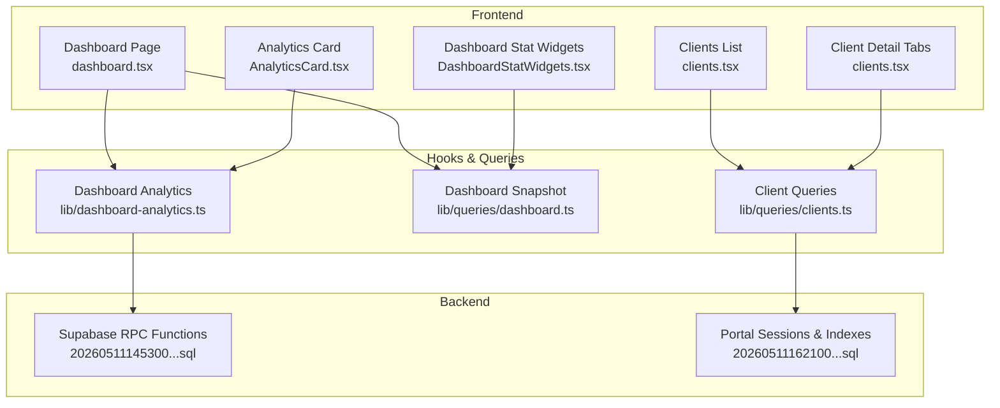
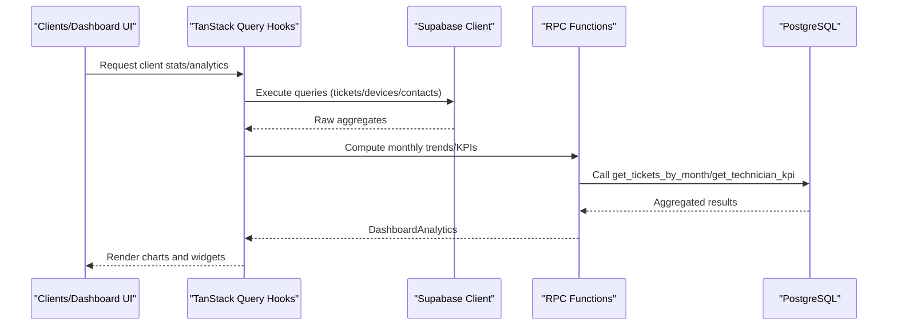
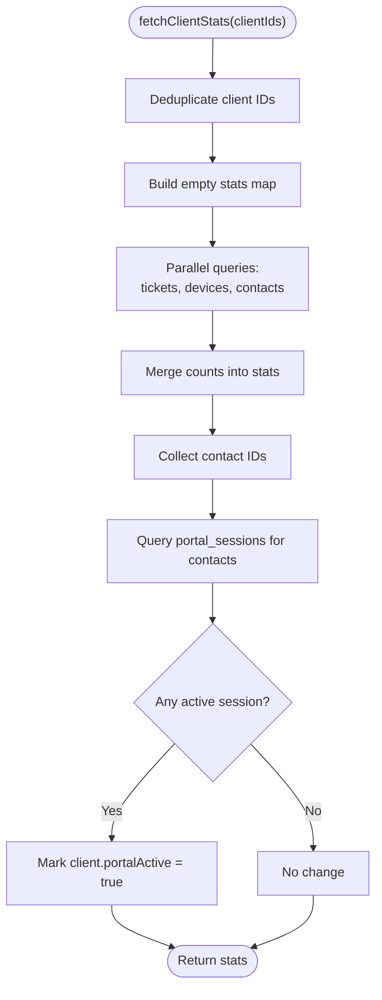
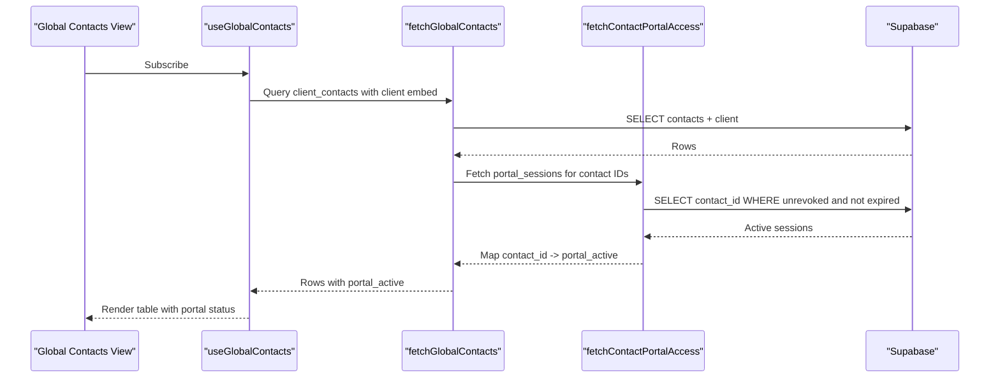
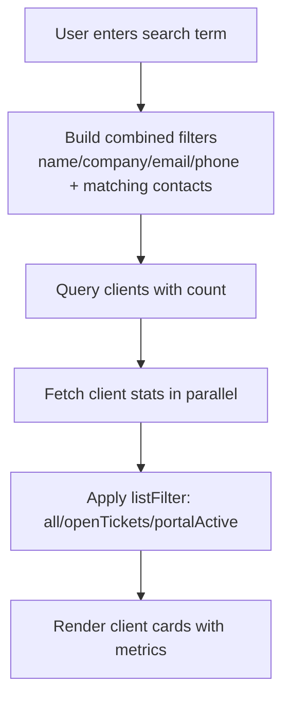
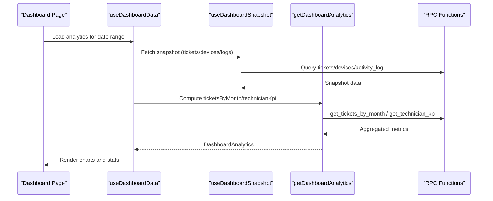
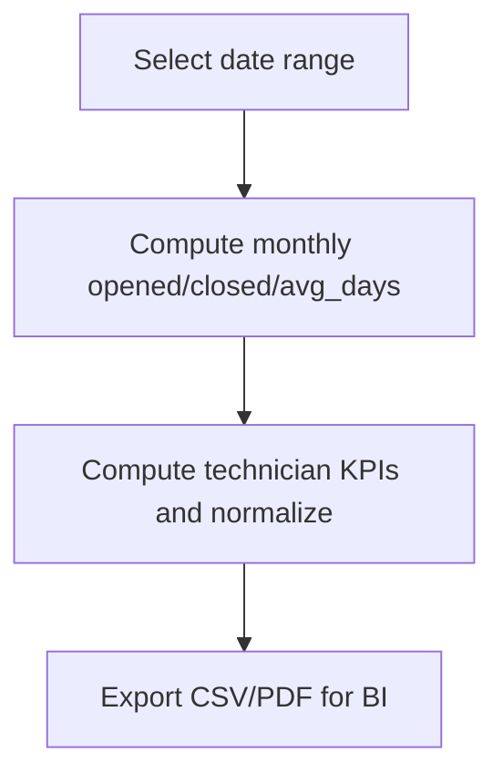
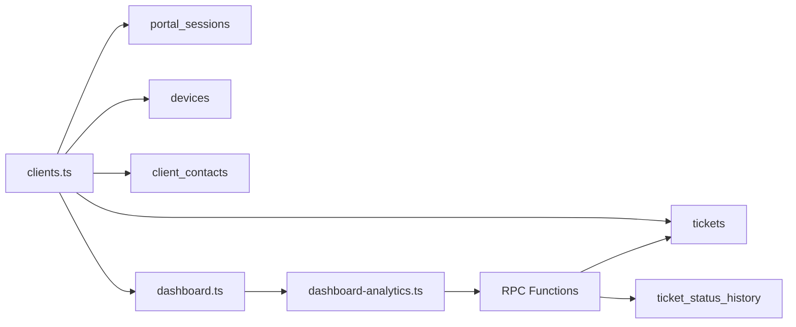

# Client Analytics and Statistics

<cite>
**Referenced Files in This Document**
- [clients.tsx](file://src/routes/_app/clients.tsx)
- [clients.ts](file://src/lib/queries/clients.ts)
- [dashboard.tsx](file://src/routes/_app/dashboard.tsx)
- [dashboard.ts](file://src/lib/queries/dashboard.ts)
- [dashboard-analytics.ts](file://src/lib/dashboard-analytics.ts)
- [AnalyticsCard.tsx](file://src/components/dashboard/AnalyticsCard.tsx)
- [DashboardStatWidgets.tsx](file://src/components/dashboard/DashboardStatWidgets.tsx)
- [dashboard-helpers.ts](file://src/lib/dashboard-helpers.ts)
- [20260511145300_dashboard_analytics_rpc_functions.sql](file://supabase/migrations/20260511145300_dashboard_analytics_rpc_functions.sql)
- [20260511162100_client_portal.sql](file://supabase/migrations/20260511162100_client_portal.sql)
- [pcready.ts](file://src/lib/pcready.ts)
</cite>

## Table of Contents

1. [Introduction](#introduction)
2. [Project Structure](#project-structure)
3. [Core Components](#core-components)
4. [Architecture Overview](#architecture-overview)
5. [Detailed Component Analysis](#detailed-component-analysis)
6. [Dependency Analysis](#dependency-analysis)
7. [Performance Considerations](#performance-considerations)
8. [Troubleshooting Guide](#troubleshooting-guide)
9. [Conclusion](#conclusion)
10. [Appendices](#appendices)

## Introduction

This document explains the client analytics and statistics system, focusing on:

- Client statistics calculation: open ticket counts, device inventory, contact counts, and portal activity indicators
- Performance metrics collection: client engagement, support volume, and service utilization patterns
- Global contact view with portal_active status tracking and client portal activity monitoring
- Client search and filtering with integrated statistics display
- Examples from the codebase showing statistics aggregation queries, performance optimization techniques, and data visualization patterns
- Client comparison features and trend analysis capabilities
- Common issues and solutions for accuracy, performance with large datasets, and real-time synchronization
- Relationship between client statistics and business intelligence reporting

## Project Structure

The analytics system spans frontend React components, TanStack Query hooks, Supabase client integrations, and backend Supabase functions and indexes. Key areas:

- Client list and detail views with embedded statistics cards and filters
- Dashboard widgets for tickets, devices, and analytics charts
- Server functions for computing monthly ticket trends and technician KPIs
- Real-time snapshot fetching and periodic analytics computation

**Diagram sources**

- [clients.tsx:174-826](file://src/routes/_app/clients.tsx#L174-L826)
- [dashboard.tsx:79-168](file://src/routes/_app/dashboard.tsx#L79-L168)
- [clients.ts:97-161](file://src/lib/queries/clients.ts#L97-L161)
- [dashboard.ts:75-125](file://src/lib/queries/dashboard.ts#L75-L125)
- [dashboard-analytics.ts:36-166](file://src/lib/dashboard-analytics.ts#L36-L166)
- [20260511145300_dashboard_analytics_rpc_functions.sql:31-97](file://supabase/migrations/20260511145300_dashboard_analytics_rpc_functions.sql#L31-L97)
- [20260511162100_client_portal.sql:20-34](file://supabase/migrations/20260511162100_client_portal.sql#L20-L34)

**Section sources**

- [clients.tsx:174-826](file://src/routes/_app/clients.tsx#L174-L826)
- [dashboard.tsx:79-168](file://src/routes/_app/dashboard.tsx#L79-L168)
- [clients.ts:97-161](file://src/lib/queries/clients.ts#L97-L161)
- [dashboard.ts:75-125](file://src/lib/queries/dashboard.ts#L75-L125)
- [dashboard-analytics.ts:36-166](file://src/lib/dashboard-analytics.ts#L36-L166)
- [20260511145300_dashboard_analytics_rpc_functions.sql:31-97](file://supabase/migrations/20260511145300_dashboard_analytics_rpc_functions.sql#L31-L97)
- [20260511162100_client_portal.sql:20-34](file://supabase/migrations/20260511162100_client_portal.sql#L20-L34)

## Core Components

- Client statistics aggregation:
  - Open tickets: filtered by open statuses and grouped by client
  - Devices: total device count per client
  - Contacts: total contact count per client
  - Portal activity: derived from active portal sessions for associated contacts
- Dashboard analytics:
  - Monthly ticket trends: opened/closed counts and average resolution days
  - Technician KPIs: assigned, completed, and average resolution days
- Visualization:
  - Bar charts for opened/closed tickets
  - Line charts for average resolution days
  - Donut/sparkline widgets for quick insights
- Real-time and snapshot:
  - Dashboard snapshot fetches tickets, devices, logs, and assignment state
  - Analytics computed server-side via RPC functions with indexes for performance

**Section sources**

- [clients.ts:97-161](file://src/lib/queries/clients.ts#L97-L161)
- [dashboard-analytics.ts:20-28](file://src/lib/dashboard-analytics.ts#L20-L28)
- [AnalyticsCard.tsx:22-138](file://src/components/dashboard/AnalyticsCard.tsx#L22-L138)
- [DashboardStatWidgets.tsx:18-131](file://src/components/dashboard/DashboardStatWidgets.tsx#L18-L131)
- [dashboard.ts:75-125](file://src/lib/queries/dashboard.ts#L75-L125)

## Architecture Overview

The analytics pipeline integrates frontend hooks, server functions, and database indexes to deliver accurate and performant insights.

**Diagram sources**

- [clients.ts:97-161](file://src/lib/queries/clients.ts#L97-L161)
- [dashboard-analytics.ts:36-166](file://src/lib/dashboard-analytics.ts#L36-L166)
- [20260511145300_dashboard_analytics_rpc_functions.sql:31-97](file://supabase/migrations/20260511145300_dashboard_analytics_rpc_functions.sql#L31-L97)

## Detailed Component Analysis

### Client Statistics Calculation

Client statistics are computed in a single aggregation pass across three tables:

- Tickets: count open tickets per client
- Devices: count devices per client
- Contacts: count contacts per client
- Portal activity: mark client as portal_active if any contact has a valid, unrevoked portal session

**Diagram sources**

- [clients.ts:97-161](file://src/lib/queries/clients.ts#L97-L161)

**Section sources**

- [clients.ts:97-161](file://src/lib/queries/clients.ts#L97-L161)

### Global Contact View and Portal Activity Monitoring

The global contact view surfaces portal_active status by:

- Fetching all client contacts with client metadata
- Computing portal_access per contact via a dedicated query
- Attaching portal_active flag to each contact row

**Diagram sources**

- [clients.ts:190-208](file://src/lib/queries/clients.ts#L190-L208)
- [clients.ts:163-188](file://src/lib/queries/clients.ts#L163-L188)

**Section sources**

- [clients.ts:190-208](file://src/lib/queries/clients.ts#L190-L208)
- [clients.ts:163-188](file://src/lib/queries/clients.ts#L163-L188)

### Client Search, Filtering, and Integrated Statistics

The client list supports:

- Text search across client and contact fields
- Filter by open tickets or portal activity
- Inline small metrics for open tickets, devices, and contacts
- Selected client detail view with tabs and counters

**Diagram sources**

- [clients.ts:11-42](file://src/lib/queries/clients.ts#L11-L42)
- [clients.tsx:325-352](file://src/routes/_app/clients.tsx#L325-L352)
- [clients.tsx:714-741](file://src/routes/_app/clients.tsx#L714-L741)

**Section sources**

- [clients.ts:11-42](file://src/lib/queries/clients.ts#L11-L42)
- [clients.tsx:325-352](file://src/routes/_app/clients.tsx#L325-L352)
- [clients.tsx:714-741](file://src/routes/_app/clients.tsx#L714-L741)

### Performance Metrics Collection and Visualization

Dashboard analytics computes:

- Monthly ticket trends: opened, closed, and average resolution days
- Technician KPIs: assigned, completed, and average resolution days
- Visualization via bar and line charts with tooltips and export options

**Diagram sources**

- [dashboard.tsx:79-168](file://src/routes/_app/dashboard.tsx#L79-L168)
- [dashboard.ts:75-125](file://src/lib/queries/dashboard.ts#L75-L125)
- [dashboard-analytics.ts:36-166](file://src/lib/dashboard-analytics.ts#L36-L166)
- [20260511145300_dashboard_analytics_rpc_functions.sql:31-97](file://supabase/migrations/20260511145300_dashboard_analytics_rpc_functions.sql#L31-L97)

**Section sources**

- [dashboard.tsx:79-168](file://src/routes/_app/dashboard.tsx#L79-L168)
- [dashboard.ts:75-125](file://src/lib/queries/dashboard.ts#L75-L125)
- [dashboard-analytics.ts:36-166](file://src/lib/dashboard-analytics.ts#L36-L166)
- [AnalyticsCard.tsx:22-138](file://src/components/dashboard/AnalyticsCard.tsx#L22-L138)
- [DashboardStatWidgets.tsx:18-131](file://src/components/dashboard/DashboardStatWidgets.tsx#L18-L131)

### Client Comparison and Trend Analysis

- Trend analysis is driven by monthly aggregation of ticket creation and closure timestamps, including archived tickets treated as closed.
- Technician radar metrics normalize KPIs across technicians for fair comparison.
- Export utilities support CSV/PDF downloads for BI reporting.

**Diagram sources**

- [dashboard-analytics.ts:36-166](file://src/lib/dashboard-analytics.ts#L36-L166)
- [dashboard-analytics.ts:333-554](file://src/lib/dashboard-analytics.ts#L333-L554)
- [dashboard-helpers.ts:4-25](file://src/lib/dashboard-helpers.ts#L4-L25)

**Section sources**

- [dashboard-analytics.ts:36-166](file://src/lib/dashboard-analytics.ts#L36-L166)
- [dashboard-analytics.ts:333-554](file://src/lib/dashboard-analytics.ts#L333-L554)
- [dashboard-helpers.ts:4-25](file://src/lib/dashboard-helpers.ts#L4-L25)

## Dependency Analysis

- Frontend hooks depend on Supabase client for queries and RPC functions for analytics.
- Client statistics rely on portal_sessions to infer portal activity.
- Dashboard analytics depends on RPC functions and indexes for efficient aggregation.
- Status and priority labels are centralized for consistent rendering.

**Diagram sources**

- [clients.ts:97-161](file://src/lib/queries/clients.ts#L97-L161)
- [20260511162100_client_portal.sql:20-34](file://supabase/migrations/20260511162100_client_portal.sql#L20-L34)
- [20260511145300_dashboard_analytics_rpc_functions.sql:31-97](file://supabase/migrations/20260511145300_dashboard_analytics_rpc_functions.sql#L31-L97)
- [dashboard.ts:75-125](file://src/lib/queries/dashboard.ts#L75-L125)

**Section sources**

- [clients.ts:97-161](file://src/lib/queries/clients.ts#L97-L161)
- [20260511162100_client_portal.sql:20-34](file://supabase/migrations/20260511162100_client_portal.sql#L20-L34)
- [20260511145300_dashboard_analytics_rpc_functions.sql:31-97](file://supabase/migrations/20260511145300_dashboard_analytics_rpc_functions.sql#L31-L97)
- [dashboard.ts:75-125](file://src/lib/queries/dashboard.ts#L75-L125)

## Performance Considerations

- Aggregation efficiency:
  - Client stats use Promise.all to minimize round-trips and iterate once over results.
  - Dashboard snapshot fetches devices in chunks with a cap to avoid heavy queries.
- Database optimization:
  - RPC functions compute aggregations server-side with appropriate indexes on created_at, closed_at, and assignee_id.
  - Triggers maintain closed_at for ready tickets to simplify analytics.
- Frontend caching and deduplication:
  - Query keys incorporate sorted client IDs to avoid redundant requests.
  - Deduplication of recent activity logs prevents flicker and extra renders.
- Visualization performance:
  - Charts render only when analytics data is present; skeleton loaders improve perceived responsiveness.

**Section sources**

- [clients.ts:107-151](file://src/lib/queries/clients.ts#L107-L151)
- [dashboard.ts:54-73](file://src/lib/queries/dashboard.ts#L54-L73)
- [dashboard.ts:127-133](file://src/lib/queries/dashboard.ts#L127-L133)
- [dashboard-analytics.ts:36-166](file://src/lib/dashboard-analytics.ts#L36-L166)
- [20260511145300_dashboard_analytics_rpc_functions.sql:99-102](file://supabase/migrations/20260511145300_dashboard_analytics_rpc_functions.sql#L99-L102)

## Troubleshooting Guide

- Statistics accuracy:
  - Ensure portal sessions are not revoked and not expired; only unrevoked and future-expiring sessions mark portal_active.
  - Verify RPC functions are invoked with correct date ranges; closed tickets and archived status are handled consistently.
- Performance issues:
  - Large client lists: leverage pagination and client-side filtering; avoid unnecessary stats queries by batching IDs.
  - Dashboard snapshots: monitor device fetch caps and chunk sizes; adjust PAGE_SIZE and CAP constants as needed.
- Real-time synchronization:
  - Use snapshot-based queries for stability; avoid live subscriptions for heavy aggregations.
  - For critical updates, invalidate and refetch relevant query keys after mutations.

**Section sources**

- [clients.ts:135-149](file://src/lib/queries/clients.ts#L135-L149)
- [dashboard.ts:54-73](file://src/lib/queries/dashboard.ts#L54-L73)
- [dashboard-analytics.ts:36-166](file://src/lib/dashboard-analytics.ts#L36-L166)

## Conclusion

The client analytics and statistics system combines efficient frontend aggregation, server-side RPC computations, and database indexing to deliver actionable insights. It supports client-centric metrics, portal activity monitoring, dashboard trends, and exportable reports suitable for business intelligence workflows. Administrators and analysts can rely on the documented patterns to maintain accuracy and performance at scale.

## Appendices

### API and Data Model Notes

- ClientStats: openTickets, devices, contacts, portalActive
- DashboardAnalytics: ticketsByMonth, technicianKpi, summary
- Portal sessions: token_hash, client_id, contact_id, expires_at, revoked_at, last_used_at

**Section sources**

- [clients.ts:74-79](file://src/lib/queries/clients.ts#L74-L79)
- [dashboard-analytics.ts:20-28](file://src/lib/dashboard-analytics.ts#L20-L28)
- [20260511162100_client_portal.sql:20-34](file://supabase/migrations/20260511162100_client_portal.sql#L20-L34)
