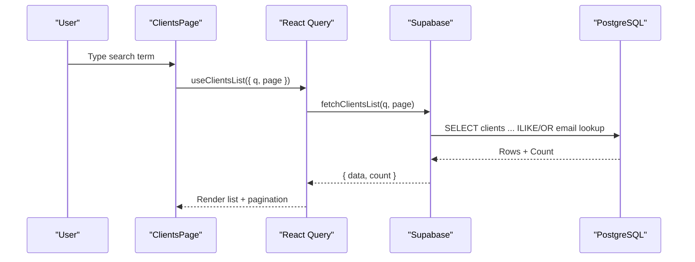
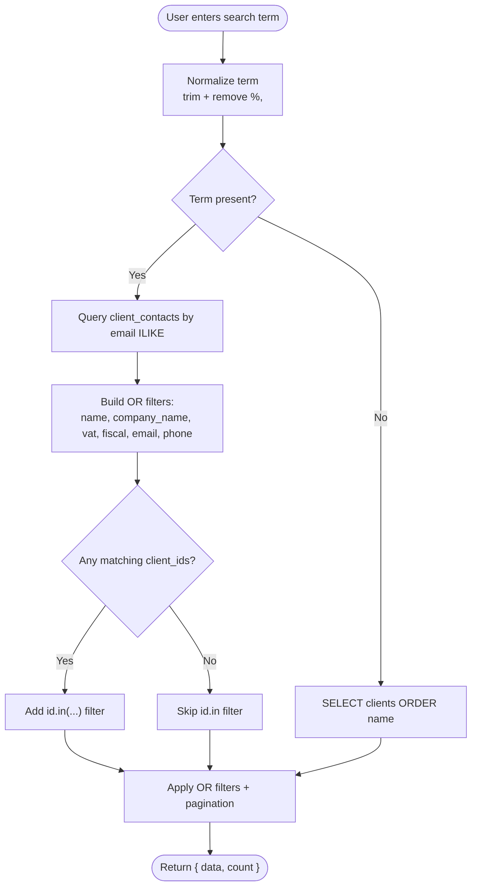
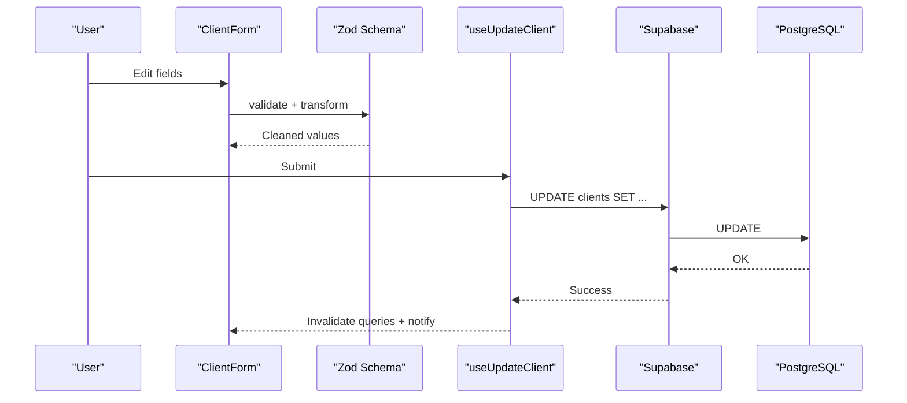
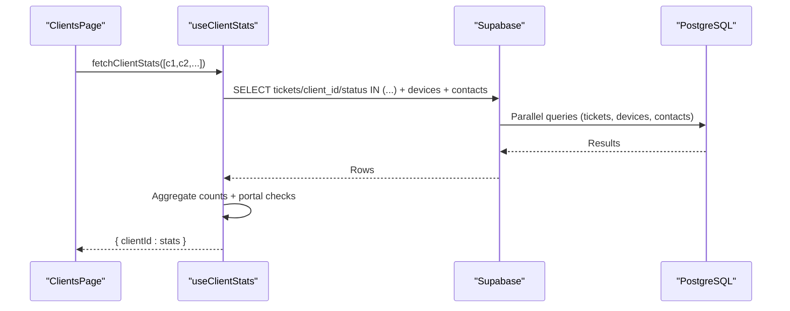
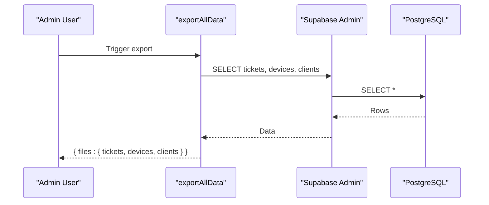
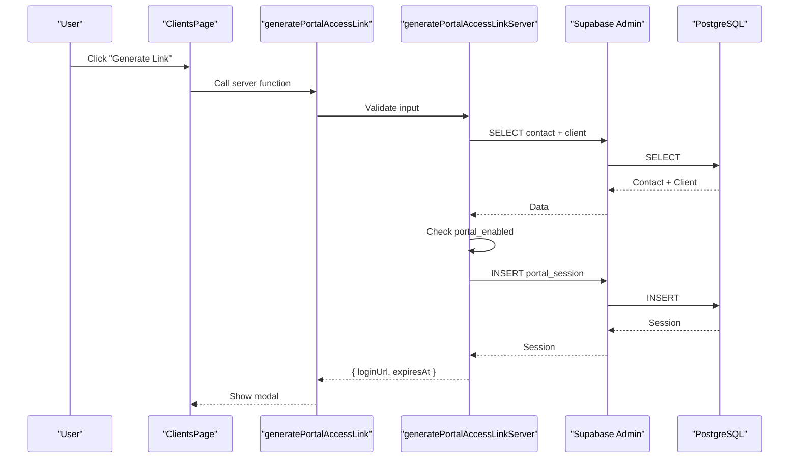
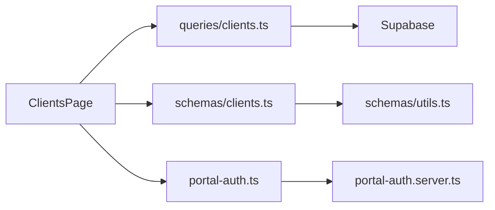

# Client Data Management

<cite>
**Referenced Files in This Document**
- [clients.tsx](file://src/routes/_app/clients.tsx)
- [clients.ts](file://src/lib/queries/clients.ts)
- [clients.ts](file://lib/schemas/clients.ts)
- [utils.ts](file://lib/schemas/utils.ts)
- [export-data.ts](file://src/lib/export-data.ts)
- [portal-auth.ts](file://src/lib/portal-auth.ts)
- [portal-auth.server.ts](file://src/lib/portal-auth.server.ts)
- [20260430182000_expand_clients_contacts.sql](file://supabase/migrations/20260430182000_expand_clients_contacts.sql)
- [clients.test.ts](file://src/__tests__/routes/clients.test.ts)
</cite>

## Table of Contents
1. [Introduction](#introduction)
2. [Project Structure](#project-structure)
3. [Core Components](#core-components)
4. [Architecture Overview](#architecture-overview)
5. [Detailed Component Analysis](#detailed-component-analysis)
6. [Dependency Analysis](#dependency-analysis)
7. [Performance Considerations](#performance-considerations)
8. [Troubleshooting Guide](#troubleshooting-guide)
9. [Conclusion](#conclusion)

## Introduction
This document explains the client data management functionality, covering how client information is stored, searched, listed, edited, and deleted. It also details the statistics aggregation for open tickets, devices, contacts, and portal activity, along with import/export capabilities. The content is designed for both client service representatives (who need practical guidance) and system administrators (who need technical depth).

## Project Structure
Client data management spans three main areas:
- UI and orchestration: client listing, forms, tabs, and dialogs
- Queries and mutations: Supabase-backed data access and transformations
- Schemas and validations: Zod-based input validation and normalization

```mermaid
graph TB
subgraph "UI Layer"
UI_List["ClientsPage<br/>Listing + Filters"]
UI_Forms["Client & Contact Forms"]
UI_Dialogs["Import/Export Dialogs"]
end
subgraph "Queries Layer"
Q_List["fetchClientsList"]
Q_Stats["fetchClientStats"]
Q_Contacts["fetchClientContacts"]
Q_Tickets["fetchClientTickets"]
Q_Devices["fetchClientDevices"]
Q_Export["fetchAllClientsForExport"]
end
subgraph "Mutations Layer"
M_Create["useCreateClient"]
M_Update["useUpdateClient"]
M_Delete["useDeleteClient"]
M_BulkDelete["useBulkDeleteClients"]
M_CreateContact["useCreateContact"]
M_UpdateContact["useUpdateContact"]
M_DeleteContact["useDeleteContact"]
end
subgraph "Data Access"
DB_Clients["Supabase: clients"]
DB_Contacts["Supabase: client_contacts"]
DB_Tickets["Supabase: tickets"]
DB_Devices["Supabase: devices"]
DB_Sessions["Supabase: portal_sessions"]
end
UI_List --> Q_List
UI_List --> Q_Stats
UI_List --> Q_Contacts
UI_List --> Q_Tickets
UI_List --> Q_Devices
UI_Forms --> M_Create
UI_Forms --> M_Update
UI_Forms --> M_CreateContact
UI_Forms --> M_UpdateContact
UI_Dialogs --> Q_Export
Q_List --> DB_Clients
Q_Stats --> DB_Tickets
Q_Stats --> DB_Devices
Q_Stats --> DB_Contacts
Q_Stats --> DB_Sessions
Q_Contacts --> DB_Contacts
Q_Tickets --> DB_Tickets
Q_Devices --> DB_Devices
M_Create --> DB_Clients
M_Update --> DB_Clients
M_Delete --> DB_Clients
M_CreateContact --> DB_Contacts
M_UpdateContact --> DB_Contacts
M_DeleteContact --> DB_Contacts
```

**Diagram sources**
- [clients.tsx:174-250](file://src/routes/_app/clients.tsx#L174-L250)
- [clients.ts:11-42](file://src/lib/queries/clients.ts#L11-L42)
- [clients.ts:97-152](file://src/lib/queries/clients.ts#L97-L152)

**Section sources**
- [clients.tsx:174-250](file://src/routes/_app/clients.tsx#L174-L250)
- [clients.ts:11-42](file://src/lib/queries/clients.ts#L11-L42)

## Core Components
- Client entity fields: name, company_name, vat_number, fiscal_code, email, phone, website_url, address, notes, updated_at, portal_enabled
- Contact entity fields: full_name, first_name, last_name, email, phone, job_title, department, is_primary, notes
- Search and listing: full-text-like search across name, company_name, vat_number, fiscal_code, email, phone; pagination and filters
- CRUD operations: create, update, delete, bulk delete for clients; create/update/delete for contacts
- Statistics: open tickets, devices, contacts, portal activity
- Import/export: CSV import for clients and contacts; export all data capability

**Section sources**
- [clients.tsx:67-116](file://src/routes/_app/clients.tsx#L67-L116)
- [clients.ts:6-7](file://src/lib/queries/clients.ts#L6-L7)
- [clients.ts:97-152](file://src/lib/queries/clients.ts#L97-L152)

## Architecture Overview
The client management UI integrates with React Query for caching and optimistic updates. Data access is performed via Supabase client functions, with mutations triggering query invalidations to keep views synchronized.

**Diagram sources**
- [clients.tsx:228-229](file://src/routes/_app/clients.tsx#L228-L229)
- [clients.ts:11-42](file://src/lib/queries/clients.ts#L11-L42)

## Detailed Component Analysis

### Client Listing and Search
- Search algorithm:
  - Trims and normalizes the search term
  - Performs an email-based lookup against client_contacts to discover associated client_ids
  - Builds OR filters across name, company_name, vat_number, fiscal_code, email, phone
  - If contact-derived client_ids exist, adds an id-in filter
  - Applies pagination via range()
- Filters:
  - "All", "Open Tickets", "Portal Active"
  - "Open Tickets" uses client stats to show only clients with open tickets
  - "Portal Active" considers either client portal_enabled flag or active portal sessions for any contact

**Diagram sources**
- [clients.ts:11-42](file://src/lib/queries/clients.ts#L11-L42)

**Section sources**
- [clients.ts:11-42](file://src/lib/queries/clients.ts#L11-L42)
- [clients.tsx:341-352](file://src/routes/_app/clients.tsx#L341-L352)

### Client CRUD Operations
- Create/Update:
  - Client form uses Zod schema for validation
  - Values are normalized (trimmed, null for empty)
  - Website URLs are normalized to https:// if missing protocol
  - Mutations handled via useCreateClient/useUpdateClient
- Delete/Bulk Delete:
  - Single delete via useDeleteClient
  - Bulk delete via useBulkDeleteClients
  - Admin-only actions enforced in UI
- Contact CRUD:
  - Primary contact flag is managed with a pre-update clearing other primaries
  - Mutations handled via useCreateContact/useUpdateContact/useDeleteContact

**Diagram sources**
- [clients.tsx:385-426](file://src/routes/_app/clients.tsx#L385-L426)
- [clients.ts:269-298](file://src/lib/queries/clients.ts#L269-L298)
- [clients.ts:4-14](file://lib/schemas/clients.ts#L4-L14)
- [utils.ts:3-10](file://lib/schemas/utils.ts#L3-L10)

**Section sources**
- [clients.tsx:385-426](file://src/routes/_app/clients.tsx#L385-L426)
- [clients.tsx:469-512](file://src/routes/_app/clients.tsx#L469-L512)
- [clients.ts:269-320](file://src/lib/queries/clients.ts#L269-L320)
- [clients.ts:4-14](file://lib/schemas/clients.ts#L4-L14)
- [utils.ts:3-10](file://lib/schemas/utils.ts#L3-L10)

### Client Statistics Calculation
Statistics are computed in a single query round-up for a batch of client IDs:
- Open tickets: count of tickets with statuses in ["pending","in-progress","testing","ready"]
- Devices: total devices per client
- Contacts: total contacts per client
- Portal activity: true if any active portal session exists for any contact of the client

**Diagram sources**
- [clients.ts:97-152](file://src/lib/queries/clients.ts#L97-L152)

**Section sources**
- [clients.ts:97-152](file://src/lib/queries/clients.ts#L97-L152)
- [clients.tsx:325-352](file://src/routes/_app/clients.tsx#L325-L352)

### Client Export Functionality
- Export all data: server function exports tickets, devices, and clients to CSV files
- Client listing export: dedicated function iterates clients in chunks to avoid memory pressure
- CSV generation: column normalization and safe cell encoding

**Diagram sources**
- [export-data.ts:11-52](file://src/lib/export-data.ts#L11-L52)
- [clients.ts:251-267](file://src/lib/queries/clients.ts#L251-L267)

**Section sources**
- [export-data.ts:11-52](file://src/lib/export-data.ts#L11-L52)
- [clients.ts:251-267](file://src/lib/queries/clients.ts#L251-L267)

### Portal Access Management
- Generate portal link: creates a temporary session for a contact, validates client portal_enabled flag, and returns login URL and expiry
- Revoke portal access: revokes active sessions for a contact
- UI supports copying the link and displays expiration

**Diagram sources**
- [portal-auth.ts:48-60](file://src/lib/portal-auth.ts#L48-L60)
- [portal-auth.server.ts:97-116](file://src/lib/portal-auth.server.ts#L97-L116)

**Section sources**
- [portal-auth.ts:48-60](file://src/lib/portal-auth.ts#L48-L60)
- [portal-auth.server.ts:97-116](file://src/lib/portal-auth.server.ts#L97-L116)

### Data Integrity Constraints
- Unique constraints:
  - Unique index on lower(company_name) for clients
  - Unique index on is_primary per client_id for contacts
- Migration-driven evolution ensures backward compatibility and data normalization

**Section sources**
- [20260430182000_expand_clients_contacts.sql:22-28](file://supabase/migrations/20260430182000_expand_clients_contacts.sql#L22-L28)

## Dependency Analysis
- UI depends on React Query for data fetching and caching
- Queries depend on Supabase client for SQL operations
- Mutations depend on query invalidation to refresh lists and detail views
- Validation relies on Zod schemas and utility transformers

**Diagram sources**
- [clients.tsx:174-250](file://src/routes/_app/clients.tsx#L174-L250)
- [clients.ts:1-2](file://src/lib/queries/clients.ts#L1-L2)
- [clients.ts:1-27](file://lib/schemas/clients.ts#L1-L27)
- [utils.ts:1-20](file://lib/schemas/utils.ts#L1-L20)
- [portal-auth.ts:1-61](file://src/lib/portal-auth.ts#L1-L61)

**Section sources**
- [clients.tsx:174-250](file://src/routes/_app/clients.tsx#L174-L250)
- [clients.ts:1-2](file://src/lib/queries/clients.ts#L1-L2)
- [clients.ts:1-27](file://lib/schemas/clients.ts#L1-L27)
- [utils.ts:1-20](file://lib/schemas/utils.ts#L1-L20)
- [portal-auth.ts:1-61](file://src/lib/portal-auth.ts#L1-L61)

## Performance Considerations
- Pagination: LIST queries use range() to limit rows per page
- Chunked export: fetchAllClientsForExport iterates in chunks to prevent memory spikes
- Batch statistics: fetchClientStats performs parallel reads for tickets/devices/contacts
- Search optimization: email-based contact lookup reduces OR filter scope when applicable
- Indexing: unique indexes on company_name and primary contact per client improve uniqueness enforcement and lookup performance

[No sources needed since this section provides general guidance]

## Troubleshooting Guide
- Duplicate client entries:
  - CSV import deduplicates by VAT or email; see deduplication logic and existing key loading
  - Unique constraints prevent duplicates at DB level
- Search performance:
  - Ensure search terms are trimmed and normalized
  - Prefer precise identifiers (VAT/email) to reduce OR filter scope
- Data integrity:
  - Unique indexes enforce company_name uniqueness and single primary contact per client
  - Validation prevents empty strings from entering DB by transforming to null
- Portal access:
  - Verify client portal_enabled flag and active portal sessions
  - Use revoke operation to invalidate active sessions

**Section sources**
- [clients.tsx:2187-2209](file://src/routes/_app/clients.tsx#L2187-L2209)
- [clients.tsx:2211-2250](file://src/routes/_app/clients.tsx#L2211-L2250)
- [20260430182000_expand_clients_contacts.sql:22-28](file://supabase/migrations/20260430182000_expand_clients_contacts.sql#L22-L28)
- [clients.ts:97-152](file://src/lib/queries/clients.ts#L97-L152)

## Conclusion
Client data management combines a robust UI with efficient Supabase-backed queries and mutations. The system supports comprehensive search, accurate statistics, safe CRUD operations, and reliable import/export workflows. Administrators benefit from constraints and server-side validations, while support agents enjoy intuitive forms and powerful filtering.