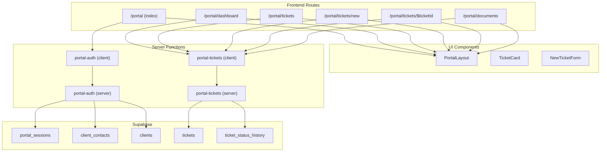
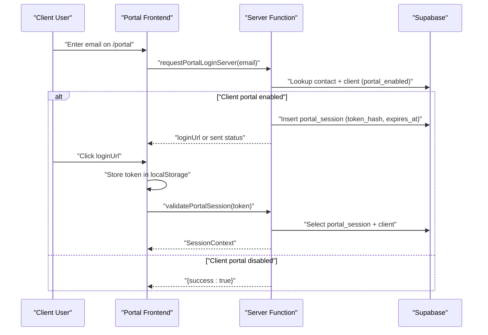
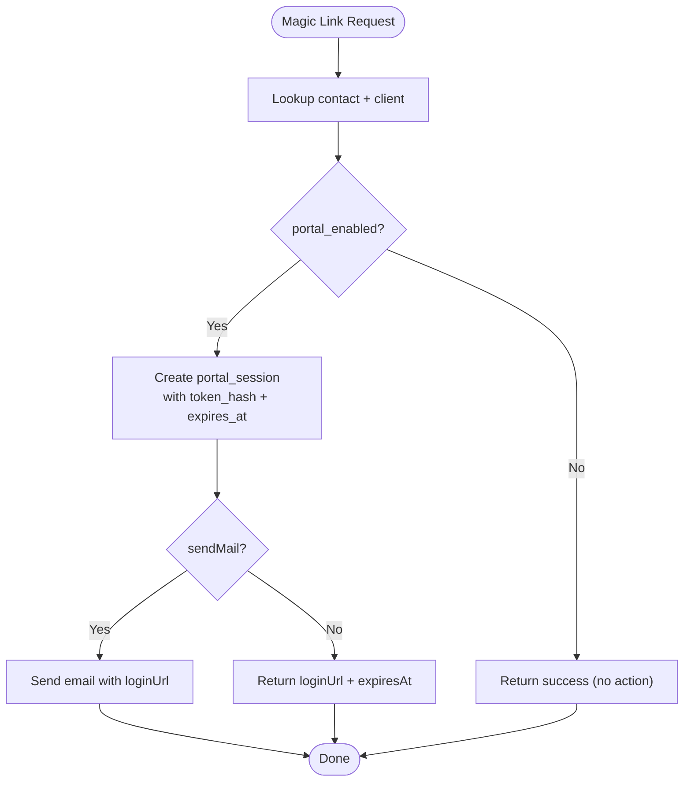
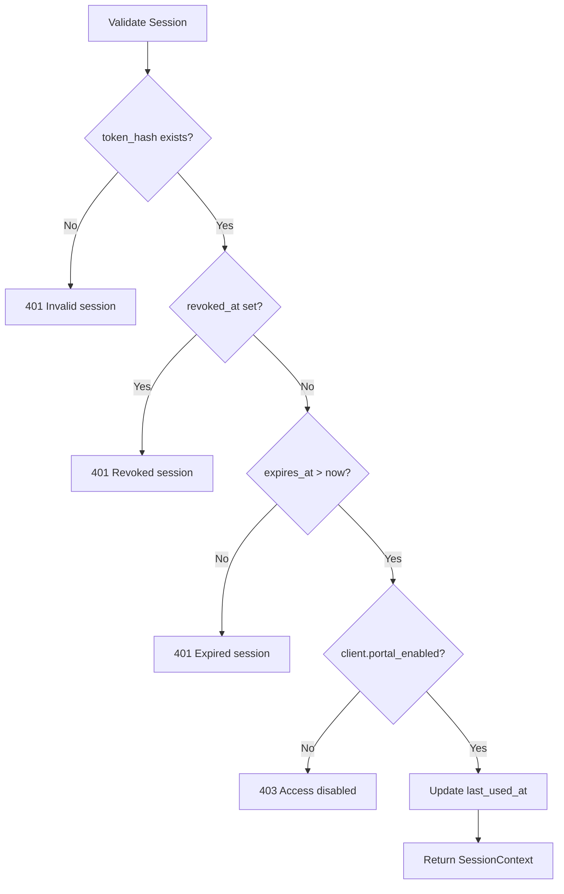
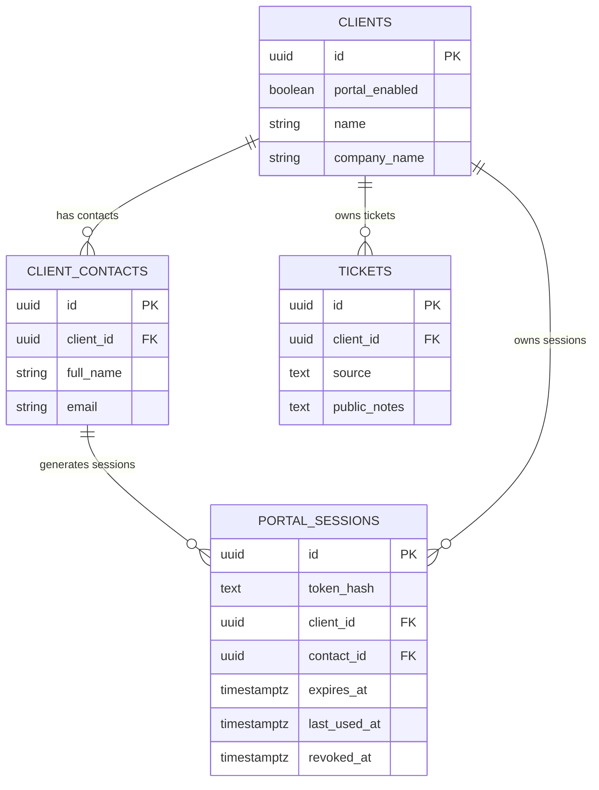
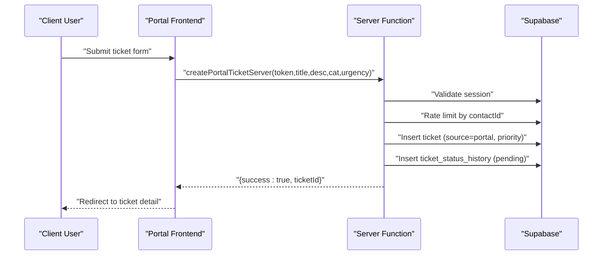
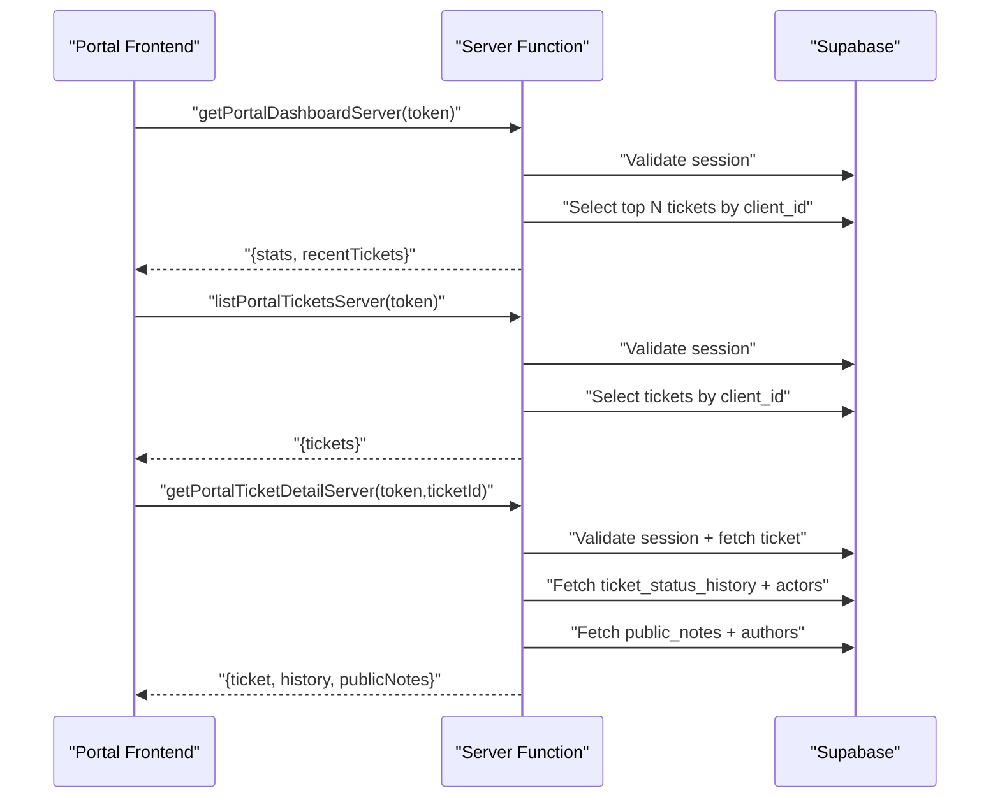
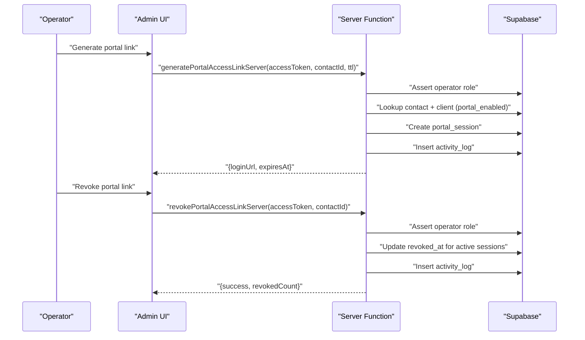
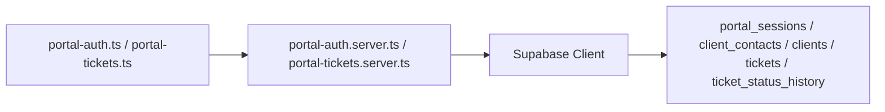

# Client Portal Access Management

<cite>
**Referenced Files in This Document**
- [portal-auth.server.ts](file://src/lib/portal-auth.server.ts)
- [portal-auth.ts](file://src/lib/portal-auth.ts)
- [portal-tickets.server.ts](file://src/lib/portal-tickets.server.ts)
- [portal-tickets.ts](file://src/lib/portal-tickets.ts)
- [portal/index.tsx](file://src/routes/portal/index.tsx)
- [portal/dashboard.tsx](file://src/routes/portal/dashboard.tsx)
- [portal/tickets/index.tsx](file://src/routes/portal/tickets/index.tsx)
- [portal/tickets/new.tsx](file://src/routes/portal/tickets/new.tsx)
- [portal/tickets/$ticketId.tsx](file://src/routes/portal/tickets/$ticketId.tsx)
- [portal/documents/index.tsx](file://src/routes/portal/documents/index.tsx)
- [PortalLayout.tsx](file://src/components/portal/PortalLayout.tsx)
- [TicketCard.tsx](file://src/components/portal/TicketCard.tsx)
- [NewTicketForm.tsx](file://src/components/portal/NewTicketForm.tsx)
- [20260511162100_client_portal.sql](file://supabase/migrations/20260511162100_client_portal.sql)
- [types.ts](file://src/integrations/supabase/types.ts)
- [_app/clients.tsx](file://src/routes/_app/clients.tsx)
</cite>

## Table of Contents
1. [Introduction](#introduction)
2. [Project Structure](#project-structure)
3. [Core Components](#core-components)
4. [Architecture Overview](#architecture-overview)
5. [Detailed Component Analysis](#detailed-component-analysis)
6. [Dependency Analysis](#dependency-analysis)
7. [Performance Considerations](#performance-considerations)
8. [Troubleshooting Guide](#troubleshooting-guide)
9. [Conclusion](#conclusion)
10. [Appendices](#appendices)

## Introduction
This document explains the client portal access management system, covering authentication via contact-based magic links, session lifecycle (creation, validation, expiration, revocation), access controls driven by client portal_enabled flags and contact relationships, and the end-to-end portal ticketing workflow. It also documents the portal dashboard, ticket listing, and detail views, and provides practical troubleshooting guidance for common issues such as session timeouts and access denials.

## Project Structure
The portal spans frontend routes, UI components, and backend server functions that integrate with Supabase for authentication, session storage, and ticket management.

**Diagram sources**
- [portal/index.tsx:1-73](file://src/routes/portal/index.tsx#L1-L73)
- [portal/dashboard.tsx:1-131](file://src/routes/portal/dashboard.tsx#L1-L131)
- [portal/tickets/index.tsx:1-93](file://src/routes/portal/tickets/index.tsx#L1-L93)
- [portal/tickets/new.tsx:1-76](file://src/routes/portal/tickets/new.tsx#L1-L76)
- [portal/tickets/$ticketId.tsx:1-107](file://src/routes/portal/tickets/$ticketId.tsx#L1-L107)
- [portal/documents/index.tsx:1-26](file://src/routes/portal/documents/index.tsx#L1-L26)
- [PortalLayout.tsx:1-36](file://src/components/portal/PortalLayout.tsx#L1-L36)
- [TicketCard.tsx:1-24](file://src/components/portal/TicketCard.tsx#L1-L24)
- [NewTicketForm.tsx:1-84](file://src/components/portal/NewTicketForm.tsx#L1-L84)
- [portal-auth.ts:1-61](file://src/lib/portal-auth.ts#L1-L61)
- [portal-auth.server.ts:1-238](file://src/lib/portal-auth.server.ts#L1-L238)
- [portal-tickets.ts:1-53](file://src/lib/portal-tickets.ts#L1-L53)
- [portal-tickets.server.ts:1-205](file://src/lib/portal-tickets.server.ts#L1-L205)
- [20260511162100_client_portal.sql:1-46](file://supabase/migrations/20260511162100_client_portal.sql#L1-L46)
- [types.ts:695-742](file://src/integrations/supabase/types.ts#L695-L742)

**Section sources**
- [portal/index.tsx:1-73](file://src/routes/portal/index.tsx#L1-L73)
- [portal/dashboard.tsx:1-131](file://src/routes/portal/dashboard.tsx#L1-L131)
- [portal/tickets/index.tsx:1-93](file://src/routes/portal/tickets/index.tsx#L1-L93)
- [portal/tickets/new.tsx:1-76](file://src/routes/portal/tickets/new.tsx#L1-L76)
- [portal/tickets/$ticketId.tsx:1-107](file://src/routes/portal/tickets/$ticketId.tsx#L1-L107)
- [portal/documents/index.tsx:1-26](file://src/routes/portal/documents/index.tsx#L1-L26)
- [PortalLayout.tsx:1-36](file://src/components/portal/PortalLayout.tsx#L1-L36)
- [TicketCard.tsx:1-24](file://src/components/portal/TicketCard.tsx#L1-L24)
- [NewTicketForm.tsx:1-84](file://src/components/portal/NewTicketForm.tsx#L1-L84)
- [portal-auth.ts:1-61](file://src/lib/portal-auth.ts#L1-L61)
- [portal-auth.server.ts:1-238](file://src/lib/portal-auth.server.ts#L1-L238)
- [portal-tickets.ts:1-53](file://src/lib/portal-tickets.ts#L1-L53)
- [portal-tickets.server.ts:1-205](file://src/lib/portal-tickets.server.ts#L1-L205)
- [20260511162100_client_portal.sql:1-46](file://supabase/migrations/20260511162100_client_portal.sql#L1-L46)
- [types.ts:695-742](file://src/integrations/supabase/types.ts#L695-L742)

## Core Components
- Authentication and session management:
  - Magic-link request for portal login
  - Session creation with hashed tokens and expiry
  - Session validation and revocation
  - Operator-level actions to generate/revoke access links
- Ticketing:
  - Dashboard statistics and recent tickets
  - Listing and viewing tickets with status history
  - Creating tickets from the portal with rate limiting
  - Retrieving ticket categories for portal forms
- Frontend integration:
  - Login page with magic link flow
  - Protected routes using local storage tokens
  - Layout and reusable components for tickets and forms

**Section sources**
- [portal-auth.server.ts:62-95](file://src/lib/portal-auth.server.ts#L62-L95)
- [portal-auth.server.ts:46-60](file://src/lib/portal-auth.server.ts#L46-L60)
- [portal-auth.server.ts:196-229](file://src/lib/portal-auth.server.ts#L196-L229)
- [portal-auth.server.ts:147-194](file://src/lib/portal-auth.server.ts#L147-L194)
- [portal-tickets.server.ts:22-57](file://src/lib/portal-tickets.server.ts#L22-L57)
- [portal-tickets.server.ts:59-69](file://src/lib/portal-tickets.server.ts#L59-L69)
- [portal-tickets.server.ts:72-131](file://src/lib/portal-tickets.server.ts#L72-L131)
- [portal-tickets.server.ts:133-193](file://src/lib/portal-tickets.server.ts#L133-L193)
- [portal-tickets.server.ts:195-204](file://src/lib/portal-tickets.server.ts#L195-L204)
- [portal-auth.ts:27-60](file://src/lib/portal-auth.ts#L27-L60)
- [portal-tickets.ts:19-52](file://src/lib/portal-tickets.ts#L19-L52)
- [portal/index.tsx:16-42](file://src/routes/portal/index.tsx#L16-L42)
- [portal/dashboard.tsx:20-43](file://src/routes/portal/dashboard.tsx#L20-L43)
- [portal/tickets/index.tsx:16-39](file://src/routes/portal/tickets/index.tsx#L16-L39)
- [portal/tickets/new.tsx:15-40](file://src/routes/portal/tickets/new.tsx#L15-L40)
- [portal/tickets/$ticketId.tsx:15-39](file://src/routes/portal/tickets/$ticketId.tsx#L15-L39)

## Architecture Overview
The portal relies on Supabase for identity and data. Sessions are short-lived, securely hashed, and validated on every protected request. Access is gated by client-level flags and contact relationships.

**Diagram sources**
- [portal/index.tsx:16-42](file://src/routes/portal/index.tsx#L16-L42)
- [portal-auth.ts:27-40](file://src/lib/portal-auth.ts#L27-L40)
- [portal-auth.server.ts:62-95](file://src/lib/portal-auth.server.ts#L62-L95)
- [portal-auth.server.ts:46-60](file://src/lib/portal-auth.server.ts#L46-L60)
- [portal-auth.server.ts:196-229](file://src/lib/portal-auth.server.ts#L196-L229)
- [20260511162100_client_portal.sql:1-46](file://supabase/migrations/20260511162100_client_portal.sql#L1-L46)

## Detailed Component Analysis

### Authentication Flow: Contact-Based Login
- Magic link generation:
  - Validates rate limits keyed by email
  - Resolves contact and client, checks portal_enabled
  - Creates a secure session with a hashed token and expiry
  - Optionally emails the login link
- Token validation:
  - Hashes the provided token and queries portal_sessions
  - Rejects revoked or expired sessions
  - Enforces client portal_enabled flag
  - Updates last_used_at on successful validation
- Logout:
  - Revokes the session by setting revoked_at

**Diagram sources**
- [portal-auth.server.ts:62-95](file://src/lib/portal-auth.server.ts#L62-L95)
- [portal-auth.server.ts:46-60](file://src/lib/portal-auth.server.ts#L46-L60)
- [portal-auth.server.ts:84-94](file://src/lib/portal-auth.server.ts#L84-L94)

**Section sources**
- [portal-auth.server.ts:62-95](file://src/lib/portal-auth.server.ts#L62-L95)
- [portal-auth.server.ts:46-60](file://src/lib/portal-auth.server.ts#L46-L60)
- [portal-auth.ts:27-40](file://src/lib/portal-auth.ts#L27-L40)
- [portal/index.tsx:16-42](file://src/routes/portal/index.tsx#L16-L42)

### Session Lifecycle: Creation, Validation, Expiration, Revocation
- Creation:
  - Random token generated and hashed
  - Stored with client_id, contact_id, expires_at
- Validation:
  - token_hash lookup
  - revoked_at and expires_at checks
  - client portal_enabled enforcement
  - last_used_at update
- Expiration:
  - Sessions expire after TTL (default 24 hours)
- Revocation:
  - Operator can revoke by updating revoked_at
  - Logout endpoint also revokes the current token

**Diagram sources**
- [portal-auth.server.ts:196-229](file://src/lib/portal-auth.server.ts#L196-L229)
- [20260511162100_client_portal.sql:1-46](file://supabase/migrations/20260511162100_client_portal.sql#L1-L46)

**Section sources**
- [portal-auth.server.ts:196-229](file://src/lib/portal-auth.server.ts#L196-L229)
- [portal-auth.server.ts:231-237](file://src/lib/portal-auth.server.ts#L231-L237)
- [portal-auth.server.ts:147-194](file://src/lib/portal-auth.server.ts#L147-L194)

### Access Controls and Permissions
- Client-level gating:
  - clients.portal_enabled controls whether a client can access the portal
- Contact relationships:
  - portal_sessions link to client_contacts and clients
  - Ticket queries filter by client_id to enforce tenant isolation
- Operator permissions:
  - Operators (admin/tech) can generate and revoke portal access links
  - Audit logs record these actions

**Diagram sources**
- [20260511162100_client_portal.sql:1-46](file://supabase/migrations/20260511162100_client_portal.sql#L1-L46)
- [types.ts:695-742](file://src/integrations/supabase/types.ts#L695-L742)
- [portal-tickets.server.ts:28-34](file://src/lib/portal-tickets.server.ts#L28-L34)

**Section sources**
- [20260511162100_client_portal.sql:1-46](file://supabase/migrations/20260511162100_client_portal.sql#L1-L46)
- [portal-auth.server.ts:208-213](file://src/lib/portal-auth.server.ts#L208-L213)
- [portal-tickets.server.ts:30-33](file://src/lib/portal-tickets.server.ts#L30-L33)

### Portal Ticket Submission Workflow
- Categories:
  - Retrieves configured categories from app_settings
- Creation:
  - Validates session
  - Rate limits by contactId
  - Inserts ticket with source=portal and priority derived from urgency
  - Adds initial status history record
  - Notifies admins and optionally emails the support team
- Viewing:
  - Lists client tickets and shows status/priority/assignee
  - Shows detailed ticket with status history and public notes

**Diagram sources**
- [portal-tickets.ts:40-45](file://src/lib/portal-tickets.ts#L40-L45)
- [portal-tickets.server.ts:133-193](file://src/lib/portal-tickets.server.ts#L133-L193)
- [portal-tickets.server.ts:164-172](file://src/lib/portal-tickets.server.ts#L164-L172)
- [portal/tickets/new.tsx:15-40](file://src/routes/portal/tickets/new.tsx#L15-L40)
- [NewTicketForm.tsx:16-28](file://src/components/portal/NewTicketForm.tsx#L16-L28)

**Section sources**
- [portal-tickets.ts:40-45](file://src/lib/portal-tickets.ts#L40-L45)
- [portal-tickets.server.ts:133-193](file://src/lib/portal-tickets.server.ts#L133-L193)
- [portal-tickets.server.ts:164-172](file://src/lib/portal-tickets.server.ts#L164-L172)
- [portal/tickets/new.tsx:15-40](file://src/routes/portal/tickets/new.tsx#L15-L40)
- [NewTicketForm.tsx:16-28](file://src/components/portal/NewTicketForm.tsx#L16-L28)

### Portal Dashboard and Views
- Dashboard:
  - Loads recent tickets and computes stats for open, in-progress, and resolved-this-month
  - Uses client_id filtering to show only the logged-in contact’s client
- Tickets list:
  - Paginates and renders tickets with status badges
- Ticket detail:
  - Shows status history timeline and public notes
  - Provides download link for documents when appropriate

**Diagram sources**
- [portal-tickets.ts:19-38](file://src/lib/portal-tickets.ts#L19-L38)
- [portal-tickets.server.ts:22-57](file://src/lib/portal-tickets.server.ts#L22-L57)
- [portal-tickets.server.ts:59-69](file://src/lib/portal-tickets.server.ts#L59-L69)
- [portal-tickets.server.ts:72-131](file://src/lib/portal-tickets.server.ts#L72-L131)
- [portal/dashboard.tsx:20-43](file://src/routes/portal/dashboard.tsx#L20-L43)
- [portal/tickets/index.tsx:16-39](file://src/routes/portal/tickets/index.tsx#L16-L39)
- [portal/tickets/$ticketId.tsx:15-39](file://src/routes/portal/tickets/$ticketId.tsx#L15-L39)

**Section sources**
- [portal-tickets.ts:19-38](file://src/lib/portal-tickets.ts#L19-L38)
- [portal-tickets.server.ts:22-57](file://src/lib/portal-tickets.server.ts#L22-L57)
- [portal-tickets.server.ts:59-69](file://src/lib/portal-tickets.server.ts#L59-L69)
- [portal-tickets.server.ts:72-131](file://src/lib/portal-tickets.server.ts#L72-L131)
- [portal/dashboard.tsx:20-43](file://src/routes/portal/dashboard.tsx#L20-L43)
- [portal/tickets/index.tsx:16-39](file://src/routes/portal/tickets/index.tsx#L16-L39)
- [portal/tickets/$ticketId.tsx:15-39](file://src/routes/portal/tickets/$ticketId.tsx#L15-L39)
- [TicketCard.tsx:1-24](file://src/components/portal/TicketCard.tsx#L1-L24)

### Operator Portal Access Management
- Generate access link:
  - Requires operator role (admin/tech)
  - Validates contact and client portal_enabled
  - Records activity log
- Revoke access link:
  - Revokes active, unexpired sessions for a contact
  - Records activity log

**Diagram sources**
- [portal-auth.server.ts:97-144](file://src/lib/portal-auth.server.ts#L97-L144)
- [portal-auth.server.ts:147-194](file://src/lib/portal-auth.server.ts#L147-L194)
- [_app/clients.tsx:174-200](file://src/routes/_app/clients.tsx#L174-L200)

**Section sources**
- [portal-auth.server.ts:97-144](file://src/lib/portal-auth.server.ts#L97-L144)
- [portal-auth.server.ts:147-194](file://src/lib/portal-auth.server.ts#L147-L194)
- [_app/clients.tsx:174-200](file://src/routes/_app/clients.tsx#L174-L200)

## Dependency Analysis
- Frontend server functions depend on Supabase client for admin operations
- Backend server functions depend on Supabase client for database reads/writes
- Session validation is a shared dependency across ticketing operations
- Database schema enforces referential integrity and RLS policies

**Diagram sources**
- [portal-auth.ts:1-61](file://src/lib/portal-auth.ts#L1-L61)
- [portal-tickets.ts:1-53](file://src/lib/portal-tickets.ts#L1-L53)
- [portal-auth.server.ts:1-238](file://src/lib/portal-auth.server.ts#L1-L238)
- [portal-tickets.server.ts:1-205](file://src/lib/portal-tickets.server.ts#L1-L205)
- [20260511162100_client_portal.sql:1-46](file://supabase/migrations/20260511162100_client_portal.sql#L1-L46)

**Section sources**
- [portal-auth.ts:1-61](file://src/lib/portal-auth.ts#L1-L61)
- [portal-tickets.ts:1-53](file://src/lib/portal-tickets.ts#L1-L53)
- [portal-auth.server.ts:1-238](file://src/lib/portal-auth.server.ts#L1-L238)
- [portal-tickets.server.ts:1-205](file://src/lib/portal-tickets.server.ts#L1-L205)
- [20260511162100_client_portal.sql:1-46](file://supabase/migrations/20260511162100_client_portal.sql#L1-L46)

## Performance Considerations
- Token hashing and indexing:
  - token_hash is indexed; ensure consistent hashing and avoid collisions
- Query patterns:
  - Use client_id filters to limit scans
  - Indexes on portal_sessions and tickets improve lookup performance
- Rate limiting:
  - Magic link requests and ticket creation are rate-limited to prevent abuse
- Caching:
  - Consider caching frequently accessed categories and client metadata where appropriate

[No sources needed since this section provides general guidance]

## Troubleshooting Guide
- Session timeout or expired session:
  - Symptom: Requests fail with invalid/expired session
  - Resolution: Ask the client to request a new magic link; sessions expire after TTL
  - Reference: [portal-auth.server.ts:208-210](file://src/lib/portal-auth.server.ts#L208-L210)
- Session revoked:
  - Symptom: Immediate 401 on validation
  - Resolution: Reissue a new link; operators can revoke links centrally
  - Reference: [portal-auth.server.ts:207-209](file://src/lib/portal-auth.server.ts#L207-L209)
- Portal access disabled:
  - Symptom: Magic link accepted but validation fails with access disabled
  - Resolution: Enable clients.portal_enabled for the client
  - Reference: [portal-auth.server.ts:211-213](file://src/lib/portal-auth.server.ts#L211-L213), [20260511162100_client_portal.sql:1-2](file://supabase/migrations/20260511162100_client_portal.sql#L1-L2)
- No tickets shown:
  - Symptom: Empty ticket list
  - Resolution: Confirm the contact belongs to the correct client; verify client_id filtering
  - Reference: [portal-tickets.server.ts:66-67](file://src/lib/portal-tickets.server.ts#L66-L67)
- Rate limit exceeded:
  - Symptom: Errors when requesting magic links or creating tickets
  - Resolution: Wait for the rate limit window; check rate limiter keys
  - Reference: [portal-auth.server.ts:64-64](file://src/lib/portal-auth.server.ts#L64-L64), [portal-tickets.server.ts:141-141](file://src/lib/portal-tickets.server.ts#L141-L141)
- Magic link not received:
  - Symptom: No email sent
  - Resolution: Verify email delivery configuration and ensure sendMail is not disabled
  - Reference: [portal-auth.server.ts:84-94](file://src/lib/portal-auth.server.ts#L84-L94)

**Section sources**
- [portal-auth.server.ts:207-213](file://src/lib/portal-auth.server.ts#L207-L213)
- [portal-auth.server.ts:208-210](file://src/lib/portal-auth.server.ts#L208-L210)
- [portal-auth.server.ts:64-64](file://src/lib/portal-auth.server.ts#L64-L64)
- [portal-tickets.server.ts:141-141](file://src/lib/portal-tickets.server.ts#L141-L141)
- [portal-tickets.server.ts:66-67](file://src/lib/portal-tickets.server.ts#L66-L67)
- [20260511162100_client_portal.sql:1-2](file://supabase/migrations/20260511162100_client_portal.sql#L1-L2)

## Conclusion
The portal provides a secure, tenant-aware self-service experience for clients. Authentication is contact-based with robust session controls, access is governed by client flags and operator actions, and the ticketing workflow integrates seamlessly with internal operations. The architecture leverages Supabase for identity and data, with clear separation between frontend server functions and backend validators.

[No sources needed since this section summarizes without analyzing specific files]

## Appendices

### API Surface: Authentication and Ticketing
- Authentication:
  - requestPortalLoginServer: email input, optional sendMail
  - validatePortalSession: token input
  - logoutPortalSessionServer: token input
  - generatePortalAccessLinkServer: accessToken, contactId, ttlHours?
  - revokePortalAccessLinkServer: accessToken, contactId
- Ticketing:
  - getPortalDashboardServer: token
  - listPortalTicketsServer: token
  - getPortalTicketDetailServer: token, ticketId
  - createPortalTicketServer: token, title, description, category, urgency
  - getPortalTicketCategoriesServer: token

**Section sources**
- [portal-auth.ts:27-60](file://src/lib/portal-auth.ts#L27-L60)
- [portal-auth.server.ts:62-95](file://src/lib/portal-auth.server.ts#L62-L95)
- [portal-auth.server.ts:196-237](file://src/lib/portal-auth.server.ts#L196-L237)
- [portal-auth.server.ts:97-144](file://src/lib/portal-auth.server.ts#L97-L144)
- [portal-auth.server.ts:147-194](file://src/lib/portal-auth.server.ts#L147-L194)
- [portal-tickets.ts:19-52](file://src/lib/portal-tickets.ts#L19-L52)
- [portal-tickets.server.ts:22-57](file://src/lib/portal-tickets.server.ts#L22-L57)
- [portal-tickets.server.ts:59-69](file://src/lib/portal-tickets.server.ts#L59-L69)
- [portal-tickets.server.ts:72-131](file://src/lib/portal-tickets.server.ts#L72-L131)
- [portal-tickets.server.ts:133-193](file://src/lib/portal-tickets.server.ts#L133-L193)
- [portal-tickets.server.ts:195-204](file://src/lib/portal-tickets.server.ts#L195-L204)