# Client Portal Enhancements

<cite>
**Referenced Files in This Document**
- [portal.tsx](file://src/routes/portal.tsx)
- [PortalLayout.tsx](file://src/components/portal/PortalLayout.tsx)
- [portal-auth.ts](file://src/lib/portal-auth.ts)
- [portal-auth.server.ts](file://src/lib/portal-auth.server.ts)
- [portal-tickets.ts](file://src/lib/portal-tickets.ts)
- [portal-tickets.server.ts](file://src/lib/portal-tickets.server.ts)
- [index.tsx](file://src/routes/portal/index.tsx)
- [tickets/index.tsx](file://src/routes/portal/tickets/index.tsx)
- [tickets/new.tsx](file://src/routes/portal/tickets/new.tsx)
- [tickets/$ticketId.tsx](file://src/routes/portal/tickets/$ticketId.tsx)
- [devices.tsx](file://src/routes/portal/devices.tsx)
- [documents/index.tsx](file://src/routes/portal/documents/index.tsx)
- [NewTicketForm.tsx](file://src/components/portal/NewTicketForm.tsx)
- [TicketCard.tsx](file://src/components/portal/TicketCard.tsx)
- [StatusTimeline.tsx](file://src/components/portal/StatusTimeline.tsx)
</cite>

## Table of Contents

1. [Introduction](#introduction)
2. [Project Structure](#project-structure)
3. [Core Components](#core-components)
4. [Architecture Overview](#architecture-overview)
5. [Detailed Component Analysis](#detailed-component-analysis)
6. [Dependency Analysis](#dependency-analysis)
7. [Performance Considerations](#performance-considerations)
8. [Troubleshooting Guide](#troubleshooting-guide)
9. [Conclusion](#conclusion)

## Introduction

This document provides comprehensive documentation for the Client Portal Enhancements implemented in the PCReady system. The client portal enables external clients to interact with the support ticketing system, manage their devices, access documents, and track service requests without requiring backend administrative privileges. The portal integrates seamlessly with the existing ticketing infrastructure while maintaining strict session-based access control and customizable branding per client.

The portal architecture follows a secure, token-based authentication model with server-side validation, rate limiting, and comprehensive audit logging. It leverages Supabase for data persistence, real-time updates, and storage capabilities, while providing a responsive React-based frontend with TanStack Router for navigation and state management.

## Project Structure

The client portal is organized within a modular structure that separates concerns between routing, presentation components, business logic, and server-side implementations:

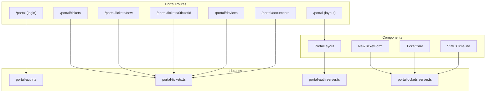

**Diagram sources**

- [portal.tsx:1-10](file://src/routes/portal.tsx#L1-L10)
- [PortalLayout.tsx:1-62](file://src/components/portal/PortalLayout.tsx#L1-L62)
- [portal-auth.ts:1-88](file://src/lib/portal-auth.ts#L1-L88)
- [portal-tickets.ts:1-112](file://src/lib/portal-tickets.ts#L1-L112)

**Section sources**

- [portal.tsx:1-10](file://src/routes/portal.tsx#L1-L10)
- [PortalLayout.tsx:1-62](file://src/components/portal/PortalLayout.tsx#L1-L62)

## Core Components

### Authentication System

The portal implements a robust authentication mechanism using cryptographically secure tokens with configurable expiration periods and comprehensive validation:

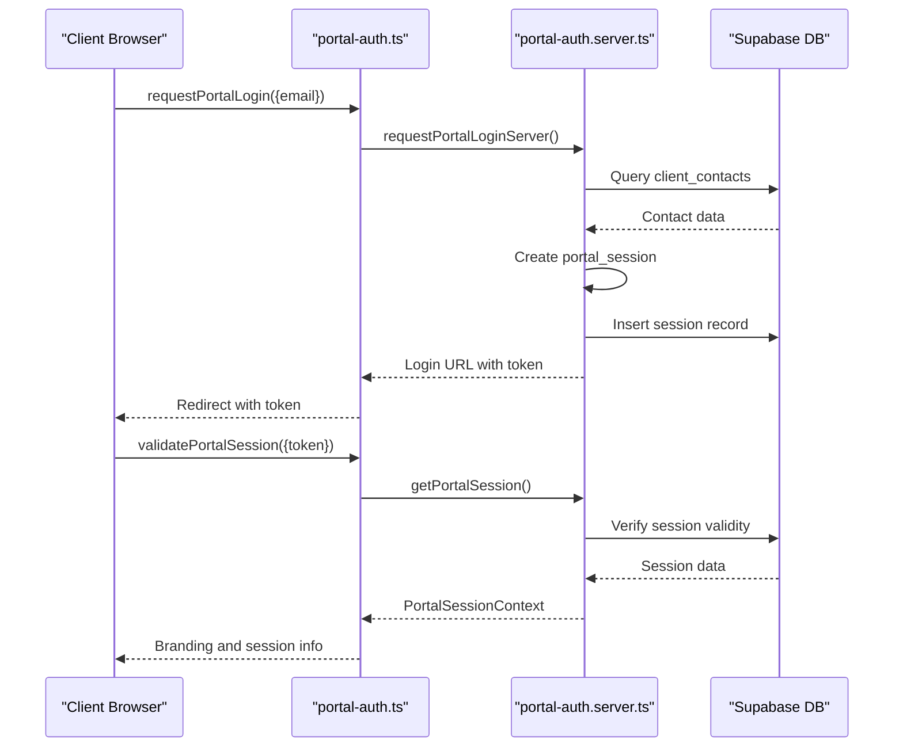

**Diagram sources**

- [portal-auth.ts:40-59](file://src/lib/portal-auth.ts#L40-L59)
- [portal-auth.server.ts:100-133](file://src/lib/portal-auth.server.ts#L100-L133)
- [portal-auth.server.ts:291-328](file://src/lib/portal-auth.server.ts#L291-L328)

### Ticket Management System

The ticket management system provides comprehensive functionality for creating, tracking, and managing support requests with advanced filtering and status tracking:

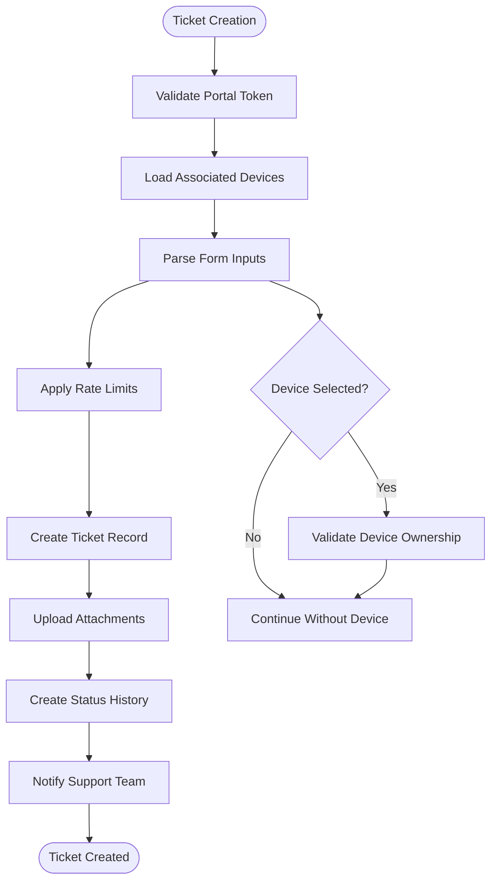

**Diagram sources**

- [portal-tickets.ts:236-320](file://src/lib/portal-tickets.ts#L236-L320)
- [portal-tickets.server.ts:246-320](file://src/lib/portal-tickets.server.ts#L246-L320)

**Section sources**

- [portal-auth.ts:1-88](file://src/lib/portal-auth.ts#L1-L88)
- [portal-auth.server.ts:1-337](file://src/lib/portal-auth.server.ts#L1-L337)
- [portal-tickets.ts:1-112](file://src/lib/portal-tickets.ts#L1-L112)
- [portal-tickets.server.ts:1-662](file://src/lib/portal-tickets.server.ts#L1-L662)

## Architecture Overview

### System Architecture

The client portal follows a layered architecture pattern with clear separation between presentation, business logic, and data access layers:

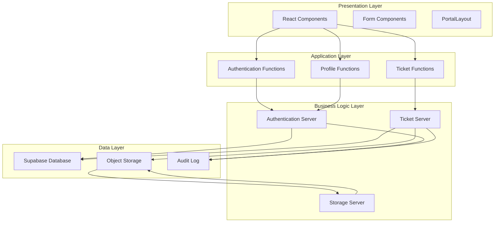

**Diagram sources**

- [PortalLayout.tsx:1-62](file://src/components/portal/PortalLayout.tsx#L1-L62)
- [portal-auth.ts:1-88](file://src/lib/portal-auth.ts#L1-L88)
- [portal-tickets.ts:1-112](file://src/lib/portal-tickets.ts#L1-L112)

### Data Flow Architecture

The portal implements a secure data flow with comprehensive validation and sanitization at every layer:

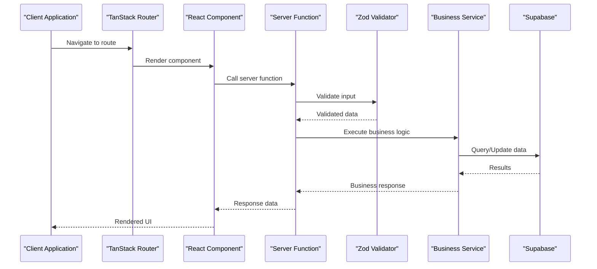

**Diagram sources**

- [index.tsx:1-76](file://src/routes/portal/index.tsx#L1-L76)
- [tickets/index.tsx:1-123](file://src/routes/portal/tickets/index.tsx#L1-L123)
- [portal-tickets.ts:46-51](file://src/lib/portal-tickets.ts#L46-L51)

## Detailed Component Analysis

### Portal Layout Component

The PortalLayout component serves as the central navigation hub for all portal activities, implementing dynamic branding and session validation:

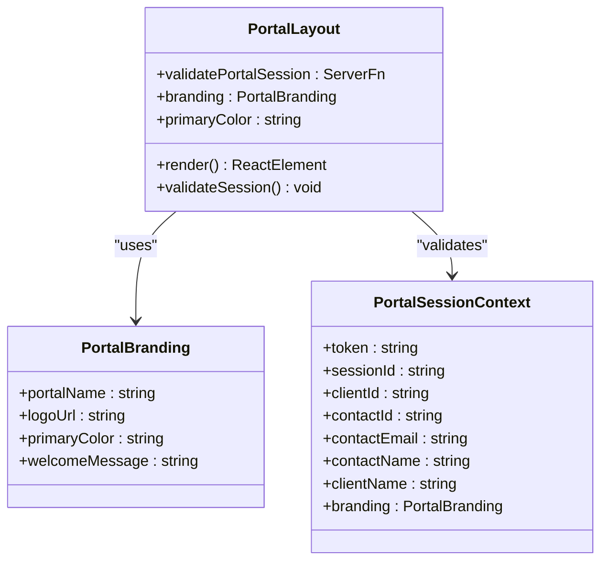

**Diagram sources**

- [PortalLayout.tsx:8-61](file://src/components/portal/PortalLayout.tsx#L8-L61)
- [portal-auth.server.ts:8-27](file://src/lib/portal-auth.server.ts#L8-L27)

### Authentication Flow Implementation

The authentication system implements multiple login methods with comprehensive security measures:

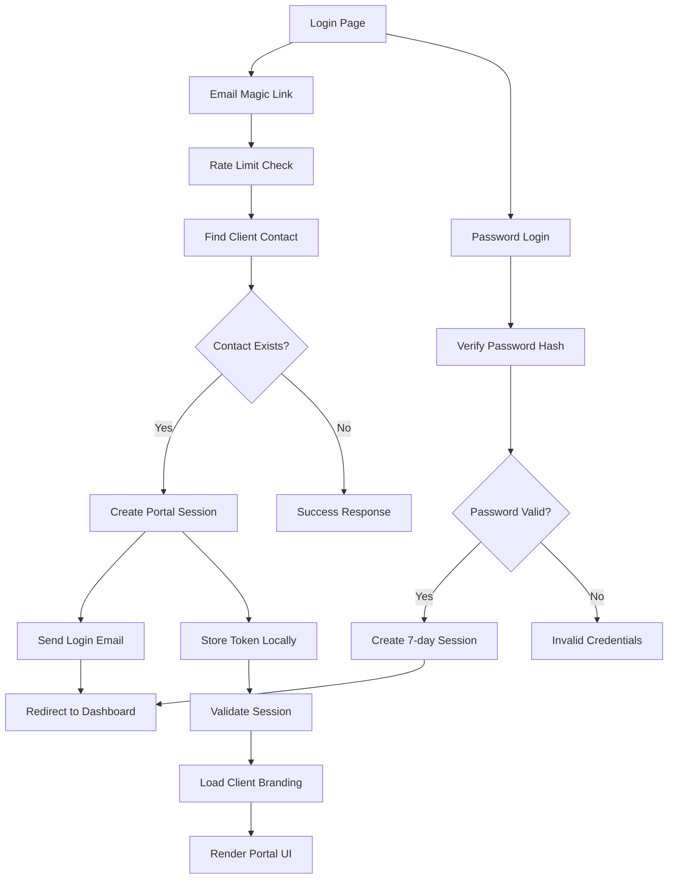

**Diagram sources**

- [index.tsx:16-75](file://src/routes/portal/index.tsx#L16-L75)
- [portal-auth.ts:40-59](file://src/lib/portal-auth.ts#L40-L59)
- [portal-auth.server.ts:100-156](file://src/lib/portal-auth.server.ts#L100-L156)

**Section sources**

- [PortalLayout.tsx:1-62](file://src/components/portal/PortalLayout.tsx#L1-L62)
- [index.tsx:1-76](file://src/routes/portal/index.tsx#L1-L76)
- [portal-auth.ts:1-88](file://src/lib/portal-auth.ts#L1-L88)
- [portal-auth.server.ts:1-337](file://src/lib/portal-auth.server.ts#L1-L337)

### Ticket Creation and Management

The ticket creation system provides comprehensive functionality with device association and attachment handling:

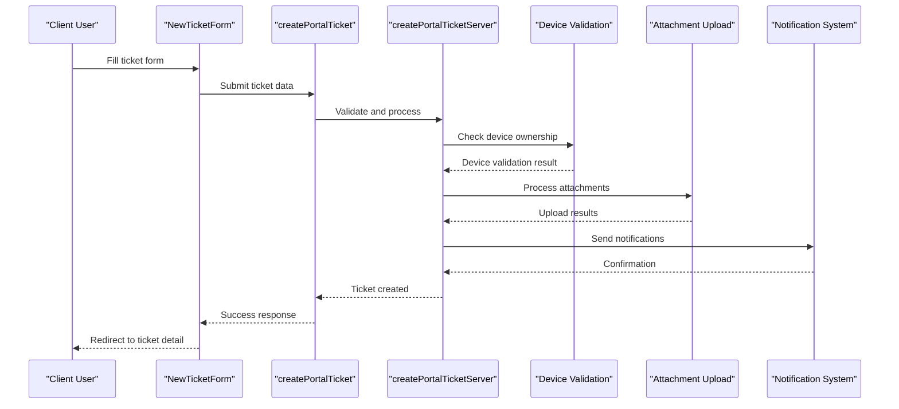

**Diagram sources**

- [NewTicketForm.tsx:63-86](file://src/components/portal/NewTicketForm.tsx#L63-L86)
- [portal-tickets.ts:60-66](file://src/lib/portal-tickets.ts#L60-L66)
- [portal-tickets.server.ts:236-320](file://src/lib/portal-tickets.server.ts#L236-L320)

### Document Management System

The document management system provides secure access to ticket-related documents with comprehensive filtering and metadata:

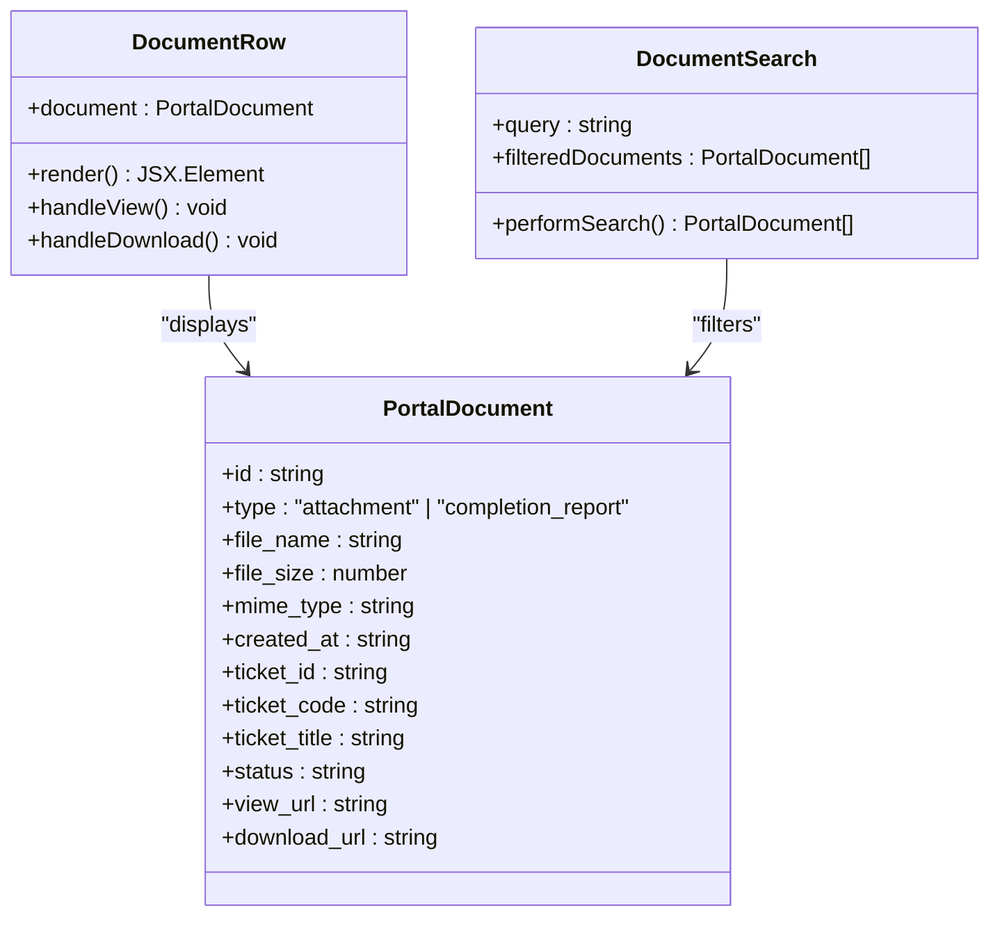

**Diagram sources**

- [documents/index.tsx:19-32](file://src/routes/portal/documents/index.tsx#L19-L32)
- [documents/index.tsx:162-209](file://src/routes/portal/documents/index.tsx#L162-L209)

**Section sources**

- [NewTicketForm.tsx:1-188](file://src/components/portal/NewTicketForm.tsx#L1-L188)
- [portal-tickets.ts:1-112](file://src/lib/portal-tickets.ts#L1-L112)
- [portal-tickets.server.ts:1-662](file://src/lib/portal-tickets.server.ts#L1-L662)
- [documents/index.tsx:1-231](file://src/routes/portal/documents/index.tsx#L1-L231)

### Status Tracking and Timeline Visualization

The status tracking system provides comprehensive visibility into ticket lifecycle with detailed historical tracking:

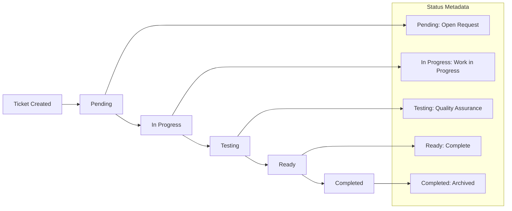

**Diagram sources**

- [StatusTimeline.tsx:44-46](file://src/components/portal/StatusTimeline.tsx#L44-L46)
- [portal-tickets.server.ts:14-20](file://src/lib/portal-tickets.server.ts#L14-L20)

**Section sources**

- [StatusTimeline.tsx:1-171](file://src/components/portal/StatusTimeline.tsx#L1-L171)
- [portal-tickets.server.ts:1-662](file://src/lib/portal-tickets.server.ts#L1-L662)

## Dependency Analysis

### Component Dependencies

The portal components exhibit clear dependency relationships with well-defined interfaces:

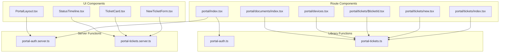

**Diagram sources**

- [portal.tsx:1-10](file://src/routes/portal.tsx#L1-L10)
- [portal-auth.ts:1-88](file://src/lib/portal-auth.ts#L1-L88)
- [portal-tickets.ts:1-112](file://src/lib/portal-tickets.ts#L1-L112)

### Data Flow Dependencies

The system maintains clean data flow patterns with proper separation of concerns:

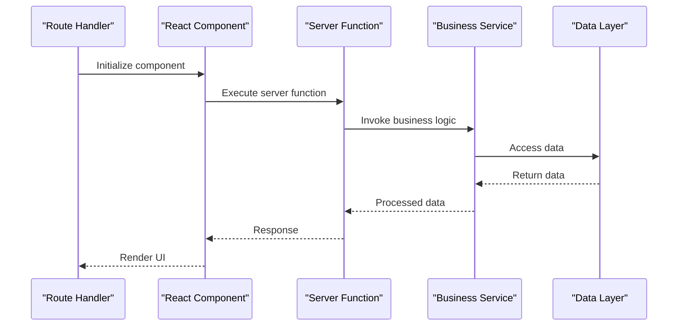

**Diagram sources**

- [tickets/index.tsx:16-43](file://src/routes/portal/tickets/index.tsx#L16-L43)
- [portal-tickets.ts:46-51](file://src/lib/portal-tickets.ts#L46-L51)

**Section sources**

- [portal.tsx:1-10](file://src/routes/portal.tsx#L1-L10)
- [portal-auth.ts:1-88](file://src/lib/portal-auth.ts#L1-L88)
- [portal-tickets.ts:1-112](file://src/lib/portal-tickets.ts#L1-L112)

## Performance Considerations

The client portal implementation incorporates several performance optimization strategies:

### Caching Strategies

- **Session Validation**: Client-side caching of branding and session data reduces redundant server calls
- **Component Memoization**: React.memo usage for expensive components like document lists
- **Query Optimization**: Efficient database queries with proper indexing on frequently accessed fields

### Network Optimization

- **Lazy Loading**: Route-based lazy loading prevents unnecessary bundle downloads
- **Image Optimization**: Dynamic image loading with appropriate sizing and compression
- **Rate Limiting**: Built-in rate limiting prevents abuse and ensures fair resource distribution

### Scalability Features

- **Database Indexing**: Strategic indexing on portal_sessions, client_contacts, and tickets tables
- **Pagination**: Implemented pagination for large datasets in tickets and documents
- **Connection Pooling**: Efficient database connection management through Supabase

## Troubleshooting Guide

### Common Authentication Issues

**Problem**: Users cannot access the portal after login
**Solution**: Check token validity and session expiration in the portal_sessions table

**Problem**: Email login links not working
**Solution**: Verify email delivery configuration and check for rate limiting violations

### Ticket Creation Problems

**Problem**: Tickets not appearing in the portal
**Solution**: Verify client_id associations and status filtering logic

**Problem**: Attachment upload failures
**Solution**: Check file size limits (5MB max) and supported MIME types

### Document Access Issues

**Problem**: Documents not loading or showing expired links
**Solution**: Verify signed URL generation and storage bucket permissions

**Section sources**

- [portal-auth.server.ts:291-328](file://src/lib/portal-auth.server.ts#L291-L328)
- [portal-tickets.server.ts:199-234](file://src/lib/portal-tickets.server.ts#L199-L234)
- [portal-tickets.server.ts:384-404](file://src/lib/portal-tickets.server.ts#L384-L404)

## Conclusion

The Client Portal Enhancements represent a comprehensive solution for enabling external clients to interact with the PCReady support system. The implementation demonstrates strong architectural principles with clear separation of concerns, robust security measures, and comprehensive functionality.

Key achievements include:

- Secure token-based authentication with customizable client branding
- Comprehensive ticket management with device association and attachment support
- Advanced document management with searchable archives
- Real-time status tracking and historical visibility
- Responsive design optimized for various client devices

The modular architecture ensures maintainability and extensibility, while the comprehensive error handling and performance optimizations provide a reliable user experience. The portal successfully bridges the gap between internal support systems and external client needs, enhancing overall customer satisfaction and operational efficiency.

Future enhancements could include mobile app integration, advanced reporting capabilities, and expanded customization options for client-specific workflows.
