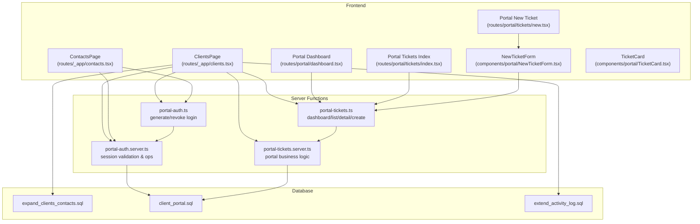
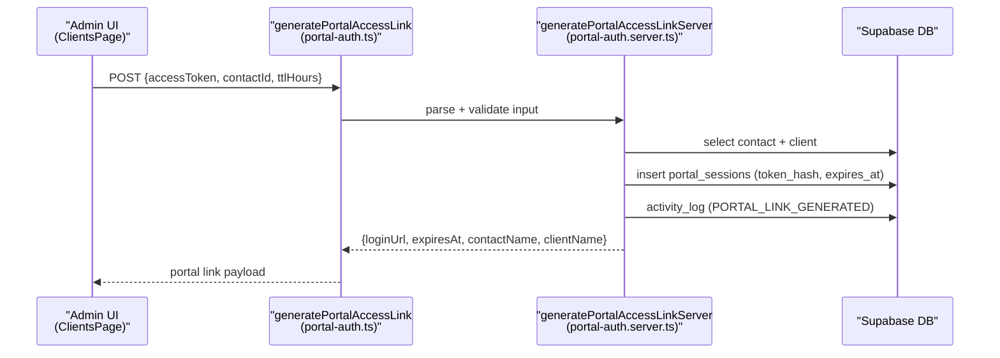
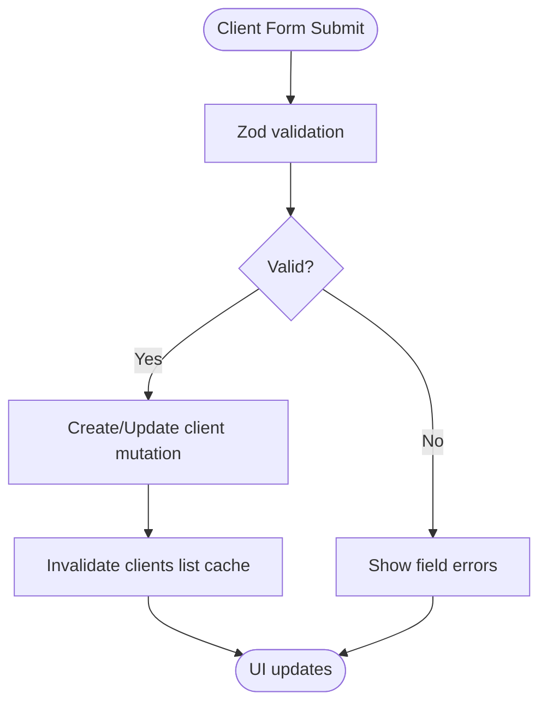
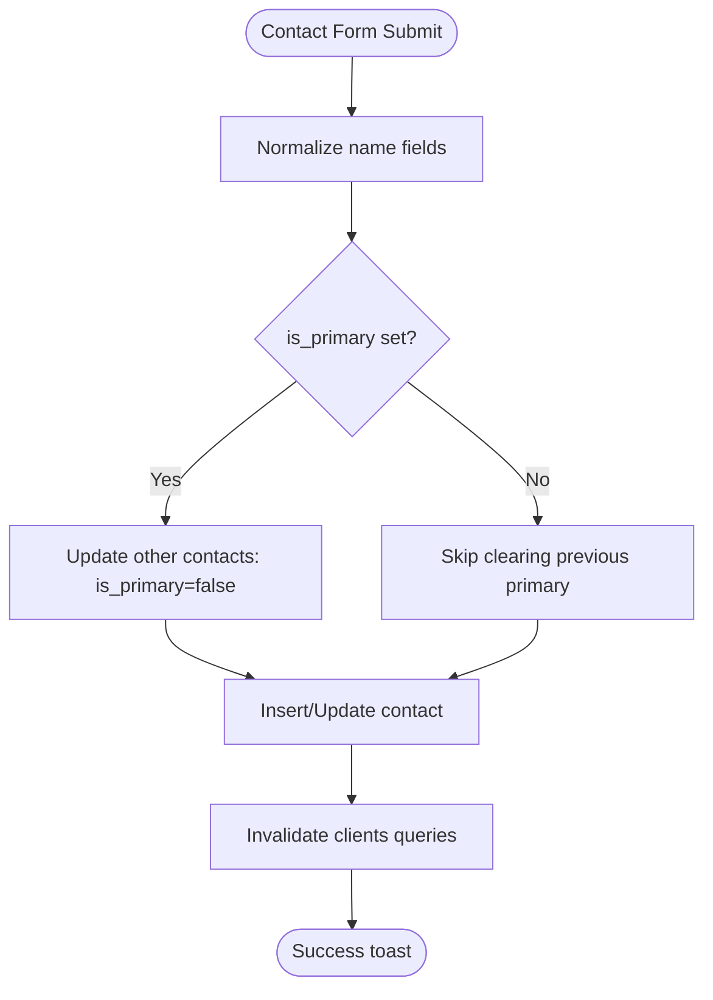
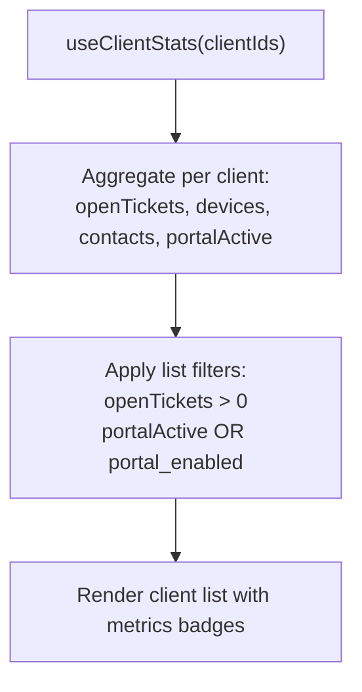
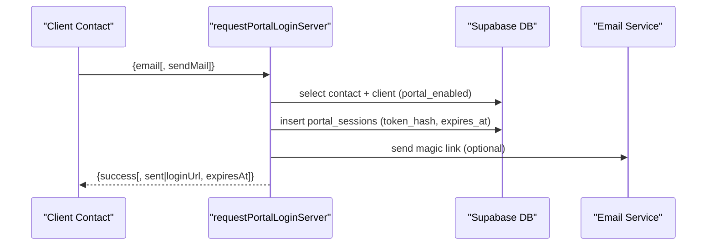
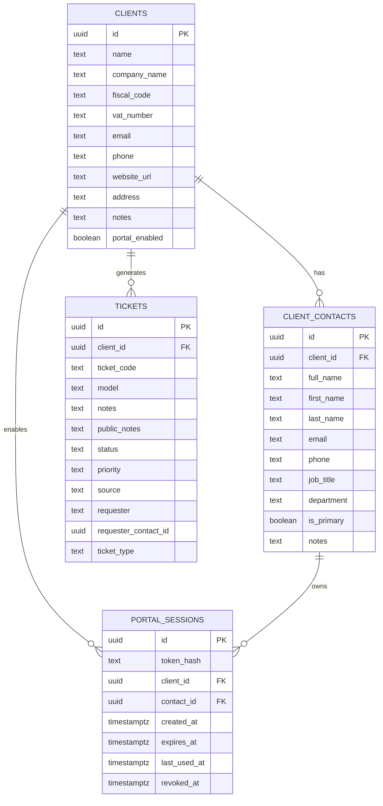
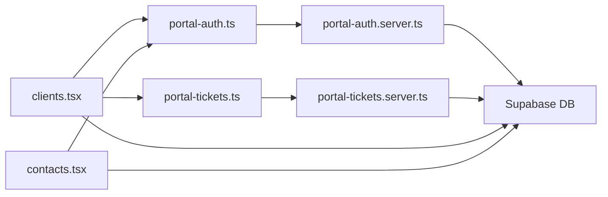

# Client and Contact Management

<cite>
**Referenced Files in This Document**
- [clients.ts](file://lib/schemas/clients.ts)
- [clients.tsx](file://src/routes/_app/clients.tsx)
- [contacts.tsx](file://src/routes/_app/contacts.tsx)
- [portal-auth.ts](file://src/lib/portal-auth.ts)
- [portal-auth.server.ts](file://src/lib/portal-auth.server.ts)
- [portal-tickets.ts](file://src/lib/portal-tickets.ts)
- [portal-tickets.server.ts](file://src/lib/portal-tickets.server.ts)
- [NewTicketForm.tsx](file://src/components/portal/NewTicketForm.tsx)
- [TicketCard.tsx](file://src/components/portal/TicketCard.tsx)
- [dashboard.tsx](file://src/routes/portal/dashboard.tsx)
- [tickets.index.tsx](file://src/routes/portal/tickets/index.tsx)
- [tickets.new.tsx](file://src/routes/portal/tickets/new.tsx)
- [expand_clients_contacts.sql](file://supabase/migrations/20260430182000_expand_clients_contacts.sql)
- [client_portal.sql](file://supabase/migrations/20260511162100_client_portal.sql)
- [extend_activity_log.sql](file://supabase/migrations/20260511151100_extend_activity_log.sql)
</cite>

## Table of Contents

1. [Introduction](#introduction)
2. [Project Structure](#project-structure)
3. [Core Components](#core-components)
4. [Architecture Overview](#architecture-overview)
5. [Detailed Component Analysis](#detailed-component-analysis)
6. [Dependency Analysis](#dependency-analysis)
7. [Performance Considerations](#performance-considerations)
8. [Troubleshooting Guide](#troubleshooting-guide)
9. [Conclusion](#conclusion)

## Introduction

This document explains the client and contact management system, covering:

- Client information management (company details, billing addresses, notes)
- Contact relationship handling (multiple contacts per client, primary contact designation)
- Client statistics and analytics (service history and support metrics)
- Client portal access management and authentication
- Portal ticket submission workflow and status viewing
- Configuration options for categories, contact types, and portal permissions
- Relationships between clients, contacts, tickets, and devices
- Common issues and performance considerations

The content is designed for both client service representatives and administrators, balancing practical usage guidance with technical depth.

## Project Structure

The client and contact management spans frontend routes, server functions, Supabase database schemas, and portal components:

- Frontend pages for client and contact management
- Server functions for portal authentication and ticket operations
- Database migrations defining client, contact, portal session, and ticket structures
- Portal UI components for dashboard, ticket listing, and new ticket creation



**Diagram sources**

- [clients.tsx:174-597](file://src/routes/_app/clients.tsx#L174-L597)
- [contacts.tsx:37-376](file://src/routes/_app/contacts.tsx#L37-L376)
- [portal-auth.ts:27-60](file://src/lib/portal-auth.ts#L27-L60)
- [portal-auth.server.ts:46-145](file://src/lib/portal-auth.server.ts#L46-L145)
- [portal-tickets.ts:19-52](file://src/lib/portal-tickets.ts#L19-L52)
- [portal-tickets.server.ts:22-131](file://src/lib/portal-tickets.server.ts#L22-L131)
- [expand_clients_contacts.sql:1-29](file://supabase/migrations/20260430182000_expand_clients_contacts.sql#L1-L29)
- [client_portal.sql:1-47](file://supabase/migrations/20260511162100_client_portal.sql#L1-L47)
- [extend_activity_log.sql:1-26](file://supabase/migrations/20260511151100_extend_activity_log.sql#L1-L26)

**Section sources**

- [clients.tsx:1-800](file://src/routes/_app/clients.tsx#L1-L800)
- [contacts.tsx:1-589](file://src/routes/_app/contacts.tsx#L1-L589)
- [portal-auth.ts:1-61](file://src/lib/portal-auth.ts#L1-L61)
- [portal-auth.server.ts:1-238](file://src/lib/portal-auth.server.ts#L1-L238)
- [portal-tickets.ts:1-53](file://src/lib/portal-tickets.ts#L1-L53)
- [portal-tickets.server.ts:1-205](file://src/lib/portal-tickets.server.ts#L1-L205)
- [expand_clients_contacts.sql:1-29](file://supabase/migrations/20260430182000_expand_clients_contacts.sql#L1-L29)
- [client_portal.sql:1-47](file://supabase/migrations/20260511162100_client_portal.sql#L1-L47)
- [extend_activity_log.sql:1-26](file://supabase/migrations/20260511151100_extend_activity_log.sql#L1-L26)

## Core Components

- Client schema and forms: validated input for company name, tax identifiers, email, phone, website URL, address, and notes.
- Contact schema and forms: validated input for full name, email, phone, job title, department, primary contact flag, and notes.
- Client list and detail views: search, filtering, pagination, and tabs for info, contacts, tickets, devices.
- Contact management: create, edit, delete, and portal access link generation per contact.
- Portal authentication: magic-link request, session validation, and portal session lifecycle.
- Portal ticketing: dashboard metrics, ticket listing, detail with status history and public notes, and new ticket creation.

**Section sources**

- [clients.ts:4-26](file://lib/schemas/clients.ts#L4-L26)
- [clients.tsx:106-170](file://src/routes/_app/clients.tsx#L106-L170)
- [contacts.tsx:28-36](file://src/routes/_app/contacts.tsx#L28-L36)

## Architecture Overview

The system integrates frontend UI with server functions and Supabase backend. Client and contact data are stored in normalized tables with portal sessions enabling secure client portal access. Ticket operations leverage a dedicated portal session context and RLS policies.



**Diagram sources**

- [portal-auth.ts:48-53](file://src/lib/portal-auth.ts#L48-L53)
- [portal-auth.server.ts:97-145](file://src/lib/portal-auth.server.ts#L97-L145)

**Section sources**

- [portal-auth.ts:1-61](file://src/lib/portal-auth.ts#L1-L61)
- [portal-auth.server.ts:1-238](file://src/lib/portal-auth.server.ts#L1-L238)

## Detailed Component Analysis

### Client Information Management

- Data model: Company name, VAT/fiscal code, email, phone, website URL, address, notes.
- Validation: Zod schemas enforce required fields and email format.
- UI: Form with real-time validation, create/update mutations, and client selection with tabs for related data.
- Search and filters: Name/company search, VAT/code/email filter, open tickets and portal active filters.
- Pagination and bulk actions: Page size controls, bulk delete for clients.



**Diagram sources**

- [clients.ts:4-14](file://lib/schemas/clients.ts#L4-L14)
- [clients.tsx:385-426](file://src/routes/_app/clients.tsx#L385-L426)

**Section sources**

- [clients.ts:1-27](file://lib/schemas/clients.ts#L1-L27)
- [clients.tsx:106-170](file://src/routes/_app/clients.tsx#L106-L170)
- [clients.tsx:385-426](file://src/routes/_app/clients.tsx#L385-L426)

### Contact Relationship Handling

- Schema: Full name, email, phone, job title/role, department, primary contact flag, notes.
- Primary contact: Enforced by unique index on client_id where is_primary is true.
- UI: Create/edit modal, set/unset primary contact, delete contact, portal access link generation.
- Global view: Filter by client, department, and portal access status.



**Diagram sources**

- [clients.ts:16-26](file://lib/schemas/clients.ts#L16-L26)
- [clients.tsx:469-512](file://src/routes/_app/clients.tsx#L469-L512)
- [expand_clients_contacts.sql:26-29](file://supabase/migrations/20260430182000_expand_clients_contacts.sql#L26-L29)

**Section sources**

- [clients.ts:16-26](file://lib/schemas/clients.ts#L16-L26)
- [clients.tsx:448-518](file://src/routes/_app/clients.tsx#L448-L518)
- [contacts.tsx:102-149](file://src/routes/_app/contacts.tsx#L102-L149)
- [expand_clients_contacts.sql:9-29](file://supabase/migrations/20260430182000_expand_clients_contacts.sql#L9-L29)

### Client Statistics and Analytics

- Stats aggregation: Open tickets, devices, contacts, and portal active status per client.
- Filtering: "Open tickets" and "Portal active" list filters use stats to render results.
- Dashboard metrics (portal): Open, in-progress, and resolved-this-month counts for recent tickets.



**Diagram sources**

- [clients.tsx:247-352](file://src/routes/_app/clients.tsx#L247-L352)
- [portal-tickets.server.ts:22-57](file://src/lib/portal-tickets.server.ts#L22-L57)

**Section sources**

- [clients.tsx:325-352](file://src/routes/_app/clients.tsx#L325-L352)
- [portal-tickets.server.ts:22-57](file://src/lib/portal-tickets.server.ts#L22-L57)

### Client Portal Access Management and Authentication

- Session lifecycle: Generate portal session token, persist login URL, track expiry, and mark revocation.
- Access control: Operators must have admin or tech role; portal disabled per-client gating.
- Audit logging: Log portal link generation and revocation with actor and entity metadata.
- Token validation: Hashed token lookup, revoked/expired checks, and client portal enabled enforcement.



**Diagram sources**

- [portal-auth.server.ts:62-95](file://src/lib/portal-auth.server.ts#L62-L95)
- [client_portal.sql:20-34](file://supabase/migrations/20260511162100_client_portal.sql#L20-L34)

**Section sources**

- [portal-auth.ts:27-46](file://src/lib/portal-auth.ts#L27-L46)
- [portal-auth.server.ts:62-145](file://src/lib/portal-auth.server.ts#L62-L145)
- [client_portal.sql:1-47](file://supabase/migrations/20260511162100_client_portal.sql#L1-L47)

### Portal Ticket Submission Workflow and Status Viewing

- Dashboard: Recent tickets and summary metrics for the logged-in client.
- Listing: All tickets for the client with status and assignee.
- Detail: Ticket with status history and public notes, including actor attribution.
- Creation: Urgency mapped to priority, portal source, and initial status history entry.

```mermaid
sequenceDiagram
participant Client as "Portal User"
participant Dashboard as "getPortalDashboardServer"
participant Tickets as "listPortalTicketsServer"
participant Detail as "getPortalTicketDetailServer"
participant Create as "createPortalTicketServer"
participant DB as "Supabase DB"
Client->>Dashboard : {token}
Dashboard->>DB : select client tickets (LIMIT 10)
Dashboard-->>Client : {stats, recentTickets}
Client->>Tickets : {token}
Tickets->>DB : select client tickets
Tickets-->>Client : {tickets}
Client->>Detail : {token, ticketId}
Detail->>DB : select ticket + status history + public notes
Detail-->>Client : {ticket, history, publicNotes}
Client->>Create : {token, title, description, category, urgency}
Create->>DB : insert ticket + initial status history
Create->>DB : notify admins + optional email
Create-->>Client : {success, ticketId}
```

**Diagram sources**

- [portal-tickets.server.ts:22-131](file://src/lib/portal-tickets.server.ts#L22-L131)
- [portal-tickets.server.ts:133-193](file://src/lib/portal-tickets.server.ts#L133-L193)
- [dashboard.tsx:20-104](file://src/routes/portal/dashboard.tsx#L20-L104)
- [tickets.index.tsx:16-92](file://src/routes/portal/tickets/index.tsx#L16-L92)
- [tickets.new.tsx:15-75](file://src/routes/portal/tickets/new.tsx#L15-L75)

**Section sources**

- [portal-tickets.ts:19-52](file://src/lib/portal-tickets.ts#L19-L52)
- [portal-tickets.server.ts:1-205](file://src/lib/portal-tickets.server.ts#L1-L205)
- [dashboard.tsx:1-131](file://src/routes/portal/dashboard.tsx#L1-L131)
- [tickets.index.tsx:1-93](file://src/routes/portal/tickets/index.tsx#L1-L93)
- [tickets.new.tsx:1-76](file://src/routes/portal/tickets/new.tsx#L1-L76)
- [NewTicketForm.tsx:1-84](file://src/components/portal/NewTicketForm.tsx#L1-L84)
- [TicketCard.tsx:1-24](file://src/components/portal/TicketCard.tsx#L1-L24)

### Configuration Options

- Ticket categories: Loaded from app settings for portal category selection.
- Portal permissions: Admin/tech operators can generate and revoke links; portal disabled per-client gating.
- Audit log: Extended with action type, entity, severity, and session ID for compliance and tracing.

**Section sources**

- [portal-tickets.server.ts:195-204](file://src/lib/portal-tickets.server.ts#L195-L204)
- [portal-auth.server.ts:30-44](file://src/lib/portal-auth.server.ts#L30-L44)
- [client_portal.sql:44-46](file://supabase/migrations/20260511162100_client_portal.sql#L44-L46)
- [extend_activity_log.sql:1-26](file://supabase/migrations/20260511151100_extend_activity_log.sql#L1-L26)

### Relationships Between Clients, Contacts, Tickets, and Devices

- Clients and Contacts: One-to-many; primary contact enforced per client.
- Clients and Tickets: One-to-many; portal source tracked; public notes visible to clients.
- Portal Sessions: Many-to-one with contacts and clients; lifecycle managed centrally.
- Devices: Linked to clients via separate tables; client view aggregates device counts.



**Diagram sources**

- [expand_clients_contacts.sql:1-29](file://supabase/migrations/20260430182000_expand_clients_contacts.sql#L1-L29)
- [client_portal.sql:1-47](file://supabase/migrations/20260511162100_client_portal.sql#L1-L47)

**Section sources**

- [expand_clients_contacts.sql:1-29](file://supabase/migrations/20260430182000_expand_clients_contacts.sql#L1-L29)
- [client_portal.sql:1-47](file://supabase/migrations/20260511162100_client_portal.sql#L1-L47)

## Dependency Analysis

- Frontend pages depend on server functions for portal operations and client queries.
- Server functions depend on Supabase client for admin operations and RLS policies.
- Database migrations define constraints and indexes ensuring data integrity and performance.



**Diagram sources**

- [clients.tsx:174-597](file://src/routes/_app/clients.tsx#L174-L597)
- [contacts.tsx:37-376](file://src/routes/_app/contacts.tsx#L37-L376)
- [portal-auth.ts:1-61](file://src/lib/portal-auth.ts#L1-L61)
- [portal-auth.server.ts:1-238](file://src/lib/portal-auth.server.ts#L1-L238)
- [portal-tickets.ts:1-53](file://src/lib/portal-tickets.ts#L1-L53)
- [portal-tickets.server.ts:1-205](file://src/lib/portal-tickets.server.ts#L1-L205)

**Section sources**

- [clients.tsx:220-247](file://src/routes/_app/clients.tsx#L220-L247)
- [contacts.tsx:42-45](file://src/routes/_app/contacts.tsx#L42-L45)
- [portal-auth.ts:1-61](file://src/lib/portal-auth.ts#L1-L61)
- [portal-tickets.ts:1-53](file://src/lib/portal-tickets.ts#L1-L53)

## Performance Considerations

- Client list pagination: PAGE_SIZE and total count reduce payload sizes; invalidate queries after mutations.
- Queries: Use targeted selects and ordering; indexes on client_id and portal session token_hash improve lookup performance.
- Portal operations: Rate limiting prevents abuse; hashing tokens avoids storing plaintext secrets.
- Dashboard metrics: Limit recent tickets to small N to keep rendering fast.

[No sources needed since this section provides general guidance]

## Troubleshooting Guide

- Contact duplication: Ensure unique primary contact per client via database constraint; verify is_primary updates clear previous primary.
- Portal access problems: Confirm client portal_enabled flag; check session validity and revocation; verify operator roles (admin/tech).
- Client data synchronization: After edits, invalidate client-related queries to refresh UI; confirm mutations return success and toast messages.
- Ticket visibility: Public notes are visible to portal users; ensure proper source and status history entries.

**Section sources**

- [expand_clients_contacts.sql:26-29](file://supabase/migrations/20260430182000_expand_clients_contacts.sql#L26-L29)
- [client_portal.sql:44-46](file://supabase/migrations/20260511162100_client_portal.sql#L44-L46)
- [portal-auth.server.ts:196-229](file://src/lib/portal-auth.server.ts#L196-L229)
- [clients.tsx:514-518](file://src/routes/_app/clients.tsx#L514-L518)

## Conclusion

The client and contact management system provides robust client information handling, multi-contact support with primary designation, integrated portal access, and comprehensive ticketing workflows. Administrators benefit from strict RLS policies, audit logging, and configuration flexibility, while client service representatives enjoy streamlined UIs for search, filtering, and portal operations.
