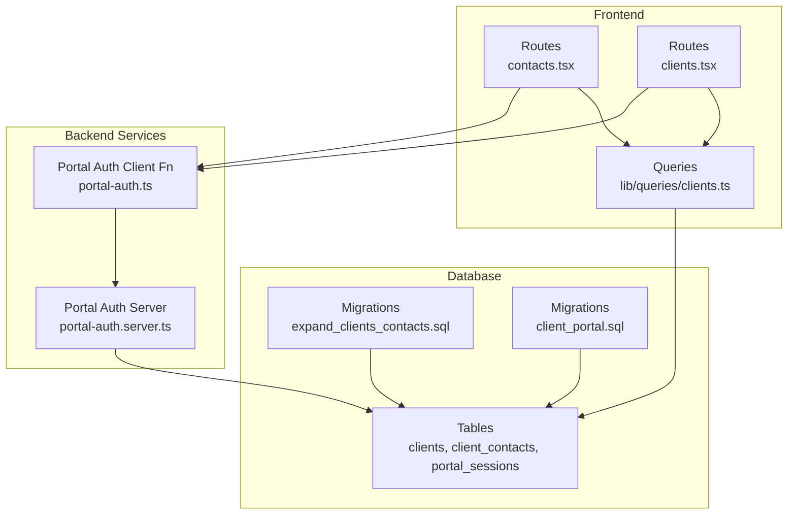
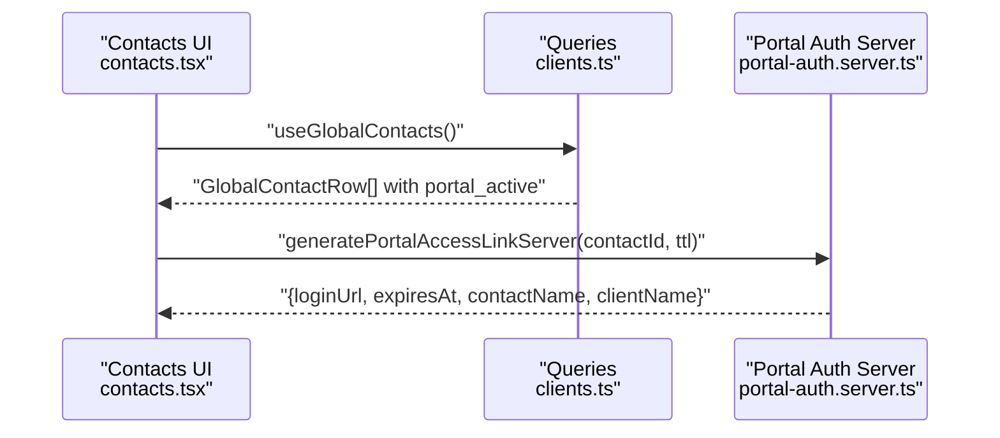
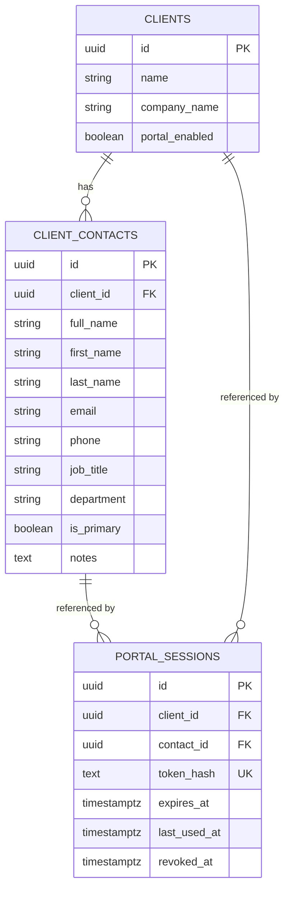
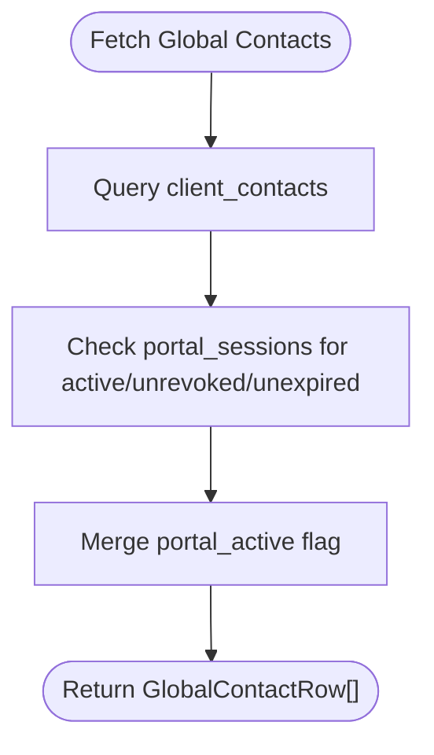
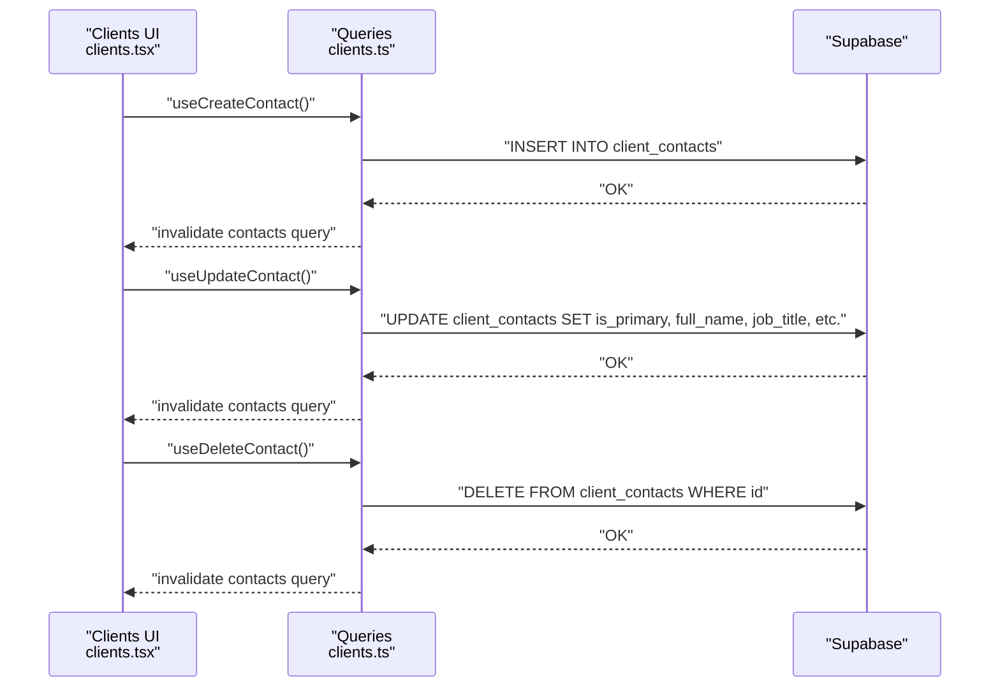
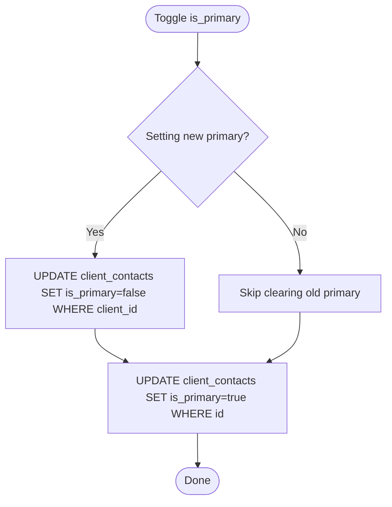
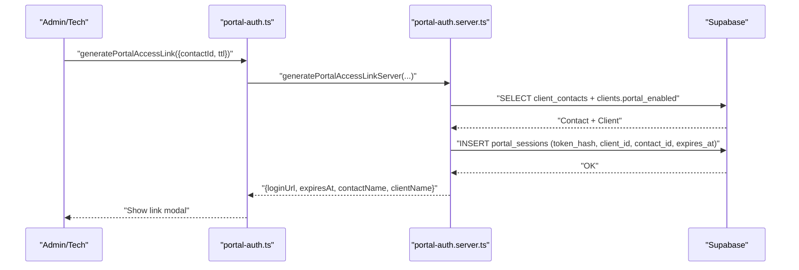
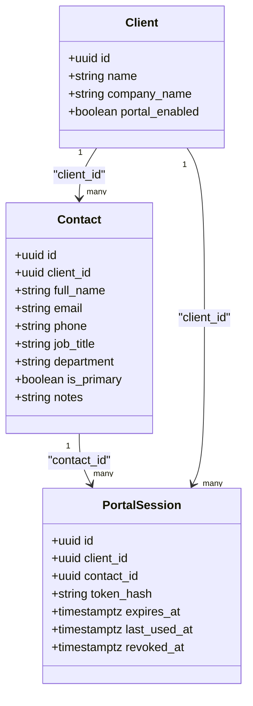
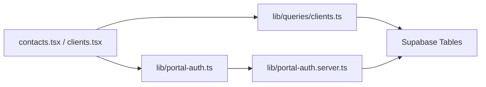

# Contact Relationship Management

<cite>
**Referenced Files in This Document**
- [contacts.tsx](file://src/routes/_app/contacts.tsx)
- [clients.tsx](file://src/routes/_app/clients.tsx)
- [clients.ts](file://src/lib/queries/clients.ts)
- [portal-auth.server.ts](file://src/lib/portal-auth.server.ts)
- [portal-auth.ts](file://src/lib/portal-auth.ts)
- [types.ts](file://src/integrations/supabase/types.ts)
- [20260430182000_expand_clients_contacts.sql](file://supabase/migrations/20260430182000_expand_clients_contacts.sql)
- [20260511162100_client_portal.sql](file://supabase/migrations/20260511162100_client_portal.sql)
- [20260430170000_split_assets_clients_tickets.sql](file://supabase/migrations/20260430170000_split_assets_clients_tickets.sql)
</cite>

## Table of Contents
1. [Introduction](#introduction)
2. [Project Structure](#project-structure)
3. [Core Components](#core-components)
4. [Architecture Overview](#architecture-overview)
5. [Detailed Component Analysis](#detailed-component-analysis)
6. [Dependency Analysis](#dependency-analysis)
7. [Performance Considerations](#performance-considerations)
8. [Troubleshooting Guide](#troubleshooting-guide)
9. [Conclusion](#conclusion)

## Introduction
This document explains the contact relationship management system used to maintain client contacts, manage portal access, and support client communications. It covers the contact data model, CRUD operations, primary contact designation, global contact views, portal access lifecycle, and operational guidance for client service representatives and administrators.

## Project Structure
The contact system spans frontend UI routes, backend Supabase queries, and portal authentication services:
- Frontend routes render contact lists, edit forms, and portal access actions.
- Queries encapsulate contact data fetching, filtering, and portal access checks.
- Portal authentication manages secure links, session validation, and revocation.
- Migrations define the underlying schema for contacts, clients, and portal sessions.

**Diagram sources**
- [contacts.tsx:16-26](file://src/routes/_app/contacts.tsx#L16-L26)
- [clients.tsx:174-200](file://src/routes/_app/clients.tsx#L174-L200)
- [clients.ts:190-208](file://src/lib/queries/clients.ts#L190-L208)
- [portal-auth.server.ts:97-145](file://src/lib/portal-auth.server.ts#L97-L145)
- [portal-auth.ts:48-61](file://src/lib/portal-auth.ts#L48-L61)
- [20260430182000_expand_clients_contacts.sql:1-29](file://supabase/migrations/20260430182000_expand_clients_contacts.sql#L1-L29)
- [20260511162100_client_portal.sql:20-46](file://supabase/migrations/20260511162100_client_portal.sql#L20-L46)

**Section sources**
- [contacts.tsx:16-26](file://src/routes/_app/contacts.tsx#L16-L26)
- [clients.tsx:174-200](file://src/routes/_app/clients.tsx#L174-L200)
- [clients.ts:190-208](file://src/lib/queries/clients.ts#L190-L208)
- [portal-auth.server.ts:97-145](file://src/lib/portal-auth.server.ts#L97-L145)
- [portal-auth.ts:48-61](file://src/lib/portal-auth.ts#L48-L61)
- [20260430182000_expand_clients_contacts.sql:1-29](file://supabase/migrations/20260430182000_expand_clients_contacts.sql#L1-L29)
- [20260511162100_client_portal.sql:20-46](file://supabase/migrations/20260511162100_client_portal.sql#L20-L46)

## Core Components
- Contact data model: personal info (full_name, first_name, last_name, email, phone), professional details (job_title, department, notes), and relationship attributes (is_primary, client_id).
- Global contact view: aggregates contacts across clients and indicates portal access status.
- Portal access management: generates, validates, and revokes secure links for client self-service.
- Primary contact designation: enforces single primary contact per client via database constraints.

**Section sources**
- [clients.ts:81-95](file://src/lib/queries/clients.ts#L81-L95)
- [clients.ts:190-208](file://src/lib/queries/clients.ts#L190-L208)
- [20260430182000_expand_clients_contacts.sql:9-28](file://supabase/migrations/20260430182000_expand_clients_contacts.sql#L9-L28)
- [20260511162100_client_portal.sql:20-46](file://supabase/migrations/20260511162100_client_portal.sql#L20-L46)

## Architecture Overview
The system integrates UI routes, data queries, and portal authentication:
- Routes trigger mutations and queries to manage contacts and portal access.
- Queries fetch contact data, compute portal access, and expose typed results.
- Portal authentication creates secure tokens, validates sessions, and logs activities.

**Diagram sources**
- [contacts.tsx:44-45](file://src/routes/_app/contacts.tsx#L44-L45)
- [clients.ts:190-208](file://src/lib/queries/clients.ts#L190-L208)
- [portal-auth.server.ts:97-145](file://src/lib/portal-auth.server.ts#L97-L145)

## Detailed Component Analysis

### Contact Data Model and Relationships
- Personal information: full_name, first_name, last_name, email, phone.
- Professional details: job_title, department, notes.
- Relationship attributes: is_primary, client_id.
- Portal access indicator: portal_active computed from active portal_sessions.

**Diagram sources**
- [20260430182000_expand_clients_contacts.sql:9-28](file://supabase/migrations/20260430182000_expand_clients_contacts.sql#L9-L28)
- [20260511162100_client_portal.sql:20-46](file://supabase/migrations/20260511162100_client_portal.sql#L20-L46)
- [types.ts:300-383](file://src/integrations/supabase/types.ts#L300-L383)

**Section sources**
- [clients.ts:81-95](file://src/lib/queries/clients.ts#L81-L95)
- [20260430182000_expand_clients_contacts.sql:9-28](file://supabase/migrations/20260430182000_expand_clients_contacts.sql#L9-L28)
- [20260511162100_client_portal.sql:20-46](file://supabase/migrations/20260511162100_client_portal.sql#L20-L46)
- [types.ts:300-383](file://src/integrations/supabase/types.ts#L300-L383)

### Global Contact View
- Fetches all contacts with associated client metadata and computes portal_active by checking active, unrevoked, unexpired portal_sessions.
- Provides filtering by client, department, and portal access status.

**Diagram sources**
- [clients.ts:190-208](file://src/lib/queries/clients.ts#L190-L208)
- [clients.ts:163-188](file://src/lib/queries/clients.ts#L163-L188)

**Section sources**
- [clients.ts:190-208](file://src/lib/queries/clients.ts#L190-L208)
- [clients.ts:163-188](file://src/lib/queries/clients.ts#L163-L188)
- [contacts.tsx:44-100](file://src/routes/_app/contacts.tsx#L44-L100)

### Contact CRUD Operations
- Create: insert into client_contacts with client_id and normalized fields.
- Read: fetch by client_id, ordered by is_primary and full_name.
- Update: toggle is_primary across a client via update and enforce uniqueness via database constraint.
- Delete: remove contact record.

**Diagram sources**
- [clients.ts:300-320](file://src/lib/queries/clients.ts#L300-L320)
- [clients.ts:355-392](file://src/lib/queries/clients.ts#L355-L392)
- [20260430182000_expand_clients_contacts.sql:26-28](file://supabase/migrations/20260430182000_expand_clients_contacts.sql#L26-L28)

**Section sources**
- [clients.ts:300-320](file://src/lib/queries/clients.ts#L300-L320)
- [clients.ts:355-392](file://src/lib/queries/clients.ts#L355-L392)
- [clients.tsx:358-383](file://src/routes/_app/clients.tsx#L358-L383)
- [20260430182000_expand_clients_contacts.sql:26-28](file://supabase/migrations/20260430182000_expand_clients_contacts.sql#L26-L28)

### Primary Contact Designation
- Enforced by a unique partial index on client_contacts: (client_id) WHERE is_primary.
- When toggling is_primary, the system updates existing primary to false before setting the new primary.

**Diagram sources**
- [contacts.tsx:120-125](file://src/routes/_app/contacts.tsx#L120-L125)
- [20260430182000_expand_clients_contacts.sql:26-28](file://supabase/migrations/20260430182000_expand_clients_contacts.sql#L26-L28)

**Section sources**
- [contacts.tsx:120-125](file://src/routes/_app/contacts.tsx#L120-L125)
- [20260430182000_expand_clients_contacts.sql:26-28](file://supabase/migrations/20260430182000_expand_clients_contacts.sql#L26-L28)

### Portal Access Management
- Generate link: validates operator role, checks client portal_enabled, creates portal_session with hashed token, and returns loginUrl and expiry.
- Validate session: resolves token_hash, ensures not revoked/expired, and updates last_used_at.
- Revoke link: marks active sessions as revoked for a contact.

**Diagram sources**
- [portal-auth.ts:48-61](file://src/lib/portal-auth.ts#L48-L61)
- [portal-auth.server.ts:97-145](file://src/lib/portal-auth.server.ts#L97-L145)
- [20260511162100_client_portal.sql:20-46](file://supabase/migrations/20260511162100_client_portal.sql#L20-L46)

**Section sources**
- [portal-auth.ts:48-61](file://src/lib/portal-auth.ts#L48-L61)
- [portal-auth.server.ts:97-145](file://src/lib/portal-auth.server.ts#L97-L145)
- [portal-auth.server.ts:147-194](file://src/lib/portal-auth.server.ts#L147-L194)
- [portal-auth.server.ts:196-229](file://src/lib/portal-auth.server.ts#L196-L229)
- [20260511162100_client_portal.sql:20-46](file://supabase/migrations/20260511162100_client_portal.sql#L20-L46)

### Contact-to-Client Relationships and Permissions
- Contact belongs to a single client via client_id.
- Access policies restrict contact operations to admin/tech roles.
- Portal access depends on client.portal_enabled and session validity.

**Diagram sources**
- [types.ts:300-383](file://src/integrations/supabase/types.ts#L300-L383)
- [20260511162100_client_portal.sql:20-46](file://supabase/migrations/20260511162100_client_portal.sql#L20-L46)

**Section sources**
- [types.ts:300-383](file://src/integrations/supabase/types.ts#L300-L383)
- [20260430170000_split_assets_clients_tickets.sql:65-71](file://supabase/migrations/20260430170000_split_assets_clients_tickets.sql#L65-L71)
- [20260511162100_client_portal.sql:20-46](file://supabase/migrations/20260511162100_client_portal.sql#L20-L46)

## Dependency Analysis
- Frontend routes depend on queries for data and portal-auth client functions for server-side operations.
- Queries depend on Supabase client for database access and compute portal_active via portal_sessions.
- Portal-auth server enforces role checks, validates client portal_enabled, and manages sessions.

**Diagram sources**
- [contacts.tsx:4-6](file://src/routes/_app/contacts.tsx#L4-L6)
- [clients.tsx:182-183](file://src/routes/_app/clients.tsx#L182-L183)
- [clients.ts:190-208](file://src/lib/queries/clients.ts#L190-L208)
- [portal-auth.ts:48-61](file://src/lib/portal-auth.ts#L48-L61)
- [portal-auth.server.ts:97-145](file://src/lib/portal-auth.server.ts#L97-L145)

**Section sources**
- [contacts.tsx:4-6](file://src/routes/_app/contacts.tsx#L4-L6)
- [clients.tsx:182-183](file://src/routes/_app/clients.tsx#L182-L183)
- [clients.ts:190-208](file://src/lib/queries/clients.ts#L190-L208)
- [portal-auth.ts:48-61](file://src/lib/portal-auth.ts#L48-L61)
- [portal-auth.server.ts:97-145](file://src/lib/portal-auth.server.ts#L97-L145)

## Performance Considerations
- Global contact view aggregates portal_active by querying portal_sessions; batching and caching via React Query minimize repeated network calls.
- Unique indexes on client_contacts (is_primary) and portal_sessions (token_hash) optimize lookups and prevent duplicates.
- Filtering and ordering on client_contacts reduce UI rendering overhead.

[No sources needed since this section provides general guidance]

## Troubleshooting Guide
Common issues and resolutions:
- Duplicate primary contact: The unique index prevents multiple is_primary per client. Toggle is_primary on the current primary first to avoid constraint violations.
- Switching primary contact: The UI clears the old primary before setting the new one; ensure the change is saved successfully.
- Portal access not working:
  - Verify client.portal_enabled is true.
  - Confirm portal session is not revoked or expired.
  - Ensure the contact has an active portal session.
- Permission errors:
  - Generating or revoking portal links requires admin or tech role.
  - Editing contacts requires appropriate permissions enforced by RLS policies.

**Section sources**
- [20260430182000_expand_clients_contacts.sql:26-28](file://supabase/migrations/20260430182000_expand_clients_contacts.sql#L26-L28)
- [portal-auth.server.ts:102-116](file://src/lib/portal-auth.server.ts#L102-L116)
- [portal-auth.server.ts:206-213](file://src/lib/portal-auth.server.ts#L206-L213)
- [20260430170000_split_assets_clients_tickets.sql:65-71](file://supabase/migrations/20260430170000_split_assets_clients_tickets.sql#L65-L71)

## Conclusion
The contact relationship management system provides a robust foundation for maintaining client contacts, enforcing primary contact rules, and enabling secure client portal access. Administrators and client service representatives can efficiently manage contacts, monitor portal access, and troubleshoot issues using the documented flows and constraints.