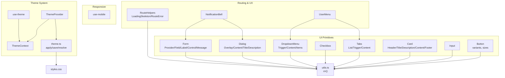
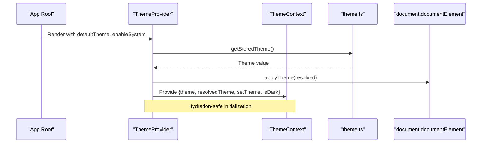
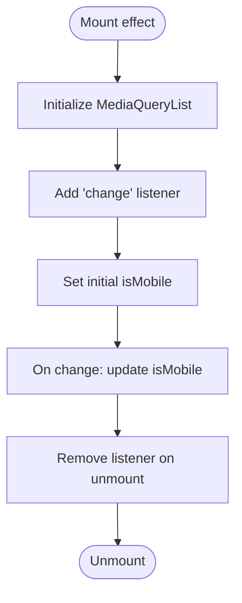
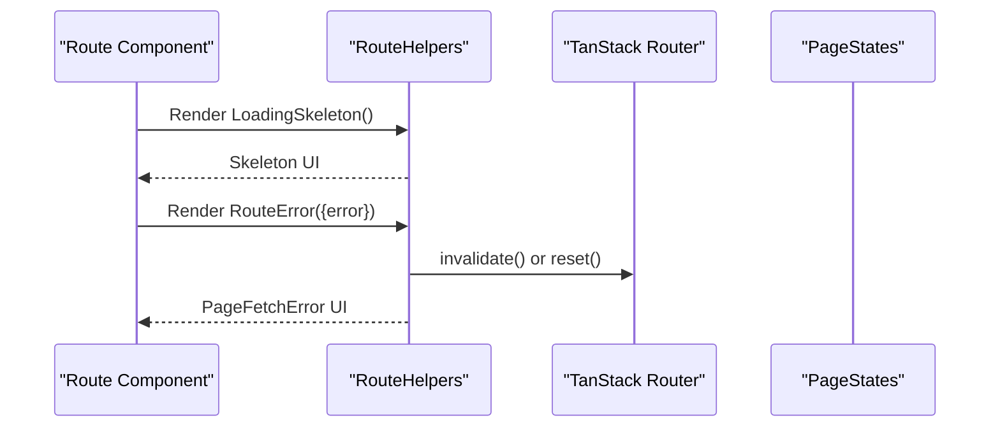
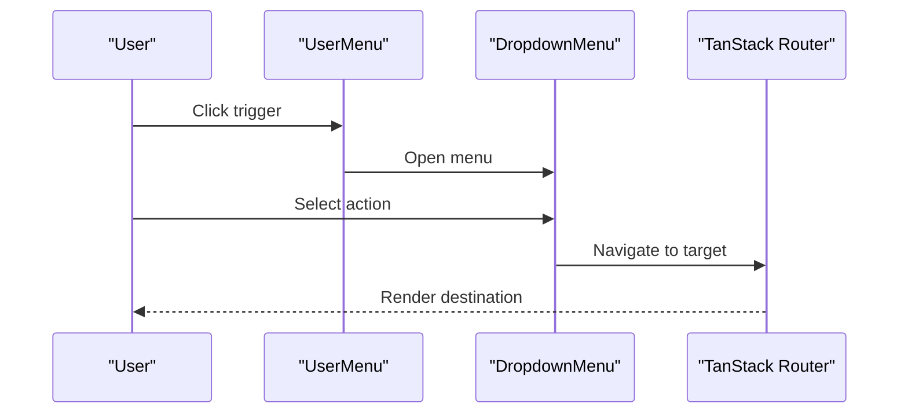
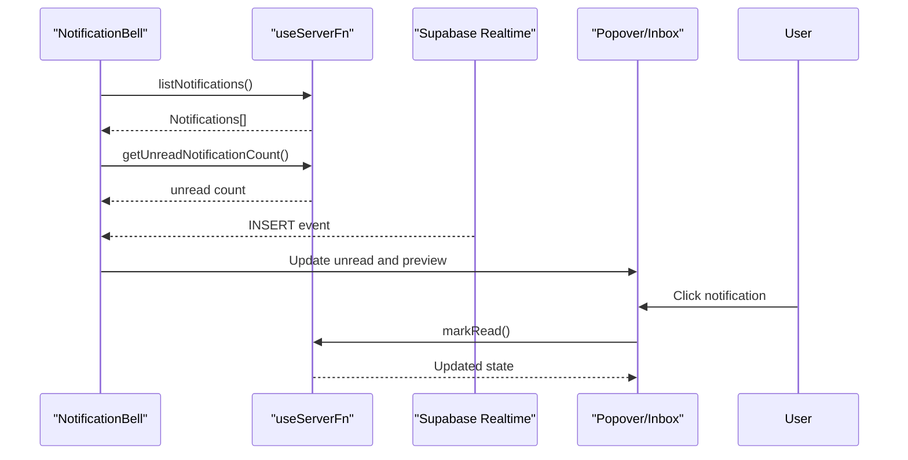
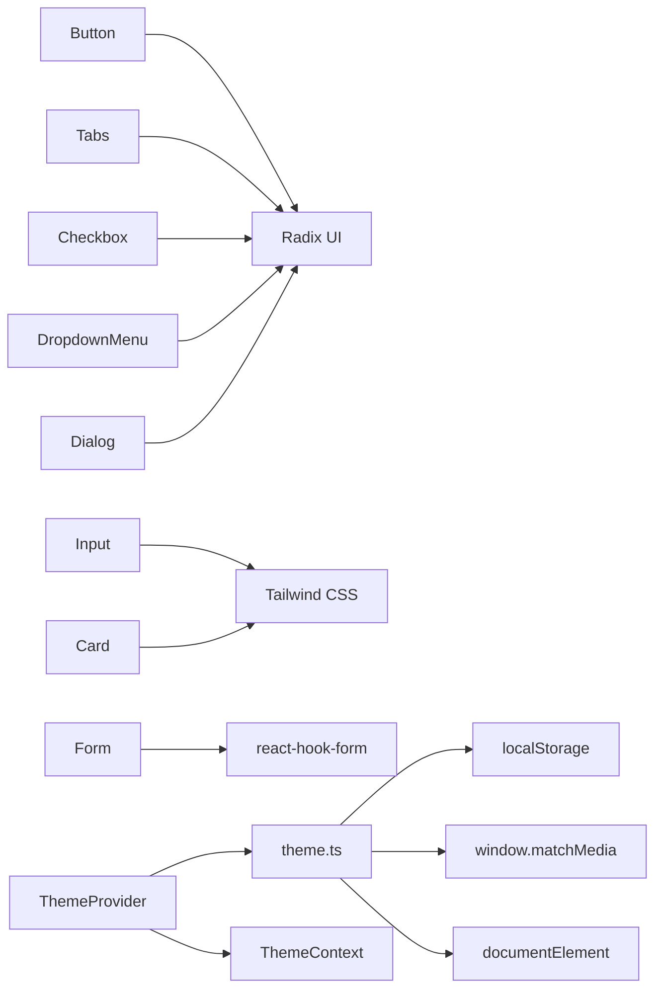

# Component Architecture

<cite>
**Referenced Files in This Document**
- [button.tsx](file://src/components/ui/button.tsx)
- [input.tsx](file://src/components/ui/input.tsx)
- [card.tsx](file://src/components/ui/card.tsx)
- [tabs.tsx](file://src/components/ui/tabs.tsx)
- [checkbox.tsx](file://src/components/ui/checkbox.tsx)
- [dropdown-menu.tsx](file://src/components/ui/dropdown-menu.tsx)
- [dialog.tsx](file://src/components/ui/dialog.tsx)
- [form.tsx](file://src/components/ui/form.tsx)
- [ThemeContext.tsx](file://src/components/ThemeContext.tsx)
- [ThemeProvider.tsx](file://src/components/ThemeProvider.tsx)
- [use-theme.tsx](file://src/hooks/use-theme.tsx)
- [use-mobile.tsx](file://src/hooks/use-mobile.tsx)
- [theme.ts](file://src/lib/theme.ts)
- [utils.ts](file://src/lib/utils.ts)
- [styles.css](file://src/styles.css)
- [components.json](file://components.json)
- [RouteHelpers.tsx](file://src/components/RouteHelpers.tsx)
- [UserMenu.tsx](file://src/components/layout/UserMenu.tsx)
- [NotificationBell.tsx](file://src/components/layout/NotificationBell.tsx)
- [AdminSettingsTab.tsx](file://src/components/admin/AdminSettingsTab.tsx)
</cite>

## Table of Contents

1. [Introduction](#introduction)
2. [Project Structure](#project-structure)
3. [Core Components](#core-components)
4. [Architecture Overview](#architecture-overview)
5. [Detailed Component Analysis](#detailed-component-analysis)
6. [Dependency Analysis](#dependency-analysis)
7. [Performance Considerations](#performance-considerations)
8. [Troubleshooting Guide](#troubleshooting-guide)
9. [Conclusion](#conclusion)
10. [Appendices](#appendices)

## Introduction

This document explains the component architecture system built with shadcn/ui primitives and Tailwind CSS. It covers the UI component library, theme provider and hooks, responsive design utilities, route helper components, and navigation patterns. It also documents configuration options for variants, sizes, and styling customization, and provides guidance on performance, theme consistency, responsive behavior, testing, and accessibility.

## Project Structure

The UI system centers around a small set of composable primitives under src/components/ui, styled via Tailwind and configured through a custom theme system. Hooks encapsulate theme and responsive logic, while ThemeProvider manages persistence and system preference detection. Route helpers standardize loading and error states across routes.



**Diagram sources**

- [button.tsx:1-50](file://src/components/ui/button.tsx#L1-L50)
- [input.tsx:1-23](file://src/components/ui/input.tsx#L1-L23)
- [card.tsx:1-56](file://src/components/ui/card.tsx#L1-L56)
- [tabs.tsx:1-54](file://src/components/ui/tabs.tsx#L1-L54)
- [checkbox.tsx:1-27](file://src/components/ui/checkbox.tsx#L1-L27)
- [dropdown-menu.tsx:1-189](file://src/components/ui/dropdown-menu.tsx#L1-L189)
- [dialog.tsx:1-105](file://src/components/ui/dialog.tsx#L1-L105)
- [form.tsx:1-172](file://src/components/ui/form.tsx#L1-L172)
- [ThemeContext.tsx:1-12](file://src/components/ThemeContext.tsx#L1-L12)
- [ThemeProvider.tsx:1-74](file://src/components/ThemeProvider.tsx#L1-L74)
- [use-theme.tsx:1-11](file://src/hooks/use-theme.tsx#L1-L11)
- [theme.ts:1-77](file://src/lib/theme.ts#L1-L77)
- [use-mobile.tsx:1-20](file://src/hooks/use-mobile.tsx#L1-L20)
- [RouteHelpers.tsx:1-23](file://src/components/RouteHelpers.tsx#L1-L23)
- [UserMenu.tsx:1-101](file://src/components/layout/UserMenu.tsx#L1-L101)
- [NotificationBell.tsx:1-141](file://src/components/layout/NotificationBell.tsx#L1-L141)
- [utils.ts:1-7](file://src/lib/utils.ts#L1-L7)
- [styles.css:1-461](file://src/styles.css#L1-L461)

**Section sources**

- [components.json:1-23](file://components.json#L1-L23)
- [styles.css:1-461](file://src/styles.css#L1-L461)

## Core Components

This section documents the primary UI primitives and their configuration options.

- Button
  - Variants: default, destructive, outline, secondary, ghost, link
  - Sizes: default, sm, lg, icon
  - Props: className, variant, size, asChild, plus native button attributes
  - Composition pattern: supports asChild to render Radix Slot for semantic composition
  - Reference: [button.tsx:34-47](file://src/components/ui/button.tsx#L34-L47)

- Input
  - Base styling includes responsive typography and focus states
  - Props: className, type, plus native input attributes
  - Reference: [input.tsx:5-19](file://src/components/ui/input.tsx#L5-L19)

- Card
  - Composition: Card, CardHeader, CardTitle, CardDescription, CardContent, CardFooter
  - Props: standard HTML div attributes
  - Reference: [card.tsx:5-53](file://src/components/ui/card.tsx#L5-L53)

- Tabs
  - Composition: Tabs, TabsList, TabsTrigger, TabsContent
  - Props: standard Radix attributes
  - Reference: [tabs.tsx:8-51](file://src/components/ui/tabs.tsx#L8-L51)

- Checkbox
  - Props: standard Radix checkbox attributes
  - Reference: [checkbox.tsx:7-23](file://src/components/ui/checkbox.tsx#L7-L23)

- DropdownMenu
  - Composition: Root, Trigger, Content, Item, Group, Portal, Sub, RadioGroup, etc.
  - Props: standard Radix attributes with additional inset and sideOffset controls
  - Reference: [dropdown-menu.tsx:9-188](file://src/components/ui/dropdown-menu.tsx#L9-L188)

- Dialog
  - Composition: Root, Portal, Overlay, Content, Close, Header, Footer, Title, Description
  - Props: standard Radix attributes
  - Reference: [dialog.tsx:9-104](file://src/components/ui/dialog.tsx#L9-L104)

- Form
  - Composition: FormProvider, FormField, FormItem, FormLabel, FormControl, FormDescription, FormMessage
  - Uses react-hook-form for validation and accessibility attributes
  - Reference: [form.tsx:16-171](file://src/components/ui/form.tsx#L16-L171)

Styling customization leverages Tailwind utilities and a custom cn() merge utility. Variants and sizes are defined via class-variance-authority for Button, while others rely on direct Tailwind classes.

**Section sources**

- [button.tsx:1-50](file://src/components/ui/button.tsx#L1-L50)
- [input.tsx:1-23](file://src/components/ui/input.tsx#L1-L23)
- [card.tsx:1-56](file://src/components/ui/card.tsx#L1-L56)
- [tabs.tsx:1-54](file://src/components/ui/tabs.tsx#L1-L54)
- [checkbox.tsx:1-27](file://src/components/ui/checkbox.tsx#L1-L27)
- [dropdown-menu.tsx:1-189](file://src/components/ui/dropdown-menu.tsx#L1-L189)
- [dialog.tsx:1-105](file://src/components/ui/dialog.tsx#L1-L105)
- [form.tsx:1-172](file://src/components/ui/form.tsx#L1-L172)
- [utils.ts:1-7](file://src/lib/utils.ts#L1-L7)

## Architecture Overview

The UI architecture follows a layered approach:

- Primitive components built on Radix UI and styled with Tailwind
- Theme provider managing persisted theme state and system preference
- Utility hooks for theme and responsive behavior
- Route helpers for consistent loading and error handling
- Layout components composing primitives for navigation and notifications



**Diagram sources**

- [ThemeProvider.tsx:17-72](file://src/components/ThemeProvider.tsx#L17-L72)
- [theme.ts:26-47](file://src/lib/theme.ts#L26-L47)
- [ThemeContext.tsx:4-11](file://src/components/ThemeContext.tsx#L4-L11)

## Detailed Component Analysis

### Theme Provider System

The theme system consists of:

- ThemeProvider: initializes theme from localStorage, applies classes to document, persists changes, and listens to system preference changes when enabled
- ThemeContext: exposes theme state and setter to consumers
- use-theme: a typed hook to access theme context
- theme.ts: utilities for resolving, applying, saving, and legacy toggling themes

```mermaid
classDiagram
class ThemeProvider {
+children
+defaultTheme
+storageKey
+enableSystem
+setTheme(theme)
}
class ThemeContext {
+theme
+resolvedTheme
+setTheme(theme)
+isDark
}
class Theme {
<<enum>>
"light"
"dark"
"system"
}
class ThemeUtils {
+getStoredTheme()
+resolveTheme(theme)
+applyTheme(theme)
+saveTheme(theme)
+toggleTheme()
}
ThemeProvider --> ThemeContext : "provides"
ThemeProvider --> ThemeUtils : "uses"
ThemeContext --> Theme : "exposes"
```

**Diagram sources**

- [ThemeProvider.tsx:6-72](file://src/components/ThemeProvider.tsx#L6-L72)
- [ThemeContext.tsx:4-11](file://src/components/ThemeContext.tsx#L4-L11)
- [theme.ts:3,16,26,35,44,71](file://src/lib/theme.ts#L3,L16,L26,L35,L44,L71)

Implementation highlights:

- Hydration safety: initializes on mount and applies theme immediately
- System mode: subscribes to prefers-color-scheme media query when enabled
- Persistence: stores theme in localStorage keyed by a constant
- CSS integration: toggles a "dark" class on the root element

**Section sources**

- [ThemeProvider.tsx:17-72](file://src/components/ThemeProvider.tsx#L17-L72)
- [ThemeContext.tsx:4-11](file://src/components/ThemeContext.tsx#L4-L11)
- [use-theme.tsx:4-10](file://src/hooks/use-theme.tsx#L4-L10)
- [theme.ts:16-47](file://src/lib/theme.ts#L16-L47)
- [styles.css:5,91-118](file://src/styles.css#L5,L91-L118)

### Responsive Design Hook

The useIsMobile hook detects mobile viewport using a breakpoint and updates state on resize.



**Diagram sources**

- [use-mobile.tsx:5-19](file://src/hooks/use-mobile.tsx#L5-L19)

Usage patterns:

- Conditional rendering of drawers vs. modals
- Adjusting layout density on smaller screens
- Switching between desktop and mobile navigation patterns

**Section sources**

- [use-mobile.tsx:1-20](file://src/hooks/use-mobile.tsx#L1-L20)

### Route Helper Components

RouteHelpers provide standardized loading and error views for routes.



**Diagram sources**

- [RouteHelpers.tsx:4-20](file://src/components/RouteHelpers.tsx#L4-L20)

Common usage:

- Wrap data loaders with LoadingSkeleton during fetch
- Wrap error boundaries with RouteError to present retry actions

**Section sources**

- [RouteHelpers.tsx:1-23](file://src/components/RouteHelpers.tsx#L1-L23)

### Navigation Patterns and Layout Composition

UserMenu composes DropdownMenu with links to profile and settings, integrating with routing.



**Diagram sources**

- [UserMenu.tsx:20-68](file://src/components/layout/UserMenu.tsx#L20-L68)

NotificationBell integrates UI primitives with real-time updates via Supabase and server functions.



**Diagram sources**

- [NotificationBell.tsx:19-140](file://src/components/layout/NotificationBell.tsx#L19-L140)

**Section sources**

- [UserMenu.tsx:1-101](file://src/components/layout/UserMenu.tsx#L1-L101)
- [NotificationBell.tsx:1-141](file://src/components/layout/NotificationBell.tsx#L1-L141)

### Component Composition Patterns and Prop Interfaces

- Composition via asChild: Button supports rendering a Slot to compose with links or other elements
- Form composition: FormField wraps react-hook-form Controller and exposes useFormField for labels, controls, and messages
- Tabs composition: TabsList hosts TabsTrigger items; TabsContent renders associated content
- Card composition: Semantic sections for header/title/description/content/footer

Examples from the codebase:

- Button with variant and size: [button.tsx:34-47](file://src/components/ui/button.tsx#L34-L47)
- Form field with label and control: [form.tsx:86-119](file://src/components/ui/form.tsx#L86-L119)
- Tabs list and triggers: [tabs.tsx:8-36](file://src/components/ui/tabs.tsx#L8-L36)
- Card sections: [card.tsx:16-53](file://src/components/ui/card.tsx#L16-L53)

**Section sources**

- [button.tsx:34-47](file://src/components/ui/button.tsx#L34-L47)
- [form.tsx:86-119](file://src/components/ui/form.tsx#L86-L119)
- [tabs.tsx:8-36](file://src/components/ui/tabs.tsx#L8-L36)
- [card.tsx:16-53](file://src/components/ui/card.tsx#L16-L53)

### Configuration Options: Variants, Sizes, and Styling Customization

- Button variants and sizes are defined via class-variance-authority and applied through cn()
  - References: [button.tsx:7-32](file://src/components/ui/button.tsx#L7-L32), [button.tsx:34-47](file://src/components/ui/button.tsx#L34-L47)
- Input styling includes responsive text sizing and focus states
  - Reference: [input.tsx:5-19](file://src/components/ui/input.tsx#L5-L19)
- DropdownMenu and Dialog expose extensive composition points and styling via Tailwind classes
  - References: [dropdown-menu.tsx:60-74](file://src/components/ui/dropdown-menu.tsx#L60-L74), [dialog.tsx:32-54](file://src/components/ui/dialog.tsx#L32-L54)
- Global theme variables and dark mode are defined in CSS custom properties
  - Reference: [styles.css:57-118](file://src/styles.css#L57-L118)

Customization approaches:

- Extend Button variants/sizes by adding entries to buttonVariants
- Override primitive classes by passing className props
- Customize theme tokens in styles.css to affect all components

**Section sources**

- [button.tsx:7-32](file://src/components/ui/button.tsx#L7-L32)
- [input.tsx:5-19](file://src/components/ui/input.tsx#L5-L19)
- [dropdown-menu.tsx:60-74](file://src/components/ui/dropdown-menu.tsx#L60-L74)
- [dialog.tsx:32-54](file://src/components/ui/dialog.tsx#L32-L54)
- [styles.css:57-118](file://src/styles.css#L57-L118)

## Dependency Analysis

The UI primitives depend on:

- Radix UI primitives for accessibility and composability
- Tailwind CSS for styling
- cn() utility for safe class merging

The theme system depends on:

- localStorage for persistence
- window.matchMedia for system preference detection
- document.documentElement for applying dark class



**Diagram sources**

- [button.tsx:1-3](file://src/components/ui/button.tsx#L1-L3)
- [input.tsx:1-3](file://src/components/ui/input.tsx#L1-L3)
- [card.tsx:1-3](file://src/components/ui/card.tsx#L1-L3)
- [tabs.tsx:1-2](file://src/components/ui/tabs.tsx#L1-L2)
- [checkbox.tsx:1-3](file://src/components/ui/checkbox.tsx#L1-L3)
- [dropdown-menu.tsx:1-7](file://src/components/ui/dropdown-menu.tsx#L1-L7)
- [dialog.tsx:1-7](file://src/components/ui/dialog.tsx#L1-L7)
- [form.tsx:1-11](file://src/components/ui/form.tsx#L1-L11)
- [ThemeProvider.tsx:1-4](file://src/components/ThemeProvider.tsx#L1-L4)
- [theme.ts:1-11](file://src/lib/theme.ts#L1-L11)

**Section sources**

- [button.tsx:1-3](file://src/components/ui/button.tsx#L1-L3)
- [form.tsx:1-11](file://src/components/ui/form.tsx#L1-L11)
- [theme.ts:1-11](file://src/lib/theme.ts#L1-L11)

## Performance Considerations

- Minimize re-renders by memoizing heavy props passed to UI components
- Prefer shallow comparisons for theme and responsive state to avoid unnecessary updates
- Defer heavy computations in dialogs and popovers until opened
- Use Skeleton components for perceived performance during data fetches
- Keep className concatenation minimal; leverage component defaults and variants

[No sources needed since this section provides general guidance]

## Troubleshooting Guide

Common issues and resolutions:

- Hydration mismatch with theme: Ensure ThemeProvider initializes on the client and applies theme on mount
  - Reference: [ThemeProvider.tsx:42-47](file://src/components/ThemeProvider.tsx#L42-L47)
- Dark mode not switching: Verify the "dark" class is toggled on document.documentElement
  - Reference: [theme.ts:35-39](file://src/lib/theme.ts#L35-L39)
- System preference not respected: Confirm media query listeners are attached when enableSystem is true
  - Reference: [ThemeProvider.tsx:49-63](file://src/components/ThemeProvider.tsx#L49-L63)
- Responsive hook not updating: Check MediaQueryList binding and cleanup
  - Reference: [use-mobile.tsx:8-16](file://src/hooks/use-mobile.tsx#L8-L16)
- Form accessibility errors: Ensure useFormField is used within FormItem/FormLabel/FormControl
  - Reference: [form.tsx:40-65](file://src/components/ui/form.tsx#L40-L65)

**Section sources**

- [ThemeProvider.tsx:42-47](file://src/components/ThemeProvider.tsx#L42-L47)
- [theme.ts:35-39](file://src/lib/theme.ts#L35-L39)
- [ThemeProvider.tsx:49-63](file://src/components/ThemeProvider.tsx#L49-L63)
- [use-mobile.tsx:8-16](file://src/hooks/use-mobile.tsx#L8-L16)
- [form.tsx:40-65](file://src/components/ui/form.tsx#L40-L65)

## Conclusion

The component architecture combines shadcn/ui primitives with a robust theme provider and responsive utilities. The design emphasizes composability, accessibility, and customization through Tailwind and CSS variables. Following the patterns documented here ensures consistent behavior across light/dark modes, responsive breakpoints, and route-level UX.

[No sources needed since this section summarizes without analyzing specific files]

## Appendices

### Best Practices for Component Development

- Use composition patterns (asChild, Slot) to preserve semantics
- Define variants and sizes centrally for consistency
- Keep component props minimal and typed
- Leverage cn() for safe class merging
- Test theme switching and responsive behavior across devices

[No sources needed since this section provides general guidance]

### Testing Strategies

- Unit tests for hooks: mock ThemeProvider and useIsMobile behavior
- Snapshot tests for theme variants and sizes
- Accessibility tests: ensure labels, roles, and keyboard navigation
- Integration tests: route helpers with TanStack Router and error boundaries

[No sources needed since this section provides general guidance]

### Accessibility Compliance

- Use proper labels and aria attributes in forms
- Ensure focus management in dialogs and dropdowns
- Provide visible focus indicators and keyboard navigation
- Respect system contrast preferences

[No sources needed since this section provides general guidance]
