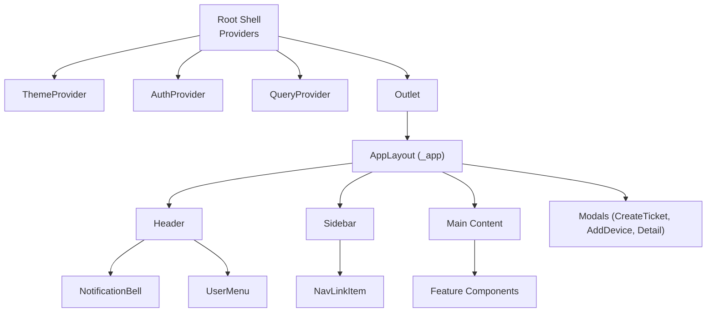
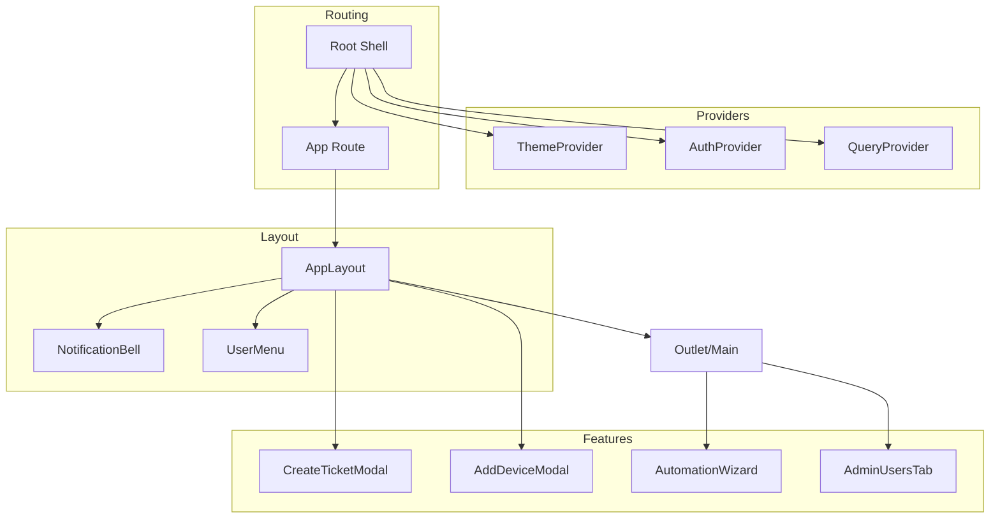
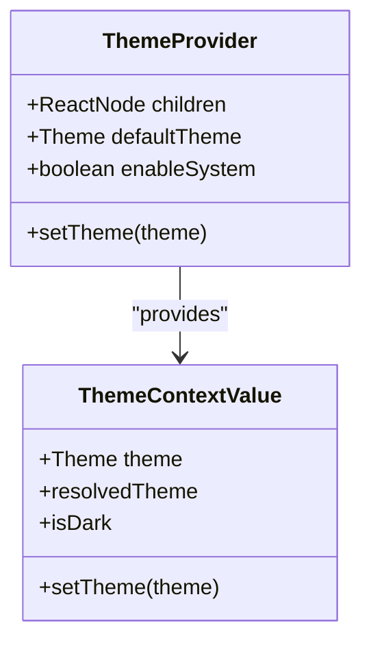
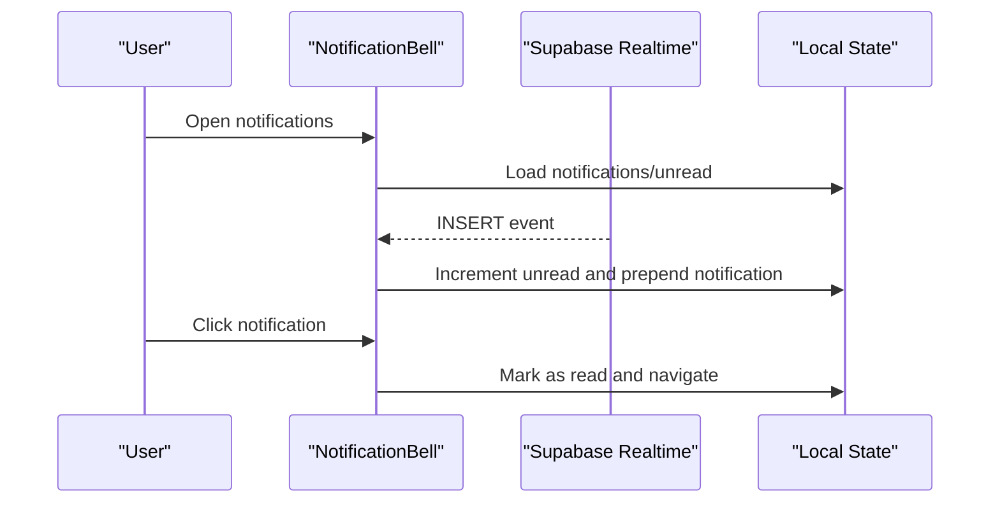
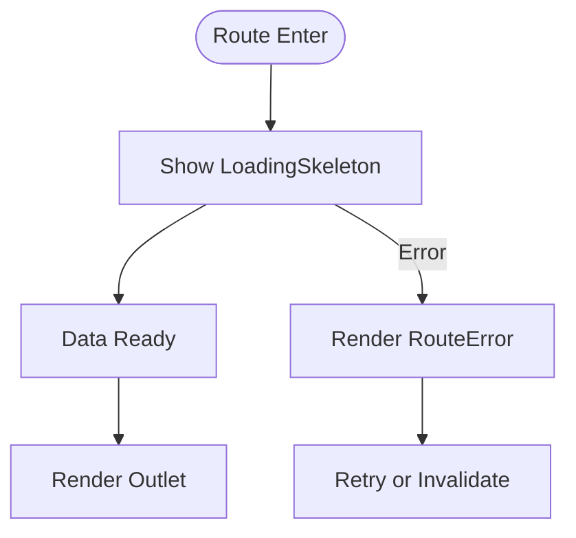
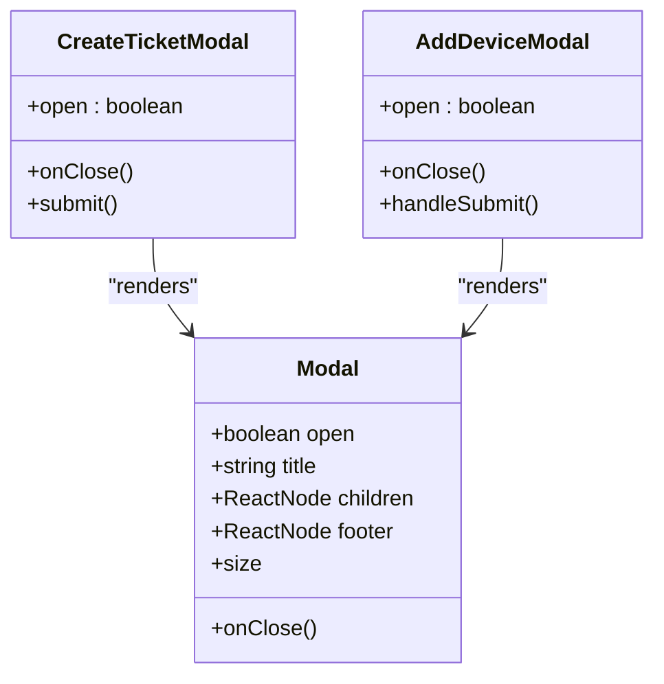
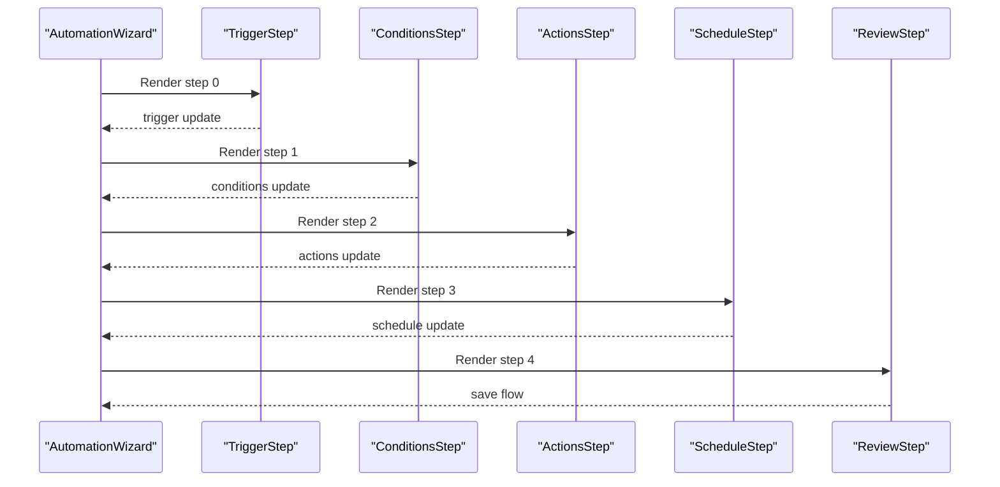
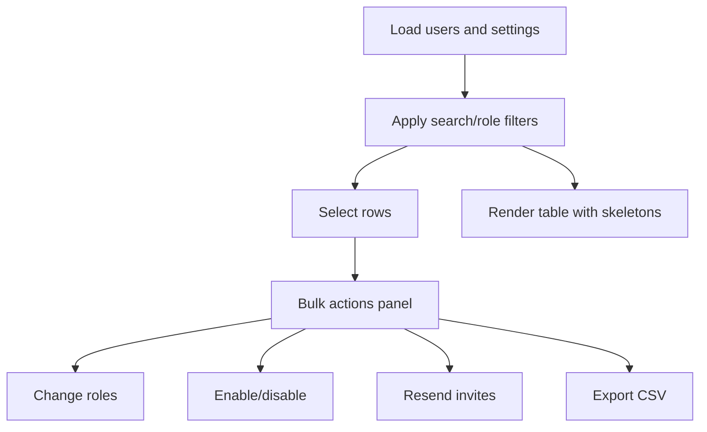
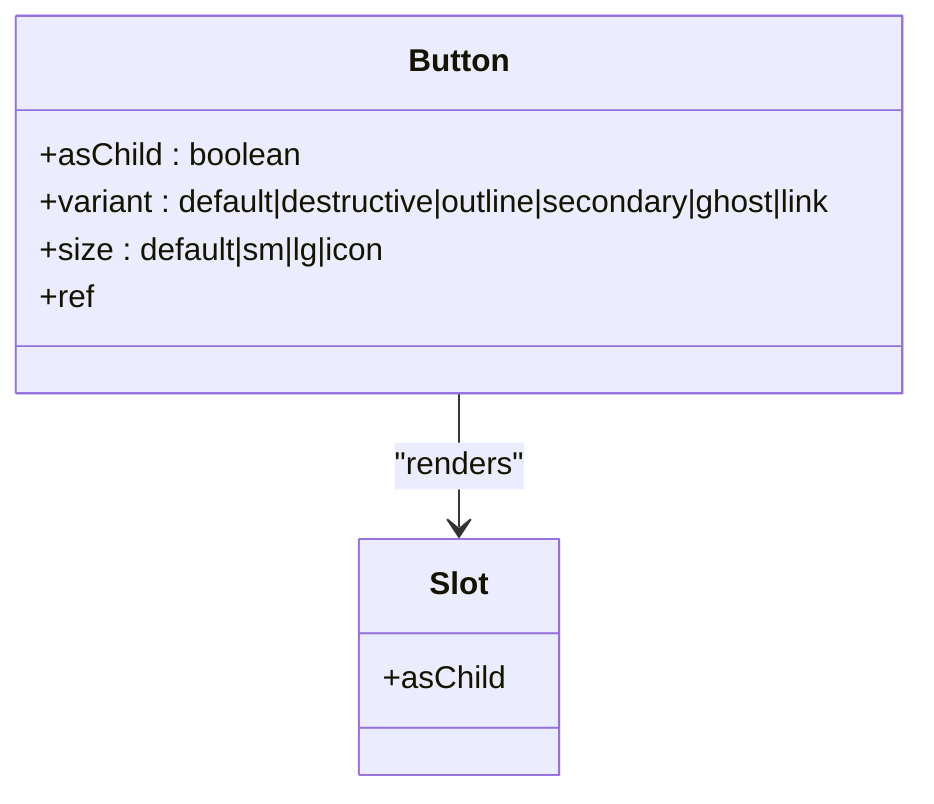
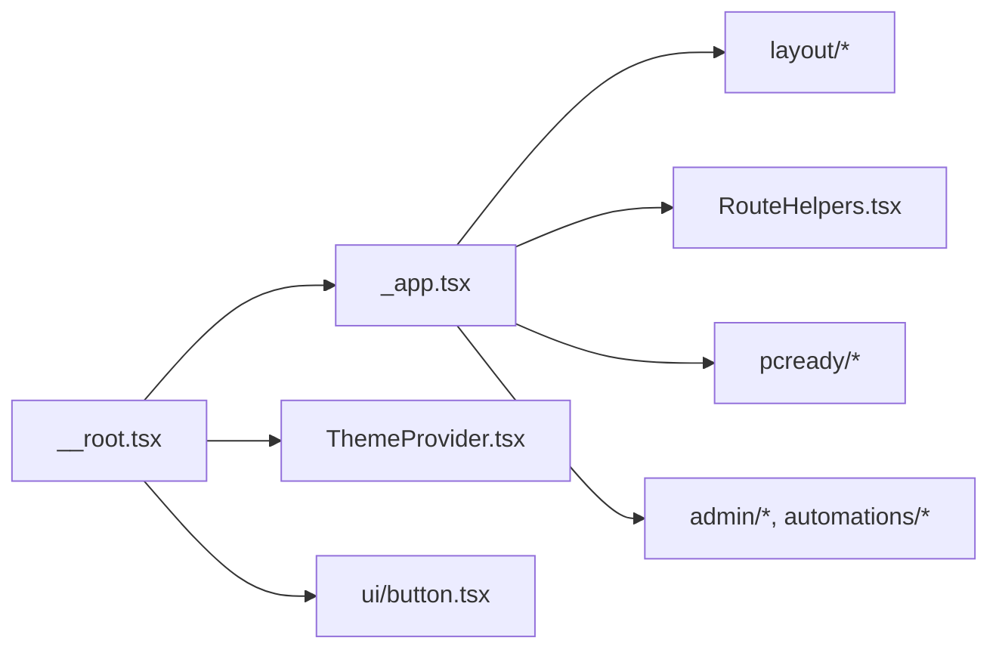

# Component Composition Patterns

<cite>
**Referenced Files in This Document**
- [src/routes/__root.tsx](file://src/routes/__root.tsx)
- [src/routes/_app.tsx](file://src/routes/_app.tsx)
- [src/components/RouteHelpers.tsx](file://src/components/RouteHelpers.tsx)
- [src/components/ThemeProvider.tsx](file://src/components/ThemeProvider.tsx)
- [src/components/ThemeContext.tsx](file://src/components/ThemeContext.tsx)
- [src/components/layout/UserMenu.tsx](file://src/components/layout/UserMenu.tsx)
- [src/components/layout/NotificationBell.tsx](file://src/components/layout/NotificationBell.tsx)
- [src/components/layout/NotificationInbox.tsx](file://src/components/layout/NotificationInbox.tsx)
- [src/components/page-states/PageStates.tsx](file://src/components/page-states/PageStates.tsx)
- [src/components/ui/button.tsx](file://src/components/ui/button.tsx)
- [src/components/pcready/Modal.tsx](file://src/components/pcready/Modal.tsx)
- [src/components/pcready/CreateTicketModal.tsx](file://src/components/pcready/CreateTicketModal.tsx)
- [src/components/pcready/AddDeviceModal.tsx](file://src/components/pcready/AddDeviceModal.tsx)
- [src/components/admin/AdminUsersTab.tsx](file://src/components/admin/AdminUsersTab.tsx)
- [src/components/automations/AutomationWizard.tsx](file://src/components/automations/AutomationWizard.tsx)
</cite>

## Table of Contents

1. [Introduction](#introduction)
2. [Project Structure](#project-structure)
3. [Core Components](#core-components)
4. [Architecture Overview](#architecture-overview)
5. [Detailed Component Analysis](#detailed-component-analysis)
6. [Dependency Analysis](#dependency-analysis)
7. [Performance Considerations](#performance-considerations)
8. [Troubleshooting Guide](#troubleshooting-guide)
9. [Conclusion](#conclusion)
10. [Appendices](#appendices)

## Introduction

This document explains the component composition patterns and architectural approaches used in the project. It focuses on:

- Hierarchical component structure from root providers to layout components and feature-specific components
- Slot pattern implementation via Radix UI’s Slot and forwardRef for prop forwarding
- Route helpers and their integration with layout and feature components
- Component inheritance patterns and shared component usage across sections
- Examples of composition, prop drilling solutions, and context usage
- Lifecycle management and state sharing patterns
- Separation of concerns between UI presentation and business logic
- Performance optimization through composition and rendering strategies
- Guidelines for reusable component patterns and maintaining component cohesion

## Project Structure

The application uses a layered structure:

- Root shell and providers orchestrate global concerns (theming, auth, data queries)
- Application shell composes layout, navigation, and feature modals
- Feature components encapsulate domain logic and UI composition
- Shared UI primitives and page-state helpers provide consistent behavior

**Diagram sources**

- [src/routes/\_\_root.tsx:70-89](file://src/routes/__root.tsx#L70-L89)
- [src/routes/\_app.tsx:172-337](file://src/routes/_app.tsx#L172-L337)

**Section sources**

- [src/routes/\_\_root.tsx:13-90](file://src/routes/__root.tsx#L13-L90)
- [src/routes/\_app.tsx:59-63](file://src/routes/_app.tsx#L59-L63)

## Core Components

- Providers and routing scaffolding:
  - Root shell sets HTML shell, head metadata, and mounts providers and outlet
  - App route defines error, pending, and main layout components
- Route helpers:
  - Loading skeletons and error views standardized for route transitions
- Theme system:
  - ThemeProvider manages persisted theme state and applies CSS variables
  - ThemeContext exposes theme state and setter to consumers
- Layout components:
  - UserMenu and NotificationBell compose navigation and notifications
- Page-state helpers:
  - Standardized skeletons and error states for consistent UX
- UI primitives:
  - Button uses Slot pattern for flexible DOM rendering and prop forwarding

**Section sources**

- [src/routes/\_\_root.tsx:13-90](file://src/routes/__root.tsx#L13-L90)
- [src/routes/\_app.tsx:59-63](file://src/routes/_app.tsx#L59-L63)
- [src/components/RouteHelpers.tsx:4-20](file://src/components/RouteHelpers.tsx#L4-L20)
- [src/components/ThemeProvider.tsx:17-73](file://src/components/ThemeProvider.tsx#L17-L73)
- [src/components/ThemeContext.tsx:4-11](file://src/components/ThemeContext.tsx#L4-L11)
- [src/components/layout/UserMenu.tsx:20-69](file://src/components/layout/UserMenu.tsx#L20-L69)
- [src/components/layout/NotificationBell.tsx:19-141](file://src/components/layout/NotificationBell.tsx#L19-L141)
- [src/components/page-states/PageStates.tsx:16-136](file://src/components/page-states/PageStates.tsx#L16-L136)
- [src/components/ui/button.tsx:39-46](file://src/components/ui/button.tsx#L39-L46)

## Architecture Overview

The architecture follows a provider-first composition:

- Root providers initialize theme, auth, and data layers
- App layout composes navigation, header controls, and main content area
- Feature components render within the layout and use shared modals and UI primitives
- Route helpers standardize loading and error states across routes

**Diagram sources**

- [src/routes/\_\_root.tsx:70-89](file://src/routes/__root.tsx#L70-L89)
- [src/routes/\_app.tsx:172-337](file://src/routes/_app.tsx#L172-L337)
- [src/components/pcready/CreateTicketModal.tsx:138-300](file://src/components/pcready/CreateTicketModal.tsx#L138-L300)
- [src/components/pcready/AddDeviceModal.tsx:27-120](file://src/components/pcready/AddDeviceModal.tsx#L27-L120)
- [src/components/automations/AutomationWizard.tsx:13-87](file://src/components/automations/AutomationWizard.tsx#L13-L87)
- [src/components/admin/AdminUsersTab.tsx:26-67](file://src/components/admin/AdminUsersTab.tsx#L26-L67)

## Detailed Component Analysis

### Theme System: Provider and Context

- ThemeProvider initializes theme from storage, applies CSS variables, and listens to system preference changes
- ThemeContext exposes theme state and setter to child components
- Consumers use useTheme hook to access theme-aware UI

**Diagram sources**

- [src/components/ThemeProvider.tsx:17-73](file://src/components/ThemeProvider.tsx#L17-L73)
- [src/components/ThemeContext.tsx:4-11](file://src/components/ThemeContext.tsx#L4-L11)

**Section sources**

- [src/components/ThemeProvider.tsx:17-73](file://src/components/ThemeProvider.tsx#L17-L73)
- [src/components/ThemeContext.tsx:4-11](file://src/components/ThemeContext.tsx#L4-L11)

### Layout Composition: AppLayout, UserMenu, NotificationBell

- AppLayout orchestrates authentication checks, navigation groups, and modals
- UserMenu renders profile actions with nested dropdown items
- NotificationBell integrates real-time updates and navigation to notifications

**Diagram sources**

- [src/components/layout/NotificationBell.tsx:19-141](file://src/components/layout/NotificationBell.tsx#L19-L141)
- [src/components/layout/NotificationInbox.tsx:13-87](file://src/components/layout/NotificationInbox.tsx#L13-L87)

**Section sources**

- [src/routes/\_app.tsx:172-337](file://src/routes/_app.tsx#L172-L337)
- [src/components/layout/UserMenu.tsx:20-69](file://src/components/layout/UserMenu.tsx#L20-L69)
- [src/components/layout/NotificationBell.tsx:19-141](file://src/components/layout/NotificationBell.tsx#L19-L141)
- [src/components/layout/NotificationInbox.tsx:13-87](file://src/components/layout/NotificationInbox.tsx#L13-L87)

### Route Helpers: Loading and Error States

- RouteHelpers define standardized loading skeletons and error views
- Routes specify pending and error components for graceful transitions

**Diagram sources**

- [src/components/RouteHelpers.tsx:4-20](file://src/components/RouteHelpers.tsx#L4-L20)
- [src/routes/\_app.tsx:61-62](file://src/routes/_app.tsx#L61-L62)

**Section sources**

- [src/components/RouteHelpers.tsx:4-20](file://src/components/RouteHelpers.tsx#L4-L20)
- [src/components/page-states/PageStates.tsx:16-136](file://src/components/page-states/PageStates.tsx#L16-L136)

### Modal Composition Pattern: Modal, CreateTicketModal, AddDeviceModal

- Modal provides a reusable overlay with keyboard handling and portal rendering
- Feature modals compose forms, validation, and server functions while delegating UI to Modal
- Props are forwarded cleanly to underlying UI elements

**Diagram sources**

- [src/components/pcready/Modal.tsx:11-35](file://src/components/pcready/Modal.tsx#L11-L35)
- [src/components/pcready/CreateTicketModal.tsx:138-300](file://src/components/pcready/CreateTicketModal.tsx#L138-L300)
- [src/components/pcready/AddDeviceModal.tsx:27-120](file://src/components/pcready/AddDeviceModal.tsx#L27-L120)

**Section sources**

- [src/components/pcready/Modal.tsx:11-35](file://src/components/pcready/Modal.tsx#L11-L35)
- [src/components/pcready/CreateTicketModal.tsx:138-300](file://src/components/pcready/CreateTicketModal.tsx#L138-L300)
- [src/components/pcready/AddDeviceModal.tsx:27-120](file://src/components/pcready/AddDeviceModal.tsx#L27-L120)

### Wizard Pattern: AutomationWizard and Steps

- AutomationWizard coordinates multi-step configuration with validation and summary
- Step components receive and propagate state, enabling clear separation of concerns

**Diagram sources**

- [src/components/automations/AutomationWizard.tsx:13-87](file://src/components/automations/AutomationWizard.tsx#L13-L87)

**Section sources**

- [src/components/automations/AutomationWizard.tsx:13-87](file://src/components/automations/AutomationWizard.tsx#L13-L87)

### Admin Users Tab: Bulk Operations and Table Composition

- AdminUsersTab composes filters, selection, bulk actions, and a paginated table
- Uses shared UI components (checkboxes, alerts, buttons) and page-state skeletons

**Diagram sources**

- [src/components/admin/AdminUsersTab.tsx:26-67](file://src/components/admin/AdminUsersTab.tsx#L26-L67)
- [src/components/page-states/PageStates.tsx:138-207](file://src/components/page-states/PageStates.tsx#L138-L207)

**Section sources**

- [src/components/admin/AdminUsersTab.tsx:26-67](file://src/components/admin/AdminUsersTab.tsx#L26-L67)
- [src/components/page-states/PageStates.tsx:138-207](file://src/components/page-states/PageStates.tsx#L138-L207)

### Slot Pattern and Prop Forwarding: Button Component

- Button uses forwardRef with Slot to render either a native button or a child element
- Variants and sizes are controlled via class variance authority, ensuring consistent styling

**Diagram sources**

- [src/components/ui/button.tsx:39-46](file://src/components/ui/button.tsx#L39-L46)

**Section sources**

- [src/components/ui/button.tsx:39-46](file://src/components/ui/button.tsx#L39-L46)

## Dependency Analysis

- Providers are mounted at the root and consumed by the application shell
- AppLayout depends on auth, theme, and navigation resolution logic
- Feature components depend on shared modals and UI primitives
- Route helpers are referenced by route definitions to standardize UX

**Diagram sources**

- [src/routes/\_\_root.tsx:70-89](file://src/routes/__root.tsx#L70-L89)
- [src/routes/\_app.tsx:172-337](file://src/routes/_app.tsx#L172-L337)
- [src/components/RouteHelpers.tsx:4-20](file://src/components/RouteHelpers.tsx#L4-L20)
- [src/components/ui/button.tsx:39-46](file://src/components/ui/button.tsx#L39-L46)

**Section sources**

- [src/routes/\_\_root.tsx:70-89](file://src/routes/__root.tsx#L70-L89)
- [src/routes/\_app.tsx:172-337](file://src/routes/_app.tsx#L172-L337)

## Performance Considerations

- Prefer lazy initialization of heavy resources (e.g., theme application on mount) to avoid hydration mismatches
- Use skeletons and minimal UI during data fetches to maintain perceived performance
- Compose modals and overlays with portals to reduce reflows in the main layout
- Keep step-based wizards declarative to minimize unnecessary re-renders
- Share UI primitives and page-state helpers to reduce duplication and improve cache hits

## Troubleshooting Guide

- Theme not applying:
  - Verify ThemeProvider wraps the application and localStorage theme is persisted
- Notifications not updating:
  - Confirm Supabase channel subscription and access token availability
- Route transitions:
  - Ensure pending and error components are configured in route definitions
- Modal not closing:
  - Check escape-key handler and portal rendering conditions

**Section sources**

- [src/components/ThemeProvider.tsx:42-63](file://src/components/ThemeProvider.tsx#L42-L63)
- [src/components/layout/NotificationBell.tsx:48-75](file://src/components/layout/NotificationBell.tsx#L48-L75)
- [src/components/RouteHelpers.tsx:4-20](file://src/components/RouteHelpers.tsx#L4-L20)
- [src/components/pcready/Modal.tsx:26-33](file://src/components/pcready/Modal.tsx#L26-L33)

## Conclusion

The project demonstrates robust component composition through:

- Provider-first architecture with clear separation of concerns
- Reusable layout and UI primitives with consistent prop forwarding
- Route helpers that unify loading and error experiences
- Feature components that compose shared modals and stateful helpers
- Wizard and table patterns that encapsulate complex flows while preserving simplicity

## Appendices

- Guidelines for reusable component patterns:
  - Encapsulate state in dedicated hooks and expose small, focused props
  - Use Slot pattern for flexible DOM rendering and prop forwarding
  - Centralize page-state helpers to ensure consistent UX across routes
  - Compose modals with a single responsibility (rendering) and delegate logic to feature components
  - Maintain cohesive components by grouping related UI and logic together
