# Custom Hooks System

<cite>
**Referenced Files in This Document**
- [use-theme.tsx](file://src/hooks/use-theme.tsx)
- [use-mobile.tsx](file://src/hooks/use-mobile.tsx)
- [useRealtimeTable.ts](file://src/hooks/useRealtimeTable.ts)
- [useAdminAppSettings.ts](file://src/hooks/useAdminAppSettings.ts)
- [useAdminUsers.ts](file://src/hooks/useAdminUsers.ts)
- [useAdminAudit.ts](file://src/hooks/useAdminAudit.ts)
- [useAdminOAuthClients.ts](file://src/hooks/useAdminOAuthClients.ts)
- [useAutomationRules.ts](file://src/hooks/useAutomationRules.ts)
- [ThemeContext.tsx](file://src/components/ThemeContext.tsx)
- [ThemeProvider.tsx](file://src/components/ThemeProvider.tsx)
- [theme.ts](file://src/lib/theme.ts)
- [admin.tsx](file://src/routes/_app/admin.tsx)
- [automations.tsx](file://src/routes/_app/automations.tsx)
- [dashboard.tsx](file://src/routes/_app/dashboard.tsx)
- [client.ts](file://src/integrations/supabase/client.ts)
</cite>

## Table of Contents
1. [Introduction](#introduction)
2. [Project Structure](#project-structure)
3. [Core Components](#core-components)
4. [Architecture Overview](#architecture-overview)
5. [Detailed Component Analysis](#detailed-component-analysis)
6. [Dependency Analysis](#dependency-analysis)
7. [Performance Considerations](#performance-considerations)
8. [Troubleshooting Guide](#troubleshooting-guide)
9. [Conclusion](#conclusion)
10. [Appendices](#appendices)

## Introduction
This document explains the custom hooks system that manages application state and functionality across the codebase. It focuses on:
- Theme management and dark/light mode switching via a dedicated hook and provider
- Responsive design detection for mobile-specific behavior
- Real-time data synchronization with Supabase using a reusable hook
- Admin-specific hooks for managing application settings, users, OAuth clients, and audit logs
- Composition patterns, state management strategies, and side effect handling
- Practical usage examples, parameter configuration, return value handling, lifecycle relationships, performance optimizations, and best practices

## Project Structure
The hooks live under src/hooks and integrate with providers, libraries, and route components. Providers manage global state (e.g., theme), while hooks encapsulate local component state and cross-cutting concerns (e.g., real-time updates, admin operations).

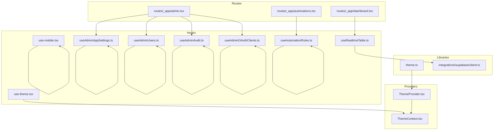

**Diagram sources**
- [use-theme.tsx:1-11](file://src/hooks/use-theme.tsx#L1-L11)
- [use-mobile.tsx:1-20](file://src/hooks/use-mobile.tsx#L1-L20)
- [useRealtimeTable.ts:1-50](file://src/hooks/useRealtimeTable.ts#L1-L50)
- [useAdminAppSettings.ts:1-156](file://src/hooks/useAdminAppSettings.ts#L1-L156)
- [useAdminUsers.ts:1-213](file://src/hooks/useAdminUsers.ts#L1-L213)
- [useAdminAudit.ts:1-82](file://src/hooks/useAdminAudit.ts#L1-L82)
- [useAdminOAuthClients.ts:1-196](file://src/hooks/useAdminOAuthClients.ts#L1-L196)
- [useAutomationRules.ts:1-413](file://src/hooks/useAutomationRules.ts#L1-L413)
- [ThemeContext.tsx:1-12](file://src/components/ThemeContext.tsx#L1-L12)
- [ThemeProvider.tsx:1-74](file://src/components/ThemeProvider.tsx#L1-L74)
- [theme.ts:1-77](file://src/lib/theme.ts#L1-L77)
- [admin.tsx:1-50](file://src/routes/_app/admin.tsx#L1-L50)
- [automations.tsx:1-261](file://src/routes/_app/automations.tsx#L1-L261)
- [dashboard.tsx:1-448](file://src/routes/_app/dashboard.tsx#L1-L448)
- [client.ts](file://src/integrations/supabase/client.ts)

**Section sources**
- [use-theme.tsx:1-11](file://src/hooks/use-theme.tsx#L1-L11)
- [use-mobile.tsx:1-20](file://src/hooks/use-mobile.tsx#L1-L20)
- [useRealtimeTable.ts:1-50](file://src/hooks/useRealtimeTable.ts#L1-L50)
- [useAdminAppSettings.ts:1-156](file://src/hooks/useAdminAppSettings.ts#L1-L156)
- [useAdminUsers.ts:1-213](file://src/hooks/useAdminUsers.ts#L1-L213)
- [useAdminAudit.ts:1-82](file://src/hooks/useAdminAudit.ts#L1-L82)
- [useAdminOAuthClients.ts:1-196](file://src/hooks/useAdminOAuthClients.ts#L1-L196)
- [useAutomationRules.ts:1-413](file://src/hooks/useAutomationRules.ts#L1-L413)
- [ThemeContext.tsx:1-12](file://src/components/ThemeContext.tsx#L1-L12)
- [ThemeProvider.tsx:1-74](file://src/components/ThemeProvider.tsx#L1-L74)
- [theme.ts:1-77](file://src/lib/theme.ts#L1-L77)
- [admin.tsx:1-50](file://src/routes/_app/admin.tsx#L1-L50)
- [automations.tsx:1-261](file://src/routes/_app/automations.tsx#L1-L261)
- [dashboard.tsx:1-448](file://src/routes/_app/dashboard.tsx#L1-L448)

## Core Components
- Theme management
  - ThemeProvider sets up persistent theme state and applies classes to the document.
  - useTheme exposes theme state and a setter to consumers.
  - theme utilities resolve and persist theme preferences.
- Mobile detection
  - useIsMobile detects viewport breakpoints and tracks responsive state.
- Real-time synchronization
  - useRealtimeTable loads data and subscribes to Supabase realtime events for a given table.
- Admin operations
  - useAdminAppSettings: loads, validates, and updates application settings; exports data.
  - useAdminUsers: lists, filters, invites, toggles, and deletes admin users.
  - useAdminAudit: paginates and exports audit logs.
  - useAdminOAuthClients: manages OAuth clients, statuses, secrets, and lifecycle history.
- Automation rules
  - useAutomationRules: orchestrates rule listing, filtering, creation/editing, runs, and versioning.

**Section sources**
- [ThemeProvider.tsx:1-74](file://src/components/ThemeProvider.tsx#L1-L74)
- [ThemeContext.tsx:1-12](file://src/components/ThemeContext.tsx#L1-L12)
- [theme.ts:1-77](file://src/lib/theme.ts#L1-L77)
- [use-theme.tsx:1-11](file://src/hooks/use-theme.tsx#L1-L11)
- [use-mobile.tsx:1-20](file://src/hooks/use-mobile.tsx#L1-L20)
- [useRealtimeTable.ts:1-50](file://src/hooks/useRealtimeTable.ts#L1-L50)
- [useAdminAppSettings.ts:1-156](file://src/hooks/useAdminAppSettings.ts#L1-L156)
- [useAdminUsers.ts:1-213](file://src/hooks/useAdminUsers.ts#L1-L213)
- [useAdminAudit.ts:1-82](file://src/hooks/useAdminAudit.ts#L1-L82)
- [useAdminOAuthClients.ts:1-196](file://src/hooks/useAdminOAuthClients.ts#L1-L196)
- [useAutomationRules.ts:1-413](file://src/hooks/useAutomationRules.ts#L1-L413)

## Architecture Overview
The hooks system integrates with providers, Supabase, and route components. Providers manage global state and expose it to hooks. Hooks encapsulate side effects, caching, and subscriptions. Route components consume hooks to render UI and orchestrate user actions.

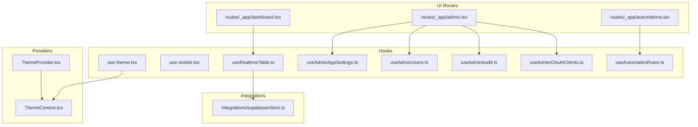

**Diagram sources**
- [admin.tsx:1-50](file://src/routes/_app/admin.tsx#L1-L50)
- [automations.tsx:1-261](file://src/routes/_app/automations.tsx#L1-L261)
- [dashboard.tsx:1-448](file://src/routes/_app/dashboard.tsx#L1-L448)
- [ThemeProvider.tsx:1-74](file://src/components/ThemeProvider.tsx#L1-L74)
- [ThemeContext.tsx:1-12](file://src/components/ThemeContext.tsx#L1-L12)
- [use-theme.tsx:1-11](file://src/hooks/use-theme.tsx#L1-L11)
- [useRealtimeTable.ts:1-50](file://src/hooks/useRealtimeTable.ts#L1-L50)
- [client.ts](file://src/integrations/supabase/client.ts)

## Detailed Component Analysis

### Theme Management Hook and Provider
The theme system consists of:
- ThemeProvider: initializes theme from storage, applies classes to document, listens to system preference changes, and exposes setters.
- useTheme: a thin wrapper around the theme context to access theme state and setters.
- theme utilities: resolve effective theme, persist to storage, and apply classes.

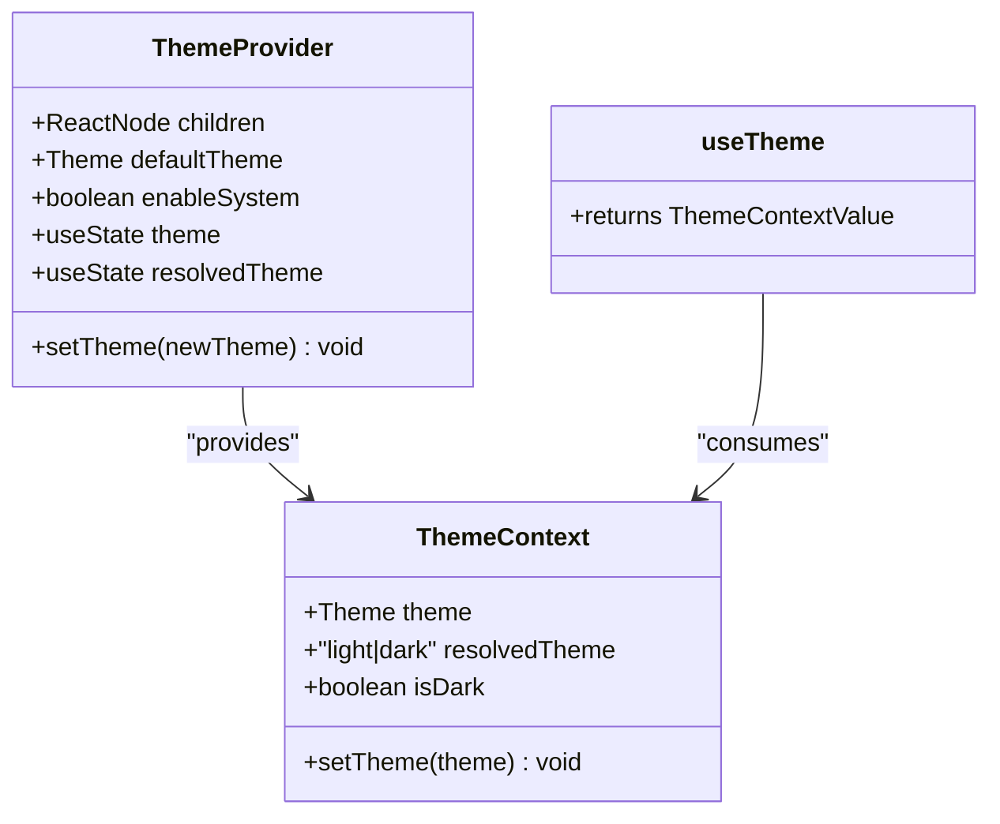

**Diagram sources**
- [ThemeProvider.tsx:1-74](file://src/components/ThemeProvider.tsx#L1-L74)
- [ThemeContext.tsx:1-12](file://src/components/ThemeContext.tsx#L1-L12)
- [use-theme.tsx:1-11](file://src/hooks/use-theme.tsx#L1-L11)

Key behaviors:
- Persistence: theme saved to localStorage and applied to document element.
- System mode: follows OS preference when configured.
- Hydration safety: initializes on mount to prevent mismatches.

Usage pattern:
- Wrap the app with ThemeProvider.
- Call useTheme in components to read and update theme.

**Section sources**
- [ThemeProvider.tsx:1-74](file://src/components/ThemeProvider.tsx#L1-L74)
- [ThemeContext.tsx:1-12](file://src/components/ThemeContext.tsx#L1-L12)
- [use-theme.tsx:1-11](file://src/hooks/use-theme.tsx#L1-L11)
- [theme.ts:1-77](file://src/lib/theme.ts#L1-L77)

### Mobile Detection Hook
useIsMobile detects whether the viewport width is below a breakpoint and reacts to media query changes.

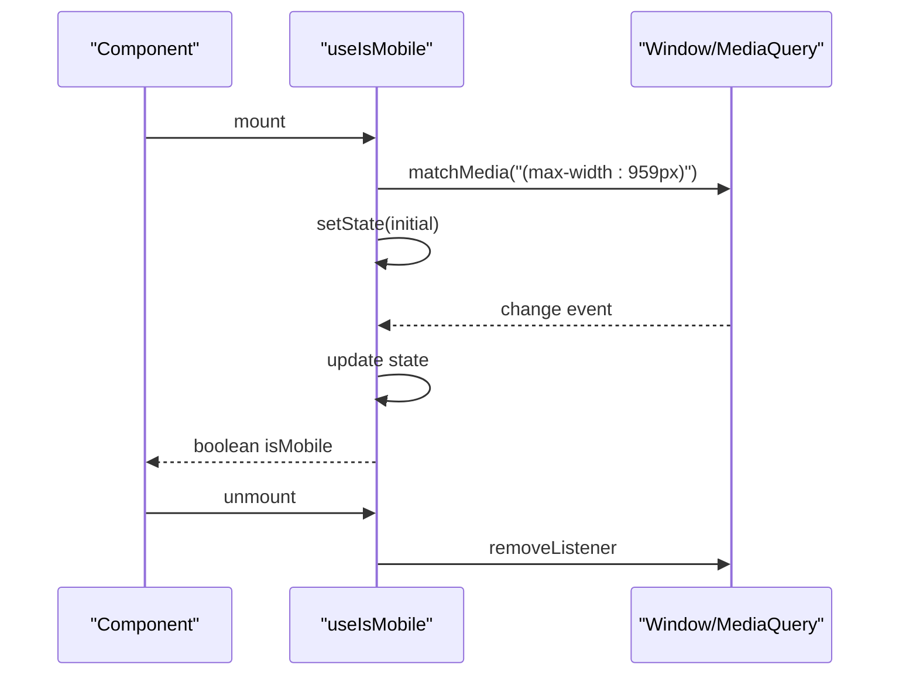

**Diagram sources**
- [use-mobile.tsx:1-20](file://src/hooks/use-mobile.tsx#L1-L20)

Behavior:
- Uses a fixed breakpoint and cleans up listeners on unmount.
- Returns a boolean suitable for responsive rendering decisions.

**Section sources**
- [use-mobile.tsx:1-20](file://src/hooks/use-mobile.tsx#L1-L20)

### Real-Time Table Hook
useRealtimeTable loads initial data and subscribes to Supabase realtime events for a given table. It supports dependency-driven refresh and cleanup of channels.

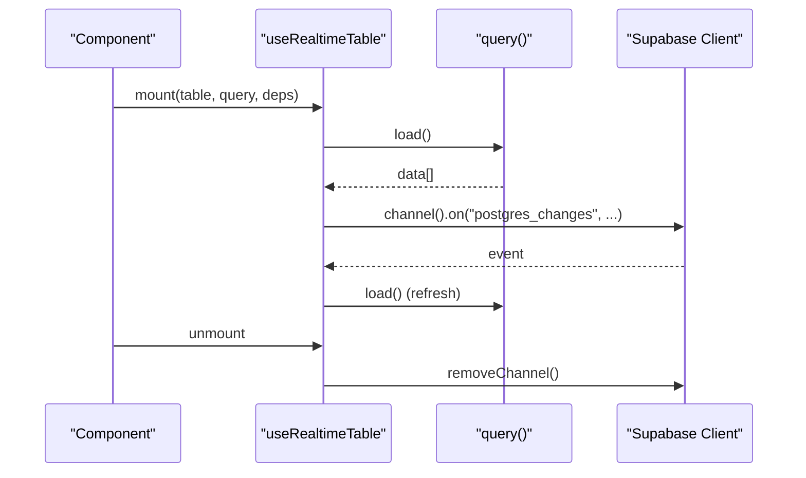

**Diagram sources**
- [useRealtimeTable.ts:1-50](file://src/hooks/useRealtimeTable.ts#L1-L50)
- [client.ts](file://src/integrations/supabase/client.ts)

Behavior:
- Maintains loading state and exposes a refresh function.
- Uses a randomized suffix to avoid channel collisions.
- Exposes a dependency list to control refresh triggers.

**Section sources**
- [useRealtimeTable.ts:1-50](file://src/hooks/useRealtimeTable.ts#L1-L50)

### Admin App Settings Hook
Manages application-wide settings with form validation, server-side persistence, and export capabilities.

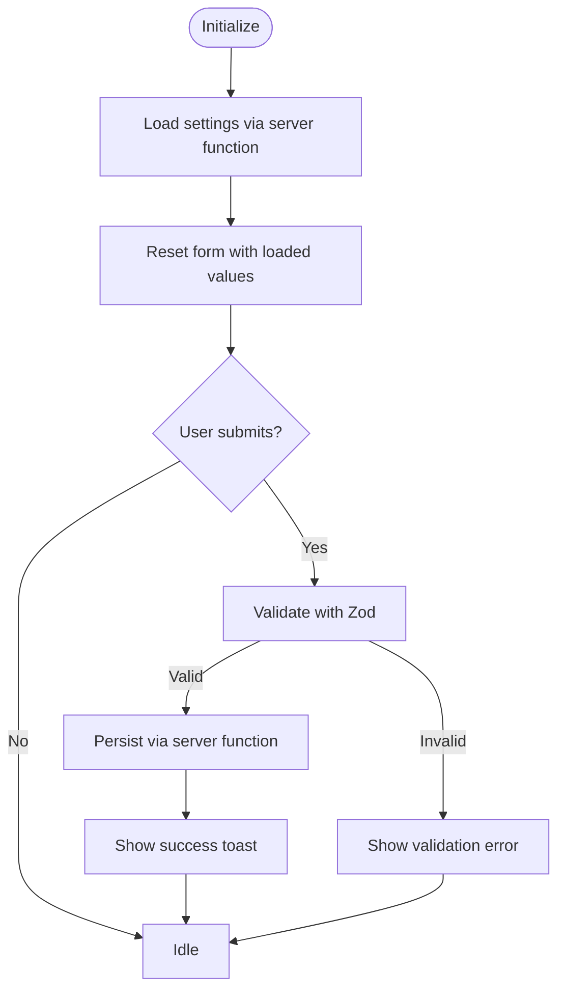

**Diagram sources**
- [useAdminAppSettings.ts:1-156](file://src/hooks/useAdminAppSettings.ts#L1-L156)

Highlights:
- Uses react-hook-form with zodResolver for validation.
- Integrates with server functions for load/save/export.
- Handles loading states, busy states, and error messaging.

**Section sources**
- [useAdminAppSettings.ts:1-156](file://src/hooks/useAdminAppSettings.ts#L1-L156)

### Admin Users Hook
Provides listing, filtering, inviting, enabling/disabling, and deleting admin users with bulk operations and confirmation dialogs.

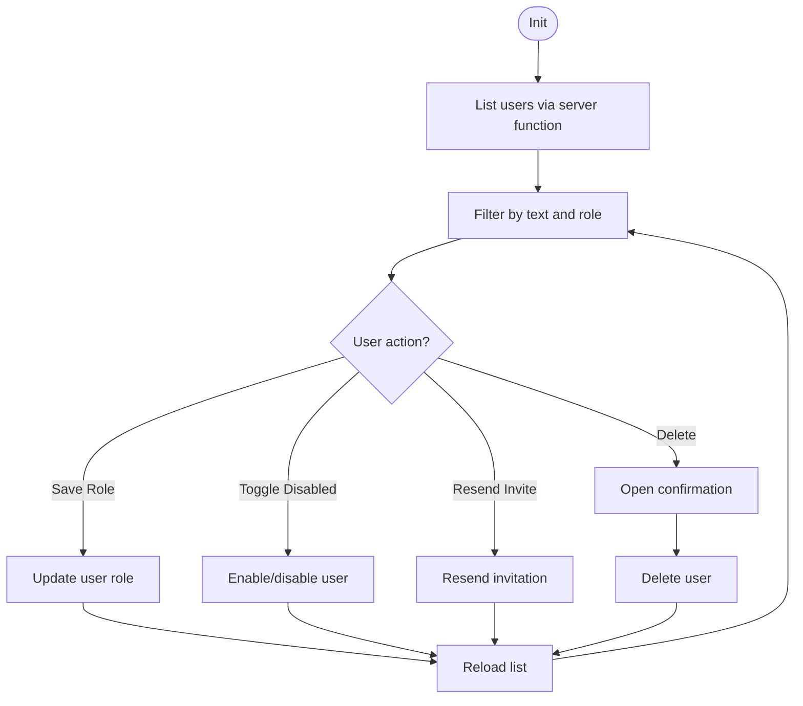

**Diagram sources**
- [useAdminUsers.ts:1-213](file://src/hooks/useAdminUsers.ts#L1-L213)

Highlights:
- Uses server functions for all mutations.
- Manages selection, bulk actions, and busy states.
- Provides controlled filtering and reset of form state.

**Section sources**
- [useAdminUsers.ts:1-213](file://src/hooks/useAdminUsers.ts#L1-L213)

### Admin Audit Hook
Handles paginated audit log retrieval, filtering, and CSV export.

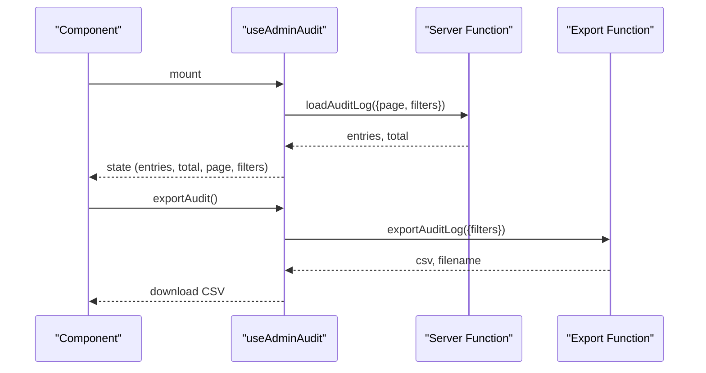

**Diagram sources**
- [useAdminAudit.ts:1-82](file://src/hooks/useAdminAudit.ts#L1-L82)

Highlights:
- Encapsulates pagination and filters.
- Exposes an export handler that downloads CSV.

**Section sources**
- [useAdminAudit.ts:1-82](file://src/hooks/useAdminAudit.ts#L1-L82)

### Admin OAuth Clients Hook
Manages OAuth clients: listing, creation, status updates, secret rotation, and lifecycle inspection.

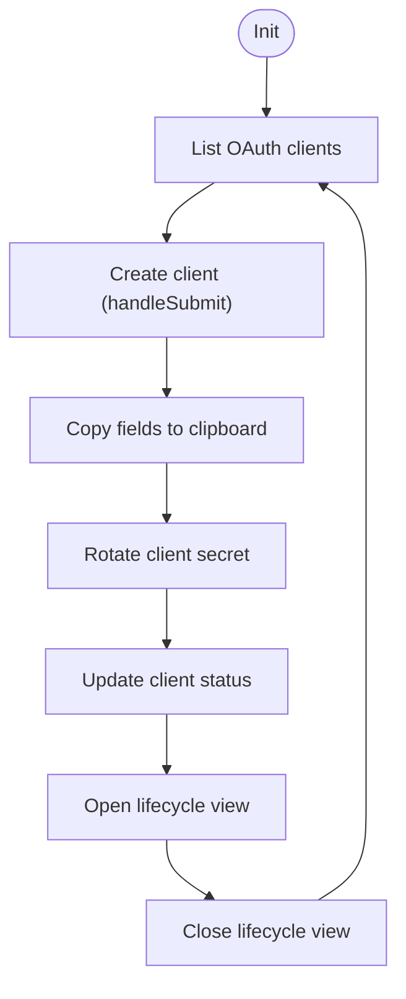

**Diagram sources**
- [useAdminOAuthClients.ts:1-196](file://src/hooks/useAdminOAuthClients.ts#L1-L196)

Highlights:
- Uses react-hook-form for creation with newline-separated redirect URIs.
- Integrates clipboard API for quick copying.
- Supports lifecycle inspection and loading states.

**Section sources**
- [useAdminOAuthClients.ts:1-196](file://src/hooks/useAdminOAuthClients.ts#L1-L196)

### Automation Rules Hook
Orchestrates rule listing, filtering, creation/editing via builder, runs, and versioning.

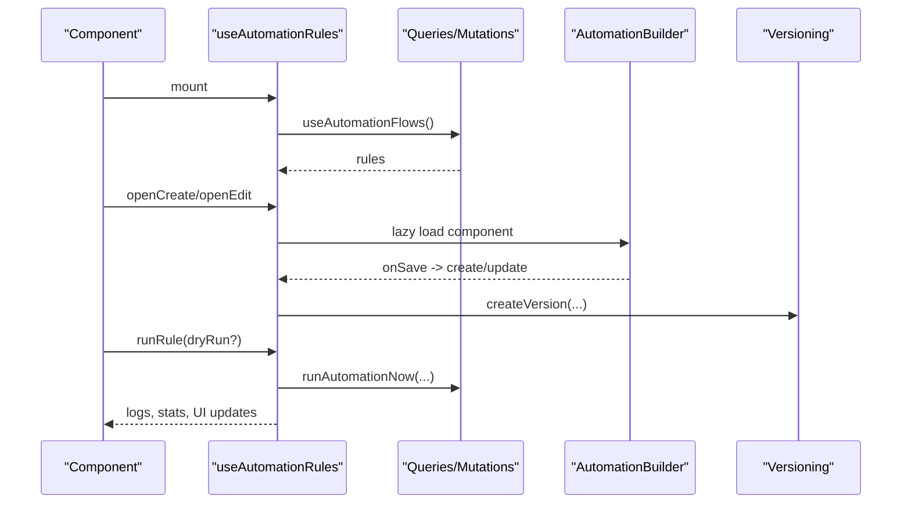

**Diagram sources**
- [useAutomationRules.ts:1-413](file://src/hooks/useAutomationRules.ts#L1-L413)

Highlights:
- Uses server functions and mutations for CRUD and runs.
- Implements guided and advanced builder modes.
- Manages versioning snapshots and run logs.

**Section sources**
- [useAutomationRules.ts:1-413](file://src/hooks/useAutomationRules.ts#L1-L413)

### Conceptual Overview
Hook composition patterns observed across the system:
- Provider + hook pattern for global state (theme).
- Effectful hooks for side effects (mobile detection, real-time).
- Form + server function hooks for admin operations.
- Memoized selectors and derived state for performance.

[No sources needed since this section doesn't analyze specific files]

## Dependency Analysis
The hooks depend on:
- Providers for global state (ThemeProvider, ThemeContext)
- Supabase client for real-time subscriptions
- Server functions for admin operations
- React and third-party libraries (react-hook-form, zod, TanStack Router/Start)

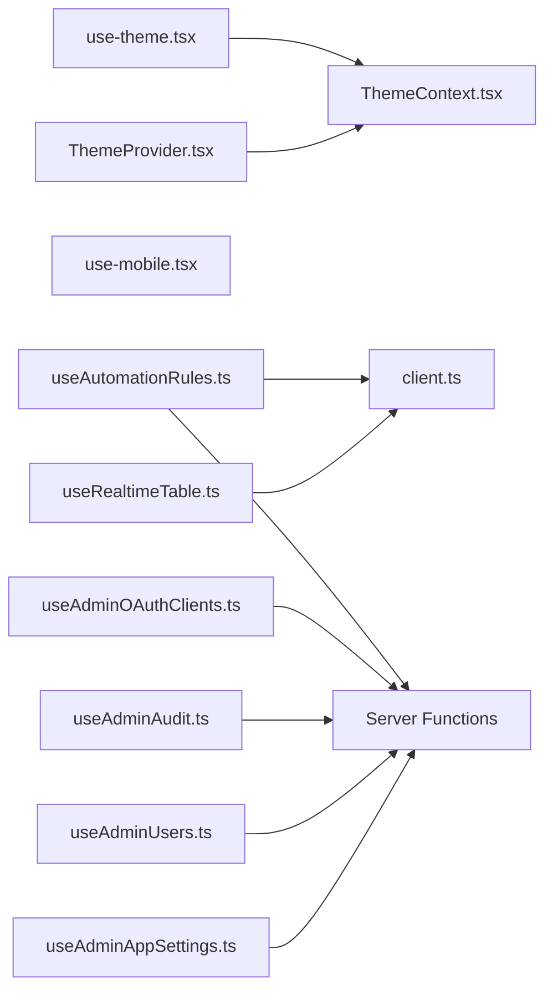

**Diagram sources**
- [ThemeProvider.tsx:1-74](file://src/components/ThemeProvider.tsx#L1-L74)
- [ThemeContext.tsx:1-12](file://src/components/ThemeContext.tsx#L1-L12)
- [use-theme.tsx:1-11](file://src/hooks/use-theme.tsx#L1-L11)
- [use-mobile.tsx:1-20](file://src/hooks/use-mobile.tsx#L1-L20)
- [useRealtimeTable.ts:1-50](file://src/hooks/useRealtimeTable.ts#L1-L50)
- [client.ts](file://src/integrations/supabase/client.ts)
- [useAdminAppSettings.ts:1-156](file://src/hooks/useAdminAppSettings.ts#L1-L156)
- [useAdminUsers.ts:1-213](file://src/hooks/useAdminUsers.ts#L1-L213)
- [useAdminAudit.ts:1-82](file://src/hooks/useAdminAudit.ts#L1-L82)
- [useAdminOAuthClients.ts:1-196](file://src/hooks/useAdminOAuthClients.ts#L1-L196)
- [useAutomationRules.ts:1-413](file://src/hooks/useAutomationRules.ts#L1-L413)

**Section sources**
- [use-theme.tsx:1-11](file://src/hooks/use-theme.tsx#L1-L11)
- [use-mobile.tsx:1-20](file://src/hooks/use-mobile.tsx#L1-L20)
- [useRealtimeTable.ts:1-50](file://src/hooks/useRealtimeTable.ts#L1-L50)
- [useAdminAppSettings.ts:1-156](file://src/hooks/useAdminAppSettings.ts#L1-L156)
- [useAdminUsers.ts:1-213](file://src/hooks/useAdminUsers.ts#L1-L213)
- [useAdminAudit.ts:1-82](file://src/hooks/useAdminAudit.ts#L1-L82)
- [useAdminOAuthClients.ts:1-196](file://src/hooks/useAdminOAuthClients.ts#L1-L196)
- [useAutomationRules.ts:1-413](file://src/hooks/useAutomationRules.ts#L1-L413)
- [ThemeProvider.tsx:1-74](file://src/components/ThemeProvider.tsx#L1-L74)
- [ThemeContext.tsx:1-12](file://src/components/ThemeContext.tsx#L1-L12)
- [client.ts](file://src/integrations/supabase/client.ts)

## Performance Considerations
- Memoization
  - Prefer useMemo for derived data and expensive computations.
  - Use useCallback for event handlers and callbacks passed to effects.
- Dependencies
  - Keep dependency arrays minimal and accurate to avoid unnecessary re-renders.
  - For real-time hooks, pass explicit dependency lists to control refresh cycles.
- Side Effects
  - Clean up subscriptions and listeners in useEffect return functions.
  - Avoid heavy work in render; defer to effects or background tasks.
- Lazy Loading
  - Defer loading large components until needed (e.g., builder).
- Storage and Hydration
  - Initialize theme on mount to prevent hydration mismatches.
- Real-time Channels
  - Use unique channel suffixes to avoid collisions.
  - Remove channels on unmount to prevent leaks.

[No sources needed since this section provides general guidance]

## Troubleshooting Guide
Common issues and resolutions:
- useTheme throws an error when used outside ThemeProvider
  - Ensure the app is wrapped with ThemeProvider.
  - Verify the provider receives proper defaults and keys.
- Real-time hook not updating
  - Confirm table name and schema match the subscription.
  - Check that the channel is not being removed prematurely.
- Mobile detection not responding
  - Ensure the media query listener is attached and cleaned up.
  - Verify the breakpoint aligns with your design system.
- Admin hooks failing silently
  - Inspect toasts for user-friendly messages.
  - Validate access tokens and permissions.
- Automation builder not loading
  - Confirm lazy import succeeds and builder component renders.
  - Ensure server functions are reachable and return expected shapes.

**Section sources**
- [use-theme.tsx:1-11](file://src/hooks/use-theme.tsx#L1-L11)
- [useRealtimeTable.ts:1-50](file://src/hooks/useRealtimeTable.ts#L1-L50)
- [use-mobile.tsx:1-20](file://src/hooks/use-mobile.tsx#L1-L20)
- [useAdminAppSettings.ts:1-156](file://src/hooks/useAdminAppSettings.ts#L1-L156)
- [useAdminUsers.ts:1-213](file://src/hooks/useAdminUsers.ts#L1-L213)
- [useAdminAudit.ts:1-82](file://src/hooks/useAdminAudit.ts#L1-L82)
- [useAdminOAuthClients.ts:1-196](file://src/hooks/useAdminOAuthClients.ts#L1-L196)
- [useAutomationRules.ts:1-413](file://src/hooks/useAutomationRules.ts#L1-L413)

## Conclusion
The hooks system provides a cohesive, composable foundation for state, side effects, and integrations:
- ThemeProvider and useTheme unify theme state and persistence.
- useIsMobile enables responsive UI decisions.
- useRealtimeTable simplifies real-time synchronization with Supabase.
- Admin hooks encapsulate complex workflows with robust validation and feedback.
- Composition patterns, memoization, and careful dependency management yield maintainable and performant code.

[No sources needed since this section summarizes without analyzing specific files]

## Appendices

### Hook Usage Examples and Patterns
- Theme
  - Wrap the app with ThemeProvider.
  - In a component, call useTheme and call setTheme to switch modes.
- Mobile
  - In a component, call useIsMobile and branch UI accordingly.
- Real-time
  - Pass a table name and a query function to useRealtimeTable.
  - Use the returned data and refresh function to keep UI in sync.
- Admin Settings
  - Initialize with access token and admin flag.
  - Bind form values to settingsForm and call submitSettings on save.
- Admin Users
  - Initialize with access token, admin flag, and current user ID.
  - Use filtered list and action handlers for CRUD operations.
- Admin Audit
  - Initialize with access token, admin flag, and optional page size.
  - Use loadAudit and handleExportAudit for pagination and export.
- Admin OAuth Clients
  - Initialize with access token and admin flag.
  - Use createNewClient handleSubmit and action handlers for lifecycle.
- Automation Rules
  - Initialize without arguments; use builderOpen and saveWizardFlow to manage flows.

**Section sources**
- [admin.tsx:1-50](file://src/routes/_app/admin.tsx#L1-L50)
- [automations.tsx:1-261](file://src/routes/_app/automations.tsx#L1-L261)
- [dashboard.tsx:1-448](file://src/routes/_app/dashboard.tsx#L1-L448)
- [use-theme.tsx:1-11](file://src/hooks/use-theme.tsx#L1-L11)
- [use-mobile.tsx:1-20](file://src/hooks/use-mobile.tsx#L1-L20)
- [useRealtimeTable.ts:1-50](file://src/hooks/useRealtimeTable.ts#L1-L50)
- [useAdminAppSettings.ts:1-156](file://src/hooks/useAdminAppSettings.ts#L1-L156)
- [useAdminUsers.ts:1-213](file://src/hooks/useAdminUsers.ts#L1-L213)
- [useAdminAudit.ts:1-82](file://src/hooks/useAdminAudit.ts#L1-L82)
- [useAdminOAuthClients.ts:1-196](file://src/hooks/useAdminOAuthClients.ts#L1-L196)
- [useAutomationRules.ts:1-413](file://src/hooks/useAutomationRules.ts#L1-L413)