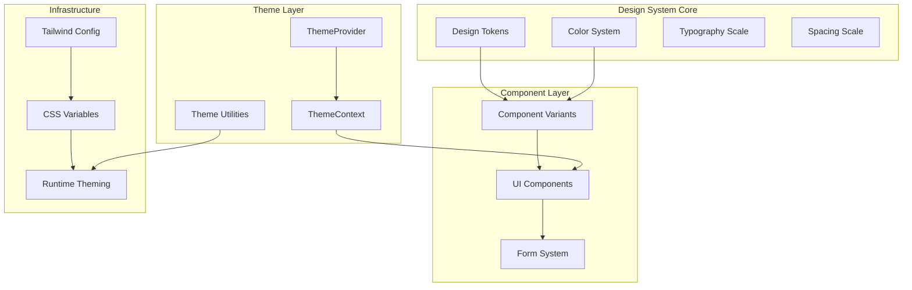
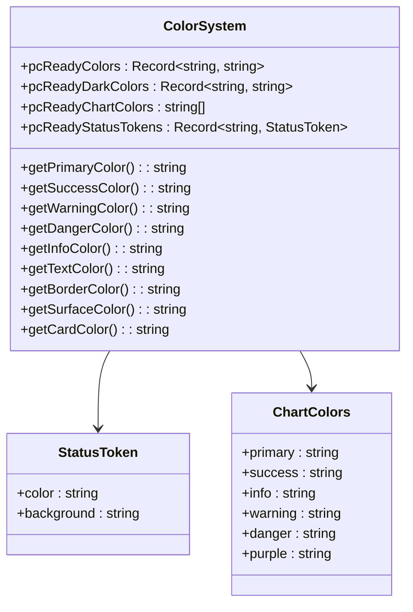
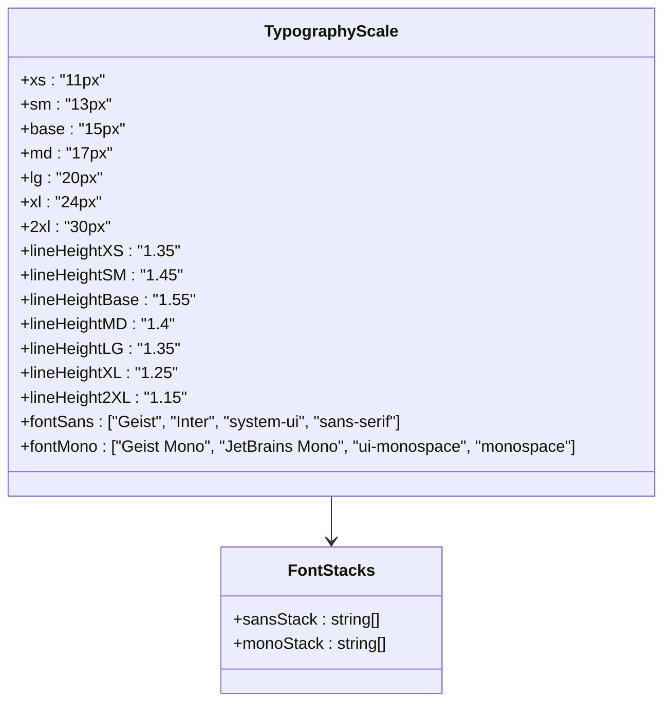
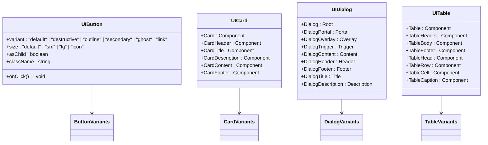
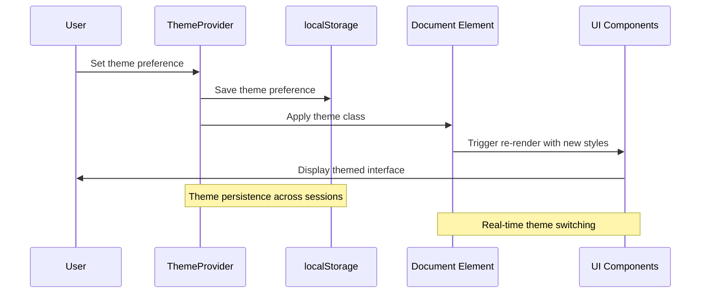
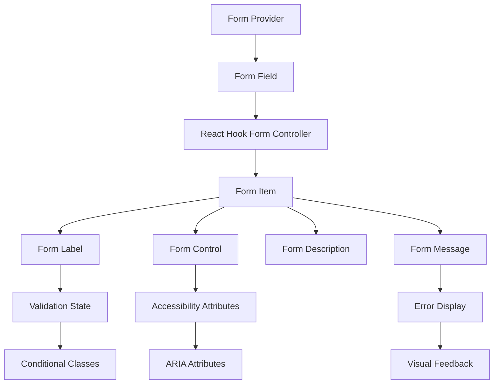
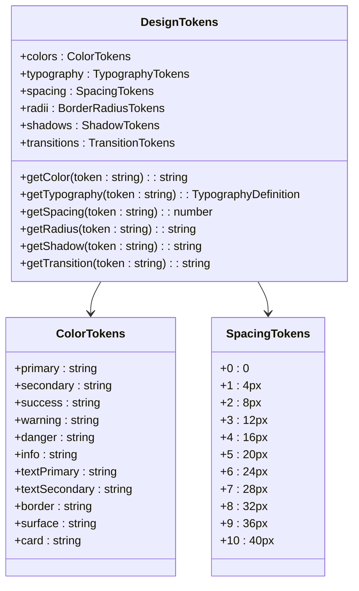

# Design System

<cite>
**Referenced Files in This Document**
- [design-system.ts](file://src/lib/design-system.ts)
- [button.tsx](file://src/components/ui/button.tsx)
- [button-variants.ts](file://src/components/ui/button-variants.ts)
- [badge.tsx](file://src/components/ui/badge.tsx)
- [badge-variants.ts](file://src/components/ui/badge-variants.ts)
- [input.tsx](file://src/components/ui/input.tsx)
- [card.tsx](file://src/components/ui/card.tsx)
- [dialog.tsx](file://src/components/ui/dialog.tsx)
- [table.tsx](file://src/components/ui/table.tsx)
- [form.tsx](file://src/components/ui/form.tsx)
- [navigation-menu-variants.ts](file://src/components/ui/navigation-menu-variants.ts)
- [toggle-variants.ts](file://src/components/ui/toggle-variants.ts)
- [theme.ts](file://src/lib/theme.ts)
- [ThemeProvider.tsx](file://src/components/ThemeProvider.tsx)
- [ThemeContext.tsx](file://src/components/ThemeContext.tsx)
- [tailwind.config.ts](file://tailwind.config.ts)
</cite>

## Table of Contents

1. [Introduction](#introduction)
2. [Design System Architecture](#design-system-architecture)
3. [Color System](#color-system)
4. [Typography System](#typography-system)
5. [Component Library](#component-library)
6. [Theme System](#theme-system)
7. [Component Variants](#component-variants)
8. [Form System](#form-system)
9. [Design Tokens](#design-tokens)
10. [Implementation Guidelines](#implementation-guidelines)
11. [Best Practices](#best-practices)
12. [Troubleshooting](#troubleshooting)

## Introduction

The PCReady Design System is a comprehensive component library and design framework built with React, TypeScript, Tailwind CSS, and Radix UI. It provides a consistent, accessible, and maintainable foundation for building user interfaces across the application. The system emphasizes design tokens, component variants, and theme management to ensure visual consistency and developer productivity.

The design system serves as the single source of truth for all visual elements, ensuring that components share common styling patterns, spacing, typography, and interaction behaviors. It supports both light and dark themes with automatic system preference detection and manual theme switching capabilities.

## Design System Architecture

The design system follows a modular architecture with clear separation of concerns:



**Diagram sources**

- [design-system.ts:1-52](file://src/lib/design-system.ts#L1-L52)
- [ThemeProvider.tsx:1-74](file://src/components/ThemeProvider.tsx#L1-L74)
- [tailwind.config.ts:1-58](file://tailwind.config.ts#L1-L58)

The architecture ensures that design decisions are centralized while maintaining flexibility for component-specific customization through variants and composition patterns.

**Section sources**

- [design-system.ts:1-52](file://src/lib/design-system.ts#L1-L52)
- [ThemeProvider.tsx:1-74](file://src/components/ThemeProvider.tsx#L1-L74)
- [tailwind.config.ts:1-58](file://tailwind.config.ts#L1-L58)

## Color System

The color system is built around a carefully curated palette that supports both light and dark themes with semantic meaning:



**Diagram sources**

- [design-system.ts:1-52](file://src/lib/design-system.ts#L1-L52)

### Primary Palette

The primary palette consists of blue-based colors that convey trust, professionalism, and actionability. The palette includes standard colors, hover states, and light variants for proper contrast and accessibility.

### Semantic Colors

Semantic colors represent specific meanings within the application context:

- Success: Green tones for positive actions and completions
- Warning: Amber/orange tones for caution and pending states
- Danger: Red tones for destructive actions and errors
- Info: Teal/blue tones for informational messages

### Status Tokens

Status tokens provide pre-defined color combinations for common UI states:

- Pending: Warning color with warning light background
- In Progress: Primary color with primary light background
- Completed: Success color with success light background
- Archived: Secondary text color with slate light background
- Critical: Danger color with danger light background
- Info: Info color with info light background

**Section sources**

- [design-system.ts:1-52](file://src/lib/design-system.ts#L1-L52)

## Typography System

The typography system establishes a consistent hierarchy and rhythm across all components:



**Diagram sources**

- [tailwind.config.ts:40-52](file://tailwind.config.ts#L40-L52)

The typography scale provides precise control over text sizing and spacing, with optimized line heights for readability at each size level. The font stacks ensure fallback compatibility across different environments.

**Section sources**

- [tailwind.config.ts:40-52](file://tailwind.config.ts#L40-L52)

## Component Library

The component library provides reusable UI elements with consistent behavior and appearance:



**Diagram sources**

- [button.tsx:8-23](file://src/components/ui/button.tsx#L8-L23)
- [card.tsx:5-55](file://src/components/ui/card.tsx#L5-L55)
- [dialog.tsx:9-104](file://src/components/ui/dialog.tsx#L9-L104)
- [table.tsx:5-94](file://src/components/ui/table.tsx#L5-L94)

### Component Composition Pattern

Components follow a consistent pattern using composition and variant systems:

- Base components handle structural rendering
- Variants define visual states and behaviors
- Utility classes manage responsive and accessibility features
- Slot components enable flexible child composition

**Section sources**

- [button.tsx:8-23](file://src/components/ui/button.tsx#L8-L23)
- [card.tsx:5-55](file://src/components/ui/card.tsx#L5-L55)
- [dialog.tsx:9-104](file://src/components/ui/dialog.tsx#L9-L104)
- [table.tsx:5-94](file://src/components/ui/table.tsx#L5-L94)

## Theme System

The theme system provides comprehensive dark/light mode support with automatic system preference detection:



**Diagram sources**

- [ThemeProvider.tsx:17-73](file://src/components/ThemeProvider.tsx#L17-L73)
- [theme.ts:35-47](file://src/lib/theme.ts#L35-L47)

### Theme Modes

The system supports three distinct theme modes:

- Light: Traditional light interface with dark text
- Dark: Dark interface with light text and reduced brightness
- System: Automatic mode based on OS/system preferences

### Theme Resolution

Theme resolution follows a priority system:

1. Explicit user preference (stored in localStorage)
2. System preference (OS/browser setting)
3. Fallback to light mode

**Section sources**

- [ThemeProvider.tsx:17-73](file://src/components/ThemeProvider.tsx#L17-L73)
- [ThemeContext.tsx:4-11](file://src/components/ThemeContext.tsx#L4-L11)
- [theme.ts:16-21](file://src/lib/theme.ts#L16-L21)

## Component Variants

Component variants provide a flexible system for managing component states and visual variations:

```mermaid
classDiagram
class VariantSystem {
+cva : Function
+buttonVariants : Variants
+badgeVariants : Variants
+toggleVariants : Variants
+navigationMenuTriggerStyle : Variants
}
class ButtonVariants {
+variant : {
+default : string
+destructive : string
+outline : string
+secondary : string
+ghost : string
+link : string
}
+size : {
+default : string
+sm : string
+lg : string
+icon : string
}
}
class BadgeVariants {
+variant : {
+default : string
+secondary : string
+destructive : string
+outline : string
}
}
class ToggleVariants {
+variant : {
+default : string
+outline : string
}
+size : {
+default : string
+sm : string
+lg : string
}
}
VariantSystem --> ButtonVariants
VariantSystem --> BadgeVariants
VariantSystem --> ToggleVariants
```

**Diagram sources**

- [button-variants.ts:3-28](file://src/components/ui/button-variants.ts#L3-L28)
- [badge-variants.ts:3-20](file://src/components/ui/badge-variants.ts#L3-L20)
- [toggle-variants.ts:3-23](file://src/components/ui/toggle-variants.ts#L3-L23)

### Variance Function (cva)

The `cva` function from class-variance-authority enables declarative variant definitions with:

- Base classes applied to all variants
- Conditional classes based on variant props
- Default variant configuration
- Type-safe variant definitions

### Responsive Variants

Variants automatically adapt to different screen sizes and interaction states, ensuring consistent behavior across devices and contexts.

**Section sources**

- [button-variants.ts:3-28](file://src/components/ui/button-variants.ts#L3-L28)
- [badge-variants.ts:3-20](file://src/components/ui/badge-variants.ts#L3-L20)
- [toggle-variants.ts:3-23](file://src/components/ui/toggle-variants.ts#L3-L23)

## Form System

The form system provides comprehensive form handling with validation, accessibility, and error management:



**Diagram sources**

- [form.tsx:16-162](file://src/components/ui/form.tsx#L16-L162)

### Form Field Architecture

The form system follows a hierarchical structure:

- FormProvider: Manages form state and context
- FormField: Wraps individual form controls with field context
- FormItem: Provides container and ID management
- FormLabel: Handles labeling and error states
- FormControl: Manages control state and accessibility
- FormDescription: Provides helper text
- FormMessage: Displays validation errors

### Accessibility Features

The form system includes comprehensive accessibility features:

- Dynamic ARIA attributes based on validation state
- Proper labeling and association
- Keyboard navigation support
- Screen reader friendly error messaging

**Section sources**

- [form.tsx:16-162](file://src/components/ui/form.tsx#L16-L162)

## Design Tokens

Design tokens serve as the foundational elements that define the visual language of the system:



**Diagram sources**

- [design-system.ts:1-52](file://src/lib/design-system.ts#L1-L52)

### Token Categories

Design tokens are organized into logical categories:

- **Colors**: Semantic and functional color assignments
- **Typography**: Font families, sizes, and line heights
- **Spacing**: Consistent spacing scale for layouts
- **Radii**: Border radius values for rounded corners
- **Shadows**: Elevation and depth effects
- **Transitions**: Animation and transition timing

### Token Resolution

Tokens provide a layer of abstraction that enables:

- Consistent design across components
- Easy theme switching and customization
- Type-safe token usage
- Automatic CSS variable generation

**Section sources**

- [design-system.ts:1-52](file://src/lib/design-system.ts#L1-L52)

## Implementation Guidelines

### Component Development

When creating new components, follow these guidelines:

1. **Use Variants**: Leverage the variant system for consistent styling
2. **Follow Composition**: Use slot components for flexible composition
3. **Ensure Accessibility**: Include proper ARIA attributes and keyboard navigation
4. **Support Theming**: Use CSS variables for theme-aware styling
5. **Maintain Responsiveness**: Test components across different screen sizes

### Theme Integration

Integrate themes properly by:

1. **Using ThemeProvider**: Wrap applications with ThemeProvider
2. **Accessing Theme Context**: Use theme-aware components
3. **Storing Preferences**: Persist user theme choices
4. **Handling System Changes**: Respond to system theme changes

### Form Implementation

When implementing forms:

1. **Use Form System**: Leverage the provided form components
2. **Handle Validation**: Integrate with React Hook Form
3. **Provide Feedback**: Include appropriate error messaging
4. **Ensure Accessibility**: Support screen readers and keyboard navigation

## Best Practices

### Design Consistency

- Use the established color palette consistently
- Follow the typography hierarchy
- Maintain consistent spacing and alignment
- Apply shadows and borders according to guidelines

### Performance Optimization

- Use CSS variables for dynamic theming
- Minimize unnecessary re-renders
- Optimize component composition
- Leverage React.memo for static components

### Accessibility Standards

- Ensure sufficient color contrast
- Provide keyboard navigation
- Include proper ARIA attributes
- Support screen reader functionality

### Cross-Browser Compatibility

- Test components across major browsers
- Use vendor prefixes when necessary
- Validate CSS property support
- Test on various devices and screen sizes

## Troubleshooting

### Common Issues

**Theme Not Applying**

- Verify ThemeProvider is wrapping the application
- Check localStorage permissions
- Ensure CSS variables are properly defined
- Confirm system preference detection works

**Component Styling Issues**

- Verify variant prop usage
- Check for conflicting CSS classes
- Ensure proper import order
- Validate Tailwind configuration

**Form Validation Problems**

- Check React Hook Form integration
- Verify field registration
- Ensure proper error handling
- Test validation schemas

**Accessibility Concerns**

- Use browser developer tools to inspect ARIA attributes
- Test with screen readers
- Validate keyboard navigation
- Check color contrast ratios

### Debug Strategies

1. **Inspect CSS Variables**: Check if theme variables are being applied correctly
2. **Validate Component Props**: Ensure variant and size props are properly passed
3. **Test Form State**: Verify form context and field state
4. **Check Theme Persistence**: Confirm theme preferences are saved and loaded
5. **Review Console Errors**: Look for runtime errors in component rendering

**Section sources**

- [ThemeProvider.tsx:42-63](file://src/components/ThemeProvider.tsx#L42-L63)
- [form.tsx:40-65](file://src/components/ui/form.tsx#L40-L65)
- [design-system.ts:1-52](file://src/lib/design-system.ts#L1-L52)
