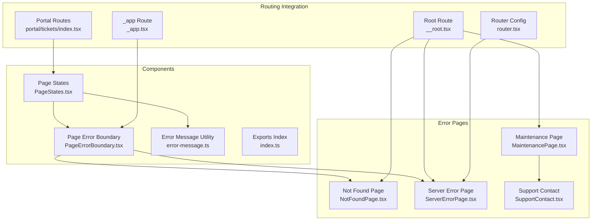
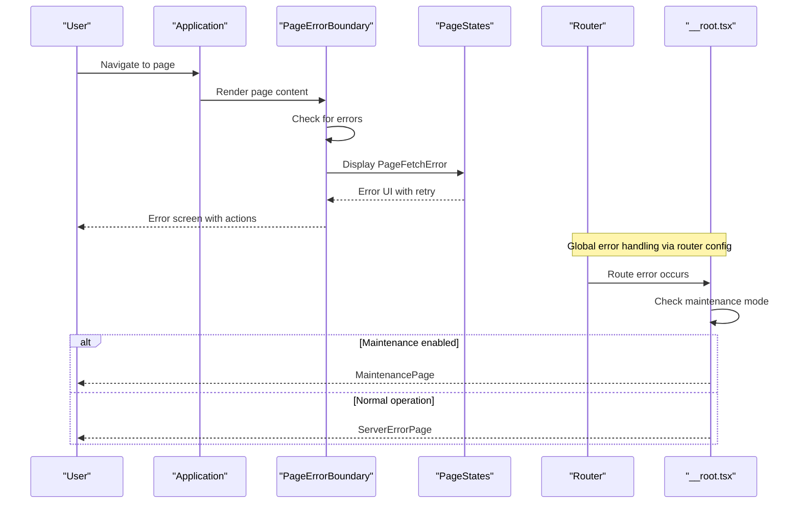
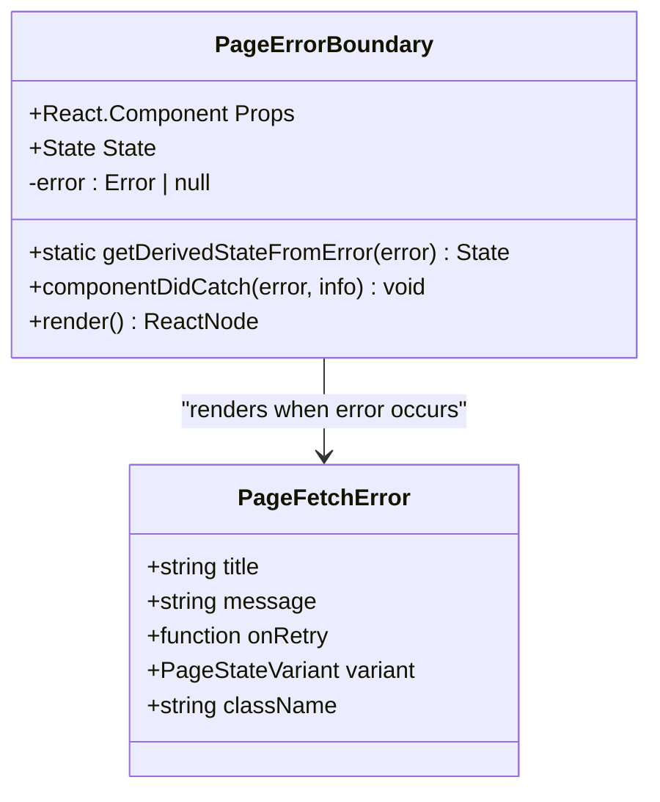
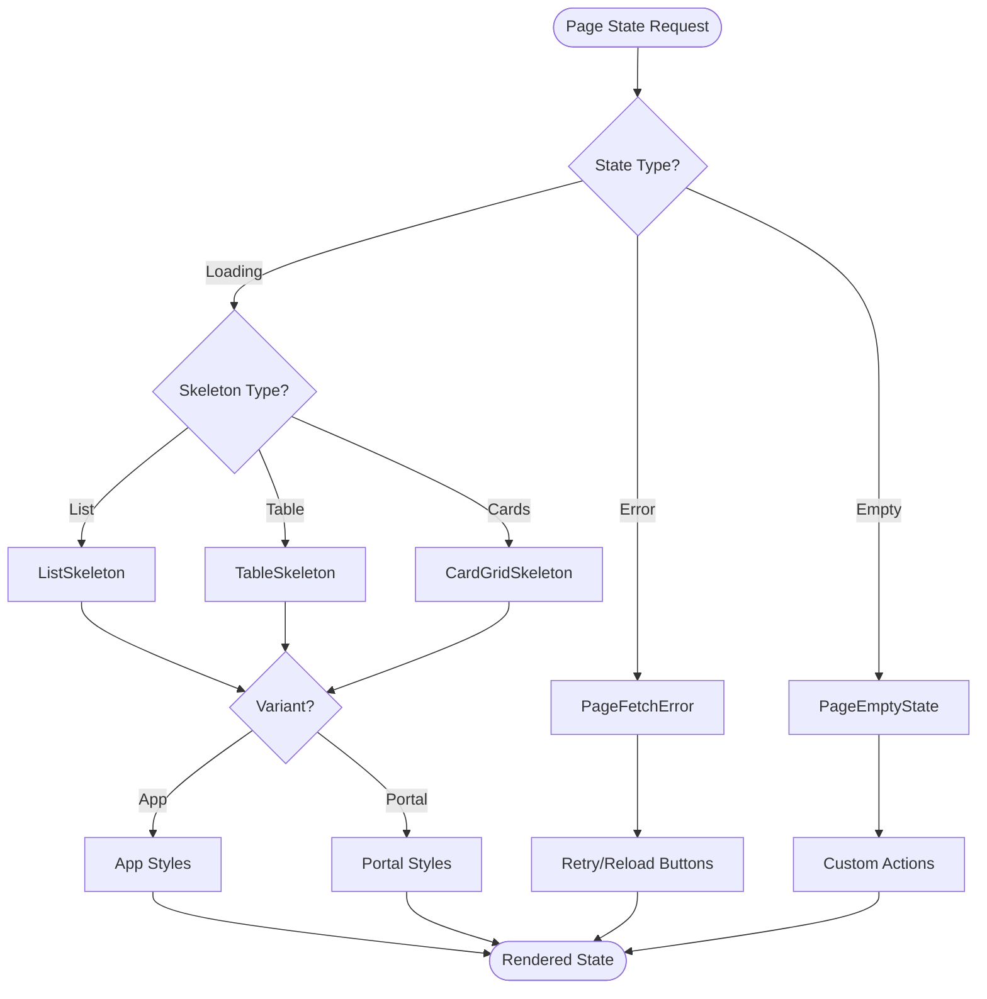
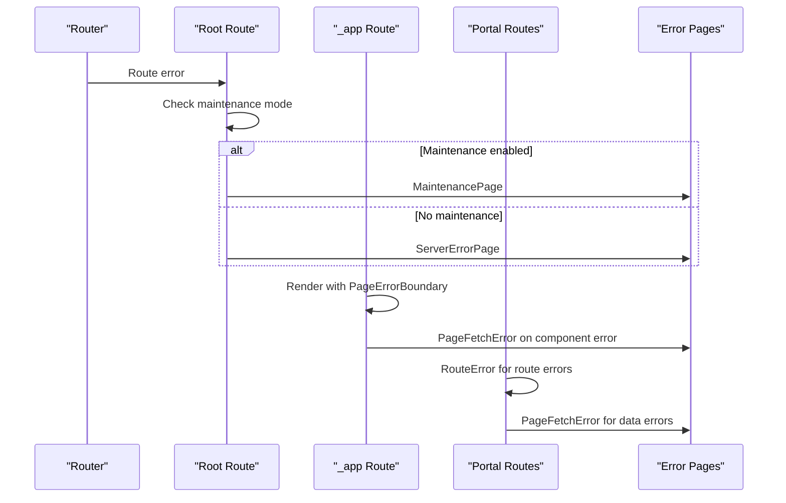
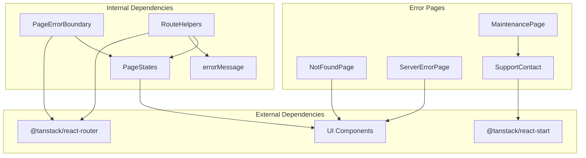

# Page States and Error Handling Components

<cite>
**Referenced Files in This Document**
- [PageErrorBoundary.tsx](file://src/components/page-states/PageErrorBoundary.tsx)
- [PageStates.tsx](file://src/components/page-states/PageStates.tsx)
- [error-message.ts](file://src/components/page-states/error-message.ts)
- [index.ts](file://src/components/page-states/index.ts)
- [NotFoundPage.tsx](file://src/components/errors/NotFoundPage.tsx)
- [ServerErrorPage.tsx](file://src/components/errors/ServerErrorPage.tsx)
- [MaintenancePage.tsx](file://src/components/errors/MaintenancePage.tsx)
- [SupportContact.tsx](file://src/components/errors/SupportContact.tsx)
- [__root.tsx](file://src/routes/__root.tsx)
- [_app.tsx](file://src/routes/_app.tsx)
- [RouteHelpers.tsx](file://src/components/RouteHelpers.tsx)
- [router.tsx](file://src/router.tsx)
- [$tsx](file://src/routes/$.tsx)
- [portal\tickets\index.tsx](file://src/routes/portal/tickets/index.tsx)
</cite>

## Table of Contents
1. [Introduction](#introduction)
2. [Project Structure](#project-structure)
3. [Core Components](#core-components)
4. [Architecture Overview](#architecture-overview)
5. [Detailed Component Analysis](#detailed-component-analysis)
6. [Dependency Analysis](#dependency-analysis)
7. [Performance Considerations](#performance-considerations)
8. [Troubleshooting Guide](#troubleshooting-guide)
9. [Conclusion](#conclusion)

## Introduction
This document provides comprehensive documentation for the Page States and Error Handling Components in the PCReady application. These components work together to deliver robust user experiences during normal operation, loading states, and error scenarios. The system includes dedicated error boundaries, reusable page state components (loading skeletons and empty states), and specialized error pages for different failure modes such as network errors, server failures, and maintenance situations.

## Project Structure
The error handling and page state functionality is organized under the `src/components/page-states` directory, with supporting error pages located in `src/components/errors`. The routing layer integrates these components at both the root and application route levels to ensure consistent error handling across the entire application.

**Diagram sources**
- [PageStates.tsx:1-237](file://src/components/page-states/PageStates.tsx#L1-L237)
- [PageErrorBoundary.tsx:1-37](file://src/components/page-states/PageErrorBoundary.tsx#L1-L37)
- [NotFoundPage.tsx:1-31](file://src/components/errors/NotFoundPage.tsx#L1-L31)
- [ServerErrorPage.tsx:1-28](file://src/components/errors/ServerErrorPage.tsx#L1-L28)
- [MaintenancePage.tsx:1-38](file://src/components/errors/MaintenancePage.tsx#L1-L38)
- [__root.tsx:1-90](file://src/routes/__root.tsx#L1-L90)
- [_app.tsx:1-566](file://src/routes/_app.tsx#L1-L566)
- [router.tsx:1-15](file://src/router.tsx#L1-L15)
- [portal\tickets\index.tsx:1-93](file://src/routes/portal/tickets/index.tsx#L1-L93)

**Section sources**
- [PageStates.tsx:1-237](file://src/components/page-states/PageStates.tsx#L1-L237)
- [PageErrorBoundary.tsx:1-37](file://src/components/page-states/PageErrorBoundary.tsx#L1-L37)
- [NotFoundPage.tsx:1-31](file://src/components/errors/NotFoundPage.tsx#L1-L31)
- [ServerErrorPage.tsx:1-28](file://src/components/errors/ServerErrorPage.tsx#L1-L28)
- [MaintenancePage.tsx:1-38](file://src/components/errors/MaintenancePage.tsx#L1-L38)
- [__root.tsx:1-90](file://src/routes/__root.tsx#L1-L90)
- [_app.tsx:1-566](file://src/routes/_app.tsx#L1-L566)
- [router.tsx:1-15](file://src/router.tsx#L1-L15)
- [portal\tickets\index.tsx:1-93](file://src/routes/portal/tickets/index.tsx#L1-L93)

## Core Components
The page states and error handling system consists of several key components that work together to provide a cohesive user experience:

### Page States Components
The PageStates module provides reusable UI components for various page states:
- **PageFetchError**: Displays error messages with retry capabilities
- **PageEmptyState**: Shows empty state messages with optional actions
- **Loading Skeletons**: Multiple variants for lists, tables, and card grids
- **Variant System**: Supports both "app" and "portal" themes

### Error Boundary System
The PageErrorBoundary provides React error boundary functionality that catches rendering errors and displays appropriate error UI.

### Error Message Utility
The errorMessage function provides consistent error message extraction from various error types.

**Section sources**
- [PageStates.tsx:16-237](file://src/components/page-states/PageStates.tsx#L16-L237)
- [PageErrorBoundary.tsx:11-37](file://src/components/page-states/PageErrorBoundary.tsx#L11-L37)
- [error-message.ts:1-6](file://src/components/page-states/error-message.ts#L1-L6)

## Architecture Overview
The error handling architecture follows a layered approach with integration points at multiple levels of the application stack.

**Diagram sources**
- [PageErrorBoundary.tsx:22-35](file://src/components/page-states/PageErrorBoundary.tsx#L22-L35)
- [PageStates.tsx:16-58](file://src/components/page-states/PageStates.tsx#L16-L58)
- [router.tsx:5-14](file://src/router.tsx#L5-L14)
- [__root.tsx:48-54](file://src/routes/__root.tsx#L48-L54)

The architecture ensures that:
1. Component-level errors are caught by PageErrorBoundary
2. Route-level errors use RouteError components
3. Global router errors fall back to ServerErrorPage
4. Application startup errors show MaintenancePage when applicable

**Section sources**
- [PageErrorBoundary.tsx:1-37](file://src/components/page-states/PageErrorBoundary.tsx#L1-L37)
- [RouteHelpers.tsx:8-20](file://src/components/RouteHelpers.tsx#L8-L20)
- [router.tsx:1-15](file://src/router.tsx#L1-L15)
- [__root.tsx:48-90](file://src/routes/__root.tsx#L48-L90)

## Detailed Component Analysis

### PageErrorBoundary Component
The PageErrorBoundary is a React class component that implements error boundary functionality. It captures rendering errors within its children and displays a standardized error interface.

**Diagram sources**
- [PageErrorBoundary.tsx:4-37](file://src/components/page-states/PageErrorBoundary.tsx#L4-L37)
- [PageStates.tsx:16-58](file://src/components/page-states/PageStates.tsx#L16-L58)

Key features:
- Catches rendering errors using getDerivedStateFromError
- Logs error details with component stack information
- Provides retry functionality through state reset
- Supports both "app" and "portal" variants

**Section sources**
- [PageErrorBoundary.tsx:11-37](file://src/components/page-states/PageErrorBoundary.tsx#L11-L37)
- [PageStates.tsx:16-58](file://src/components/page-states/PageStates.tsx#L16-L58)

### PageStates Module
The PageStates module exports multiple reusable components for different page states:

#### PageFetchError Component
Displays error messages with actionable buttons for retry and reload operations.

#### PageEmptyState Component
Shows empty state messages with optional custom icons and action buttons.

#### Loading Skeleton Components
Provides multiple skeleton variants:
- ListSkeleton: For list-based layouts
- TableSkeleton: For tabular data
- TableSkeletonRows: Individual row skeletons
- CardGridSkeleton: For grid-based layouts

**Diagram sources**
- [PageStates.tsx:16-237](file://src/components/page-states/PageStates.tsx#L16-L237)

**Section sources**
- [PageStates.tsx:16-237](file://src/components/page-states/PageStates.tsx#L16-L237)

### Error Message Utility
The errorMessage function provides consistent error message extraction from various error types, ensuring reliable error display across the application.

**Section sources**
- [error-message.ts:1-6](file://src/components/page-states/error-message.ts#L1-L6)

### Routing Integration
The error handling system integrates with the routing layer at multiple levels:

#### Root Route Error Handling
The root route provides global error handling that checks for maintenance mode before displaying error pages.

#### Application Route Error Handling
The _app route wraps page content with PageErrorBoundary to catch component-level errors.

#### Portal Route Error Handling
Portal routes use RouteError components for consistent error display across client portal functionality.

**Diagram sources**
- [__root.tsx:48-90](file://src/routes/__root.tsx#L48-L90)
- [_app.tsx:326-329](file://src/routes/_app.tsx#L326-L329)
- [portal\tickets\index.tsx:10-14](file://src/routes/portal/tickets/index.tsx#L10-L14)

**Section sources**
- [__root.tsx:48-90](file://src/routes/__root.tsx#L48-L90)
- [_app.tsx:326-329](file://src/routes/_app.tsx#L326-L329)
- [portal\tickets\index.tsx:10-14](file://src/routes/portal/tickets/index.tsx#L10-L14)

## Dependency Analysis
The error handling system has minimal external dependencies and maintains clean separation of concerns:

**Diagram sources**
- [PageErrorBoundary.tsx:1-37](file://src/components/page-states/PageErrorBoundary.tsx#L1-L37)
- [PageStates.tsx:1-7](file://src/components/page-states/PageStates.tsx#L1-L7)
- [RouteHelpers.tsx:1-3](file://src/components/RouteHelpers.tsx#L1-L3)
- [SupportContact.tsx:1-39](file://src/components/errors/SupportContact.tsx#L1-L39)

The dependency analysis reveals:
- Internal components depend on shared UI primitives
- Error pages are self-contained with minimal dependencies
- Route helpers provide abstraction for error handling logic
- External dependencies are limited to routing and state management libraries

**Section sources**
- [PageErrorBoundary.tsx:1-37](file://src/components/page-states/PageErrorBoundary.tsx#L1-L37)
- [PageStates.tsx:1-7](file://src/components/page-states/PageStates.tsx#L1-L7)
- [RouteHelpers.tsx:1-3](file://src/components/RouteHelpers.tsx#L1-L3)
- [SupportContact.tsx:1-39](file://src/components/errors/SupportContact.tsx#L1-L39)

## Performance Considerations
The error handling components are designed with performance in mind:

### Memory Management
- Error boundaries properly handle component cleanup
- Loading skeletons use efficient DOM structures
- Error messages are computed once and reused

### Rendering Optimization
- Skeleton components use minimal re-renders
- Error boundaries prevent cascading failures
- Variant-based styling avoids unnecessary computations

### Network Efficiency
- Route helpers provide centralized error handling
- Support contact loading uses server functions efficiently
- Error boundaries prevent partial renders during failures

## Troubleshooting Guide

### Common Error Scenarios
1. **Component Rendering Errors**: Caught by PageErrorBoundary and displayed as PageFetchError
2. **Route Loading Errors**: Handled by RouteError components with automatic retry
3. **Network Failures**: Displayed using PageFetchError with retry functionality
4. **Maintenance Mode**: Automatic redirect to MaintenancePage

### Debugging Strategies
- Check browser console for error logs from componentDidCatch
- Verify error boundary wrapping around problematic components
- Monitor network requests for failed data fetching
- Validate maintenance mode environment variables

### Recovery Procedures
- Use retry buttons to attempt error recovery
- Reload page to reset application state
- Clear browser cache for persistent issues
- Check server status for maintenance-related problems

**Section sources**
- [PageErrorBoundary.tsx:18-20](file://src/components/page-states/PageErrorBoundary.tsx#L18-L20)
- [RouteHelpers.tsx:8-20](file://src/components/RouteHelpers.tsx#L8-L20)
- [MaintenancePage.tsx:17-38](file://src/components/errors/MaintenancePage.tsx#L17-L38)

## Conclusion
The Page States and Error Handling Components provide a comprehensive solution for managing user experience during normal operation, loading states, and error scenarios. The system's layered architecture ensures consistent error handling across the entire application while maintaining flexibility for different contexts such as internal applications and client portals. The modular design allows for easy extension and customization while preserving the core error handling patterns established throughout the codebase.