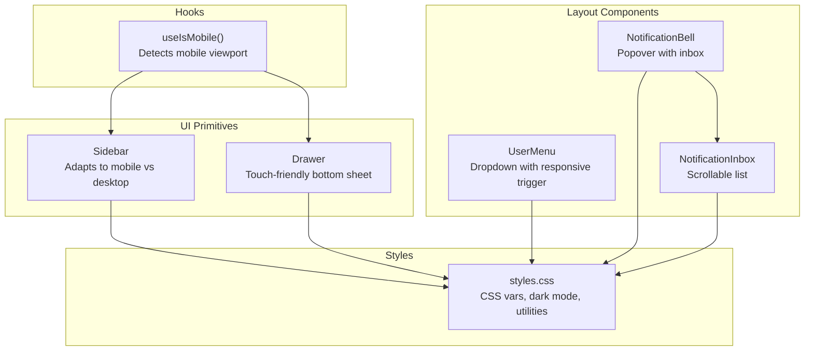
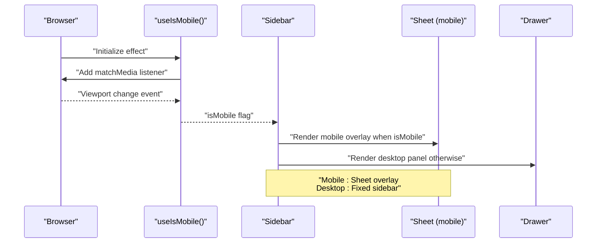
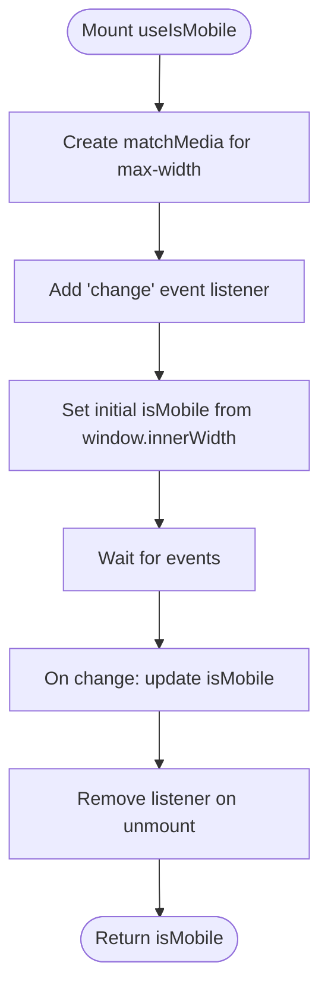
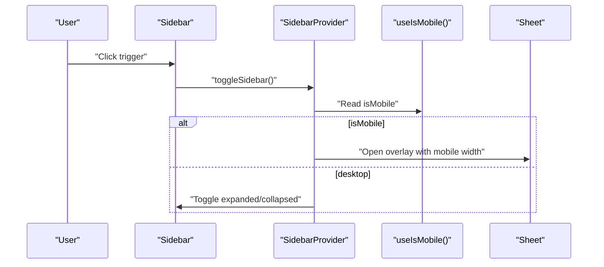
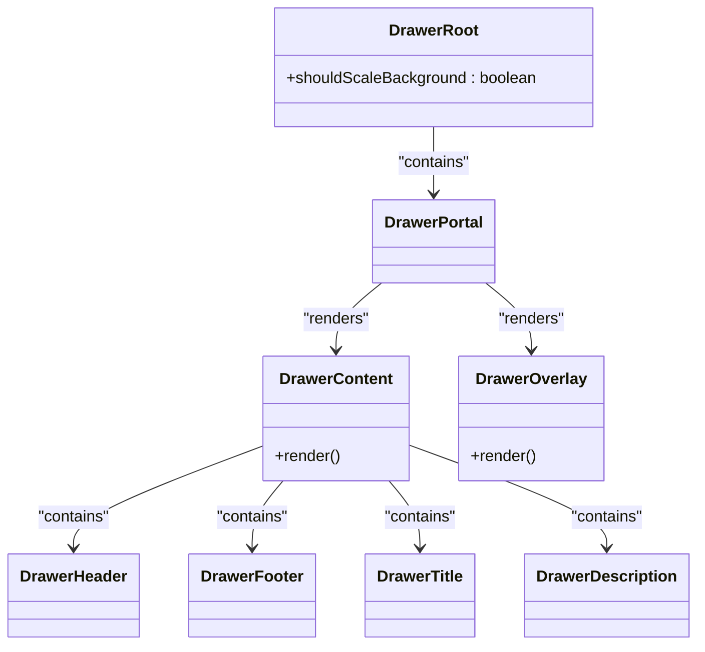
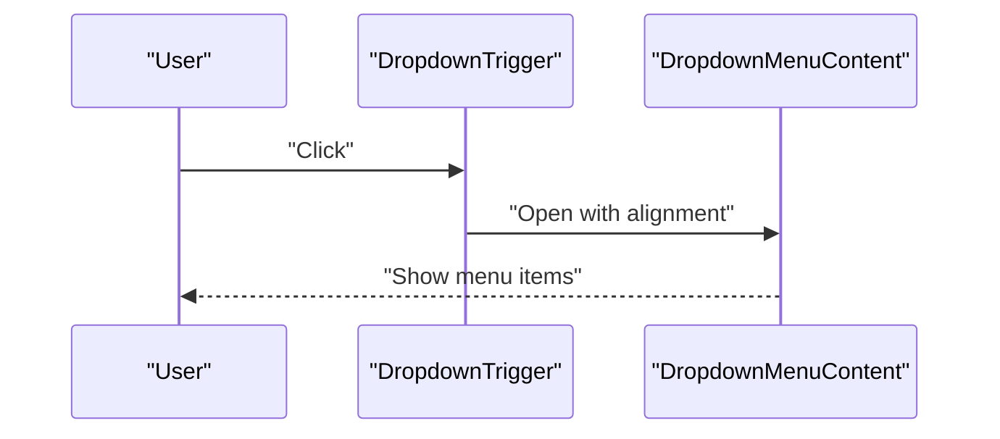
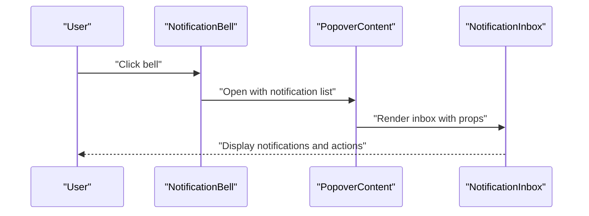
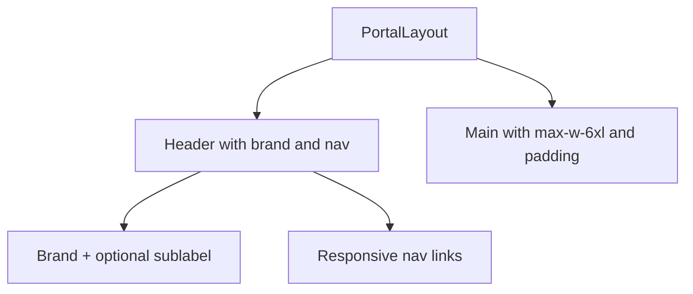
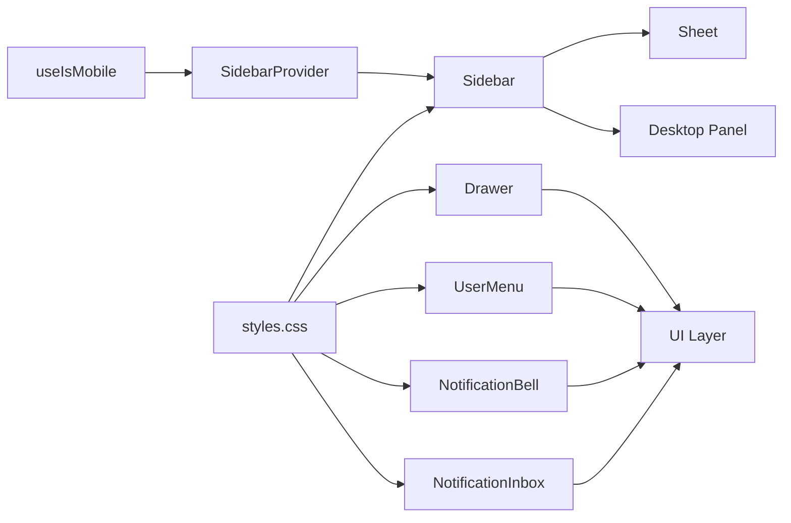

# Responsive Design Patterns

<cite>
**Referenced Files in This Document**
- [use-mobile.tsx](file://src/hooks/use-mobile.tsx)
- [styles.css](file://src/styles.css)
- [sidebar.tsx](file://src/components/ui/sidebar.tsx)
- [drawer.tsx](file://src/components/ui/drawer.tsx)
- [UserMenu.tsx](file://src/components/layout/UserMenu.tsx)
- [NotificationBell.tsx](file://src/components/layout/NotificationBell.tsx)
- [NotificationInbox.tsx](file://src/components/layout/NotificationInbox.tsx)
- [PortalLayout.tsx](file://src/components/portal/PortalLayout.tsx)
</cite>

## Table of Contents
1. [Introduction](#introduction)
2. [Project Structure](#project-structure)
3. [Core Components](#core-components)
4. [Architecture Overview](#architecture-overview)
5. [Detailed Component Analysis](#detailed-component-analysis)
6. [Dependency Analysis](#dependency-analysis)
7. [Performance Considerations](#performance-considerations)
8. [Troubleshooting Guide](#troubleshooting-guide)
9. [Conclusion](#conclusion)
10. [Appendices](#appendices)

## Introduction
This document explains the responsive design patterns and mobile-first approach implemented in the project. It focuses on:
- The use-mobile hook for runtime device detection and dynamic UI adaptation
- Breakpoints, layout systems, and component-level responsive behavior
- Mobile navigation patterns, touch-friendly interactions, and gesture support
- Accessibility-aligned responsive design
- Performance considerations for mobile devices
- Cross-platform and browser-specific behaviors
- Practical testing guidelines for consistent experiences across devices

## Project Structure
The responsive system centers around a lightweight device detection hook and UI primitives that adapt to screen size and interaction mode. Styles leverage CSS custom properties and Tailwind utilities to maintain a consistent design language across breakpoints.

**Diagram sources**
- [use-mobile.tsx:1-20](file://src/hooks/use-mobile.tsx#L1-L20)
- [sidebar.tsx:1-745](file://src/components/ui/sidebar.tsx#L1-L745)
- [drawer.tsx:1-99](file://src/components/ui/drawer.tsx#L1-L99)
- [UserMenu.tsx:1-101](file://src/components/layout/UserMenu.tsx#L1-L101)
- [NotificationBell.tsx:1-141](file://src/components/layout/NotificationBell.tsx#L1-L141)
- [NotificationInbox.tsx:1-107](file://src/components/layout/NotificationInbox.tsx#L1-L107)
- [styles.css:1-461](file://src/styles.css#L1-L461)

**Section sources**
- [use-mobile.tsx:1-20](file://src/hooks/use-mobile.tsx#L1-L20)
- [styles.css:1-461](file://src/styles.css#L1-L461)

## Core Components
- Device detection hook: Provides a boolean flag indicating whether the current viewport qualifies as mobile, enabling conditional rendering and behavior changes.
- Layout primitives: Sidebar adapts to mobile via a Sheet overlay; Drawer offers a touch-friendly bottom sheet pattern.
- Navigation and notifications: User menu and notification bell/inbox components adjust spacing, triggers, and content density for smaller screens.
- Styles: CSS custom properties and Tailwind utilities define consistent spacing, typography, and dark mode behavior.

**Section sources**
- [use-mobile.tsx:1-20](file://src/hooks/use-mobile.tsx#L1-L20)
- [sidebar.tsx:1-745](file://src/components/ui/sidebar.tsx#L1-L745)
- [drawer.tsx:1-99](file://src/components/ui/drawer.tsx#L1-L99)
- [UserMenu.tsx:1-101](file://src/components/layout/UserMenu.tsx#L1-L101)
- [NotificationBell.tsx:1-141](file://src/components/layout/NotificationBell.tsx#L1-L141)
- [NotificationInbox.tsx:1-107](file://src/components/layout/NotificationInbox.tsx#L1-L107)
- [styles.css:1-461](file://src/styles.css#L1-L461)

## Architecture Overview
The responsive architecture follows a mobile-first strategy:
- A single source of truth for device state (useIsMobile) informs UI decisions
- Desktop and mobile views are explicitly differentiated in layout components
- Touch-friendly affordances (larger hit areas, gestures) are applied on mobile
- Accessibility is maintained through semantic markup, focus management, and ARIA attributes

**Diagram sources**
- [use-mobile.tsx:1-20](file://src/hooks/use-mobile.tsx#L1-L20)
- [sidebar.tsx:189-211](file://src/components/ui/sidebar.tsx#L189-L211)
- [drawer.tsx:1-99](file://src/components/ui/drawer.tsx#L1-L99)

## Detailed Component Analysis

### Device Detection Hook: useIsMobile
- Purpose: Detects mobile viewport and updates on resize/matchMedia events
- Behavior: Returns a boolean suitable for conditional rendering and logic branching
- Implementation highlights:
  - Uses a fixed breakpoint constant
  - Subscribes to media query change events
  - Initializes state based on current innerWidth

**Diagram sources**
- [use-mobile.tsx:5-19](file://src/hooks/use-mobile.tsx#L5-L19)

**Section sources**
- [use-mobile.tsx:1-20](file://src/hooks/use-mobile.tsx#L1-L20)

### Sidebar: Adaptive Navigation
- Mobile adaptation:
  - Uses a Sheet overlay when isMobile is true
  - Applies a dedicated mobile width constant
  - Hides close buttons inside the overlay for cleaner UX
- Desktop adaptation:
  - Renders a fixed panel with collapsible variants
  - Supports left/right positioning and inset/floating variants
  - Uses CSS custom properties for widths and transitions
- Interaction:
  - Keyboard shortcut toggles the sidebar
  - Cookie persists expanded/collapsed state

**Diagram sources**
- [sidebar.tsx:69-94](file://src/components/ui/sidebar.tsx#L69-L94)
- [sidebar.tsx:189-211](file://src/components/ui/sidebar.tsx#L189-L211)

**Section sources**
- [sidebar.tsx:1-745](file://src/components/ui/sidebar.tsx#L1-L745)

### Drawer: Touch-Friendly Bottom Sheet
- Pattern: Bottom sheet overlay with backdrop scaling
- Structure: Root, Portal, Overlay, Content, Header/Footer, Title/Description
- Usage: Ideal for mobile filters, actions, and secondary navigation

**Diagram sources**
- [drawer.tsx:6-99](file://src/components/ui/drawer.tsx#L6-L99)

**Section sources**
- [drawer.tsx:1-99](file://src/components/ui/drawer.tsx#L1-L99)

### User Menu: Responsive Dropdown Trigger
- Uses a DropdownMenu with a trigger styled for compact horizontal layout
- Avatar fallback supports both image and initials
- Role label and name truncate appropriately on small screens

**Diagram sources**
- [UserMenu.tsx:20-69](file://src/components/layout/UserMenu.tsx#L20-L69)

**Section sources**
- [UserMenu.tsx:1-101](file://src/components/layout/UserMenu.tsx#L1-L101)

### Notification Bell and Inbox: Adaptive Popover
- NotificationBell:
  - Popover trigger with unread badge
  - Loads notifications and unread counts via server functions
  - Real-time updates via Supabase channel
- NotificationInbox:
  - Scrollable list with relative timestamps
  - Mark-as-read per item and bulk mark-all-read
  - View-all navigation action

**Diagram sources**
- [NotificationBell.tsx:19-141](file://src/components/layout/NotificationBell.tsx#L19-L141)
- [NotificationInbox.tsx:13-107](file://src/components/layout/NotificationInbox.tsx#L13-L107)

**Section sources**
- [NotificationBell.tsx:1-141](file://src/components/layout/NotificationBell.tsx#L1-L141)
- [NotificationInbox.tsx:1-107](file://src/components/layout/NotificationInbox.tsx#L1-L107)

### Portal Layout: Minimal Responsive Container
- Header with brand and navigation links
- Uses responsive spacing and hides subheading on small screens
- Main content constrained to a max width with padding

**Diagram sources**
- [PortalLayout.tsx:5-36](file://src/components/portal/PortalLayout.tsx#L5-L36)

**Section sources**
- [PortalLayout.tsx:1-36](file://src/components/portal/PortalLayout.tsx#L1-L36)

## Dependency Analysis
- useIsMobile is consumed by SidebarProvider to decide between Sheet and fixed sidebar
- Drawer is a standalone primitive used for mobile overlays
- UserMenu and Notification components rely on UI primitives and Tailwind utilities
- styles.css defines CSS variables and dark mode variants used across components

**Diagram sources**
- [use-mobile.tsx:1-20](file://src/hooks/use-mobile.tsx#L1-L20)
- [sidebar.tsx:1-745](file://src/components/ui/sidebar.tsx#L1-L745)
- [drawer.tsx:1-99](file://src/components/ui/drawer.tsx#L1-L99)
- [UserMenu.tsx:1-101](file://src/components/layout/UserMenu.tsx#L1-L101)
- [NotificationBell.tsx:1-141](file://src/components/layout/NotificationBell.tsx#L1-L141)
- [NotificationInbox.tsx:1-107](file://src/components/layout/NotificationInbox.tsx#L1-L107)
- [styles.css:1-461](file://src/styles.css#L1-L461)

**Section sources**
- [use-mobile.tsx:1-20](file://src/hooks/use-mobile.tsx#L1-L20)
- [sidebar.tsx:1-745](file://src/components/ui/sidebar.tsx#L1-L745)
- [drawer.tsx:1-99](file://src/components/ui/drawer.tsx#L1-L99)
- [styles.css:1-461](file://src/styles.css#L1-L461)

## Performance Considerations
- Bundle size optimization
  - Prefer tree-shaking and modular imports for UI components
  - Lazy-load heavy components or routes when appropriate
  - Minimize CSS and JS payloads; leverage CSS custom properties to reduce duplication
- Rendering performance
  - Memoize derived values (e.g., computed widths) and avoid unnecessary re-renders
  - Use virtualization for long lists in popovers or drawers
- Mobile-specific optimizations
  - Reduce layout thrashing by batching DOM reads/writes
  - Use passive event listeners for scroll and touch interactions
  - Avoid expensive animations on low-end devices
- Network and hydration
  - Defer non-critical resources until after hydration
  - Use efficient polling or real-time channels with backoff strategies

## Troubleshooting Guide
- Sidebar does not open on mobile
  - Verify useIsMobile returns true for the current viewport
  - Confirm Sheet overlay is rendered and not blocked by z-index
- Popover/overlay overlaps content unexpectedly
  - Ensure proper placement and container stacking contexts
  - Check for global CSS overrides affecting positioning
- Notifications not updating in real-time
  - Validate Supabase channel subscription and user context
  - Inspect server functions for error responses
- Accessibility issues
  - Ensure focus trapping and escape-to-close behavior in overlays
  - Provide visible focus indicators and keyboard navigation support
  - Use semantic roles and ARIA attributes where applicable

## Conclusion
The project adopts a pragmatic mobile-first responsive strategy centered on a simple device detection hook and adaptable UI primitives. Components differentiate mobile and desktop experiences while maintaining a consistent design system through CSS custom properties and Tailwind utilities. Accessibility and performance are addressed through thoughtful component composition, gesture-friendly interactions, and structured state management.

## Appendices

### Responsive Breakpoints and Grid Systems
- Breakpoint strategy
  - Mobile detection uses a fixed threshold; desktop/desktop-like behavior applies when the viewport exceeds this threshold
  - No explicit CSS media queries are present in the analyzed files; responsiveness is driven by component logic and CSS custom properties
- Grid and spacing
  - Components use Tailwind utilities for padding, margins, and max widths
  - CSS custom properties define consistent spacing and typography scales

**Section sources**
- [use-mobile.tsx:3](file://src/hooks/use-mobile.tsx#L3)
- [styles.css:7-55](file://src/styles.css#L7-L55)
- [PortalLayout.tsx:28](file://src/components/portal/PortalLayout.tsx#L28)

### Mobile Navigation Patterns and Touch Interactions
- Sheet-based mobile navigation
  - Sidebar switches to a Sheet overlay on mobile, with a dedicated width constant
  - Overlay hides close buttons to reduce clutter
- Touch-friendly affordances
  - Increased hit areas for interactive elements (e.g., menu actions)
  - Gesture-enabled drawer for bottom-sheet interactions
- Orientation handling
  - MatchMedia listener ensures UI adapts during orientation changes

**Section sources**
- [sidebar.tsx:189-211](file://src/components/ui/sidebar.tsx#L189-L211)
- [sidebar.tsx:456-460](file://src/components/ui/sidebar.tsx#L456-L460)
- [drawer.tsx:32-51](file://src/components/ui/drawer.tsx#L32-L51)

### Accessibility and Responsive Design
- Semantic markup and roles
  - Popovers and sheets include accessible headers and descriptions
  - Tooltips and triggers use appropriate ARIA attributes
- Focus management
  - Keyboard shortcuts and focus traps improve navigation for assistive technologies
- Color and contrast
  - Dark mode variants and color tokens ensure readability across themes

**Section sources**
- [sidebar.tsx:203-206](file://src/components/ui/sidebar.tsx#L203-L206)
- [styles.css:91-118](file://src/styles.css#L91-L118)

### Cross-Platform Compatibility and Browser Behaviors
- Feature detection
  - MatchMedia is used for responsive logic; ensure fallbacks for older browsers
- Overlay and gesture libraries
  - Drawer relies on vaul; verify polyfills if targeting legacy environments
- CSS custom properties
  - Prefer widely supported property names and provide sensible defaults

**Section sources**
- [use-mobile.tsx:8-16](file://src/hooks/use-mobile.tsx#L8-L16)
- [drawer.tsx:1-12](file://src/components/ui/drawer.tsx#L1-L12)

### Testing Guidelines
- Device emulation
  - Test on representative devices and emulate portrait/landscape changes
- Interaction coverage
  - Validate click targets, swipe gestures, and keyboard navigation
- Performance checks
  - Measure TTI and frame drops on lower-end devices
- Accessibility audits
  - Run automated checks and manual verification for focus order and ARIA usage