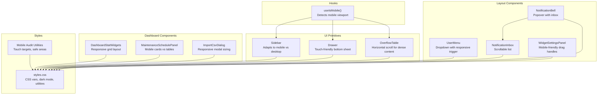
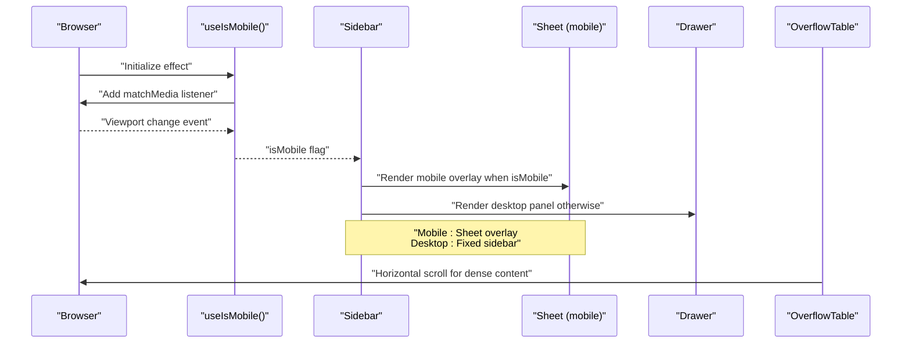
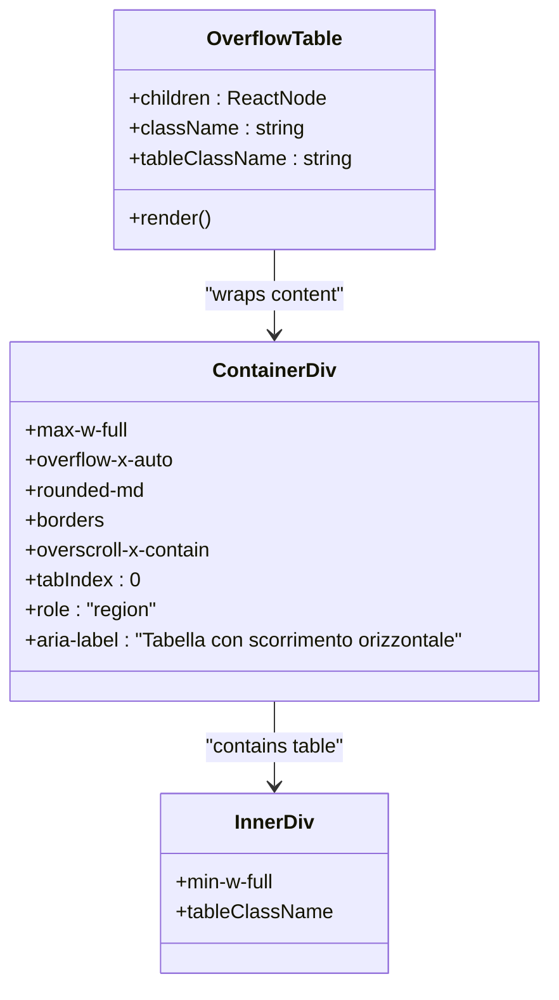
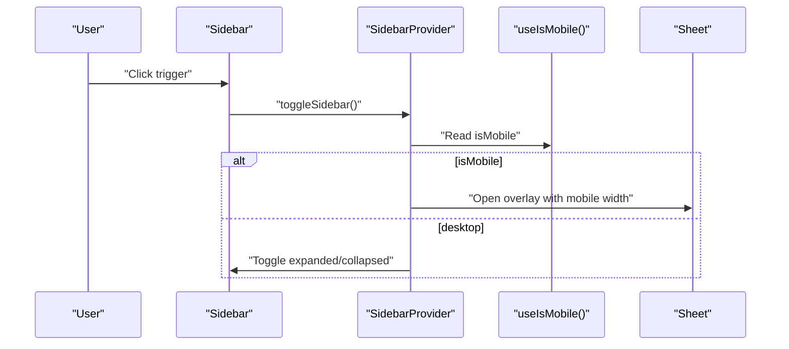
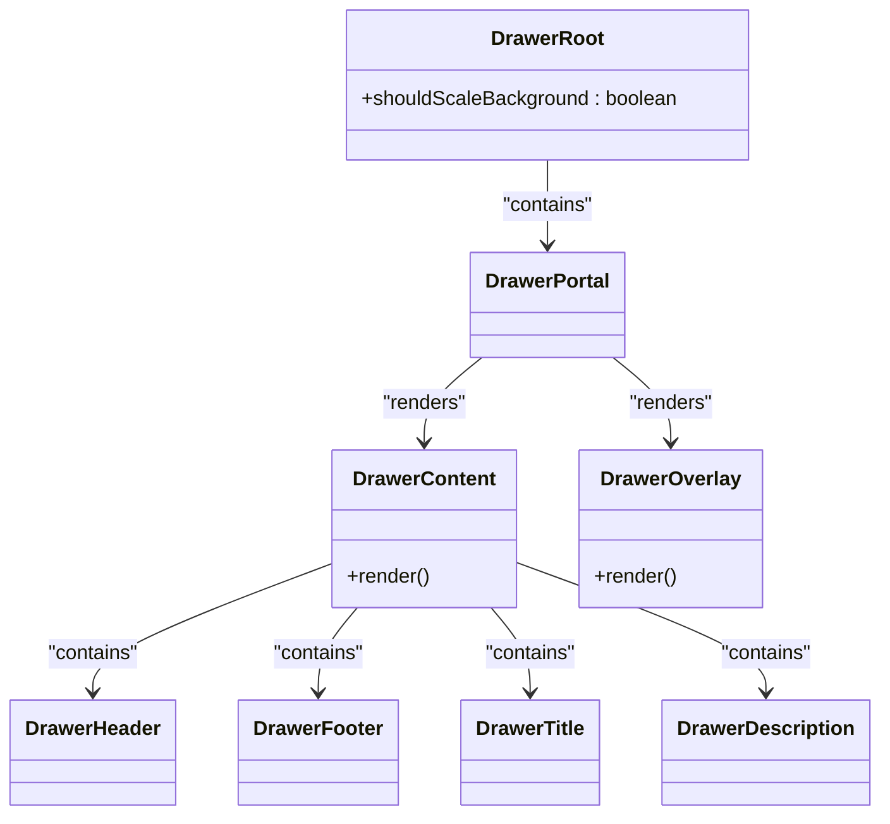
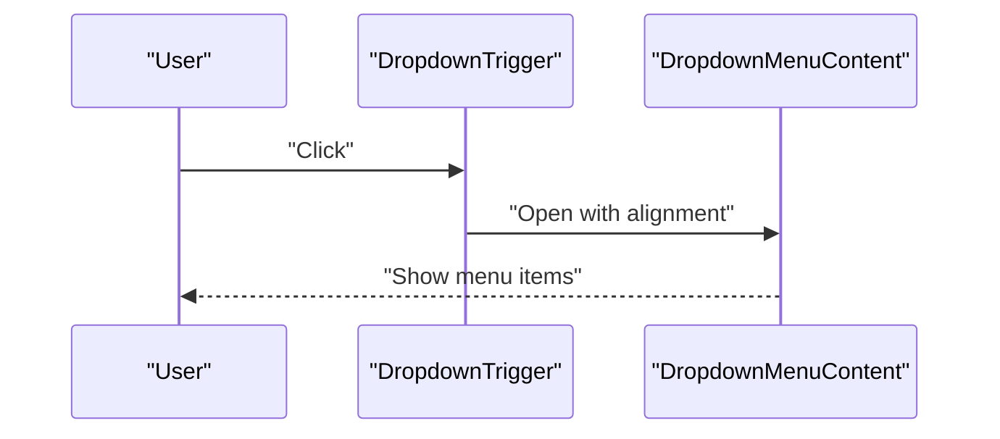
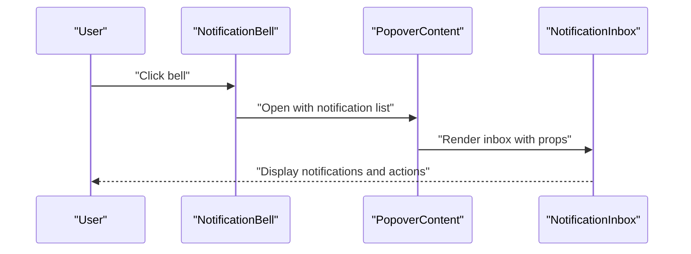
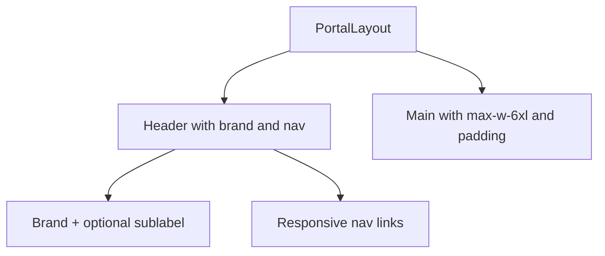
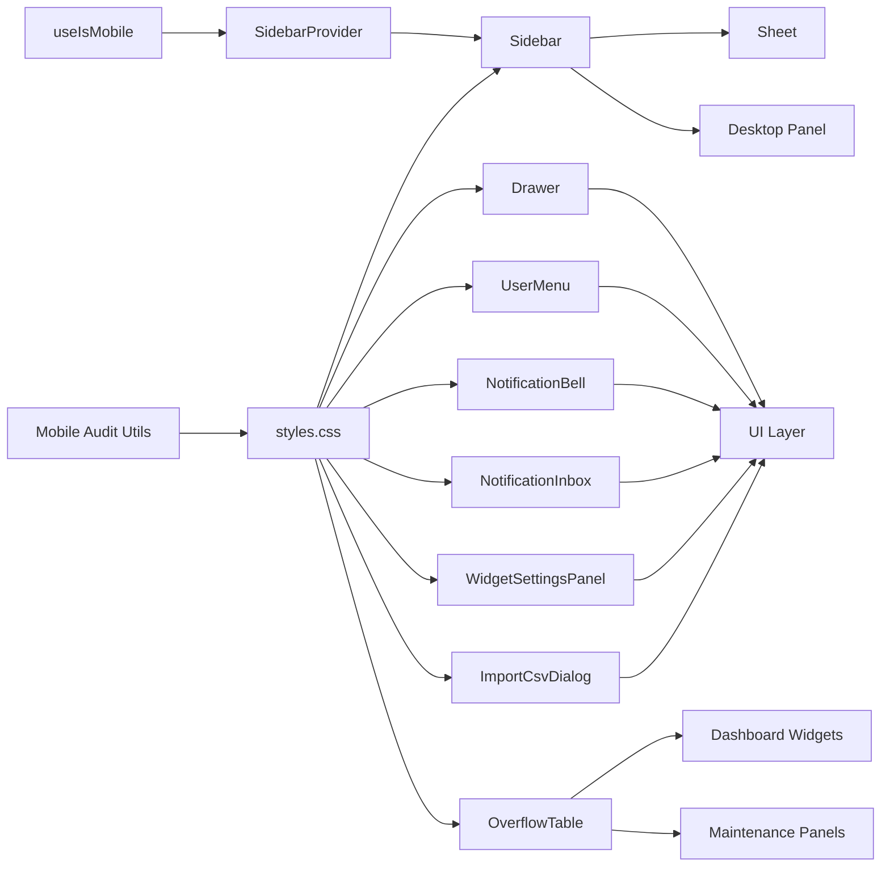

# Responsive Design Patterns

<cite>
**Referenced Files in This Document**
- [use-mobile.tsx](file://src/hooks/use-mobile.tsx)
- [styles.css](file://src/styles.css)
- [sidebar.tsx](file://src/components/ui/sidebar.tsx)
- [drawer.tsx](file://src/components/ui/drawer.tsx)
- [UserMenu.tsx](file://src/components/layout/UserMenu.tsx)
- [NotificationBell.tsx](file://src/components/layout/NotificationBell.tsx)
- [NotificationInbox.tsx](file://src/components/layout/NotificationInbox.tsx)
- [PortalLayout.tsx](file://src/components/portal/PortalLayout.tsx)
- [overflow-table.tsx](file://src/components/ui/overflow-table.tsx)
- [mobile-audit.md](file://docs/mobile-audit.md)
- [WidgetSettingsPanel.tsx](file://src/components/dashboard/WidgetSettingsPanel.tsx)
- [DashboardStatWidgets.tsx](file://src/components/dashboard/DashboardStatWidgets.tsx)
- [ImportCsvDialog.tsx](file://src/components/inventory/ImportCsvDialog.tsx)
- [MaintenanceSchedulePanel.tsx](file://src/components/inventory/MaintenanceSchedulePanel.tsx)
- [table.tsx](file://src/components/ui/table.tsx)
</cite>

## Update Summary

**Changes Made**

- Added comprehensive documentation for the new OverflowTable component and its role in mobile-responsive table design
- Enhanced mobile audit documentation covering touch targets, horizontal overflow issues, and systematic responsive improvements
- Updated dashboard widget responsive behavior with mobile-first grid adaptations
- Documented import dialog responsive improvements and maintenance panel mobile adaptations
- Expanded mobile primitives documentation including touch targets, safe areas, and overflow utilities

## Table of Contents

1. [Introduction](#introduction)
2. [Project Structure](#project-structure)
3. [Core Components](#core-components)
4. [Architecture Overview](#architecture-overview)
5. [Detailed Component Analysis](#detailed-component-analysis)
6. [Mobile Audit and Responsive Improvements](#mobile-audit-and-responsive-improvements)
7. [Dependency Analysis](#dependency-analysis)
8. [Performance Considerations](#performance-considerations)
9. [Troubleshooting Guide](#troubleshooting-guide)
10. [Conclusion](#conclusion)
11. [Appendices](#appendices)

## Introduction

This document explains the responsive design patterns and mobile-first approach implemented in the project. It focuses on:

- The use-mobile hook for runtime device detection and dynamic UI adaptation
- Breakpoints, layout systems, and component-level responsive behavior
- Mobile navigation patterns, touch-friendly interactions, and gesture support
- Accessibility-aligned responsive design
- Performance considerations for mobile devices
- Cross-platform and browser-specific behaviors
- Comprehensive mobile audit findings and systematic responsive improvements

## Project Structure

The responsive system centers around a lightweight device detection hook and UI primitives that adapt to screen size and interaction mode. Recent enhancements include the new OverflowTable component for handling dense content on mobile devices and systematic improvements across dashboard widgets, import dialogs, and maintenance panels.

**Diagram sources**

- [use-mobile.tsx:1-20](file://src/hooks/use-mobile.tsx#L1-L20)
- [sidebar.tsx:1-745](file://src/components/ui/sidebar.tsx#L1-L745)
- [drawer.tsx:1-99](file://src/components/ui/drawer.tsx#L1-L99)
- [overflow-table.tsx:1-24](file://src/components/ui/overflow-table.tsx#L1-L24)
- [WidgetSettingsPanel.tsx:45-146](file://src/components/dashboard/WidgetSettingsPanel.tsx#L45-L146)
- [DashboardStatWidgets.tsx:1-266](file://src/components/dashboard/DashboardStatWidgets.tsx#L1-L266)
- [ImportCsvDialog.tsx:98-139](file://src/components/inventory/ImportCsvDialog.tsx#L98-L139)
- [MaintenanceSchedulePanel.tsx:36-151](file://src/components/inventory/MaintenanceSchedulePanel.tsx#L36-L151)
- [styles.css:410-697](file://src/styles.css#L410-L697)
- [mobile-audit.md:1-98](file://docs/mobile-audit.md#L1-L98)

**Section sources**

- [use-mobile.tsx:1-20](file://src/hooks/use-mobile.tsx#L1-L20)
- [styles.css:410-697](file://src/styles.css#L410-L697)

## Core Components

- Device detection hook: Provides a boolean flag indicating whether the current viewport qualifies as mobile, enabling conditional rendering and behavior changes.
- Layout primitives: Sidebar adapts to mobile via a Sheet overlay; Drawer offers a touch-friendly bottom sheet pattern.
- Dense content handling: OverflowTable provides a focusable horizontal scroll region with touch scrolling for tables with many columns.
- Navigation and notifications: User menu and notification bell/inbox components adjust spacing, triggers, and content density for smaller screens.
- Dashboard responsiveness: Widgets adapt grid layouts based on screen size, with mobile-first approaches for statistics and maintenance overview.
- Import dialogs: Responsive modal sizing and step indicators that work across different viewport sizes.
- Maintenance panels: Mobile cards for dense schedules versus full tables on larger screens.
- Styles: CSS custom properties and Tailwind utilities define consistent spacing, typography, and dark mode behavior with mobile-specific utilities.

**Section sources**

- [use-mobile.tsx:1-20](file://src/hooks/use-mobile.tsx#L1-L20)
- [sidebar.tsx:1-745](file://src/components/ui/sidebar.tsx#L1-L745)
- [drawer.tsx:1-99](file://src/components/ui/drawer.tsx#L1-L99)
- [overflow-table.tsx:1-24](file://src/components/ui/overflow-table.tsx#L1-L24)
- [WidgetSettingsPanel.tsx:45-146](file://src/components/dashboard/WidgetSettingsPanel.tsx#L45-L146)
- [DashboardStatWidgets.tsx:1-266](file://src/components/dashboard/DashboardStatWidgets.tsx#L1-L266)
- [ImportCsvDialog.tsx:98-139](file://src/components/inventory/ImportCsvDialog.tsx#L98-L139)
- [MaintenanceSchedulePanel.tsx:36-151](file://src/components/inventory/MaintenanceSchedulePanel.tsx#L36-L151)
- [styles.css:410-697](file://src/styles.css#L410-L697)

## Architecture Overview

The responsive architecture follows a mobile-first strategy with recent enhancements for handling dense content and systematic improvements across core application areas:

- A single source of truth for device state (useIsMobile) informs UI decisions
- Desktop and mobile views are explicitly differentiated in layout components
- Touch-friendly affordances (larger hit areas, gestures) are applied on mobile
- OverflowTable component specifically addresses horizontal overflow issues in dense tables
- Accessibility is maintained through semantic markup, focus management, and ARIA attributes
- Mobile audit documentation guides systematic improvements across the application

**Diagram sources**

- [use-mobile.tsx:1-20](file://src/hooks/use-mobile.tsx#L1-L20)
- [sidebar.tsx:189-211](file://src/components/ui/sidebar.tsx#L189-L211)
- [drawer.tsx:1-99](file://src/components/ui/drawer.tsx#L1-L99)
- [overflow-table.tsx:9-24](file://src/components/ui/overflow-table.tsx#L9-L24)

## Detailed Component Analysis

### Device Detection Hook: useIsMobile

- Purpose: Detects mobile viewport and updates on resize/matchMedia events
- Behavior: Returns a boolean suitable for conditional rendering and logic branching
- Implementation highlights:
  - Uses a fixed breakpoint constant (960px)
  - Subscribes to media query change events
  - Initializes state based on current innerWidth

**Diagram sources**

- [use-mobile.tsx:5-19](file://src/hooks/use-mobile.tsx#L5-L19)

**Section sources**

- [use-mobile.tsx:1-20](file://src/hooks/use-mobile.tsx#L1-L20)

### OverflowTable: Horizontal Scroll Component

- Purpose: Provides a focusable horizontal scroll region for tables with many columns
- Key features:
  - Max-width containment with overflow-x-auto
  - Focusable div with tabindex for accessibility
  - ARIA labeling for screen readers
  - Overscroll containment for smooth scrolling
  - Min-width constraint for table content
- Usage: Ideal for maintenance schedules, inventory tables, and any dense tabular data that needs horizontal scrolling on mobile

**Diagram sources**

- [overflow-table.tsx:9-24](file://src/components/ui/overflow-table.tsx#L9-L24)

**Section sources**

- [overflow-table.tsx:1-24](file://src/components/ui/overflow-table.tsx#L1-L24)

### Sidebar: Adaptive Navigation

- Mobile adaptation:
  - Uses a Sheet overlay when isMobile is true
  - Applies a dedicated mobile width constant
  - Hides close buttons inside the overlay for cleaner UX
- Desktop adaptation:
  - Renders a fixed panel with collapsible variants
  - Supports left/right positioning and inset/floating variants
  - Uses CSS custom properties for widths and transitions
- Interaction:
  - Keyboard shortcut toggles the sidebar
  - Cookie persists expanded/collapsed state

**Diagram sources**

- [sidebar.tsx:69-94](file://src/components/ui/sidebar.tsx#L69-L94)
- [sidebar.tsx:189-211](file://src/components/ui/sidebar.tsx#L189-L211)

**Section sources**

- [sidebar.tsx:1-745](file://src/components/ui/sidebar.tsx#L1-L745)

### Drawer: Touch-Friendly Bottom Sheet

- Pattern: Bottom sheet overlay with backdrop scaling
- Structure: Root, Portal, Overlay, Content, Header/Footer, Title/Description
- Usage: Ideal for mobile filters, actions, and secondary navigation

**Diagram sources**

- [drawer.tsx:6-99](file://src/components/ui/drawer.tsx#L6-L99)

**Section sources**

- [drawer.tsx:1-99](file://src/components/ui/drawer.tsx#L1-L99)

### User Menu: Responsive Dropdown Trigger

- Uses a DropdownMenu with a trigger styled for compact horizontal layout
- Avatar fallback supports both image and initials
- Role label and name truncate appropriately on small screens

**Diagram sources**

- [UserMenu.tsx:20-69](file://src/components/layout/UserMenu.tsx#L20-L69)

**Section sources**

- [UserMenu.tsx:1-101](file://src/components/layout/UserMenu.tsx#L1-L101)

### Notification Bell and Inbox: Adaptive Popover

- NotificationBell:
  - Popover trigger with unread badge
  - Loads notifications and unread counts via server functions
  - Real-time updates via Supabase channel
- NotificationInbox:
  - Scrollable list with relative timestamps
  - Mark-as-read per item and bulk mark-all-read
  - View-all navigation action

**Diagram sources**

- [NotificationBell.tsx:19-141](file://src/components/layout/NotificationBell.tsx#L19-L141)
- [NotificationInbox.tsx:13-107](file://src/components/layout/NotificationInbox.tsx#L13-L107)

**Section sources**

- [NotificationBell.tsx:1-141](file://src/components/layout/NotificationBell.tsx#L1-L141)
- [NotificationInbox.tsx:1-107](file://src/components/layout/NotificationInbox.tsx#L1-L107)

### Portal Layout: Minimal Responsive Container

- Header with brand and navigation links
- Uses responsive spacing and hides subheading on small screens
- Main content constrained to a max width with padding

**Diagram sources**

- [PortalLayout.tsx:5-36](file://src/components/portal/PortalLayout.tsx#L5-L36)

**Section sources**

- [PortalLayout.tsx:1-36](file://src/components/portal/PortalLayout.tsx#L1-L36)

### Dashboard Widgets: Mobile-First Responsive Design

- Grid adaptations:
  - Statistics cards use responsive grid: 1 column on phones, 2 on tablets, 4 on desktops
  - Widget settings panel uses mobile-friendly drag handles with touch targets
- Content handling:
  - Long labels and values use break-anywhere utilities to prevent overflow
  - Hover states and interactive elements adapted for touch interfaces
- Maintenance overview:
  - Uses OverflowTable for horizontal scrolling on small screens
  - Maintains full table layout on larger screens

**Section sources**

- [DashboardStatWidgets.tsx:328-361](file://src/components/dashboard/DashboardStatWidgets.tsx#L328-L361)
- [WidgetSettingsPanel.tsx:54-74](file://src/components/dashboard/WidgetSettingsPanel.tsx#L54-L74)
- [dashboard.tsx:1012-1076](file://src/routes/_app/dashboard.tsx#L1012-L1076)

### Import Dialogs: Responsive Modal Sizing

- Responsive modal behavior:
  - Modals become full-screen on mobile viewports
  - Step indicators adapt to available space
  - Footer buttons maintain touch targets across devices
- ImportCsvDialog:
  - Grid-based step indicators that compress on smaller screens
  - Responsive file upload area with clear visual feedback

**Section sources**

- [ImportCsvDialog.tsx:98-139](file://src/components/inventory/ImportCsvDialog.tsx#L98-L139)
- [clients.tsx:1822-1838](file://src/routes/_app/clients.tsx#L1822-L1838)

### Maintenance Panels: Adaptive Content Presentation

- Mobile adaptation:
  - Switch between card-based and table-based layouts based on viewport
  - Use OverflowTable for horizontal scrolling when needed
  - Maintain touch-friendly controls and spacing
- Desktop preservation:
  - Full table layouts with all columns visible
  - Advanced filtering and sorting capabilities

**Section sources**

- [MaintenanceSchedulePanel.tsx:137-151](file://src/components/inventory/MaintenanceSchedulePanel.tsx#L137-L151)
- [dashboard.tsx:1004-1098](file://src/routes/_app/dashboard.tsx#L1004-L1098)

## Mobile Audit and Responsive Improvements

### Comprehensive Mobile Audit Findings

The recent mobile audit identified and addressed critical responsive issues across the application:

**Blocking issues addressed:**

- Desktop header CTAs consuming too much mobile width
- Main content inheriting desktop padding causing cramped layouts
- Custom modals not becoming full-screen on 320-390 px viewports
- Dialog and alert dialog content exceeding viewport height
- Inventory table having too many columns for phones
- Dashboard stat grid using two columns on the smallest phones

**Medium issues addressed:**

- Touch targets on buttons/icon controls being too small
- Tabs overflowing with many visible labels
- Dashboard widget settings drawer having small drag/visibility controls
- Dense dashboard tables lacking explicit minimum table widths

**Cosmetic issues addressed:**

- Long stat values and labels overflowing cards
- Mobile card/table containers lacking consistent `min-w-0` and word breaking

### Systematic Responsive Improvements

**Shared responsive primitives:**

- App shell now uses `min-h-dvh`, `overflow-x-hidden`, mobile padding, and truncating page title
- Mobile header hides desktop CTAs and exposes single icon CTA for new tickets
- Navigation links meet 44px touch target requirement
- Buttons, small buttons, icon buttons, and inputs have mobile-friendly minimum sizes
- Inputs use 16px font size on mobile to avoid iOS zoom
- Added `break-anywhere`, safe-area, and touch scroll utilities

**Overlays:**

- Custom modals become full-screen on mobile and constrained on desktop
- Dialogs are full-screen/scrollable on mobile and centered on desktop
- Alert dialogs use inset and scrollable behavior on mobile
- Sheet components have touch-friendly close targets

**Dense content:**

- OverflowTable component provides focusable horizontal scroll regions
- Tabs implement horizontal scrolling on small screens
- Dashboard stat cards collapse to one column on phones
- Inventory uses mobile cards below `md` while keeping full tables for tablet/desktop

**Section sources**

- [mobile-audit.md:17-98](file://docs/mobile-audit.md#L17-L98)
- [styles.css:410-697](file://src/styles.css#L410-L697)

## Dependency Analysis

- useIsMobile is consumed by SidebarProvider to decide between Sheet and fixed sidebar
- OverflowTable is used within dashboard widgets and maintenance panels for dense content
- Mobile audit utilities influence styling across all components
- Drawer is a standalone primitive used for mobile overlays
- UserMenu and Notification components rely on UI primitives and Tailwind utilities
- styles.css defines CSS variables and dark mode variants used across components

**Diagram sources**

- [use-mobile.tsx:1-20](file://src/hooks/use-mobile.tsx#L1-L20)
- [sidebar.tsx:1-745](file://src/components/ui/sidebar.tsx#L1-L745)
- [drawer.tsx:1-99](file://src/components/ui/drawer.tsx#L1-L99)
- [overflow-table.tsx:1-24](file://src/components/ui/overflow-table.tsx#L1-L24)
- [WidgetSettingsPanel.tsx:1-146](file://src/components/dashboard/WidgetSettingsPanel.tsx#L1-L146)
- [ImportCsvDialog.tsx:1-139](file://src/components/inventory/ImportCsvDialog.tsx#L1-L139)
- [styles.css:410-697](file://src/styles.css#L410-L697)
- [mobile-audit.md:40-64](file://docs/mobile-audit.md#L40-L64)

**Section sources**

- [use-mobile.tsx:1-20](file://src/hooks/use-mobile.tsx#L1-L20)
- [sidebar.tsx:1-745](file://src/components/ui/sidebar.tsx#L1-L745)
- [drawer.tsx:1-99](file://src/components/ui/drawer.tsx#L1-L99)
- [overflow-table.tsx:1-24](file://src/components/ui/overflow-table.tsx#L1-L24)
- [styles.css:410-697](file://src/styles.css#L410-L697)

## Performance Considerations

- Bundle size optimization
  - Prefer tree-shaking and modular imports for UI components
  - Lazy-load heavy components or routes when appropriate
  - Minimize CSS and JS payloads; leverage CSS custom properties to reduce duplication
- Rendering performance
  - Memoize derived values (e.g., computed widths) and avoid unnecessary re-renders
  - Use virtualization for long lists in popovers or drawers
  - OverflowTable uses efficient horizontal scrolling with overscroll containment
- Mobile-specific optimizations
  - Reduce layout thrashing by batching DOM reads/writes
  - Use passive event listeners for scroll and touch interactions
  - Avoid expensive animations on low-end devices
  - Mobile audit utilities optimize for touch interactions
- Network and hydration
  - Defer non-critical resources until after hydration
  - Use efficient polling or real-time channels with backoff strategies
  - Responsive modals minimize layout shifts during viewport changes

## Troubleshooting Guide

- Sidebar does not open on mobile
  - Verify useIsMobile returns true for the current viewport
  - Confirm Sheet overlay is rendered and not blocked by z-index
- Popover/overlay overlaps content unexpectedly
  - Ensure proper placement and container stacking contexts
  - Check for global CSS overrides affecting positioning
- Notifications not updating in real-time
  - Validate Supabase channel subscription and user context
  - Inspect server functions for error responses
- OverflowTable not scrolling horizontally
  - Verify min-w-full is applied to table content
  - Check for conflicting CSS that might override overflow properties
  - Ensure tabindex is set for accessibility
- Mobile audit utilities not taking effect
  - Verify CSS custom properties are defined in :root
  - Check that utility classes are properly imported
  - Ensure mobile viewport is below the 960px breakpoint
- Widget settings panel drag handles not working
  - Confirm touch-target class is applied to draggable elements
  - Verify proper event handlers for drag interactions
  - Check that active state classes are functioning
- Import dialogs not responsive
  - Verify modal sizing classes are applied conditionally
  - Check that step indicators adapt to grid layouts
  - Ensure footer buttons maintain touch targets

## Conclusion

The project adopts a pragmatic mobile-first responsive strategy centered on a simple device detection hook and adaptable UI primitives. Recent enhancements include the new OverflowTable component for handling dense content, systematic improvements across dashboard widgets, import dialogs, and maintenance panels, along with comprehensive mobile audit documentation. Components differentiate mobile and desktop experiences while maintaining a consistent design system through CSS custom properties and Tailwind utilities. The mobile audit process ensures systematic identification and resolution of responsive issues, with accessibility and performance addressed through thoughtful component composition, gesture-friendly interactions, and structured state management.

## Appendices

### Responsive Breakpoints and Grid Systems

- Breakpoint strategy
  - Mobile detection uses a fixed 960px threshold; desktop/desktop-like behavior applies when the viewport exceeds this threshold
  - No explicit CSS media queries are present in the analyzed files; responsiveness is driven by component logic and CSS custom properties
  - Mobile audit defines target breakpoints: 320, 375, 390, 768, 1024 px for systematic testing
- Grid and spacing
  - Components use Tailwind utilities for responsive padding, margins, and grid layouts
  - Dashboard widgets use mobile-first grid: 1 column on phones, expanding to 2 on tablets, 4 on desktops
  - CSS custom properties define consistent spacing and typography scales
  - Mobile audit introduces safe-area utilities for modern mobile devices

**Section sources**

- [use-mobile.tsx:3](file://src/hooks/use-mobile.tsx#L3)
- [styles.css:410-478](file://src/styles.css#L410-L478)
- [mobile-audit.md:7](file://docs/mobile-audit.md#L7)
- [DashboardStatWidgets.tsx:328](file://src/components/dashboard/DashboardStatWidgets.tsx#L328)

### Mobile Navigation Patterns and Touch Interactions

- Sheet-based mobile navigation
  - Sidebar switches to a Sheet overlay on mobile, with a dedicated width constant
  - Overlay hides close buttons to reduce clutter
- Touch-friendly affordances
  - Increased hit areas for interactive elements (e.g., menu actions, widget drag handles)
  - Gesture-enabled drawer for bottom-sheet interactions
  - 44px touch target minimum for all interactive elements
  - Safe-area insets for modern mobile devices
- Orientation handling
  - MatchMedia listener ensures UI adapts during orientation changes
  - OverflowTable provides smooth horizontal scrolling for portrait/landscape transitions

**Section sources**

- [sidebar.tsx:189-211](file://src/components/ui/sidebar.tsx#L189-L211)
- [sidebar.tsx:456-460](file://src/components/ui/sidebar.tsx#L456-L460)
- [drawer.tsx:32-51](file://src/components/ui/drawer.tsx#L32-L51)
- [WidgetSettingsPanel.tsx:54](file://src/components/dashboard/WidgetSettingsPanel.tsx#L54)
- [mobile-audit.md:46-49](file://docs/mobile-audit.md#L46-L49)

### Accessibility and Responsive Design

- Semantic markup and roles
  - Popovers and sheets include accessible headers and descriptions
  - OverflowTable provides ARIA labeling for screen readers
  - Tooltips and triggers use appropriate ARIA attributes
- Focus management
  - Keyboard shortcuts and focus traps improve navigation for assistive technologies
  - OverflowTable is focusable with proper tabindex
  - Mobile audit ensures all interactive elements are keyboard accessible
- Color and contrast
  - Dark mode variants and color tokens ensure readability across themes
  - Touch targets maintain sufficient contrast ratios
  - Mobile audit validates accessibility compliance across breakpoints

**Section sources**

- [sidebar.tsx:203-206](file://src/components/ui/sidebar.tsx#L203-L206)
- [overflow-table.tsx:16-19](file://src/components/ui/overflow-table.tsx#L16-L19)
- [styles.css:91-118](file://src/styles.css#L91-L118)
- [mobile-audit.md:17-39](file://docs/mobile-audit.md#L17-L39)

### Cross-Platform Compatibility and Browser Behaviors

- Feature detection
  - MatchMedia is used for responsive logic; ensure fallbacks for older browsers
  - Mobile audit utilities use modern CSS features with appropriate fallbacks
- Overlay and gesture libraries
  - Drawer relies on vaul; verify polyfills if targeting legacy environments
  - OverflowTable uses native touch scrolling with webkit prefixes
- CSS custom properties
  - Prefer widely supported property names and provide sensible defaults
  - Mobile audit utilities use env() functions for safe-area handling
  - Touch scrolling optimized with -webkit-overflow-scrolling: touch

**Section sources**

- [use-mobile.tsx:8-16](file://src/hooks/use-mobile.tsx#L8-L16)
- [drawer.tsx:1-12](file://src/components/ui/drawer.tsx#L1-L12)
- [overflow-table.tsx:13](file://src/components/ui/overflow-table.tsx#L13)
- [mobile-audit.md:49-56](file://docs/mobile-audit.md#L49-L56)

### Testing Guidelines

- Device emulation
  - Test on representative devices and emulate portrait/landscape changes
  - Use mobile audit target breakpoints: 320, 375, 390, 768, 1024 px
- Interaction coverage
  - Validate click targets, swipe gestures, and keyboard navigation
  - Test OverflowTable horizontal scrolling across different viewport widths
  - Verify widget settings panel drag handles work on touch devices
- Performance checks
  - Measure TTI and frame drops on lower-end devices
  - Monitor memory usage with dense tables and multiple modals
  - Test responsive modal transitions and animations
- Accessibility audits
  - Run automated checks and manual verification for focus order and ARIA usage
  - Validate touch target sizes across all interactive elements
  - Test screen reader compatibility with OverflowTable and responsive modals
- Regression testing
  - Verify desktop behavior remains unchanged after mobile improvements
  - Test edge cases in grid layouts and responsive utilities
  - Validate mobile audit fixes across different browser engines

**Section sources**

- [mobile-audit.md:65-98](file://docs/mobile-audit.md#L65-L98)
- [overflow-table.tsx:9-24](file://src/components/ui/overflow-table.tsx#L9-L24)
- [WidgetSettingsPanel.tsx:122-146](file://src/components/dashboard/WidgetSettingsPanel.tsx#L122-L146)
