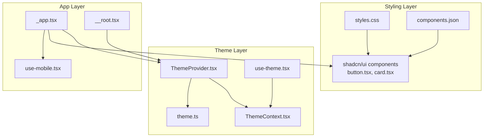
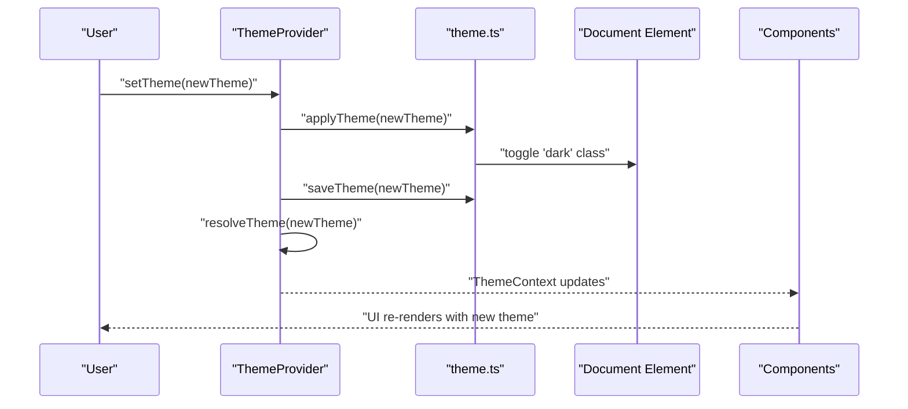
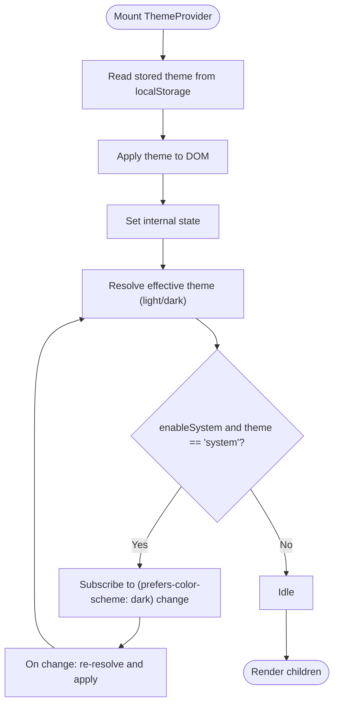
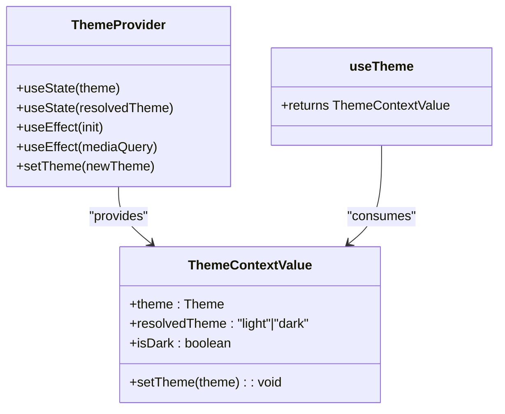
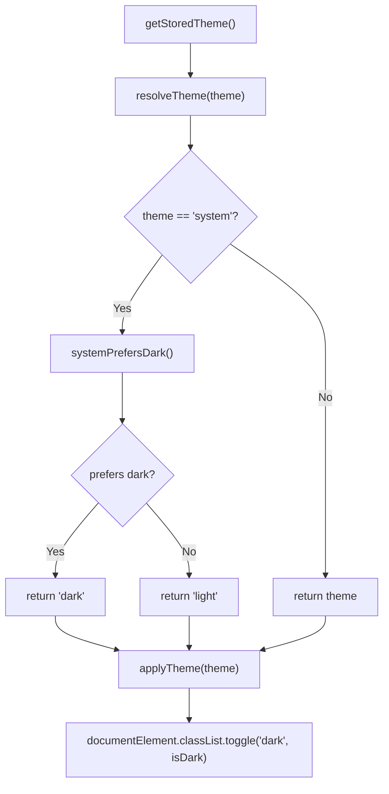
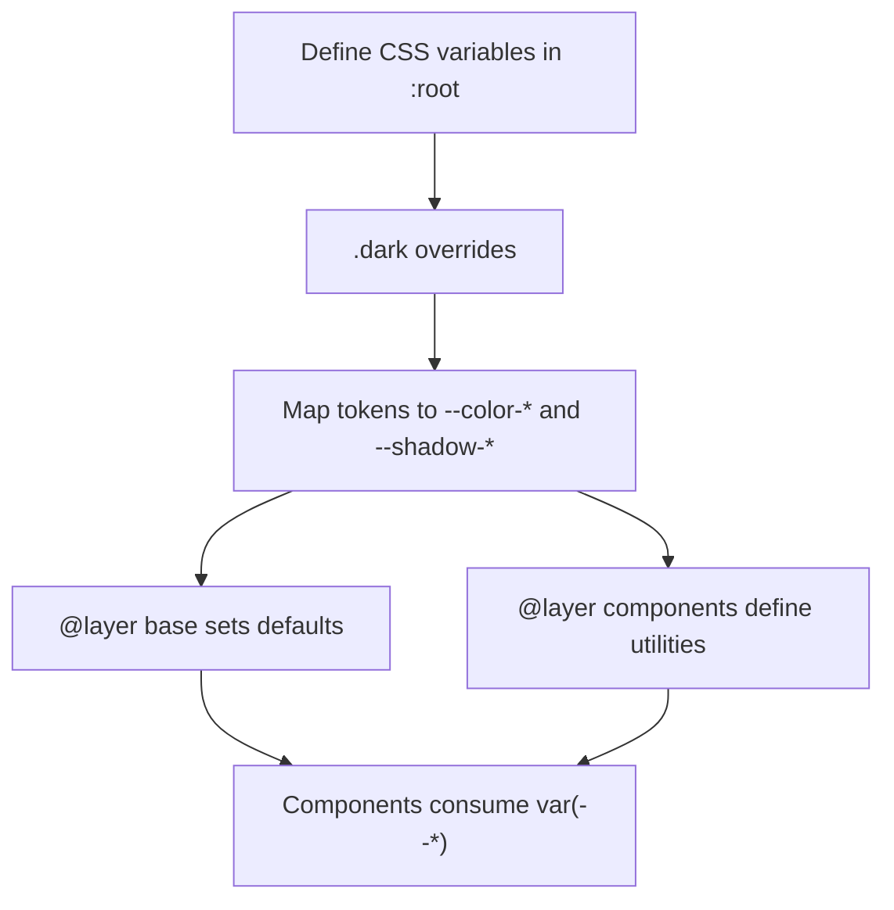
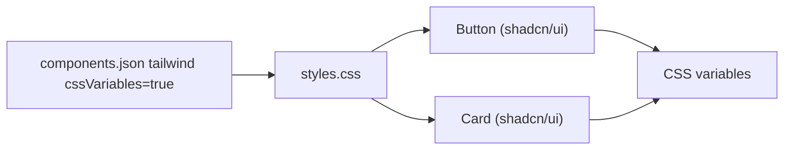
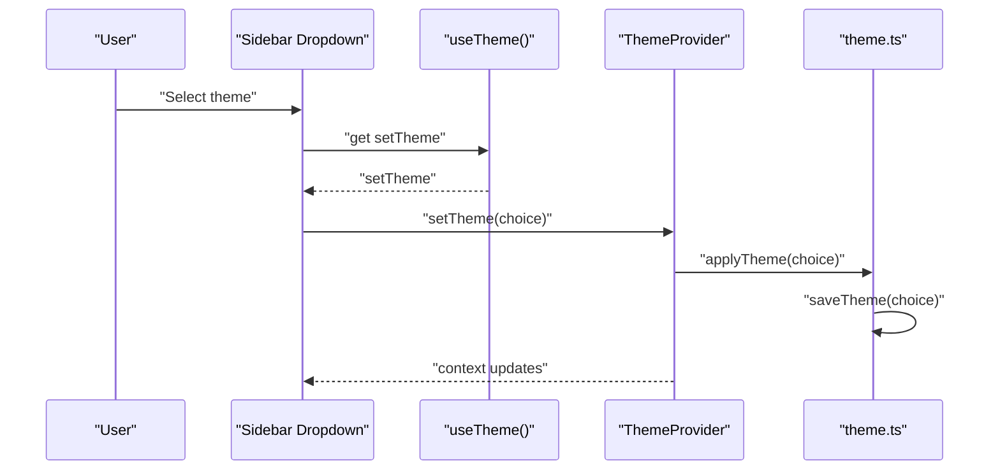
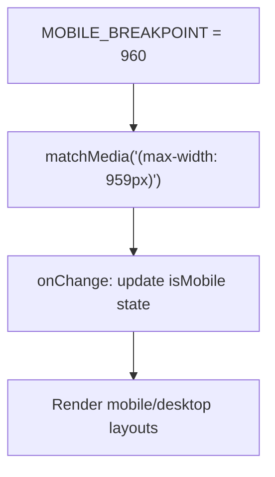
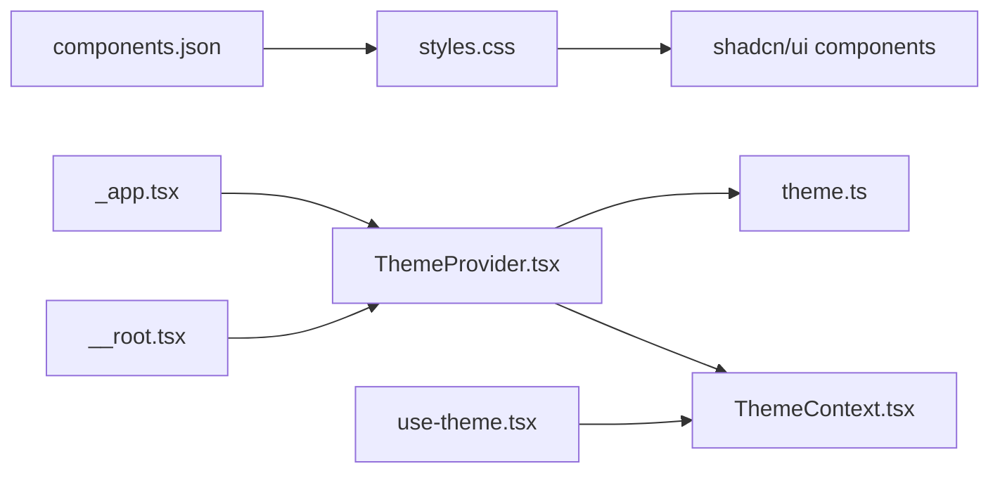

# Theme System and Styling

<cite>
**Referenced Files in This Document**
- [ThemeProvider.tsx](file://src/components/ThemeProvider.tsx)
- [ThemeContext.tsx](file://src/components/ThemeContext.tsx)
- [use-theme.tsx](file://src/hooks/use-theme.tsx)
- [theme.ts](file://src/lib/theme.ts)
- [styles.css](file://src/styles.css)
- [components.json](file://components.json)
- [_app.tsx](file://src/routes/_app.tsx)
- [__root.tsx](file://src/routes/__root.tsx)
- [button.tsx](file://src/components/ui/button.tsx)
- [card.tsx](file://src/components/ui/card.tsx)
- [use-mobile.tsx](file://src/hooks/use-mobile.tsx)
</cite>

## Table of Contents
1. [Introduction](#introduction)
2. [Project Structure](#project-structure)
3. [Core Components](#core-components)
4. [Architecture Overview](#architecture-overview)
5. [Detailed Component Analysis](#detailed-component-analysis)
6. [Dependency Analysis](#dependency-analysis)
7. [Performance Considerations](#performance-considerations)
8. [Troubleshooting Guide](#troubleshooting-guide)
9. [Conclusion](#conclusion)
10. [Appendices](#appendices)

## Introduction
This document explains the theme system and styling architecture used across the application. It covers how the ThemeProvider manages theme context, how theme switching works between light and dark modes, how preferences persist in localStorage, and how system preference detection is integrated. It also documents the theme configuration options, color schemes, and design tokens, and explains the integration with the shadcn/ui theme system and Tailwind CSS customization. Concrete examples show how to set up the theme provider, implement theme switching, and create custom themes. The CSS variables system and its effect on component styling are detailed, along with responsive design patterns and breakpoints. Finally, performance considerations, hydration strategies, SSR compatibility, and guidelines for extending the theme system are provided.

## Project Structure
The theme system is composed of:
- A ThemeProvider component that initializes and updates the theme
- A ThemeContext that exposes theme state and setters via React Context
- A theme utility module that resolves, applies, saves, and detects themes
- A centralized stylesheet that defines CSS variables and dark-mode variants
- Integration with shadcn/ui components that consume Tailwind CSS variables
- UI components that rely on CSS variables for consistent theming
- Responsive utilities and hooks for breakpoint handling

**Diagram sources**
- [ThemeProvider.tsx:1-74](file://src/components/ThemeProvider.tsx#L1-L74)
- [ThemeContext.tsx:1-12](file://src/components/ThemeContext.tsx#L1-L12)
- [theme.ts:1-77](file://src/lib/theme.ts#L1-L77)
- [use-theme.tsx:1-11](file://src/hooks/use-theme.tsx#L1-L11)
- [styles.css:1-461](file://src/styles.css#L1-L461)
- [components.json:1-23](file://components.json#L1-L23)
- [_app.tsx:172-506](file://src/routes/_app.tsx#L172-L506)
- [__root.tsx:69-90](file://src/routes/__root.tsx#L69-L90)
- [button.tsx:1-50](file://src/components/ui/button.tsx#L1-L50)
- [card.tsx:1-56](file://src/components/ui/card.tsx#L1-L56)
- [use-mobile.tsx:1-20](file://src/hooks/use-mobile.tsx#L1-L20)

**Section sources**
- [ThemeProvider.tsx:1-74](file://src/components/ThemeProvider.tsx#L1-L74)
- [ThemeContext.tsx:1-12](file://src/components/ThemeContext.tsx#L1-L12)
- [theme.ts:1-77](file://src/lib/theme.ts#L1-L77)
- [styles.css:1-461](file://src/styles.css#L1-L461)
- [components.json:1-23](file://components.json#L1-L23)
- [_app.tsx:172-506](file://src/routes/_app.tsx#L172-L506)
- [__root.tsx:69-90](file://src/routes/__root.tsx#L69-L90)
- [button.tsx:1-50](file://src/components/ui/button.tsx#L1-L50)
- [card.tsx:1-56](file://src/components/ui/card.tsx#L1-L56)
- [use-mobile.tsx:1-20](file://src/hooks/use-mobile.tsx#L1-L20)

## Core Components
- ThemeProvider: Initializes theme state, applies theme to the DOM, persists preferences, listens to system preference changes, and exposes theme context.
- ThemeContext: Provides theme state and setter to consumers.
- theme utility: Encapsulates theme resolution, persistence, and DOM application.
- use-theme hook: Simplifies access to theme context.
- styles.css: Defines CSS variables, dark mode variants, and component utilities.
- shadcn/ui integration: Components consume Tailwind CSS variables and dark variants.
- Responsive utilities: Breakpoint detection and responsive patterns.

**Section sources**
- [ThemeProvider.tsx:17-73](file://src/components/ThemeProvider.tsx#L17-L73)
- [ThemeContext.tsx:4-11](file://src/components/ThemeContext.tsx#L4-L11)
- [theme.ts:16-47](file://src/lib/theme.ts#L16-L47)
- [use-theme.tsx:4-10](file://src/hooks/use-theme.tsx#L4-L10)
- [styles.css:57-118](file://src/styles.css#L57-L118)
- [components.json:6-11](file://components.json#L6-L11)

## Architecture Overview
The theme system follows a unidirectional flow:
- Initialization: ThemeProvider reads stored theme from localStorage and applies it to the DOM.
- Resolution: The effective theme (light or dark) is derived from the stored theme and system preference.
- Persistence: Changing the theme updates localStorage and toggles the "dark" class on the document element.
- Context: ThemeContext exposes theme state and setter to the rest of the app.
- UI: Components consume CSS variables and dark variants to render consistently under any theme.

**Diagram sources**
- [ThemeProvider.tsx:34-39](file://src/components/ThemeProvider.tsx#L34-L39)
- [theme.ts:35-47](file://src/lib/theme.ts#L35-L47)

**Section sources**
- [ThemeProvider.tsx:22-47](file://src/components/ThemeProvider.tsx#L22-L47)
- [theme.ts:16-47](file://src/lib/theme.ts#L16-L47)

## Detailed Component Analysis

### ThemeProvider
- Purpose: Centralizes theme initialization, persistence, and system preference listening.
- Hydration strategy: Reads stored theme on mount and applies it immediately to prevent hydration mismatches.
- System preference: Subscribes to media query changes when theme is set to "system".
- Exposes: theme, resolvedTheme, setTheme, and isDark via ThemeContext.

**Diagram sources**
- [ThemeProvider.tsx:22-63](file://src/components/ThemeProvider.tsx#L22-L63)
- [theme.ts:16-11](file://src/lib/theme.ts#L16-L11)

**Section sources**
- [ThemeProvider.tsx:17-73](file://src/components/ThemeProvider.tsx#L17-L73)

### ThemeContext and use-theme
- ThemeContext: Holds theme state and setter, plus a boolean indicating if the resolved theme is dark.
- use-theme: Hook that enforces usage within ThemeProvider and returns the context value.

**Diagram sources**
- [ThemeContext.tsx:4-11](file://src/components/ThemeContext.tsx#L4-L11)
- [ThemeProvider.tsx:65-70](file://src/components/ThemeProvider.tsx#L65-L70)
- [use-theme.tsx:4-10](file://src/hooks/use-theme.tsx#L4-L10)

**Section sources**
- [ThemeContext.tsx:4-11](file://src/components/ThemeContext.tsx#L4-L11)
- [use-theme.tsx:4-10](file://src/hooks/use-theme.tsx#L4-L10)

### Theme Utility Module
- Types and resolution: Defines Theme union and resolves effective theme based on system preference.
- Persistence: Saves and retrieves theme from localStorage.
- Application: Adds/removes the "dark" class on the document element.

**Diagram sources**
- [theme.ts:26-47](file://src/lib/theme.ts#L26-L47)
- [theme.ts:16-21](file://src/lib/theme.ts#L16-L21)
- [theme.ts:8-11](file://src/lib/theme.ts#L8-L11)

**Section sources**
- [theme.ts:3-47](file://src/lib/theme.ts#L3-L47)

### Styles and CSS Variables
- CSS variables: Centralized in :root and .dark blocks define the palette and typography.
- Design tokens: Radius, colors, borders, shadows, fonts mapped to variables.
- Component utilities: PCReady-specific utilities (.pc-*) and Tailwind-based utilities.
- Dark variant: Custom dark variant selector enables Tailwind utilities to adapt to dark mode.

**Diagram sources**
- [styles.css:57-118](file://src/styles.css#L57-L118)
- [styles.css:120-446](file://src/styles.css#L120-L446)
- [styles.css:5](file://src/styles.css#L5)

**Section sources**
- [styles.css:57-118](file://src/styles.css#L57-L118)
- [styles.css:120-446](file://src/styles.css#L120-L446)
- [styles.css:5](file://src/styles.css#L5)

### Shadcn/UI Integration and Tailwind Customization
- components.json: Configures shadcn/ui style, RSC flag, TSX, and Tailwind integration.
- Tailwind variables: CSS variables are consumed by Tailwind utilities and shadcn/ui components.
- Components: UI components like Button and Card rely on Tailwind classes that resolve to CSS variables.

**Diagram sources**
- [components.json:6-11](file://components.json#L6-L11)
- [styles.css:57-55](file://src/styles.css#L57-L55)
- [button.tsx:7-32](file://src/components/ui/button.tsx#L7-L32)
- [card.tsx:5-14](file://src/components/ui/card.tsx#L5-L14)

**Section sources**
- [components.json:1-23](file://components.json#L1-L23)
- [styles.css:57-55](file://src/styles.css#L57-L55)
- [button.tsx:7-32](file://src/components/ui/button.tsx#L7-L32)
- [card.tsx:5-14](file://src/components/ui/card.tsx#L5-L14)

### Theme Switching Implementation
- Example usage: The application’s sidebar demonstrates switching between light, dark, and system modes.
- Hook usage: Components access theme state and setter via useTheme.
- Persistence: Each switch updates localStorage and triggers DOM class toggling.

**Diagram sources**
- [_app.tsx:452-493](file://src/routes/_app.tsx#L452-L493)
- [use-theme.tsx:4-10](file://src/hooks/use-theme.tsx#L4-L10)
- [ThemeProvider.tsx:34-39](file://src/components/ThemeProvider.tsx#L34-L39)
- [theme.ts:35-47](file://src/lib/theme.ts#L35-L47)

**Section sources**
- [_app.tsx:452-493](file://src/routes/_app.tsx#L452-L493)
- [use-theme.tsx:4-10](file://src/hooks/use-theme.tsx#L4-L10)
- [ThemeProvider.tsx:34-39](file://src/components/ThemeProvider.tsx#L34-L39)
- [theme.ts:35-47](file://src/lib/theme.ts#L35-L47)

### Responsive Design Patterns and Breakpoints
- Breakpoint: Mobile detection uses a media query listener with a fixed breakpoint.
- Responsive utilities: Components use Tailwind responsive prefixes (sm:, md:, lg:, xl:).
- Layout adaptation: The app switches between desktop and mobile navigation based on screen size.

**Diagram sources**
- [use-mobile.tsx:3-16](file://src/hooks/use-mobile.tsx#L3-L16)
- [_app.tsx:276-291](file://src/routes/_app.tsx#L276-L291)

**Section sources**
- [use-mobile.tsx:1-20](file://src/hooks/use-mobile.tsx#L1-L20)
- [_app.tsx:276-291](file://src/routes/_app.tsx#L276-L291)

## Dependency Analysis
The theme system exhibits low coupling and high cohesion:
- ThemeProvider depends on theme.ts for resolution and DOM application.
- ThemeContext decouples consumers from the provider implementation.
- UI components depend on CSS variables and Tailwind utilities, not on theme internals.
- components.json configures Tailwind variable consumption for shadcn/ui.

**Diagram sources**
- [ThemeProvider.tsx:1-4](file://src/components/ThemeProvider.tsx#L1-L4)
- [theme.ts:1-1](file://src/lib/theme.ts#L1-L1)
- [ThemeContext.tsx:1-2](file://src/components/ThemeContext.tsx#L1-L2)
- [use-theme.tsx:1-2](file://src/hooks/use-theme.tsx#L1-L2)
- [styles.css:1-5](file://src/styles.css#L1-L5)
- [components.json:6-11](file://components.json#L6-L11)
- [_app.tsx:15-15](file://src/routes/_app.tsx#L15-L15)
- [__root.tsx:6-6](file://src/routes/__root.tsx#L6-L6)

**Section sources**
- [ThemeProvider.tsx:1-4](file://src/components/ThemeProvider.tsx#L1-L4)
- [theme.ts:1-1](file://src/lib/theme.ts#L1-L1)
- [ThemeContext.tsx:1-2](file://src/components/ThemeContext.tsx#L1-L2)
- [use-theme.tsx:1-2](file://src/hooks/use-theme.tsx#L1-L2)
- [styles.css:1-5](file://src/styles.css#L1-L5)
- [components.json:6-11](file://components.json#L6-L11)
- [_app.tsx:15-15](file://src/routes/_app.tsx#L15-L15)
- [__root.tsx:6-6](file://src/routes/__root.tsx#L6-L6)

## Performance Considerations
- Hydration safety: ThemeProvider initializes on mount and applies the stored theme immediately to avoid hydration mismatches.
- Minimal re-renders: The theme setter is memoized to prevent unnecessary updates.
- Efficient DOM toggling: Only the "dark" class is toggled on the document element.
- CSS variables: Using CSS variables avoids costly reflows compared to recalculating styles.
- Media query listeners: Cleaned up on unmount to prevent memory leaks.
- SSR compatibility: The provider accepts a default theme and system preference flag to initialize safely on the server.

**Section sources**
- [ThemeProvider.tsx:22-47](file://src/components/ThemeProvider.tsx#L22-L47)
- [ThemeProvider.tsx:42-63](file://src/components/ThemeProvider.tsx#L42-L63)
- [theme.ts:35-39](file://src/lib/theme.ts#L35-L39)
- [__root.tsx:70-89](file://src/routes/__root.tsx#L70-L89)

## Troubleshooting Guide
- Theme not applying on first load:
  - Ensure ThemeProvider wraps the application root and initializes on the client.
  - Verify localStorage key and that applyTheme toggles the "dark" class.
- Hydration mismatch warnings:
  - Confirm ThemeProvider runs initialization on mount and applies the stored theme before rendering children.
- System preference not updating:
  - Check that enableSystem is true and that media query listeners are attached when theme equals "system".
- Components not respecting theme:
  - Ensure components use CSS variables or Tailwind utilities that consume the variables.
  - Confirm dark variant is enabled in Tailwind configuration.

**Section sources**
- [ThemeProvider.tsx:22-47](file://src/components/ThemeProvider.tsx#L22-L47)
- [theme.ts:35-39](file://src/lib/theme.ts#L35-L39)
- [components.json:6-11](file://components.json#L6-L11)

## Conclusion
The theme system is designed around a clean separation of concerns: ThemeProvider manages state and persistence, ThemeContext exposes values to consumers, and theme.ts encapsulates resolution and DOM application. CSS variables and dark variants enable consistent theming across components, while shadcn/ui integration ensures cohesive UI behavior. The system is resilient to hydration mismatches, supports system preference detection, and remains performant through minimal DOM manipulation and efficient CSS variable usage.

## Appendices

### Theme Provider Setup Example
- Wrap your application with ThemeProvider and configure default theme and system preference support.
- Reference: [__root.tsx:80-87](file://src/routes/__root.tsx#L80-L87), [ThemeProvider.tsx:17-21](file://src/components/ThemeProvider.tsx#L17-L21)

### Theme Switching Implementation Example
- Use the useTheme hook to access theme state and setter in components.
- Reference: [_app.tsx:452-493](file://src/routes/_app.tsx#L452-L493), [use-theme.tsx:4-10](file://src/hooks/use-theme.tsx#L4-L10)

### Custom Theme Creation Guidelines
- Define new CSS variables in :root and override them in .dark for dark mode.
- Map design tokens to --color-* and --shadow-* variables for consistent usage.
- Reference: [styles.css:57-118](file://src/styles.css#L57-L118), [styles.css:5](file://src/styles.css#L5)

### Extending the Theme System
- Add new color palettes by introducing new variables and mapping them to existing tokens.
- Introduce additional design tokens (e.g., spacing, typography scales) and update CSS variables accordingly.
- Extend the Theme union and update resolution logic if new modes are introduced.
- Reference: [theme.ts:3](file://src/lib/theme.ts#L3), [theme.ts:16-21](file://src/lib/theme.ts#L16-L21)