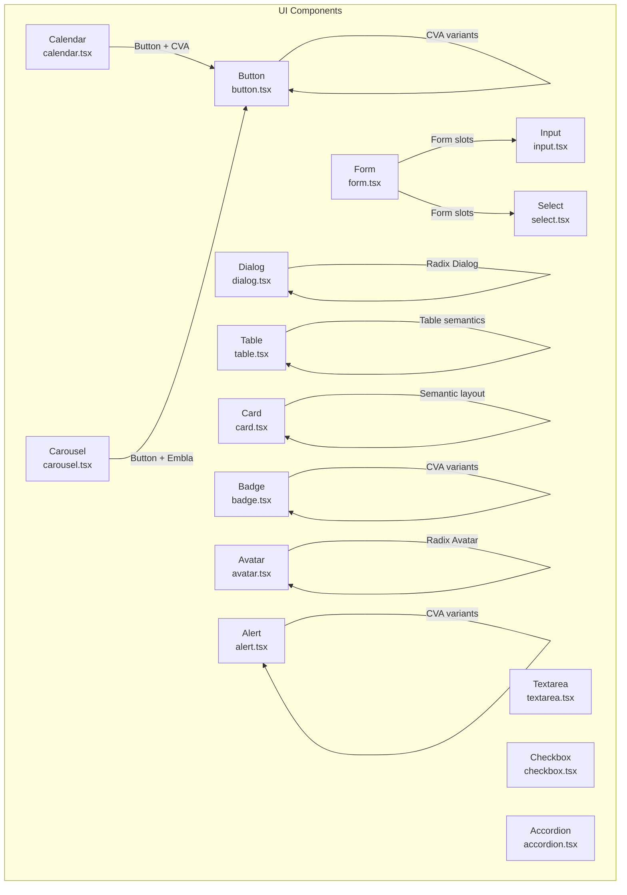
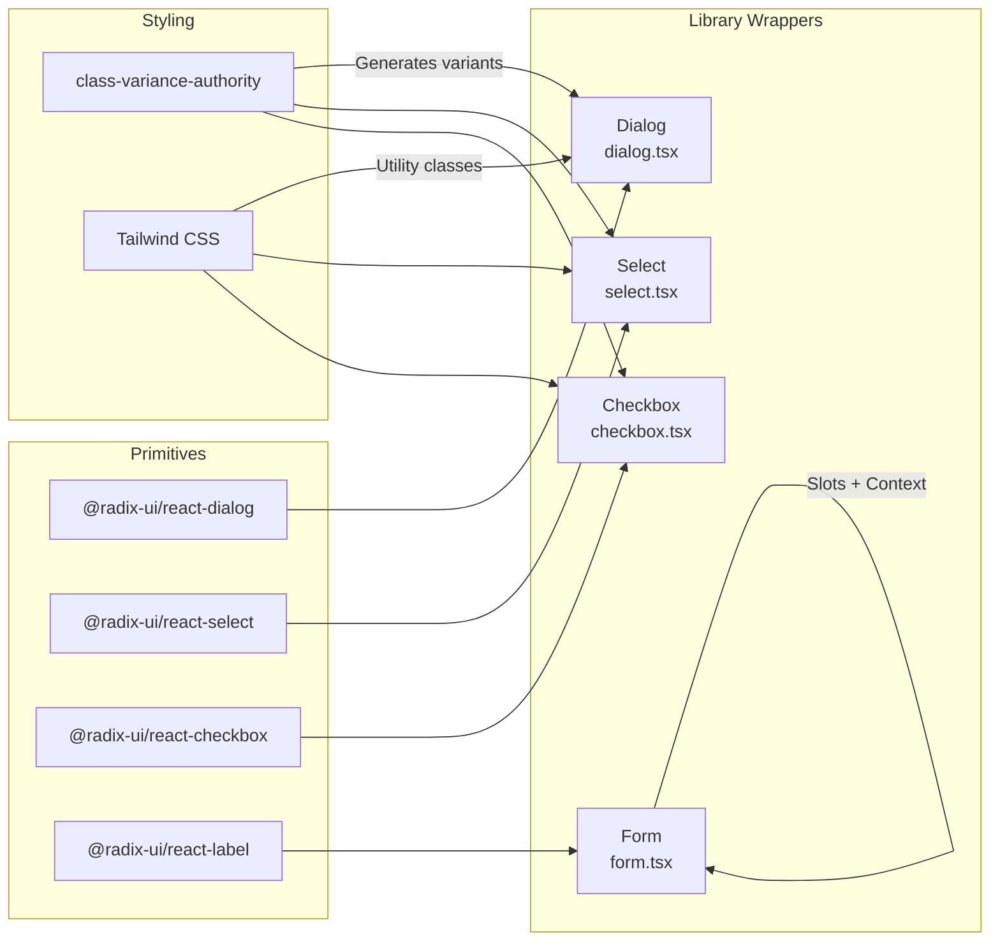
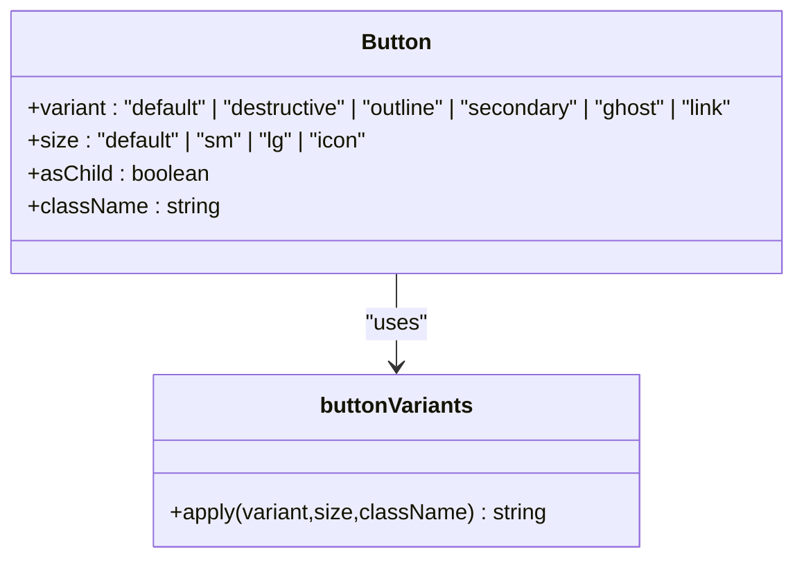
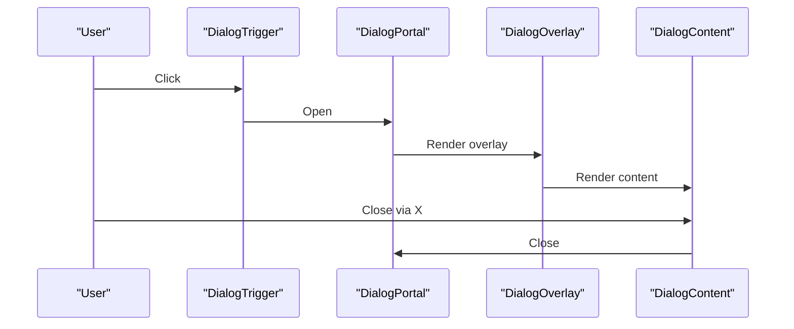
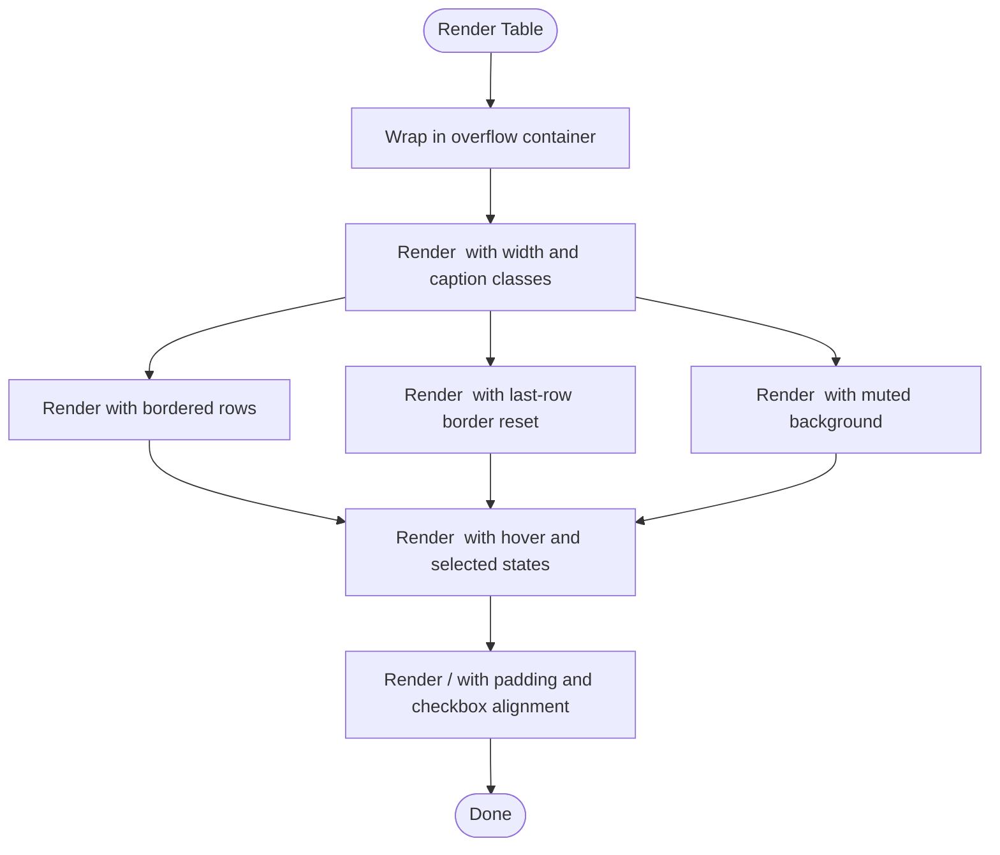
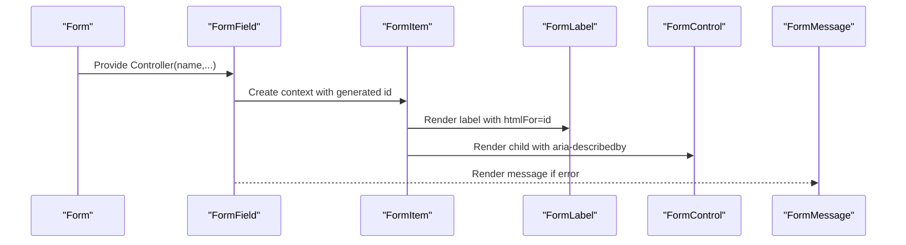
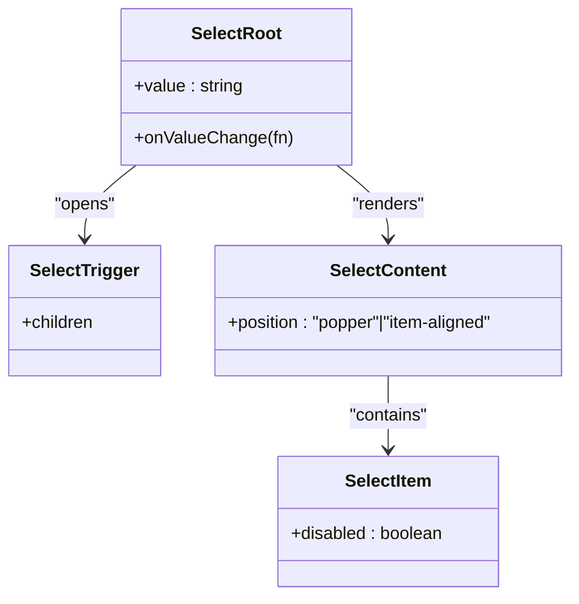
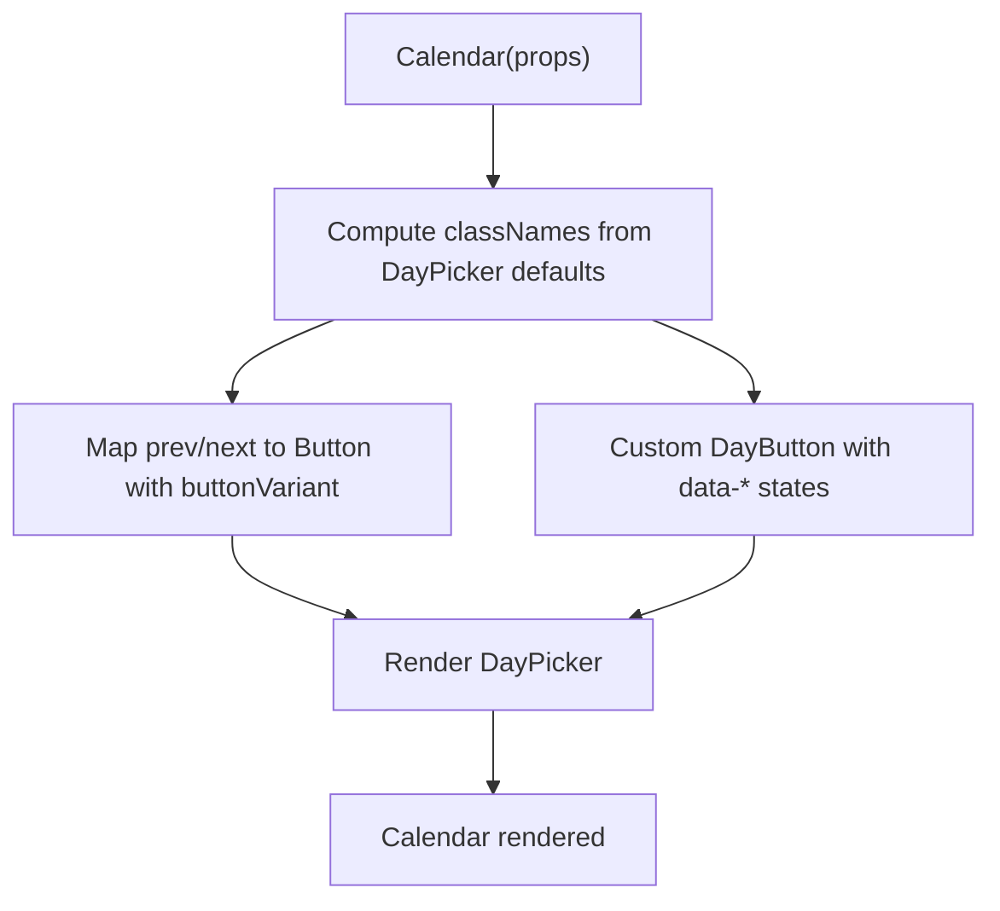
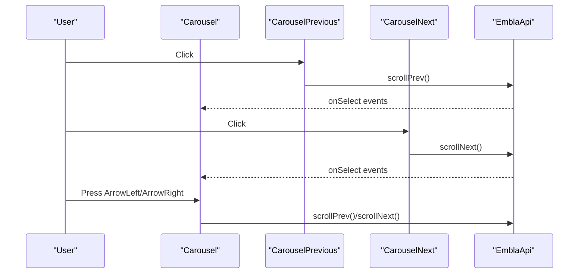
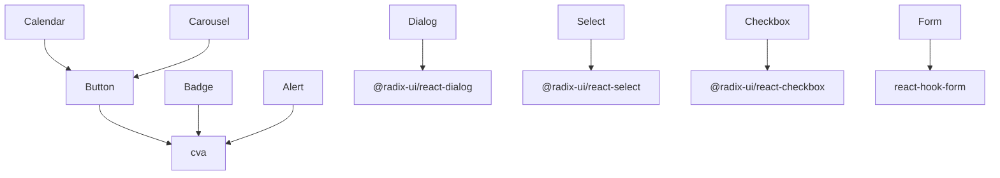

# UI Components Library

<cite>
**Referenced Files in This Document**
- [button.tsx](file://src/components/ui/button.tsx)
- [dialog.tsx](file://src/components/ui/dialog.tsx)
- [table.tsx](file://src/components/ui/table.tsx)
- [form.tsx](file://src/components/ui/form.tsx)
- [input.tsx](file://src/components/ui/input.tsx)
- [select.tsx](file://src/components/ui/select.tsx)
- [textarea.tsx](file://src/components/ui/textarea.tsx)
- [checkbox.tsx](file://src/components/ui/checkbox.tsx)
- [accordion.tsx](file://src/components/ui/accordion.tsx)
- [alert.tsx](file://src/components/ui/alert.tsx)
- [avatar.tsx](file://src/components/ui/avatar.tsx)
- [badge.tsx](file://src/components/ui/badge.tsx)
- [calendar.tsx](file://src/components/ui/calendar.tsx)
- [card.tsx](file://src/components/ui/card.tsx)
- [carousel.tsx](file://src/components/ui/carousel.tsx)
</cite>

## Table of Contents
1. [Introduction](#introduction)
2. [Project Structure](#project-structure)
3. [Core Components](#core-components)
4. [Architecture Overview](#architecture-overview)
5. [Detailed Component Analysis](#detailed-component-analysis)
6. [Dependency Analysis](#dependency-analysis)
7. [Performance Considerations](#performance-considerations)
8. [Accessibility and UX](#accessibility-and-ux)
9. [Tailwind CSS and Styling Patterns](#tailwind-css-and-styling-patterns)
10. [Extending Components and Variants](#extending-components-and-variants)
11. [Testing and Documentation Guidelines](#testing-and-documentation-guidelines)
12. [Troubleshooting Guide](#troubleshooting-guide)
13. [Conclusion](#conclusion)

## Introduction
This document describes the UI components library built with shadcn/ui primitives and Radix UI components. It explains the component architecture, variant systems, composition patterns, styling via Tailwind CSS, accessibility, performance, and extension guidelines. The library emphasizes reusable, accessible, and customizable building blocks for forms, overlays, tables, and composite widgets.

## Project Structure
The UI components live under src/components/ui and are organized by primitive and composite components. Each component follows a consistent pattern:
- Uses Radix UI primitives for accessibility and interoperability
- Applies Tailwind CSS utility classes for styling
- Implements class-variance-authority (CVA) for variant-driven styling
- Leverages the slot pattern (via @radix-ui/react-slot) for composition

**Diagram sources**
- [button.tsx:1-50](file://src/components/ui/button.tsx#L1-L50)
- [form.tsx:1-172](file://src/components/ui/form.tsx#L1-L172)
- [dialog.tsx:1-105](file://src/components/ui/dialog.tsx#L1-L105)
- [table.tsx:1-95](file://src/components/ui/table.tsx#L1-L95)
- [input.tsx:1-23](file://src/components/ui/input.tsx#L1-L23)
- [select.tsx:1-153](file://src/components/ui/select.tsx#L1-L153)
- [textarea.tsx:1-22](file://src/components/ui/textarea.tsx#L1-L22)
- [checkbox.tsx:1-27](file://src/components/ui/checkbox.tsx#L1-L27)
- [accordion.tsx:1-52](file://src/components/ui/accordion.tsx#L1-L52)
- [calendar.tsx:1-178](file://src/components/ui/calendar.tsx#L1-L178)
- [carousel.tsx:1-241](file://src/components/ui/carousel.tsx#L1-L241)
- [card.tsx:1-56](file://src/components/ui/card.tsx#L1-L56)
- [badge.tsx:1-33](file://src/components/ui/badge.tsx#L1-L33)
- [avatar.tsx:1-48](file://src/components/ui/avatar.tsx#L1-L48)
- [alert.tsx:1-50](file://src/components/ui/alert.tsx#L1-L50)

**Section sources**
- [button.tsx:1-50](file://src/components/ui/button.tsx#L1-L50)
- [dialog.tsx:1-105](file://src/components/ui/dialog.tsx#L1-L105)
- [table.tsx:1-95](file://src/components/ui/table.tsx#L1-L95)
- [form.tsx:1-172](file://src/components/ui/form.tsx#L1-L172)
- [input.tsx:1-23](file://src/components/ui/input.tsx#L1-L23)
- [select.tsx:1-153](file://src/components/ui/select.tsx#L1-L153)
- [textarea.tsx:1-22](file://src/components/ui/textarea.tsx#L1-L22)
- [checkbox.tsx:1-27](file://src/components/ui/checkbox.tsx#L1-L27)
- [accordion.tsx:1-52](file://src/components/ui/accordion.tsx#L1-L52)
- [alert.tsx:1-50](file://src/components/ui/alert.tsx#L1-L50)
- [avatar.tsx:1-48](file://src/components/ui/avatar.tsx#L1-L48)
- [badge.tsx:1-33](file://src/components/ui/badge.tsx#L1-L33)
- [calendar.tsx:1-178](file://src/components/ui/calendar.tsx#L1-L178)
- [card.tsx:1-56](file://src/components/ui/card.tsx#L1-L56)
- [carousel.tsx:1-241](file://src/components/ui/carousel.tsx#L1-L241)

## Core Components
This section outlines the primary building blocks and their variant systems.

- Button
  - Purpose: Base action element with variants and sizes.
  - Variants: default, destructive, outline, secondary, ghost, link.
  - Sizes: default, sm, lg, icon.
  - Composition: Supports asChild via the slot pattern.
  - Props: Inherits button attributes plus variant, size, asChild.

- Input, Textarea
  - Purpose: Primitive text inputs with consistent focus states and disabled handling.
  - Styling: Shared base classes for borders, padding, and focus rings.

- Select
  - Purpose: Accessible single/multi-selection control with scrollable viewport.
  - Features: Trigger, Content, Item, Label, Separator, Scroll buttons.
  - Styling: Uses CVA-like composition via cn and Radix classes.

- Checkbox
  - Purpose: Two-state selection with indicator.
  - Styling: Focus-visible ring and checked state styling.

- Form
  - Purpose: Integration with react-hook-form using slots and contexts.
  - Components: Form, FormField, FormItem, FormLabel, FormControl, FormDescription, FormMessage.
  - Accessibility: Auto-generates ids and aria-* attributes.

- Dialog
  - Purpose: Overlay with animated content, portal rendering, and close trigger.
  - Components: Root, Portal, Overlay, Close, Trigger, Content, Header/Footer, Title, Description.
  - Accessibility: Focus trapping and keyboard handling via Radix.

- Table
  - Purpose: Semantic table container with responsive wrapper and row/cell variants.
  - Components: Table, TableHeader, TableBody, TableFooter, TableRow, TableHead, TableCell, TableCaption.

- Accordion
  - Purpose: Collapsible sections with animated content.
  - Components: Root, Item, Trigger, Content.

- Alert, Badge, Avatar, Card
  - Purpose: Presentational containers with CVA variants and semantic roles.

**Section sources**
- [button.tsx:34-49](file://src/components/ui/button.tsx#L34-L49)
- [input.tsx:5-22](file://src/components/ui/input.tsx#L5-L22)
- [textarea.tsx:5-21](file://src/components/ui/textarea.tsx#L5-L21)
- [select.tsx:15-152](file://src/components/ui/select.tsx#L15-L152)
- [checkbox.tsx:7-26](file://src/components/ui/checkbox.tsx#L7-L26)
- [form.tsx:16-171](file://src/components/ui/form.tsx#L16-L171)
- [dialog.tsx:9-104](file://src/components/ui/dialog.tsx#L9-L104)
- [table.tsx:5-94](file://src/components/ui/table.tsx#L5-L94)
- [accordion.tsx:7-51](file://src/components/ui/accordion.tsx#L7-L51)
- [alert.tsx:22-49](file://src/components/ui/alert.tsx#L22-L49)
- [badge.tsx:25-32](file://src/components/ui/badge.tsx#L25-L32)
- [avatar.tsx:8-47](file://src/components/ui/avatar.tsx#L8-L47)
- [card.tsx:5-55](file://src/components/ui/card.tsx#L5-L55)

## Architecture Overview
The library follows a layered architecture:
- Primitives: Low-level components built on Radix UI (e.g., Dialog, Select, Checkbox).
- Composites: Higher-level widgets composed from primitives (e.g., Dialog, Table, Accordion).
- Styling: Tailwind classes combined with CVA-generated variants.
- Composition: Slot pattern enables flexible DOM wrapping and composition.

**Diagram sources**
- [dialog.tsx:3-104](file://src/components/ui/dialog.tsx#L3-L104)
- [select.tsx:3-152](file://src/components/ui/select.tsx#L3-L152)
- [checkbox.tsx:2-26](file://src/components/ui/checkbox.tsx#L2-L26)
- [form.tsx:2-171](file://src/components/ui/form.tsx#L2-L171)
- [button.tsx:7-32](file://src/components/ui/button.tsx#L7-L32)

## Detailed Component Analysis

### Button
- Variant system: CVA defines variant and size combinations with defaults.
- Composition: asChild allows rendering any element while preserving styling.
- Accessibility: Inherits button semantics; focus-visible ring applied.

**Diagram sources**
- [button.tsx:7-32](file://src/components/ui/button.tsx#L7-L32)
- [button.tsx:34-49](file://src/components/ui/button.tsx#L34-L49)

**Section sources**
- [button.tsx:7-32](file://src/components/ui/button.tsx#L7-L32)
- [button.tsx:34-49](file://src/components/ui/button.tsx#L34-L49)

### Dialog
- Overlay animation and portal rendering ensure proper stacking and focus.
- Close button includes screen-reader text and focus ring.
- Header/Footer provide semantic grouping.

**Diagram sources**
- [dialog.tsx:9-54](file://src/components/ui/dialog.tsx#L9-L54)

**Section sources**
- [dialog.tsx:9-54](file://src/components/ui/dialog.tsx#L9-L54)

### Table
- Responsive wrapper ensures horizontal scrolling on small screens.
- Semantic markup for header/body/footer and row/cell alignment.

**Diagram sources**
- [table.tsx:5-94](file://src/components/ui/table.tsx#L5-L94)

**Section sources**
- [table.tsx:5-94](file://src/components/ui/table.tsx#L5-L94)

### Form
- Contexts manage field ids and aria attributes.
- Slot pattern composes native inputs with labels and messages.
- Accessibility: aria-invalid, aria-describedby, and generated ids.

**Diagram sources**
- [form.tsx:16-171](file://src/components/ui/form.tsx#L16-L171)

**Section sources**
- [form.tsx:16-171](file://src/components/ui/form.tsx#L16-L171)

### Select
- Trigger displays current value with icon; Content renders portal with viewport.
- Items support indicators and disabled states.
- Scroll buttons enable long lists navigation.

**Diagram sources**
- [select.tsx:9-152](file://src/components/ui/select.tsx#L9-L152)

**Section sources**
- [select.tsx:9-152](file://src/components/ui/select.tsx#L9-L152)

### Calendar
- Integrates react-day-picker with Button variants for navigation.
- Custom DayButton applies CVA variants and keyboard-focused state.
- RTL-aware chevrons and cell sizing.

**Diagram sources**
- [calendar.tsx:10-177](file://src/components/ui/calendar.tsx#L10-L177)

**Section sources**
- [calendar.tsx:10-177](file://src/components/ui/calendar.tsx#L10-L177)

### Carousel
- Uses embla-carousel-react for smooth slides.
- Keyboard navigation: Arrow keys move slides.
- Provides previous/next buttons wired to scrollPrev/scrollNext.

**Diagram sources**
- [carousel.tsx:41-240](file://src/components/ui/carousel.tsx#L41-L240)

**Section sources**
- [carousel.tsx:41-240](file://src/components/ui/carousel.tsx#L41-L240)

## Dependency Analysis
- Radix UI primitives power accessibility and state management across Dialog, Select, Checkbox, Accordion, and others.
- class-variance-authority centralizes variant definitions for Button, Badge, Alert, and derived components.
- react-hook-form integrates with Form components to provide robust form handling and accessibility attributes.
- Utility library (cn) composes Tailwind classes consistently across components.

**Diagram sources**
- [button.tsx:2-3](file://src/components/ui/button.tsx#L2-L3)
- [badge.tsx:2-3](file://src/components/ui/badge.tsx#L2-L3)
- [alert.tsx:2](file://src/components/ui/alert.tsx#L2)
- [dialog.tsx:3-4](file://src/components/ui/dialog.tsx#L3-L4)
- [select.tsx:3-4](file://src/components/ui/select.tsx#L3-L4)
- [checkbox.tsx:2-3](file://src/components/ui/checkbox.tsx#L2-L3)
- [form.tsx:5-11](file://src/components/ui/form.tsx#L5-L11)
- [calendar.tsx:8](file://src/components/ui/calendar.tsx#L8)
- [carousel.tsx:5-6](file://src/components/ui/carousel.tsx#L5-L6)

**Section sources**
- [button.tsx:2-3](file://src/components/ui/button.tsx#L2-L3)
- [badge.tsx:2-3](file://src/components/ui/badge.tsx#L2-L3)
- [alert.tsx:2](file://src/components/ui/alert.tsx#L2)
- [dialog.tsx:3-4](file://src/components/ui/dialog.tsx#L3-L4)
- [select.tsx:3-4](file://src/components/ui/select.tsx#L3-L4)
- [checkbox.tsx:2-3](file://src/components/ui/checkbox.tsx#L2-L3)
- [form.tsx:5-11](file://src/components/ui/form.tsx#L5-L11)
- [calendar.tsx:8](file://src/components/ui/calendar.tsx#L8)
- [carousel.tsx:5-6](file://src/components/ui/carousel.tsx#L5-L6)

## Performance Considerations
- Prefer composition over deep nesting to reduce re-renders.
- Use asChild where appropriate to avoid unnecessary wrappers.
- Memoize heavy computations in composite components (e.g., Carousel) to prevent unnecessary recalculations.
- Avoid prop drilling by leveraging context providers (Form) and local state where feasible.
- Keep variant sets concise to minimize class generation overhead.

## Accessibility and UX
- Focus management: Dialog and Select ensure focus trapping and return focus after closing.
- Keyboard navigation: Carousel supports arrow keys; Select supports keyboard interactions.
- Screen reader support: Dialog includes sr-only close label; Form auto-generates aria attributes; Alert uses role="alert".
- Disabled states: Respect disabled pointer-events and reduced opacity across interactive components.
- Semantic markup: Table, Card, and Alert use appropriate HTML semantics.

**Section sources**
- [dialog.tsx:47-50](file://src/components/ui/dialog.tsx#L47-L50)
- [form.tsx:103-117](file://src/components/ui/form.tsx#L103-L117)
- [alert.tsx:26](file://src/components/ui/alert.tsx#L26)
- [carousel.tsx:72-83](file://src/components/ui/carousel.tsx#L72-L83)
- [select.tsx:15-32](file://src/components/ui/select.tsx#L15-L32)

## Tailwind CSS and Styling Patterns
- Utility-first classes compose via cn for predictable overrides.
- CVA generates variant classes; defaults ensure consistent baseline styling.
- Composite components (Calendar, Carousel) reuse Button’s variant classes to maintain visual consistency.
- Responsive and motion utilities are applied thoughtfully to balance aesthetics and performance.

**Section sources**
- [button.tsx:8](file://src/components/ui/button.tsx#L8)
- [calendar.tsx:46-55](file://src/components/ui/calendar.tsx#L46-L55)
- [carousel.tsx:177-230](file://src/components/ui/carousel.tsx#L177-L230)

## Extending Components and Variants
- Adding a new variant:
  - Define variant tokens and styles in the component’s CVA definition.
  - Export the variant type and update defaultVariants if needed.
  - Example reference: [button.tsx:7-32](file://src/components/ui/button.tsx#L7-L32), [badge.tsx:6-23](file://src/components/ui/badge.tsx#L6-L23), [alert.tsx:6-20](file://src/components/ui/alert.tsx#L6-L20).
- Using the slot pattern:
  - Wrap children with Slot to preserve event handlers and attributes.
  - Example reference: [form.tsx:103-117](file://src/components/ui/form.tsx#L103-L117).
- Composing primitives:
  - Build composite components by composing Radix primitives and utility classes.
  - Example reference: [dialog.tsx:9-54](file://src/components/ui/dialog.tsx#L9-L54), [select.tsx:9-152](file://src/components/ui/select.tsx#L9-L152).

**Section sources**
- [button.tsx:7-32](file://src/components/ui/button.tsx#L7-L32)
- [badge.tsx:6-23](file://src/components/ui/badge.tsx#L6-L23)
- [alert.tsx:6-20](file://src/components/ui/alert.tsx#L6-L20)
- [form.tsx:103-117](file://src/components/ui/form.tsx#L103-L117)
- [dialog.tsx:9-54](file://src/components/ui/dialog.tsx#L9-L54)
- [select.tsx:9-152](file://src/components/ui/select.tsx#L9-L152)

## Testing and Documentation Guidelines
- Unit tests: Verify variant classes, disabled states, and slot composition.
- Integration tests: Validate accessibility attributes and keyboard interactions (e.g., Dialog, Select).
- Snapshot tests: Capture visual regressions for composite components (Calendar, Carousel).
- Documentation:
  - Describe props, variants, and composition patterns per component.
  - Provide usage examples for common scenarios and variant combinations.
  - Include accessibility notes and keyboard shortcuts.

## Troubleshooting Guide
- Dialog not closing or focus not trapped:
  - Ensure Portal and Overlay are present and Close is reachable.
  - Reference: [dialog.tsx:9-54](file://src/components/ui/dialog.tsx#L9-L54).
- Select items not selectable:
  - Confirm Value and onValueChange are wired; check Item disabled state.
  - Reference: [select.tsx:9-152](file://src/components/ui/select.tsx#L9-L152).
- Form label not associated with input:
  - Use FormLabel and FormControl to bind ids and aria attributes.
  - Reference: [form.tsx:16-171](file://src/components/ui/form.tsx#L16-L171).
- Calendar navigation missing:
  - Verify buttonVariant and classNames mapping.
  - Reference: [calendar.tsx:10-177](file://src/components/ui/calendar.tsx#L10-L177).
- Carousel arrows disabled:
  - Confirm onSelect handlers and canScrollPrev/canScrollNext updates.
  - Reference: [carousel.tsx:52-105](file://src/components/ui/carousel.tsx#L52-L105).

**Section sources**
- [dialog.tsx:9-54](file://src/components/ui/dialog.tsx#L9-L54)
- [select.tsx:9-152](file://src/components/ui/select.tsx#L9-L152)
- [form.tsx:16-171](file://src/components/ui/form.tsx#L16-L171)
- [calendar.tsx:10-177](file://src/components/ui/calendar.tsx#L10-L177)
- [carousel.tsx:52-105](file://src/components/ui/carousel.tsx#L52-L105)

## Conclusion
The UI components library combines Radix UI primitives with Tailwind CSS and CVA to deliver accessible, extensible, and visually consistent components. By following the documented patterns—variants, slots, composition, and accessibility—the library supports rapid development and maintainability across diverse applications.