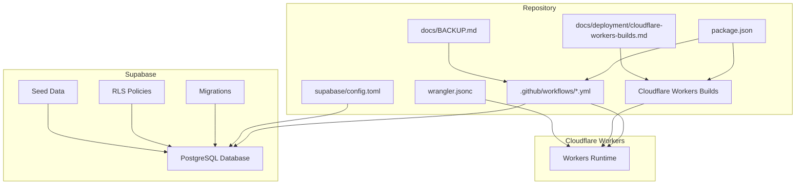
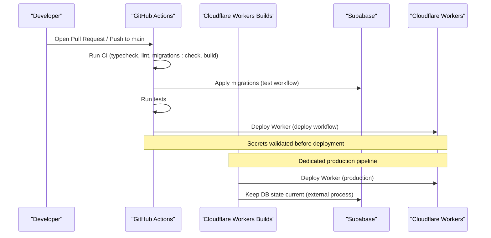
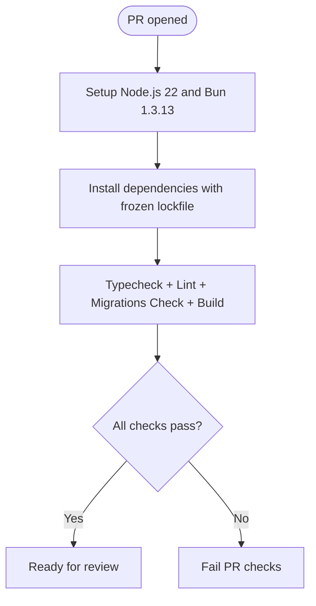
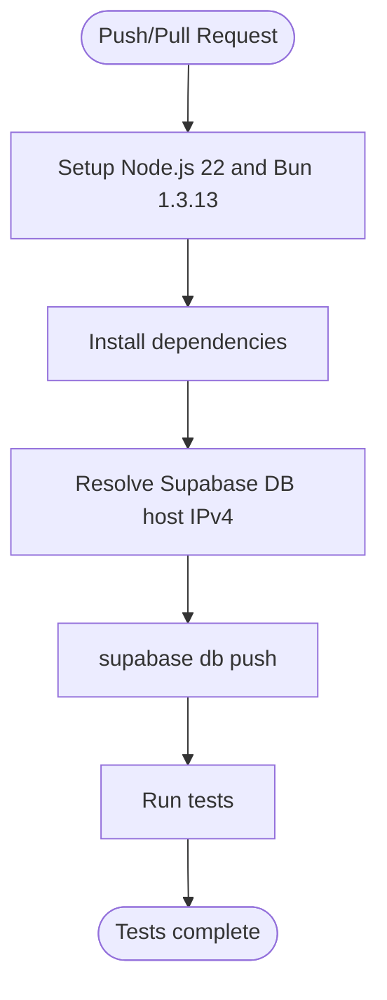
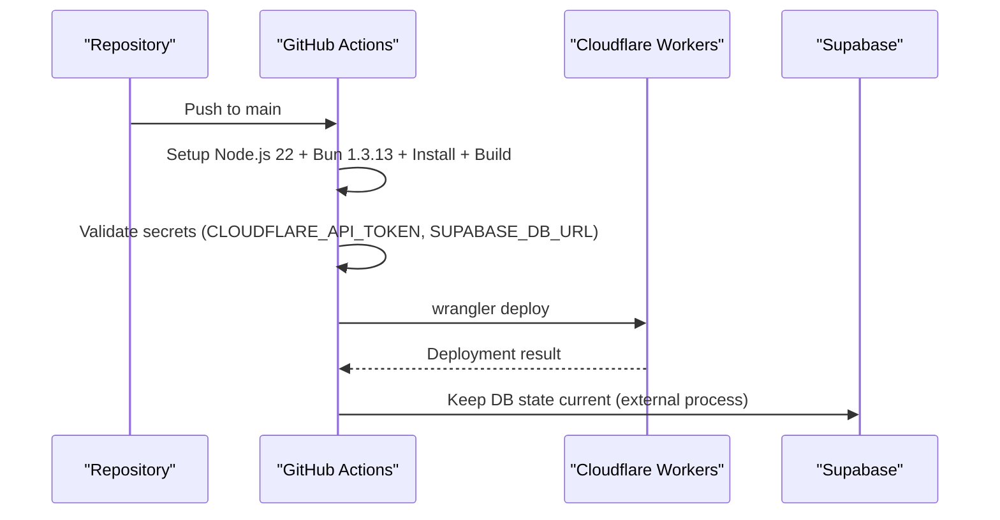
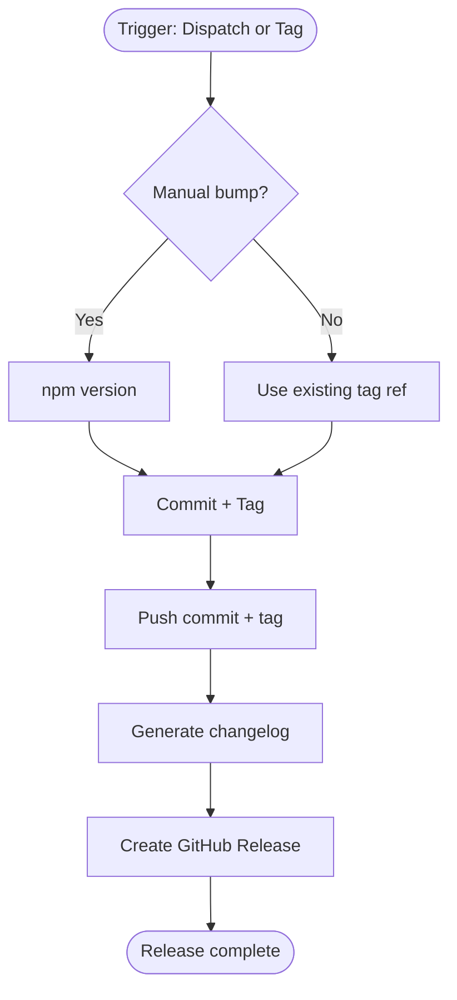
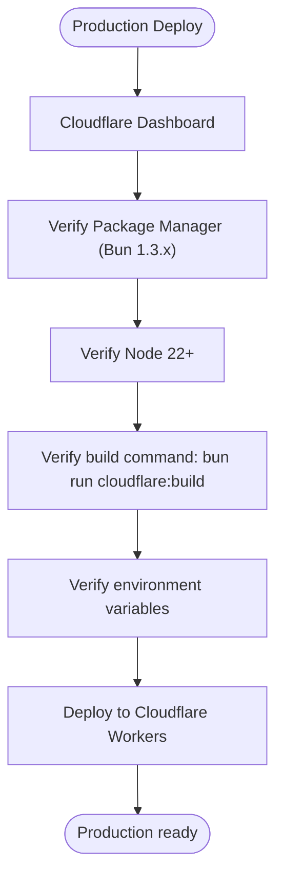
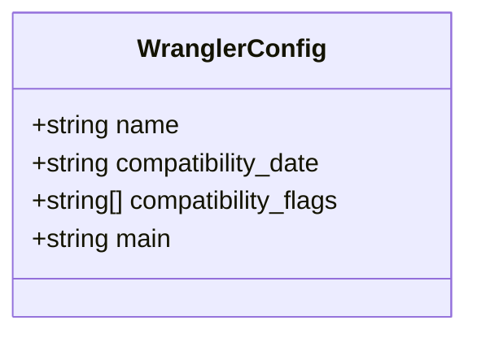
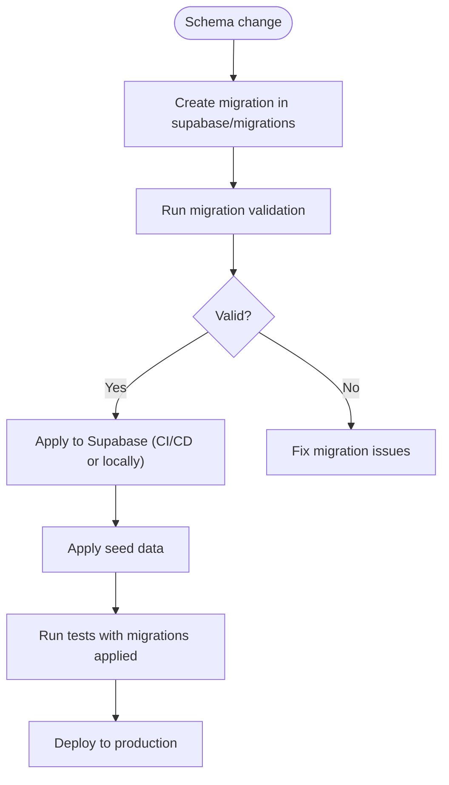
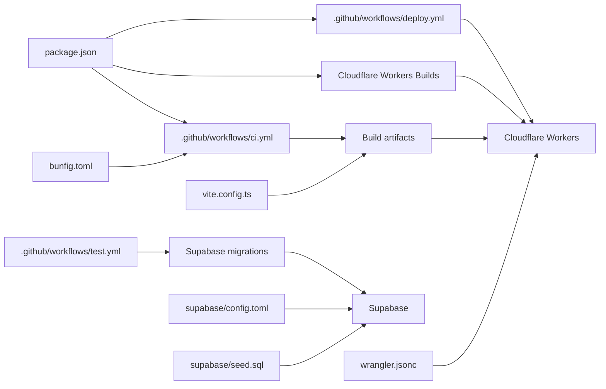

# Deployment and DevOps

<cite>
**Referenced Files in This Document**
- [ci.yml](file://.github/workflows/ci.yml)
- [deploy.yml](file://.github/workflows/deploy.yml)
- [release.yml](file://.github/workflows/release.yml)
- [test.yml](file://.github/workflows/test.yml)
- [wrangler.jsonc](file://wrangler.jsonc)
- [config.toml](file://supabase/config.toml)
- [package.json](file://package.json)
- [README.md](file://README.md)
- [bump.sh](file://scripts/bump.sh)
- [validate-migrations.mjs](file://scripts/validate-migrations.mjs)
- [BACKUP.md](file://docs/BACKUP.md)
- [cloudflare-workers-builds.md](file://docs/deployment/cloudflare-workers-builds.md)
- [20260430154500_ticket_code_sequence_trigger.sql](file://supabase/migrations/20260430154500_ticket_code_sequence_trigger.sql)
- [20260430143000_admin_user_management_rls.sql](file://supabase/migrations/20260430143000_admin_user_management_rls.sql)
- [seed.sql](file://supabase/seed.sql)
- [vite.config.ts](file://vite.config.ts)
- [bunfig.toml](file://bunfig.toml)
</cite>

## Update Summary
**Changes Made**
- Updated Cloudflare Workers build configuration documentation to include dedicated Cloudflare Workers Builds pipeline
- Enhanced deployment workflow documentation to clarify separation between GitHub Actions and Cloudflare Workers Builds
- Added comprehensive Cloudflare Workers build command configuration and troubleshooting guidance
- Updated environment variable management for both GitHub Actions and Cloudflare Workers Builds
- Expanded build optimization and chunk splitting documentation for Cloudflare Workers deployment

## Table of Contents
1. [Introduction](#introduction)
2. [Project Structure](#project-structure)
3. [Core Components](#core-components)
4. [Architecture Overview](#architecture-overview)
5. [Detailed Component Analysis](#detailed-component-analysis)
6. [Dependency Analysis](#dependency-analysis)
7. [Performance Considerations](#performance-considerations)
8. [Troubleshooting Guide](#troubleshooting-guide)
9. [Conclusion](#conclusion)
10. [Appendices](#appendices)

## Introduction
This document describes PCReady's production deployment and DevOps practices. It covers CI/CD via GitHub Actions, environment configuration, Cloudflare Workers deployment with Wrangler, Supabase database and RLS requirements, optional containerization and Kubernetes patterns, monitoring and logging approaches, backup and disaster recovery, security considerations, troubleshooting, and release management with version tagging.

**Updated** The project now uses Cloudflare Workers Builds as a dedicated deployment pipeline separate from GitHub Actions, providing more reliable and isolated deployment processes for Cloudflare Workers.

## Project Structure
PCReady is a frontend-heavy application built with React, TypeScript, TanStack Router/Start, Vite, and Supabase. The runtime is deployed to Cloudflare Workers using Wrangler. CI/CD is implemented with GitHub Actions workflows. Supabase manages the Postgres database, migrations, and Row Level Security (RLS) policies. The repository includes:
- GitHub Actions workflows for CI, tests, and deployment
- Dedicated Cloudflare Workers Builds pipeline for production deployments
- Wrangler configuration for Workers
- Supabase project configuration and migrations
- Scripts for version bumping and migration validation
- Documentation for backup and recovery

**Diagram sources**
- [ci.yml:1-44](file://.github/workflows/ci.yml#L1-L44)
- [deploy.yml:1-61](file://.github/workflows/deploy.yml#L1-L61)
- [cloudflare-workers-builds.md:1-76](file://docs/deployment/cloudflare-workers-builds.md#L1-L76)
- [wrangler.jsonc:1-8](file://wrangler.jsonc#L1-L8)
- [config.toml:1-1](file://supabase/config.toml#L1-L1)
- [package.json:1-119](file://package.json#L1-L119)
- [BACKUP.md:1-73](file://docs/BACKUP.md#L1-L73)

**Section sources**
- [README.md:1-159](file://README.md#L1-L159)
- [package.json:1-119](file://package.json#L1-L119)

## Core Components
- CI/CD with GitHub Actions:
  - Pull Request quality gate with typecheck, lint, migration validation, and build
  - Push-to-main deployment to Cloudflare Workers with secret validation
  - Test workflow applying Supabase migrations before running tests
  - Release workflow supporting manual bumps and tag-based releases
- Cloudflare Workers deployment:
  - Dedicated Cloudflare Workers Builds pipeline for production deployments
  - Wrangler configuration for compatibility date and server entry
  - Separate build commands for GitHub Actions vs Cloudflare Workers Builds
- Supabase:
  - Project configuration and migrations under supabase/migrations
  - RLS policies and triggers enforced by migrations
  - Seed data for email templates and initial configuration
- Release management:
  - Version bumping script and migration validation
  - Automated GitHub Releases with changelogs

**Section sources**
- [ci.yml:1-44](file://.github/workflows/ci.yml#L1-L44)
- [deploy.yml:1-61](file://.github/workflows/deploy.yml#L1-L61)
- [cloudflare-workers-builds.md:1-76](file://docs/deployment/cloudflare-workers-builds.md#L1-L76)
- [wrangler.jsonc:1-8](file://wrangler.jsonc#L1-L8)
- [config.toml:1-1](file://supabase/config.toml#L1-L1)
- [bump.sh:1-21](file://scripts/bump.sh#L1-L21)
- [validate-migrations.mjs:1-43](file://scripts/validate-migrations.mjs#L1-L43)

## Architecture Overview
The deployment pipeline integrates GitHub Actions, Cloudflare Workers Builds, Supabase, and Cloudflare Workers. The CI workflow validates code quality and builds artifacts for both GitHub Actions and Cloudflare Workers Builds. The test workflow ensures database state matches migrations before running tests. The deploy workflow pushes the built application to Cloudflare Workers after validating required secrets. The release workflow manages versioning and GitHub Releases.

**Updated** Cloudflare Workers Builds now operates as a separate, dedicated pipeline that handles production deployments independently from GitHub Actions, providing better isolation and reliability for Cloudflare-specific configurations.

**Diagram sources**
- [ci.yml:1-44](file://.github/workflows/ci.yml#L1-L44)
- [test.yml:1-47](file://.github/workflows/test.yml#L1-L47)
- [deploy.yml:1-61](file://.github/workflows/deploy.yml#L1-L61)
- [cloudflare-workers-builds.md:1-76](file://docs/deployment/cloudflare-workers-builds.md#L1-L76)

## Detailed Component Analysis

### CI Workflow
Purpose: Gate pull requests with quality checks and build verification.
- Triggers: Pull requests to main and develop
- Steps:
  - Setup Node.js 22 and Bun 1.3.13
  - Install dependencies with frozen lockfile
  - Typecheck, lint, migration validation, and build
- Environment: Exposes Supabase keys for migration checks and build-time validation

**Diagram sources**
- [ci.yml:1-44](file://.github/workflows/ci.yml#L1-L44)

**Section sources**
- [ci.yml:1-44](file://.github/workflows/ci.yml#L1-L44)

### Test Workflow
Purpose: Ensure database state is current before running tests.
- Triggers: Pushes to main/develop and pull requests
- Steps:
  - Setup Node.js 22 and Bun 1.3.13
  - Install dependencies
  - Resolve Supabase DB host IP and push migrations
  - Run test suite

**Diagram sources**
- [test.yml:1-47](file://.github/workflows/test.yml#L1-L47)

**Section sources**
- [test.yml:1-47](file://.github/workflows/test.yml#L1-L47)

### Deploy Workflow
Purpose: Deploy the built application to Cloudflare Workers on main branch pushes.
- Triggers: Pushes to main
- Steps:
  - Setup Node.js 22 and Bun 1.3.13
  - Install dependencies and build
  - Validate required secrets (Cloudflare API token and Supabase DB URL)
  - Deploy using Wrangler

**Diagram sources**
- [deploy.yml:1-61](file://.github/workflows/deploy.yml#L1-L61)

**Section sources**
- [deploy.yml:1-61](file://.github/workflows/deploy.yml#L1-L61)

### Release Workflow
Purpose: Automate version bumping, tagging, and GitHub Releases.
- Triggers: Manual dispatch or push to semantic version tags
- Steps:
  - Configure Git user
  - Optional manual bump (patch/minor/major)
  - Commit and tag version
  - Push commit and tag
  - Generate changelog
  - Create GitHub Release

**Diagram sources**
- [release.yml:1-96](file://.github/workflows/release.yml#L1-L96)
- [bump.sh:1-21](file://scripts/bump.sh#L1-L21)

**Section sources**
- [release.yml:1-96](file://.github/workflows/release.yml#L1-L96)
- [bump.sh:1-21](file://scripts/bump.sh#L1-L21)

### Cloudflare Workers Builds Pipeline
Purpose: Dedicated production deployment pipeline for Cloudflare Workers with isolated configuration.
- Separates production deployments from GitHub Actions CI/CD
- Uses dedicated build commands and environment variables
- Provides independent troubleshooting and monitoring
- Maintains separate configuration from GitHub Actions workflows

**Updated** Cloudflare Workers Builds operates independently from GitHub Actions, allowing for more reliable production deployments with dedicated configuration management and troubleshooting capabilities.

**Diagram sources**
- [cloudflare-workers-builds.md:1-76](file://docs/deployment/cloudflare-workers-builds.md#L1-L76)

**Section sources**
- [cloudflare-workers-builds.md:1-76](file://docs/deployment/cloudflare-workers-builds.md#L1-L76)

### Wrangler Configuration
Purpose: Define Cloudflare Workers runtime settings for the application.
- Name, compatibility date, compatibility flags, and server entry point
- Integrates with TanStack Start server entry

**Diagram sources**
- [wrangler.jsonc:1-8](file://wrangler.jsonc#L1-L8)

**Section sources**
- [wrangler.jsonc:1-8](file://wrangler.jsonc#L1-L8)

### Supabase Configuration and Migrations
Purpose: Manage database schema, policies, and data consistency.
- Project identifier configured
- Migrations stored under supabase/migrations with strict validation
- Validation script enforces naming, emptiness, merge conflict markers, and dollar-quoted blocks balance
- Seed data provides initial email templates and configuration
- README documents migration requirements and client behavior expectations

**Diagram sources**
- [config.toml:1-1](file://supabase/config.toml#L1-L1)
- [validate-migrations.mjs:1-43](file://scripts/validate-migrations.mjs#L1-L43)
- [README.md:104-111](file://README.md#L104-L111)
- [seed.sql:1-44](file://supabase/seed.sql#L1-L44)

**Section sources**
- [config.toml:1-1](file://supabase/config.toml#L1-L1)
- [validate-migrations.mjs:1-43](file://scripts/validate-migrations.mjs#L1-L43)
- [README.md:104-111](file://README.md#L104-L111)
- [seed.sql:1-44](file://supabase/seed.sql#L1-L44)

### Environment Configuration Management
- Local development uses Bun and environment variables for Supabase client/server keys
- CI exposes Supabase secrets for migration checks and build-time validations
- Production deployment requires Cloudflare API token and account ID, plus Supabase DB URL
- Cloudflare Workers Builds maintains separate environment variable configuration

**Updated** Environment variables are now managed separately for GitHub Actions CI/CD and Cloudflare Workers Builds, with distinct configuration requirements for each deployment pipeline.

Key environment variables observed in workflows:
- SUPABASE_URL, SUPABASE_PUBLISHABLE_KEY, SUPABASE_SERVICE_ROLE_KEY
- VITE_SUPABASE_URL, VITE_SUPABASE_PUBLISHABLE_KEY
- SUPABASE_DB_URL
- CLOUDFLARE_API_TOKEN, CLOUDFLARE_ACCOUNT_ID

**Section sources**
- [ci.yml:12-18](file://.github/workflows/ci.yml#L12-L18)
- [test.yml:11-17](file://.github/workflows/test.yml#L11-L17)
- [deploy.yml:10-16](file://.github/workflows/deploy.yml#L10-L16)
- [cloudflare-workers-builds.md:34-43](file://docs/deployment/cloudflare-workers-builds.md#L34-L43)

### Containerization and Kubernetes Deployment Patterns
- Current deployment targets Cloudflare Workers via Wrangler
- No Docker/Kubernetes manifests are present in the repository
- Recommendation: For Kubernetes, define a minimal container image with built assets and expose a health check endpoint; mount configuration via ConfigMaps/Secrets; use a Deployment with readiness/liveness probes; and a Service/Ingress for exposure

### Monitoring and Logging
- Error tracking: Integrate an external error tracking service (e.g., Sentry) in the application entrypoint
- Performance monitoring: Use a CDN-level analytics solution (e.g., Cloudflare Analytics) and application-level metrics via a telemetry library
- User analytics: Track page views and key events; ensure compliance with privacy regulations

### Backup and Disaster Recovery
- Supabase-managed backups: Daily automated backups, PITR on higher tiers, WAL replication, and geo-redundant storage
- Operational targets: RTO/RPO targets depend on provider configuration
- Manual exports: Admin UI provides a ZIP export of primary datasets; useful for audits and offline copies
- Recovery procedure: Identify incident, collect details, contact support, verify available restore point, validate restored data, promote or reimport, and document

**Section sources**
- [BACKUP.md:1-73](file://docs/BACKUP.md#L1-L73)
- [README.md:119-124](file://README.md#L119-L124)

### Security Considerations
- Secrets management: Store all secrets in GitHub Actions and Cloudflare/Supabase secret managers; avoid committing secrets to the repository
- Access control: Enforce Supabase RLS policies; restrict Cloudflare Worker access to necessary APIs; rotate tokens regularly
- SSL/TLS: Cloudflare terminates TLS at the edge; ensure backend APIs use HTTPS; configure appropriate headers and security policies
- Least privilege: Limit Supabase service role usage; prefer client credentials for user-facing operations

### Troubleshooting Guide
Common deployment issues and resolutions:
- Missing secrets during deploy:
  - Verify CLOUDFLARE_API_TOKEN and SUPABASE_DB_URL are set in repository secrets
  - Confirm environment variables are correctly referenced in the deploy workflow
- Migration failures:
  - Run migration validation locally to catch invalid filenames, empty files, merge conflicts, or unbalanced dollar-quoted blocks
  - Ensure migrations are applied before running tests
- Build failures:
  - Confirm Node.js and Bun versions match CI; use frozen lockfile installs
- Cloudflare Workers Builds specific issues:
  - Verify package manager alignment (Bun 1.3.x) in Cloudflare dashboard
  - Check build command matches `bun run cloudflare:build`
  - Ensure environment variables are configured in Cloudflare Workers Builds
- Rollback procedures:
  - Cloudflare Workers: Use Wrangler to redeploy a previous version or rollback traffic routing
  - Supabase: Use point-in-time recovery to revert to a known good state
- Performance optimization:
  - Minimize payload sizes; leverage CDN caching; optimize database queries and indexes

**Updated** Added specific troubleshooting guidance for Cloudflare Workers Builds pipeline, including package manager verification, build command validation, and environment variable configuration.

**Section sources**
- [deploy.yml:42-61](file://.github/workflows/deploy.yml#L42-L61)
- [validate-migrations.mjs:1-43](file://scripts/validate-migrations.mjs#L1-L43)
- [test.yml:35-44](file://.github/workflows/test.yml#L35-L44)
- [cloudflare-workers-builds.md:45-76](file://docs/deployment/cloudflare-workers-builds.md#L45-L76)

### Release Management and Version Tagging
- Version bumping: Use the release workflow to bump patch/minor/major versions and create annotated tags
- Changelog generation: Automatically generated from git history for the release range
- GitHub Releases: Created with release notes and tags for traceability

**Section sources**
- [release.yml:1-96](file://.github/workflows/release.yml#L1-L96)
- [bump.sh:1-21](file://scripts/bump.sh#L1-L21)

### Build Optimization and Chunk Splitting
Purpose: Optimize Cloudflare Workers bundle size and performance through strategic chunk splitting.
- Manual chunk grouping for PDF generation, charts, drag-and-drop, flow diagrams, Swagger UI, and Radix UI components
- Vendor-specific chunk names for better cacheability
- Optimized dependency analysis for server-side rendering

**Updated** Added comprehensive build optimization documentation covering chunk splitting strategies and vendor-specific bundling for Cloudflare Workers deployment.

**Section sources**
- [vite.config.ts:17-38](file://vite.config.ts#L17-L38)
- [package.json:18-19](file://package.json#L18-L19)

## Dependency Analysis
The deployment pipeline depends on:
- GitHub Actions for orchestration and CI/CD
- Cloudflare Workers Builds for production deployments
- Supabase for database and migrations
- Cloudflare Workers for hosting
- Bun and Node.js for build/runtime

**Updated** Added Cloudflare Workers Builds as a separate dependency for production deployments, operating independently from GitHub Actions.

**Diagram sources**
- [ci.yml:1-44](file://.github/workflows/ci.yml#L1-L44)
- [test.yml:1-47](file://.github/workflows/test.yml#L1-L47)
- [deploy.yml:1-61](file://.github/workflows/deploy.yml#L1-L61)
- [cloudflare-workers-builds.md:1-76](file://docs/deployment/cloudflare-workers-builds.md#L1-L76)
- [config.toml:1-1](file://supabase/config.toml#L1-L1)
- [wrangler.jsonc:1-8](file://wrangler.jsonc#L1-L8)
- [package.json:1-119](file://package.json#L1-L119)
- [seed.sql:1-44](file://supabase/seed.sql#L1-L44)
- [vite.config.ts:1-58](file://vite.config.ts#L1-L58)
- [bunfig.toml:1-3](file://bunfig.toml#L1-L3)

**Section sources**
- [ci.yml:1-44](file://.github/workflows/ci.yml#L1-L44)
- [test.yml:1-47](file://.github/workflows/test.yml#L1-L47)
- [deploy.yml:1-61](file://.github/workflows/deploy.yml#L1-L61)
- [cloudflare-workers-builds.md:1-76](file://docs/deployment/cloudflare-workers-builds.md#L1-L76)
- [config.toml:1-1](file://supabase/config.toml#L1-L1)
- [wrangler.jsonc:1-8](file://wrangler.jsonc#L1-L8)
- [package.json:1-119](file://package.json#L1-L119)

## Performance Considerations
- Optimize build times by caching dependencies and using parallel jobs where appropriate
- Minimize Worker bundle size through strategic chunk splitting and vendor-specific bundling
- Enable compression and cache headers for optimal delivery
- Use Supabase query optimization and indexes; avoid N+1 queries
- Monitor Worker execution time and cold starts; consider warm-up strategies if needed
- Leverage Cloudflare's edge network for global performance

**Updated** Enhanced performance considerations to include Cloudflare Workers-specific optimizations such as chunk splitting and edge network utilization.

## Troubleshooting Guide
- CI fails on migration validation:
  - Inspect migration filenames and content; fix invalid timestamps, empty files, merge conflicts, or unbalanced dollar-quoted blocks
- Tests fail due to missing migrations:
  - Ensure migrations are applied before running tests; verify DB URL resolution and connectivity
- Deployment blocked by missing secrets:
  - Add CLOUDFLARE_API_TOKEN and SUPABASE_DB_URL to repository secrets; confirm environment variable names in the deploy workflow
- Cloudflare Workers Builds specific issues:
  - Verify package manager alignment (Bun 1.3.x) in Cloudflare dashboard
  - Check build command matches `bun run cloudflare:build`
  - Ensure environment variables are configured in Cloudflare Workers Builds
- Rollback:
  - Re-deploy a known-good Worker version; use Supabase point-in-time recovery

**Updated** Added comprehensive troubleshooting guidance for Cloudflare Workers Builds pipeline, including package manager verification, build command validation, and environment variable configuration.

**Section sources**
- [validate-migrations.mjs:1-43](file://scripts/validate-migrations.mjs#L1-L43)
- [test.yml:35-44](file://.github/workflows/test.yml#L35-L44)
- [deploy.yml:42-61](file://.github/workflows/deploy.yml#L42-L61)
- [cloudflare-workers-builds.md:45-76](file://docs/deployment/cloudflare-workers-builds.md#L45-L76)

## Conclusion
PCReady's deployment pipeline leverages GitHub Actions for CI/CD, Cloudflare Workers Builds for production deployments, Supabase for database operations, and Cloudflare Workers for hosting. The workflows enforce quality gates, validate migrations, and automate releases. The introduction of Cloudflare Workers Builds provides a dedicated, isolated deployment pipeline for production environments. For production hardening, complement the existing setup with robust error tracking, performance monitoring, and security best practices. Disaster recovery relies on Supabase-managed backups with manual export capabilities for audits.

**Updated** The conclusion now emphasizes the benefits of the dedicated Cloudflare Workers Builds pipeline for production deployments, highlighting improved isolation and reliability compared to traditional GitHub Actions-only deployments.

## Appendices

### Appendix A: Environment Variables Reference
- Supabase:
  - SUPABASE_URL
  - SUPABASE_PUBLISHABLE_KEY
  - SUPABASE_SERVICE_ROLE_KEY
  - VITE_SUPABASE_URL
  - VITE_SUPABASE_PUBLISHABLE_KEY
  - SUPABASE_DB_URL
- Cloudflare:
  - CLOUDFLARE_API_TOKEN
  - CLOUDFLARE_ACCOUNT_ID
- Cloudflare Workers Builds:
  - Dedicated environment variable configuration in Cloudflare dashboard

**Updated** Added Cloudflare Workers Builds environment variable management to the reference.

**Section sources**
- [ci.yml:12-18](file://.github/workflows/ci.yml#L12-L18)
- [test.yml:11-17](file://.github/workflows/test.yml#L11-L17)
- [deploy.yml:10-16](file://.github/workflows/deploy.yml#L10-L16)
- [cloudflare-workers-builds.md:34-43](file://docs/deployment/cloudflare-workers-builds.md#L34-L43)

### Appendix B: Cloudflare Workers Build Commands
- Primary build command: `bun run cloudflare:build`
- Dry-run deployment: `bun run cloudflare:deploy:dry-run`
- Development build: `bun run build`
- Production build: `bun run cloudflare:build`

**Updated** Added comprehensive build command documentation for different deployment scenarios.

**Section sources**
- [package.json:18-19](file://package.json#L18-L19)
- [cloudflare-workers-builds.md:8-12](file://docs/deployment/cloudflare-workers-builds.md#L8-L12)

### Appendix C: Supabase Migration Examples
Key migration patterns and examples:

**Ticket Code Generation**
- Uses PostgreSQL sequences and triggers for unique ticket codes
- Prevents race conditions in concurrent insert operations
- Generates codes in format PCT-NNNNN

**Admin RLS Policies**
- Enforces role-based access control for admin users
- Provides selective read/update permissions based on user roles
- Uses custom has_role function for role checking

**Section sources**
- [20260430154500_ticket_code_sequence_trigger.sql:1-42](file://supabase/migrations/20260430154500_ticket_code_sequence_trigger.sql#L1-L42)
- [20260430143000_admin_user_management_rls.sql:1-13](file://supabase/migrations/20260430143000_admin_user_management_rls.sql#L1-L13)

### Appendix D: Database Seeding
Initial data setup for development and testing:
- Email templates for user invitations, password resets, and notifications
- Predefined email template variables and content
- Idempotent seed operations with conflict handling

**Section sources**
- [seed.sql:1-44](file://supabase/seed.sql#L1-L44)

### Appendix E: Build Optimization Strategies
- Strategic chunk splitting for vendor libraries
- Manual chunk grouping for PDF generation, charts, drag-and-drop, flow diagrams, and UI components
- Optimized dependency analysis for server-side rendering
- Vendor-specific chunk naming for better cacheability

**Updated** Added comprehensive build optimization documentation for Cloudflare Workers deployment.

**Section sources**
- [vite.config.ts:17-38](file://vite.config.ts#L17-L38)
- [package.json:18-19](file://package.json#L18-L19)