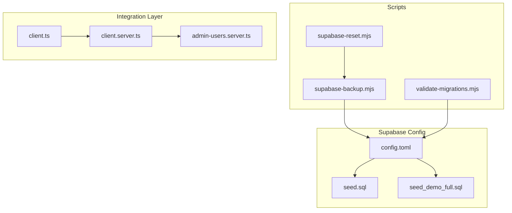
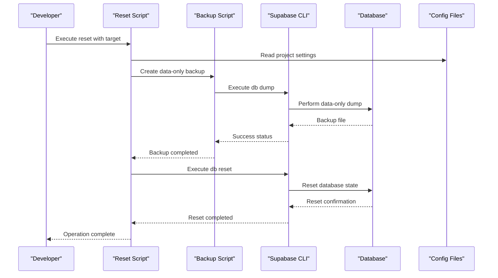
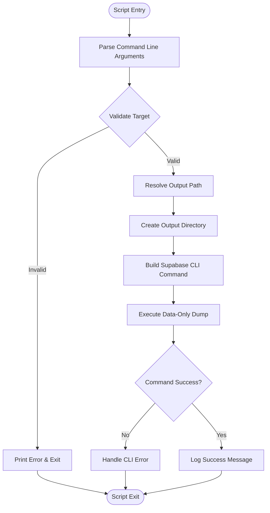
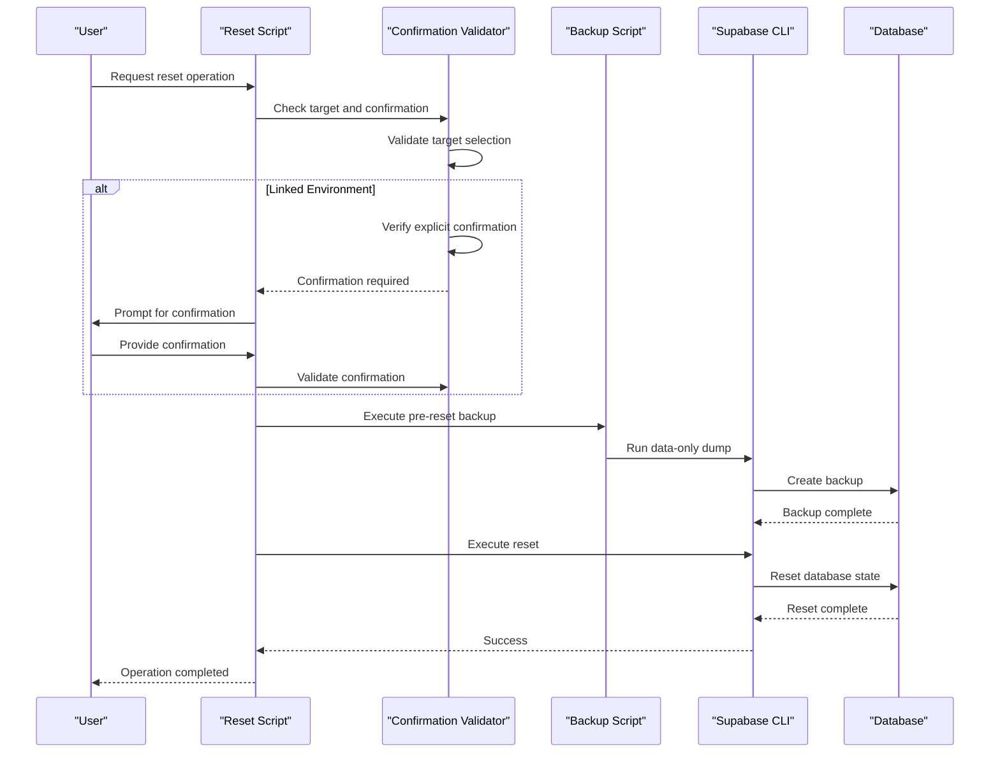
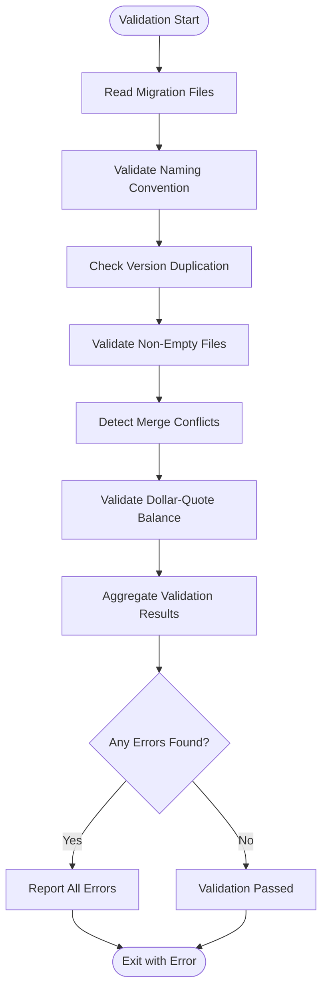
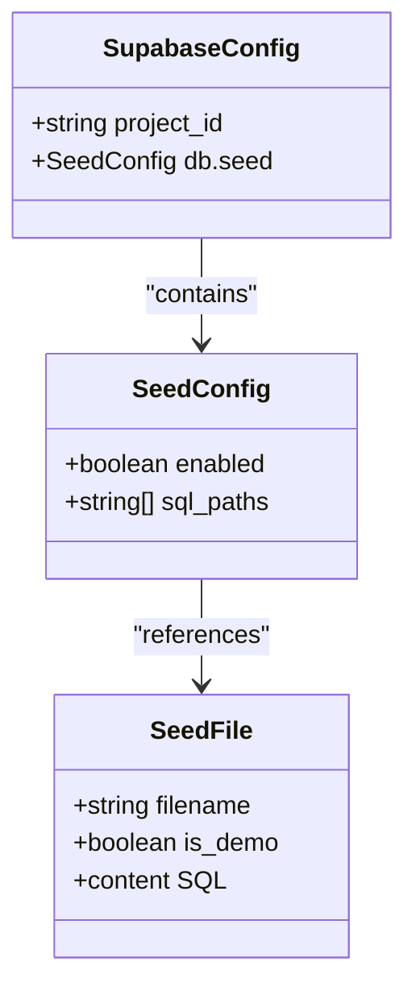
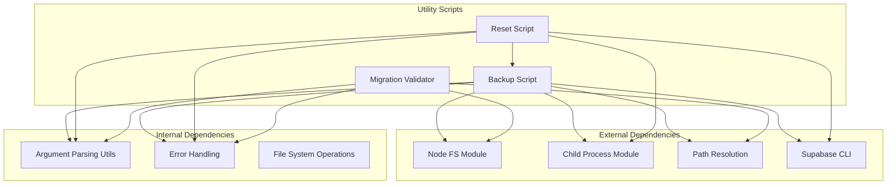

# Database Management Utilities

<cite>
**Referenced Files in This Document**
- [supabase-backup.mjs](file://scripts/supabase-backup.mjs)
- [supabase-reset.mjs](file://scripts/supabase-reset.mjs)
- [validate-migrations.mjs](file://scripts/validate-migrations.mjs)
- [config.toml](file://supabase/config.toml)
- [seed.sql](file://supabase/seed.sql)
- [seed_demo_full.sql](file://supabase/seed_demo_full.sql)
- [client.server.ts](file://src/integrations/supabase/client.server.ts)
- [client.ts](file://src/integrations/supabase/client.ts)
- [admin-users.server.ts](file://src/lib/admin-users.server.ts)
</cite>

## Table of Contents

1. [Introduction](#introduction)
2. [Project Structure](#project-structure)
3. [Core Components](#core-components)
4. [Architecture Overview](#architecture-overview)
5. [Detailed Component Analysis](#detailed-component-analysis)
6. [Dependency Analysis](#dependency-analysis)
7. [Performance Considerations](#performance-considerations)
8. [Troubleshooting Guide](#troubleshooting-guide)
9. [Conclusion](#conclusion)

## Introduction

This document provides comprehensive documentation for the Database Management Utilities within the project. It focuses on the database backup, reset, and migration validation scripts, along with the Supabase configuration and seeding mechanisms. These utilities enable safe and repeatable database operations for both local development and linked environments, ensuring data integrity and operational reliability.

## Project Structure

The database management utilities are organized across several key areas:

- Scripts directory: Contains Node.js scripts for backup, reset, and migration validation
- Supabase configuration: Defines project settings and seed file paths
- Seed files: Provide initial data for development and demonstration
- Supabase client integrations: Server-side and client-side database connections
- Administrative utilities: Role-based access control enforcement

**Diagram sources**

- [supabase-backup.mjs](file://scripts/supabase-backup.mjs)
- [supabase-reset.mjs](file://scripts/supabase-reset.mjs)
- [validate-migrations.mjs](file://scripts/validate-migrations.mjs)
- [config.toml](file://supabase/config.toml)
- [seed.sql](file://supabase/seed.sql)
- [seed_demo_full.sql](file://supabase/seed_demo_full.sql)
- [client.server.ts](file://src/integrations/supabase/client.server.ts)
- [client.ts](file://src/integrations/supabase/client.ts)
- [admin-users.server.ts](file://src/lib/admin-users.server.ts)

**Section sources**

- [supabase-backup.mjs](file://scripts/supabase-backup.mjs)
- [supabase-reset.mjs](file://scripts/supabase-reset.mjs)
- [validate-migrations.mjs](file://scripts/validate-migrations.mjs)
- [config.toml](file://supabase/config.toml)

## Core Components

This section outlines the primary database management utilities and their responsibilities:

### Backup Utility

The backup script performs data-only dumps of Supabase databases, supporting both local and linked targets with timestamped filenames and configurable output paths.

### Reset Utility

The reset script orchestrates safe database resets by first backing up data (unless skipped) and then applying configured migrations and seeds. It includes safety checks for linked environments requiring explicit confirmation.

### Migration Validation

The validation script ensures migration files adhere to naming conventions, contain valid SQL without conflicts, and maintain balanced dollar-quoted blocks.

### Supabase Configuration

The configuration file defines project identifiers and seed file locations, enabling automated data initialization during reset operations.

**Section sources**

- [supabase-backup.mjs](file://scripts/supabase-backup.mjs)
- [supabase-reset.mjs](file://scripts/supabase-reset.mjs)
- [validate-migrations.mjs](file://scripts/validate-migrations.mjs)
- [config.toml](file://supabase/config.toml)

## Architecture Overview

The database management utilities follow a layered architecture with clear separation of concerns:

**Diagram sources**

- [supabase-reset.mjs](file://scripts/supabase-reset.mjs)
- [supabase-backup.mjs](file://scripts/supabase-backup.mjs)
- [config.toml](file://supabase/config.toml)

The architecture emphasizes:

- **Safety-first design**: Automatic backups before destructive operations
- **Environment awareness**: Target-specific handling for local vs linked databases
- **Validation pipeline**: Pre-flight checks for migration integrity
- **Configuration-driven operations**: Centralized settings for reproducible results

## Detailed Component Analysis

### Backup Utility Analysis

The backup utility implements a robust data-only dumping mechanism with comprehensive error handling and user feedback.

**Diagram sources**

- [supabase-backup.mjs](file://scripts/supabase-backup.mjs)

Key features include:

- **Flexible targeting**: Supports both local and linked Supabase projects
- **Timestamped naming**: Automatic ISO timestamp insertion for unique filenames
- **Structured output**: Creates dedicated backup directories with proper permissions
- **Comprehensive logging**: Detailed command execution tracing for debugging

**Section sources**

- [supabase-backup.mjs](file://scripts/supabase-backup.mjs)

### Reset Utility Analysis

The reset utility coordinates complex database operations with extensive safety checks and user confirmation mechanisms.

**Diagram sources**

- [supabase-reset.mjs](file://scripts/supabase-reset.mjs)

Safety mechanisms include:

- **Linked environment protection**: Requires explicit confirmation flag for remote resets
- **Conditional backup execution**: Can skip backup when explicitly requested
- **Environment variable support**: Accepts confirmation via environment variables
- **Comprehensive error reporting**: Distinguishes between CLI availability and execution failures

**Section sources**

- [supabase-reset.mjs](file://scripts/supabase-reset.mjs)

### Migration Validation Analysis

The validation utility enforces strict standards for migration file integrity and naming conventions.

**Diagram sources**

- [validate-migrations.mjs](file://scripts/validate-migrations.mjs)

Validation criteria encompass:

- **Timestamp-based naming**: Enforces YYYYMMDDHHMMSS\_ naming pattern
- **Version uniqueness**: Prevents duplicate migration versions
- **Content integrity**: Ensures non-empty, conflict-free SQL files
- **Syntax correctness**: Validates balanced dollar-quoted blocks

**Section sources**

- [validate-migrations.mjs](file://scripts/validate-migrations.mjs)

### Supabase Configuration Analysis

The configuration system centralizes database settings and seed management for reproducible deployments.

**Diagram sources**

- [config.toml](file://supabase/config.toml)
- [seed.sql](file://supabase/seed.sql)
- [seed_demo_full.sql](file://supabase/seed_demo_full.sql)

Configuration highlights:

- **Project identification**: Unique project identifier for Supabase instances
- **Seed orchestration**: Controls automatic seed execution during reset operations
- **Multi-file support**: Handles both basic and comprehensive demo datasets

**Section sources**

- [config.toml](file://supabase/config.toml)
- [seed.sql](file://supabase/seed.sql)
- [seed_demo_full.sql](file://supabase/seed_demo_full.sql)

## Dependency Analysis

The database management utilities exhibit well-defined dependencies and minimal coupling between components.

**Diagram sources**

- [supabase-backup.mjs](file://scripts/supabase-backup.mjs)
- [supabase-reset.mjs](file://scripts/supabase-reset.mjs)
- [validate-migrations.mjs](file://scripts/validate-migrations.mjs)

Dependency characteristics:

- **Minimal external coupling**: Relies primarily on Node.js built-ins and Supabase CLI
- **Shared utilities**: Common argument parsing and error handling across scripts
- **Sequential operations**: Reset depends on backup functionality
- **Configuration-driven**: All scripts read from centralized configuration files

**Section sources**

- [supabase-backup.mjs](file://scripts/supabase-backup.mjs)
- [supabase-reset.mjs](file://scripts/supabase-reset.mjs)
- [validate-migrations.mjs](file://scripts/validate-migrations.mjs)

## Performance Considerations

The database management utilities are designed for operational reliability rather than high-throughput performance. Key considerations include:

- **Backup efficiency**: Data-only dumps minimize storage requirements while preserving complete dataset state
- **Validation overhead**: Migration validation adds minimal runtime cost compared to database operations
- **CLI integration**: Direct Supabase CLI invocation ensures optimal database interaction performance
- **Memory usage**: Scripts use streaming approaches for file operations to minimize memory footprint

## Troubleshooting Guide

### Common Issues and Solutions

**Backup Script Failures**

- **Symptom**: Backup script exits with CLI error
- **Cause**: Supabase CLI not installed or not in PATH
- **Solution**: Install Supabase CLI globally and ensure it's accessible in the current PATH

**Reset Operation Blocked**

- **Symptom**: Reset script requests explicit confirmation for linked environments
- **Cause**: Security mechanism preventing accidental data loss in production environments
- **Solution**: Provide confirmation flag or environment variable as documented in help output

**Migration Validation Errors**

- **Symptom**: Validation fails with naming or syntax errors
- **Cause**: Migration files violate naming conventions or contain SQL syntax issues
- **Solution**: Fix file naming to match timestamp pattern and resolve SQL syntax problems

**Configuration Issues**

- **Symptom**: Scripts cannot locate seed files or project settings
- **Cause**: Missing or incorrect configuration in TOML file
- **Solution**: Verify project_id and sql_paths in config.toml match actual file locations

**Section sources**

- [supabase-backup.mjs](file://scripts/supabase-backup.mjs)
- [supabase-reset.mjs](file://scripts/supabase-reset.mjs)
- [validate-migrations.mjs](file://scripts/validate-migrations.mjs)

## Conclusion

The Database Management Utilities provide a comprehensive toolkit for safe and reliable database operations. The backup, reset, and validation scripts work together to ensure data integrity while maintaining operational flexibility across different environments. The configuration-driven approach enables reproducible deployments, while the safety mechanisms protect against accidental data loss. These utilities form the foundation for robust database lifecycle management in the project.
