# Release Automation System

<cite>
**Referenced Files in This Document**
- [release.yml](file://.github/workflows/release.yml)
- [bump.sh](file://scripts/bump.sh)
- [update-changelog.sh](file://scripts/update-changelog.sh)
- [package.json](file://package.json)
- [ci.yml](file://.github/workflows/ci.yml)
- [deploy.yml](file://.github/workflows/deploy.yml)
- [test.yml](file://.github/workflows/test.yml)
- [lighthouse.yml](file://.github/workflows/lighthouse.yml)
- [healthcheck.sh](file://scripts/ci/healthcheck.sh)
- [CHANGELOG.md](file://CHANGELOG.md)
- [supabase-backup.mjs](file://scripts/supabase-backup.mjs)
- [supabase-reset.mjs](file://scripts/supabase-reset.mjs)
- [validate-migrations.mjs](file://scripts/validate-migrations.mjs)
- [wrangler.jsonc](file://wrangler.jsonc)
- [lighthouse-budget.json](file://lighthouse-budget.json)
- [lighthouse-budget-phase1.json](file://lighthouse-budget-phase1.json)
- [lighthouse-budget-phase2.json](file://lighthouse-budget-phase2.json)
- [lighthouse-budget-phase3.json](file://lighthouse-budget-phase3.json)
</cite>

## Update Summary
**Changes Made**
- Added comprehensive documentation for the new post-deploy healthcheck system
- Updated deployment pipeline to include mandatory healthcheck validation
- Enhanced Lighthouse CI workflow with integrated healthcheck requirements
- Documented healthcheck script capabilities including DNS resolution and warmup functionality

## Table of Contents
1. [Introduction](#introduction)
2. [System Architecture](#system-architecture)
3. [Core Release Components](#core-release-components)
4. [Version Management](#version-management)
5. [Changelog Automation](#changelog-automation)
6. [Release Workflows](#release-workflows)
7. [Deployment Pipeline](#deployment-pipeline)
8. [Quality Assurance](#quality-assurance)
9. [Post-Deployment Validation](#post-deployment-validation)
10. [Database Operations](#database-operations)
11. [Performance Considerations](#performance-considerations)
12. [Troubleshooting Guide](#troubleshooting-guide)
13. [Conclusion](#conclusion)

## Introduction

The PCReady Release Automation System is a comprehensive CI/CD pipeline designed to automate version management, changelog generation, release creation, and deployment processes. Built with modern DevOps practices, this system ensures consistent, reliable releases while maintaining code quality and operational excellence.

The system leverages GitHub Actions for orchestration, Bun as the primary package manager, and Cloudflare Workers for deployment. It incorporates automated testing, quality checks, and post-deployment validation to guarantee production-ready releases.

**Updated** Enhanced with comprehensive post-deploy healthcheck system featuring DNS resolution, HTTP status verification, and warmup requests.

## System Architecture

The release automation system follows a multi-stage pipeline architecture with clear separation of concerns:

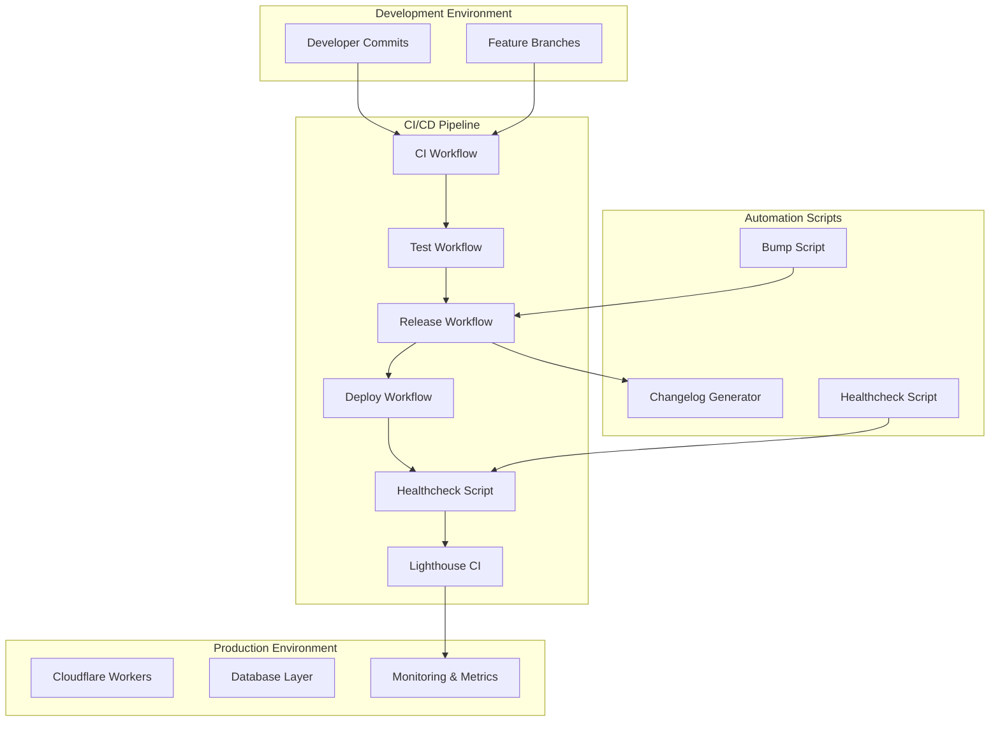

**Diagram sources**
- [release.yml:1-132](file://.github/workflows/release.yml#L1-L132)
- [ci.yml:1-44](file://.github/workflows/ci.yml#L1-L44)
- [deploy.yml:1-61](file://.github/workflows/deploy.yml#L1-L61)
- [lighthouse.yml:1-39](file://.github/workflows/lighthouse.yml#L1-L39)

The architecture consists of four primary stages:
- **Development Stage**: Code commits and feature branches
- **Quality Assurance Stage**: Automated testing and validation
- **Release Stage**: Version management and artifact creation
- **Deployment Stage**: Production deployment with mandatory healthcheck validation

## Core Release Components

### GitHub Actions Workflows

The system utilizes five primary GitHub Actions workflows that work together to create a seamless release pipeline:

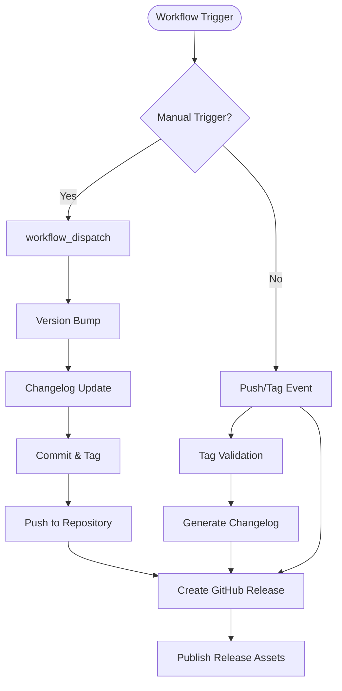

**Diagram sources**
- [release.yml:3-17](file://.github/workflows/release.yml#L3-L17)

**Section sources**
- [release.yml:1-132](file://.github/workflows/release.yml#L1-L132)
- [ci.yml:1-44](file://.github/workflows/ci.yml#L1-L44)
- [test.yml:1-55](file://.github/workflows/test.yml#L1-L55)
- [deploy.yml:1-61](file://.github/workflows/deploy.yml#L1-L61)
- [lighthouse.yml:1-39](file://.github/workflows/lighthouse.yml#L1-L39)

### Package Management Integration

The system integrates tightly with npm for version management and Bun for dependency handling:

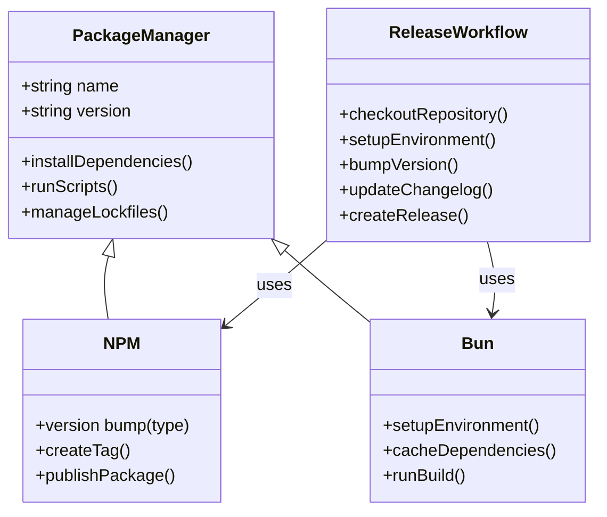

**Diagram sources**
- [package.json:11-32](file://package.json#L11-L32)
- [release.yml:33-51](file://.github/workflows/release.yml#L33-L51)

**Section sources**
- [package.json:1-125](file://package.json#L1-125)

## Version Management

### Semantic Versioning Implementation

The release system implements semantic versioning with three bump types: patch, minor, and major. The version management process is automated and consistent across all environments.

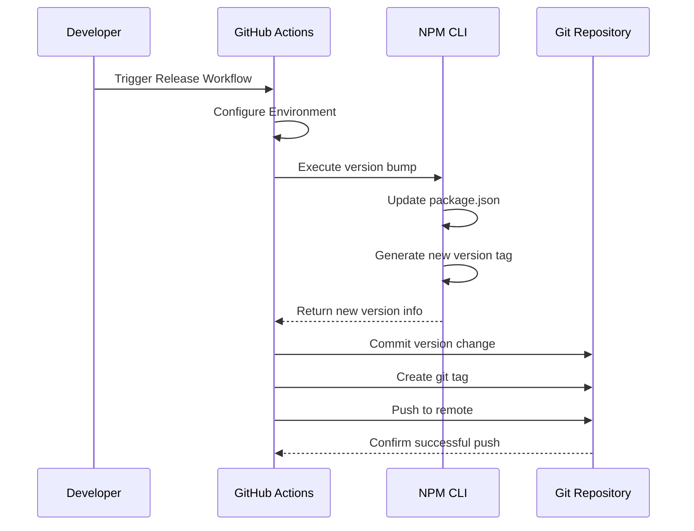

**Diagram sources**
- [bump.sh:10-22](file://scripts/bump.sh#L10-L22)
- [release.yml:58-95](file://.github/workflows/release.yml#L58-L95)

### Version Bump Types

The system supports three distinct version bump types:

| Bump Type | Purpose | When to Use |
|-----------|---------|-------------|
| **Patch** | Bug fixes and small improvements | Security patches, hotfixes, minor feature additions |
| **Minor** | New features and backward-compatible changes | Feature releases, significant improvements |
| **Major** | Breaking changes and major architectural updates | Major version releases, API changes |

**Section sources**
- [bump.sh:4-13](file://scripts/bump.sh#L4-L13)
- [release.yml:6-13](file://.github/workflows/release.yml#L6-L13)

## Changelog Automation

### Automated Changelog Generation

The changelog system automatically generates release notes based on commit history, categorizing changes into predefined sections.

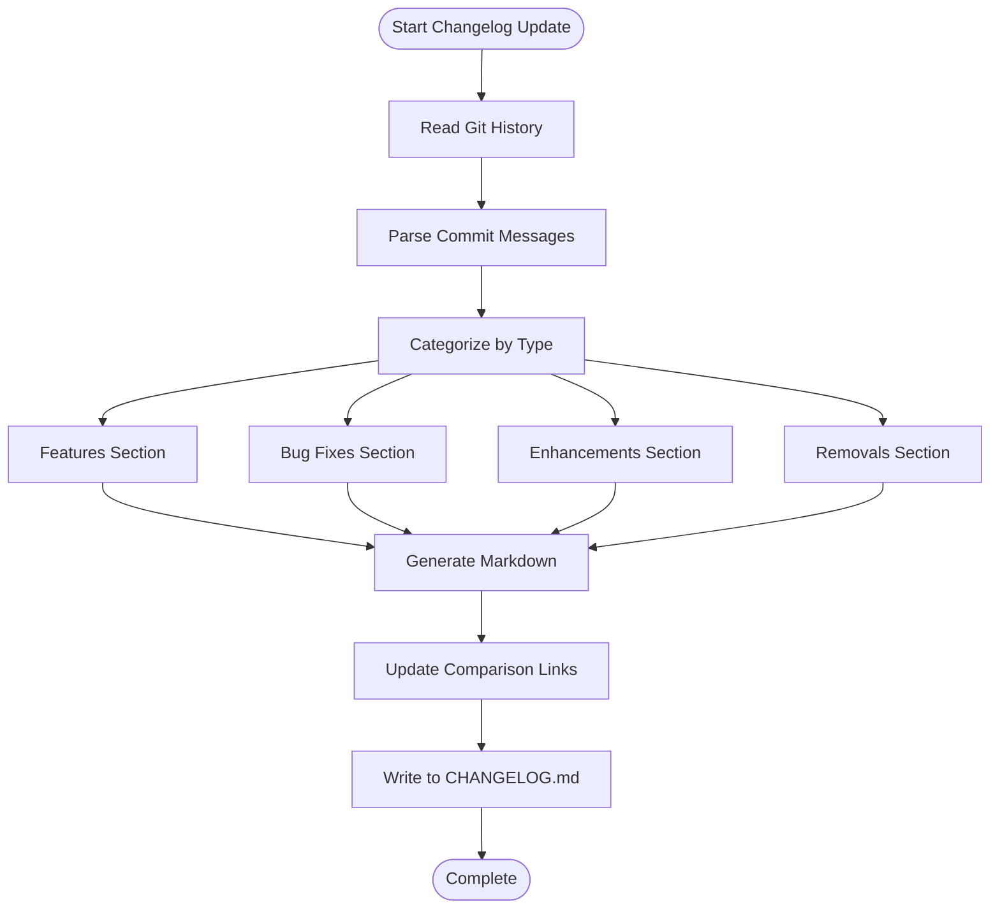

**Diagram sources**
- [update-changelog.sh:35-137](file://scripts/update-changelog.sh#L35-L137)

### Commit Message Parsing

The system uses sophisticated commit message parsing to categorize changes automatically:

| Prefix Pattern | Category | Description |
|----------------|----------|-------------|
| `feat:` | Added | New features and functionality |
| `fix:` | Fixed | Bug fixes and corrections |
| `docs:` | Changed | Documentation updates |
| `refactor:` | Changed | Code restructuring |
| `perf:` | Changed | Performance improvements |
| `test:` | Changed | Test additions and improvements |
| `build:` | Changed | Build system changes |
| `ci:` | Changed | Continuous integration changes |
| `style:` | Changed | Code style and formatting |
| `chore:` | Changed | Routine tasks and maintenance |

**Section sources**
- [update-changelog.sh:35-78](file://scripts/update-changelog.sh#L35-L78)
- [CHANGELOG.md:1-120](file://CHANGELOG.md#L1-L120)

## Release Workflows

### Multi-Trigger Release Process

The release system supports both manual and automated triggers, providing flexibility for different release scenarios.

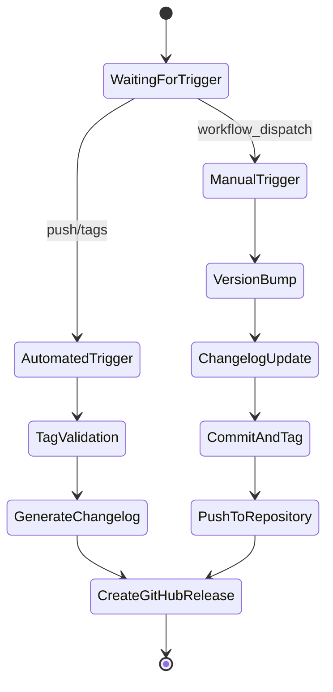

**Diagram sources**
- [release.yml:3-17](file://.github/workflows/release.yml#L3-L17)

### Release Artifact Creation

The system creates comprehensive release artifacts including:

1. **Version Tags**: Git tags following semantic versioning
2. **Release Notes**: Automatically generated changelogs
3. **Source Code Archives**: Complete source code snapshots
4. **Dependency Lock Files**: Ensuring reproducible builds

**Section sources**
- [release.yml:19-132](file://.github/workflows/release.yml#L19-L132)

## Deployment Pipeline

### Cloudflare Workers Deployment

The deployment pipeline targets Cloudflare Workers, leveraging the platform's global edge network for optimal performance.

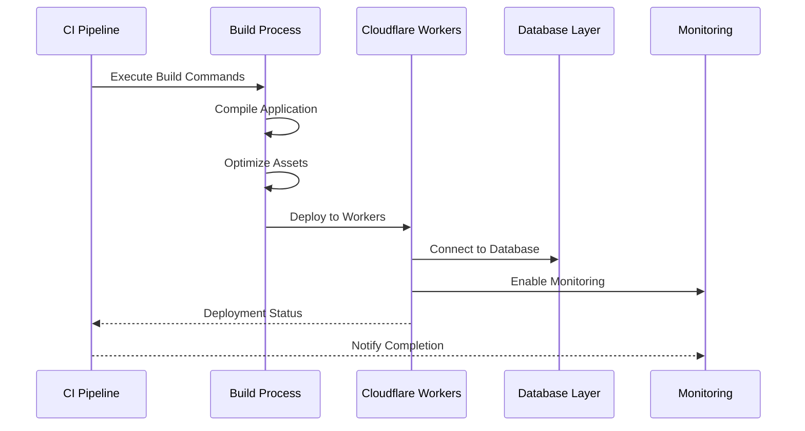

**Diagram sources**
- [deploy.yml:39-61](file://.github/workflows/deploy.yml#L39-L61)
- [wrangler.jsonc:1-8](file://wrangler.jsonc#L1-L8)

### Deployment Configuration

The deployment system uses Wrangler for Cloudflare Workers configuration:

| Configuration | Value | Purpose |
|---------------|-------|---------|
| **Name** | `pcready` | Application identifier |
| **Compatibility Date** | `2025-09-24` | Node.js compatibility |
| **Main Entry** | `@tanstack/react-start/server-entry` | Server-side rendering entry |
| **Compatibility Flags** | `nodejs_compat` | Enhanced Node.js support |

**Section sources**
- [deploy.yml:1-61](file://.github/workflows/deploy.yml#L1-L61)
- [wrangler.jsonc:1-8](file://wrangler.jsonc#L1-L8)

## Quality Assurance

### Comprehensive Testing Suite

The quality assurance system includes multiple layers of testing to ensure release reliability:

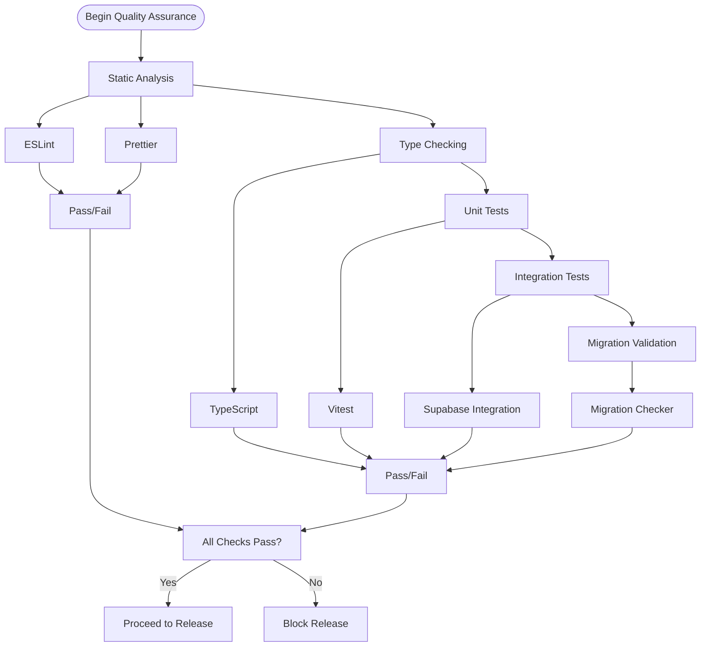

**Diagram sources**
- [ci.yml:38-44](file://.github/workflows/ci.yml#L38-L44)
- [test.yml:37-55](file://.github/workflows/test.yml#L37-L55)

### Test Execution Environment

The testing system maintains consistent environments across different workflow types:

| Workflow | Node.js Version | Package Manager | Test Coverage |
|----------|----------------|-----------------|---------------|
| **CI** | 22.x | Bun 1.3.13 | Full suite |
| **Tests** | 20.x | Bun 1.3.13 | Unit tests only |
| **Release** | 22.x | Bun 1.3.13 | Build verification |

**Section sources**
- [ci.yml:22-44](file://.github/workflows/ci.yml#L22-L44)
- [test.yml:21-55](file://.github/workflows/test.yml#L21-L55)

## Post-Deployment Validation

### Healthcheck and Monitoring

**Updated** The post-deployment validation system now includes a comprehensive healthcheck script that ensures applications are fully functional after release through DNS resolution, HTTP status verification, and optional warmup requests.

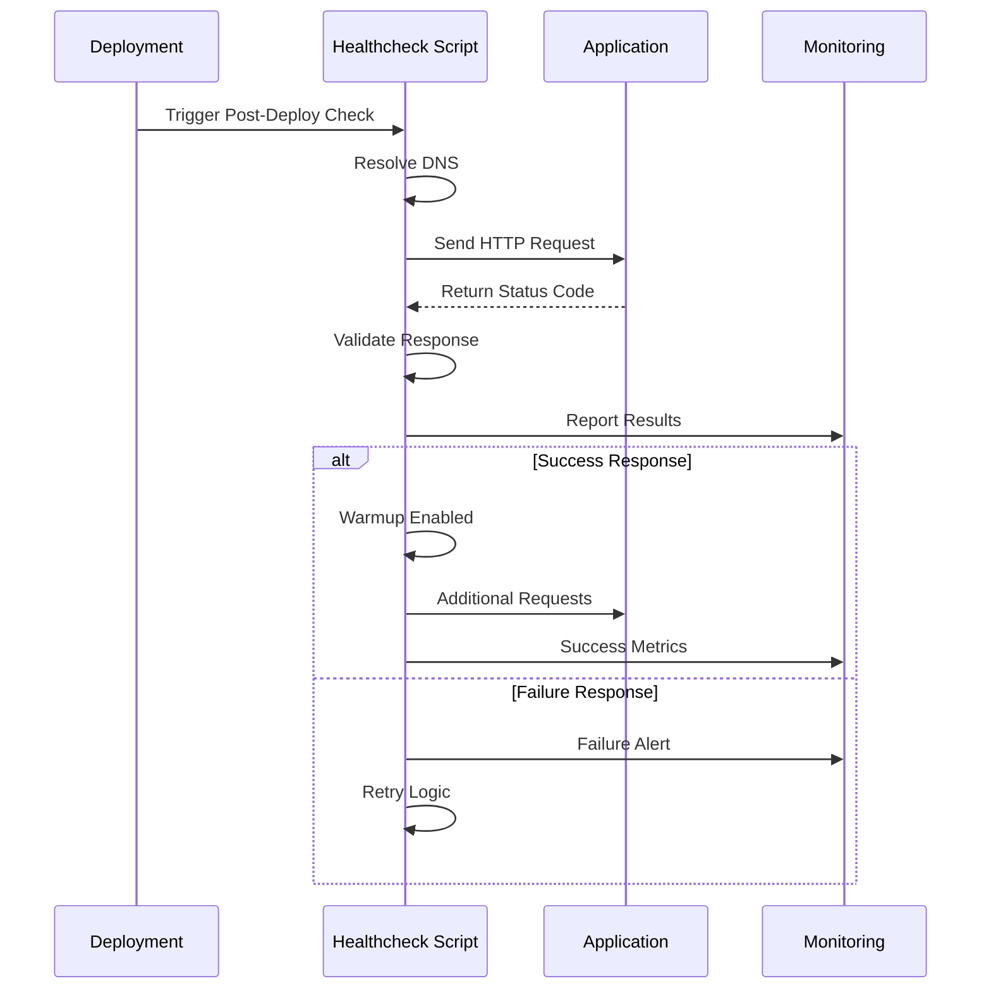

**Diagram sources**
- [lighthouse.yml:18-26](file://.github/workflows/lighthouse.yml#L18-L26)
- [healthcheck.sh:47-87](file://scripts/ci/healthcheck.sh#L47-L87)

### Healthcheck Script Capabilities

The healthcheck system provides comprehensive validation with the following features:

#### DNS Resolution
- Extracts hostname from URL using regex pattern matching
- Supports both Python3 and getent fallback for DNS resolution
- Logs successful DNS-to-IP resolution mapping

#### HTTP Status Verification
- Performs HEAD requests with redirect following
- Captures final URL, HTTP status, redirect count, and response time
- Validates HTTP status codes in 2xx and 3xx ranges as acceptable
- Implements configurable retry logic with exponential backoff

#### Warmup Requests
- Optional warmup functionality for cache warming
- Performs GET requests to warm application caches
- Non-fatal failures for warmup requests don't block deployment

#### Configuration Parameters
| Parameter | Default | Purpose |
|-----------|---------|---------|
| **URL** | Required | Target application URL |
| **Attempts** | 5 | Maximum retry attempts |
| **Wait Time** | 15 seconds | Delay between retries |
| **Warmup** | false | Enable cache warming |

### Lighthouse Performance Monitoring

The system includes automated performance monitoring using Google Lighthouse with integrated healthcheck validation:

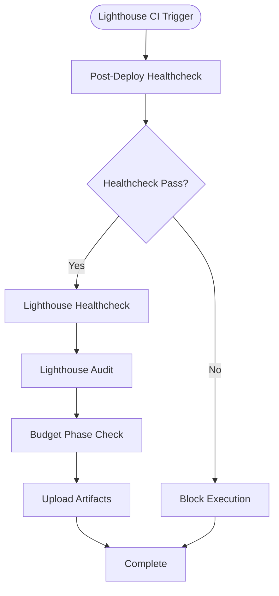

**Diagram sources**
- [lighthouse.yml:18-39](file://.github/workflows/lighthouse.yml#L18-L39)

The Lighthouse system uses configurable budget phases:

| Phase | Purpose | Performance Targets |
|-------|---------|-------------------|
| **Phase 1** | Development baseline | Higher thresholds for early development |
| **Phase 2** | Feature completion | Moderate thresholds for feature-complete apps |
| **Phase 3** | Production ready | Strict thresholds for production deployment |

**Section sources**
- [lighthouse.yml:1-39](file://.github/workflows/lighthouse.yml#L1-L39)
- [healthcheck.sh:1-91](file://scripts/ci/healthcheck.sh#L1-L91)
- [lighthouse-budget.json:1-23](file://lighthouse-budget.json#L1-L23)
- [lighthouse-budget-phase1.json:1-23](file://lighthouse-budget-phase1.json#L1-L23)
- [lighthouse-budget-phase2.json:1-23](file://lighthouse-budget-phase2.json#L1-L23)
- [lighthouse-budget-phase3.json:1-23](file://lighthouse-budget-phase3.json#L1-L23)

## Database Operations

### Backup and Reset Scripts

The system includes comprehensive database management scripts for backup and reset operations:

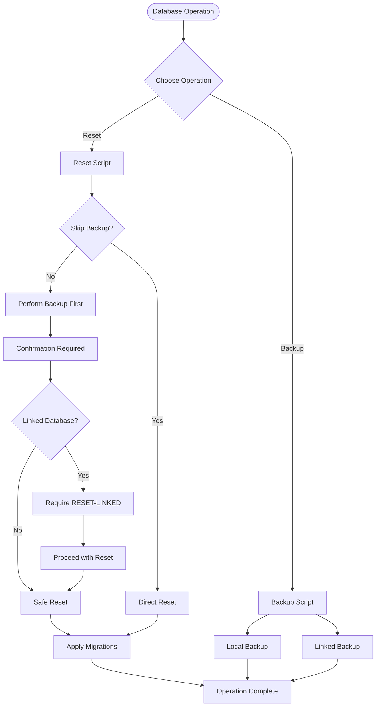

**Diagram sources**
- [supabase-backup.mjs:41-61](file://scripts/supabase-backup.mjs#L41-L61)
- [supabase-reset.mjs:48-69](file://scripts/supabase-reset.mjs#L48-L69)

### Migration Validation

The system validates database migrations to prevent deployment issues:

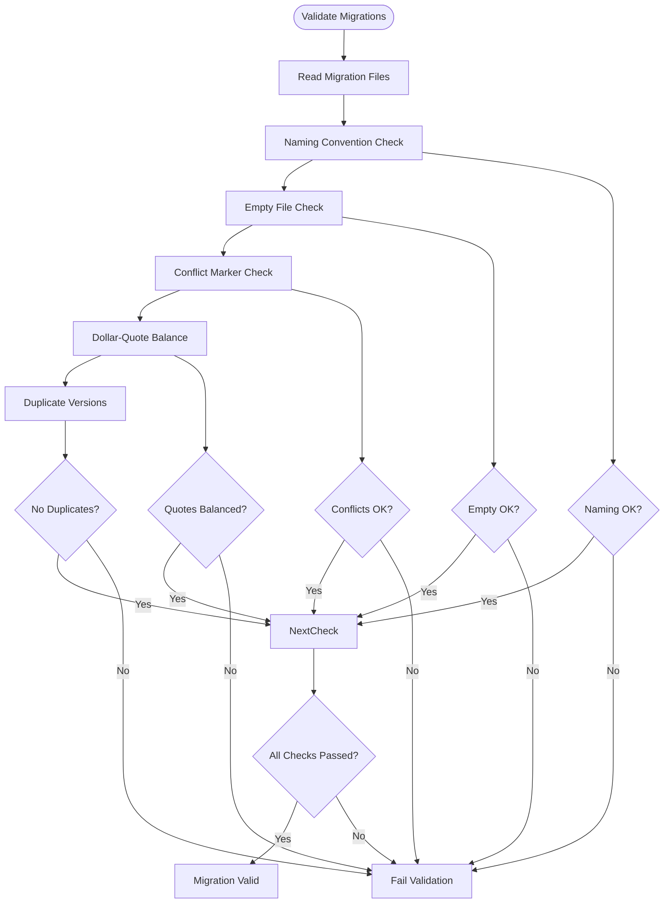

**Diagram sources**
- [validate-migrations.mjs:10-57](file://scripts/validate-migrations.mjs#L10-L57)

**Section sources**
- [supabase-backup.mjs:1-62](file://scripts/supabase-backup.mjs#L1-L62)
- [supabase-reset.mjs:1-69](file://scripts/supabase-reset.mjs#L1-L69)
- [validate-migrations.mjs:1-57](file://scripts/validate-migrations.mjs#L1-L57)

## Performance Considerations

### Caching Strategies

The system implements intelligent caching to optimize build performance:

| Cache Type | Location | Purpose | Benefits |
|------------|----------|---------|----------|
| **Bun Dependencies** | `~/.bun/install/cache` | Package installation cache | Reduced build times |
| **Node Modules** | Project root | Build artifacts | Faster incremental builds |
| **GitHub Actions** | Actions cache | Workflow dependencies | Consistent environments |

### Resource Optimization

The deployment pipeline optimizes resource usage through:

1. **Parallel Execution**: Multiple jobs run concurrently when possible
2. **Conditional Execution**: Steps only run when necessary
3. **Efficient Caching**: Strategic caching reduces redundant operations
4. **Minimal Dependencies**: Lean dependency management

## Troubleshooting Guide

### Common Release Issues

| Issue | Symptoms | Solution |
|-------|----------|----------|
| **Version Bump Failed** | NPM version command fails | Check commit permissions, verify semantic versioning |
| **Changelog Generation Error** | Missing changelog sections | Verify commit message format, check git history |
| **Release Creation Fails** | GitHub release creation blocked | Validate GitHub tokens, check release permissions |
| **Deployment Timeout** | Cloudflare deployment fails | Check network connectivity, verify credentials |
| **Healthcheck Failure** | Post-deployment validation fails | Review application logs, check database connectivity, verify DNS resolution |

### Debugging Commands

```bash
# Check current version
npm version

# View git tags
git tag -l

# Inspect changelog
cat CHANGELOG.md

# Validate migrations
bun run migrations:check

# Test deployment locally
bun run cloudflare:build

# Run healthcheck manually
./scripts/ci/healthcheck.sh https://your-app-url.com 5 15 true
```

### Environment Variables

Critical environment variables for troubleshooting:

| Variable | Purpose | Required |
|----------|---------|----------|
| `GITHUB_TOKEN` | GitHub API access | Yes |
| `CLOUDFLARE_API_TOKEN` | Cloudflare access | Yes |
| `SUPABASE_URL` | Database connection | Yes |
| `SUPABASE_DB_URL` | Database credentials | Yes |
| `SUPABASE_SERVICE_ROLE_KEY` | Database admin access | Yes |
| `LHCI_URL` | Application URL for healthcheck | Yes |
| `LHCI_BUDGET_STAGE` | Lighthouse budget phase | No |

**Section sources**
- [release.yml:23-31](file://.github/workflows/release.yml#L23-L31)
- [deploy.yml:42-54](file://.github/workflows/deploy.yml#L42-L54)
- [lighthouse.yml:11-14](file://.github/workflows/lighthouse.yml#L11-L14)

## Conclusion

The PCReady Release Automation System provides a robust, automated pipeline for managing application releases with comprehensive quality assurance and deployment validation. The system's modular architecture ensures flexibility while maintaining consistency across all release scenarios.

**Updated** Key enhancements include a comprehensive post-deploy healthcheck system that validates application readiness through DNS resolution, HTTP status verification, and optional warmup requests, integrated seamlessly into the Lighthouse CI workflow.

Key strengths of the system include:

- **Automated Version Management**: Seamless semantic versioning with commit-based changelog generation
- **Multi-Stage Quality Assurance**: Comprehensive testing and validation at every stage
- **Production-Ready Deployment**: Cloudflare Workers integration with mandatory healthcheck validation
- **Database Operations**: Safe backup and reset procedures with validation
- **Performance Monitoring**: Automated performance testing and monitoring with configurable budget phases
- **Comprehensive Health Validation**: DNS resolution, HTTP status verification, and cache warming

The system's design promotes reliability, maintainability, and scalability while minimizing manual intervention in the release process. Regular updates and improvements ensure the system adapts to evolving development needs and industry best practices.