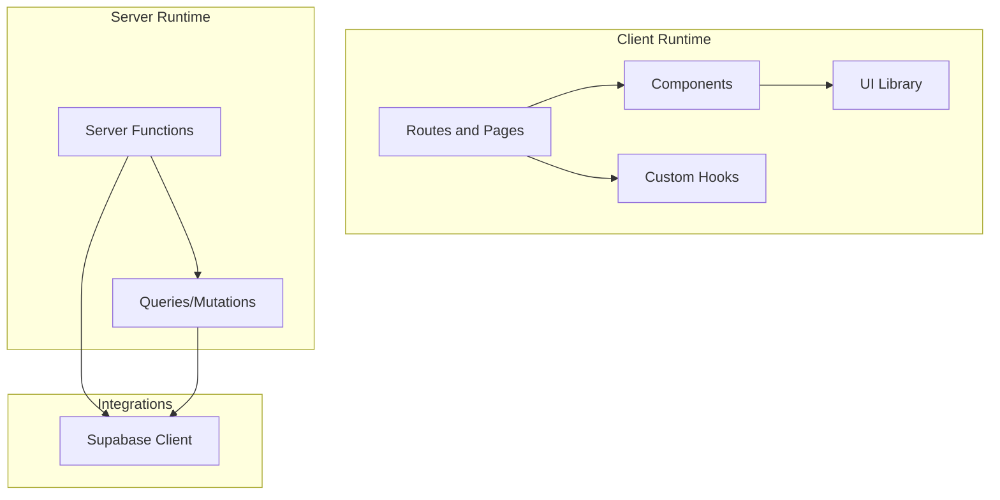
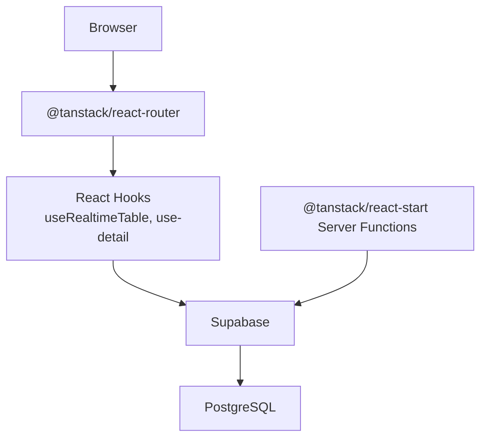
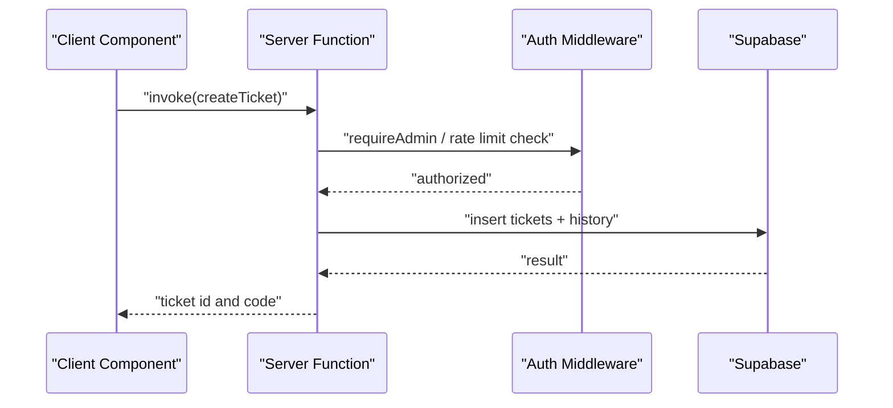
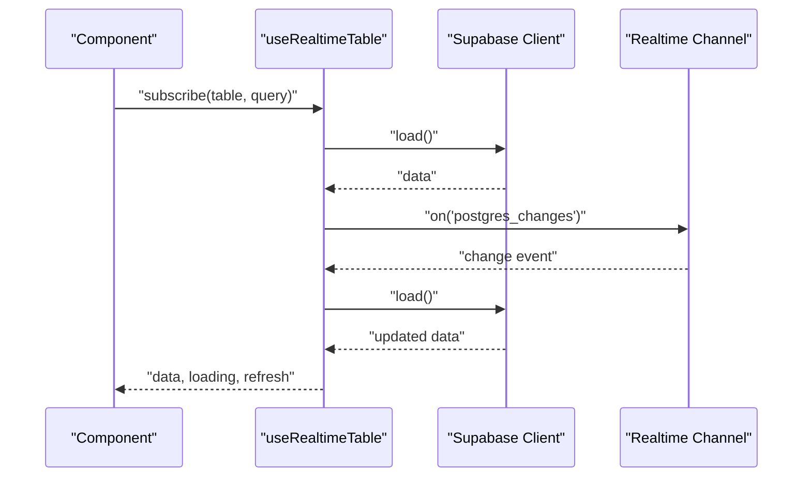
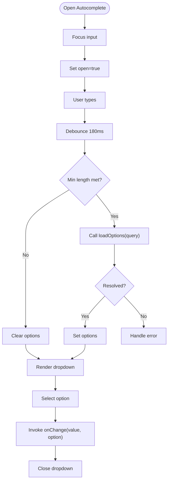
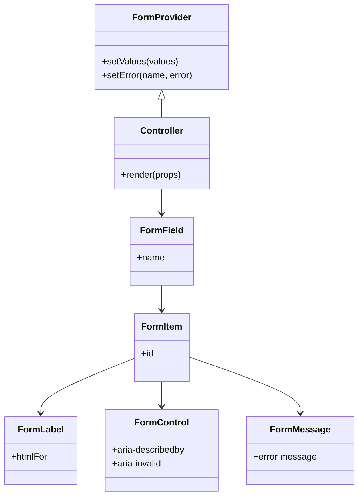
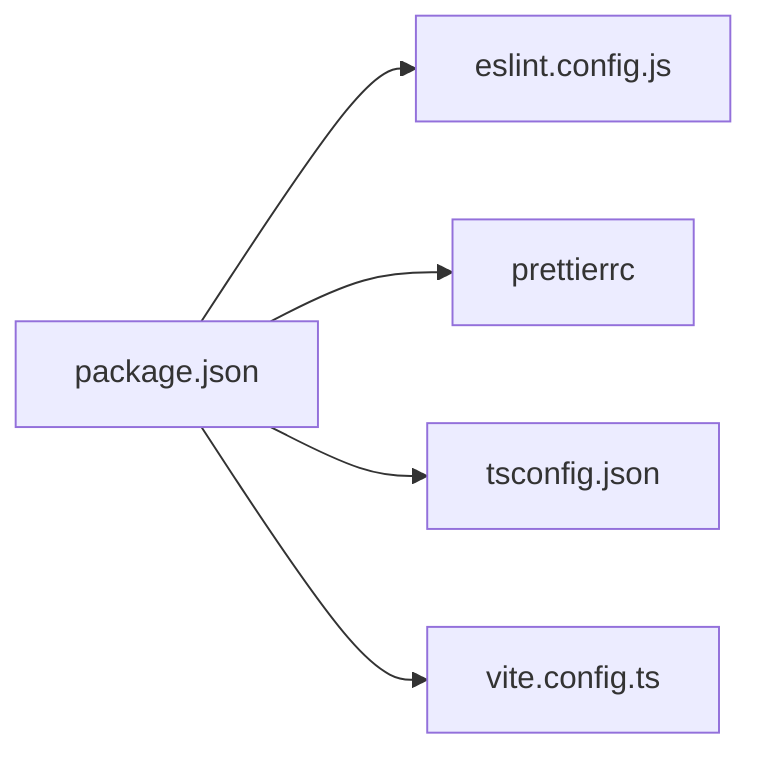
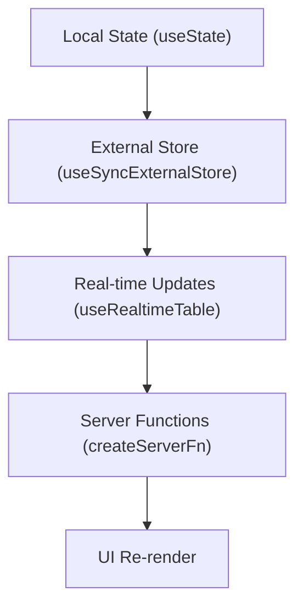
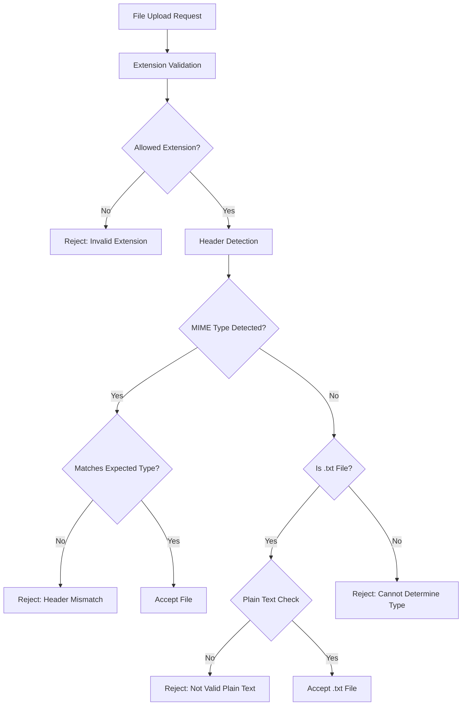

# Development Guidelines

<cite>
**Referenced Files in This Document**
- [package.json](file://package.json)
- [eslint.config.js](file://eslint.config.js)
- [.prettierrc](file://.prettierrc)
- [tsconfig.json](file://tsconfig.json)
- [vite.config.ts](file://vite.config.ts)
- [src/lib/use-detail.tsx](file://src/lib/use-detail.tsx)
- [src/hooks/useRealtimeTable.ts](file://src/hooks/useRealtimeTable.ts)
- [src/integrations/supabase/client.ts](file://src/integrations/supabase/client.ts)
- [src/components/pcready/AsyncAutocomplete.tsx](file://src/components/pcready/AsyncAutocomplete.tsx)
- [src/lib/admin-users.ts](file://src/lib/admin-users.ts)
- [src/routes/_app/admin.tsx](file://src/routes/_app/admin.tsx)
- [src/components/ui/form.tsx](file://src/components/ui/form.tsx)
- [src/lib/tickets.ts](file://src/lib/tickets.ts)
- [src/lib/schemas/index.ts](file://src/lib/schemas/index.ts)
- [src/lib/queries/ticketAttachments.ts](file://src/lib/queries/ticketAttachments.ts)
- [src/lib/server/attachmentUtils.server.ts](file://src/lib/server/attachmentUtils.server.ts)
- [src/components/tickets/TicketAttachments.tsx](file://src/components/tickets/TicketAttachments.tsx)
- [src/__tests__/ticketAttachments.test.ts](file://src/__tests__/ticketAttachments.test.ts)
- [scripts/scan-attachments.mjs](file://scripts/scan-attachments.mjs)
- [README.md](file://README.md)
- [docs/architecture.md](file://docs/architecture.md)
- [docs/domain-model.md](file://docs/domain-model.md)
- [public/openapi/openapi.yaml](file://public/openapi/openapi.yaml)
- [supabase/migrations/20260514182000_realtime_ticket_device_assignments.sql](file://supabase/migrations/20260514182000_realtime_ticket_device_assignments.sql)
</cite>

## Update Summary

**Changes Made**

- Enhanced file attachment validation and security improvements for PNG, JPEG, WebP, and PDF files
- Improved MIME type detection capabilities with better edge case handling
- Added comprehensive security vulnerability prevention measures
- Updated attachment validation system with server-side and client-side validation
- Added automated scanning script for detecting potentially malicious files
- Enhanced component-level attachment handling with robust error management

## Table of Contents

1. [Introduction](#introduction)
2. [Project Structure](#project-structure)
3. [Core Components](#core-components)
4. [Architecture Overview](#architecture-overview)
5. [Detailed Component Analysis](#detailed-component-analysis)
6. [Dependency Analysis](#dependency-analysis)
7. [Performance Considerations](#performance-considerations)
8. [Troubleshooting Guide](#troubleshooting-guide)
9. [Testing Strategies](#testing-strategies)
10. [Debugging and Profiling](#debugging-and-profiling)
11. [Code Style and Formatting](#code-style-and-formatting)
12. [TypeScript Usage and Type Safety](#typescript-usage-and-type-safety)
13. [Component Development Patterns](#component-development-patterns)
14. [State Management Best Practices](#state-management-best-practices)
15. [Database and Real-Time Patterns](#database-and-real-time-patterns)
16. [Architectural Patterns](#architectural-patterns)
17. [Code Organization Principles](#code-organization-principles)
18. [File Attachment Security and Validation](#file-attachment-security-and-validation)
19. [Accessibility, Security, and Internationalization](#accessibility-security-and-internationalization)
20. [Code Review and Contribution Workflows](#code-review-and-contribution-workflows)
21. [Conclusion](#conclusion)

## Introduction

This document defines PCReady's development guidelines and best practices. It consolidates code style, TypeScript usage, component patterns, state management, performance optimization, architecture, testing, debugging, accessibility, security, and internationalization guidance. These practices are grounded in the repository's existing tooling (ESLint, Prettier, TypeScript, Vitest), frameworks (TanStack Router/Start, React Query), and integrations (Supabase).

## Project Structure

The project follows a feature-centric, layered structure:

- src/components: Reusable UI and feature-specific components
- src/hooks: Custom React hooks
- src/lib: Business logic, server functions, and utilities
- src/routes: Route handlers and page components
- src/integrations: External service clients (e.g., Supabase)
- src/types: Domain and API-related type definitions
- tests under src/**tests**: Unit and integration tests
- docs: Architectural and domain documentation
- supabase: Database migrations and schema

**Section sources**

- [README.md](file://README.md)
- [docs/architecture.md](file://docs/architecture.md)

## Core Components

- Tooling and configuration define linting, formatting, type checking, and testing:
  - ESLint with TypeScript and React Hooks recommended rules
  - Prettier with configured print width, semicolons, quotes, trailing commas, and line endings
  - TypeScript strict mode with path aliases
  - Vitest with coverage thresholds and environment configuration
- Feature modules demonstrate:
  - Server Functions Pattern for secure, typed server calls
  - Real-time synchronization via Supabase channels
  - Zod-based input validation and typed database operations

**Section sources**

- [package.json:1-110](file://package.json#L1-L110)
- [eslint.config.js:1-63](file://eslint.config.js#L1-L63)
- [.prettierrc:1-8](file://.prettierrc#L1-L8)
- [tsconfig.json:1-30](file://tsconfig.json#L1-L30)
- [vite.config.ts:1-58](file://vite.config.ts#L1-L58)

## Architecture Overview

PCReady uses a hybrid client-server architecture:

- Client-side routing and rendering via TanStack Router/Start
- Server Functions encapsulate sensitive operations and enforce authorization
- Supabase provides authentication, database, and real-time subscriptions
- React Query manages caching and data fetching

**Diagram sources**

- [src/hooks/useRealtimeTable.ts:1-50](file://src/hooks/useRealtimeTable.ts#L1-L50)
- [src/lib/use-detail.tsx:1-47](file://src/lib/use-detail.tsx#L1-L47)
- [src/integrations/supabase/client.ts:1-41](file://src/integrations/supabase/client.ts#L1-L41)
- [src/lib/admin-users.ts:1-279](file://src/lib/admin-users.ts#L1-L279)

## Detailed Component Analysis

### Server Functions Pattern

Server Functions encapsulate server-side logic, enforce authorization, and validate inputs. They are invoked from the client and executed on the server, ensuring sensitive operations remain protected.

**Diagram sources**

- [src/lib/admin-users.ts:88-135](file://src/lib/admin-users.ts#L88-L135)
- [src/lib/tickets.ts:50-110](file://src/lib/tickets.ts#L50-L110)

**Section sources**

- [src/lib/admin-users.ts:1-279](file://src/lib/admin-users.ts#L1-L279)
- [src/lib/tickets.ts:1-111](file://src/lib/tickets.ts#L1-L111)

### Real-Time Data Sync Hook

The hook loads initial data and subscribes to Supabase real-time events to keep the UI synchronized.

**Diagram sources**

- [src/hooks/useRealtimeTable.ts:10-49](file://src/hooks/useRealtimeTable.ts#L10-L49)
- [src/integrations/supabase/client.ts:1-41](file://src/integrations/supabase/client.ts#L1-L41)

**Section sources**

- [src/hooks/useRealtimeTable.ts:1-50](file://src/hooks/useRealtimeTable.ts#L1-L50)
- [src/integrations/supabase/client.ts:1-41](file://src/integrations/supabase/client.ts#L1-L41)

### Async Autocomplete Component

A reusable async autocomplete with controlled selection, debounced search, and virtualized options.

**Diagram sources**

- [src/components/pcready/AsyncAutocomplete.tsx:21-140](file://src/components/pcready/AsyncAutocomplete.tsx#L21-L140)

**Section sources**

- [src/components/pcready/AsyncAutocomplete.tsx:1-141](file://src/components/pcready/AsyncAutocomplete.tsx#L1-L141)

### Form Abstractions with React Hook Form

The form library composes Controller, FormProvider, and contextual hooks to manage validation, labeling, and error reporting.

**Diagram sources**

- [src/components/ui/form.tsx:16-171](file://src/components/ui/form.tsx#L16-L171)

**Section sources**

- [src/components/ui/form.tsx:1-172](file://src/components/ui/form.tsx#L1-L172)

## Dependency Analysis

- Client runtime depends on TanStack Router/Start, React Query, Radix UI, and Supabase client
- Server Functions depend on Supabase admin client and rate limiting utilities
- Tests target focused modules and use Vitest with Node environment

**Diagram sources**

- [package.json:1-110](file://package.json#L1-L110)
- [eslint.config.js:1-63](file://eslint.config.js#L1-L63)
- [.prettierrc:1-8](file://.prettierrc#L1-L8)
- [tsconfig.json:1-30](file://tsconfig.json#L1-L30)
- [vite.config.ts:1-58](file://vite.config.ts#L1-L58)

**Section sources**

- [package.json:1-110](file://package.json#L1-L110)
- [vite.config.ts:39-55](file://vite.config.ts#L39-L55)

## Performance Considerations

- Bundle splitting and chunking:
  - Manual chunks for vendor libraries (PDF, charts, DnD, flow, Swagger, Radix)
  - Chunk size warning threshold increased to reduce noise
- Dependency optimization:
  - Pre-bundling heavy dependencies (e.g., PDF renderer)
- SSR handling:
  - No externalization exceptions for specific packages
- Testing coverage:
  - Targeted coverage for critical modules, thresholds set for maintainability
- Real-time updates:
  - Subscribe only to necessary tables and debounce UI updates

**Section sources**

- [vite.config.ts:17-38](file://vite.config.ts#L17-L38)
- [vite.config.ts:39-55](file://vite.config.ts#L39-L55)

## Troubleshooting Guide

- Environment variables:
  - Supabase client requires URL and publishable key; missing values cause early errors
- Real-time channels:
  - Ensure channel suffix uniqueness and cleanup on unmount
- Rate limits:
  - Server Functions enforce rate limits; handle 400 responses gracefully
- Form validation:
  - Use form context and field hooks to surface errors consistently

**Section sources**

- [src/integrations/supabase/client.ts:8-20](file://src/integrations/supabase/client.ts#L8-L20)
- [src/hooks/useRealtimeTable.ts:33-46](file://src/hooks/useRealtimeTable.ts#L33-L46)
- [src/lib/admin-users.ts:169-225](file://src/lib/admin-users.ts#L169-L225)
- [src/components/ui/form.tsx:40-65](file://src/components/ui/form.tsx#L40-L65)

## Testing Strategies

- Test runner:
  - Vitest with Node environment and global APIs
- Coverage:
  - Provider v8, reporters text and lcov
  - Thresholds for lines, functions, branches
  - Include only targeted modules to avoid skewing metrics
- Test organization:
  - Feature-based under src/**tests**
  - Route-level and lib-level tests

**Section sources**

- [vite.config.ts:39-55](file://vite.config.ts#L39-L55)
- [package.json:17-18](file://package.json#L17-L18)

## Debugging and Profiling

- Linting and type-checking:
  - Run ESLint and TypeScript checks regularly
- Formatting:
  - Use Prettier to enforce consistent formatting
- Runtime debugging:
  - Inspect Supabase client initialization and environment variables
  - Verify real-time channel subscriptions and removal
- Profiling:
  - Use browser devtools and React DevTools
  - Monitor bundle sizes and chunk composition

**Section sources**

- [package.json:15-20](file://package.json#L15-L20)
- [eslint.config.js:33-48](file://eslint.config.js#L33-L48)
- [.prettierrc:1-8](file://.prettierrc#L1-L8)
- [src/integrations/supabase/client.ts:31-40](file://src/integrations/supabase/client.ts#L31-L40)

## Code Style and Formatting

- ESLint configuration:
  - Recommended rules for JS/TS and React Hooks
  - Ignore patterns for generated files and virtual environments
  - Allow constants to be exported without warnings
  - Prefer explicit any off in specific folders to ease migration
- Prettier configuration:
  - Unix line endings, trailing commas, and semicolons
  - Single quotes for JSX attributes
- Scripts:
  - Lint, typecheck, test, and format commands available

**Section sources**

- [eslint.config.js:1-63](file://eslint.config.js#L1-L63)
- [.prettierrc:1-8](file://.prettierrc#L1-L8)
- [package.json:7-20](file://package.json#L7-L20)

## TypeScript Usage and Type Safety

- Strict compiler options:
  - Strict, no unused locals/parameters, no fallthrough switches
  - Path aliases for cleaner imports
- Type-driven development:
  - Supabase client types, Zod schemas, and server function inputs/outputs
- Utility patterns:
  - Generics for reusable components (e.g., AsyncAutocomplete)
  - Context-aware hooks returning strongly-typed state

**Section sources**

- [tsconfig.json:17-27](file://tsconfig.json#L17-L27)
- [src/components/pcready/AsyncAutocomplete.tsx:3-19](file://src/components/pcready/AsyncAutocomplete.tsx#L3-L19)
- [src/lib/tickets.ts:8-30](file://src/lib/tickets.ts#L8-L30)

## Component Development Patterns

- Prop interfaces:
  - Define generic props for reusable components
  - Optional and nullable fields clearly annotated
- Controlled state:
  - Parent-controlled value with callbacks for selection
- Lifecycle:
  - Side effects isolated in useEffect with proper cleanup
- Accessibility:
  - Use Radix UI primitives and semantic labeling
- Composition:
  - Break down complex UIs into small, composable parts

**Section sources**

- [src/components/pcready/AsyncAutocomplete.tsx:9-31](file://src/components/pcready/AsyncAutocomplete.tsx#L9-L31)
- [src/components/ui/form.tsx:73-84](file://src/components/ui/form.tsx#L73-L84)

## State Management Best Practices

- Local component state:
  - useState for ephemeral UI state
- External store pattern:
  - useSyncExternalStore for cross-component coordination (e.g., detail panes)
- Real-time state:
  - useRealtimeTable for reactive table data
- Server state:
  - Server Functions encapsulate mutations and fetches
- Custom hooks:
  - Encapsulate complex logic and side effects

**Diagram sources**

- [src/lib/use-detail.tsx:11-23](file://src/lib/use-detail.tsx#L11-L23)
- [src/hooks/useRealtimeTable.ts:14-14](file://src/hooks/useRealtimeTable.ts#L14-L14)
- [src/lib/admin-users.ts:88-135](file://src/lib/admin-users.ts#L88-L135)

**Section sources**

- [src/lib/use-detail.tsx:1-47](file://src/lib/use-detail.tsx#L1-L47)
- [src/hooks/useRealtimeTable.ts:1-50](file://src/hooks/useRealtimeTable.ts#L1-L50)
- [src/lib/admin-users.ts:1-279](file://src/lib/admin-users.ts#L1-L279)

## Database and Real-Time Patterns

- Supabase client initialization:
  - Environment-aware client creation with fallbacks
  - Proxy-based lazy initialization
- Real-time subscriptions:
  - Unique channel suffix per subscription
  - Cleanup on unmount
- Migrations:
  - Real-time replica identity and triggers for tables requiring live updates

**Section sources**

- [src/integrations/supabase/client.ts:5-40](file://src/integrations/supabase/client.ts#L5-L40)
- [src/hooks/useRealtimeTable.ts:31-46](file://src/hooks/useRealtimeTable.ts#L31-L46)
- [supabase/migrations/20260514182000_realtime_ticket_device_assignments.sql](file://supabase/migrations/20260514182000_realtime_ticket_device_assignments.sql)

## Architectural Patterns

- Server Functions Pattern:
  - Centralized, typed server endpoints with input validation and authorization
- Repository Pattern:
  - Encapsulate data access in modules (e.g., admin-users, tickets)
- Component Composition:
  - Small, single-purpose components composed into larger views

**Section sources**

- [src/lib/admin-users.ts:88-135](file://src/lib/admin-users.ts#L88-L135)
- [src/lib/tickets.ts:50-110](file://src/lib/tickets.ts#L50-L110)
- [src/components/ui/form.tsx:16-171](file://src/components/ui/form.tsx#L16-L171)

## Code Organization Principles

- File naming conventions:
  - Feature folders (e.g., components/admin, hooks, lib)
  - Page components under routes with descriptive filenames
- Export strategies:
  - Barrel exports for cohesive module boundaries
- Path aliases:
  - Use @/ prefix for cleaner imports

**Section sources**

- [src/lib/schemas/index.ts:1-8](file://src/lib/schemas/index.ts#L1-L8)
- [tsconfig.json:25-27](file://tsconfig.json#L25-L27)

## File Attachment Security and Validation

### Enhanced Attachment Validation System

The system now implements comprehensive file attachment validation with enhanced security measures for PNG, JPEG, WebP, and PDF files.

**Diagram sources**

- [src/lib/queries/ticketAttachments.ts:57-81](file://src/lib/queries/ticketAttachments.ts#L57-L81)
- [src/lib/server/attachmentUtils.server.ts:69-82](file://src/lib/server/attachmentUtils.server.ts#L69-L82)

### MIME Type Detection Capabilities

The validation system now includes robust MIME type detection for multiple file formats:

- **PNG**: Validates 8-byte signature `0x89 0x50 0x4e 0x47`
- **JPEG**: Validates 3-byte signature `0xff 0xd8 0xff`
- **GIF**: Validates 6-byte signature `0x47 0x49 0x46`
- **WebP**: Validates 12-byte signature `0x52 0x49 0x46 0x46 ... 0x57 0x45 0x42 0x50`
- **PDF**: Validates 4-byte signature `0x25 0x50 0x44 0x46`
- **SVG/HTML**: Detects and rejects potentially malicious text-based files

**Section sources**

- [src/lib/queries/ticketAttachments.ts:28-55](file://src/lib/queries/ticketAttachments.ts#L28-L55)
- [src/lib/server/attachmentUtils.server.ts:18-67](file://src/lib/server/attachmentUtils.server.ts#L18-L67)

### Security Vulnerability Prevention

The system implements multiple layers of security protection:

- **Double Validation**: Both client-side and server-side validation
- **Header Signature Verification**: Binary signature matching for file authenticity
- **Extension-Header Consistency**: Ensures file extension matches actual content
- **Plain Text Validation**: Special handling for .txt files to prevent binary content masquerading
- **SVG/HTML Detection**: Prevents malicious text-based files from being treated as images
- **Content-Disposition Enforcement**: Forces download behavior to prevent inline execution

**Section sources**

- [src/lib/queries/ticketAttachments.ts:73-78](file://src/lib/queries/ticketAttachments.ts#L73-L78)
- [src/lib/server/attachmentUtils.server.ts:56-66](file://src/lib/server/attachmentUtils.server.ts#L56-L66)
- [src/lib/queries/ticketAttachments.ts:184-188](file://src/lib/queries/ticketAttachments.ts#L184-L188)

### Automated Security Scanning

The system includes an automated scanning script for detecting potentially malicious files:

- **Bucket Scanning**: Analyzes all files in the ticket-documents bucket
- **Header Analysis**: Downloads and examines file headers for suspicious patterns
- **Text-Based Detection**: Identifies SVG and HTML content in file headers
- **Flag Generation**: Creates reports of potentially dangerous files for manual review

**Section sources**

- [scripts/scan-attachments.mjs:14-18](file://scripts/scan-attachments.mjs#L14-L18)
- [scripts/scan-attachments.mjs:20-44](file://scripts/scan-attachments.mjs#L20-L44)

### Component-Level Attachment Handling

The TicketAttachments component provides comprehensive file management with built-in security:

- **Drag & Drop Interface**: Secure file upload with validation
- **Preview Generation**: Safe image preview using signed URLs
- **Download Protection**: Enforced download behavior prevents inline execution
- **Error Handling**: Comprehensive error messaging for validation failures
- **Access Control**: Permission-based file operations

**Section sources**

- [src/components/tickets/TicketAttachments.tsx:81-93](file://src/components/tickets/TicketAttachments.tsx#L81-L93)
- [src/components/tickets/TicketAttachments.tsx:95-121](file://src/components/tickets/TicketAttachments.tsx#L95-L121)
- [src/components/tickets/TicketAttachments.tsx:142-172](file://src/components/tickets/TicketAttachments.tsx#L142-L172)

### Testing and Quality Assurance

Comprehensive test coverage ensures validation reliability:

- **Unit Tests**: Validate MIME type detection for all supported formats
- **Security Tests**: Test rejection of malicious file types
- **Edge Case Testing**: Handle various file corruption scenarios
- **Integration Tests**: End-to-end validation pipeline testing

**Section sources**

- [src/**tests**/ticketAttachments.test.ts:12-46](file://src/__tests__/ticketAttachments.test.ts#L12-L46)

## Accessibility, Security, and Internationalization

- Accessibility:
  - Use Radix UI primitives and semantic labeling
  - Manage focus and ARIA attributes in forms and dialogs
- Security:
  - Server Functions for privileged operations
  - Input validation with Zod
  - Rate limiting enforcement
  - Enhanced file attachment validation with MIME type detection
  - Automated security scanning for malicious files
  - Content-Disposition enforcement for download protection
- Internationalization:
  - No explicit i18n framework detected; consider adding if needed

**Section sources**

- [src/components/ui/form.tsx:86-119](file://src/components/ui/form.tsx#L86-L119)
- [src/lib/admin-users.ts:169-225](file://src/lib/admin-users.ts#L169-L225)
- [src/lib/tickets.ts:50-110](file://src/lib/tickets.ts#L50-L110)
- [src/lib/queries/ticketAttachments.ts:57-81](file://src/lib/queries/ticketAttachments.ts#L57-L81)
- [src/lib/server/attachmentUtils.server.ts:69-82](file://src/lib/server/attachmentUtils.server.ts#L69-L82)

## Code Review and Contribution Workflows

- Lint and type-check before submitting changes
- Keep diffs focused; group related changes
- Add or update tests for new features and bug fixes
- Document breaking changes and migration steps in PR descriptions
- Use conventional commit messages and follow branch naming conventions

## Conclusion

These guidelines consolidate PCReady's current practices around code quality, type safety, component design, state management, real-time updates, and testing. The enhanced file attachment validation system provides comprehensive security measures for handling PNG, JPEG, WebP, and PDF files with improved MIME type detection capabilities and better edge case handling. Adhering to them ensures consistency, reliability, and maintainability across the codebase while preventing security vulnerabilities through multiple validation layers and automated scanning capabilities.
