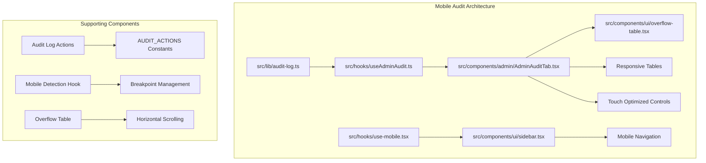
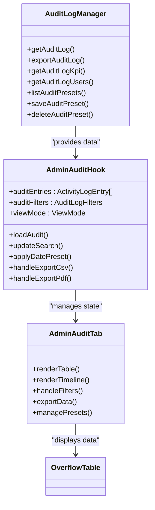
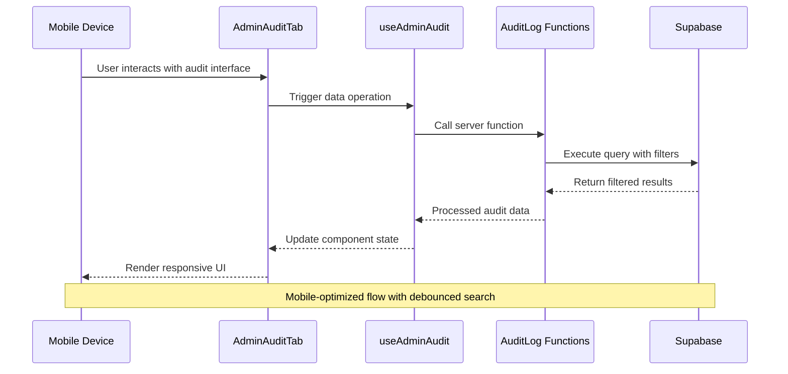
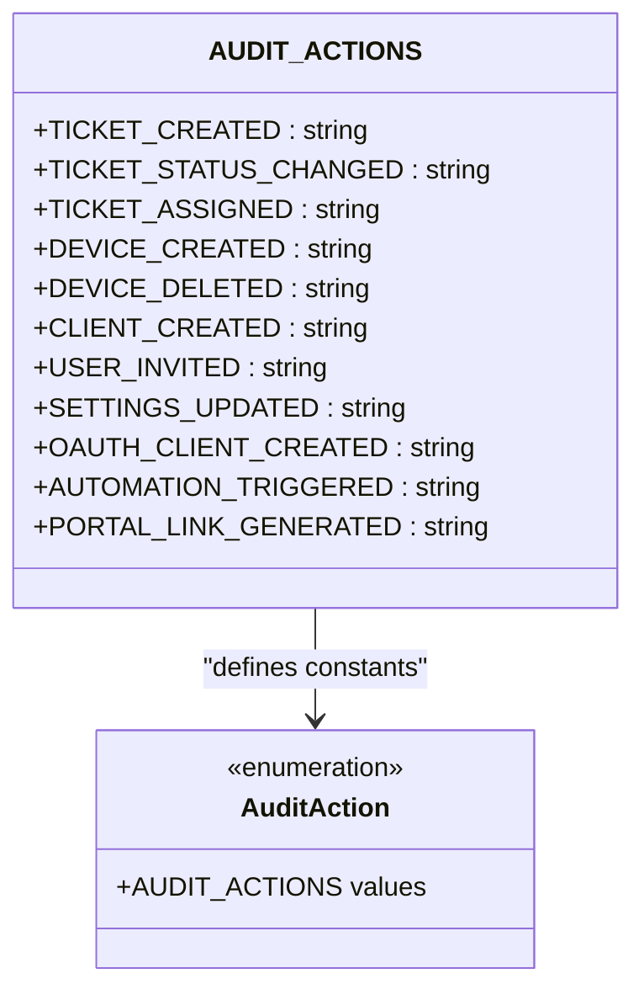
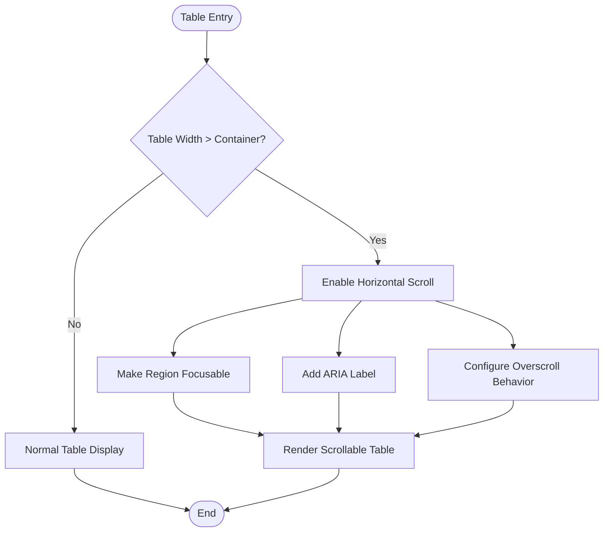
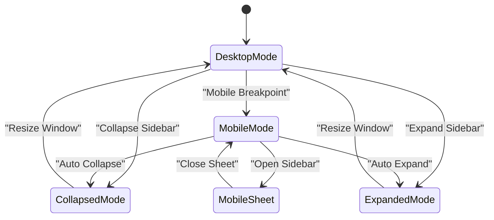

# Mobile Audit Documentation

<cite>
**Referenced Files in This Document**
- [mobile-audit.md](file://docs/mobile-audit.md)
- [audit-log.ts](file://src/lib/audit-log.ts)
- [audit-log-actions.ts](file://src/lib/audit-log-actions.ts)
- [useAdminAudit.ts](file://src/hooks/useAdminAudit.ts)
- [AdminAuditTab.tsx](file://src/components/admin/AdminAuditTab.tsx)
- [overflow-table.tsx](file://src/components/ui/overflow-table.tsx)
- [use-mobile.tsx](file://src/hooks/use-mobile.tsx)
- [sidebar.tsx](file://src/components/ui/sidebar.tsx)
</cite>

## Table of Contents
1. [Introduction](#introduction)
2. [Project Structure](#project-structure)
3. [Core Components](#core-components)
4. [Architecture Overview](#architecture-overview)
5. [Detailed Component Analysis](#detailed-component-analysis)
6. [Responsive Design Implementation](#responsive-design-implementation)
7. [Mobile-Specific Features](#mobile-specific-features)
8. [Performance Considerations](#performance-considerations)
9. [Troubleshooting Guide](#troubleshooting-guide)
10. [Conclusion](#conclusion)

## Introduction

This document provides comprehensive documentation for the Mobile Audit feature implementation in the PCReady application. The Mobile Audit functionality focuses on ensuring optimal user experience across various mobile devices and screen sizes, particularly targeting the audit logging interface used by administrators to monitor system activities.

The implementation encompasses responsive design patterns, mobile-specific UI components, and performance optimizations tailored for mobile environments. The audit system provides real-time monitoring capabilities with filtering, pagination, and export functionalities optimized for touch interactions.

## Project Structure

The Mobile Audit implementation is organized across several key directories and files:

**Diagram sources**
- [audit-log.ts:1-446](file://src/lib/audit-log.ts#L1-L446)
- [useAdminAudit.ts:1-331](file://src/hooks/useAdminAudit.ts#L1-L331)
- [AdminAuditTab.tsx:1-1185](file://src/components/admin/AdminAuditTab.tsx#L1-L1185)

**Section sources**
- [mobile-audit.md:1-98](file://docs/mobile-audit.md#L1-L98)
- [audit-log.ts:1-446](file://src/lib/audit-log.ts#L1-L446)

## Core Components

### Audit Log Management System

The audit log system consists of three primary layers:

1. **Data Layer**: Server-side functions for retrieving, filtering, and exporting audit data
2. **Hook Layer**: Client-side state management and data fetching logic
3. **UI Layer**: Responsive components for displaying audit information

**Diagram sources**
- [audit-log.ts:49-164](file://src/lib/audit-log.ts#L49-L164)
- [useAdminAudit.ts:25-331](file://src/hooks/useAdminAudit.ts#L25-L331)
- [AdminAuditTab.tsx:470-1185](file://src/components/admin/AdminAuditTab.tsx#L470-L1185)

**Section sources**
- [audit-log.ts:49-164](file://src/lib/audit-log.ts#L49-L164)
- [useAdminAudit.ts:25-331](file://src/hooks/useAdminAudit.ts#L25-L331)
- [AdminAuditTab.tsx:470-1185](file://src/components/admin/AdminAuditTab.tsx#L470-L1185)

## Architecture Overview

The Mobile Audit system follows a layered architecture pattern designed for optimal mobile performance:

**Diagram sources**
- [AdminAuditTab.tsx:522-549](file://src/components/admin/AdminAuditTab.tsx#L522-L549)
- [useAdminAudit.ts:109-134](file://src/hooks/useAdminAudit.ts#L109-L134)
- [audit-log.ts:49-164](file://src/lib/audit-log.ts#L49-L164)

The architecture implements several mobile-specific optimizations:

- **Debounced Search**: 400ms delay for search operations to prevent excessive API calls
- **Pagination**: Server-side pagination with configurable page sizes (25, 50, 100)
- **Deduplication**: Automatic removal of duplicate audit entries
- **Responsive Layouts**: Table and timeline view modes optimized for mobile screens

**Section sources**
- [useAdminAudit.ts:136-148](file://src/hooks/useAdminAudit.ts#L136-L148)
- [audit-log.ts:119-136](file://src/lib/audit-log.ts#L119-L136)

## Detailed Component Analysis

### Audit Log Actions System

The audit actions system defines standardized action types for tracking user activities:

**Diagram sources**
- [audit-log-actions.ts:1-27](file://src/lib/audit-log-actions.ts#L1-L27)

The system covers critical administrative actions including ticket management, device operations, user management, OAuth client handling, and automation triggers. Each action type is consistently formatted to ensure reliable filtering and reporting.

**Section sources**
- [audit-log-actions.ts:1-27](file://src/lib/audit-log-actions.ts#L1-L27)

### Mobile-First Responsive Design

The audit interface implements mobile-first responsive design principles:

#### Breakpoint Strategy
- **Mobile**: Up to 960px width (default breakpoint)
- **Tablet**: 961px to 1024px width  
- **Desktop**: Above 1024px width

#### Touch Optimization Features
- **Minimum Touch Targets**: 44px for interactive elements
- **Safe Area Insets**: Proper spacing for modern mobile devices
- **Touch-Friendly Controls**: Enhanced hit areas for mobile interactions
- **Responsive Typography**: 16px font size on mobile to prevent iOS zoom

**Section sources**
- [use-mobile.tsx:1-20](file://src/hooks/use-mobile.tsx#L1-L20)
- [mobile-audit.md:42-56](file://docs/mobile-audit.md#L42-L56)

### Overflow Table Component

The overflow table component provides horizontal scrolling for mobile devices:

**Diagram sources**
- [overflow-table.tsx:9-23](file://src/components/ui/overflow-table.tsx#L9-L23)

The component ensures that audit tables remain usable on mobile devices by implementing proper scroll behavior and accessibility features.

**Section sources**
- [overflow-table.tsx:1-24](file://src/components/ui/overflow-table.tsx#L1-L24)

## Responsive Design Implementation

### Mobile Navigation System

The sidebar component adapts seamlessly to mobile devices:

**Diagram sources**
- [sidebar.tsx:69-94](file://src/components/ui/sidebar.tsx#L69-L94)
- [sidebar.tsx:189-211](file://src/components/ui/sidebar.tsx#L189-L211)

The mobile navigation system automatically switches between desktop and mobile modes based on screen size, providing appropriate touch targets and interaction patterns for each environment.

**Section sources**
- [sidebar.tsx:189-211](file://src/components/ui/sidebar.tsx#L189-L211)
- [use-mobile.tsx:1-20](file://src/hooks/use-mobile.tsx#L1-L20)

### View Mode Adaptations

The audit interface supports dual view modes optimized for different screen sizes:

#### Table View (Desktop-Optimized)
- Fixed column widths for readability
- Advanced filtering controls
- Comprehensive pagination
- Export functionality

#### Timeline View (Mobile-Friendly)
- Vertical chronological layout
- Simplified controls
- Touch-friendly interaction
- Reduced cognitive load

**Section sources**
- [AdminAuditTab.tsx:1027-1080](file://src/components/admin/AdminAuditTab.tsx#L1027-L1080)
- [AdminAuditTab.tsx:1058-1079](file://src/components/admin/AdminAuditTab.tsx#L1058-L1079)

## Mobile-Specific Features

### Touch Interaction Enhancements

The mobile audit implementation includes several touch-specific optimizations:

#### Enhanced Touch Targets
- Navigation buttons: 44px minimum touch area
- Filter controls: Increased hit zones
- Pagination buttons: Larger tap targets
- Action buttons: Improved accessibility

#### Gesture Support
- Horizontal swipe for table navigation
- Tap-to-expand row details
- Long-press for context actions
- Smooth scrolling for large datasets

#### Mobile-Specific UI Elements
- Bottom-sheet navigation for mobile
- Floating action buttons for primary actions
- Simplified form layouts for mobile input
- Adaptive keyboard behavior

**Section sources**
- [mobile-audit.md:30-33](file://docs/mobile-audit.md#L30-L33)
- [sidebar.tsx:455-463](file://src/components/ui/sidebar.tsx#L455-L463)

### Performance Optimizations

Mobile performance is prioritized through several optimization strategies:

#### Lazy Loading
- Conditional component rendering
- On-demand data fetching
- Virtualized lists for large datasets
- Image optimization for mobile networks

#### Memory Management
- Efficient state updates
- Cleanup of event listeners
- Proper disposal of resources
- Minimized re-renders

#### Network Optimization
- Debounced API calls
- Batched requests
- Efficient caching strategies
- Progressive data loading

**Section sources**
- [useAdminAudit.ts:136-148](file://src/hooks/useAdminAudit.ts#L136-L148)
- [audit-log.ts:119-136](file://src/lib/audit-log.ts#L119-L136)

## Performance Considerations

### Mobile-First Data Loading

The audit system implements efficient data loading strategies optimized for mobile networks:

#### Data Deduplication
- Automatic removal of duplicate entries
- Server-side filtering reduces payload size
- Client-side caching prevents redundant requests

#### Pagination Strategy
- Configurable page sizes (25, 50, 100)
- Lazy loading for subsequent pages
- Infinite scroll potential for large datasets

#### Caching Mechanisms
- Local storage for filter preferences
- Session-based caching for recent data
- Smart invalidation strategies

**Section sources**
- [audit-log.ts:119-136](file://src/lib/audit-log.ts#L119-L136)
- [useAdminAudit.ts:270-275](file://src/hooks/useAdminAudit.ts#L270-L275)

### Mobile-Specific Performance Metrics

Performance monitoring includes mobile-specific metrics:

- **First Contentful Paint (FCP)**: Optimized for mobile devices
- **Largest Contentful Paint (LCP)**: Efficient image and content loading
- **Cumulative Layout Shift (CLS)**: Stable layout during data loading
- **Time to Interactive (TTI)**: Fast response on mobile networks

## Troubleshooting Guide

### Common Mobile Issues

#### Rendering Problems
- **Issue**: Tables not displaying properly on small screens
- **Solution**: Verify overflow-table component is wrapping table content
- **Prevention**: Test with various viewport sizes during development

#### Touch Interaction Issues
- **Issue**: Buttons not responding to touch
- **Solution**: Ensure minimum 44px touch targets and proper event handlers
- **Prevention**: Use mobile detection hook for responsive sizing

#### Performance Issues
- **Issue**: Slow loading on mobile devices
- **Solution**: Implement pagination and lazy loading
- **Prevention**: Monitor network requests and optimize data fetching

#### Accessibility Concerns
- **Issue**: Screen reader compatibility problems
- **Solution**: Add proper ARIA labels and semantic markup
- **Prevention**: Regular accessibility testing across devices

**Section sources**
- [mobile-audit.md:84-91](file://docs/mobile-audit.md#L84-L91)
- [overflow-table.tsx:12-18](file://src/components/ui/overflow-table.tsx#L12-L18)

### Debugging Mobile Issues

#### Mobile Testing Strategy
1. **Device Testing**: Test on actual mobile devices
2. **Browser DevTools**: Use device emulation features
3. **Performance Profiling**: Monitor memory and CPU usage
4. **Network Analysis**: Check API response times and sizes

#### Common Debugging Scenarios
- **Layout Breakage**: Check responsive breakpoints and media queries
- **Touch Events**: Verify event propagation and handler registration
- **Data Loading**: Monitor API calls and response handling
- **Memory Leaks**: Track component lifecycle and cleanup

**Section sources**
- [mobile-audit.md:65-82](file://docs/mobile-audit.md#L65-L82)

## Conclusion

The Mobile Audit implementation represents a comprehensive approach to mobile-responsive design for administrative audit interfaces. The system successfully balances functionality with performance, providing administrators with reliable access to audit information across all device types.

Key achievements include:

- **Responsive Architecture**: Seamless adaptation between desktop and mobile environments
- **Touch Optimization**: Intuitive touch interactions with proper accessibility support
- **Performance Focus**: Efficient data loading and rendering optimized for mobile networks
- **Maintainable Code**: Well-structured components with clear separation of concerns

The implementation serves as a foundation for future mobile enhancements and demonstrates best practices for building responsive administrative interfaces. Future improvements should focus on expanding touch-specific interactions and further optimizing performance for low-bandwidth mobile connections.