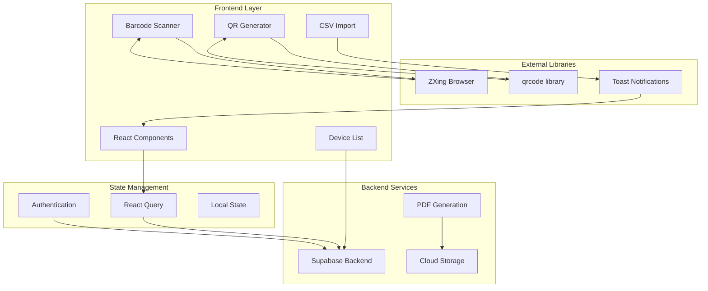
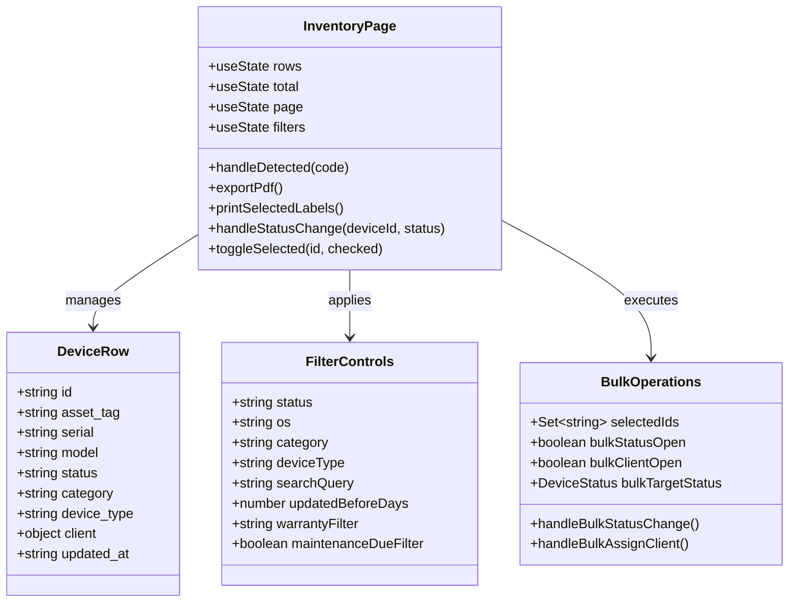
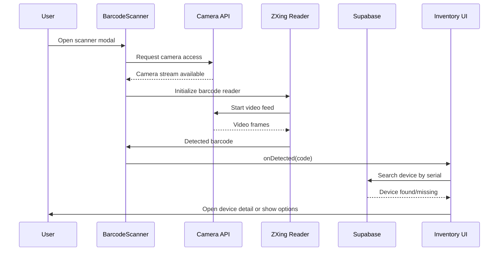
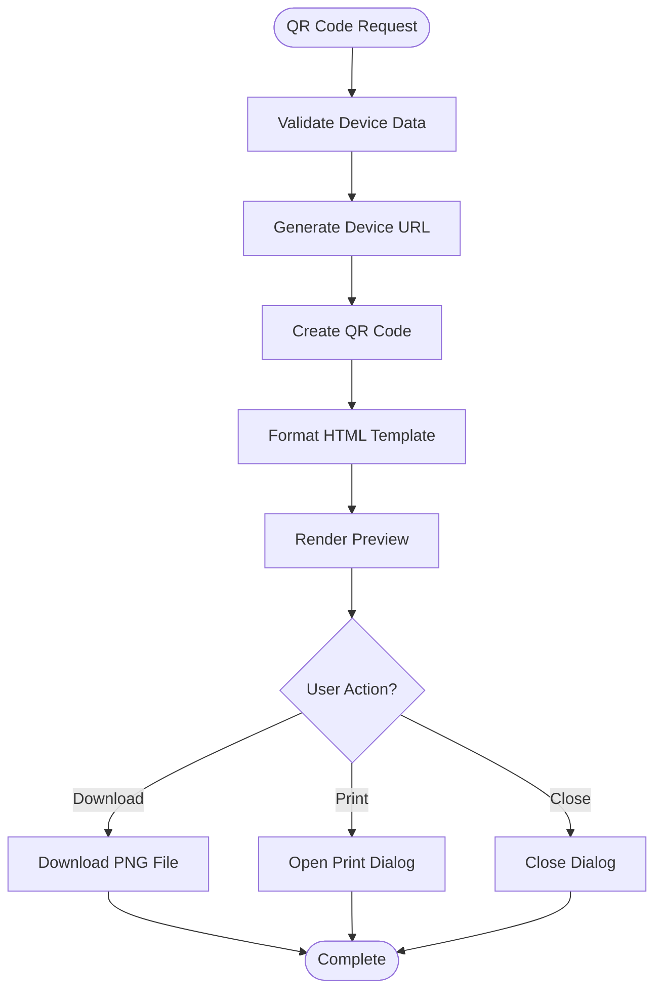
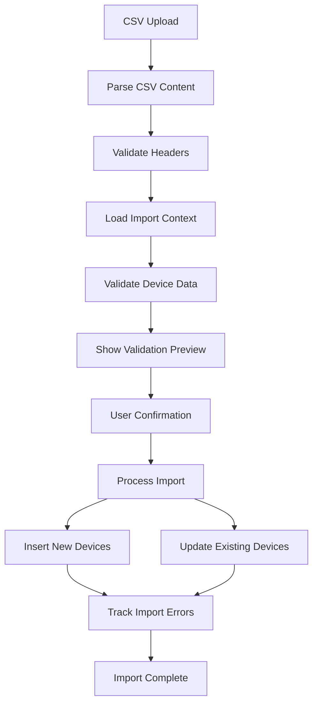
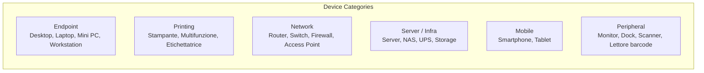
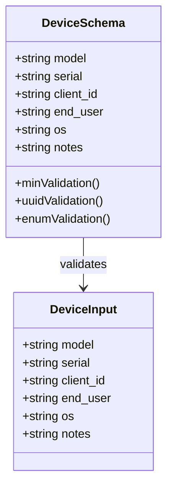
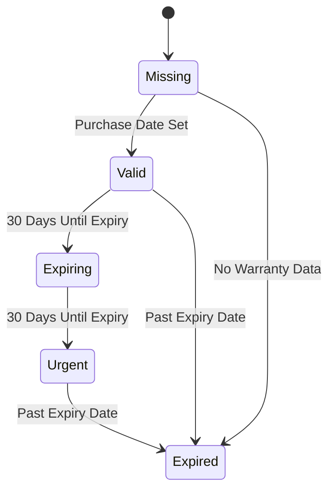
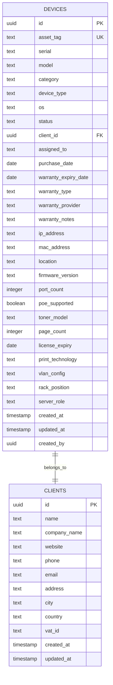

# Barcode Inventory Management

<cite>
**Referenced Files in This Document**
- [BarcodeScanner.tsx](file://src/components/inventory/BarcodeScanner.tsx)
- [QrCodeDialog.tsx](file://src/components/inventory/QrCodeDialog.tsx)
- [ImportCsvDialog.tsx](file://src/components/inventory/ImportCsvDialog.tsx)
- [inventory.tsx](file://src/routes/_app/inventory.tsx)
- [inventory.ts](file://src/lib/queries/inventory.ts)
- [inventory-import.ts](file://src/lib/inventory-import.ts)
- [inventory-labels.ts](file://src/lib/inventory-labels.ts)
- [device-taxonomy.ts](file://src/lib/device-taxonomy.ts)
- [warranty.ts](file://src/lib/warranty.ts)
- [maintenance.ts](file://src/lib/maintenance.ts)
- [devices.ts](file://lib/schemas/devices.ts)
- [20260521144536_extend_devices_it_assets.sql](file://supabase/migrations/20260521144536_extend_devices_it_assets.sql)
- [20260521145745_device_asset_tag_sequence.sql](file://supabase/migrations/20260521145745_device_asset_tag_sequence.sql)
</cite>

## Table of Contents

1. [Introduction](#introduction)
2. [System Architecture](#system-architecture)
3. [Core Components](#core-components)
4. [Barcode Scanning System](#barcode-scanning-system)
5. [QR Code Generation](#qr-code-generation)
6. [CSV Import System](#csv-import-system)
7. [Device Management](#device-management)
8. [Data Validation and Schemas](#data-validation-and-schemas)
9. [Maintenance and Warranty Tracking](#maintenance-and-warranty-tracking)
10. [Database Schema](#database-schema)
11. [Performance Considerations](#performance-considerations)
12. [Troubleshooting Guide](#troubleshooting-guide)
13. [Conclusion](#conclusion)

## Introduction

The Barcode Inventory Management system is a comprehensive solution designed for managing IT assets and devices within organizations. Built with modern web technologies, this system provides robust functionality for barcode scanning, QR code generation, CSV import capabilities, and real-time device tracking. The platform supports multiple device categories including endpoints, printing equipment, networking hardware, servers, mobile devices, and peripherals.

The system integrates seamlessly with Supabase for backend services, React Query for state management, and various third-party libraries for barcode processing and QR code generation. It offers both web-based and mobile-friendly interfaces with advanced filtering, sorting, and reporting capabilities.

## System Architecture

The Barcode Inventory Management system follows a modern React-based architecture with the following key components:

**Diagram sources**

- [BarcodeScanner.tsx:1-186](file://src/components/inventory/BarcodeScanner.tsx#L1-L186)
- [QrCodeDialog.tsx:1-107](file://src/components/inventory/QrCodeDialog.tsx#L1-L107)
- [inventory.tsx:1-800](file://src/routes/_app/inventory.tsx#L1-L800)

The architecture consists of three main layers:

1. **Presentation Layer**: React components handling user interactions and data presentation
2. **State Management Layer**: React Query for data fetching, caching, and synchronization
3. **Data Access Layer**: Supabase integration for database operations and real-time updates

## Core Components

### Inventory Management Interface

The main inventory management interface serves as the central hub for device operations, providing comprehensive functionality for device lifecycle management.

**Diagram sources**

- [inventory.tsx:147-800](file://src/routes/_app/inventory.tsx#L147-L800)

**Section sources**

- [inventory.tsx:147-800](file://src/routes/_app/inventory.tsx#L147-L800)

### Device Status Management

The system implements a sophisticated device status tracking mechanism with four primary states:

- **Available**: Devices ready for assignment
- **Assigned**: Devices currently in use by clients
- **Maintenance**: Devices undergoing repair or service
- **Retired**: Devices decommissioned from service

Each status comes with specific business rules and validation logic to ensure proper device lifecycle management.

## Barcode Scanning System

The barcode scanning functionality provides seamless integration with both webcam-based and external barcode scanners, supporting a wide range of 1D barcode formats.

**Diagram sources**

- [BarcodeScanner.tsx:44-86](file://src/components/inventory/BarcodeScanner.tsx#L44-L86)
- [inventory.tsx:316-345](file://src/routes/_app/inventory.tsx#L316-L345)

### Supported Barcode Formats

The system supports the following 1D barcode formats for dedicated barcode scanning mode:

- **Code 128**: Industrial standard with high data capacity
- **Code 39**: Alphanumeric format widely used in industry
- **Code 93**: Compact format suitable for small items
- **Codabar**: Numeric format with built-in checksum
- **ITF (Interleaved 2 of 5)**: Binary numeric format
- **EAN-13**: Standard product barcode
- **EAN-8**: Shorter version of EAN
- **UPC-A**: Universal Product Code
- **UPC-E**: Reduced version of UPC

### Camera Access and Security

The system implements strict security measures for camera access:

- Requires HTTPS or localhost connection
- Uses secure context detection
- Provides fallback to manual input when camera unavailable
- Handles browser compatibility issues gracefully

**Section sources**

- [BarcodeScanner.tsx:13-23](file://src/components/inventory/BarcodeScanner.tsx#L13-L23)
- [BarcodeScanner.tsx:171-186](file://src/components/inventory/BarcodeScanner.tsx#L171-L186)

## QR Code Generation

The QR code generation system creates printable labels with embedded device information and deep links to device details.

**Diagram sources**

- [QrCodeDialog.tsx:23-60](file://src/components/inventory/QrCodeDialog.tsx#L23-L60)
- [inventory-labels.ts:30-63](file://src/lib/inventory-labels.ts#L30-L63)

### QR Code Features

The QR code system generates high-quality labels with the following specifications:

- **Dimensions**: 256x256 pixels with 2-unit margin
- **Format**: PNG with white background
- **Embedded Data**: Deep link to device detail page
- **Printable Layout**: Optimized for label printers
- **Batch Processing**: Support for multiple device labels

**Section sources**

- [QrCodeDialog.tsx:20-107](file://src/components/inventory/QrCodeDialog.tsx#L20-L107)
- [inventory-labels.ts:1-72](file://src/lib/inventory-labels.ts#L1-L72)

## CSV Import System

The CSV import system provides comprehensive device data ingestion with validation, preview, and batch processing capabilities.

**Diagram sources**

- [ImportCsvDialog.tsx:53-96](file://src/components/inventory/ImportCsvDialog.tsx#L53-L96)
- [inventory-import.ts:125-187](file://src/lib/inventory-import.ts#L125-L187)

### Import Capabilities

The system supports importing devices with the following fields:

- **Asset Tag**: Unique identifier for the device
- **Serial Number**: Manufacturer serial number
- **Brand**: Device manufacturer
- **Model**: Specific device model
- **Category**: Device category (endpoint, printing, etc.)
- **Device Type**: Specific device type within category
- **Operating System**: Installed OS version
- **Status**: Current device status
- **Client Name**: Associated client
- **Notes**: Additional information
- **Purchase Date**: Acquisition date
- **Warranty Expiry**: Warranty expiration date
- **Warranty Type**: Warranty type classification
- **Warranty Provider**: Warranty provider name
- **Warranty Notes**: Warranty-specific notes

### Validation Rules

The import system enforces comprehensive validation:

- **Required Fields**: Model, serial, client name
- **Format Validation**: Date formats, category validation
- **Business Rules**: Device type validation by category
- **Uniqueness**: Duplicate detection for serial and asset tags
- **Reference Validation**: Client existence verification

**Section sources**

- [ImportCsvDialog.tsx:1-290](file://src/components/inventory/ImportCsvDialog.tsx#L1-L290)
- [inventory-import.ts:15-50](file://src/lib/inventory-import.ts#L15-L50)

## Device Management

The device management system provides comprehensive CRUD operations with advanced filtering and search capabilities.

### Device Categories and Types

The system organizes devices into six main categories with specific device types:

**Diagram sources**

- [device-taxonomy.ts:1-57](file://src/lib/device-taxonomy.ts#L1-L57)

### Advanced Filtering System

The inventory interface provides extensive filtering options:

- **Status Filters**: Available, Assigned, Maintenance, Retired
- **OS Filters**: Operating system selection
- **Category and Type**: Device category and specific type
- **Search Functionality**: Multi-field search across asset tags, serial numbers, models
- **Warranty Status**: Filter by warranty validity periods
- **Maintenance Due**: Show devices due for maintenance
- **Update Age**: Filter by last update date

**Section sources**

- [device-taxonomy.ts:21-48](file://src/lib/device-taxonomy.ts#L21-L48)
- [inventory.tsx:540-690](file://src/routes/_app/inventory.tsx#L540-L690)

## Data Validation and Schemas

The system implements comprehensive data validation using Zod schemas for type safety and runtime validation.

### Device Schema Validation

**Diagram sources**

- [devices.ts:5-15](file://lib/schemas/devices.ts#L5-L15)

The device schema enforces:

- **Required Fields**: Model and serial number are mandatory
- **UUID Validation**: Client ID validation
- **Enum Validation**: Operating system selection from predefined options
- **Optional Fields**: Graceful handling of optional data fields

**Section sources**

- [devices.ts:1-15](file://lib/schemas/devices.ts#L1-L15)

## Maintenance and Warranty Tracking

The system provides comprehensive maintenance scheduling and warranty tracking capabilities.

### Warranty Management

**Diagram sources**

- [warranty.ts:67-74](file://src/lib/warranty.ts#L67-L74)

The warranty system tracks:

- **Warranty Types**: Standard, Extended, On-site, None
- **Status Classification**: Valid, Expiring, Urgent, Expired, Missing
- **Progress Calculation**: Warranty duration tracking
- **Expiry Alerts**: Automated notifications for expiring warranties

### Maintenance Scheduling

The maintenance system supports recurring schedules with automated tracking:

- **Recurrence Patterns**: Once, Weekly, Monthly, Quarterly, Yearly
- **Status Tracking**: Scheduled, Due Soon, Overdue, Completed
- **Automated Workflows**: Ticket creation for maintenance events
- **Technician Assignment**: Resource allocation for maintenance tasks

**Section sources**

- [warranty.ts:1-108](file://src/lib/warranty.ts#L1-L108)
- [maintenance.ts:1-242](file://src/lib/maintenance.ts#L1-L242)

## Database Schema

The database schema is designed for scalability and performance with comprehensive indexing and constraints.

### Device Table Structure

**Diagram sources**

- [20260521144536_extend_devices_it_assets.sql:1-44](file://supabase/migrations/20260521144536_extend_devices_it_assets.sql#L1-L44)
- [20260521145745_device_asset_tag_sequence.sql:1-71](file://supabase/migrations/20260521145745_device_asset_tag_sequence.sql#L1-L71)

### Asset Tag Generation

The system automatically generates unique asset tags using a sequence-based approach:

- **Format**: PCR-XXXXXX (where XXXXXX is a 6-digit number)
- **Generation**: Automatic during device creation
- **Uniqueness**: Guaranteed uniqueness through database constraints
- **Fallback**: Manual override available if needed

### Indexing Strategy

The database implements strategic indexing for optimal query performance:

- **Category Index**: For device category filtering
- **Type Index**: For device type queries
- **IP Address Index**: For network device management
- **Asset Tag Index**: For unique device identification

**Section sources**

- [20260521144536_extend_devices_it_assets.sql:41-44](file://supabase/migrations/20260521144536_extend_devices_it_assets.sql#L41-L44)
- [20260521145745_device_asset_tag_sequence.sql:67-71](file://supabase/migrations/20260521145745_device_asset_tag_sequence.sql#L67-L71)

## Performance Considerations

### Query Optimization

The system implements several performance optimization strategies:

- **Pagination**: Efficient handling of large datasets with configurable page sizes
- **Caching**: React Query for intelligent data caching and synchronization
- **Lazy Loading**: Conditional loading of expensive components
- **Debounced Searches**: Optimized search operations with input debouncing

### Memory Management

- **Component Cleanup**: Proper cleanup of scanner resources and event listeners
- **State Optimization**: Minimal state updates and efficient re-rendering
- **Resource Cleanup**: Automatic cleanup of QR code generation resources

### Scalability Features

- **Database Indexes**: Strategic indexing for frequently queried fields
- **Query Limiting**: Configurable limits for large dataset operations
- **Background Processing**: Batch operations for large CSV imports

## Troubleshooting Guide

### Barcode Scanner Issues

**Common Problems and Solutions:**

- **Camera Not Accessible**: Ensure HTTPS connection or use localhost development
- **No Barcode Detection**: Verify barcode quality and lighting conditions
- **Scanner Mode Issues**: Select appropriate mode (inventory vs barcode-1d)
- **Permission Denied**: Check browser permissions for camera access

### QR Code Generation Problems

**Troubleshooting Steps:**

- **QR Code Not Generated**: Verify device data availability and network connectivity
- **Print Issues**: Check printer driver compatibility and paper size
- **Download Failures**: Ensure sufficient disk space and file permissions
- **Label Quality**: Adjust print settings and use recommended label stock

### CSV Import Errors

**Import Validation Issues:**

- **Header Mismatch**: Ensure CSV matches required template format
- **Duplicate Entries**: Remove duplicate serial numbers or asset tags
- **Invalid References**: Verify client names exist in the system
- **Format Errors**: Check date formats and required field completion

**Section sources**

- [BarcodeScanner.tsx:180-186](file://src/components/inventory/BarcodeScanner.tsx#L180-L186)
- [QrCodeDialog.tsx:51-60](file://src/components/inventory/QrCodeDialog.tsx#L51-L60)

## Conclusion

The Barcode Inventory Management system provides a comprehensive solution for IT asset management with robust barcode scanning, QR code generation, and CSV import capabilities. The system's modular architecture ensures maintainability and extensibility while providing excellent user experience through intuitive interfaces and powerful filtering capabilities.

Key strengths of the system include:

- **Comprehensive Barcode Support**: Wide range of 1D barcode formats with dedicated scanning mode
- **Advanced Device Management**: Sophisticated categorization and filtering system
- **Robust Data Import**: Comprehensive CSV import with validation and error handling
- **Quality QR Code Generation**: Professional label printing with batch processing
- **Maintenance Integration**: Complete maintenance scheduling and warranty tracking
- **Performance Optimization**: Efficient database design and frontend optimization

The system is well-suited for organizations requiring reliable inventory management with barcode technology integration, offering both operational efficiency and comprehensive reporting capabilities.
