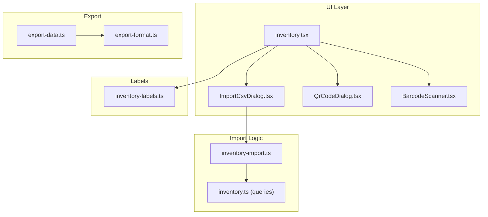
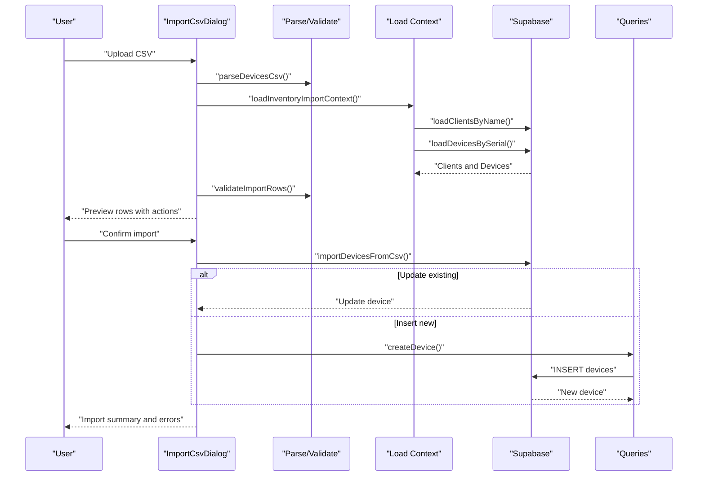
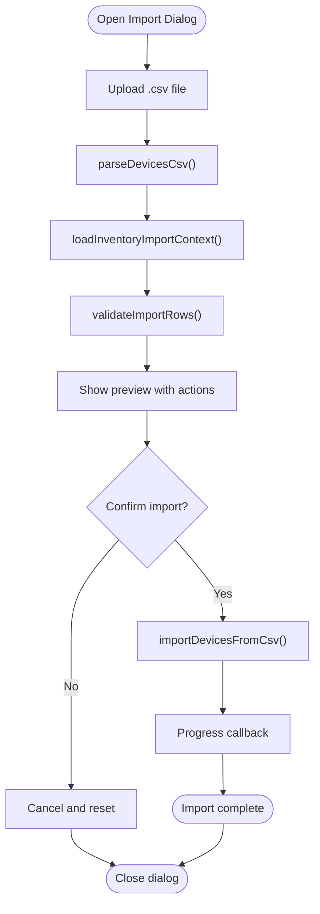
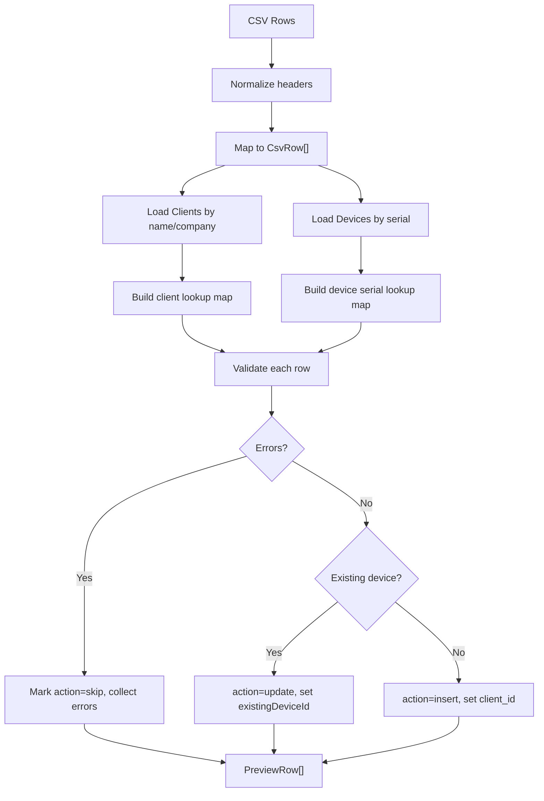
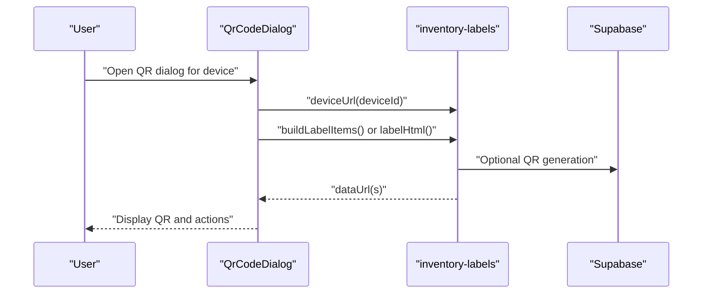
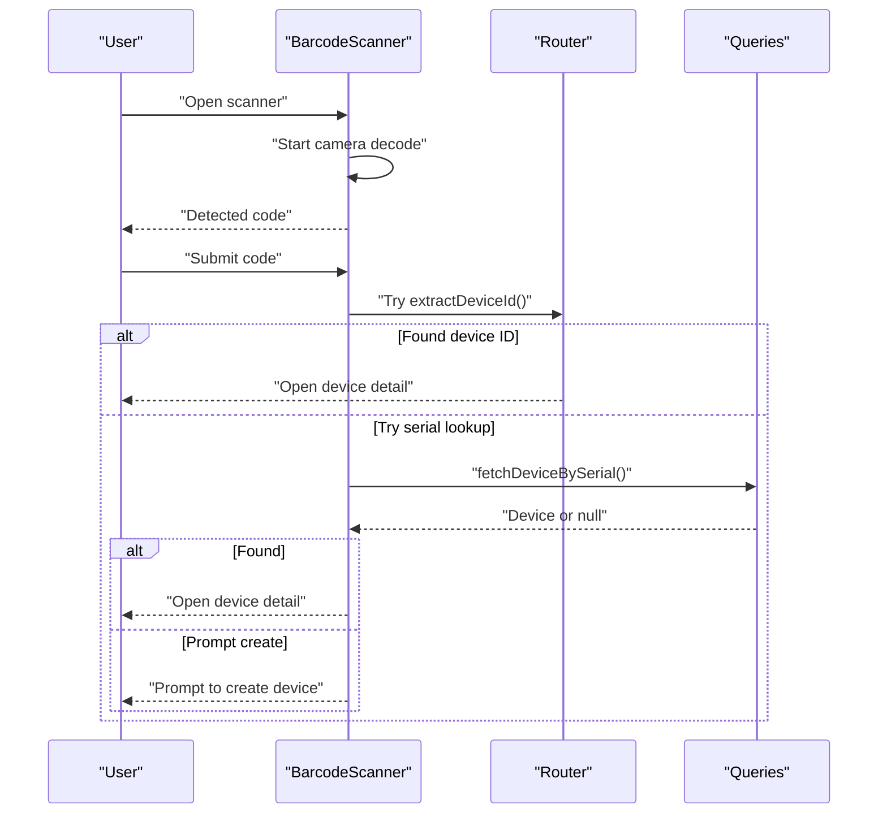
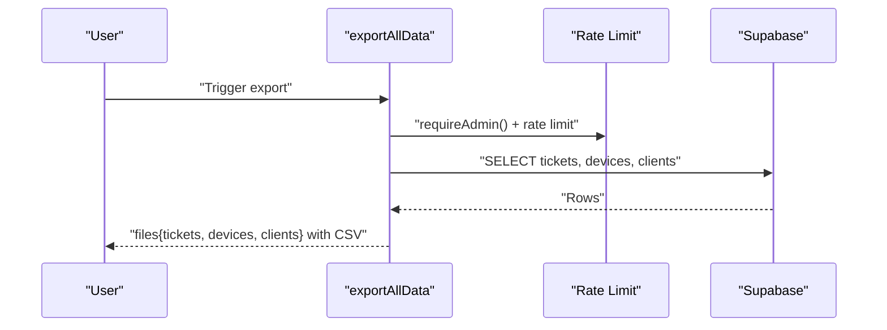
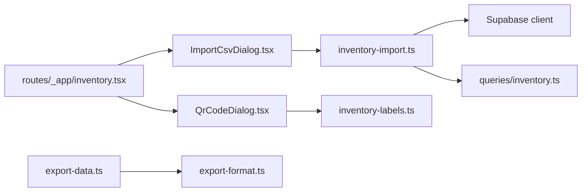

# Device Import and Export

<cite>
**Referenced Files in This Document**
- [ImportCsvDialog.tsx](file://src/components/inventory/ImportCsvDialog.tsx)
- [inventory-import.ts](file://src/lib/inventory-import.ts)
- [QrCodeDialog.tsx](file://src/components/inventory/QrCodeDialog.tsx)
- [BarcodeScanner.tsx](file://src/components/inventory/BarcodeScanner.tsx)
- [inventory.tsx](file://src/routes/_app/inventory.tsx)
- [inventory-labels.ts](file://src/lib/inventory-labels.ts)
- [export-data.ts](file://src/lib/export-data.ts)
- [export-format.ts](file://src/lib/export-format.ts)
- [inventory.ts](file://src/lib/queries/inventory.ts)
- [inventory-import.test.ts](file://src/__tests__/lib/inventory-import.test.ts)
</cite>

## Table of Contents
1. [Introduction](#introduction)
2. [Project Structure](#project-structure)
3. [Core Components](#core-components)
4. [Architecture Overview](#architecture-overview)
5. [Detailed Component Analysis](#detailed-component-analysis)
6. [Dependency Analysis](#dependency-analysis)
7. [Performance Considerations](#performance-considerations)
8. [Troubleshooting Guide](#troubleshooting-guide)
9. [Conclusion](#conclusion)
10. [Appendices](#appendices)

## Introduction
This document explains the device import and export capabilities of the inventory system. It covers:
- CSV import workflow via ImportCsvDialog, including parsing, validation, duplicate detection, and bulk device creation
- Inventory import module behavior, supported CSV formats, required columns, validation rules, and error reporting
- QR code generation and scanning for device identification and labeling
- Export functionality for generating device lists and reports
- Performance considerations for large CSV imports and data transformations

## Project Structure
The import/export features are implemented across UI dialogs, a central import library, and supporting query and export utilities.

**Diagram sources**
- [ImportCsvDialog.tsx:1-281](file://src/components/inventory/ImportCsvDialog.tsx#L1-L281)
- [inventory-import.ts:1-271](file://src/lib/inventory-import.ts#L1-L271)
- [QrCodeDialog.tsx:1-100](file://src/components/inventory/QrCodeDialog.tsx#L1-L100)
- [BarcodeScanner.tsx:1-120](file://src/components/inventory/BarcodeScanner.tsx#L1-L120)
- [inventory.tsx:1-580](file://src/routes/_app/inventory.tsx#L1-L580)
- [inventory-labels.ts:1-72](file://src/lib/inventory-labels.ts#L1-L72)
- [export-data.ts:1-62](file://src/lib/export-data.ts#L1-L62)
- [export-format.ts:1-35](file://src/lib/export-format.ts#L1-L35)
- [inventory.ts:1-128](file://src/lib/queries/inventory.ts#L1-L128)

**Section sources**
- [ImportCsvDialog.tsx:1-281](file://src/components/inventory/ImportCsvDialog.tsx#L1-L281)
- [inventory-import.ts:1-271](file://src/lib/inventory-import.ts#L1-L271)
- [QrCodeDialog.tsx:1-100](file://src/components/inventory/QrCodeDialog.tsx#L1-L100)
- [BarcodeScanner.tsx:1-120](file://src/components/inventory/BarcodeScanner.tsx#L1-L120)
- [inventory.tsx:1-580](file://src/routes/_app/inventory.tsx#L1-L580)
- [inventory-labels.ts:1-72](file://src/lib/inventory-labels.ts#L1-L72)
- [export-data.ts:1-62](file://src/lib/export-data.ts#L1-L62)
- [export-format.ts:1-35](file://src/lib/export-format.ts#L1-L35)
- [inventory.ts:1-128](file://src/lib/queries/inventory.ts#L1-L128)

## Core Components
- ImportCsvDialog: Multi-step UI for CSV upload, preview, and confirmation; orchestrates parsing, validation, and import execution
- inventory-import: Central module implementing CSV parsing, client/device lookup, validation, and import execution
- QrCodeDialog: Generates QR codes for device identification and prints/stores labels
- BarcodeScanner: Scans QR/barcodes or accepts manual input to locate devices
- inventory.ts (route): Integrates dialogs, exposes actions, and manages state
- inventory-labels: Builds QR label batches for printing
- export-data and export-format: Export utilities for generating downloadable reports

**Section sources**
- [ImportCsvDialog.tsx:23-95](file://src/components/inventory/ImportCsvDialog.tsx#L23-L95)
- [inventory-import.ts:49-180](file://src/lib/inventory-import.ts#L49-L180)
- [QrCodeDialog.tsx:19-94](file://src/components/inventory/QrCodeDialog.tsx#L19-L94)
- [BarcodeScanner.tsx:11-102](file://src/components/inventory/BarcodeScanner.tsx#L11-L102)
- [inventory.tsx:476-489](file://src/routes/_app/inventory.tsx#L476-L489)
- [inventory-labels.ts:5-24](file://src/lib/inventory-labels.ts#L5-L24)
- [export-data.ts:11-52](file://src/lib/export-data.ts#L11-L52)
- [export-format.ts:19-35](file://src/lib/export-format.ts#L19-L35)

## Architecture Overview
End-to-end flow for CSV import and QR label generation.

**Diagram sources**
- [ImportCsvDialog.tsx:52-95](file://src/components/inventory/ImportCsvDialog.tsx#L52-L95)
- [inventory-import.ts:72-180](file://src/lib/inventory-import.ts#L72-L180)
- [inventory.ts:82-90](file://src/lib/queries/inventory.ts#L82-L90)

## Detailed Component Analysis

### CSV Import Workflow (ImportCsvDialog)
- Step 1: Upload CSV file and parse into rows
- Step 2: Load import context (clients and existing devices) and validate rows
- Step 3: Confirm import and execute batch operations with progress feedback

**Diagram sources**
- [ImportCsvDialog.tsx:52-95](file://src/components/inventory/ImportCsvDialog.tsx#L52-L95)
- [inventory-import.ts:72-180](file://src/lib/inventory-import.ts#L72-L180)

**Section sources**
- [ImportCsvDialog.tsx:23-95](file://src/components/inventory/ImportCsvDialog.tsx#L23-L95)
- [inventory-import.ts:49-126](file://src/lib/inventory-import.ts#L49-L126)

### Inventory Import Module (inventory-import.ts)
- Supported CSV headers: serial, model, os, status, client_name, notes
- Validation rules:
  - serial, model, client_name required
  - status must be one of available, assigned, maintenance, retired
  - client_name must resolve to an existing client (by name or company_name)
  - duplicate serials within the CSV are flagged
  - blank rows are ignored
- Bulk operations:
  - Updates existing devices by ID
  - Inserts new devices using createDevice helper
- Context loading:
  - Clients loaded by name/company_name
  - Devices loaded by serial

**Diagram sources**
- [inventory-import.ts:49-126](file://src/lib/inventory-import.ts#L49-L126)
- [inventory-import.ts:198-226](file://src/lib/inventory-import.ts#L198-L226)

**Section sources**
- [inventory-import.ts:6-14](file://src/lib/inventory-import.ts#L6-L14)
- [inventory-import.ts:49-126](file://src/lib/inventory-import.ts#L49-L126)
- [inventory-import.ts:198-226](file://src/lib/inventory-import.ts#L198-L226)
- [inventory.ts:82-90](file://src/lib/queries/inventory.ts#L82-L90)

### QR Code Generation and Label Printing
- QR code generation uses device URL for identification
- Labels can be downloaded as PNG or printed directly
- Batch label generation supports multiple devices

**Diagram sources**
- [QrCodeDialog.tsx:19-94](file://src/components/inventory/QrCodeDialog.tsx#L19-L94)
- [inventory-labels.ts:5-24](file://src/lib/inventory-labels.ts#L5-L24)
- [inventory-labels.ts:30-63](file://src/lib/inventory-labels.ts#L30-L63)

**Section sources**
- [QrCodeDialog.tsx:19-94](file://src/components/inventory/QrCodeDialog.tsx#L19-L94)
- [inventory-labels.ts:5-24](file://src/lib/inventory-labels.ts#L5-L24)
- [inventory-labels.ts:30-63](file://src/lib/inventory-labels.ts#L30-L63)

### Barcode Scanning for Device Identification
- Camera-based scanning via @zxing/browser
- Manual input fallback
- Extracts device identifiers from URLs or raw text

**Diagram sources**
- [BarcodeScanner.tsx:11-102](file://src/components/inventory/BarcodeScanner.tsx#L11-L102)
- [inventory.tsx:191-220](file://src/routes/_app/inventory.tsx#L191-L220)
- [inventory.ts:72-80](file://src/lib/queries/inventory.ts#L72-L80)

**Section sources**
- [BarcodeScanner.tsx:11-102](file://src/components/inventory/BarcodeScanner.tsx#L11-L102)
- [inventory.tsx:191-220](file://src/routes/_app/inventory.tsx#L191-L220)
- [inventory.ts:72-80](file://src/lib/queries/inventory.ts#L72-L80)

### Export Functionality
- Export all data (devices, clients, tickets) to CSV
- Uses server function with rate limiting and admin checks
- Generates filenames with date stamps

**Diagram sources**
- [export-data.ts:11-52](file://src/lib/export-data.ts#L11-L52)
- [export-format.ts:8-17](file://src/lib/export-format.ts#L8-L17)

**Section sources**
- [export-data.ts:11-52](file://src/lib/export-data.ts#L11-L52)
- [export-format.ts:8-17](file://src/lib/export-format.ts#L8-L17)

## Dependency Analysis
- ImportCsvDialog depends on inventory-import for parsing, validation, and import execution
- inventory-import depends on Supabase client for lookups and on inventory queries for inserts
- QR dialog and labels depend on inventory-labels for QR generation and HTML templates
- Export relies on server-side admin checks and rate limiting

**Diagram sources**
- [ImportCsvDialog.tsx:1-16](file://src/components/inventory/ImportCsvDialog.tsx#L1-L16)
- [inventory-import.ts:1-2](file://src/lib/inventory-import.ts#L1-L2)
- [inventory.ts:1-2](file://src/lib/queries/inventory.ts#L1-L2)
- [QrCodeDialog.tsx:1-6](file://src/components/inventory/QrCodeDialog.tsx#L1-L6)
- [inventory-labels.ts:1-3](file://src/lib/inventory-labels.ts#L1-L3)
- [inventory.tsx:1-22](file://src/routes/_app/inventory.tsx#L1-L22)
- [export-data.ts:1-2](file://src/lib/export-data.ts#L1-L2)
- [export-format.ts:1-2](file://src/lib/export-format.ts#L1-L2)

**Section sources**
- [ImportCsvDialog.tsx:1-16](file://src/components/inventory/ImportCsvDialog.tsx#L1-L16)
- [inventory-import.ts:1-2](file://src/lib/inventory-import.ts#L1-L2)
- [inventory.ts:1-2](file://src/lib/queries/inventory.ts#L1-L2)
- [QrCodeDialog.tsx:1-6](file://src/components/inventory/QrCodeDialog.tsx#L1-L6)
- [inventory-labels.ts:1-3](file://src/lib/inventory-labels.ts#L1-L3)
- [inventory.tsx:1-22](file://src/routes/_app/inventory.tsx#L1-L22)
- [export-data.ts:1-2](file://src/lib/export-data.ts#L1-L2)
- [export-format.ts:1-2](file://src/lib/export-format.ts#L1-L2)

## Performance Considerations
- CSV parsing is implemented with a robust tokenizer to handle quoted fields and escaped commas
- Client and device lookups are batched:
  - Clients: up to 25 names per query using OR filters
  - Devices: up to 50 serials per query
- Import execution:
  - Updates use Supabase update by ID
  - Inserts use createDevice helper; for very large imports, consider batching via createDevicesBulk if needed
- UI progress updates occur after each operation to keep users informed

Recommendations:
- For very large CSVs, consider splitting into smaller chunks and importing sequentially
- Prefer unique serials and valid client names to minimize rejections and retries
- Use the provided template to ensure consistent column ordering and minimal parsing overhead

**Section sources**
- [inventory-import.ts:236-270](file://src/lib/inventory-import.ts#L236-L270)
- [inventory-import.ts:198-226](file://src/lib/inventory-import.ts#L198-L226)
- [inventory.ts:92-100](file://src/lib/queries/inventory.ts#L92-L100)

## Troubleshooting Guide
Common issues and resolutions:
- Empty or invalid CSV:
  - Ensure the file contains headers and at least one data row
  - Use the provided template to match expected columns
- Validation errors:
  - serial, model, client_name are required
  - status must be one of available, assigned, maintenance, retired
  - client_name must correspond to an existing client (by name or company_name)
  - Duplicate serials within the same CSV are not allowed
- Import permission:
  - Requires edit permissions; otherwise import is blocked
- Camera/QR issues:
  - Scanning requires HTTPS or localhost; fallback to manual input is available
  - QR generation failures show an error toast; retry or download PNG
- Export limitations:
  - Admin access and rate limits apply; ensure proper credentials and spacing between exports

**Section sources**
- [ImportCsvDialog.tsx:52-95](file://src/components/inventory/ImportCsvDialog.tsx#L52-L95)
- [inventory-import.ts:86-126](file://src/lib/inventory-import.ts#L86-L126)
- [QrCodeDialog.tsx:22-38](file://src/components/inventory/QrCodeDialog.tsx#L22-L38)
- [BarcodeScanner.tsx:105-120](file://src/components/inventory/BarcodeScanner.tsx#L105-L120)
- [export-data.ts:11-21](file://src/lib/export-data.ts#L11-L21)

## Conclusion
The inventory import/export system provides a robust, user-friendly pipeline for managing device data. CSV import validates and transforms data efficiently, while QR generation and scanning streamline device identification. Exports enable comprehensive reporting. Following the validation rules and best practices ensures smooth operations, especially for large datasets.

## Appendices

### Supported CSV Format and Required Columns
- Headers: serial, model, os, status, client_name, notes
- Notes:
  - status defaults to available if empty
  - os and notes may be empty
  - Blank rows are ignored

**Section sources**
- [inventory-import.ts:6-14](file://src/lib/inventory-import.ts#L6-L14)
- [inventory-import.ts:49-70](file://src/lib/inventory-import.ts#L49-L70)

### Example Import Workflows
- Single device update:
  - CSV contains an existing serial; validation sets action=update; import updates device fields
- Mixed insert/update:
  - CSV mixes new and existing serials; validation determines action per row; import executes updates and inserts
- Template usage:
  - Download the CSV template from the import dialog and fill in device details

**Section sources**
- [ImportCsvDialog.tsx:72-74](file://src/components/inventory/ImportCsvDialog.tsx#L72-L74)
- [inventory-import.ts:86-126](file://src/lib/inventory-import.ts#L86-L126)
- [inventory-import.test.ts:154-187](file://src/__tests__/lib/inventory-import.test.ts#L154-L187)

### Validation Rules Summary
- Required fields: serial, model, client_name
- Status validation: must be one of available, assigned, maintenance, retired
- Client resolution: matches by name or company_name
- Duplicate detection: serials must be unique within the CSV
- Blank rows: ignored during parsing

**Section sources**
- [inventory-import.ts:110-116](file://src/lib/inventory-import.ts#L110-L116)
- [inventory-import.test.ts:79-125](file://src/__tests__/lib/inventory-import.test.ts#L79-L125)