# Device Inventory Tracking

<cite>
**Referenced Files in This Document**
- [AddDeviceModal.tsx](file://src/components/pcready/AddDeviceModal.tsx)
- [DeviceDetailModal.tsx](file://src/components/pcready/DeviceDetailModal.tsx)
- [inventory.tsx](file://src/routes/_app/inventory.tsx)
- [inventory.ts](file://src/lib/queries/inventory.ts)
- [devices.ts](file://src/lib/schemas/devices.ts)
- [device-status.ts](file://src/lib/device-status.ts)
- [inventory-import.ts](file://src/lib/inventory-import.ts)
- [ImportCsvDialog.tsx](file://src/components/inventory/ImportCsvDialog.tsx)
- [BarcodeScanner.tsx](file://src/components/inventory/BarcodeScanner.tsx)
- [device-taxonomy.ts](file://src/lib/device-taxonomy.ts)
- [barcode-inventory.md](file://docs/barcode-inventory.md)
- [use-tickets.tsx](file://src/lib/use-tickets.tsx)
- [pcready.ts](file://src/lib/pcready.ts)
- [queryClient.ts](file://src/lib/queries/queryClient.ts)
- [InventoryPdf.tsx](file://src/components/pcready/pdf/InventoryPdf.tsx)
- [export.tsx](file://src/components/pcready/pdf/export.tsx)
- [export-data.ts](file://src/lib/export-data.ts)
- [useAdminAppSettings.ts](file://src/hooks/useAdminAppSettings.ts)
- [device_activity_log.sql](file://supabase/migrations/20260515100000_device_activity_log.sql)
</cite>

## Update Summary
**Changes Made**
- Enhanced AddDeviceModal with dynamic field generation based on device categories
- Added comprehensive barcode scanning capabilities with separate 1D barcode mode
- Integrated BarcodeScanner component for both QR inventory scanning and 1D barcode reading
- Enhanced DeviceDetailModal with barcode field editing and hardware configuration tabs
- Added advanced import/export functionality with full data export capabilities
- Expanded device taxonomy with new categories and specialized field sets
- Implemented device category-based dynamic form fields for different device types

## Table of Contents
1. [Introduction](#introduction)
2. [Project Structure](#project-structure)
3. [Core Components](#core-components)
4. [Architecture Overview](#architecture-overview)
5. [Detailed Component Analysis](#detailed-component-analysis)
6. [Enhanced Barcode Scanning System](#enhanced-barcode-scanning-system)
7. [Dynamic Device Field Generation](#dynamic-device-field-generation)
8. [Advanced Import/Export Functionality](#advanced-importexport-functionality)
9. [Enhanced DeviceDetailModal Features](#enhanced-devicedetailmodal-features)
10. [Bulk Operations Implementation](#bulk-operations-implementation)
11. [Device Activity Logging System](#device-activity-logging-system)
12. [PDF Export Functionality](#pdf-export-functionality)
13. [Dependency Analysis](#dependency-analysis)
14. [Performance Considerations](#performance-considerations)
15. [Troubleshooting Guide](#troubleshooting-guide)
16. [Conclusion](#conclusion)
17. [Appendices](#appendices)

## Introduction
This document explains the enhanced device inventory tracking system, focusing on:
- Inventory listing with filtering by status, operating system, search terms, pagination, assignment status, and device categories
- The AddDeviceModal component with dynamic field generation based on device categories
- Enhanced DeviceDetailModal with barcode field editing and hardware configuration tabs
- Advanced barcode scanning capabilities including separate 1D barcode mode
- Comprehensive import/export functionality with full data export capabilities
- Device creation via createDevice and createDevicesBulk functions
- Enhanced fetchDevicesList implementation with category filtering and parameter handling
- The useInventoryList hook for reactive data fetching and caching
- Device status management and lifecycle tracking
- Practical examples for inventory queries, device creation workflows, and bulk import scenarios
- Performance considerations and pagination strategies for large inventories

## Project Structure
The inventory feature spans UI components, route handlers, data access utilities, and shared libraries:
- Route handler renders the inventory page with enhanced filtering, pagination, status updates, and bulk operations
- Queries module encapsulates Supabase data access with category filtering and caching
- UI components capture device inputs, scan barcodes, import CSV, provide detailed device views, and manage dynamic fields
- Shared libraries define device taxonomy, status management, schemas, and export utilities
- Database layer supports device activity logging with device_id foreign key relationships

```mermaid
graph TB
subgraph "UI Layer"
INV["Inventory Route<br/>inventory.tsx"]
ADD["AddDeviceModal<br/>AddDeviceModal.tsx"]
DETAIL["DeviceDetailModal<br/>DeviceDetailModal.tsx"]
IMPORT["Import CSV Dialog<br/>ImportCsvDialog.tsx"]
BAR["Barcode Scanner<br/>BarcodeScanner.tsx"]
PDF["PDF Export<br/>InventoryPdf.tsx"]
EXPORT["Full Data Export<br/>useAdminAppSettings.ts"]
ENDSUB
subgraph "Libraries"
SCHEMA["Device Schema<br/>devices.ts"]
TAXONOMY["Device Taxonomy<br/>device-taxonomy.ts"]
PCREADY["OS Options & Status Labels<br/>pcready.ts"]
TICKETS["Global State (openAddDevice)<br/>use-tickets.ts"]
QUERY_CLIENT["React Query Defaults<br/>queryClient.ts"]
EXPORT_UTIL["Export Utilities<br/>export-data.ts"]
ENDSUB
subgraph "Data Access"
QUERIES["Inventory Queries<br/>lib/queries/inventory.ts"]
STATUS_FN["Device Status Server Fn<br/>lib/device-status.ts"]
IMPORT_LIB["CSV Import Utilities<br/>lib/inventory-import.ts"]
ACTIVITY_DB["Device Activity Log<br/>device_activity_log.sql"]
ENDSUB
INV --> QUERIES
INV --> PCREADY
INV --> IMPORT
INV --> BAR
INV --> PDF
INV --> EXPORT
ADD --> SCHEMA
ADD --> QUERIES
ADD --> TAXONOMY
ADD --> PCREADY
ADD --> TICKETS
DETAIL --> QUERIES
DETAIL --> ACTIVITY_DB
IMPORT --> IMPORT_LIB
IMPORT_LIB --> QUERIES
STATUS_FN --> INV
QUERY_CLIENT --> INV
EXPORT_UTIL --> EXPORT
```

**Diagram sources**
- [inventory.tsx:24-37](file://src/routes/_app/inventory.tsx#L24-L37)
- [AddDeviceModal.tsx:27-76](file://src/components/pcready/AddDeviceModal.tsx#L27-L76)
- [DeviceDetailModal.tsx:120-137](file://src/components/pcready/DeviceDetailModal.tsx#L120-L137)
- [inventory.ts:22-70](file://src/lib/queries/inventory.ts#L22-L70)
- [devices.ts:4-12](file://src/lib/schemas/devices.ts#L4-L12)
- [device-taxonomy.ts:1-57](file://src/lib/device-taxonomy.ts#L1-L57)
- [pcready.ts:66-66](file://src/lib/pcready.ts#L66-L66)
- [use-tickets.tsx:19-36](file://src/lib/use-tickets.tsx#L19-L36)
- [queryClient.ts:4-13](file://src/lib/queries/queryClient.ts#L4-L13)
- [device-status.ts:15-55](file://src/lib/device-status.ts#L15-L55)
- [inventory-import.ts:1-271](file://src/lib/inventory-import.ts#L1-L271)
- [InventoryPdf.tsx:1-93](file://src/components/pcready/pdf/InventoryPdf.tsx#L1-L93)
- [export.tsx:1-18](file://src/components/pcready/pdf/export.tsx#L1-L18)
- [export-data.ts:1-62](file://src/lib/export-data.ts#L1-L62)
- [useAdminAppSettings.ts:177-208](file://src/hooks/useAdminAppSettings.ts#L177-L208)
- [device_activity_log.sql:1-27](file://supabase/migrations/20260515100000_device_activity_log.sql#L1-L27)

**Section sources**
- [inventory.tsx:24-37](file://src/routes/_app/inventory.tsx#L24-L37)
- [inventory.ts:22-70](file://src/lib/queries/inventory.ts#L22-L70)
- [AddDeviceModal.tsx:27-76](file://src/components/pcready/AddDeviceModal.tsx#L27-L76)
- [DeviceDetailModal.tsx:120-137](file://src/components/pcready/DeviceDetailModal.tsx#L120-L137)
- [devices.ts:4-12](file://src/lib/schemas/devices.ts#L4-L12)
- [device-taxonomy.ts:1-57](file://src/lib/device-taxonomy.ts#L1-L57)
- [pcready.ts:66-66](file://src/lib/pcready.ts#L66-L66)
- [use-tickets.tsx:19-36](file://src/lib/use-tickets.tsx#L19-L36)
- [queryClient.ts:4-13](file://src/lib/queries/queryClient.ts#L4-L13)
- [device-status.ts:15-55](file://src/lib/device-status.ts#L15-L55)
- [inventory-import.ts:1-271](file://src/lib/inventory-import.ts#L1-L271)
- [InventoryPdf.tsx:1-93](file://src/components/pcready/pdf/InventoryPdf.tsx#L1-L93)
- [export.tsx:1-18](file://src/components/pcready/pdf/export.tsx#L1-L18)
- [export-data.ts:1-62](file://src/lib/export-data.ts#L1-L62)
- [useAdminAppSettings.ts:177-208](file://src/hooks/useAdminAppSettings.ts#L177-L208)
- [device_activity_log.sql:1-27](file://supabase/migrations/20260515100000_device_activity_log.sql#L1-L27)

## Core Components
- Enhanced Inventory route page: renders filters including device categories and types, table, pagination, status badges, actions, and bulk operation controls
- AddDeviceModal with dynamic field generation: captures device details with category-specific fields, validates via schema, and creates devices
- Enhanced DeviceDetailModal: provides comprehensive device information, barcode field editing, hardware configuration tabs, and activity timeline
- BarcodeScanner component: supports both QR inventory scanning and dedicated 1D barcode reading with hardware keyboard-wedge compatibility
- Advanced import/export system: CSV import with validation and bulk operations, plus full data export functionality
- Enhanced device taxonomy: expanded categories with specialized field sets for different device types
- Status management: updates device status with enhanced validation and notifications
- PDF export: generates professional inventory reports with comprehensive device details

**Section sources**
- [inventory.tsx:63-120](file://src/routes/_app/inventory.tsx#L63-L120)
- [AddDeviceModal.tsx:531-675](file://src/components/pcready/AddDeviceModal.tsx#L531-L675)
- [DeviceDetailModal.tsx:120-137](file://src/components/pcready/DeviceDetailModal.tsx#L120-L137)
- [BarcodeScanner.tsx:1-186](file://src/components/inventory/BarcodeScanner.tsx#L1-L186)
- [device-taxonomy.ts:1-57](file://src/lib/device-taxonomy.ts#L1-L57)
- [export-data.ts:1-62](file://src/lib/export-data.ts#L1-L62)

## Architecture Overview
The system uses React Query for caching and background synchronization, Supabase for data persistence, and Zod for input validation. The inventory route composes filters including device categories and types into a query key consumed by useInventoryList. Enhanced bulk operations leverage direct Supabase mutations for improved performance. The barcode scanning system provides dual-mode functionality for QR inventory codes and 1D barcodes. DeviceDetailModal provides comprehensive device insights with barcode editing capabilities and hardware configuration tabs.

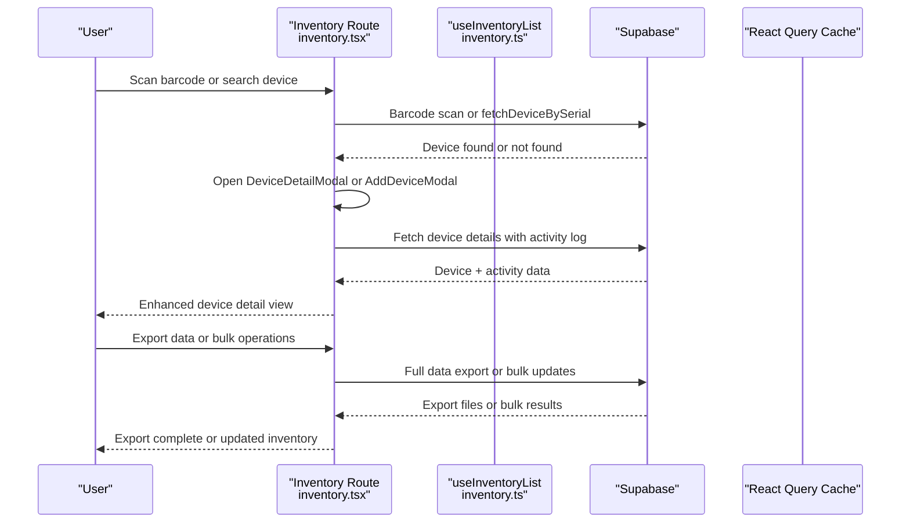

**Diagram sources**
- [inventory.tsx:316-345](file://src/routes/_app/inventory.tsx#L316-L345)
- [DeviceDetailModal.tsx:155-305](file://src/components/pcready/DeviceDetailModal.tsx#L155-L305)
- [BarcodeScanner.tsx:25-93](file://src/components/inventory/BarcodeScanner.tsx#L25-L93)
- [export-data.ts:11-52](file://src/lib/export-data.ts#L11-L52)
- [inventory.ts:56-70](file://src/lib/queries/inventory.ts#L56-L70)

**Section sources**
- [inventory.tsx:316-345](file://src/routes/_app/inventory.tsx#L316-L345)
- [DeviceDetailModal.tsx:155-305](file://src/components/pcready/DeviceDetailModal.tsx#L155-L305)
- [BarcodeScanner.tsx:25-93](file://src/components/inventory/BarcodeScanner.tsx#L25-L93)
- [export-data.ts:11-52](file://src/lib/export-data.ts#L11-L52)
- [inventory.tsx:86-121](file://src/routes/_app/inventory.tsx#L86-L121)
- [inventory.ts:56-70](file://src/lib/queries/inventory.ts#L56-L70)

## Detailed Component Analysis

### Enhanced Inventory Listing and Filtering
- Filters supported:
  - Status: available, assigned, maintenance, retired
  - Operating system: configurable via OS options
  - Device category and type: comprehensive filtering by device categories and specific types
  - Search term: matches asset_tag, serial, model, or assigned user
  - Assignment status: optional filter excluding devices with active assignments
  - Date filters: non-updated devices within specified time periods
  - Warranty status: filtering by warranty expiration states
  - Maintenance due: filtering devices due for maintenance soon
- Pagination: fixed page size with computed page count
- Assignment flag: precomputed by checking active ticket-device assignments
- Bulk selection: checkbox-based selection with bulk operation controls

```mermaid
flowchart TD
Start(["fetchDevicesList(params)"]) --> Init["Initialize PAGE_SIZE and page"]
Init --> LoadAssignments["Load active assignment IDs"]
LoadAssignments --> BuildQuery["Build base query on devices<br/>select id, asset_tag, serial, model, os, status,<br/>category, device_type, client_id, updated_at, assigned_to,<br/>client:name join"]
BuildQuery --> ApplyStatus{"status filter?"}
ApplyStatus --> |Yes| AddEqStatus["Add eq(status)"]
ApplyStatus --> |No| ApplyCategory{"category filter?"}
ApplyCategory --> |Yes| AddEqCategory["Add eq(category)"]
ApplyCategory --> |No| ApplyType{"deviceType filter?"}
ApplyType --> |Yes| AddEqType["Add eq(device_type)"]
ApplyType --> |No| TermCheck["Compute trim+sanitized term"]
AddEqCategory --> ApplyType
AddEqType --> TermCheck
TermCheck --> ApplyTerm{"term present?"}
ApplyTerm --> |Yes| AddILike["Add or(asset_tag.ilike, serial.ilike, model.ilike, assigned_to.ilike, device_type.ilike)"]
ApplyTerm --> |No| WithoutTicket{"withoutTicket enabled?"}
AddILike --> WithoutTicket
WithoutTicket --> |Yes| ExcludeAssigned["Exclude assigned IDs"]
WithoutTicket --> |No| WarrantyFilter{"warrantyStatus filter?"}
ExcludeAssigned --> WarrantyFilter
WarrantyFilter --> |Yes| AddWarrantyFilter["Add warranty status filter"]
WarrantyFilter --> |No| MaintenanceFilter{"maintenanceDueSoon?"}
AddWarrantyFilter --> MaintenanceFilter
MaintenanceFilter --> |Yes| AddMaintenanceFilter["Add maintenance due filter"]
MaintenanceFilter --> |No| DateFilter{"date filter?"}
AddMaintenanceFilter --> DateFilter
DateFilter --> |Yes| AddDateFilter["Add updated_at filter"]
DateFilter --> |No| Range
AddDateFilter --> Range["range(start,end)"]
Range --> Exec["Execute query and return {data,count}"]
Exec --> PostProcess["Attach has_active_assignment and has_maintenance_due_soon flags"]
PostProcess --> End(["Return rows + count"])
```

**Diagram sources**
- [inventory.ts:58-154](file://src/lib/queries/inventory.ts#L58-L154)

**Section sources**
- [inventory.tsx:82-94](file://src/routes/_app/inventory.tsx#L82-L94)
- [inventory.ts:58-154](file://src/lib/queries/inventory.ts#L58-L154)

### Enhanced AddDeviceModal: Dynamic Field Generation
- Purpose: capture device details with category-specific fields including brand, model, serial, client, end user, OS, and notes
- Dynamic fields: category-based field generation for different device types (printing, network, server_infra, endpoint)
- Validation: Zod schema enforces required fields and types
- Client options: loaded asynchronously; default selection applied
- OS options: derived from app settings or defaults
- Creation flow: constructs TablesInsert payload and calls useCreateDevice mutation

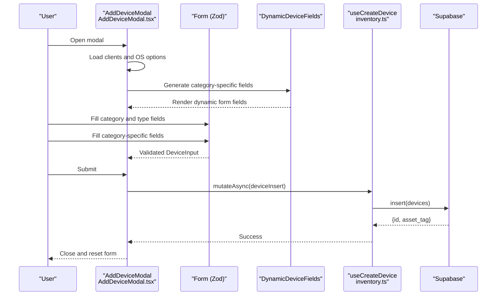

**Diagram sources**
- [AddDeviceModal.tsx:531-675](file://src/components/pcready/AddDeviceModal.tsx#L531-L675)
- [device-taxonomy.ts:21-48](file://src/lib/device-taxonomy.ts#L21-L48)
- [devices.ts:4-12](file://src/lib/schemas/devices.ts#L4-L12)
- [inventory.ts:102-108](file://src/lib/queries/inventory.ts#L102-L108)

**Section sources**
- [AddDeviceModal.tsx:531-675](file://src/components/pcready/AddDeviceModal.tsx#L531-L675)
- [device-taxonomy.ts:21-48](file://src/lib/device-taxonomy.ts#L21-L48)
- [devices.ts:4-12](file://src/lib/schemas/devices.ts#L4-L12)
- [inventory.ts:102-108](file://src/lib/queries/inventory.ts#L102-L108)

### Enhanced Device Creation: createDevice and createDevicesBulk
- Single device: insert payload into devices, return created row
- Bulk devices: insert array of payloads, return count and ids
- Both mutations invalidate the inventory query cache to reflect changes

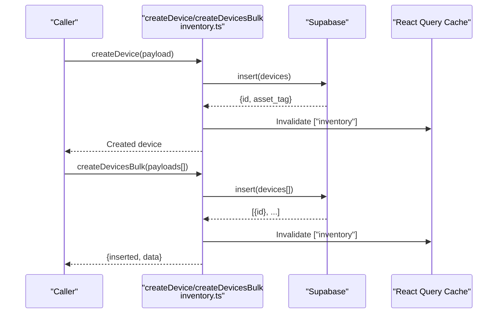

**Diagram sources**
- [inventory.ts:82-100](file://src/lib/queries/inventory.ts#L82-L100)
- [inventory.ts:110-116](file://src/lib/queries/inventory.ts#L110-L116)

**Section sources**
- [inventory.ts:82-100](file://src/lib/queries/inventory.ts#L82-L100)
- [inventory.ts:110-116](file://src/lib/queries/inventory.ts#L110-L116)

### Enhanced fetchDevicesList: Parameter Handling, Query Building, and Result Processing
- Parameters: status, os, category, deviceType, q, page, pageSize, withoutTicket, updatedBefore, updatedAfter, client_id, warrantyStatus, maintenanceDueSoon
- Query construction: base select with ordering, optional filters, range-based pagination
- Category filtering: supports device category and specific device type filtering
- Assignment flag: attach has_active_assignment using preloaded active assignment IDs
- Maintenance due: attach has_maintenance_due_soon and next_maintenance_due_date
- Result: typed rows plus total count

**Section sources**
- [inventory.ts:6-22](file://src/lib/queries/inventory.ts#L6-L22)
- [inventory.ts:58-154](file://src/lib/queries/inventory.ts#L58-L154)

### Enhanced useInventoryList: Reactive Data Fetching and Caching
- Query key includes status, os, category, deviceType, q, page, pageSize, and withoutTicket flag
- Placeholder data preserves previous data while fetching
- Integrates with React Query defaults (retry, staleTime, refetchOnWindowFocus)
- Supports category-based filtering and device type combinations

**Section sources**
- [inventory.ts:156-188](file://src/lib/queries/inventory.ts#L156-L188)
- [queryClient.ts:4-13](file://src/lib/queries/queryClient.ts#L4-L13)

### Enhanced Device Status Management and Lifecycle Tracking
- Status values: available, assigned, maintenance, retired
- UI badge allows changing status with safeguards (e.g., prevents changing status of assigned devices with active tickets)
- Server-side update function validates access token, checks existence, and triggers notifications for specific transitions
- Route-level status change persists via Supabase update and invalidates cache

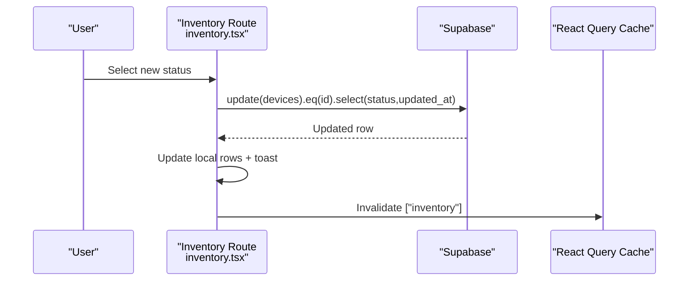

**Diagram sources**
- [inventory.tsx:242-275](file://src/routes/_app/inventory.tsx#L242-L275)

**Section sources**
- [device-status.ts:15-55](file://src/lib/device-status.ts#L15-L55)
- [inventory.tsx:242-275](file://src/routes/_app/inventory.tsx#L242-L275)

### Enhanced Bulk Import Workflow (CSV)
- Steps: upload CSV -> parse -> load context (clients/devices) -> validate -> preview -> confirm -> import
- Validation rules: serial/model/client required, valid status, unique serial in file, client lookup
- Import engine: inserts new devices, updates existing ones, tracks progress and errors


**Diagram sources**
- [ImportCsvDialog.tsx:52-95](file://src/components/inventory/ImportCsvDialog.tsx#L52-L95)
- [inventory-import.ts:128-180](file://src/lib/inventory-import.ts#L128-L180)

**Section sources**
- [ImportCsvDialog.tsx:52-95](file://src/components/inventory/ImportCsvDialog.tsx#L52-L95)
- [inventory-import.ts:49-126](file://src/lib/inventory-import.ts#L49-L126)
- [inventory-import.ts:128-180](file://src/lib/inventory-import.ts#L128-L180)

## Enhanced Barcode Scanning System

### BarcodeScanner Component Architecture
The BarcodeScanner component provides dual-mode barcode scanning functionality:
- QR inventory mode: scans QR codes containing device identifiers or URLs
- 1D barcode mode: dedicated scanning for linear barcodes (Code 128, Code 39, Code 93, Codabar, ITF, EAN-13, EAN-8, UPC-A, UPC-E)
- Hardware keyboard-wedge compatibility: supports USB/Bluetooth scanners in keyboard-wedge mode
- Camera fallback: handles camera permission issues gracefully

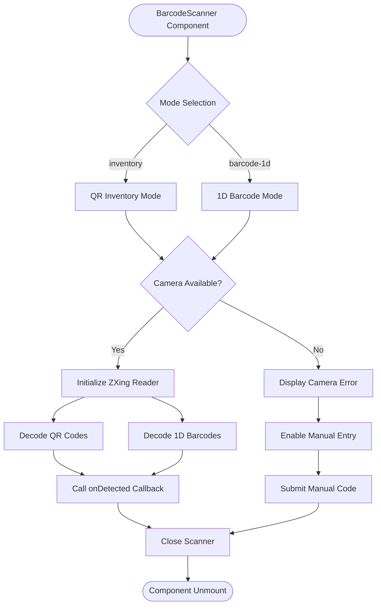

**Diagram sources**
- [BarcodeScanner.tsx:25-93](file://src/components/inventory/BarcodeScanner.tsx#L25-L93)
- [BarcodeScanner.tsx:171-185](file://src/components/inventory/BarcodeScanner.tsx#L171-L185)

**Section sources**
- [BarcodeScanner.tsx:1-186](file://src/components/inventory/BarcodeScanner.tsx#L1-L186)
- [barcode-inventory.md:1-36](file://docs/barcode-inventory.md#L1-L36)

### Barcode Integration in Inventory Flow
The barcode scanning system integrates seamlessly with the inventory workflow:
- QR code scanning for device lookup and detail viewing
- 1D barcode scanning for quick asset tag and serial entry
- Automatic device creation when scanned device is not found
- Hardware scanner compatibility with keyboard-wedge mode

**Section sources**
- [inventory.tsx:316-345](file://src/routes/_app/inventory.tsx#L316-L345)
- [BarcodeScanner.tsx:25-93](file://src/components/inventory/BarcodeScanner.tsx#L25-L93)

## Dynamic Device Field Generation

### Device Taxonomy and Categories
The system implements a comprehensive device taxonomy with category-based field generation:
- Categories: endpoint, printing, network, server_infra, mobile, peripheral
- Category-specific fields: specialized input fields for different device types
- Type-based filtering: device types vary by category (e.g., Desktop, Laptop for endpoint)

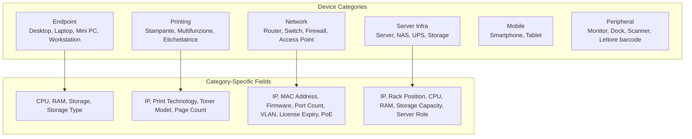

**Diagram sources**
- [device-taxonomy.ts:1-57](file://src/lib/device-taxonomy.ts#L1-L57)
- [AddDeviceModal.tsx:531-675](file://src/components/pcready/AddDeviceModal.tsx#L531-L675)

**Section sources**
- [device-taxonomy.ts:1-57](file://src/lib/device-taxonomy.ts#L1-L57)
- [AddDeviceModal.tsx:531-675](file://src/components/pcready/AddDeviceModal.tsx#L531-L675)

### DynamicDeviceFields Component
The DynamicDeviceFields component generates category-specific form fields:
- Printing category: IP address, print technology, toner model, page counter
- Network category: IP management, MAC address, firmware version, port count, VLAN, license expiry, PoE support
- Server_infra category: IP, rack position, CPU specifications, RAM, storage capacity, server role
- Default endpoint category: core hardware specifications (CPU, RAM, storage, storage type)

**Section sources**
- [AddDeviceModal.tsx:531-675](file://src/components/pcready/AddDeviceModal.tsx#L531-L675)

## Advanced Import/Export Functionality

### Enhanced Import System
The import system provides comprehensive CSV import capabilities:
- Multi-device import with validation and error handling
- Support for device creation and updates
- Client and device lookup integration
- Progress tracking and error reporting

**Section sources**
- [ImportCsvDialog.tsx:52-95](file://src/components/inventory/ImportCsvDialog.tsx#L52-L95)
- [inventory-import.ts:49-126](file://src/lib/inventory-import.ts#L49-L126)

### Full Data Export System
The system now supports comprehensive data export:
- Admin-only export functionality via useAdminAppSettings hook
- ExportAllData server function exports tickets, devices, and clients
- ZIP archive generation with multiple CSV files
- Rate limiting and authentication enforcement

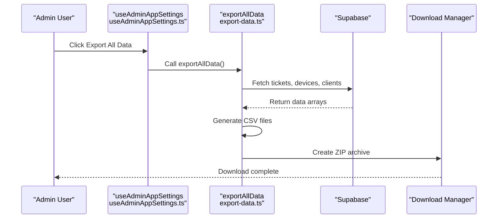

**Diagram sources**
- [useAdminAppSettings.ts:177-208](file://src/hooks/useAdminAppSettings.ts#L177-L208)
- [export-data.ts:11-52](file://src/lib/export-data.ts#L11-L52)

**Section sources**
- [useAdminAppSettings.ts:177-208](file://src/hooks/useAdminAppSettings.ts#L177-L208)
- [export-data.ts:11-52](file://src/lib/export-data.ts#L11-L52)

## Enhanced DeviceDetailModal Features

### Barcode Field Editing
The DeviceDetailModal now includes comprehensive barcode field editing capabilities:
- Editable asset_tag and serial fields with barcode scanning integration
- Hardware focus buttons for quick scanner hardware integration
- Camera scanning buttons for 1D barcode reading
- Real-time validation and saving mechanisms

```mermaid
sequenceDiagram
participant U as "User"
participant DM as "DeviceDetailModal"
participant BS as "BarcodeScanner"
participant S as "Supabase"
U->>DM : Click edit barcode field
DM->>DM : Enter edit mode with draft
U->>DM : Click USB button for hardware scanner
DM->>BS : Open BarcodeScanner (1D mode)
BS-->>DM : Return scanned value
U->>DM : Click Barcode button for camera
DM->>BS : Open BarcodeScanner (QR mode)
BS-->>DM : Return scanned value
U->>DM : Modify barcode field content
U->>DM : Click save
DM->>S : Update devices.asset_tag/serial
S-->>DM : Success response
DM->>DM : Update local state and exit edit mode
```

**Diagram sources**
- [DeviceDetailModal.tsx:1618-1675](file://src/components/pcready/DeviceDetailModal.tsx#L1618-L1675)
- [BarcodeScanner.tsx:25-93](file://src/components/inventory/BarcodeScanner.tsx#L25-L93)

**Section sources**
- [DeviceDetailModal.tsx:1618-1675](file://src/components/pcready/DeviceDetailModal.tsx#L1618-L1675)
- [BarcodeScanner.tsx:25-93](file://src/components/inventory/BarcodeScanner.tsx#L25-L93)

### Hardware Configuration Tabs
Enhanced hardware configuration capabilities:
- CPU specifications: frequency, cores, manufacturer
- Memory configuration: RAM type, frequency, drive count
- Storage details: type, capacity, drive configuration
- Operating system and licensing information
- System health monitoring and status indicators

**Section sources**
- [DeviceDetailModal.tsx:1711-1817](file://src/components/pcready/DeviceDetailModal.tsx#L1711-L1817)

### Comprehensive Device Information
The enhanced modal provides:
- Complete device metadata (ID, asset_tag, serial, model, OS, status)
- Client and assigned user information
- Creation and update timestamps with actor attribution
- Last event tracking with operator identification
- Integrated ticket creation workflow
- Category-specific metadata display

**Section sources**
- [DeviceDetailModal.tsx:419-466](file://src/components/pcready/DeviceDetailModal.tsx#L419-L466)
- [DeviceDetailModal.tsx:468-482](file://src/components/pcready/DeviceDetailModal.tsx#L468-L482)

### Activity Timeline Integration
DeviceDetailModal consolidates multiple data sources:
- Device registration events
- Status change snapshots
- Ticket-device assignment history
- Activity log entries with device_id tracking
- Maintenance and note events

**Section sources**
- [DeviceDetailModal.tsx:155-305](file://src/components/pcready/DeviceDetailModal.tsx#L155-L305)
- [DeviceDetailModal.tsx:322-332](file://src/components/pcready/DeviceDetailModal.tsx#L322-L332)

## Bulk Operations Implementation

### Bulk Status Changes
The inventory route now supports mass status updates:
- Multi-device selection via checkboxes
- Bulk status change dialog with validation
- Sequential update operations with success/failure tracking
- Real-time feedback and cache invalidation


**Diagram sources**
- [inventory.tsx:296-319](file://src/routes/_app/inventory.tsx#L296-L319)

**Section sources**
- [inventory.tsx:296-319](file://src/routes/_app/inventory.tsx#L296-L319)
- [inventory.tsx:477-484](file://src/routes/_app/inventory.tsx#L477-L484)
- [inventory.tsx:680-710](file://src/routes/_app/inventory.tsx#L680-L710)

### Bulk Client Assignments
Parallel bulk assignment functionality:
- Client name input validation
- Mass assignment to multiple devices
- Error handling and partial success reporting
- Seamless integration with existing bulk operations

**Section sources**
- [inventory.tsx:321-345](file://src/routes/_app/inventory.tsx#L321-L345)
- [inventory.tsx:494-500](file://src/routes/_app/inventory.tsx#L494-L500)
- [inventory.tsx:712-740](file://src/routes/_app/inventory.tsx#L712-L740)

### Bulk Selection Controls
Enhanced selection interface:
- Individual device selection
- Page-wide selection capability
- Bulk operation toolbar with export functionality
- Real-time selection count display

**Section sources**
- [inventory.tsx:460-509](file://src/routes/_app/inventory.tsx#L460-L509)
- [inventory.tsx:525-574](file://src/routes/_app/inventory.tsx#L525-L574)

## Device Activity Logging System

### Database Schema Enhancement
The migration introduces comprehensive device activity tracking:
- device_id column in activity_log table
- Foreign key relationship to devices table
- Optimized indexes for efficient device-specific queries
- Row-level security policies for access control

```sql
-- Add device_id column to activity_log
ALTER TABLE IF EXISTS public.activity_log
  ADD COLUMN IF NOT EXISTS device_id uuid REFERENCES public.devices(id) ON DELETE SET NULL;

-- Index for efficient device activity queries
CREATE INDEX IF NOT EXISTS activity_log_device_id_idx ON public.activity_log(device_id);
CREATE INDEX IF NOT EXISTS activity_log_device_id_created_at_idx ON public.activity_log(device_id, created_at DESC);

-- RLS policies for device activity access
CREATE POLICY "authenticated users can view device activity"
  ON public.activity_log FOR SELECT
  TO authenticated
  USING (true);

CREATE POLICY "authenticated users can insert device activity"
  ON public.activity_log FOR INSERT
  TO authenticated
  WITH CHECK (true);
```

**Section sources**
- [device_activity_log.sql:1-27](file://supabase/migrations/20260515100000_device_activity_log.sql#L1-L27)

### Frontend Integration
DeviceDetailModal leverages the enhanced activity logging:
- Device-level activity retrieval alongside ticket-related logs
- Unified timeline combining device and ticket activities
- Deduplicated timeline entries for clean presentation
- Operator attribution with profile name resolution

**Section sources**
- [DeviceDetailModal.tsx:247-268](file://src/components/pcready/DeviceDetailModal.tsx#L247-L268)
- [DeviceDetailModal.tsx:833-843](file://src/components/pcready/DeviceDetailModal.tsx#L833-L843)

## PDF Export Functionality

### Export Implementation
The inventory system now supports selective PDF export:
- Selected device filtering for export scope
- Professional PDF generation with branding
- Comprehensive statistics and device details
- Download and preview functionality

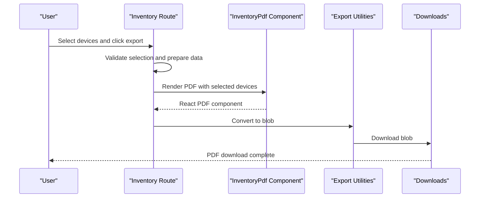

**Diagram sources**
- [inventory.tsx:346-365](file://src/routes/_app/inventory.tsx#L346-L365)
- [InventoryPdf.tsx:26-85](file://src/components/pcready/pdf/InventoryPdf.tsx#L26-L85)
- [export.tsx:5-17](file://src/components/pcready/pdf/export.tsx#L5-L17)

**Section sources**
- [inventory.tsx:346-365](file://src/routes/_app/inventory.tsx#L346-L365)
- [InventoryPdf.tsx:26-85](file://src/components/pcready/pdf/InventoryPdf.tsx#L26-L85)
- [export.tsx:5-17](file://src/components/pcready/pdf/export.tsx#L5-L17)

### PDF Generation Features
Professional PDF output includes:
- Organization branding and metadata
- Device statistics and summary charts
- Detailed device tables with status badges
- Color-coded status indicators
- Proper formatting and layout optimization

**Section sources**
- [InventoryPdf.tsx:19-24](file://src/components/pcready/pdf/InventoryPdf.tsx#L19-L24)
- [InventoryPdf.tsx:43-62](file://src/components/pcready/pdf/InventoryPdf.tsx#L43-L62)
- [InventoryPdf.tsx:71-81](file://src/components/pcready/pdf/InventoryPdf.tsx#L71-L81)

## Dependency Analysis
- UI depends on:
  - Inventory queries for listing and mutations with category filtering
  - Zod schema for validation
  - Device taxonomy for dynamic field generation
  - App settings for dynamic OS options
  - Global state for opening AddDeviceModal
  - PDF generation utilities for export functionality
  - Barcode scanner component for scanning integration
  - Export utilities for full data export
- Queries depend on:
  - Supabase client for CRUD with enhanced category filtering
  - React Query for caching and invalidation
  - Enhanced activity logging for comprehensive device tracking
- Status management:
  - Server function validates access and triggers notifications
  - Route-level mutation updates UI and cache
- Bulk operations:
  - Direct Supabase mutations for improved performance
  - Sequential processing with error handling
  - Cache invalidation for immediate UI updates

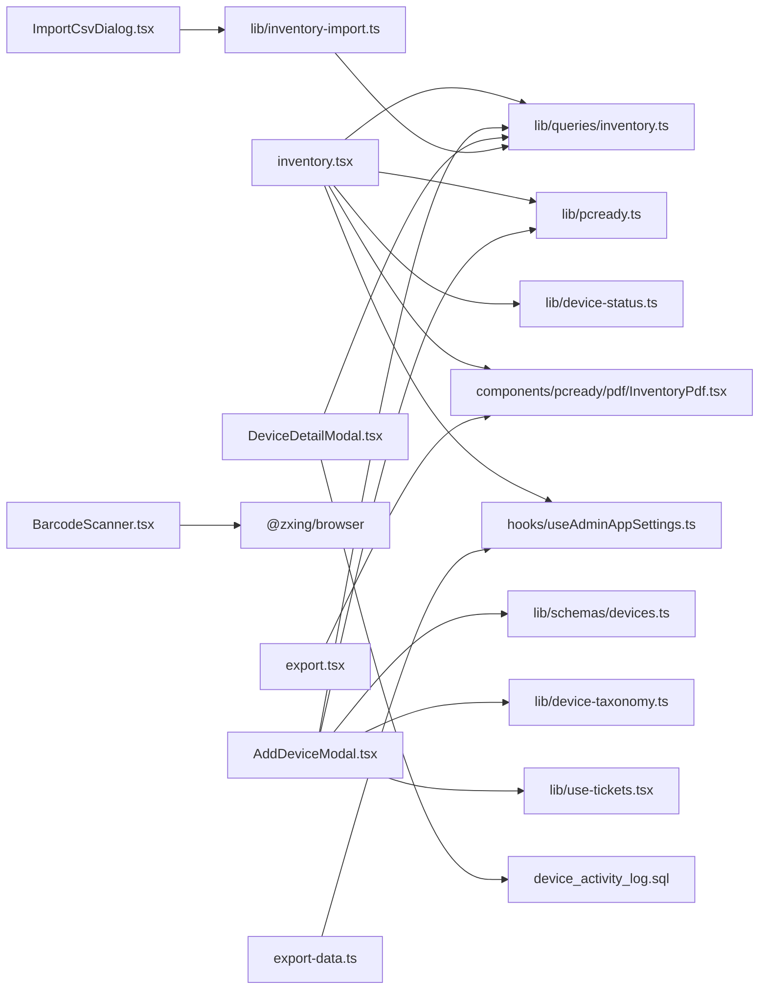

**Diagram sources**
- [inventory.tsx:86-94](file://src/routes/_app/inventory.tsx#L86-L94)
- [AddDeviceModal.tsx:76-118](file://src/components/pcready/AddDeviceModal.tsx#L76-L118)
- [DeviceDetailModal.tsx:120-137](file://src/components/pcready/DeviceDetailModal.tsx#L120-L137)
- [BarcodeScanner.tsx:1-186](file://src/components/inventory/BarcodeScanner.tsx#L1-L186)
- [inventory.ts:22-100](file://src/lib/queries/inventory.ts#L22-L100)
- [devices.ts:4-12](file://src/lib/schemas/devices.ts#L4-L12)
- [device-taxonomy.ts:1-57](file://src/lib/device-taxonomy.ts#L1-L57)
- [pcready.ts:66-66](file://src/lib/pcready.ts#L66-L66)
- [use-tickets.tsx:33-35](file://src/lib/use-tickets.tsx#L33-L35)
- [ImportCsvDialog.tsx:5-13](file://src/components/inventory/ImportCsvDialog.tsx#L5-L13)
- [inventory-import.ts:1-271](file://src/lib/inventory-import.ts#L1-L271)
- [InventoryPdf.tsx:1-93](file://src/components/pcready/pdf/InventoryPdf.tsx#L1-L93)
- [export.tsx:1-18](file://src/components/pcready/pdf/export.tsx#L1-L18)
- [export-data.ts:1-62](file://src/lib/export-data.ts#L1-L62)
- [useAdminAppSettings.ts:177-208](file://src/hooks/useAdminAppSettings.ts#L177-L208)
- [device_activity_log.sql:1-27](file://supabase/migrations/20260515100000_device_activity_log.sql#L1-L27)

**Section sources**
- [inventory.tsx:86-94](file://src/routes/_app/inventory.tsx#L86-L94)
- [AddDeviceModal.tsx:76-118](file://src/components/pcready/AddDeviceModal.tsx#L76-L118)
- [DeviceDetailModal.tsx:120-137](file://src/components/pcready/DeviceDetailModal.tsx#L120-L137)
- [BarcodeScanner.tsx:1-186](file://src/components/inventory/BarcodeScanner.tsx#L1-L186)
- [inventory.ts:22-100](file://src/lib/queries/inventory.ts#L22-L100)
- [devices.ts:4-12](file://src/lib/schemas/devices.ts#L4-L12)
- [device-taxonomy.ts:1-57](file://src/lib/device-taxonomy.ts#L1-L57)
- [pcready.ts:66-66](file://src/lib/pcready.ts#L66-L66)
- [use-tickets.tsx:33-35](file://src/lib/use-tickets.tsx#L33-L35)
- [ImportCsvDialog.tsx:5-13](file://src/components/inventory/ImportCsvDialog.tsx#L5-L13)
- [inventory-import.ts:1-271](file://src/lib/inventory-import.ts#L1-L271)
- [InventoryPdf.tsx:1-93](file://src/components/pcready/pdf/InventoryPdf.tsx#L1-L93)
- [export.tsx:1-18](file://src/components/pcready/pdf/export.tsx#L1-L18)
- [export-data.ts:1-62](file://src/lib/export-data.ts#L1-L62)
- [useAdminAppSettings.ts:177-208](file://src/hooks/useAdminAppSettings.ts#L177-L208)
- [device_activity_log.sql:1-27](file://supabase/migrations/20260515100000_device_activity_log.sql#L1-L27)

## Performance Considerations
- Pagination: fixed page size with exact count; compute page count from total
- Query caching: React Query default staleTime reduces redundant requests
- Assignment flag precomputation: avoids N+1 queries by loading active assignment IDs once per list
- Category filtering: optimized queries with category and device_type filtering
- Bulk operations: sequential processing with error isolation prevents cascading failures
- Activity logging: optimized indexes on device_id enable fast device-specific queries
- PDF generation: client-side rendering minimizes server load for export operations
- Barcode scanning: lazy loading of ZXing library reduces initial bundle size
- Dynamic fields: conditional rendering based on category reduces DOM complexity
- Full data export: server-side processing with rate limiting prevents abuse
- DeviceDetailModal: memoized computations and efficient timeline building prevent re-renders

Recommendations:
- Keep PAGE_SIZE tuned to UI readability and network latency
- Use placeholderData to avoid flicker during refetch
- Prefer server-side filtering (status, OS, ILIKE, category, device_type) to limit payload sizes
- For very large inventories, consider indexed columns and optimized ILIKE patterns
- Implement proper error boundaries for bulk operations to contain failures
- Use debounced search to reduce query frequency during typing
- Lazy load barcode scanning library to improve initial load performance
- Cache device taxonomy data to avoid repeated calculations

**Section sources**
- [inventory.tsx:61-125](file://src/routes/_app/inventory.tsx#L61-L125)
- [inventory.ts:58-154](file://src/lib/queries/inventory.ts#L58-L154)
- [queryClient.ts:4-13](file://src/lib/queries/queryClient.ts#L4-L13)
- [BarcodeScanner.tsx:58-76](file://src/components/inventory/BarcodeScanner.tsx#L58-L76)
- [device-taxonomy.ts:46-48](file://src/lib/device-taxonomy.ts#L46-L48)
- [inventory-import.ts:198-226](file://src/lib/inventory-import.ts#L198-L226)
- [device_activity_log.sql:8-10](file://supabase/migrations/20260515100000_device_activity_log.sql#L8-L10)

## Troubleshooting Guide
Common issues and resolutions:
- Validation errors in AddDeviceModal: ensure required fields are filled and formatted correctly, check category-specific field requirements
- No clients available: verify client options loading and that at least one client exists
- Status change blocked: cannot modify status of assigned devices with active tickets
- CSV import failures: check for duplicate serials, missing clients, or invalid statuses
- Camera scanner unavailable: ensure HTTPS/localhost and browser support; fall back to manual input
- 1D barcode scanning issues: verify supported formats (Code 128, Code 39, Code 93, Codabar, ITF, EAN-13, EAN-8, UPC-A, UPC-E)
- QR code scanning problems: ensure proper lighting and distance from QR code
- Barcode hardware compatibility: verify keyboard-wedge mode support and proper USB/Bluetooth connection
- Bulk operation failures: individual device errors don't block successful updates; check console for specific failures
- PDF export errors: verify device selection and network connectivity for download operations
- Activity log discrepancies: ensure device_id foreign key constraints are properly maintained
- Dynamic field rendering: verify device category selection and type compatibility
- Full data export failures: check admin permissions and rate limiting restrictions

**Section sources**
- [AddDeviceModal.tsx:17-19](file://src/components/pcready/AddDeviceModal.tsx#L17-L19)
- [AddDeviceModal.tsx:82-84](file://src/components/pcready/AddDeviceModal.tsx#L82-L84)
- [BarcodeScanner.tsx:171-185](file://src/components/inventory/BarcodeScanner.tsx#L171-L185)
- [barcode-inventory.md:16-31](file://docs/barcode-inventory.md#L16-L31)
- [inventory.tsx:242-275](file://src/routes/_app/inventory.tsx#L242-L275)
- [ImportCsvDialog.tsx:76-95](file://src/components/inventory/ImportCsvDialog.tsx#L76-L95)
- [export-data.ts:19-20](file://src/lib/export-data.ts#L19-L20)

## Conclusion
The enhanced inventory system combines robust UI components, reactive data fetching, and efficient data access patterns with new capabilities for comprehensive device management. The addition of dynamic field generation based on device categories, advanced barcode scanning capabilities, and comprehensive import/export functionality significantly improves operational efficiency and auditability. The system maintains clear separation of concerns between UI, queries, and server functions while supporting scalable bulk import and export operations. The dual-mode barcode scanning system provides flexibility for both QR inventory codes and 1D barcodes, while the category-based field generation ensures appropriate data capture for different device types.

## Appendices

### Example Workflows

- Enhanced inventory query with category filtering, pagination, and bulk selection
  - Parameters: status=assigned, os=Windows 11 Pro, category=endpoint, deviceType=Laptop, q=ABC123, page=0, pageSize=50, withoutTicket=false, warrantyStatus=valid, maintenanceDueSoon=true
  - Behavior: apply status, OS, category, and device type filters, search term OR match, warranty and maintenance filters, paginate, compute assignment and maintenance due flags

- Enhanced device creation workflow with dynamic fields
  - Modal captures category (printing), type (Stampante), brand, model, asset_tag, serial, client, end_user, os, notes
  - Category-specific fields (IP, print_technology, toner_model, page_count) rendered dynamically
  - Zod validation passes, mutation inserts into devices, cache invalidated, activity logged

- Barcode scanning workflow for device lookup
  - User clicks QR scanner button, BarcodeScanner opens in inventory mode
  - Camera initializes, QR code detected, device found via fetchDeviceBySerial
  - DeviceDetailModal opens with comprehensive device information and activity timeline

- 1D barcode scanning workflow for asset tag entry
  - User clicks barcode button on asset_tag field, BarcodeScanner opens in 1D mode
  - Supported formats: Code 128, Code 39, Code 93, Codabar, ITF, EAN-13, EAN-8, UPC-A, UPC-E
  - Hardware scanner or camera input captured, value applied to asset_tag field
  - Form validation triggered, user can continue with device creation

- Full data export workflow
  - Admin user clicks "Export All Data" in settings
  - exportAllData server function called with authentication
  - Tickets, devices, and clients data fetched concurrently
  - CSV files generated and packaged into ZIP archive
  - Download initiated with timestamped filenames

- Device activity logging
  - Device status change triggers activity log entry with device_id
  - DeviceDetailModal retrieves both ticket and device-level activities
  - Unified timeline displays chronological events with operator attribution
  - Hardware configuration changes tracked in activity log

**Section sources**
- [inventory.tsx:87-94](file://src/routes/_app/inventory.tsx#L87-L94)
- [AddDeviceModal.tsx:531-675](file://src/components/pcready/AddDeviceModal.tsx#L531-L675)
- [BarcodeScanner.tsx:25-93](file://src/components/inventory/BarcodeScanner.tsx#L25-L93)
- [export-data.ts:11-52](file://src/lib/export-data.ts#L11-L52)
- [DeviceDetailModal.tsx:247-268](file://src/components/pcready/DeviceDetailModal.tsx#L247-L268)
- [device_activity_log.sql:4-10](file://supabase/migrations/20260515100000_device_activity_log.sql#L4-L10)