# Device Inventory Tracking

<cite>
**Referenced Files in This Document**
- [AddDeviceModal.tsx](file://src/components/pcready/AddDeviceModal.tsx)
- [DeviceDetailModal.tsx](file://src/components/pcready/DeviceDetailModal.tsx)
- [inventory.tsx](file://src/routes/_app/inventory.tsx)
- [inventory.ts](file://src/lib/queries/inventory.ts)
- [devices.ts](file://src/lib/schemas/devices.ts)
- [device-status.ts](file://src/lib/device-status.ts)
- [inventory-import.ts](file://src/lib/inventory-import.ts)
- [ImportCsvDialog.tsx](file://src/components/inventory/ImportCsvDialog.tsx)
- [BarcodeScanner.tsx](file://src/components/inventory/BarcodeScanner.tsx)
- [use-tickets.tsx](file://src/lib/use-tickets.tsx)
- [pcready.ts](file://src/lib/pcready.ts)
- [queryClient.ts](file://src/lib/queries/queryClient.ts)
- [InventoryPdf.tsx](file://src/components/pcready/pdf/InventoryPdf.tsx)
- [export.tsx](file://src/components/pcready/pdf/export.tsx)
- [device_activity_log.sql](file://supabase/migrations/20260515100000_device_activity_log.sql)
</cite>

## Update Summary
**Changes Made**
- Enhanced DeviceDetailModal with technical notes editing functionality
- Added bulk operations support for bulk status changes and bulk client assignments
- Implemented device activity logging with device_id tracking for comprehensive audit trails
- Integrated PDF export functionality for selected inventory items
- Updated inventory listing with bulk selection capabilities and export features

## Table of Contents
1. [Introduction](#introduction)
2. [Project Structure](#project-structure)
3. [Core Components](#core-components)
4. [Architecture Overview](#architecture-overview)
5. [Detailed Component Analysis](#detailed-component-analysis)
6. [Enhanced DeviceDetailModal Features](#enhanced-devicedetailmodal-features)
7. [Bulk Operations Implementation](#bulk-operations-implementation)
8. [Device Activity Logging System](#device-activity-logging-system)
9. [PDF Export Functionality](#pdf-export-functionality)
10. [Dependency Analysis](#dependency-analysis)
11. [Performance Considerations](#performance-considerations)
12. [Troubleshooting Guide](#troubleshooting-guide)
13. [Conclusion](#conclusion)
14. [Appendices](#appendices)

## Introduction
This document explains the device inventory tracking system, focusing on:
- Inventory listing with filtering by status, operating system, search terms, pagination, and assignment status
- The AddDeviceModal component for capturing device details and creating devices
- Enhanced DeviceDetailModal with technical notes editing capabilities
- Bulk operations for mass status changes and client assignments
- Device activity logging with device_id tracking for comprehensive audit trails
- PDF export functionality for inventory reporting
- Device creation via createDevice and createDevicesBulk
- fetchDevicesList implementation with parameter handling, query building, and result processing
- The useInventoryList hook for reactive data fetching and caching
- Device status management and lifecycle tracking
- Practical examples for inventory queries, device creation workflows, and bulk import
- Performance considerations and pagination strategies for large inventories

## Project Structure
The inventory feature spans UI components, route handlers, data access utilities, and shared libraries:
- Route handler renders the inventory page, manages filters, pagination, status updates, and bulk operations
- Queries module encapsulates Supabase data access and caching
- UI components capture device inputs, scan barcodes, import CSV, and provide detailed device views
- Shared libraries define device status, OS options, schemas, and PDF generation utilities
- Database layer supports device activity logging with device_id foreign key relationships

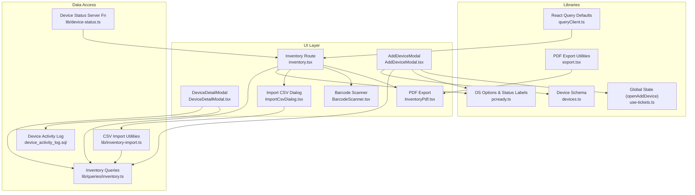

**Diagram sources**
- [inventory.tsx:24-37](file://src/routes/_app/inventory.tsx#L24-L37)
- [AddDeviceModal.tsx:27-76](file://src/components/pcready/AddDeviceModal.tsx#L27-L76)
- [DeviceDetailModal.tsx:120-137](file://src/components/pcready/DeviceDetailModal.tsx#L120-L137)
- [inventory.ts:22-70](file://src/lib/queries/inventory.ts#L22-L70)
- [devices.ts:4-12](file://src/lib/schemas/devices.ts#L4-L12)
- [pcready.ts:66-66](file://src/lib/pcready.ts#L66-L66)
- [use-tickets.tsx:19-36](file://src/lib/use-tickets.tsx#L19-L36)
- [queryClient.ts:4-13](file://src/lib/queries/queryClient.ts#L4-L13)
- [device-status.ts:15-55](file://src/lib/device-status.ts#L15-L55)
- [inventory-import.ts:1-271](file://src/lib/inventory-import.ts#L1-L271)
- [InventoryPdf.tsx:1-93](file://src/components/pcready/pdf/InventoryPdf.tsx#L1-L93)
- [export.tsx:1-18](file://src/components/pcready/pdf/export.tsx#L1-L18)
- [device_activity_log.sql:1-27](file://supabase/migrations/20260515100000_device_activity_log.sql#L1-L27)

**Section sources**
- [inventory.tsx:24-37](file://src/routes/_app/inventory.tsx#L24-L37)
- [inventory.ts:22-70](file://src/lib/queries/inventory.ts#L22-L70)
- [AddDeviceModal.tsx:27-76](file://src/components/pcready/AddDeviceModal.tsx#L27-L76)
- [DeviceDetailModal.tsx:120-137](file://src/components/pcready/DeviceDetailModal.tsx#L120-L137)
- [devices.ts:4-12](file://src/lib/schemas/devices.ts#L4-L12)
- [pcready.ts:66-66](file://src/lib/pcready.ts#L66-L66)
- [use-tickets.tsx:19-36](file://src/lib/use-tickets.tsx#L19-L36)
- [queryClient.ts:4-13](file://src/lib/queries/queryClient.ts#L4-L13)
- [device-status.ts:15-55](file://src/lib/device-status.ts#L15-L55)
- [inventory-import.ts:1-271](file://src/lib/inventory-import.ts#L1-L271)
- [InventoryPdf.tsx:1-93](file://src/components/pcready/pdf/InventoryPdf.tsx#L1-L93)
- [export.tsx:1-18](file://src/components/pcready/pdf/export.tsx#L1-L18)
- [device_activity_log.sql:1-27](file://supabase/migrations/20260515100000_device_activity_log.sql#L1-L27)

## Core Components
- Inventory route page: renders filters, table, pagination, status badges, actions, and bulk operation controls
- Enhanced DeviceDetailModal: provides comprehensive device information, technical notes editing, and activity timeline
- Inventory queries: fetches paginated data, applies filters, computes assignment flags, and exposes mutations
- AddDeviceModal: captures device details, validates via schema, and creates devices
- CSV import: parses, validates, and imports devices in bulk
- Status management: updates device status and notifies admins for specific transitions
- Bulk operations: enables mass status changes and client assignments across multiple devices
- PDF export: generates professional inventory reports with statistics and device details

**Section sources**
- [inventory.tsx:63-120](file://src/routes/_app/inventory.tsx#L63-L120)
- [DeviceDetailModal.tsx:120-137](file://src/components/pcready/DeviceDetailModal.tsx#L120-L137)
- [inventory.ts:22-100](file://src/lib/queries/inventory.ts#L22-L100)
- [AddDeviceModal.tsx:27-118](file://src/components/pcready/AddDeviceModal.tsx#L27-L118)
- [inventory-import.ts:128-180](file://src/lib/inventory-import.ts#L128-L180)
- [device-status.ts:15-55](file://src/lib/device-status.ts#L15-L55)

## Architecture Overview
The system uses React Query for caching and background synchronization, Supabase for data persistence, and Zod for input validation. The inventory route composes filters and pagination into a query key consumed by useInventoryList. Enhanced bulk operations leverage direct Supabase mutations for improved performance. DeviceDetailModal provides comprehensive device insights with technical notes editing and activity logging.

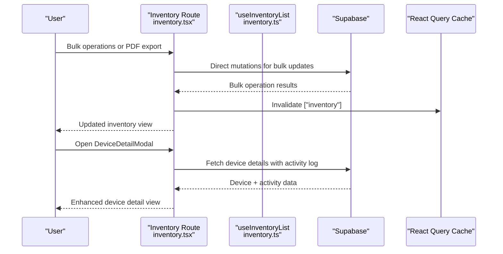

**Diagram sources**
- [inventory.tsx:296-345](file://src/routes/_app/inventory.tsx#L296-L345)
- [DeviceDetailModal.tsx:155-305](file://src/components/pcready/DeviceDetailModal.tsx#L155-L305)
- [inventory.ts:56-70](file://src/lib/queries/inventory.ts#L56-L70)
- [inventory.ts:22-54](file://src/lib/queries/inventory.ts#L22-L54)

**Section sources**
- [inventory.tsx:296-345](file://src/routes/_app/inventory.tsx#L296-L345)
- [DeviceDetailModal.tsx:155-305](file://src/components/pcready/DeviceDetailModal.tsx#L155-L305)
- [inventory.tsx:86-121](file://src/routes/_app/inventory.tsx#L86-L121)
- [inventory.ts:56-70](file://src/lib/queries/inventory.ts#L56-L70)

## Detailed Component Analysis

### Inventory Listing and Filtering
- Filters supported:
  - Status: available, assigned, maintenance, retired
  - Operating system: configurable via OS options
  - Search term: matches serial, model, or assigned user
  - Assignment status: optional filter excluding devices with active assignments
  - Date filters: non-updated devices within specified time periods
- Pagination: fixed page size with computed page count
- Assignment flag: precomputed by checking active ticket-device assignments
- Bulk selection: checkbox-based selection with bulk operation controls

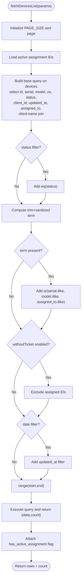

**Diagram sources**
- [inventory.ts:22-54](file://src/lib/queries/inventory.ts#L22-L54)

**Section sources**
- [inventory.tsx:82-94](file://src/routes/_app/inventory.tsx#L82-L94)
- [inventory.ts:22-54](file://src/lib/queries/inventory.ts#L22-L54)

### AddDeviceModal: Capturing Device Details
- Purpose: capture brand, model, serial, client, end user, OS, and notes
- Validation: Zod schema enforces required fields and types
- Client options: loaded asynchronously; default selection applied
- OS options: derived from app settings or defaults
- Creation flow: constructs TablesInsert payload and calls useCreateDevice mutation

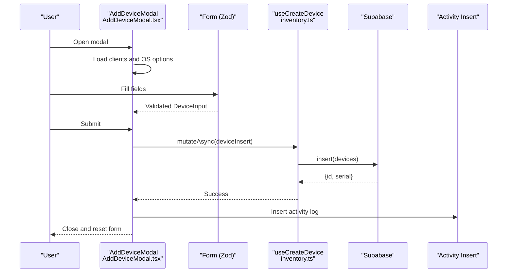

**Diagram sources**
- [AddDeviceModal.tsx:76-118](file://src/components/pcready/AddDeviceModal.tsx#L76-L118)
- [devices.ts:4-12](file://src/lib/schemas/devices.ts#L4-L12)
- [inventory.ts:102-108](file://src/lib/queries/inventory.ts#L102-L108)

**Section sources**
- [AddDeviceModal.tsx:27-118](file://src/components/pcready/AddDeviceModal.tsx#L27-L118)
- [devices.ts:4-12](file://src/lib/schemas/devices.ts#L4-L12)
- [inventory.ts:102-108](file://src/lib/queries/inventory.ts#L102-L108)

### Device Creation: createDevice and createDevicesBulk
- Single device: insert payload into devices, return created row
- Bulk devices: insert array of payloads, return count and ids
- Both mutations invalidate the inventory query cache to reflect changes

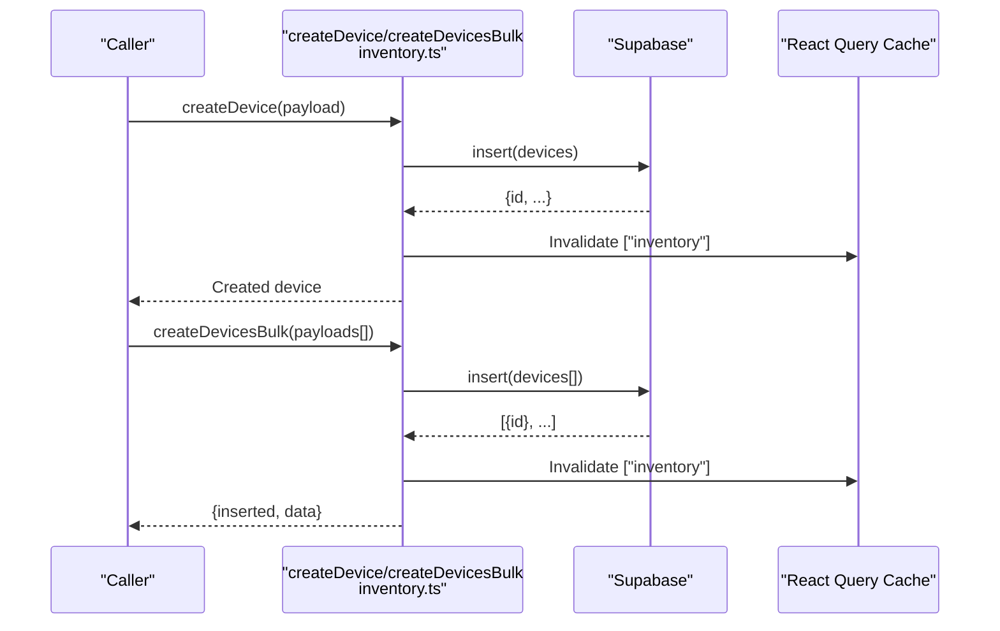

**Diagram sources**
- [inventory.ts:82-100](file://src/lib/queries/inventory.ts#L82-L100)
- [inventory.ts:110-116](file://src/lib/queries/inventory.ts#L110-L116)

**Section sources**
- [inventory.ts:82-100](file://src/lib/queries/inventory.ts#L82-L100)
- [inventory.ts:110-116](file://src/lib/queries/inventory.ts#L110-L116)

### fetchDevicesList: Parameter Handling, Query Building, and Result Processing
- Parameters: status, os, q, page, pageSize, withoutTicket, updatedBeforeDays
- Query construction: base select with ordering, optional filters, range-based pagination
- Assignment flag: attach has_active_assignment using preloaded active assignment IDs
- Result: typed rows plus total count

**Section sources**
- [inventory.ts:4-11](file://src/lib/queries/inventory.ts#L4-L11)
- [inventory.ts:22-54](file://src/lib/queries/inventory.ts#L22-L54)

### useInventoryList: Reactive Data Fetching and Caching
- Query key includes status, os, q, page, pageSize, and withoutTicket flag
- Placeholder data preserves previous data while fetching
- Integrates with React Query defaults (retry, staleTime, refetchOnWindowFocus)

**Section sources**
- [inventory.ts:56-70](file://src/lib/queries/inventory.ts#L56-L70)
- [queryClient.ts:4-13](file://src/lib/queries/queryClient.ts#L4-L13)

### Device Status Management and Lifecycle Tracking
- Status values: available, assigned, maintenance, retired
- UI badge allows changing status with safeguards (e.g., prevents changing status of assigned devices with active tickets)
- Server-side update function validates access token, checks existence, and triggers notifications for specific transitions
- Route-level status change persists via Supabase update and invalidates cache

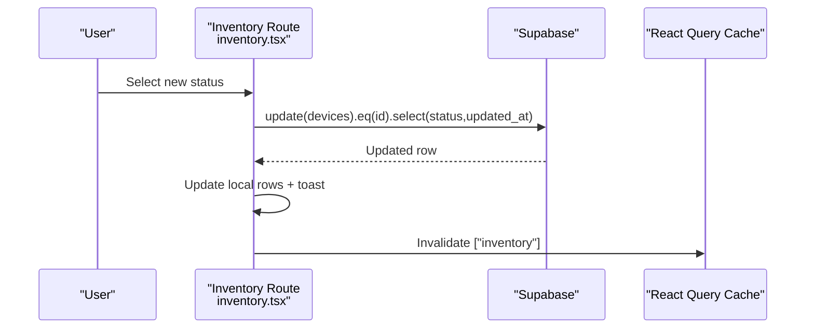

**Diagram sources**
- [inventory.tsx:242-275](file://src/routes/_app/inventory.tsx#L242-L275)

**Section sources**
- [device-status.ts:15-55](file://src/lib/device-status.ts#L15-L55)
- [inventory.tsx:242-275](file://src/routes/_app/inventory.tsx#L242-L275)

### Bulk Import Workflow (CSV)
- Steps: upload CSV -> parse -> load context (clients/devices) -> validate -> preview -> confirm -> import
- Validation rules: serial/model/client required, valid status, unique serial in file, client lookup
- Import engine: inserts new devices, updates existing ones, tracks progress and errors

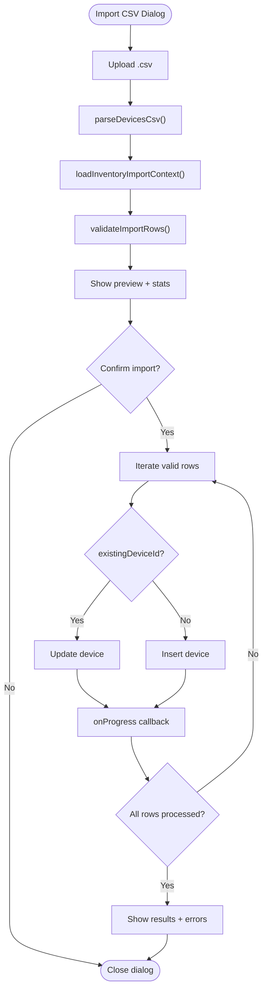

**Diagram sources**
- [ImportCsvDialog.tsx:52-95](file://src/components/inventory/ImportCsvDialog.tsx#L52-L95)
- [inventory-import.ts:128-180](file://src/lib/inventory-import.ts#L128-L180)

**Section sources**
- [ImportCsvDialog.tsx:52-95](file://src/components/inventory/ImportCsvDialog.tsx#L52-L95)
- [inventory-import.ts:49-126](file://src/lib/inventory-import.ts#L49-L126)
- [inventory-import.ts:128-180](file://src/lib/inventory-import.ts#L128-L180)

### Barcode Scanning and Quick Add
- BarcodeScanner component decodes QR/barcode input from camera or manual entry
- On detection, attempts to resolve device by serial; otherwise sets search term and opens AddDeviceModal with prefilled serial

**Section sources**
- [BarcodeScanner.tsx:11-62](file://src/components/inventory/BarcodeScanner.tsx#L11-L62)
- [inventory.tsx:191-220](file://src/routes/_app/inventory.tsx#L191-L220)
- [use-tickets.tsx:33-35](file://src/lib/use-tickets.tsx#L33-L35)

## Enhanced DeviceDetailModal Features

### Technical Notes Editing
The DeviceDetailModal now includes comprehensive technical notes editing capabilities:
- Editable notes field with draft management
- Real-time validation and saving mechanisms
- Rich text editing with save/cancel functionality
- Integration with device update operations

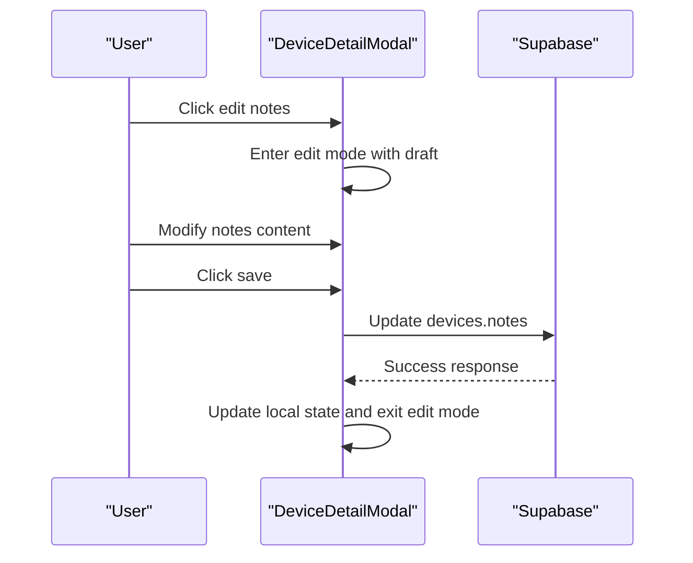

**Diagram sources**
- [DeviceDetailModal.tsx:363-380](file://src/components/pcready/DeviceDetailModal.tsx#L363-L380)

**Section sources**
- [DeviceDetailModal.tsx:484-534](file://src/components/pcready/DeviceDetailModal.tsx#L484-L534)
- [DeviceDetailModal.tsx:363-380](file://src/components/pcready/DeviceDetailModal.tsx#L363-L380)

### Comprehensive Device Information
The enhanced modal provides:
- Complete device metadata (ID, serial, model, OS, status)
- Client and assigned user information
- Creation and update timestamps with actor attribution
- Last event tracking with operator identification
- Integrated ticket creation workflow

**Section sources**
- [DeviceDetailModal.tsx:419-466](file://src/components/pcready/DeviceDetailModal.tsx#L419-L466)
- [DeviceDetailModal.tsx:468-482](file://src/components/pcready/DeviceDetailModal.tsx#L468-L482)

### Activity Timeline Integration
DeviceDetailModal consolidates multiple data sources:
- Device registration events
- Status change snapshots
- Ticket-device assignment history
- Activity log entries with device_id tracking
- Maintenance and note events

**Section sources**
- [DeviceDetailModal.tsx:155-305](file://src/components/pcready/DeviceDetailModal.tsx#L155-L305)
- [DeviceDetailModal.tsx:322-332](file://src/components/pcready/DeviceDetailModal.tsx#L322-L332)

## Bulk Operations Implementation

### Bulk Status Changes
The inventory route now supports mass status updates:
- Multi-device selection via checkboxes
- Bulk status change dialog with validation
- Sequential update operations with success/failure tracking
- Real-time feedback and cache invalidation

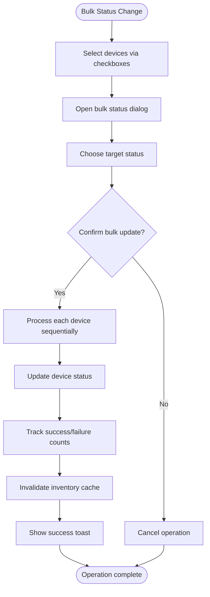

**Diagram sources**
- [inventory.tsx:296-319](file://src/routes/_app/inventory.tsx#L296-L319)

**Section sources**
- [inventory.tsx:296-319](file://src/routes/_app/inventory.tsx#L296-L319)
- [inventory.tsx:477-484](file://src/routes/_app/inventory.tsx#L477-L484)
- [inventory.tsx:680-710](file://src/routes/_app/inventory.tsx#L680-L710)

### Bulk Client Assignments
Parallel bulk assignment functionality:
- Client name input validation
- Mass assignment to multiple devices
- Error handling and partial success reporting
- Seamless integration with existing bulk operations

**Section sources**
- [inventory.tsx:321-345](file://src/routes/_app/inventory.tsx#L321-L345)
- [inventory.tsx:494-500](file://src/routes/_app/inventory.tsx#L494-L500)
- [inventory.tsx:712-740](file://src/routes/_app/inventory.tsx#L712-L740)

### Bulk Selection Controls
Enhanced selection interface:
- Individual device selection
- Page-wide selection capability
- Bulk operation toolbar with export functionality
- Real-time selection count display

**Section sources**
- [inventory.tsx:460-509](file://src/routes/_app/inventory.tsx#L460-L509)
- [inventory.tsx:525-574](file://src/routes/_app/inventory.tsx#L525-L574)

## Device Activity Logging System

### Database Schema Enhancement
The migration introduces comprehensive device activity tracking:
- device_id column in activity_log table
- Foreign key relationship to devices table
- Optimized indexes for device-specific queries
- Row-level security policies for access control

```sql
-- Add device_id column to activity_log
ALTER TABLE IF EXISTS public.activity_log
  ADD COLUMN IF NOT EXISTS device_id uuid REFERENCES public.devices(id) ON DELETE SET NULL;

-- Index for efficient device activity queries
CREATE INDEX IF NOT EXISTS activity_log_device_id_idx ON public.activity_log(device_id);
CREATE INDEX IF NOT EXISTS activity_log_device_id_created_at_idx ON public.activity_log(device_id, created_at DESC);

-- RLS policies for device activity access
CREATE POLICY "authenticated users can view device activity"
  ON public.activity_log FOR SELECT
  TO authenticated
  USING (true);

CREATE POLICY "authenticated users can insert device activity"
  ON public.activity_log FOR INSERT
  TO authenticated
  WITH CHECK (true);
```

**Section sources**
- [device_activity_log.sql:1-27](file://supabase/migrations/20260515100000_device_activity_log.sql#L1-L27)

### Frontend Integration
DeviceDetailModal leverages the enhanced activity logging:
- Device-level activity retrieval alongside ticket-related logs
- Unified timeline combining device and ticket activities
- Deduplicated timeline entries for clean presentation
- Operator attribution with profile name resolution

**Section sources**
- [DeviceDetailModal.tsx:247-268](file://src/components/pcready/DeviceDetailModal.tsx#L247-L268)
- [DeviceDetailModal.tsx:833-843](file://src/components/pcready/DeviceDetailModal.tsx#L833-L843)

## PDF Export Functionality

### Export Implementation
The inventory system now supports selective PDF export:
- Selected device filtering for export scope
- Professional PDF generation with branding
- Comprehensive statistics and device details
- Download and preview functionality

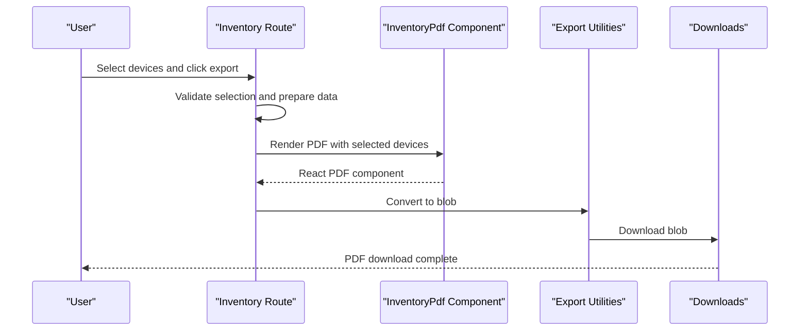

**Diagram sources**
- [inventory.tsx:346-365](file://src/routes/_app/inventory.tsx#L346-L365)
- [InventoryPdf.tsx:26-85](file://src/components/pcready/pdf/InventoryPdf.tsx#L26-L85)
- [export.tsx:5-17](file://src/components/pcready/pdf/export.tsx#L5-L17)

**Section sources**
- [inventory.tsx:346-365](file://src/routes/_app/inventory.tsx#L346-L365)
- [InventoryPdf.tsx:26-85](file://src/components/pcready/pdf/InventoryPdf.tsx#L26-L85)
- [export.tsx:5-17](file://src/components/pcready/pdf/export.tsx#L5-L17)

### PDF Generation Features
Professional PDF output includes:
- Organization branding and metadata
- Device statistics and summary charts
- Detailed device tables with status badges
- Color-coded status indicators
- Proper formatting and layout optimization

**Section sources**
- [InventoryPdf.tsx:19-24](file://src/components/pcready/pdf/InventoryPdf.tsx#L19-L24)
- [InventoryPdf.tsx:43-62](file://src/components/pcready/pdf/InventoryPdf.tsx#L43-L62)
- [InventoryPdf.tsx:71-81](file://src/components/pcready/pdf/InventoryPdf.tsx#L71-L81)

## Dependency Analysis
- UI depends on:
  - Inventory queries for listing and mutations
  - Zod schema for validation
  - App settings for dynamic OS options
  - Global state for opening AddDeviceModal
  - PDF generation utilities for export functionality
- Queries depend on:
  - Supabase client for CRUD
  - React Query for caching and invalidation
  - Enhanced activity logging for comprehensive device tracking
- Status management:
  - Server function validates access and triggers notifications
  - Route-level mutation updates UI and cache
- Bulk operations:
  - Direct Supabase mutations for improved performance
  - Sequential processing with error handling
  - Cache invalidation for immediate UI updates

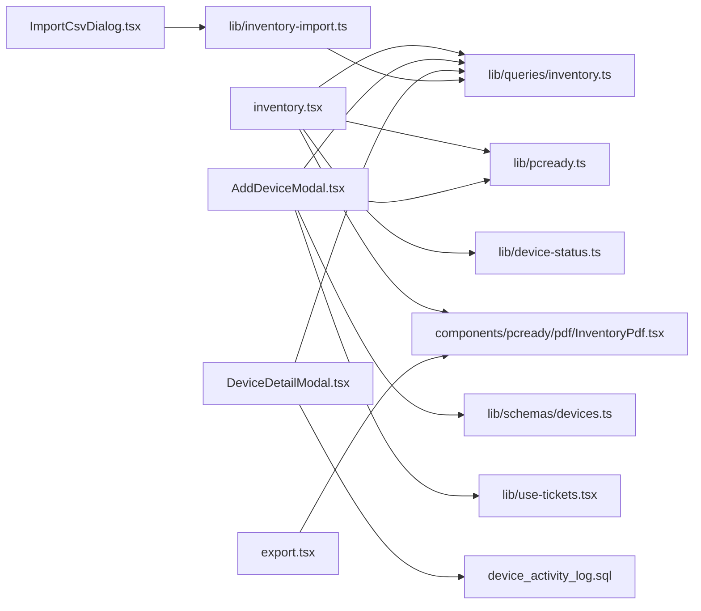

**Diagram sources**
- [inventory.tsx:86-94](file://src/routes/_app/inventory.tsx#L86-L94)
- [AddDeviceModal.tsx:76-118](file://src/components/pcready/AddDeviceModal.tsx#L76-L118)
- [DeviceDetailModal.tsx:120-137](file://src/components/pcready/DeviceDetailModal.tsx#L120-L137)
- [inventory.ts:22-100](file://src/lib/queries/inventory.ts#L22-L100)
- [devices.ts:4-12](file://src/lib/schemas/devices.ts#L4-L12)
- [pcready.ts:66-66](file://src/lib/pcready.ts#L66-L66)
- [use-tickets.tsx:33-35](file://src/lib/use-tickets.tsx#L33-L35)
- [ImportCsvDialog.tsx:5-13](file://src/components/inventory/ImportCsvDialog.tsx#L5-L13)
- [inventory-import.ts:1-271](file://src/lib/inventory-import.ts#L1-L271)
- [InventoryPdf.tsx:1-93](file://src/components/pcready/pdf/InventoryPdf.tsx#L1-L93)
- [export.tsx:1-18](file://src/components/pcready/pdf/export.tsx#L1-L18)
- [device_activity_log.sql:1-27](file://supabase/migrations/20260515100000_device_activity_log.sql#L1-L27)

**Section sources**
- [inventory.tsx:86-94](file://src/routes/_app/inventory.tsx#L86-L94)
- [AddDeviceModal.tsx:76-118](file://src/components/pcready/AddDeviceModal.tsx#L76-L118)
- [DeviceDetailModal.tsx:120-137](file://src/components/pcready/DeviceDetailModal.tsx#L120-L137)
- [inventory.ts:22-100](file://src/lib/queries/inventory.ts#L22-L100)
- [devices.ts:4-12](file://src/lib/schemas/devices.ts#L4-L12)
- [pcready.ts:66-66](file://src/lib/pcready.ts#L66-L66)
- [use-tickets.tsx:33-35](file://src/lib/use-tickets.tsx#L33-L35)
- [ImportCsvDialog.tsx:5-13](file://src/components/inventory/ImportCsvDialog.tsx#L5-L13)
- [inventory-import.ts:1-271](file://src/lib/inventory-import.ts#L1-L271)
- [InventoryPdf.tsx:1-93](file://src/components/pcready/pdf/InventoryPdf.tsx#L1-L93)
- [export.tsx:1-18](file://src/components/pcready/pdf/export.tsx#L1-L18)
- [device_activity_log.sql:1-27](file://supabase/migrations/20260515100000_device_activity_log.sql#L1-L27)

## Performance Considerations
- Pagination: fixed page size with exact count; compute page count from total
- Query caching: React Query default staleTime reduces redundant requests
- Assignment flag precomputation: avoids N+1 queries by loading active assignment IDs once per list
- Bulk operations: sequential processing with error isolation prevents cascading failures
- Activity logging: optimized indexes on device_id enable fast device-specific queries
- PDF generation: client-side rendering minimizes server load for export operations
- Bulk operations: direct Supabase mutations bypass React Query cache for immediate UI updates
- DeviceDetailModal: memoized computations and efficient timeline building prevent re-renders

Recommendations:
- Keep PAGE_SIZE tuned to UI readability and network latency
- Use placeholderData to avoid flicker during refetch
- Prefer server-side filtering (status, OS, ILIKE) to limit payload sizes
- For very large inventories, consider indexed columns and optimized ILIKE patterns
- Implement proper error boundaries for bulk operations to contain failures
- Use debounced search to reduce query frequency during typing

**Section sources**
- [inventory.tsx:61-125](file://src/routes/_app/inventory.tsx#L61-L125)
- [inventory.ts:22-54](file://src/lib/queries/inventory.ts#L22-L54)
- [queryClient.ts:4-13](file://src/lib/queries/queryClient.ts#L4-L13)
- [inventory-import.ts:198-226](file://src/lib/inventory-import.ts#L198-L226)
- [device_activity_log.sql:8-10](file://supabase/migrations/20260515100000_device_activity_log.sql#L8-L10)

## Troubleshooting Guide
Common issues and resolutions:
- Validation errors in AddDeviceModal: ensure required fields are filled and formatted correctly
- No clients available: verify client options loading and that at least one client exists
- Status change blocked: cannot modify status of assigned devices with active tickets
- CSV import failures: check for duplicate serials, missing clients, or invalid statuses
- Camera scanner unavailable: ensure HTTPS/localhost and browser support; fall back to manual input
- Bulk operation failures: individual device errors don't block successful updates; check console for specific failures
- PDF export errors: verify device selection and network connectivity for download operations
- Activity log discrepancies: ensure device_id foreign key constraints are properly maintained
- Technical notes editing issues: verify authentication and device ownership permissions

**Section sources**
- [AddDeviceModal.tsx:17-19](file://src/components/pcready/AddDeviceModal.tsx#L17-L19)
- [AddDeviceModal.tsx:82-84](file://src/components/pcready/AddDeviceModal.tsx#L82-L84)
- [inventory.tsx:242-275](file://src/routes/_app/inventory.tsx#L242-L275)
- [ImportCsvDialog.tsx:76-95](file://src/components/inventory/ImportCsvDialog.tsx#L76-L95)
- [BarcodeScanner.tsx:105-119](file://src/components/inventory/BarcodeScanner.tsx#L105-L119)
- [inventory.tsx:296-345](file://src/routes/_app/inventory.tsx#L296-L345)
- [DeviceDetailModal.tsx:363-380](file://src/components/pcready/DeviceDetailModal.tsx#L363-L380)

## Conclusion
The enhanced inventory system combines robust UI components, reactive data fetching, and efficient data access patterns with new capabilities for comprehensive device management. The addition of technical notes editing, bulk operations, device activity logging, and PDF export functionality significantly improves operational efficiency and auditability. The system maintains clear separation of concerns between UI, queries, and server functions while supporting scalable bulk import and export operations.

## Appendices

### Example Workflows

- Enhanced inventory query with filters, pagination, and bulk selection
  - Parameters: status=assigned, os=Windows 11 Pro, q=ABC123, page=0, pageSize=50, withoutTicket=false, updatedBeforeDays=30
  - Behavior: apply status and OS filters, search term OR match, date constraints, paginate, compute assignment flags

- Device creation workflow with technical notes
  - Modal captures brand, model, serial, client, end_user, os, notes
  - Zod validation passes, mutation inserts into devices, cache invalidated, activity logged

- Bulk status change scenario
  - Select 25 devices via checkboxes
  - Open bulk status dialog, choose "maintenance"
  - Sequential update processing with success/failure tracking
  - Cache invalidated, success toast with counts

- PDF export workflow
  - Select devices via checkboxes
  - Click export button, generate PDF with organization branding
  - Download completes successfully with device statistics

- Device activity logging
  - Device status change triggers activity log entry with device_id
  - DeviceDetailModal retrieves both ticket and device-level activities
  - Unified timeline displays chronological events with operator attribution

**Section sources**
- [inventory.tsx:87-94](file://src/routes/_app/inventory.tsx#L87-L94)
- [AddDeviceModal.tsx:78-95](file://src/components/pcready/AddDeviceModal.tsx#L78-L95)
- [inventory.tsx:296-345](file://src/routes/_app/inventory.tsx#L296-L345)
- [inventory.tsx:346-365](file://src/routes/_app/inventory.tsx#L346-L365)
- [DeviceDetailModal.tsx:247-268](file://src/components/pcready/DeviceDetailModal.tsx#L247-L268)
- [device_activity_log.sql:4-10](file://supabase/migrations/20260515100000_device_activity_log.sql#L4-L10)