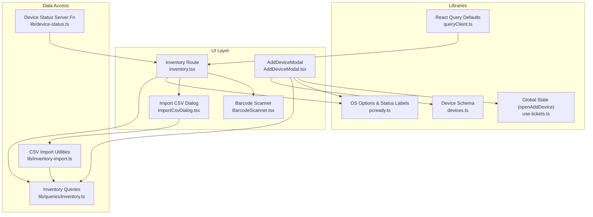
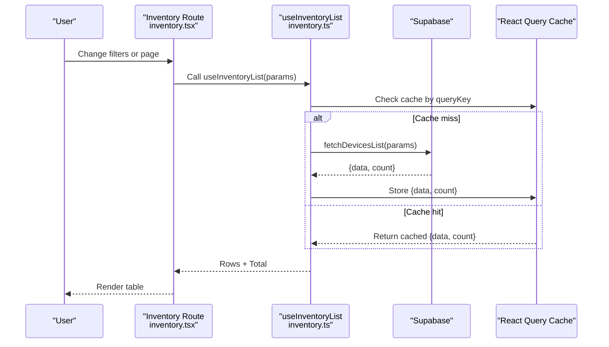
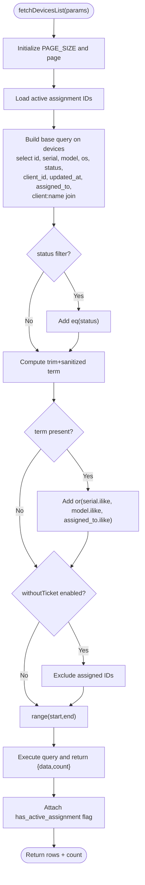
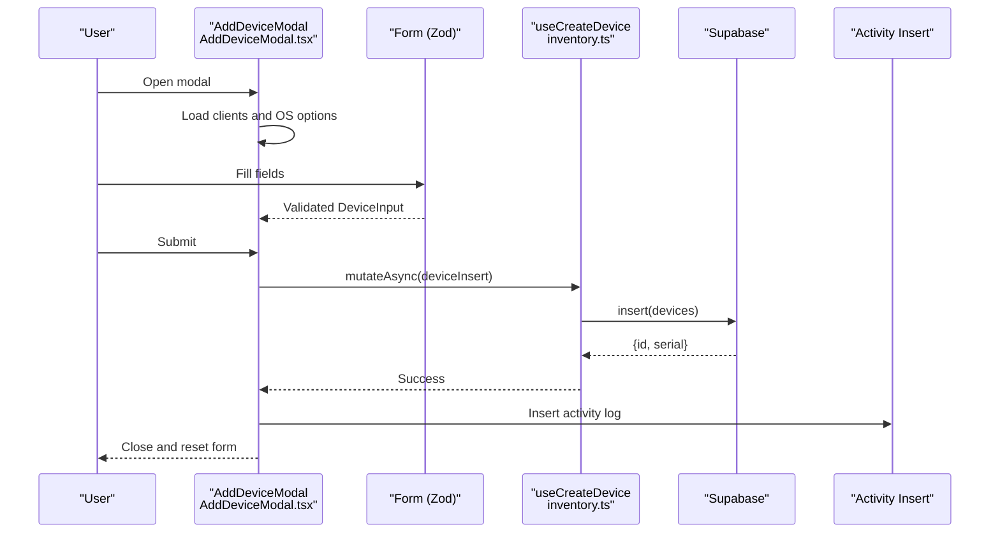
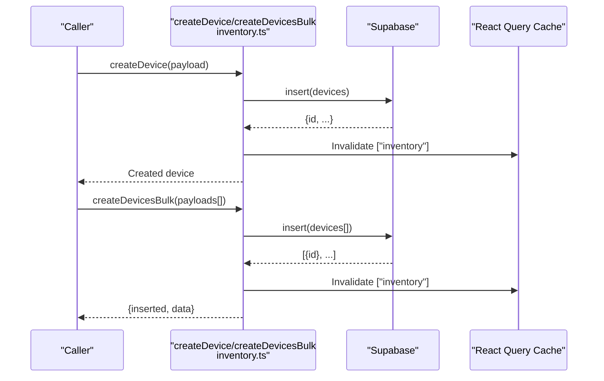
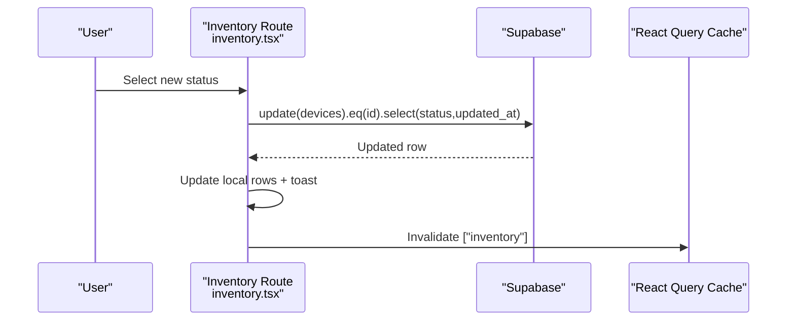
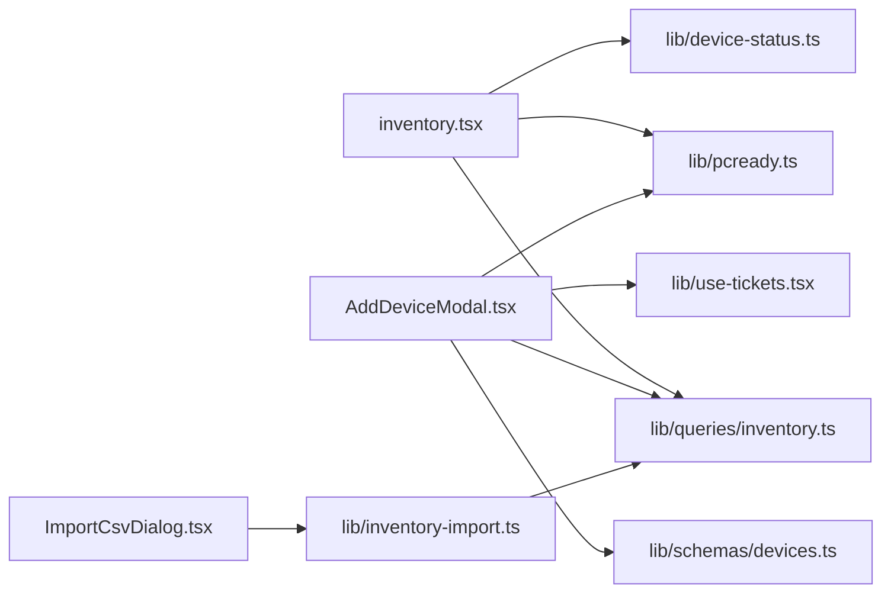

# Device Inventory Tracking

<cite>
**Referenced Files in This Document**
- [AddDeviceModal.tsx](file://src/components/pcready/AddDeviceModal.tsx)
- [inventory.tsx](file://src/routes/_app/inventory.tsx)
- [inventory.ts](file://src/lib/queries/inventory.ts)
- [devices.ts](file://src/lib/schemas/devices.ts)
- [device-status.ts](file://src/lib/device-status.ts)
- [inventory-import.ts](file://src/lib/inventory-import.ts)
- [ImportCsvDialog.tsx](file://src/components/inventory/ImportCsvDialog.tsx)
- [BarcodeScanner.tsx](file://src/components/inventory/BarcodeScanner.tsx)
- [use-tickets.tsx](file://src/lib/use-tickets.tsx)
- [pcready.ts](file://src/lib/pcready.ts)
- [queryClient.ts](file://src/lib/queries/queryClient.ts)
</cite>

## Table of Contents
1. [Introduction](#introduction)
2. [Project Structure](#project-structure)
3. [Core Components](#core-components)
4. [Architecture Overview](#architecture-overview)
5. [Detailed Component Analysis](#detailed-component-analysis)
6. [Dependency Analysis](#dependency-analysis)
7. [Performance Considerations](#performance-considerations)
8. [Troubleshooting Guide](#troubleshooting-guide)
9. [Conclusion](#conclusion)
10. [Appendices](#appendices)

## Introduction
This document explains the device inventory tracking system, focusing on:
- Inventory listing with filtering by status, operating system, search terms, pagination, and assignment status
- The AddDeviceModal component for capturing device details and creating devices
- Device creation via createDevice and createDevicesBulk
- fetchDevicesList implementation with parameter handling, query building, and result processing
- The useInventoryList hook for reactive data fetching and caching
- Device status management and lifecycle tracking
- Practical examples for inventory queries, device creation workflows, and bulk import
- Performance considerations and pagination strategies for large inventories

## Project Structure
The inventory feature spans UI components, route handlers, data access utilities, and shared libraries:
- Route handler renders the inventory page, manages filters, pagination, and status updates
- Queries module encapsulates Supabase data access and caching
- UI components capture device inputs, scan barcodes, and import CSV
- Shared libraries define device status, OS options, and schemas

**Diagram sources**
- [inventory.tsx:63-120](file://src/routes/_app/inventory.tsx#L63-L120)
- [AddDeviceModal.tsx:27-76](file://src/components/pcready/AddDeviceModal.tsx#L27-L76)
- [inventory.ts:22-70](file://src/lib/queries/inventory.ts#L22-L70)
- [devices.ts:4-12](file://src/lib/schemas/devices.ts#L4-L12)
- [pcready.ts:66-66](file://src/lib/pcready.ts#L66-L66)
- [use-tickets.tsx:19-36](file://src/lib/use-tickets.tsx#L19-L36)
- [queryClient.ts:4-13](file://src/lib/queries/queryClient.ts#L4-L13)
- [device-status.ts:15-55](file://src/lib/device-status.ts#L15-L55)
- [inventory-import.ts:1-271](file://src/lib/inventory-import.ts#L1-L271)

**Section sources**
- [inventory.tsx:24-37](file://src/routes/_app/inventory.tsx#L24-L37)
- [inventory.ts:22-70](file://src/lib/queries/inventory.ts#L22-L70)
- [AddDeviceModal.tsx:27-76](file://src/components/pcready/AddDeviceModal.tsx#L27-L76)
- [devices.ts:4-12](file://src/lib/schemas/devices.ts#L4-L12)
- [pcready.ts:66-66](file://src/lib/pcready.ts#L66-L66)
- [use-tickets.tsx:19-36](file://src/lib/use-tickets.tsx#L19-L36)
- [queryClient.ts:4-13](file://src/lib/queries/queryClient.ts#L4-L13)
- [device-status.ts:15-55](file://src/lib/device-status.ts#L15-L55)
- [inventory-import.ts:1-271](file://src/lib/inventory-import.ts#L1-L271)

## Core Components
- Inventory route page: renders filters, table, pagination, status badges, and actions
- Inventory queries: fetches paginated data, applies filters, computes assignment flags, and exposes mutations
- AddDeviceModal: captures device details, validates via schema, and creates devices
- CSV import: parses, validates, and imports devices in bulk
- Status management: updates device status and notifies admins for specific transitions

**Section sources**
- [inventory.tsx:63-120](file://src/routes/_app/inventory.tsx#L63-L120)
- [inventory.ts:22-100](file://src/lib/queries/inventory.ts#L22-L100)
- [AddDeviceModal.tsx:27-118](file://src/components/pcready/AddDeviceModal.tsx#L27-L118)
- [inventory-import.ts:128-180](file://src/lib/inventory-import.ts#L128-L180)
- [device-status.ts:15-55](file://src/lib/device-status.ts#L15-L55)

## Architecture Overview
The system uses React Query for caching and background synchronization, Supabase for data persistence, and Zod for input validation. The inventory route composes filters and pagination into a query key consumed by useInventoryList. Mutations trigger cache invalidation to keep views fresh.

**Diagram sources**
- [inventory.tsx:86-94](file://src/routes/_app/inventory.tsx#L86-L94)
- [inventory.ts:56-70](file://src/lib/queries/inventory.ts#L56-L70)
- [inventory.ts:22-54](file://src/lib/queries/inventory.ts#L22-L54)

**Section sources**
- [inventory.tsx:86-121](file://src/routes/_app/inventory.tsx#L86-L121)
- [inventory.ts:56-70](file://src/lib/queries/inventory.ts#L56-L70)

## Detailed Component Analysis

### Inventory Listing and Filtering
- Filters supported:
  - Status: available, assigned, maintenance, retired
  - Operating system: configurable via OS options
  - Search term: matches serial, model, or assigned user
  - Assignment status: optional filter excluding devices with active assignments
- Pagination: fixed page size with computed page count
- Assignment flag: precomputed by checking active ticket-device assignments

**Diagram sources**
- [inventory.ts:22-54](file://src/lib/queries/inventory.ts#L22-L54)

**Section sources**
- [inventory.tsx:82-94](file://src/routes/_app/inventory.tsx#L82-L94)
- [inventory.ts:22-54](file://src/lib/queries/inventory.ts#L22-L54)

### AddDeviceModal: Capturing Device Details
- Purpose: capture brand, model, serial, client, end user, OS, and notes
- Validation: Zod schema enforces required fields and types
- Client options: loaded asynchronously; default selection applied
- OS options: derived from app settings or defaults
- Creation flow: constructs TablesInsert payload and calls useCreateDevice mutation

**Diagram sources**
- [AddDeviceModal.tsx:76-118](file://src/components/pcready/AddDeviceModal.tsx#L76-L118)
- [devices.ts:4-12](file://src/lib/schemas/devices.ts#L4-L12)
- [inventory.ts:102-108](file://src/lib/queries/inventory.ts#L102-L108)

**Section sources**
- [AddDeviceModal.tsx:27-118](file://src/components/pcready/AddDeviceModal.tsx#L27-L118)
- [devices.ts:4-12](file://src/lib/schemas/devices.ts#L4-L12)
- [inventory.ts:102-108](file://src/lib/queries/inventory.ts#L102-L108)

### Device Creation: createDevice and createDevicesBulk
- Single device: insert payload into devices, return created row
- Bulk devices: insert array of payloads, return count and ids
- Both mutations invalidate the inventory query cache to reflect changes

**Diagram sources**
- [inventory.ts:82-100](file://src/lib/queries/inventory.ts#L82-L100)
- [inventory.ts:110-116](file://src/lib/queries/inventory.ts#L110-L116)

**Section sources**
- [inventory.ts:82-100](file://src/lib/queries/inventory.ts#L82-L100)
- [inventory.ts:110-116](file://src/lib/queries/inventory.ts#L110-L116)

### fetchDevicesList: Parameter Handling, Query Building, and Result Processing
- Parameters: status, os, q, page, pageSize, withoutTicket
- Query construction: base select with ordering, optional filters, range-based pagination
- Assignment flag: attach has_active_assignment using preloaded active assignment IDs
- Result: typed rows plus total count

**Section sources**
- [inventory.ts:4-11](file://src/lib/queries/inventory.ts#L4-L11)
- [inventory.ts:22-54](file://src/lib/queries/inventory.ts#L22-L54)

### useInventoryList: Reactive Data Fetching and Caching
- Query key includes status, os, q, page, pageSize, and withoutTicket flag
- Placeholder data preserves previous data while fetching
- Integrates with React Query defaults (retry, staleTime, refetchOnWindowFocus)

**Section sources**
- [inventory.ts:56-70](file://src/lib/queries/inventory.ts#L56-L70)
- [queryClient.ts:4-13](file://src/lib/queries/queryClient.ts#L4-L13)

### Device Status Management and Lifecycle Tracking
- Status values: available, assigned, maintenance, retired
- UI badge allows changing status with safeguards (e.g., prevents changing status of assigned devices with active tickets)
- Server-side update function validates access token, checks existence, and triggers notifications for specific transitions
- Route-level status change persists via Supabase update and invalidates cache

**Diagram sources**
- [inventory.tsx:242-275](file://src/routes/_app/inventory.tsx#L242-L275)

**Section sources**
- [device-status.ts:15-55](file://src/lib/device-status.ts#L15-L55)
- [inventory.tsx:242-275](file://src/routes/_app/inventory.tsx#L242-L275)

### Bulk Import Workflow (CSV)
- Steps: upload CSV -> parse -> load context (clients/devices) -> validate -> preview -> confirm -> import
- Validation rules: serial/model/client required, valid status, unique serial in file, client lookup
- Import engine: inserts new devices, updates existing ones, tracks progress and errors

**Diagram sources**
- [ImportCsvDialog.tsx:52-95](file://src/components/inventory/ImportCsvDialog.tsx#L52-L95)
- [inventory-import.ts:128-180](file://src/lib/inventory-import.ts#L128-L180)

**Section sources**
- [ImportCsvDialog.tsx:52-95](file://src/components/inventory/ImportCsvDialog.tsx#L52-L95)
- [inventory-import.ts:49-126](file://src/lib/inventory-import.ts#L49-L126)
- [inventory-import.ts:128-180](file://src/lib/inventory-import.ts#L128-L180)

### Barcode Scanning and Quick Add
- BarcodeScanner component decodes QR/barcode input from camera or manual entry
- On detection, attempts to resolve device by serial; otherwise sets search term and opens AddDeviceModal with prefilled serial

**Section sources**
- [BarcodeScanner.tsx:11-62](file://src/components/inventory/BarcodeScanner.tsx#L11-L62)
- [inventory.tsx:191-220](file://src/routes/_app/inventory.tsx#L191-L220)
- [use-tickets.tsx:33-35](file://src/lib/use-tickets.tsx#L33-L35)

## Dependency Analysis
- UI depends on:
  - Inventory queries for listing and mutations
  - Zod schema for validation
  - App settings for dynamic OS options
  - Global state for opening AddDeviceModal
- Queries depend on:
  - Supabase client for CRUD
  - React Query for caching and invalidation
- Status management:
  - Server function validates access and triggers notifications
  - Route-level mutation updates UI and cache

**Diagram sources**
- [inventory.tsx:86-94](file://src/routes/_app/inventory.tsx#L86-L94)
- [AddDeviceModal.tsx:76-118](file://src/components/pcready/AddDeviceModal.tsx#L76-L118)
- [inventory.ts:22-100](file://src/lib/queries/inventory.ts#L22-L100)
- [devices.ts:4-12](file://src/lib/schemas/devices.ts#L4-L12)
- [pcready.ts:66-66](file://src/lib/pcready.ts#L66-L66)
- [use-tickets.tsx:33-35](file://src/lib/use-tickets.tsx#L33-L35)
- [ImportCsvDialog.tsx:5-13](file://src/components/inventory/ImportCsvDialog.tsx#L5-L13)
- [inventory-import.ts:1-271](file://src/lib/inventory-import.ts#L1-L271)

**Section sources**
- [inventory.tsx:86-94](file://src/routes/_app/inventory.tsx#L86-L94)
- [AddDeviceModal.tsx:76-118](file://src/components/pcready/AddDeviceModal.tsx#L76-L118)
- [inventory.ts:22-100](file://src/lib/queries/inventory.ts#L22-L100)
- [devices.ts:4-12](file://src/lib/schemas/devices.ts#L4-L12)
- [pcready.ts:66-66](file://src/lib/pcready.ts#L66-L66)
- [use-tickets.tsx:33-35](file://src/lib/use-tickets.tsx#L33-L35)
- [ImportCsvDialog.tsx:5-13](file://src/components/inventory/ImportCsvDialog.tsx#L5-L13)
- [inventory-import.ts:1-271](file://src/lib/inventory-import.ts#L1-L271)

## Performance Considerations
- Pagination: fixed page size with exact count; compute page count from total
- Query caching: React Query default staleTime reduces redundant requests
- Assignment flag precomputation: avoids N+1 queries by loading active assignment IDs once per list
- Bulk operations: batch inserts/updates minimize round-trips
- CSV import: chunked client and device lookups reduce query volume

Recommendations:
- Keep PAGE_SIZE tuned to UI readability and network latency
- Use placeholderData to avoid flicker during refetch
- Prefer server-side filtering (status, OS, ILIKE) to limit payload sizes
- For very large inventories, consider indexed columns and optimized ILIKE patterns

**Section sources**
- [inventory.tsx:61-125](file://src/routes/_app/inventory.tsx#L61-L125)
- [inventory.ts:22-54](file://src/lib/queries/inventory.ts#L22-L54)
- [queryClient.ts:4-13](file://src/lib/queries/queryClient.ts#L4-L13)
- [inventory-import.ts:198-226](file://src/lib/inventory-import.ts#L198-L226)

## Troubleshooting Guide
Common issues and resolutions:
- Validation errors in AddDeviceModal: ensure required fields are filled and formatted correctly
- No clients available: verify client options loading and that at least one client exists
- Status change blocked: cannot modify status of assigned devices with active tickets
- CSV import failures: check for duplicate serials, missing clients, or invalid statuses
- Camera scanner unavailable: ensure HTTPS/localhost and browser support; fall back to manual input

**Section sources**
- [AddDeviceModal.tsx:17-19](file://src/components/pcready/AddDeviceModal.tsx#L17-L19)
- [AddDeviceModal.tsx:82-84](file://src/components/pcready/AddDeviceModal.tsx#L82-L84)
- [inventory.tsx:242-275](file://src/routes/_app/inventory.tsx#L242-L275)
- [ImportCsvDialog.tsx:76-95](file://src/components/inventory/ImportCsvDialog.tsx#L76-L95)
- [BarcodeScanner.tsx:105-119](file://src/components/inventory/BarcodeScanner.tsx#L105-L119)

## Conclusion
The inventory system combines robust UI components, reactive data fetching, and efficient data access patterns. It supports flexible filtering, pagination, status management, and scalable bulk import, with clear separation of concerns between UI, queries, and server functions.

## Appendices

### Example Workflows

- Inventory query with filters and pagination
  - Parameters: status=assigned, os=Windows 11 Pro, q=ABC123, page=0, pageSize=50, withoutTicket=false
  - Behavior: apply status and OS filters, search term OR match, paginate, compute assignment flags

- Device creation workflow
  - Modal captures brand, model, serial, client, end_user, os, notes
  - Zod validation passes, mutation inserts into devices, cache invalidated

- Bulk import scenario
  - Upload CSV with serial, model, os, status, client_name, notes
  - Parse, load clients/devices, validate, preview, confirm, iterate rows, insert/update, report results

**Section sources**
- [inventory.tsx:87-94](file://src/routes/_app/inventory.tsx#L87-L94)
- [AddDeviceModal.tsx:78-95](file://src/components/pcready/AddDeviceModal.tsx#L78-L95)
- [inventory-import.ts:128-180](file://src/lib/inventory-import.ts#L128-L180)