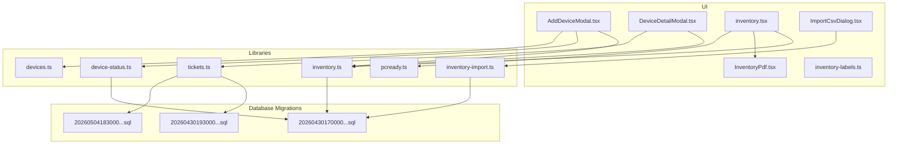
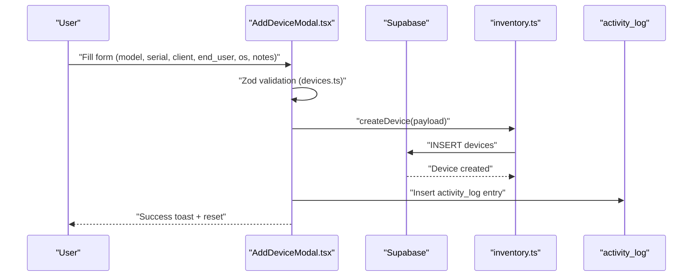
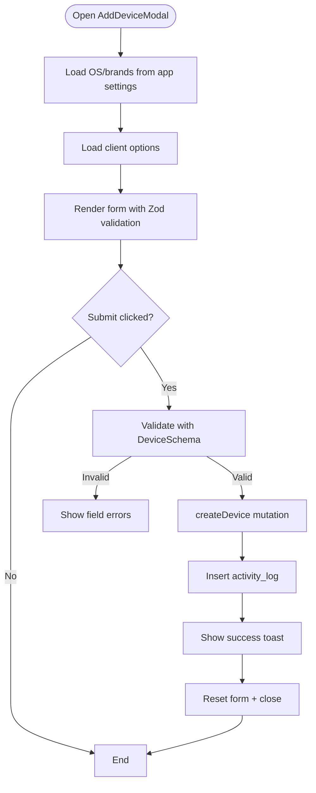
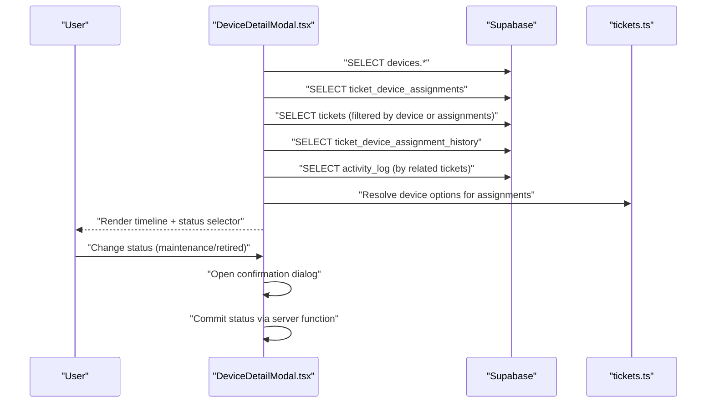
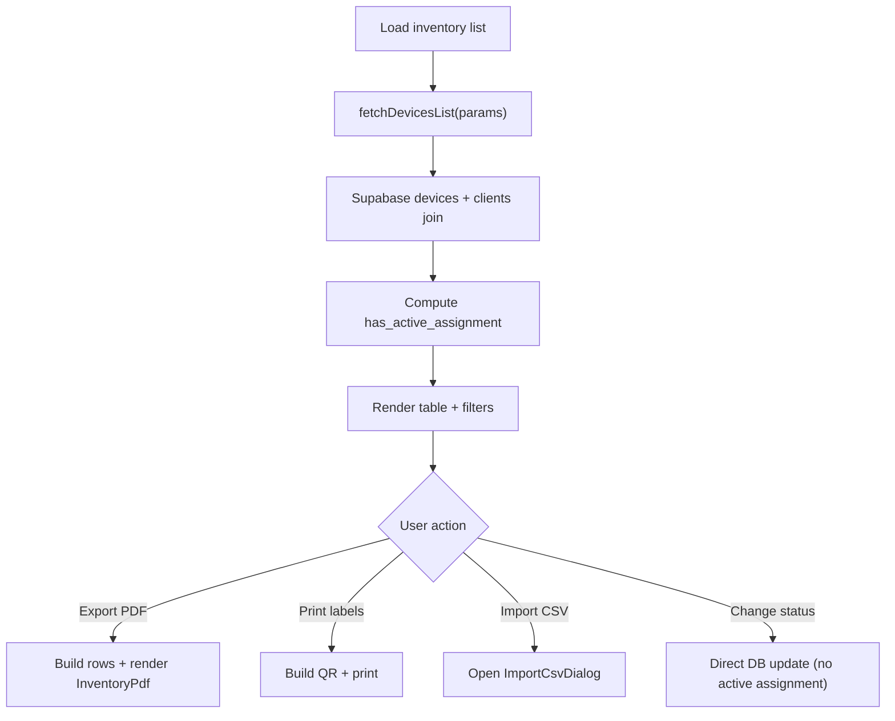
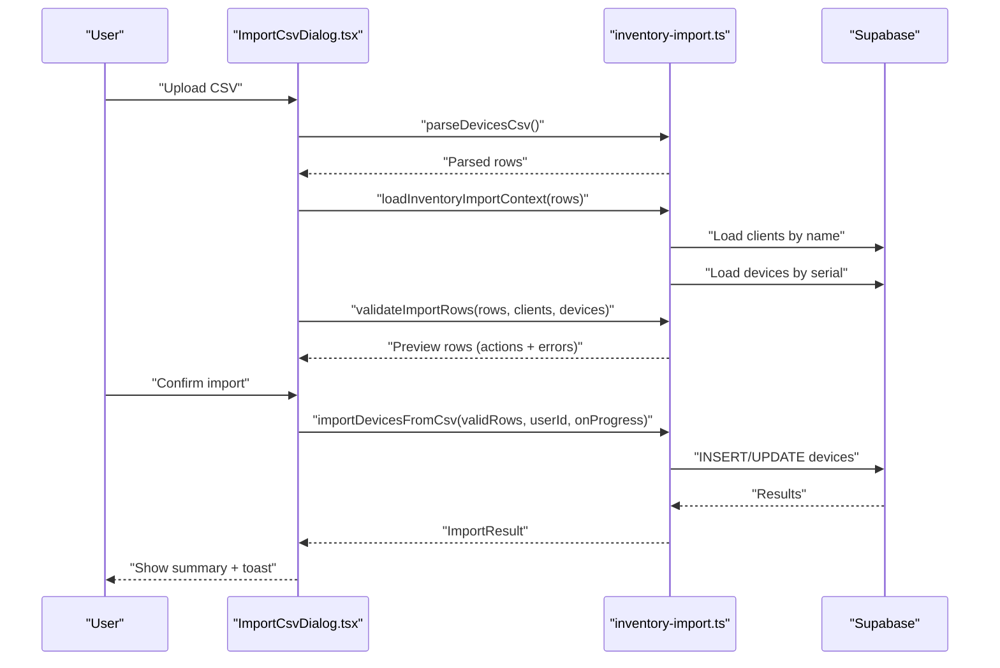
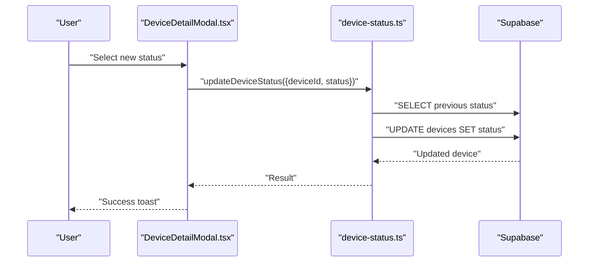
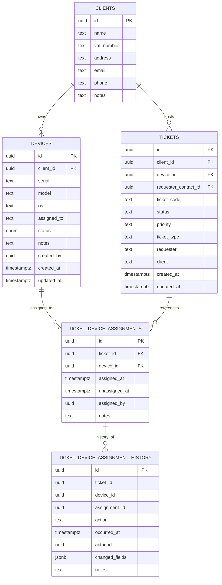
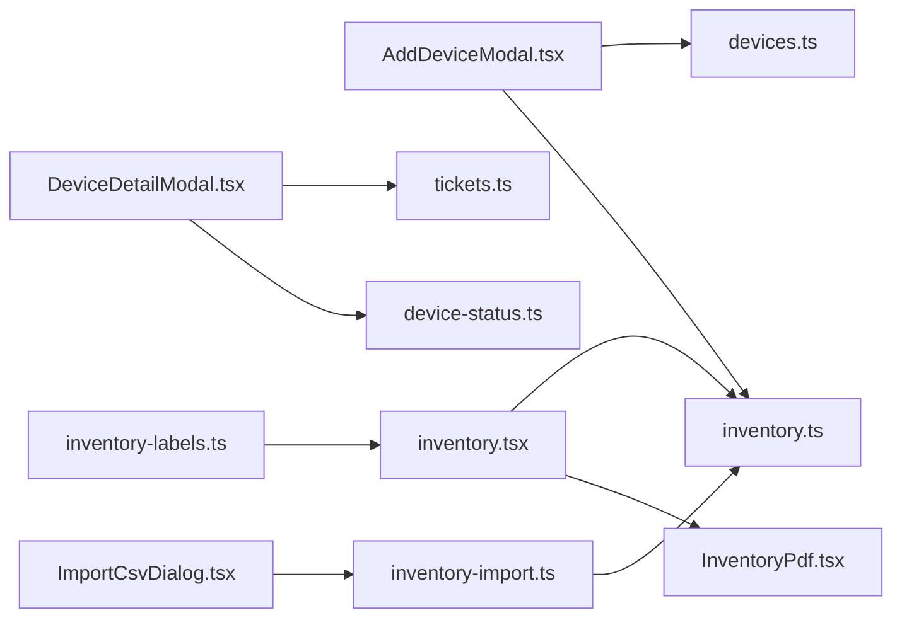

# Device Management System

<cite>
**Referenced Files in This Document**
- [AddDeviceModal.tsx](file://src/components/pcready/AddDeviceModal.tsx)
- [DeviceDetailModal.tsx](file://src/components/pcready/DeviceDetailModal.tsx)
- [inventory.tsx](file://src/routes/_app/inventory.tsx)
- [inventory-import.ts](file://src/lib/inventory-import.ts)
- [ImportCsvDialog.tsx](file://src/components/inventory/ImportCsvDialog.tsx)
- [inventory.ts](file://src/lib/queries/inventory.ts)
- [device-status.ts](file://src/lib/device-status.ts)
- [pcready.ts](file://src/lib/pcready.ts)
- [devices.ts](file://lib/schemas/devices.ts)
- [tickets.ts](file://src/lib/queries/tickets.ts)
- [InventoryPdf.tsx](file://src/components/pcready/pdf/InventoryPdf.tsx)
- [inventory-labels.ts](file://src/lib/inventory-labels.ts)
- [20260430170000_split_assets_clients_tickets.sql](file://supabase/migrations/20260430170000_split_assets_clients_tickets.sql)
- [20260430193000_asset_ticket_separation_history.sql](file://supabase/migrations/20260430193000_asset_ticket_separation_history.sql)
- [20260504183000_create_ticket_device_assignment_history.sql](file://supabase/migrations/20260504183000_create_ticket_device_assignment_history.sql)
</cite>

## Table of Contents
1. [Introduction](#introduction)
2. [Project Structure](#project-structure)
3. [Core Components](#core-components)
4. [Architecture Overview](#architecture-overview)
5. [Detailed Component Analysis](#detailed-component-analysis)
6. [Dependency Analysis](#dependency-analysis)
7. [Performance Considerations](#performance-considerations)
8. [Troubleshooting Guide](#troubleshooting-guide)
9. [Conclusion](#conclusion)

## Introduction
This document explains the device management system with a focus on inventory tracking, device lifecycle, client associations, and the relationship to tickets. It covers how devices are added, queried, exported to PDF, imported via CSV, and viewed in detail, including status transitions and historical tracking. It also documents configuration options for device categories and OS choices, and provides guidance for administrators and inventory managers.

## Project Structure
The device management system spans UI components, server functions, database migrations, and PDF/label generation utilities. Key areas:
- UI forms and modals for adding and viewing devices
- Inventory listing and filtering
- CSV import/export pipeline
- PDF generation for inventory reports
- Device status change server function
- Ticket-device assignment and history tables

**Diagram sources**
- [AddDeviceModal.tsx:1-218](file://src/components/pcready/AddDeviceModal.tsx#L1-L218)
- [DeviceDetailModal.tsx:1-802](file://src/components/pcready/DeviceDetailModal.tsx#L1-L802)
- [inventory.tsx:1-580](file://src/routes/_app/inventory.tsx#L1-L580)
- [ImportCsvDialog.tsx:1-281](file://src/components/inventory/ImportCsvDialog.tsx#L1-L281)
- [InventoryPdf.tsx:1-93](file://src/components/pcready/pdf/InventoryPdf.tsx#L1-L93)
- [inventory.ts:1-128](file://src/lib/queries/inventory.ts#L1-L128)
- [inventory-import.ts:1-271](file://src/lib/inventory-import.ts#L1-L271)
- [device-status.ts:1-56](file://src/lib/device-status.ts#L1-L56)
- [pcready.ts:1-241](file://src/lib/pcready.ts#L1-L241)
- [devices.ts:1-15](file://lib/schemas/devices.ts#L1-L15)
- [tickets.ts:1-284](file://src/lib/queries/tickets.ts#L1-L284)
- [20260430170000_split_assets_clients_tickets.sql:1-137](file://supabase/migrations/20260430170000_split_assets_clients_tickets.sql#L1-L137)
- [20260430193000_asset_ticket_separation_history.sql:1-89](file://supabase/migrations/20260430193000_asset_ticket_separation_history.sql#L1-L89)
- [20260504183000_create_ticket_device_assignment_history.sql:1-74](file://supabase/migrations/20260504183000_create_ticket_device_assignment_history.sql#L1-L74)

**Section sources**
- [AddDeviceModal.tsx:1-218](file://src/components/pcready/AddDeviceModal.tsx#L1-L218)
- [DeviceDetailModal.tsx:1-802](file://src/components/pcready/DeviceDetailModal.tsx#L1-L802)
- [inventory.tsx:1-580](file://src/routes/_app/inventory.tsx#L1-L580)
- [ImportCsvDialog.tsx:1-281](file://src/components/inventory/ImportCsvDialog.tsx#L1-L281)
- [InventoryPdf.tsx:1-93](file://src/components/pcready/pdf/InventoryPdf.tsx#L1-L93)
- [inventory.ts:1-128](file://src/lib/queries/inventory.ts#L1-L128)
- [inventory-import.ts:1-271](file://src/lib/inventory-import.ts#L1-L271)
- [device-status.ts:1-56](file://src/lib/device-status.ts#L1-L56)
- [pcready.ts:1-241](file://src/lib/pcready.ts#L1-L241)
- [devices.ts:1-15](file://lib/schemas/devices.ts#L1-L15)
- [tickets.ts:1-284](file://src/lib/queries/tickets.ts#L1-L284)
- [20260430170000_split_assets_clients_tickets.sql:1-137](file://supabase/migrations/20260430170000_split_assets_clients_tickets.sql#L1-L137)
- [20260430193000_asset_ticket_separation_history.sql:1-89](file://supabase/migrations/20260430193000_asset_ticket_separation_history.sql#L1-L89)
- [20260504183000_create_ticket_device_assignment_history.sql:1-74](file://supabase/migrations/20260504183000_create_ticket_device_assignment_history.sql#L1-L74)

## Core Components
- AddDeviceModal: Collects model, serial, client association, end-user, OS, and notes; validates with Zod; persists via Supabase; logs activity.
- DeviceDetailModal: Loads device, assignments, tickets, history, and activity; renders timeline; supports status updates with confirmation for maintenance/retired.
- Inventory listing: Filters by status/OS/text; supports scanning, QR, labels, CSV import, and PDF export.
- CSV import: Parses, validates, previews, and bulk imports devices; enforces unique serials and client existence.
- PDF export: Generates branded inventory PDF with counts and table.
- Device status server function: Updates device status with RLS checks and optional admin notifications.
- Client/device/ticket relations: Migrations define devices, clients, and ticket-device assignment/history tables.

**Section sources**
- [AddDeviceModal.tsx:27-118](file://src/components/pcready/AddDeviceModal.tsx#L27-L118)
- [DeviceDetailModal.tsx:118-335](file://src/components/pcready/DeviceDetailModal.tsx#L118-L335)
- [inventory.tsx:63-275](file://src/routes/_app/inventory.tsx#L63-L275)
- [inventory-import.ts:49-180](file://src/lib/inventory-import.ts#L49-L180)
- [InventoryPdf.tsx:26-84](file://src/components/pcready/pdf/InventoryPdf.tsx#L26-L84)
- [device-status.ts:15-55](file://src/lib/device-status.ts#L15-L55)
- [20260430170000_split_assets_clients_tickets.sql:28-44](file://supabase/migrations/20260430170000_split_assets_clients_tickets.sql#L28-L44)
- [20260430193000_asset_ticket_separation_history.sql:4-18](file://supabase/migrations/20260430193000_asset_ticket_separation_history.sql#L4-L18)
- [20260504183000_create_ticket_device_assignment_history.sql:4-22](file://supabase/migrations/20260504183000_create_ticket_device_assignment_history.sql#L4-L22)

## Architecture Overview
The system integrates UI components with server functions and Supabase. Device creation and updates flow through typed forms and Zod validation, persisted via Supabase queries. Status changes are handled by a dedicated server function enforcing permissions and emitting notifications when needed. Ticket-device relationships are tracked via assignment tables and a persistent history table.

**Diagram sources**
- [AddDeviceModal.tsx:78-118](file://src/components/pcready/AddDeviceModal.tsx#L78-L118)
- [devices.ts:5-12](file://lib/schemas/devices.ts#L5-L12)
- [inventory.ts:82-89](file://src/lib/queries/inventory.ts#L82-L89)

**Section sources**
- [AddDeviceModal.tsx:27-118](file://src/components/pcready/AddDeviceModal.tsx#L27-L118)
- [devices.ts:5-12](file://lib/schemas/devices.ts#L5-L12)
- [inventory.ts:82-89](file://src/lib/queries/inventory.ts#L82-L89)

## Detailed Component Analysis

### AddDeviceModal: Data Collection and Persistence
- Fields collected: brand, model, serial, client_id, end_user, os, notes.
- Validation: Zod schema ensures required fields and enum-like OS selection.
- Client options: loaded dynamically via tickets query helper.
- Persistence: mutation to create device; on success, activity log entry is inserted; UI resets and closes.
- Configuration: OS options and brands sourced from app settings; falls back to defaults if unavailable.

**Diagram sources**
- [AddDeviceModal.tsx:27-118](file://src/components/pcready/AddDeviceModal.tsx#L27-L118)
- [devices.ts:5-12](file://lib/schemas/devices.ts#L5-L12)
- [tickets.ts:5-13](file://src/lib/queries/tickets.ts#L5-L13)
- [inventory.ts:82-89](file://src/lib/queries/inventory.ts#L82-L89)

**Section sources**
- [AddDeviceModal.tsx:27-118](file://src/components/pcready/AddDeviceModal.tsx#L27-L118)
- [devices.ts:5-12](file://lib/schemas/devices.ts#L5-L12)
- [tickets.ts:5-13](file://src/lib/queries/tickets.ts#L5-L13)
- [inventory.ts:82-89](file://src/lib/queries/inventory.ts#L82-L89)

### DeviceDetailModal: Lifecycle Tracking and Timeline
- Loads device, assignments, tickets, history, and activity log.
- Builds a unified timeline combining:
  - Device creation snapshot
  - Status/meta changes
  - Assignment actions (assigned/unassigned/replaced/deleted)
  - Ticket activity and notes
- Supports status change with confirmation for maintenance/retired states.
- Resolves actor names from profiles for attribution.

**Diagram sources**
- [DeviceDetailModal.tsx:149-285](file://src/components/pcready/DeviceDetailModal.tsx#L149-L285)
- [DeviceDetailModal.tsx:315-346](file://src/components/pcready/DeviceDetailModal.tsx#L315-L346)
- [tickets.ts:114-136](file://src/lib/queries/tickets.ts#L114-L136)

**Section sources**
- [DeviceDetailModal.tsx:118-335](file://src/components/pcready/DeviceDetailModal.tsx#L118-L335)
- [DeviceDetailModal.tsx:601-727](file://src/components/pcready/DeviceDetailModal.tsx#L601-L727)
- [tickets.ts:114-136](file://src/lib/queries/tickets.ts#L114-L136)

### Inventory Listing: Queries, Filters, and Export
- Fetches devices with counts, supports pagination, and marks active assignments.
- Filters: status, OS, free-text search across serial/model/user.
- Optional filter excludes devices with active assignments.
- Exports PDF via React PDF renderer; builds rows from current page data.
- Bulk operations: selected rows, QR labels, CSV import dialog.

**Diagram sources**
- [inventory.tsx:86-94](file://src/routes/_app/inventory.tsx#L86-L94)
- [inventory.tsx:242-275](file://src/routes/_app/inventory.tsx#L242-L275)
- [inventory.ts:22-54](file://src/lib/queries/inventory.ts#L22-L54)
- [InventoryPdf.tsx:26-84](file://src/components/pcready/pdf/InventoryPdf.tsx#L26-L84)

**Section sources**
- [inventory.tsx:63-275](file://src/routes/_app/inventory.tsx#L63-L275)
- [inventory.ts:22-54](file://src/lib/queries/inventory.ts#L22-L54)
- [InventoryPdf.tsx:26-84](file://src/components/pcready/pdf/InventoryPdf.tsx#L26-L84)

### CSV Import/Export Pipeline
- Import:
  - Parse CSV into typed rows.
  - Load clients and existing devices by name/serial.
  - Validate rows (required fields, valid status, unique serials, client lookup).
  - Preview actions (insert/update/skip) and errors.
  - Execute batched inserts/updates with progress reporting.
- Export:
  - CSV template included for download.
  - Inventory page exports current page to PDF.

**Diagram sources**
- [ImportCsvDialog.tsx:52-95](file://src/components/inventory/ImportCsvDialog.tsx#L52-L95)
- [inventory-import.ts:49-180](file://src/lib/inventory-import.ts#L49-L180)
- [inventory-import.ts:198-226](file://src/lib/inventory-import.ts#L198-L226)

**Section sources**
- [ImportCsvDialog.tsx:23-95](file://src/components/inventory/ImportCsvDialog.tsx#L23-L95)
- [inventory-import.ts:49-180](file://src/lib/inventory-import.ts#L49-L180)

### Device Status Management
- UI allows changing status with safeguards (e.g., read-only when active assignment exists).
- Server function enforces permissions and updates device status.
- For maintenance/retired transitions, emits admin notifications.

**Diagram sources**
- [DeviceDetailModal.tsx:315-346](file://src/components/pcready/DeviceDetailModal.tsx#L315-L346)
- [device-status.ts:15-55](file://src/lib/device-status.ts#L15-L55)

**Section sources**
- [DeviceDetailModal.tsx:315-346](file://src/components/pcready/DeviceDetailModal.tsx#L315-L346)
- [device-status.ts:15-55](file://src/lib/device-status.ts#L15-L55)

### Ticket-Device Relationship and Historical Tracking
- Devices belong to clients; tickets reference devices and clients.
- Assignment tracking moved to dedicated table with history mirroring changes.
- Persistent history table captures assignment events even if records are deleted.

**Diagram sources**
- [20260430170000_split_assets_clients_tickets.sql:3-44](file://supabase/migrations/20260430170000_split_assets_clients_tickets.sql#L3-L44)
- [20260430193000_asset_ticket_separation_history.sql:4-18](file://supabase/migrations/20260430193000_asset_ticket_separation_history.sql#L4-L18)
- [20260504183000_create_ticket_device_assignment_history.sql:4-22](file://supabase/migrations/20260504183000_create_ticket_device_assignment_history.sql#L4-L22)

**Section sources**
- [20260430170000_split_assets_clients_tickets.sql:28-44](file://supabase/migrations/20260430170000_split_assets_clients_tickets.sql#L28-L44)
- [20260430193000_asset_ticket_separation_history.sql:4-18](file://supabase/migrations/20260430193000_asset_ticket_separation_history.sql#L4-L18)
- [20260504183000_create_ticket_device_assignment_history.sql:4-22](file://supabase/migrations/20260504183000_create_ticket_device_assignment_history.sql#L4-L22)

## Dependency Analysis
- Forms depend on Zod schemas for validation.
- Modals depend on Supabase queries and server functions.
- Inventory page orchestrates multiple data sources (devices, clients, tickets, history).
- CSV import depends on parsing utilities and batched Supabase writes.
- PDF generation depends on inventory rows and theming utilities.

**Diagram sources**
- [AddDeviceModal.tsx:5-11](file://src/components/pcready/AddDeviceModal.tsx#L5-L11)
- [devices.ts:1-15](file://lib/schemas/devices.ts#L1-L15)
- [inventory.ts:1-128](file://src/lib/queries/inventory.ts#L1-L128)
- [DeviceDetailModal.tsx:1-17](file://src/components/pcready/DeviceDetailModal.tsx#L1-L17)
- [tickets.ts:1-284](file://src/lib/queries/tickets.ts#L1-L284)
- [device-status.ts:1-56](file://src/lib/device-status.ts#L1-L56)
- [inventory.tsx:1-580](file://src/routes/_app/inventory.tsx#L1-L580)
- [InventoryPdf.tsx:1-93](file://src/components/pcready/pdf/InventoryPdf.tsx#L1-L93)
- [ImportCsvDialog.tsx:1-281](file://src/components/inventory/ImportCsvDialog.tsx#L1-L281)
- [inventory-import.ts:1-271](file://src/lib/inventory-import.ts#L1-L271)
- [inventory-labels.ts:1-72](file://src/lib/inventory-labels.ts#L1-L72)

**Section sources**
- [AddDeviceModal.tsx:5-11](file://src/components/pcready/AddDeviceModal.tsx#L5-L11)
- [devices.ts:1-15](file://lib/schemas/devices.ts#L1-L15)
- [inventory.ts:1-128](file://src/lib/queries/inventory.ts#L1-L128)
- [DeviceDetailModal.tsx:1-17](file://src/components/pcready/DeviceDetailModal.tsx#L1-L17)
- [tickets.ts:1-284](file://src/lib/queries/tickets.ts#L1-L284)
- [device-status.ts:1-56](file://src/lib/device-status.ts#L1-L56)
- [inventory.tsx:1-580](file://src/routes/_app/inventory.tsx#L1-L580)
- [InventoryPdf.tsx:1-93](file://src/components/pcready/pdf/InventoryPdf.tsx#L1-L93)
- [ImportCsvDialog.tsx:1-281](file://src/components/inventory/ImportCsvDialog.tsx#L1-L281)
- [inventory-import.ts:1-271](file://src/lib/inventory-import.ts#L1-L271)
- [inventory-labels.ts:1-72](file://src/lib/inventory-labels.ts#L1-L72)

## Performance Considerations
- Pagination: Inventory lists use range-based pagination to limit rows per page.
- Filtering: Text search uses ILIKE with OR combinations; ensure indexes exist on frequently filtered columns (serial, model, assigned_to, os, status).
- Batch operations:
  - CSV import validates in-memory and batches inserts/updates; consider chunking for very large imports.
  - Bulk device creation helper exists for internal use.
- Real-time updates: Using React Query invalidations after mutations helps keep views consistent without excessive polling.
- PDF generation: Rendering large PDFs can be memory-intensive; consider generating only visible page data and avoiding unnecessary re-renders.

[No sources needed since this section provides general guidance]

## Troubleshooting Guide
Common issues and resolutions:
- Duplicate serial numbers:
  - CSV validation detects duplicates and marks rows as skip; ensure unique serials per file.
  - Database unique index prevents duplicates at persistence time.
- Device assignment conflicts:
  - Inventory status change is blocked when an active assignment exists; change status from the ticket flow instead.
- Inventory reconciliation:
  - Use CSV import to reconcile missing or outdated entries; leverage preview to review actions and errors.
- Permissions:
  - Device status updates require appropriate roles; server function validates access token and roles.
- CSV parsing:
  - Ensure headers match expected CSV headers; template is available for download.

**Section sources**
- [inventory-import.ts:110-125](file://src/lib/inventory-import.ts#L110-L125)
- [20260430170000_split_assets_clients_tickets.sql:42-44](file://supabase/migrations/20260430170000_split_assets_clients_tickets.sql#L42-L44)
- [inventory.tsx:242-275](file://src/routes/_app/inventory.tsx#L242-L275)
- [device-status.ts:19-27](file://src/lib/device-status.ts#L19-L27)
- [ImportCsvDialog.tsx:72-74](file://src/components/inventory/ImportCsvDialog.tsx#L72-L74)

## Conclusion
The device management system provides a robust foundation for inventory tracking, client-device association, and ticket-device linkage with comprehensive history. Administrators benefit from server-side status enforcement and notifications, while inventory managers can efficiently add, search, export, and import device data. The architecture supports scalability through pagination, batch operations, and clear separation of concerns across UI, server functions, and database schemas.