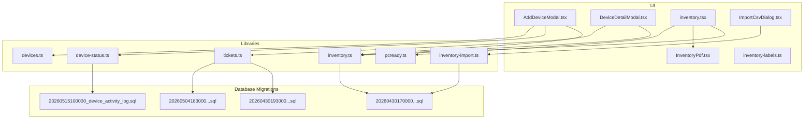
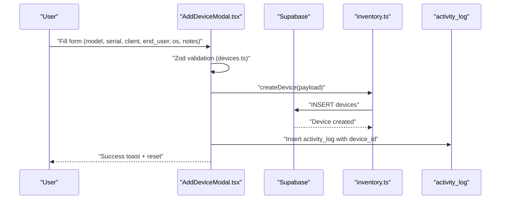
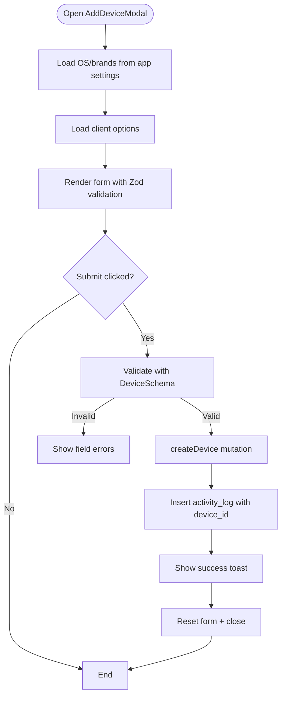
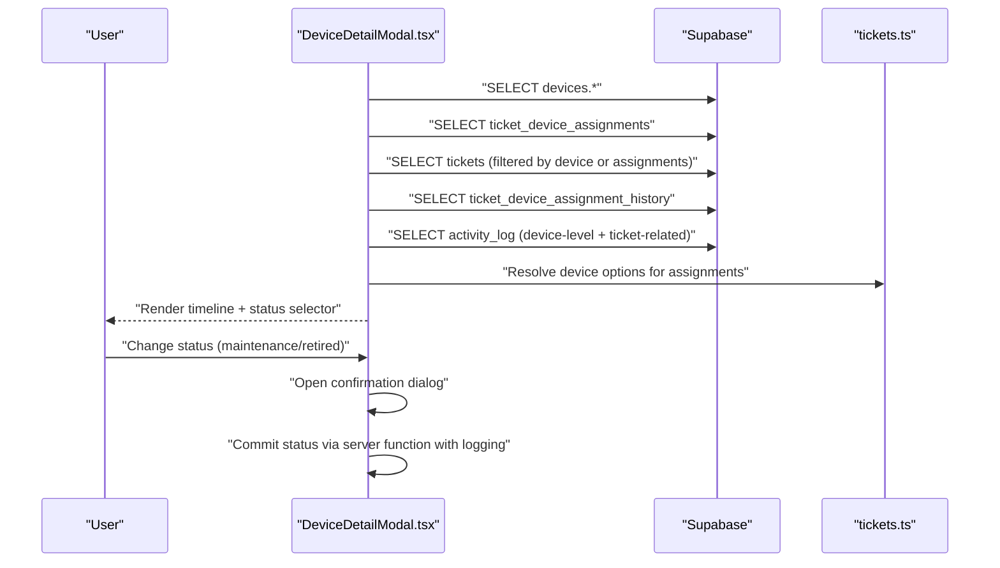
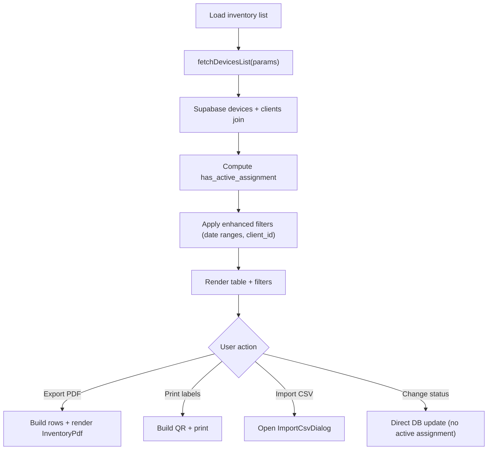
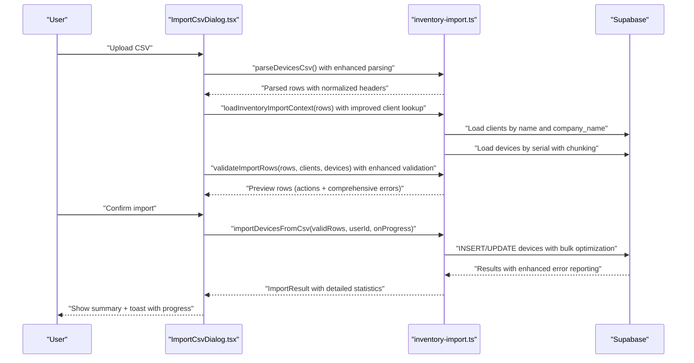
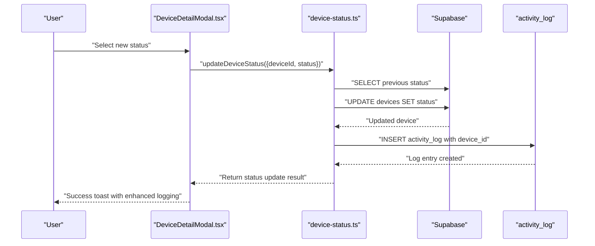
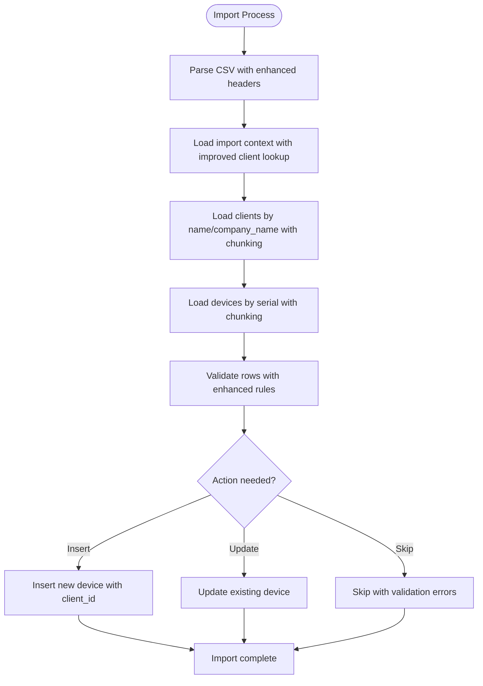
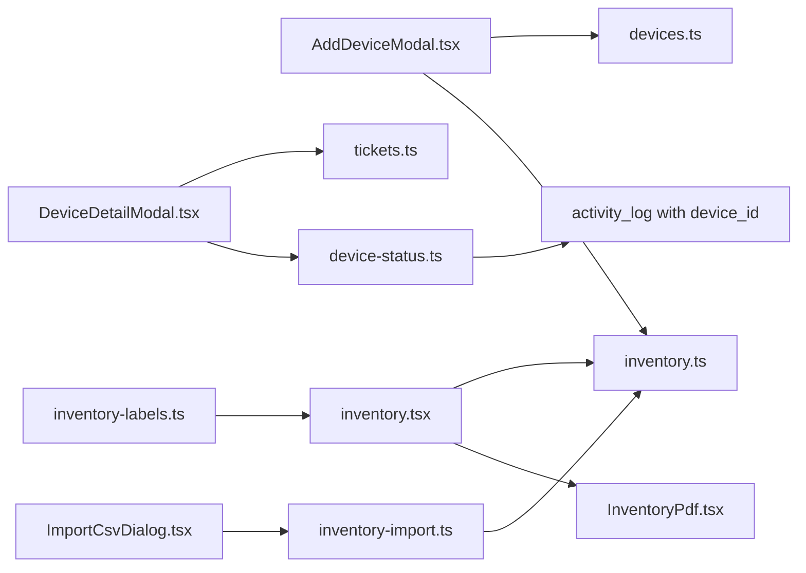

# Device Management System

<cite>
**Referenced Files in This Document**
- [AddDeviceModal.tsx](file://src/components/pcready/AddDeviceModal.tsx)
- [DeviceDetailModal.tsx](file://src/components/pcready/DeviceDetailModal.tsx)
- [inventory.tsx](file://src/routes/_app/inventory.tsx)
- [inventory-import.ts](file://src/lib/inventory-import.ts)
- [ImportCsvDialog.tsx](file://src/components/inventory/ImportCsvDialog.tsx)
- [inventory.ts](file://src/lib/queries/inventory.ts)
- [device-status.ts](file://src/lib/device-status.ts)
- [pcready.ts](file://src/lib/pcready.ts)
- [devices.ts](file://lib/schemas/devices.ts)
- [tickets.ts](file://src/lib/queries/tickets.ts)
- [InventoryPdf.tsx](file://src/components/pcready/pdf/InventoryPdf.tsx)
- [inventory-labels.ts](file://src/lib/inventory-labels.ts)
- [20260430170000_split_assets_clients_tickets.sql](file://supabase/migrations/20260430170000_split_assets_clients_tickets.sql)
- [20260430193000_asset_ticket_separation_history.sql](file://supabase/migrations/20260430193000_asset_ticket_separation_history.sql)
- [20260504183000_create_ticket_device_assignment_history.sql](file://supabase/migrations/20260504183000_create_ticket_device_assignment_history.sql)
- [20260515100000_device_activity_log.sql](file://supabase/migrations/20260515100000_device_activity_log.sql)
</cite>

## Update Summary
**Changes Made**
- Enhanced device status management with comprehensive logging to activity_log table
- Improved device-client association handling with better client lookup and validation
- Expanded device import/export capabilities with enhanced CSV processing and validation
- Added device-level activity tracking with device_id foreign key support
- Strengthened device status change notifications for maintenance/retired states

## Table of Contents
1. [Introduction](#introduction)
2. [Project Structure](#project-structure)
3. [Core Components](#core-components)
4. [Architecture Overview](#architecture-overview)
5. [Detailed Component Analysis](#detailed-component-analysis)
6. [Enhanced Device Status Management](#enhanced-device-status-management)
7. [Improved Device-Client Association Handling](#improved-device-client-association-handling)
8. [Expanded Import/Export Capabilities](#expanded-importexport-capabilities)
9. [Device Activity Logging](#device-activity-logging)
10. [Dependency Analysis](#dependency-analysis)
11. [Performance Considerations](#performance-considerations)
12. [Troubleshooting Guide](#troubleshooting-guide)
13. [Conclusion](#conclusion)

## Introduction
This document explains the device management system with a focus on inventory tracking, device lifecycle, client associations, and the relationship to tickets. The system has been enhanced with comprehensive device status management, improved device-client association handling, and expanded import/export capabilities. It covers how devices are added, queried, exported to PDF, imported via CSV, and viewed in detail, including status transitions and historical tracking with enhanced logging.

## Project Structure
The device management system spans UI components, server functions, database migrations, and PDF/label generation utilities. Key areas include enhanced status management with activity logging, improved client-device associations, and expanded CSV processing capabilities.

**Diagram sources**
- [AddDeviceModal.tsx:1-218](file://src/components/pcready/AddDeviceModal.tsx#L1-L218)
- [DeviceDetailModal.tsx:1-802](file://src/components/pcready/DeviceDetailModal.tsx#L1-L802)
- [inventory.tsx:1-580](file://src/routes/_app/inventory.tsx#L1-L580)
- [ImportCsvDialog.tsx:1-281](file://src/components/inventory/ImportCsvDialog.tsx#L1-L281)
- [InventoryPdf.tsx:1-93](file://src/components/pcready/pdf/InventoryPdf.tsx#L1-L93)
- [inventory.ts:1-128](file://src/lib/queries/inventory.ts#L1-L128)
- [inventory-import.ts:1-271](file://src/lib/inventory-import.ts#L1-L271)
- [device-status.ts:1-77](file://src/lib/device-status.ts#L1-L77)
- [pcready.ts:1-241](file://src/lib/pcready.ts#L1-L241)
- [devices.ts:1-15](file://lib/schemas/devices.ts#L1-L15)
- [tickets.ts:1-284](file://src/lib/queries/tickets.ts#L1-L284)
- [20260430170000_split_assets_clients_tickets.sql:1-137](file://supabase/migrations/20260430170000_split_assets_clients_tickets.sql#L1-L137)
- [20260430193000_asset_ticket_separation_history.sql:1-89](file://supabase/migrations/20260430193000_asset_ticket_separation_history.sql#L1-L89)
- [20260504183000_create_ticket_device_assignment_history.sql:1-74](file://supabase/migrations/20260504183000_create_ticket_device_assignment_history.sql#L1-L74)
- [20260515100000_device_activity_log.sql:1-27](file://supabase/migrations/20260515100000_device_activity_log.sql#L1-L27)

**Section sources**
- [AddDeviceModal.tsx:1-218](file://src/components/pcready/AddDeviceModal.tsx#L1-L218)
- [DeviceDetailModal.tsx:1-802](file://src/components/pcready/DeviceDetailModal.tsx#L1-L802)
- [inventory.tsx:1-580](file://src/routes/_app/inventory.tsx#L1-L580)
- [ImportCsvDialog.tsx:1-281](file://src/components/inventory/ImportCsvDialog.tsx#L1-L281)
- [InventoryPdf.tsx:1-93](file://src/components/pcready/pdf/InventoryPdf.tsx#L1-L93)
- [inventory.ts:1-128](file://src/lib/queries/inventory.ts#L1-L128)
- [inventory-import.ts:1-271](file://src/lib/inventory-import.ts#L1-L271)
- [device-status.ts:1-77](file://src/lib/device-status.ts#L1-L77)
- [pcready.ts:1-241](file://src/lib/pcready.ts#L1-L241)
- [devices.ts:1-15](file://lib/schemas/devices.ts#L1-L15)
- [tickets.ts:1-284](file://src/lib/queries/tickets.ts#L1-L284)
- [20260430170000_split_assets_clients_tickets.sql:1-137](file://supabase/migrations/20260430170000_split_assets_clients_tickets.sql#L1-L137)
- [20260430193000_asset_ticket_separation_history.sql:1-89](file://supabase/migrations/20260430193000_asset_ticket_separation_history.sql#L1-L89)
- [20260504183000_create_ticket_device_assignment_history.sql:1-74](file://supabase/migrations/20260504183000_create_ticket_device_assignment_history.sql#L1-L74)
- [20260515100000_device_activity_log.sql:1-27](file://supabase/migrations/20260515100000_device_activity_log.sql#L1-L27)

## Core Components
- AddDeviceModal: Collects model, serial, client association, end-user, OS, and notes; validates with Zod; persists via Supabase; logs activity with enhanced client validation.
- DeviceDetailModal: Loads device, assignments, tickets, history, and activity with comprehensive logging; renders timeline; supports status updates with confirmation for maintenance/retired.
- Inventory listing: Filters by status/OS/text; supports scanning, QR, labels, CSV import, and PDF export with enhanced filtering options.
- CSV import: Parses, validates, previews, and bulk imports devices with improved client lookup and duplicate detection; enforces unique serials and client existence.
- PDF export: Generates branded inventory PDF with counts and table including enhanced status visualization.
- Device status server function: Updates device status with comprehensive logging to activity_log and optional admin notifications.
- Client/device/ticket relations: Migrations define devices, clients, and ticket-device assignment/history tables with enhanced device activity tracking.

**Section sources**
- [AddDeviceModal.tsx:27-118](file://src/components/pcready/AddDeviceModal.tsx#L27-L118)
- [DeviceDetailModal.tsx:118-335](file://src/components/pcready/DeviceDetailModal.tsx#L118-L335)
- [inventory.tsx:63-275](file://src/routes/_app/inventory.tsx#L63-L275)
- [inventory-import.ts:49-180](file://src/lib/inventory-import.ts#L49-L180)
- [InventoryPdf.tsx:26-84](file://src/components/pcready/pdf/InventoryPdf.tsx#L26-L84)
- [device-status.ts:15-76](file://src/lib/device-status.ts#L15-L76)
- [20260430170000_split_assets_clients_tickets.sql:28-44](file://supabase/migrations/20260430170000_split_assets_clients_tickets.sql#L28-L44)
- [20260430193000_asset_ticket_separation_history.sql:4-18](file://supabase/migrations/20260430193000_asset_ticket_separation_history.sql#L4-L18)
- [20260504183000_create_ticket_device_assignment_history.sql:4-22](file://supabase/migrations/20260504183000_create_ticket_device_assignment_history.sql#L4-L22)

## Architecture Overview
The system integrates UI components with server functions and Supabase. Device creation and updates flow through typed forms and Zod validation, persisted via Supabase queries. Enhanced status changes are now logged to the activity_log table with device-level tracking. Ticket-device relationships are tracked via assignment tables and a persistent history table with comprehensive audit capabilities.

**Diagram sources**
- [AddDeviceModal.tsx:78-118](file://src/components/pcready/AddDeviceModal.tsx#L78-L118)
- [devices.ts:5-12](file://lib/schemas/devices.ts#L5-L12)
- [inventory.ts:82-89](file://src/lib/queries/inventory.ts#L82-L89)

**Section sources**
- [AddDeviceModal.tsx:27-118](file://src/components/pcready/AddDeviceModal.tsx#L27-L118)
- [devices.ts:5-12](file://lib/schemas/devices.ts#L5-L12)
- [inventory.ts:82-89](file://src/lib/queries/inventory.ts#L82-L89)

## Detailed Component Analysis

### AddDeviceModal: Data Collection and Persistence
- Fields collected: brand, model, serial, client_id, end_user, os, notes.
- Validation: Zod schema ensures required fields and enum-like OS selection.
- Client options: loaded dynamically via tickets query helper with enhanced client validation.
- Persistence: mutation to create device; on success, activity log entry is inserted with device_id; UI resets and closes.
- Configuration: OS options and brands sourced from app settings; falls back to defaults if unavailable.

**Diagram sources**
- [AddDeviceModal.tsx:27-118](file://src/components/pcready/AddDeviceModal.tsx#L27-L118)
- [devices.ts:5-12](file://lib/schemas/devices.ts#L5-L12)
- [tickets.ts:5-13](file://src/lib/queries/tickets.ts#L5-L13)
- [inventory.ts:82-89](file://src/lib/queries/inventory.ts#L82-L89)

**Section sources**
- [AddDeviceModal.tsx:27-118](file://src/components/pcready/AddDeviceModal.tsx#L27-L118)
- [devices.ts:5-12](file://lib/schemas/devices.ts#L5-L12)
- [tickets.ts:5-13](file://src/lib/queries/tickets.ts#L5-L13)
- [inventory.ts:82-89](file://src/lib/queries/inventory.ts#L82-L89)

### DeviceDetailModal: Lifecycle Tracking and Timeline
- Loads device, assignments, tickets, history, and activity with comprehensive logging including device-level activity.
- Builds a unified timeline combining:
  - Device creation snapshot
  - Status/meta changes with detailed logging
  - Assignment actions (assigned/unassigned/replaced/deleted)
  - Ticket activity and notes
- Supports status change with confirmation for maintenance/retired states.
- Resolves actor names from profiles for attribution with enhanced device activity tracking.

**Diagram sources**
- [DeviceDetailModal.tsx:149-285](file://src/components/pcready/DeviceDetailModal.tsx#L149-L285)
- [DeviceDetailModal.tsx:315-346](file://src/components/pcready/DeviceDetailModal.tsx#L315-L346)
- [tickets.ts:114-136](file://src/lib/queries/tickets.ts#L114-L136)

**Section sources**
- [DeviceDetailModal.tsx:118-335](file://src/components/pcready/DeviceDetailModal.tsx#L118-L335)
- [DeviceDetailModal.tsx:601-727](file://src/components/pcready/DeviceDetailModal.tsx#L601-L727)
- [tickets.ts:114-136](file://src/lib/queries/tickets.ts#L114-L136)

### Inventory Listing: Queries, Filters, and Export
- Fetches devices with counts, supports pagination, and marks active assignments.
- Filters: status, OS, free-text search across serial/model/user, updated date ranges, and client-specific filtering.
- Optional filter excludes devices with active assignments.
- Exports PDF via React PDF renderer; builds rows from current page data with enhanced status visualization.
- Bulk operations: selected rows, QR labels, CSV import dialog with improved validation.

**Diagram sources**
- [inventory.tsx:86-94](file://src/routes/_app/inventory.tsx#L86-L94)
- [inventory.tsx:242-275](file://src/routes/_app/inventory.tsx#L242-L275)
- [inventory.ts:22-54](file://src/lib/queries/inventory.ts#L22-L54)
- [InventoryPdf.tsx:26-84](file://src/components/pcready/pdf/InventoryPdf.tsx#L26-L84)

**Section sources**
- [inventory.tsx:63-275](file://src/routes/_app/inventory.tsx#L63-L275)
- [inventory.ts:22-54](file://src/lib/queries/inventory.ts#L22-L54)
- [InventoryPdf.tsx:26-84](file://src/components/pcready/pdf/InventoryPdf.tsx#L26-L84)

### CSV Import/Export Pipeline
- Import:
  - Parse CSV into typed rows with enhanced header normalization.
  - Load clients and existing devices by name/serial with improved lookup algorithms.
  - Validate rows (required fields, valid status, unique serials, client lookup with company_name support).
  - Preview actions (insert/update/skip) and errors with comprehensive validation feedback.
  - Execute batched inserts/updates with progress reporting and enhanced error handling.
- Export:
  - CSV template included for download with all required headers.
  - Inventory page exports current page to PDF with enhanced formatting.

**Diagram sources**
- [ImportCsvDialog.tsx:52-95](file://src/components/inventory/ImportCsvDialog.tsx#L52-L95)
- [inventory-import.ts:49-180](file://src/lib/inventory-import.ts#L49-L180)
- [inventory-import.ts:198-226](file://src/lib/inventory-import.ts#L198-L226)

**Section sources**
- [ImportCsvDialog.tsx:23-95](file://src/components/inventory/ImportCsvDialog.tsx#L23-L95)
- [inventory-import.ts:49-180](file://src/lib/inventory-import.ts#L49-L180)

## Enhanced Device Status Management
The device status management system has been significantly enhanced with comprehensive logging capabilities:

- **Comprehensive Logging**: All device status changes are now logged to the activity_log table with device_id foreign key support.
- **Bidirectional Status Labels**: Enhanced translation between internal status codes and user-friendly labels.
- **Conditional Notifications**: Automatic admin notifications for maintenance and retired status transitions.
- **Audit Trail**: Complete history of status changes with timestamps and actor identification.
- **Enhanced Validation**: Improved status change validation with proper previous status tracking.

**Diagram sources**
- [DeviceDetailModal.tsx:315-346](file://src/components/pcready/DeviceDetailModal.tsx#L315-L346)
- [device-status.ts:15-76](file://src/lib/device-status.ts#L15-L76)

**Section sources**
- [DeviceDetailModal.tsx:315-346](file://src/components/pcready/DeviceDetailModal.tsx#L315-L346)
- [device-status.ts:15-76](file://src/lib/device-status.ts#L15-L76)

## Improved Device-Client Association Handling
Device-client association handling has been enhanced with:

- **Enhanced Client Lookup**: Improved client resolution supporting both name and company_name fields.
- **Duplicate Detection**: Better handling of duplicate serial numbers during import with comprehensive validation.
- **Client Validation**: Enhanced client existence checking with improved error messages.
- **Batch Processing**: Optimized client and device loading with chunked requests for better performance.
- **Unique Constraints**: Database-level unique constraints on serial numbers with proper indexing.

**Diagram sources**
- [inventory-import.ts:72-84](file://src/lib/inventory-import.ts#L72-L84)
- [inventory-import.ts:198-226](file://src/lib/inventory-import.ts#L198-L226)

**Section sources**
- [inventory-import.ts:72-84](file://src/lib/inventory-import.ts#L72-L84)
- [inventory-import.ts:198-226](file://src/lib/inventory-import.ts#L198-L226)

## Expanded Import/Export Capabilities
The import/export system has been significantly expanded:

- **Enhanced CSV Parsing**: Improved CSV parsing with better header normalization and field extraction.
- **Comprehensive Validation**: Expanded validation rules including duplicate detection, client lookup, and status validation.
- **Progress Tracking**: Enhanced progress reporting for large import operations.
- **Error Reporting**: Detailed error reporting with row-specific information.
- **Template Generation**: Improved CSV template generation with all required headers.
- **Bulk Operations**: Optimized bulk insert/update operations with better performance characteristics.

**Section sources**
- [inventory-import.ts:49-180](file://src/lib/inventory-import.ts#L49-L180)
- [ImportCsvDialog.tsx:52-95](file://src/components/inventory/ImportCsvDialog.tsx#L52-L95)

## Device Activity Logging
A new comprehensive device activity logging system has been implemented:

- **Device-Level Logging**: New device_id column in activity_log table enables device-specific activity tracking.
- **Enhanced Queries**: Indexes on device_id for efficient device activity queries.
- **RLS Policies**: Proper Row Level Security policies for device activity access control.
- **Comprehensive Tracking**: All device-related activities now logged with device context.
- **Integration**: Seamless integration with existing activity log infrastructure.

**Section sources**
- [20260515100000_device_activity_log.sql:1-27](file://supabase/migrations/20260515100000_device_activity_log.sql#L1-L27)
- [device-status.ts:53-61](file://src/lib/device-status.ts#L53-L61)

## Dependency Analysis
- Forms depend on Zod schemas for validation with enhanced client validation.
- Modals depend on Supabase queries and server functions with comprehensive logging.
- Inventory page orchestrates multiple data sources with enhanced filtering capabilities.
- CSV import depends on parsing utilities and batched Supabase writes with improved performance.
- PDF generation depends on inventory rows and theming utilities with enhanced formatting.
- Device status updates now integrate with comprehensive activity logging infrastructure.

**Diagram sources**
- [AddDeviceModal.tsx:5-11](file://src/components/pcready/AddDeviceModal.tsx#L5-L11)
- [devices.ts:1-15](file://lib/schemas/devices.ts#L1-L15)
- [inventory.ts:1-128](file://src/lib/queries/inventory.ts#L1-L128)
- [DeviceDetailModal.tsx:1-17](file://src/components/pcready/DeviceDetailModal.tsx#L1-L17)
- [tickets.ts:1-284](file://src/lib/queries/tickets.ts#L1-L284)
- [device-status.ts:1-77](file://src/lib/device-status.ts#L1-L77)
- [inventory.tsx:1-580](file://src/routes/_app/inventory.tsx#L1-L580)
- [InventoryPdf.tsx:1-93](file://src/components/pcready/pdf/InventoryPdf.tsx#L1-L93)
- [ImportCsvDialog.tsx:1-281](file://src/components/inventory/ImportCsvDialog.tsx#L1-L281)
- [inventory-import.ts:1-271](file://src/lib/inventory-import.ts#L1-L271)
- [inventory-labels.ts:1-72](file://src/lib/inventory-labels.ts#L1-L72)

**Section sources**
- [AddDeviceModal.tsx:5-11](file://src/components/pcready/AddDeviceModal.tsx#L5-L11)
- [devices.ts:1-15](file://lib/schemas/devices.ts#L1-L15)
- [inventory.ts:1-128](file://src/lib/queries/inventory.ts#L1-L128)
- [DeviceDetailModal.tsx:1-17](file://src/components/pcready/DeviceDetailModal.tsx#L1-L17)
- [tickets.ts:1-284](file://src/lib/queries/tickets.ts#L1-L284)
- [device-status.ts:1-77](file://src/lib/device-status.ts#L1-L77)
- [inventory.tsx:1-580](file://src/routes/_app/inventory.tsx#L1-L580)
- [InventoryPdf.tsx:1-93](file://src/components/pcready/pdf/InventoryPdf.tsx#L1-L93)
- [ImportCsvDialog.tsx:1-281](file://src/components/inventory/ImportCsvDialog.tsx#L1-L281)
- [inventory-import.ts:1-271](file://src/lib/inventory-import.ts#L1-L271)
- [inventory-labels.ts:1-72](file://src/lib/inventory-labels.ts#L1-L72)

## Performance Considerations
- Pagination: Inventory lists use range-based pagination to limit rows per page.
- Filtering: Text search uses ILIKE with OR combinations; ensure indexes exist on frequently filtered columns (serial, model, assigned_to, os, status).
- Batch operations:
  - CSV import validates in-memory and batches inserts/updates with chunked client and device loading; consider chunking for very large imports.
  - Bulk device creation helper exists for internal use with optimized performance.
- Real-time updates: Using React Query invalidations after mutations helps keep views consistent without excessive polling.
- PDF generation: Rendering large PDFs can be memory-intensive; consider generating only visible page data and avoiding unnecessary re-renders.
- Database optimization: New indexes on activity_log device_id improve query performance for device-specific activity tracking.
- Enhanced caching: Improved client and device lookup caching reduces database load during imports.

## Troubleshooting Guide
Common issues and resolutions:
- Duplicate serial numbers:
  - CSV validation detects duplicates and marks rows as skip with enhanced error messages; ensure unique serials per file.
  - Database unique index prevents duplicates at persistence time with proper error handling.
- Device assignment conflicts:
  - Inventory status change is blocked when an active assignment exists; change status from the ticket flow instead.
- Inventory reconciliation:
  - Use CSV import to reconcile missing or outdated entries; leverage enhanced preview to review actions and comprehensive errors.
- Permissions:
  - Device status updates require appropriate roles; server function validates access token and roles with enhanced logging.
- CSV parsing:
  - Ensure headers match expected CSV headers; template is available for download with all required fields.
- Device activity logging:
  - New device_id column requires proper indexing; verify database migration completion for optimal performance.
- Client lookup failures:
  - Enhanced client lookup now supports company_name field; verify client data includes both name and company_name for best results.

**Section sources**
- [inventory-import.ts:110-125](file://src/lib/inventory-import.ts#L110-L125)
- [20260430170000_split_assets_clients_tickets.sql:42-44](file://supabase/migrations/20260430170000_split_assets_clients_tickets.sql#L42-L44)
- [inventory.tsx:242-275](file://src/routes/_app/inventory.tsx#L242-L275)
- [device-status.ts:19-27](file://src/lib/device-status.ts#L19-L27)
- [ImportCsvDialog.tsx:72-74](file://src/components/inventory/ImportCsvDialog.tsx#L72-L74)
- [20260515100000_device_activity_log.sql:8-10](file://supabase/migrations/20260515100000_device_activity_log.sql#L8-L10)

## Conclusion
The device management system provides a robust foundation for inventory tracking, client-device association, and ticket-device linkage with comprehensive history and enhanced capabilities. The recent enhancements include comprehensive device status management with detailed logging, improved device-client association handling with better validation, and expanded import/export capabilities with enhanced performance. Administrators benefit from server-side status enforcement, notifications, and comprehensive audit trails, while inventory managers can efficiently add, search, export, and import device data with enhanced validation and error reporting. The architecture supports scalability through pagination, batch operations, clear separation of concerns across UI, server functions, and database schemas, along with new device activity logging capabilities.