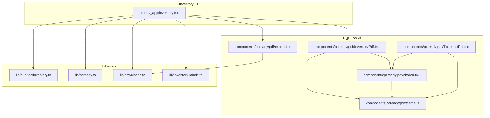
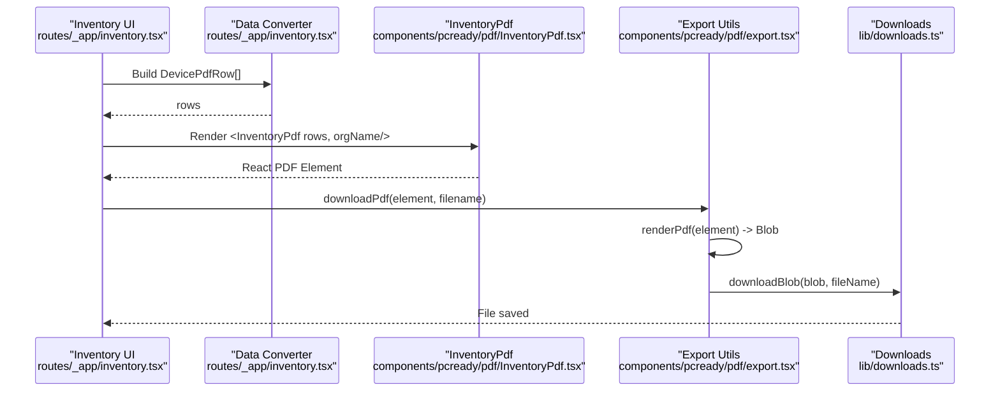
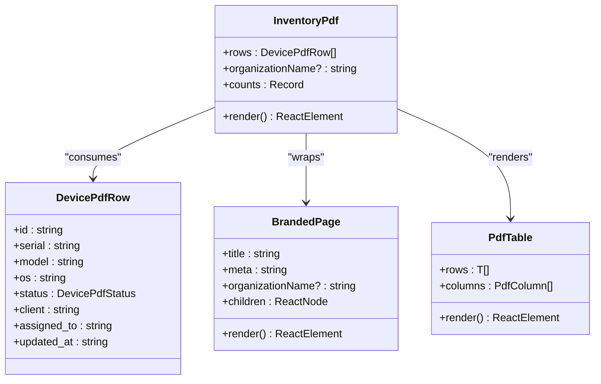
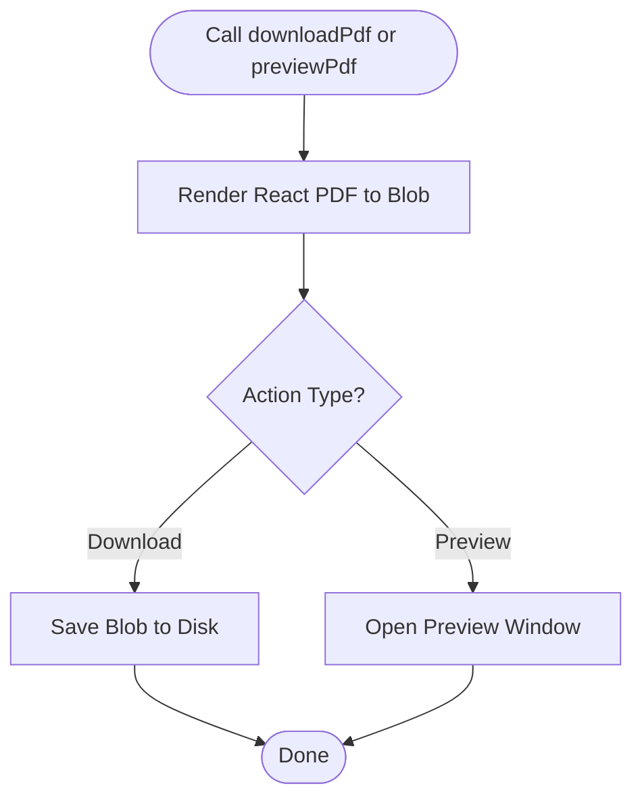
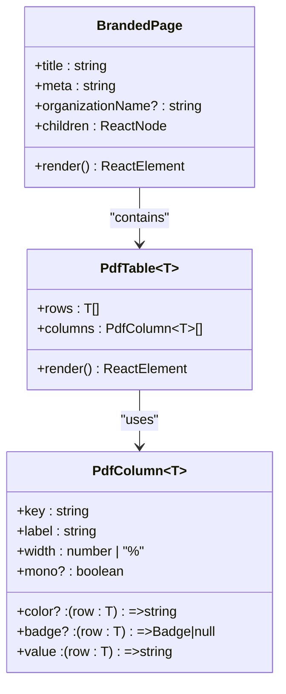
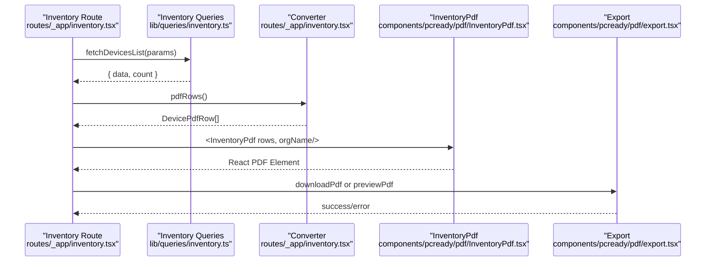
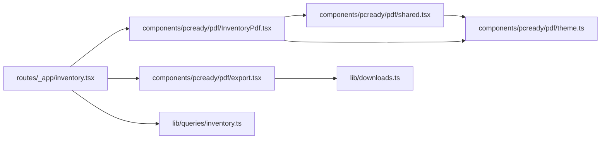

# Device PDF Generation

<cite>
**Referenced Files in This Document**
- [InventoryPdf.tsx](file://src/components/pcready/pdf/InventoryPdf.tsx)
- [export.tsx](file://src/components/pcready/pdf/export.tsx)
- [shared.tsx](file://src/components/pcready/pdf/shared.tsx)
- [theme.ts](file://src/components/pcready/pdf/theme.ts)
- [inventory.tsx](file://src/routes/_app/inventory.tsx)
- [inventory.ts](file://src/lib/queries/inventory.ts)
- [pcready.ts](file://src/lib/pcready.ts)
- [downloads.ts](file://src/lib/downloads.ts)
- [TicketListPdf.tsx](file://src/components/pcready/pdf/TicketListPdf.tsx)
- [inventory-labels.ts](file://src/lib/inventory-labels.ts)
</cite>

## Table of Contents
1. [Introduction](#introduction)
2. [Project Structure](#project-structure)
3. [Core Components](#core-components)
4. [Architecture Overview](#architecture-overview)
5. [Detailed Component Analysis](#detailed-component-analysis)
6. [Dependency Analysis](#dependency-analysis)
7. [Performance Considerations](#performance-considerations)
8. [Troubleshooting Guide](#troubleshooting-guide)
9. [Conclusion](#conclusion)

## Introduction
This document explains the device PDF generation system used to produce printable device inventory reports. It covers the InventoryPdf React component, the export pipeline, shared styling utilities, supported report formats, data filtering options, customization capabilities, and integration with the inventory system. It also provides examples of PDF generation workflows, template customization, batch processing, and performance considerations for large datasets.

## Project Structure
The PDF generation feature is organized under the pcready PDF toolkit with dedicated modules for inventory reporting, exports, shared components, and theming.

**Diagram sources**
- [inventory.tsx:15-16](file://src/routes/_app/inventory.tsx#L15-L16)
- [InventoryPdf.tsx:1-4](file://src/components/pcready/pdf/InventoryPdf.tsx#L1-L4)
- [shared.tsx:1-3](file://src/components/pcready/pdf/shared.tsx#L1-L3)
- [theme.ts:1-30](file://src/components/pcready/pdf/theme.ts#L1-L30)
- [export.tsx:1-3](file://src/components/pcready/pdf/export.tsx#L1-L3)
- [TicketListPdf.tsx:1-12](file://src/components/pcready/pdf/TicketListPdf.tsx#L1-L12)
- [inventory.ts:1-128](file://src/lib/queries/inventory.ts#L1-L128)
- [pcready.ts:52-64](file://src/lib/pcready.ts#L52-L64)
- [downloads.ts:1-190](file://src/lib/downloads.ts#L1-L190)
- [inventory-labels.ts:1-72](file://src/lib/inventory-labels.ts#L1-L72)

**Section sources**
- [inventory.tsx:1-580](file://src/routes/_app/inventory.tsx#L1-L580)
- [InventoryPdf.tsx:1-93](file://src/components/pcready/pdf/InventoryPdf.tsx#L1-L93)
- [shared.tsx:1-612](file://src/components/pcready/pdf/shared.tsx#L1-L612)
- [theme.ts:1-30](file://src/components/pcready/pdf/theme.ts#L1-L30)
- [export.tsx:1-18](file://src/components/pcready/pdf/export.tsx#L1-L18)
- [TicketListPdf.tsx:1-125](file://src/components/pcready/pdf/TicketListPdf.tsx#L1-L125)
- [inventory.ts:1-128](file://src/lib/queries/inventory.ts#L1-L128)
- [pcready.ts:52-64](file://src/lib/pcready.ts#L52-L64)
- [downloads.ts:1-190](file://src/lib/downloads.ts#L1-L190)
- [inventory-labels.ts:1-72](file://src/lib/inventory-labels.ts#L1-L72)

## Core Components
- InventoryPdf: Generates a branded PDF document containing summary statistics and a tabular device inventory.
- Export utilities: Provide download and preview actions for generated PDFs.
- Shared components and styles: Reusable building blocks for PDF pages, sections, tables, and charts.
- Theme: Centralized color palette and fonts for consistent visual identity.
- Inventory route integration: Transforms backend inventory data into the PDF row format and triggers generation.

Supported report formats:
- Device inventory PDF (landscape A4) with device details and status breakdown.
- Additional PDF templates exist for other domains (e.g., tickets), demonstrating the same toolkit pattern.

Data filtering options:
- Status filter (available, assigned, maintenance, retired).
- Operating system filter (predefined options).
- Search by serial, model, or assigned user.
- Optional filter excluding devices with active ticket assignments.

Customization capabilities:
- Organization branding and metadata.
- Column definitions with custom widths, monospaced cells, badges, and dynamic colors.
- Page header/footer, section titles, and meta chips.
- Color palette and fonts can be adjusted centrally.

**Section sources**
- [InventoryPdf.tsx:26-85](file://src/components/pcready/pdf/InventoryPdf.tsx#L26-L85)
- [export.tsx:5-17](file://src/components/pcready/pdf/export.tsx#L5-L17)
- [shared.tsx:12-20](file://src/components/pcready/pdf/shared.tsx#L12-L20)
- [shared.tsx:308-355](file://src/components/pcready/pdf/shared.tsx#L308-L355)
- [theme.ts:1-30](file://src/components/pcready/pdf/theme.ts#L1-L30)
- [inventory.tsx:86-94](file://src/routes/_app/inventory.tsx#L86-L94)
- [TicketListPdf.tsx:27-96](file://src/components/pcready/pdf/TicketListPdf.tsx#L27-L96)

## Architecture Overview
The PDF generation pipeline transforms inventory data into a React PDF document, renders it to a Blob, and either downloads it or opens a preview.

**Diagram sources**
- [inventory.tsx:129-140](file://src/routes/_app/inventory.tsx#L129-L140)
- [InventoryPdf.tsx:26-85](file://src/components/pcready/pdf/InventoryPdf.tsx#L26-L85)
- [export.tsx:5-17](file://src/components/pcready/pdf/export.tsx#L5-L17)
- [downloads.ts:21-42](file://src/lib/downloads.ts#L21-L42)

## Detailed Component Analysis

### InventoryPdf Component
Responsibilities:
- Computes status counts for summary statistics.
- Defines column layout and rendering logic for the device table.
- Uses shared components for page framing, sections, and tables.
- Applies status-specific colors and soft background colors for badges.

Key behaviors:
- Columns include ID, model, serial, OS, status (with badge), client, assigned user, and last update date.
- Status badges reflect semantic meaning with distinct colors and soft backgrounds.
- Page metadata displays total device count and organization branding.

**Diagram sources**
- [InventoryPdf.tsx:8-17](file://src/components/pcready/pdf/InventoryPdf.tsx#L8-L17)
- [InventoryPdf.tsx:26-85](file://src/components/pcready/pdf/InventoryPdf.tsx#L26-L85)
- [shared.tsx:308-355](file://src/components/pcready/pdf/shared.tsx#L308-L355)
- [shared.tsx:560-588](file://src/components/pcready/pdf/shared.tsx#L560-L588)

**Section sources**
- [InventoryPdf.tsx:26-85](file://src/components/pcready/pdf/InventoryPdf.tsx#L26-L85)

### Export Utilities
Responsibilities:
- Convert a React PDF element into a Blob.
- Provide download and preview functions with appropriate revocation policies.

Processing logic:
- renderPdf uses the PDF renderer to produce a Blob.
- downloadPdf saves the Blob to disk with a generated filename.
- previewPdf opens a browser preview window with a time-limited URL.

**Diagram sources**
- [export.tsx:5-17](file://src/components/pcready/pdf/export.tsx#L5-L17)
- [downloads.ts:21-42](file://src/lib/downloads.ts#L21-L42)

**Section sources**
- [export.tsx:1-18](file://src/components/pcready/pdf/export.tsx#L1-L18)
- [downloads.ts:21-42](file://src/lib/downloads.ts#L21-L42)

### Shared Components and Styling
Responsibilities:
- Provide reusable PDF building blocks: branded page, sections, tables, charts, and stat strips.
- Define consistent typography, spacing, and color tokens.

Key elements:
- PdfColumn interface enables flexible column definitions with width, monospace, color, and badge rendering.
- BrandedPage sets up header, footer, and page metadata.
- PdfTable renders structured rows with alternating background colors and fixed headers.
- Charts and legends demonstrate advanced layouts for statistical summaries.

**Diagram sources**
- [shared.tsx:12-20](file://src/components/pcready/pdf/shared.tsx#L12-L20)
- [shared.tsx:308-355](file://src/components/pcready/pdf/shared.tsx#L308-L355)
- [shared.tsx:560-588](file://src/components/pcready/pdf/shared.tsx#L560-L588)

**Section sources**
- [shared.tsx:12-20](file://src/components/pcready/pdf/shared.tsx#L12-L20)
- [shared.tsx:308-355](file://src/components/pcready/pdf/shared.tsx#L308-L355)
- [shared.tsx:560-588](file://src/components/pcready/pdf/shared.tsx#L560-L588)
- [theme.ts:1-30](file://src/components/pcready/pdf/theme.ts#L1-L30)

### Integration with Inventory System
The inventory route orchestrates data fetching, filtering, and PDF generation:
- Filters: status, OS, free-text search, and optional exclusion of devices with active ticket assignments.
- Pagination: controlled by page and page size parameters.
- Data transformation: converts backend rows to DevicePdfRow for the PDF component.
- Organization branding: pulls organization name from app settings for PDF metadata.

**Diagram sources**
- [inventory.tsx:86-94](file://src/routes/_app/inventory.tsx#L86-L94)
- [inventory.ts:22-54](file://src/lib/queries/inventory.ts#L22-L54)
- [inventory.tsx:129-140](file://src/routes/_app/inventory.tsx#L129-L140)
- [InventoryPdf.tsx:26-85](file://src/components/pcready/pdf/InventoryPdf.tsx#L26-L85)
- [export.tsx:5-17](file://src/components/pcready/pdf/export.tsx#L5-L17)

**Section sources**
- [inventory.tsx:86-94](file://src/routes/_app/inventory.tsx#L86-L94)
- [inventory.ts:22-54](file://src/lib/queries/inventory.ts#L22-L54)
- [inventory.tsx:129-140](file://src/routes/_app/inventory.tsx#L129-L140)
- [pcready.ts:52-64](file://src/lib/pcready.ts#L52-L64)

### Template Customization Examples
- Adding/removing columns: Extend PdfColumn definitions in InventoryPdf to include or exclude fields.
- Badge customization: Use the badge property to render status or priority indicators with custom labels and colors.
- Dynamic colors: Apply conditional color mapping based on row values for emphasis.
- Page branding: Adjust organization name and meta information passed to BrandedPage.
- Table layout: Modify column widths and monospace formatting for readability.

These capabilities are demonstrated by the existing InventoryPdf and shared components.

**Section sources**
- [InventoryPdf.tsx:43-62](file://src/components/pcready/pdf/InventoryPdf.tsx#L43-L62)
- [shared.tsx:590-607](file://src/components/pcready/pdf/shared.tsx#L590-L607)

### Batch Processing and Workflows
- Single-page generation: The current inventory route generates a single PDF with all filtered devices.
- Batch printing labels: Related label printing utilities exist for physical labels, but batch PDF generation is not implemented in the current codebase.
- Future enhancements: To support batch PDF generation, split large datasets into multiple pages or documents and iterate through pages while preserving consistent branding and headers.

**Section sources**
- [inventory.tsx:142-176](file://src/routes/_app/inventory.tsx#L142-L176)
- [inventory-labels.ts:14-24](file://src/lib/inventory-labels.ts#L14-L24)

## Dependency Analysis
The PDF toolkit exhibits clear separation of concerns:
- InventoryPdf depends on shared components and theme for rendering.
- Export utilities depend on downloads for persistence and previews.
- The inventory route depends on queries for data and converters for row transformation.

**Diagram sources**
- [inventory.tsx:15-16](file://src/routes/_app/inventory.tsx#L15-L16)
- [InventoryPdf.tsx:1-4](file://src/components/pcready/pdf/InventoryPdf.tsx#L1-L4)
- [shared.tsx:1-3](file://src/components/pcready/pdf/shared.tsx#L1-L3)
- [theme.ts:1-30](file://src/components/pcready/pdf/theme.ts#L1-L30)
- [export.tsx:1-3](file://src/components/pcready/pdf/export.tsx#L1-L3)
- [downloads.ts:1-12](file://src/lib/downloads.ts#L1-L12)
- [inventory.ts:1-128](file://src/lib/queries/inventory.ts#L1-L128)

**Section sources**
- [inventory.tsx:15-16](file://src/routes/_app/inventory.tsx#L15-L16)
- [InventoryPdf.tsx:1-4](file://src/components/pcready/pdf/InventoryPdf.tsx#L1-L4)
- [shared.tsx:1-3](file://src/components/pcready/pdf/shared.tsx#L1-L3)
- [theme.ts:1-30](file://src/components/pcready/pdf/theme.ts#L1-L30)
- [export.tsx:1-3](file://src/components/pcready/pdf/export.tsx#L1-L3)
- [downloads.ts:1-12](file://src/lib/downloads.ts#L1-L12)
- [inventory.ts:1-128](file://src/lib/queries/inventory.ts#L1-L128)

## Performance Considerations
- Rendering cost: Large datasets increase PDF rendering time and memory usage. Consider paginating or limiting rows per page.
- Blob lifecycle: Downloads utility revokes object URLs after use to prevent memory leaks; ensure long-lived previews are handled with appropriate delays.
- Image assets: If QR codes or images are added, pre-generate and reuse assets to reduce repeated computations.
- UI responsiveness: Disable controls during PDF generation to prevent concurrent heavy operations.

[No sources needed since this section provides general guidance]

## Troubleshooting Guide
Common issues and resolutions:
- Empty dataset: Export functions guard against empty data and show user feedback.
- Access token failures: App settings retrieval is wrapped in error handling; fallbacks ensure generation proceeds with defaults.
- Popup blockers: Preview relies on opening a new window; ensure popups are enabled for preview to work.
- Memory pressure: For very large exports, consider reducing page size or splitting into smaller batches.

**Section sources**
- [inventory.tsx:142-176](file://src/routes/_app/inventory.tsx#L142-L176)
- [downloads.ts:38-42](file://src/lib/downloads.ts#L38-L42)

## Conclusion
The device PDF generation system provides a robust, reusable toolkit for producing branded, formatted inventory reports. It integrates tightly with the inventory route, supports filtering and customization, and leverages shared components for consistent styling. With careful attention to performance and memory management, it can scale to larger datasets and serve as a foundation for additional PDF templates.