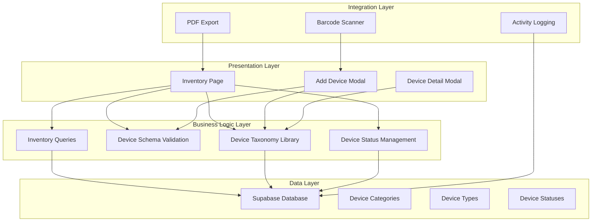
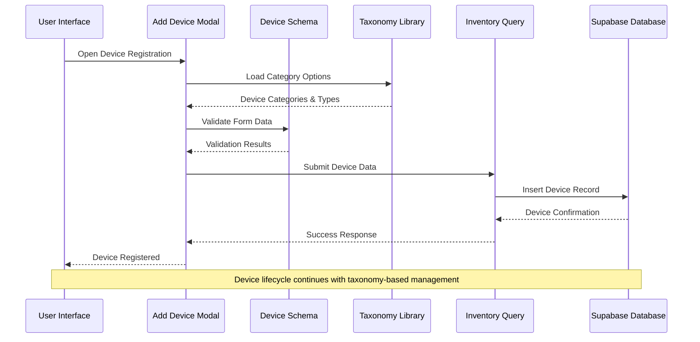
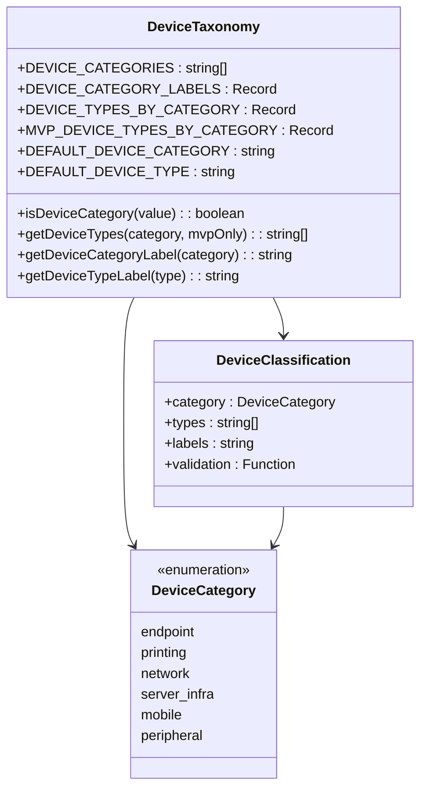
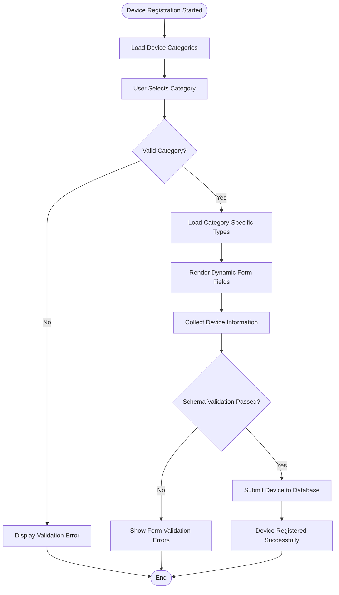
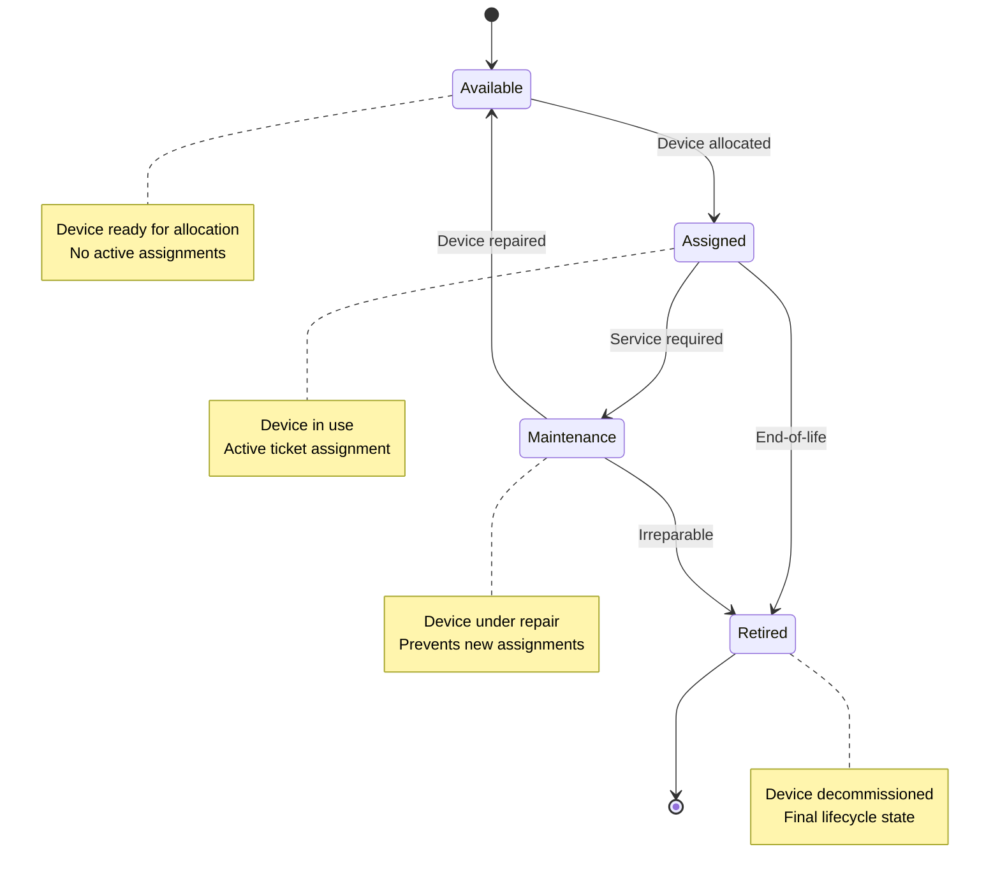
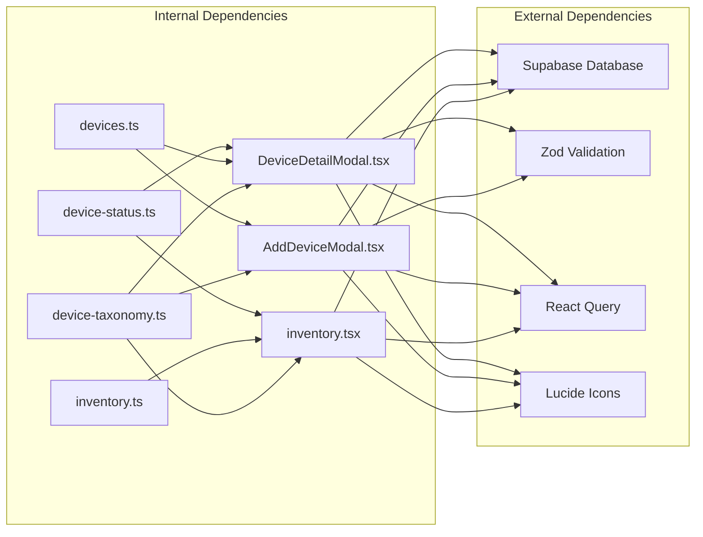

# Device Taxonomy System

<cite>
**Referenced Files in This Document**
- [device-taxonomy.ts](file://src/lib/device-taxonomy.ts)
- [devices.ts](file://lib/schemas/devices.ts)
- [inventory.tsx](file://src/routes/_app/inventory.tsx)
- [AddDeviceModal.tsx](file://src/components/pcready/AddDeviceModal.tsx)
- [DeviceDetailModal.tsx](file://src/components/pcready/DeviceDetailModal.tsx)
- [inventory.ts](file://src/lib/queries/inventory.ts)
- [device-status.ts](file://src/lib/device-status.ts)
- [20260521120000_device_warranty_fields.sql](file://supabase/migrations/20260521120000_device_warranty_fields.sql)
- [20260521130000_device_detail_tabs_fields.sql](file://supabase/migrations/20260521130000_device_detail_tabs_fields.sql)
- [20260515100000_device_activity_log.sql](file://supabase/migrations/20260515100000_device_activity_log.sql)
</cite>

## Table of Contents

1. [Introduction](#introduction)
2. [Project Structure](#project-structure)
3. [Core Components](#core-components)
4. [Architecture Overview](#architecture-overview)
5. [Detailed Component Analysis](#detailed-component-analysis)
6. [Dependency Analysis](#dependency-analysis)
7. [Performance Considerations](#performance-considerations)
8. [Troubleshooting Guide](#troubleshooting-guide)
9. [Conclusion](#conclusion)

## Introduction

The Device Taxonomy System is a comprehensive framework for categorizing, organizing, and managing IT assets within the PCReady platform. This system provides standardized classification of devices across six distinct categories, enabling efficient inventory management, reporting, and operational workflows. The system integrates seamlessly with the broader application ecosystem, supporting device lifecycle management from acquisition through retirement.

The taxonomy system serves as the foundation for device categorization, type selection, and status management, while also providing the structural basis for specialized device-specific features such as warranty tracking, maintenance scheduling, and hardware specification management.

## Project Structure

The Device Taxonomy System is distributed across multiple layers of the application architecture, ensuring modularity and maintainability:

**Diagram sources**

- [inventory.tsx:147-800](file://src/routes/_app/inventory.tsx#L147-L800)
- [AddDeviceModal.tsx:43-528](file://src/components/pcready/AddDeviceModal.tsx#L43-L528)
- [DeviceDetailModal.tsx:249-746](file://src/components/pcready/DeviceDetailModal.tsx#L249-L746)

**Section sources**

- [device-taxonomy.ts:1-57](file://src/lib/device-taxonomy.ts#L1-L57)
- [devices.ts:1-15](file://lib/schemas/devices.ts#L1-L15)
- [inventory.tsx:1-1532](file://src/routes/_app/inventory.tsx#L1-L1532)

## Core Components

### Device Taxonomy Library

The central taxonomy library defines the foundational classification system with six primary categories and their associated types. The system employs TypeScript's const assertions for compile-time safety and runtime validation.

**Device Categories:**

- **Endpoint**: Desktop computers, laptops, workstations, and mini PCs
- **Printing**: Printers, multifunction devices, and label printers
- **Network**: Routers, switches, firewalls, and access points
- **Server/Infrastructure**: Servers, NAS devices, UPS systems, and storage solutions
- **Mobile**: Smartphones and tablets
- **Peripheral**: Monitors, docks, scanners, and barcode readers

**Section sources**

- [device-taxonomy.ts:1-57](file://src/lib/device-taxonomy.ts#L1-L57)

### Device Schema Validation

The device schema enforces data integrity through Zod validation, ensuring consistent device registration and updates. The schema supports both internal asset tags and manufacturer serial numbers, with flexible client assignment and operating system specifications.

**Section sources**

- [devices.ts:1-15](file://lib/schemas/devices.ts#L1-L15)

### Inventory Management Interface

The inventory page provides comprehensive device management capabilities, including filtering, sorting, bulk operations, and real-time status updates. The interface integrates with the taxonomy system to enable category-based device discovery and management.

**Section sources**

- [inventory.tsx:147-800](file://src/routes/_app/inventory.tsx#L147-L800)

### Device Registration Workflow

The Add Device Modal implements a guided registration process that leverages the taxonomy system for category and type selection. The modal supports barcode scanning integration and dynamic field rendering based on device categories.

**Section sources**

- [AddDeviceModal.tsx:43-528](file://src/components/pcready/AddDeviceModal.tsx#L43-L528)

### Device Lifecycle Management

The Device Detail Modal provides comprehensive device information management, including warranty tracking, maintenance scheduling, and status transitions. The modal integrates with the taxonomy system to present category-appropriate fields and workflows.

**Section sources**

- [DeviceDetailModal.tsx:249-746](file://src/components/pcready/DeviceDetailModal.tsx#L249-L746)

## Architecture Overview

The Device Taxonomy System follows a layered architecture pattern that separates concerns while maintaining tight integration between components:

**Diagram sources**

- [AddDeviceModal.tsx:178-254](file://src/components/pcready/AddDeviceModal.tsx#L178-L254)
- [device-taxonomy.ts:42-56](file://src/lib/device-taxonomy.ts#L42-L56)
- [devices.ts:5-14](file://lib/schemas/devices.ts#L5-L14)

The architecture ensures that device taxonomy decisions drive the entire device management workflow, from initial registration through ongoing maintenance and eventual retirement.

## Detailed Component Analysis

### Device Classification Engine

The classification engine serves as the backbone of the taxonomy system, providing type-safe category definitions and intelligent type resolution based on category selection.

**Diagram sources**

- [device-taxonomy.ts:1-57](file://src/lib/device-taxonomy.ts#L1-L57)

**Section sources**

- [device-taxonomy.ts:1-57](file://src/lib/device-taxonomy.ts#L1-L57)

### Device Registration Pipeline

The registration pipeline demonstrates the integration between taxonomy selection and device creation, showcasing how category choices dynamically influence available options and validation requirements.

**Diagram sources**

- [AddDeviceModal.tsx:178-254](file://src/components/pcready/AddDeviceModal.tsx#L178-L254)
- [devices.ts:5-14](file://lib/schemas/devices.ts#L5-L14)

**Section sources**

- [AddDeviceModal.tsx:178-254](file://src/components/pcready/AddDeviceModal.tsx#L178-L254)
- [devices.ts:5-14](file://lib/schemas/devices.ts#L5-L14)

### Device Status Management

The status management system provides controlled transitions between device states (available, assigned, maintenance, retired) while maintaining audit trails and triggering appropriate notifications.

**Diagram sources**

- [device-status.ts:7-20](file://src/lib/device-status.ts#L7-L20)
- [inventory.tsx:367-400](file://src/routes/_app/inventory.tsx#L367-L400)

**Section sources**

- [device-status.ts:1-77](file://src/lib/device-status.ts#L1-L77)
- [inventory.tsx:367-400](file://src/routes/_app/inventory.tsx#L367-L400)

### Database Schema Integration

The database schema supports the taxonomy system through dedicated columns for category, type, and status tracking, with appropriate indexing for optimal query performance.

**Section sources**

- [20260521120000_device_warranty_fields.sql:1-20](file://supabase/migrations/20260521120000_device_warranty_fields.sql#L1-L20)
- [20260521130000_device_detail_tabs_fields.sql:1-26](file://supabase/migrations/20260521130000_device_detail_tabs_fields.sql#L1-L26)
- [20260515100000_device_activity_log.sql:1-27](file://supabase/migrations/20260515100000_device_activity_log.sql#L1-L27)

## Dependency Analysis

The Device Taxonomy System exhibits strong cohesion within its core functionality while maintaining loose coupling with external systems:

**Diagram sources**

- [device-taxonomy.ts:1-57](file://src/lib/device-taxonomy.ts#L1-L57)
- [devices.ts:1-15](file://lib/schemas/devices.ts#L1-L15)
- [inventory.tsx:1-1532](file://src/routes/_app/inventory.tsx#L1-L1532)
- [AddDeviceModal.tsx:1-675](file://src/components/pcready/AddDeviceModal.tsx#L1-L675)
- [DeviceDetailModal.tsx:1-2607](file://src/components/pcready/DeviceDetailModal.tsx#L1-L2607)

The dependency analysis reveals a well-structured system where the taxonomy library acts as a central dependency provider, while individual components maintain focused responsibilities and minimal cross-dependencies.

**Section sources**

- [device-taxonomy.ts:1-57](file://src/lib/device-taxonomy.ts#L1-L57)
- [devices.ts:1-15](file://lib/schemas/devices.ts#L1-L15)
- [inventory.ts:1-249](file://src/lib/queries/inventory.ts#L1-L249)

## Performance Considerations

The Device Taxonomy System incorporates several performance optimization strategies:

- **Lazy Loading**: Device type options are loaded only when a category is selected, reducing initial payload size
- **Query Caching**: React Query manages caching for inventory lists and device queries with configurable stale times
- **Index Optimization**: Database migrations include strategic indexes on frequently queried columns (device_type, warranty_expiry_date)
- **Conditional Rendering**: Dynamic forms render only relevant fields based on category selection
- **Batch Operations**: Bulk status updates minimize database round trips for administrative tasks

## Troubleshooting Guide

### Common Issues and Solutions

**Device Type Validation Errors**

- **Symptom**: Form validation fails when selecting device types
- **Cause**: Selected type not included in category-specific type list
- **Solution**: Verify category selection matches intended device type

**Barcode Scanner Integration Problems**

- **Symptom**: Barcode scanning doesn't populate asset tag or serial fields
- **Cause**: Missing focus state or incorrect target field selection
- **Solution**: Ensure proper field focus before scanning and verify scanner compatibility

**Inventory Filter Performance Issues**

- **Symptom**: Slow response when applying multiple filters
- **Cause**: Unoptimized database queries or excessive re-renders
- **Solution**: Implement query debouncing and optimize filter combinations

**Section sources**

- [AddDeviceModal.tsx:153-176](file://src/components/pcready/AddDeviceModal.tsx#L153-L176)
- [inventory.tsx:316-345](file://src/routes/_app/inventory.tsx#L316-L345)

## Conclusion

The Device Taxonomy System represents a robust and scalable foundation for device management within the PCReady platform. Through its structured categorization approach, type-safe implementations, and seamless integration with the broader application ecosystem, the system enables efficient device lifecycle management while maintaining data integrity and user experience quality.

The system's modular architecture ensures maintainability and extensibility, allowing for future enhancements such as additional device categories, specialized field requirements, and advanced reporting capabilities. The combination of frontend taxonomy enforcement, backend schema validation, and comprehensive audit trails provides a solid foundation for enterprise-grade device management operations.
