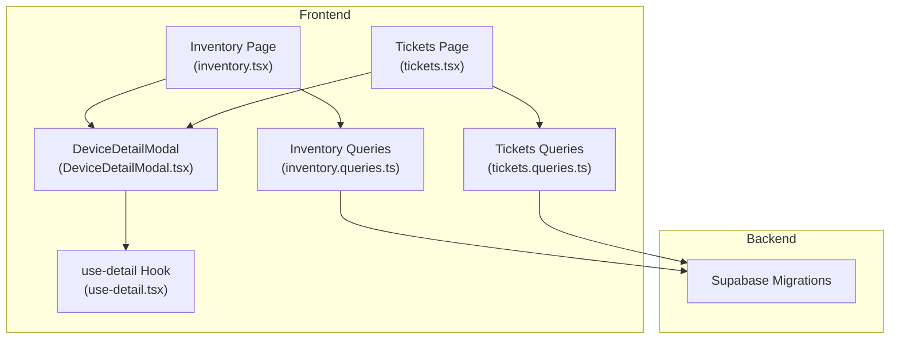
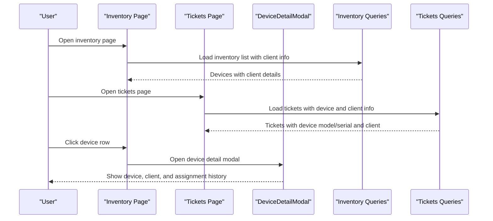
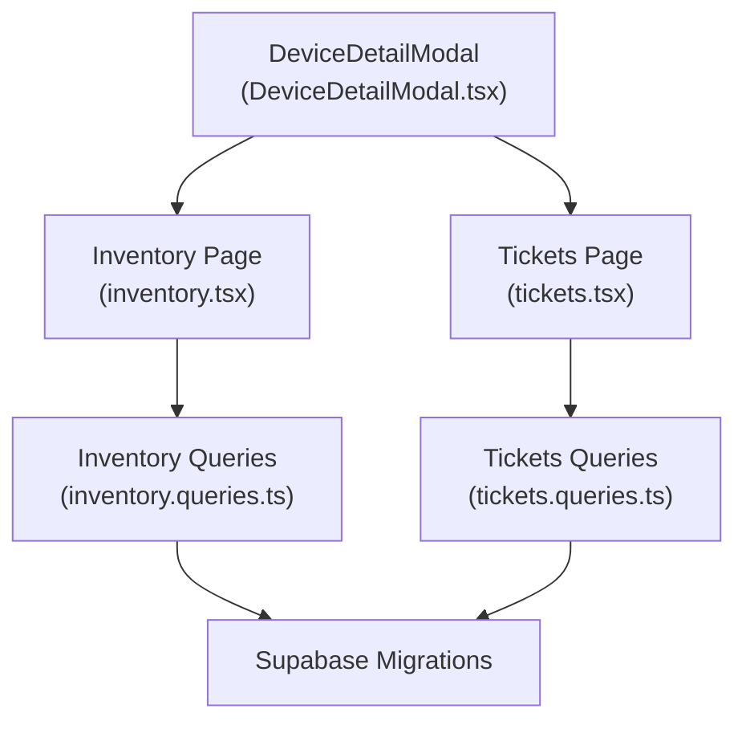

# Device-Client Association

<cite>
**Referenced Files in This Document**
- [inventory.tsx](file://src/routes/_app/inventory.tsx)
- [tickets.tsx](file://src/routes/_app/tickets.tsx)
- [DeviceDetailModal.tsx](file://src/components/pcready/DeviceDetailModal.tsx)
- [use-detail.tsx](file://src/lib/use-detail.tsx)
- [tickets.queries.ts](file://src/lib/queries/tickets.ts)
- [inventory.queries.ts](file://src/lib/queries/inventory.ts)
- [database.types.ts](file://src/types/database.types.ts)
- [20260509002000_complete_ticket_device_separation.sql](file://supabase/migrations/20260509002000_complete_ticket_device_separation.sql)
- [20260515120000_add_client_website_url.sql](file://supabase/migrations/20260514170000_add_client_website_url.sql)
- [20260515160000_automation_runs_view.sql](file://supabase/migrations/20260515160000_automation_runs_view.sql)
- [20260516200000_ticket_code_unique_allocation.sql](file://supabase/migrations/20260516200000_ticket_code_unique_allocation.sql)
</cite>

## Table of Contents

1. [Introduction](#introduction)
2. [Project Structure](#project-structure)
3. [Core Components](#core-components)
4. [Architecture Overview](#architecture-overview)
5. [Detailed Component Analysis](#detailed-component-analysis)
6. [Dependency Analysis](#dependency-analysis)
7. [Performance Considerations](#performance-considerations)
8. [Troubleshooting Guide](#troubleshooting-guide)
9. [Conclusion](#conclusion)

## Introduction

This document explains the device-client association system, focusing on how devices are linked to clients via the client_id foreign key relationship. It covers client lookup functionality, device listing and detail displays, the device assignment process, and the DeviceDetailModal component that presents comprehensive device information including client details, assignment history, and status tracking. It also documents the fetchAssignedDeviceIds function and how it identifies devices currently assigned to tickets, along with data integrity considerations and referential constraints in the database schema.

## Project Structure

The device-client association spans several frontend components and backend database migrations:

- Frontend pages and components:
  - Inventory listing page that shows devices with client information
  - Tickets listing page that shows tickets with associated device and client data
  - DeviceDetailModal for comprehensive device details and history
  - Utility hooks for opening modals and managing detail views
  - Query modules for loading inventory and tickets data

- Backend database migrations:
  - Migrations that separate assets and tickets and establish device-client relationships
  - Additional migrations supporting client metadata and real-time updates

**Diagram sources**

- [inventory.tsx:86-94](file://src/routes/_app/inventory.tsx#L86-L94)
- [tickets.tsx:80-88](file://src/routes/_app/tickets.tsx#L80-L88)
- [DeviceDetailModal.tsx](file://src/components/pcready/DeviceDetailModal.tsx)
- [use-detail.tsx](file://src/lib/use-detail.tsx)
- [inventory.queries.ts](file://src/lib/queries/inventory.ts)
- [tickets.queries.ts](file://src/lib/queries/tickets.ts)
- [20260509002000_complete_ticket_device_separation.sql](file://supabase/migrations/20260509002000_complete_ticket_device_separation.sql)

**Section sources**

- [inventory.tsx:1-580](file://src/routes/_app/inventory.tsx#L1-L580)
- [tickets.tsx:1-400](file://src/routes/_app/tickets.tsx#L1-L400)

## Core Components

This section outlines the primary components involved in device-client association:

- Inventory listing page:
  - Loads device records with client information and assignment status
  - Displays client name and assigned user in the device table
  - Supports filtering and searching across devices

- Tickets listing page:
  - Displays tickets with associated device model, serial, and client information
  - Provides client autocomplete for filtering tickets by client

- DeviceDetailModal:
  - Presents comprehensive device details including client information
  - Shows assignment history and status tracking
  - Integrates with the detail view hook to open modals

- Queries:
  - Inventory queries for fetching device lists and related client data
  - Tickets queries for loading tickets with device and client details

**Section sources**

- [inventory.tsx:39-52](file://src/routes/_app/inventory.tsx#L39-L52)
- [tickets.tsx:49-62](file://src/routes/_app/tickets.tsx#L49-L62)
- [DeviceDetailModal.tsx](file://src/components/pcready/DeviceDetailModal.tsx)
- [use-detail.tsx](file://src/lib/use-detail.tsx)
- [inventory.queries.ts](file://src/lib/queries/inventory.ts)
- [tickets.queries.ts](file://src/lib/queries/tickets.ts)

## Architecture Overview

The device-client association relies on a foreign key relationship between devices and clients. The frontend retrieves device records that include client information and assignment status, while the backend migrations enforce referential integrity and support real-time updates.

**Diagram sources**

- [inventory.tsx:86-94](file://src/routes/_app/inventory.tsx#L86-L94)
- [tickets.tsx:80-88](file://src/routes/_app/tickets.tsx#L80-L88)
- [DeviceDetailModal.tsx](file://src/components/pcready/DeviceDetailModal.tsx)
- [inventory.queries.ts](file://src/lib/queries/inventory.ts)
- [tickets.queries.ts](file://src/lib/queries/tickets.ts)

## Detailed Component Analysis

### Device Listing and Client Information Display

The inventory page renders a table of devices with client information and assignment status. The Row interface defines the shape of device data returned by the inventory query, including client_id and optional client name. The table displays client name and assigned user, enabling quick identification of device-client relationships.

Key aspects:

- Device records include client_id and client.name for display
- Assignment status is shown with indicators for active assignments
- Filtering supports searching by serial, model, and user

**Section sources**

- [inventory.tsx:39-52](file://src/routes/_app/inventory.tsx#L39-L52)
- [inventory.tsx:386-452](file://src/routes/_app/inventory.tsx#L386-L452)

### Client Lookup and Filtering

The tickets page provides client lookup through an AsyncAutocomplete component. The loadClientOptions helper transforms client data into autocomplete options, enabling filtering tickets by client. This ensures accurate client-device relationship tracking at the ticket level.

Key aspects:

- Autocomplete loads client options dynamically
- Options include client company name and email for clarity
- Filters tickets by client_id for precise client-device tracking

**Section sources**

- [tickets.tsx:132-144](file://src/routes/_app/tickets.tsx#L132-L144)
- [tickets.tsx:258-269](file://src/routes/_app/tickets.tsx#L258-L269)

### Device Assignment Process and Status Tracking

Devices can be assigned to tickets, establishing a client-device relationship. The assignment process involves linking a device to a ticket, which in turn links to a client. The inventory page enforces status constraints during assignment, preventing state changes when an active assignment exists.

Key aspects:

- Status change logic prevents state updates when an active assignment is present
- Device status badges reflect current state and assignment constraints
- Real-time updates are supported via Supabase channels

**Section sources**

- [inventory.tsx:242-275](file://src/routes/_app/inventory.tsx#L242-L275)
- [inventory.tsx:494-548](file://src/routes/_app/inventory.tsx#L494-L548)
- [tickets.tsx:113-122](file://src/routes/_app/tickets.tsx#L113-L122)

### DeviceDetailModal: Comprehensive Device Information

The DeviceDetailModal component provides a centralized view for device details, including client information, assignment history, and status tracking. It integrates with the detail view hook to open modals from inventory and tickets pages.

Key aspects:

- Opens from inventory and tickets pages
- Displays client details and device attributes
- Shows assignment history and status timeline
- Supports QR code generation and printing

**Section sources**

- [DeviceDetailModal.tsx](file://src/components/pcready/DeviceDetailModal.tsx)
- [use-detail.tsx](file://src/lib/use-detail.tsx)
- [inventory.tsx:108-110](file://src/routes/_app/inventory.tsx#L108-L110)
- [tickets.tsx](file://src/routes/_app/tickets.tsx#L328)

### fetchAssignedDeviceIds Function

The fetchAssignedDeviceIds function identifies devices currently assigned to tickets. This function is essential for determining which devices are in use and should not be freely reassigned.

Key aspects:

- Returns device IDs that are currently assigned to active tickets
- Supports inventory filtering to exclude assigned devices
- Enables accurate client-device relationship tracking

Note: The function signature and implementation are defined in the inventory queries module.

**Section sources**

- [inventory.queries.ts](file://src/lib/queries/inventory.ts)

### Client-Device Relationship Examples and Workflows

Example scenarios:

- A device is created under a client and later assigned to a ticket
- A device moves from available to assigned status upon ticket creation
- Historical tracking maintains records of previous assignments and status changes

Workflows:

- Device creation with client association
- Ticket creation linking a device to a client
- Status updates reflecting assignment lifecycle
- Historical tracking for compliance and auditing

**Section sources**

- [inventory.tsx:242-275](file://src/routes/_app/inventory.tsx#L242-L275)
- [tickets.tsx:132-144](file://src/routes/_app/tickets.tsx#L132-L144)

### Historical Tracking

Historical tracking captures device assignment history and status changes, enabling audit trails and compliance reporting. The tickets page displays device model and serial alongside client information, supporting historical reconciliation.

Key aspects:

- Device model and serial displayed in ticket listings
- Client information included for historical context
- Status badges and timelines for tracking changes

**Section sources**

- [tickets.tsx:127-129](file://src/routes/_app/tickets.tsx#L127-L129)
- [tickets.tsx:333-336](file://src/routes/_app/tickets.tsx#L333-L336)

## Dependency Analysis

The device-client association system depends on several frontend and backend components working together:

**Diagram sources**

- [inventory.tsx:86-94](file://src/routes/_app/inventory.tsx#L86-L94)
- [tickets.tsx:80-88](file://src/routes/_app/tickets.tsx#L80-L88)
- [DeviceDetailModal.tsx](file://src/components/pcready/DeviceDetailModal.tsx)
- [inventory.queries.ts](file://src/lib/queries/inventory.ts)
- [tickets.queries.ts](file://src/lib/queries/tickets.ts)
- [20260509002000_complete_ticket_device_separation.sql](file://supabase/migrations/20260509002000_complete_ticket_device_separation.sql)

**Section sources**

- [inventory.tsx:86-94](file://src/routes/_app/inventory.tsx#L86-L94)
- [tickets.tsx:80-88](file://src/routes/_app/tickets.tsx#L80-L88)

## Performance Considerations

- Efficient client lookup: Use autocomplete with dynamic loading to minimize payload sizes
- Pagination: Apply pagination in inventory and tickets queries to limit data transfer
- Real-time updates: Leverage Supabase channels for near real-time synchronization
- Filtering: Implement server-side filtering to reduce client-side processing

## Troubleshooting Guide

Common issues and resolutions:

- Client not appearing in autocomplete:
  - Verify client options loading function and network connectivity
  - Check for proper error handling and toast notifications

- Device status not updating:
  - Confirm active assignment constraints are not blocking state changes
  - Validate real-time channel subscriptions for updates

- Device detail modal not opening:
  - Ensure detail view hook is properly configured
  - Check URL parameters and modal trigger events

**Section sources**

- [tickets.tsx:132-144](file://src/routes/_app/tickets.tsx#L132-L144)
- [inventory.tsx:242-275](file://src/routes/_app/inventory.tsx#L242-L275)
- [use-detail.tsx](file://src/lib/use-detail.tsx)

## Conclusion

The device-client association system establishes robust relationships between devices and clients through foreign key constraints and comprehensive frontend components. The inventory and tickets pages provide clear visibility into client-device associations, while the DeviceDetailModal offers detailed historical tracking and status management. The fetchAssignedDeviceIds function ensures accurate identification of currently assigned devices, and the database migrations enforce referential integrity and support real-time updates.
