# Assistance Bundles System

<cite>
**Referenced Files in This Document**
- [bundles.ts](file://src/lib/bundles.ts)
- [BundleForms.tsx](file://src/components/bundles/BundleForms.tsx)
- [BundleBadges.tsx](file://src/components/bundles/BundleBadges.tsx)
- [bundles.tsx](file://src/routes/_app/bundles.tsx)
- [20260526120000_assistance_bundles.sql](file://supabase/migrations/20260526120000_assistance_bundles.sql)
- [routeTree.gen.ts](file://src/routeTree.gen.ts)
</cite>

## Table of Contents
1. [Introduction](#introduction)
2. [System Architecture](#system-architecture)
3. [Core Components](#core-components)
4. [Database Schema](#database-schema)
5. [User Interface Components](#user-interface-components)
6. [Business Logic Implementation](#business-logic-implementation)
7. [Integration Points](#integration-points)
8. [Usage Workflows](#usage-workflows)
9. [Performance Considerations](#performance-considerations)
10. [Troubleshooting Guide](#troubleshooting-guide)
11. [Conclusion](#conclusion)

## Introduction

The Assistance Bundles System is a comprehensive solution for managing service packages and support contracts within the PCReady platform. This system enables organizations to offer different tiers of technical support services to their clients, track usage consumption, manage billing cycles, and automate SLA enforcement based on purchased service packages.

The system provides four distinct service tiers: Base, Standard, Premium, and Enterprise, each with different capabilities, pricing structures, and service level agreements. It seamlessly integrates with the ticketing system to automatically apply service package benefits when new tickets are created.

## System Architecture

The Assistance Bundles System follows a modern React-based architecture with Supabase backend services:

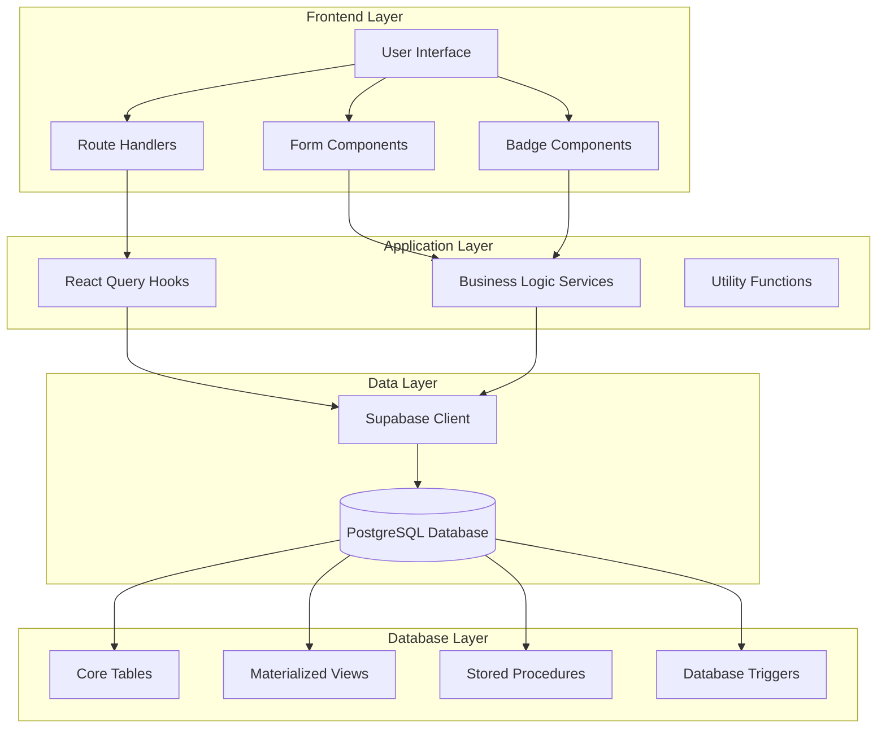

**Diagram sources**
- [bundles.ts:1-449](file://src/lib/bundles.ts#L1-L449)
- [BundleForms.tsx:1-643](file://src/components/bundles/BundleForms.tsx#L1-L643)
- [BundleBadges.tsx:1-85](file://src/components/bundles/BundleBadges.tsx#L1-L85)
- [bundles.tsx:1-1014](file://src/routes/_app/bundles.tsx#L1-L1014)

## Core Components

### Data Models and Types

The system defines comprehensive TypeScript interfaces for all bundle-related entities:

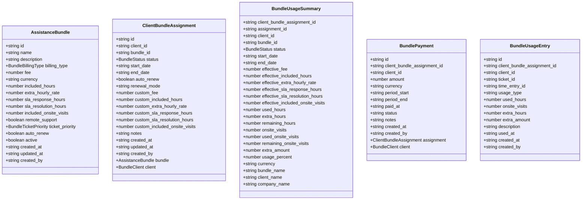

**Diagram sources**
- [bundles.ts:8-128](file://src/lib/bundles.ts#L8-L128)

### Business Logic Services

The system provides comprehensive CRUD operations and business logic through dedicated service functions:

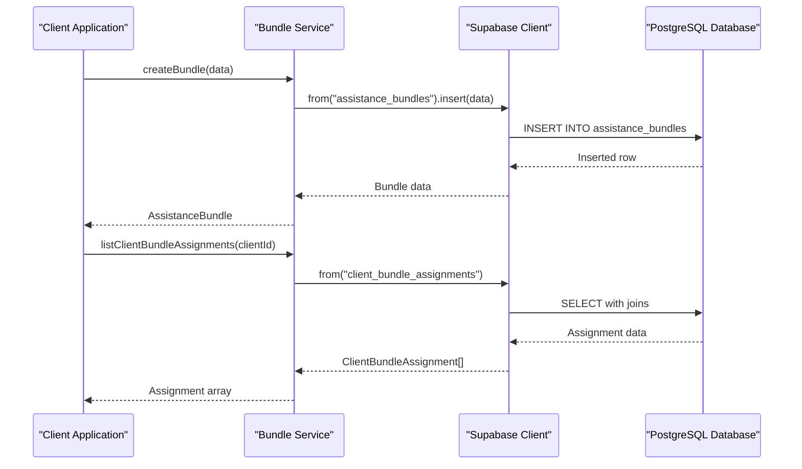

**Diagram sources**
- [bundles.ts:208-317](file://src/lib/bundles.ts#L208-L317)

**Section sources**
- [bundles.ts:1-449](file://src/lib/bundles.ts#L1-L449)

## Database Schema

The Assistance Bundles System utilizes a sophisticated PostgreSQL schema with multiple interconnected tables and views:

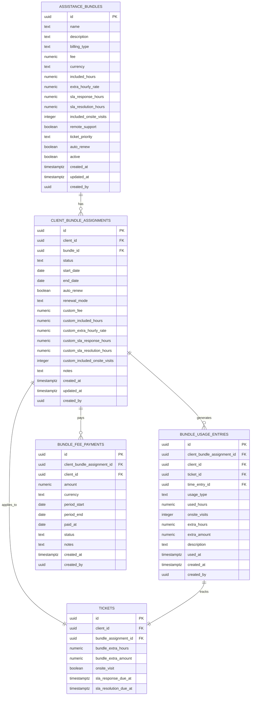

**Diagram sources**
- [20260526120000_assistance_bundles.sql:3-77](file://supabase/migrations/20260526120000_assistance_bundles.sql#L3-L77)

### Key Features of the Database Design

1. **Row Level Security**: All tables have RLS enabled with role-based access controls
2. **Active Bundle Management**: Automatic calculation of effective values through views
3. **Usage Tracking**: Comprehensive logging of all bundle consumption activities
4. **SLA Enforcement**: Automated SLA timestamps based on bundle priorities
5. **Trigger-Based Automation**: Real-time synchronization between tickets and usage

**Section sources**
- [20260526120000_assistance_bundles.sql:1-606](file://supabase/migrations/20260526120000_assistance_bundles.sql#L1-L606)

## User Interface Components

### Form Components

The system provides comprehensive form components for managing bundle configurations:

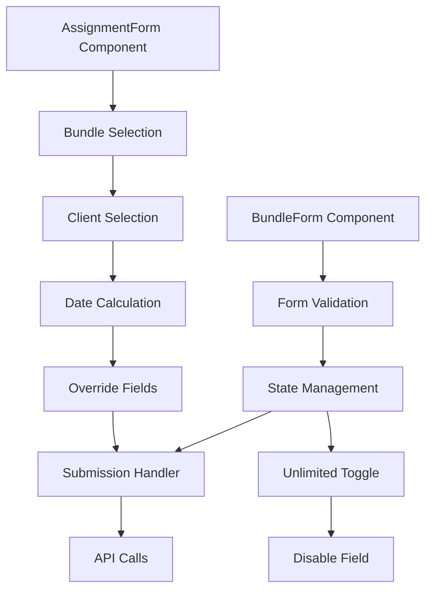

**Diagram sources**
- [BundleForms.tsx:135-392](file://src/components/bundles/BundleForms.tsx#L135-L392)
- [BundleForms.tsx:394-642](file://src/components/bundles/BundleForms.tsx#L394-L642)

### Badge Components

Visual indicators for bundle status, priority, and usage:

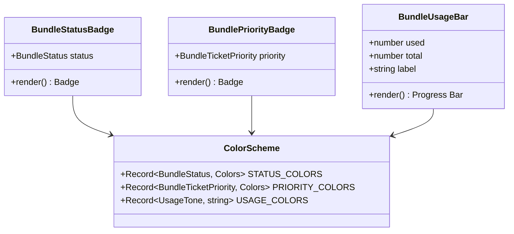

**Diagram sources**
- [BundleBadges.tsx:1-85](file://src/components/bundles/BundleBadges.tsx#L1-L85)

**Section sources**
- [BundleForms.tsx:1-643](file://src/components/bundles/BundleForms.tsx#L1-L643)
- [BundleBadges.tsx:1-85](file://src/components/bundles/BundleBadges.tsx#L1-L85)

## Business Logic Implementation

### Bundle Management Functions

The system implements sophisticated business logic for bundle lifecycle management:

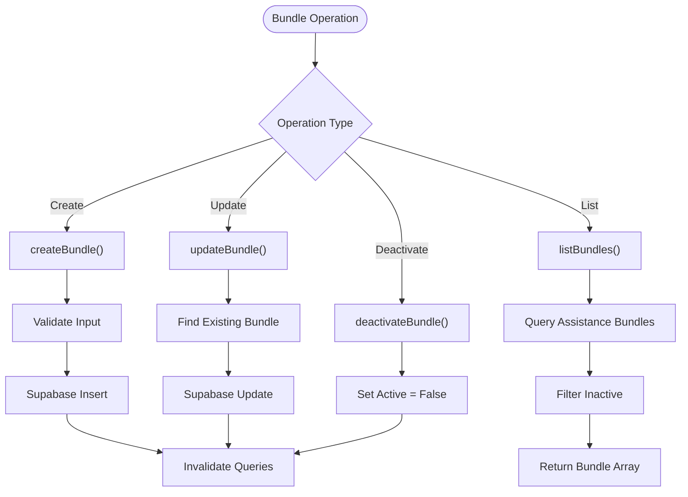

**Diagram sources**
- [bundles.ts:208-243](file://src/lib/bundles.ts#L208-L243)

### Usage Calculation Logic

The system automatically calculates usage metrics and determines consumption alerts:

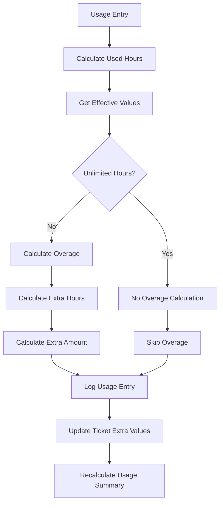

**Diagram sources**
- [20260526120000_assistance_bundles.sql:402-526](file://supabase/migrations/20260526120000_assistance_bundles.sql#L402-L526)

**Section sources**
- [bundles.ts:184-206](file://src/lib/bundles.ts#L184-L206)
- [bundles.ts:329-364](file://src/lib/bundles.ts#L329-L364)

## Integration Points

### Ticket System Integration

The system seamlessly integrates with the ticketing system through database triggers:

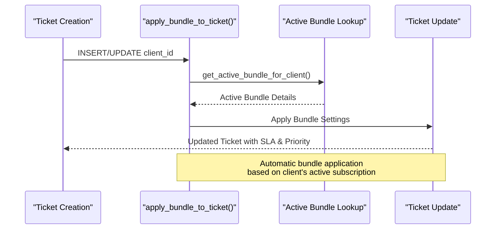

**Diagram sources**
- [20260526120000_assistance_bundles.sql:354-400](file://supabase/migrations/20260526120000_assistance_bundles.sql#L354-L400)

### Route Integration

The bundles system is integrated into the main application routing:

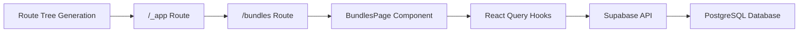

**Diagram sources**
- [routeTree.gen.ts:171-175](file://src/routeTree.gen.ts#L171-L175)

**Section sources**
- [bundles.tsx:1-1014](file://src/routes/_app/bundles.tsx#L1-L1014)
- [routeTree.gen.ts:1-200](file://src/routeTree.gen.ts#L1-L200)

## Usage Workflows

### Creating a New Bundle

The workflow for creating a new assistance bundle:

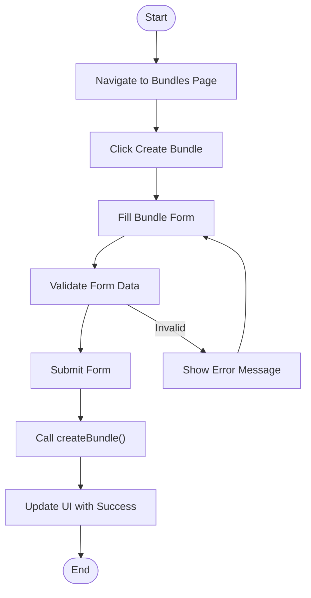

### Assigning Bundle to Client

The process for assigning a bundle to a client:

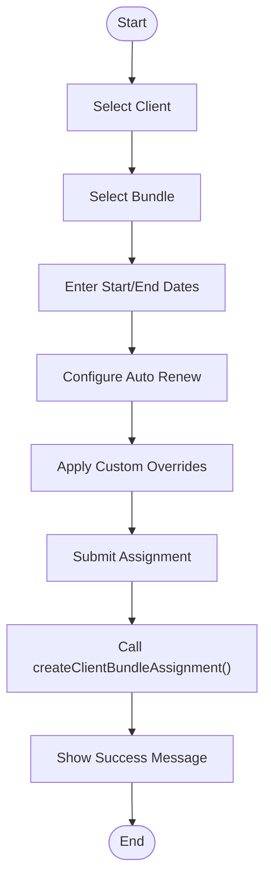

### Monitoring Usage

The usage monitoring workflow:

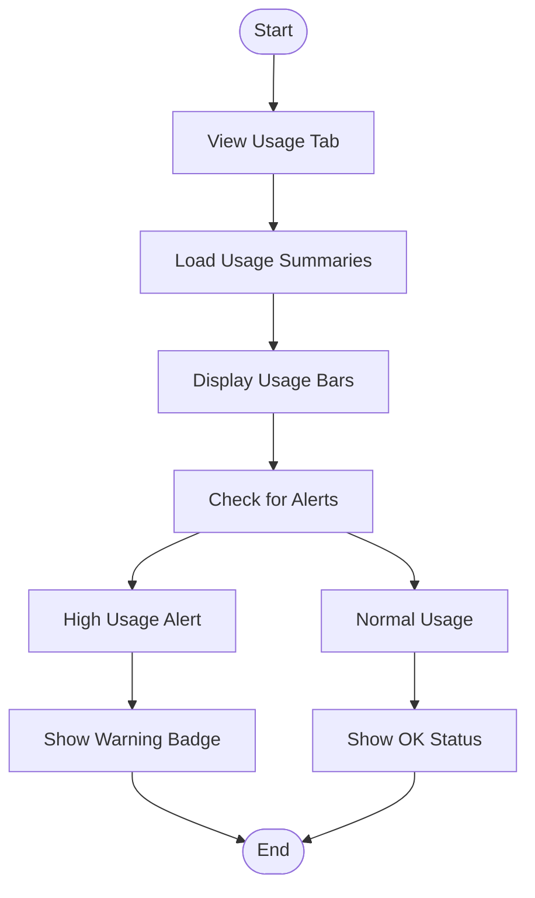

## Performance Considerations

### Database Optimization

The system implements several performance optimization strategies:

1. **Indexing Strategy**: Strategic indexing on frequently queried columns
2. **Materialized Views**: Pre-calculated views for usage summaries
3. **Trigger-Based Updates**: Real-time calculations without manual refresh
4. **Query Optimization**: Efficient queries with proper filtering

### Frontend Performance

1. **React Query Caching**: Automatic caching and invalidation
2. **Lazy Loading**: Conditional loading of expensive components
3. **Memoization**: Optimized rendering with useMemo and useCallback
4. **Batch Operations**: Efficient bulk data operations

### Scalability Considerations

1. **Database Partitioning**: Potential for partitioning large usage tables
2. **Caching Layers**: Redis caching for frequently accessed bundle data
3. **API Rate Limiting**: Built-in rate limiting for API endpoints
4. **Pagination**: Support for large datasets through pagination

## Troubleshooting Guide

### Common Issues and Solutions

#### Bundle Creation Failures
- **Issue**: Bundle creation fails with validation errors
- **Solution**: Verify required fields are filled and numeric values are positive
- **Prevention**: Implement client-side validation before submission

#### Usage Tracking Not Working
- **Issue**: Bundle usage not updating after time entries
- **Solution**: Check database trigger permissions and function execution
- **Debugging**: Verify `sync_bundle_usage_from_time_entry()` trigger is active

#### SLA Not Applied to Tickets
- **Issue**: New tickets don't inherit bundle SLA settings
- **Solution**: Ensure `apply_bundle_to_ticket()` trigger is functioning
- **Verification**: Check `get_active_bundle_for_client()` function returns results

#### Performance Issues
- **Issue**: Slow loading of bundle data
- **Solution**: Check database indexes and optimize queries
- **Monitoring**: Use database query plans to identify bottlenecks

### Error Handling Patterns

The system implements comprehensive error handling:

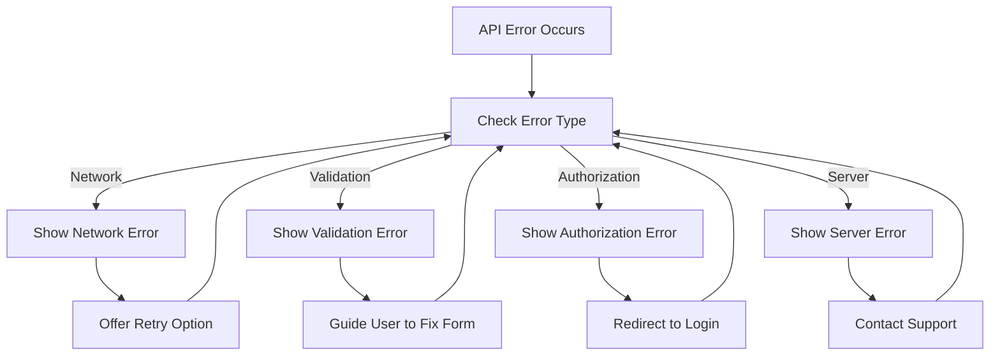

**Section sources**
- [bundles.ts:366-448](file://src/lib/bundles.ts#L366-L448)
- [bundles.tsx:181-274](file://src/routes/_app/bundles.tsx#L181-L274)

## Conclusion

The Assistance Bundles System represents a comprehensive solution for managing service packages and support contracts within the PCReady platform. Its architecture combines modern frontend development practices with robust backend database design to provide:

1. **Complete Bundle Management**: Full lifecycle management of service packages
2. **Automated SLA Enforcement**: Automatic application of service level agreements
3. **Real-time Usage Tracking**: Live monitoring of bundle consumption
4. **Flexible Billing Integration**: Seamless integration with payment systems
5. **Role-Based Access Control**: Secure multi-user environment
6. **Performance Optimization**: Efficient database design and frontend caching

The system's modular design allows for easy extension and customization while maintaining data integrity and user experience. The combination of database triggers, materialized views, and React Query ensures both real-time responsiveness and optimal performance.

Future enhancements could include advanced reporting capabilities, automated renewal workflows, and integration with external billing systems for expanded functionality.