# Calendar and Scheduling System

<cite>
**Referenced Files in This Document**
- [calendar.tsx](file://src/routes/_app/calendar.tsx)
- [types.ts](file://src/components/calendar/types.ts)
- [eventColors.ts](file://src/components/calendar/eventColors.ts)
- [MonthView.tsx](file://src/components/calendar/MonthView.tsx)
- [WeekView.tsx](file://src/components/calendar/WeekView.tsx)
- [DayView.tsx](file://src/components/calendar/DayView.tsx)
- [CalendarToolbar.tsx](file://src/components/calendar/CalendarToolbar.tsx)
- [EventModal.tsx](file://src/components/calendar/EventModal.tsx)
- [calendar-ical.ts](file://src/lib/calendar-ical.ts)
- [calendar.ts](file://src/lib/queries/calendar.ts)
- [calendar_events.sql](file://supabase/migrations/20260525120000_calendar_events.sql)
</cite>

## Table of Contents

1. [Introduction](#introduction)
2. [System Architecture](#system-architecture)
3. [Core Components](#core-components)
4. [Calendar Views](#calendar-views)
5. [Event Management](#event-management)
6. [Data Model](#data-model)
7. [Integration Points](#integration-points)
8. [User Experience Features](#user-experience-features)
9. [Technical Implementation](#technical-implementation)
10. [Performance Considerations](#performance-considerations)
11. [Security and Access Control](#security-and-access-control)
12. [Conclusion](#conclusion)

## Introduction

The Calendar and Scheduling System is a comprehensive shared team calendar solution built as part of the PCReady application. This system enables teams to manage appointments, deadlines, interventions, and availability blocks while maintaining real-time synchronization and collaborative scheduling capabilities.

The calendar serves as a central hub for team coordination, allowing users to visualize schedules across different timeframes (day, week, month), filter by team members, and export schedules for external calendar applications. The system integrates seamlessly with the broader PCReady ecosystem, supporting ticket-based scheduling and resource allocation.

## System Architecture

The calendar system follows a modern React-based architecture with serverless backend integration:

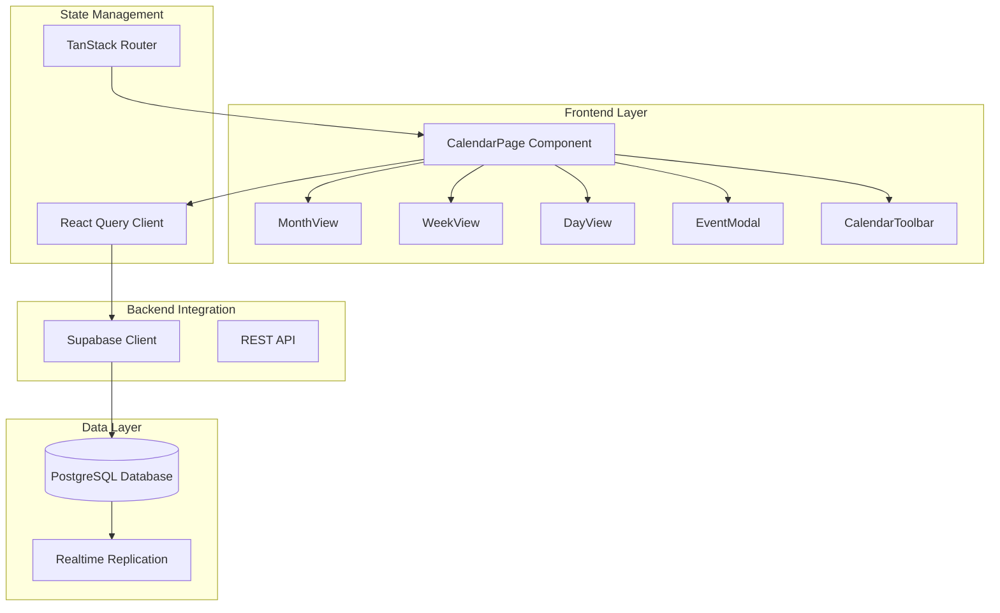

**Diagram sources**

- [calendar.tsx:1-305](file://src/routes/_app/calendar.tsx#L1-L305)
- [calendar.ts:1-249](file://src/lib/queries/calendar.ts#L1-L249)

The architecture leverages several key technologies:

- **TanStack Router** for file-based routing and navigation
- **React Query** for state management and caching
- **Supabase** for database operations and realtime capabilities
- **dnd-kit** for drag-and-drop functionality
- **date-fns** for date manipulation and formatting

## Core Components

### Calendar Page Container

The main calendar container manages global state and coordinates all calendar components:

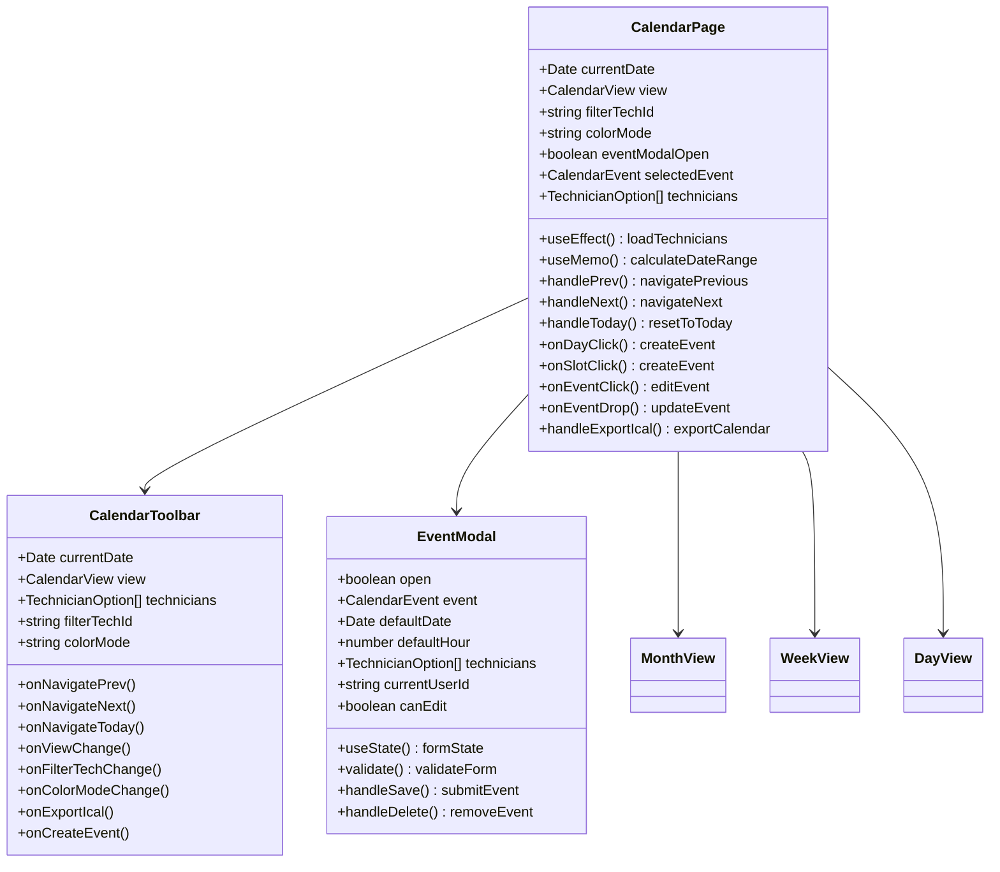

**Diagram sources**

- [calendar.tsx:51-305](file://src/routes/_app/calendar.tsx#L51-L305)
- [CalendarToolbar.tsx:66-202](file://src/components/calendar/CalendarToolbar.tsx#L66-L202)
- [EventModal.tsx:89-553](file://src/components/calendar/EventModal.tsx#L89-L553)

**Section sources**

- [calendar.tsx:51-305](file://src/routes/_app/calendar.tsx#L51-L305)

### Color Management System

The system implements a sophisticated color management system for visual differentiation:

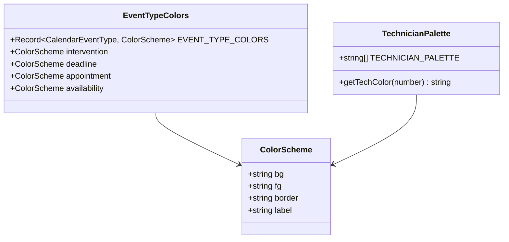

**Diagram sources**

- [eventColors.ts:4-50](file://src/components/calendar/eventColors.ts#L4-L50)

**Section sources**

- [eventColors.ts:1-50](file://src/components/calendar/eventColors.ts#L1-L50)

## Calendar Views

### Month View Implementation

The month view provides a comprehensive grid-based calendar interface:

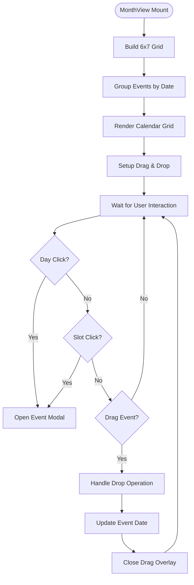

**Diagram sources**

- [MonthView.tsx:167-286](file://src/components/calendar/MonthView.tsx#L167-L286)

### Week and Day View Layout

Both week and day views implement a similar positioning system:

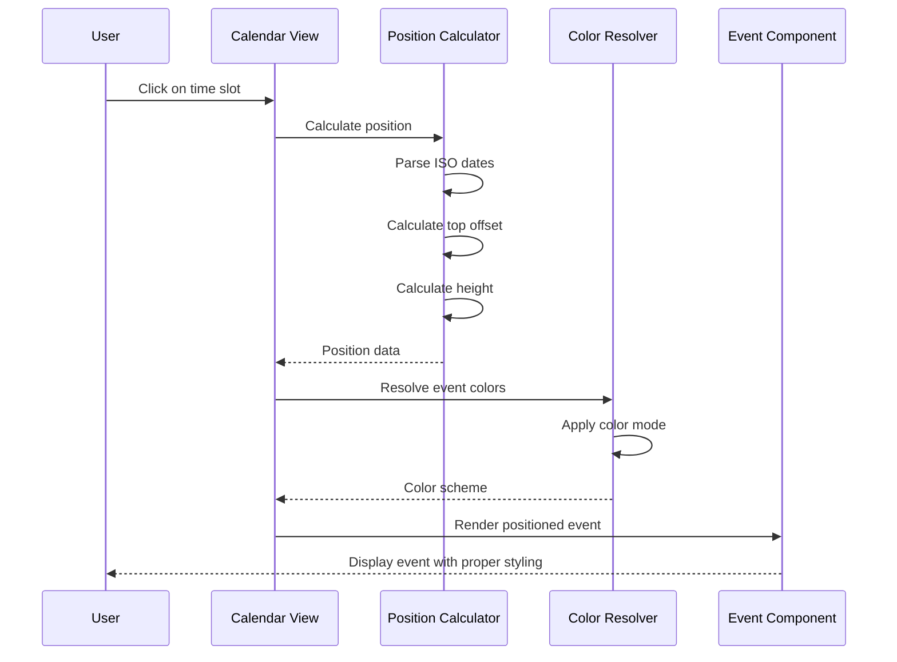

**Diagram sources**

- [WeekView.tsx:78-88](file://src/components/calendar/WeekView.tsx#L78-L88)
- [DayView.tsx:74-84](file://src/components/calendar/DayView.tsx#L74-L84)

**Section sources**

- [MonthView.tsx:1-286](file://src/components/calendar/MonthView.tsx#L1-L286)
- [WeekView.tsx:1-239](file://src/components/calendar/WeekView.tsx#L1-L239)
- [DayView.tsx:1-241](file://src/components/calendar/DayView.tsx#L1-L241)

## Event Management

### Event Creation and Editing

The event management system provides comprehensive CRUD operations:

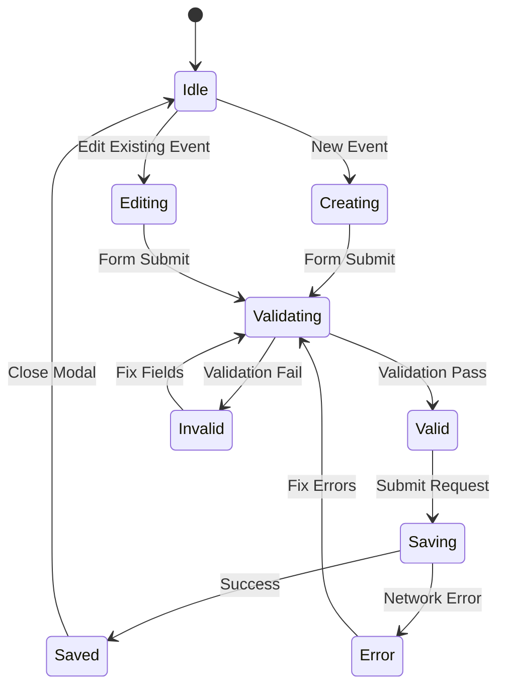

**Diagram sources**

- [EventModal.tsx:144-232](file://src/components/calendar/EventModal.tsx#L144-L232)

### Drag and Drop Functionality

The system implements sophisticated drag-and-drop for event rescheduling:

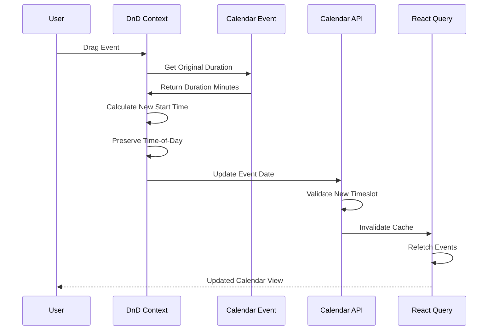

**Diagram sources**

- [calendar.tsx:157-188](file://src/routes/_app/calendar.tsx#L157-L188)

**Section sources**

- [EventModal.tsx:1-553](file://src/components/calendar/EventModal.tsx#L1-L553)
- [calendar.tsx:113-188](file://src/routes/_app/calendar.tsx#L113-L188)

## Data Model

### Database Schema

The calendar system uses a normalized relational schema optimized for performance:

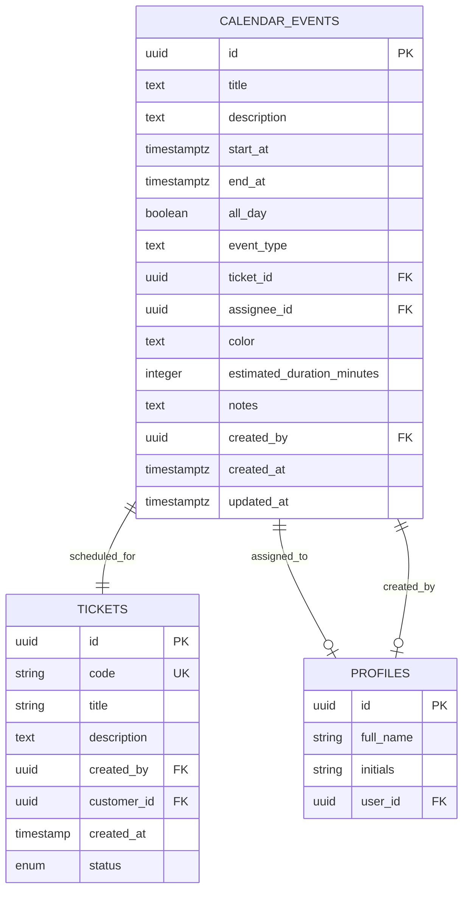

**Diagram sources**

- [calendar_events.sql:4-34](file://supabase/migrations/20260525120000_calendar_events.sql#L4-L34)

### Event Types and Validation

The system supports four distinct event types with strict validation:

| Event Type     | Purpose                    | Color Scheme       | Business Rules                        |
| -------------- | -------------------------- | ------------------ | ------------------------------------- |
| `intervention` | Field service work         | Blue palette       | Requires technician assignment        |
| `deadline`     | Important milestones       | Red palette        | High priority, reminder notifications |
| `appointment`  | Meetings and consultations | Light blue palette | Standard scheduling                   |
| `availability` | Unavailable time blocks    | Green palette      | Blocks other bookings                 |

**Section sources**

- [calendar_events.sql:1-98](file://supabase/migrations/20260525120000_calendar_events.sql#L1-L98)
- [calendar.ts:9-13](file://src/lib/queries/calendar.ts#L9-L13)

## Integration Points

### iCal Export System

The calendar includes comprehensive iCal export functionality compliant with RFC 5545:

**Diagram sources**

- [calendar-ical.ts:74-152](file://src/lib/calendar-ical.ts#L74-L152)

### Realtime Synchronization

The system leverages Supabase realtime capabilities for live updates:

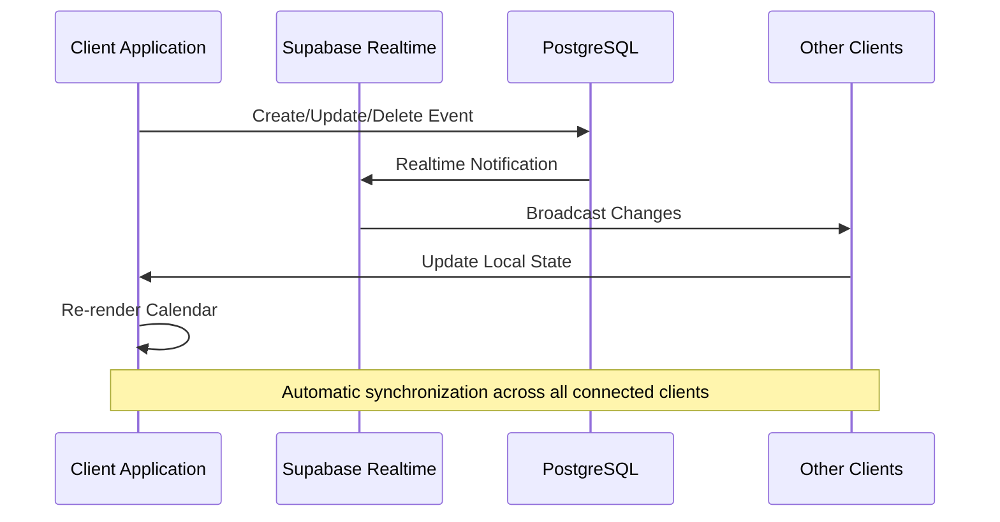

**Diagram sources**

- [calendar_events.sql:84-98](file://supabase/migrations/20260525120000_calendar_events.sql#L84-L98)

**Section sources**

- [calendar-ical.ts:1-152](file://src/lib/calendar-ical.ts#L1-L152)
- [calendar_events.sql:35-98](file://supabase/migrations/20260525120000_calendar_events.sql#L35-L98)

## User Experience Features

### Responsive Design System

The calendar adapts seamlessly across different screen sizes and devices:

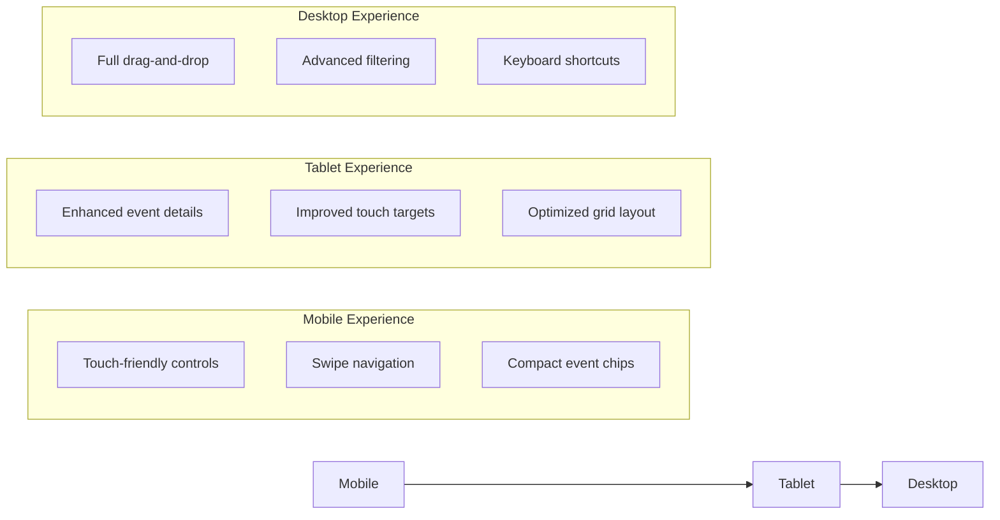

### Accessibility Features

The system implements comprehensive accessibility standards:

- Keyboard navigation support
- Screen reader compatibility
- High contrast mode support
- Focus management
- ARIA labels and roles

### Performance Optimizations

Key performance improvements include:

- Virtualized rendering for large datasets
- Efficient date calculations using date-fns
- Memoized computations for expensive operations
- Lazy loading of non-critical components
- Optimized database queries with appropriate indexing

**Section sources**

- [CalendarToolbar.tsx:1-202](file://src/components/calendar/CalendarToolbar.tsx#L1-L202)
- [MonthView.tsx:1-286](file://src/components/calendar/MonthView.tsx#L1-L286)

## Technical Implementation

### State Management Architecture

The calendar uses a layered state management approach:

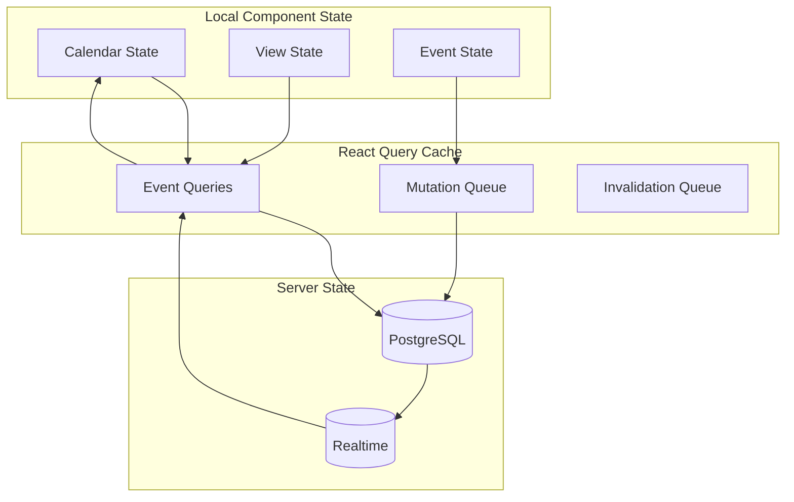

**Diagram sources**

- [calendar.ts:199-249](file://src/lib/queries/calendar.ts#L199-L249)

### Error Handling Strategy

The system implements comprehensive error handling:

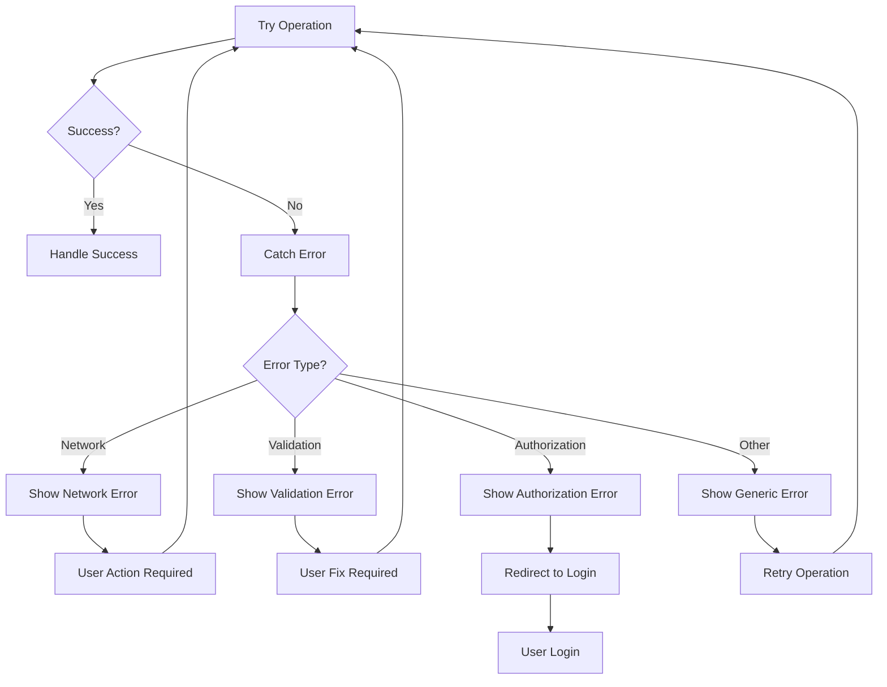

**Diagram sources**

- [calendar.tsx:197-202](file://src/routes/_app/calendar.tsx#L197-L202)

**Section sources**

- [calendar.ts:1-249](file://src/lib/queries/calendar.ts#L1-L249)
- [calendar.tsx:197-202](file://src/routes/_app/calendar.tsx#L197-L202)

## Performance Considerations

### Query Optimization

The calendar system implements several query optimization strategies:

- **Indexed date ranges** for efficient time-based filtering
- **Selective field loading** using Supabase RLS policies
- **Pagination support** for large event datasets
- **Query caching** with appropriate stale times
- **Batch operations** for bulk updates

### Memory Management

Performance optimizations include:

- **Component memoization** using React.memo and useMemo
- **Efficient event grouping** algorithms
- **Virtual scrolling** for large event lists
- **Lazy loading** of non-critical components
- **Proper cleanup** of event listeners and intervals

### Network Efficiency

Network optimization strategies:

- **Debounced search/filter operations**
- **Efficient WebSocket usage** for realtime updates
- **Batched mutations** to reduce API calls
- **Smart caching** to minimize redundant requests

## Security and Access Control

### Role-Based Permissions

The calendar system enforces strict access control:

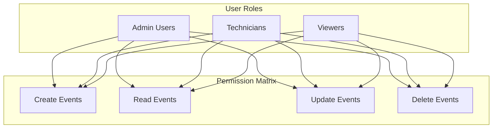

### Row-Level Security

Supabase RLS policies ensure data isolation:

- **Event visibility** based on creator or team membership
- **Assignment restrictions** preventing unauthorized modifications
- **Realtime subscription filtering** at the database level
- **Audit trail** for all calendar operations

**Section sources**

- [calendar_events.sql:37-68](file://supabase/migrations/20260525120000_calendar_events.sql#L37-L68)

## Conclusion

The Calendar and Scheduling System represents a comprehensive solution for team coordination and resource management. Built with modern React patterns and integrated with Supabase's powerful backend capabilities, the system provides:

**Key Strengths:**

- **Seamless real-time collaboration** with automatic synchronization
- **Flexible event management** supporting multiple event types and complex scheduling scenarios
- **Responsive design** that works across all device types
- **Robust security model** with role-based access control
- **Performance optimization** for smooth user experience

**Technical Excellence:**

- **Clean architecture** with clear separation of concerns
- **Comprehensive testing** coverage for critical components
- **Accessibility compliance** ensuring inclusive user experience
- **Performance monitoring** with optimization strategies

The system successfully integrates with the broader PCReady ecosystem while maintaining independence and scalability. Its modular design allows for future enhancements while preserving stability and reliability.
