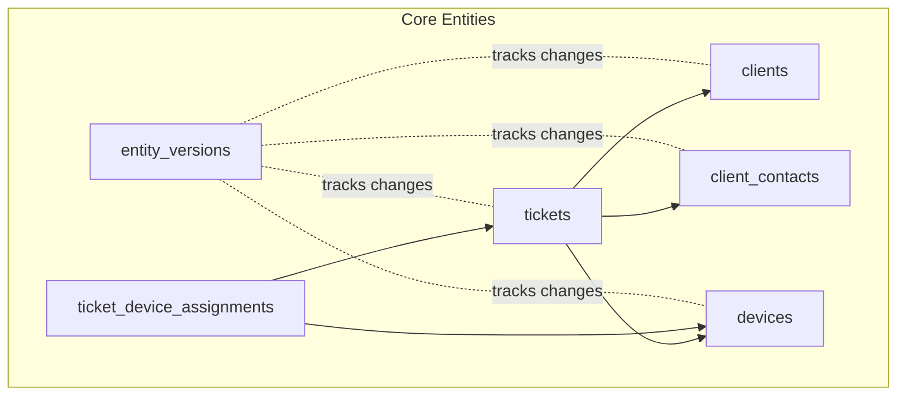
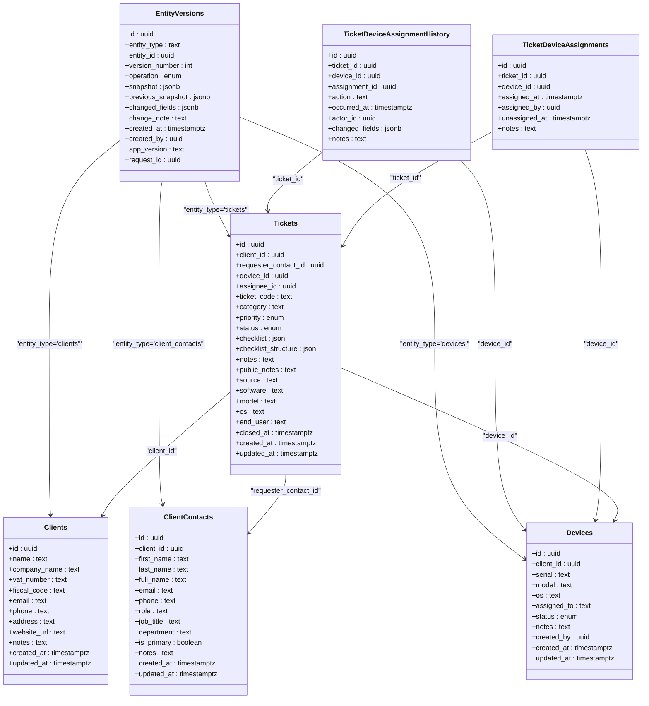
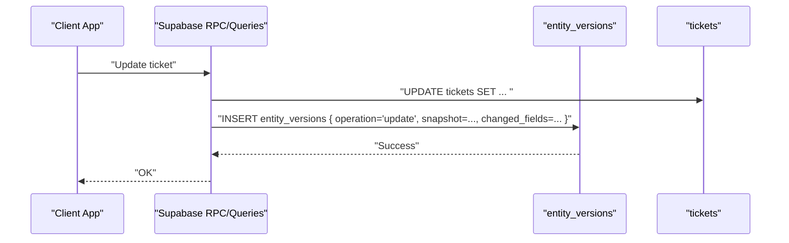
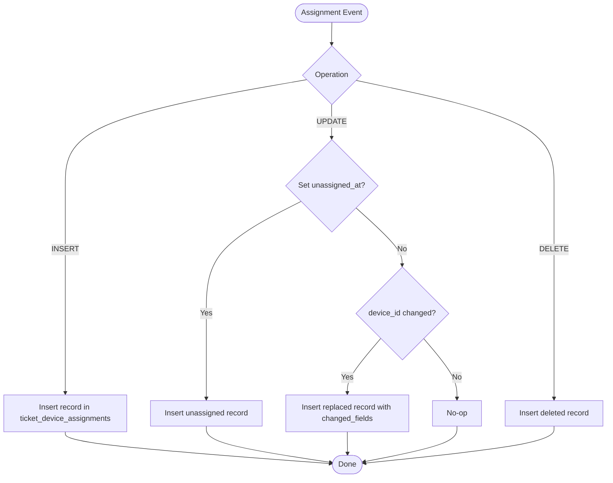
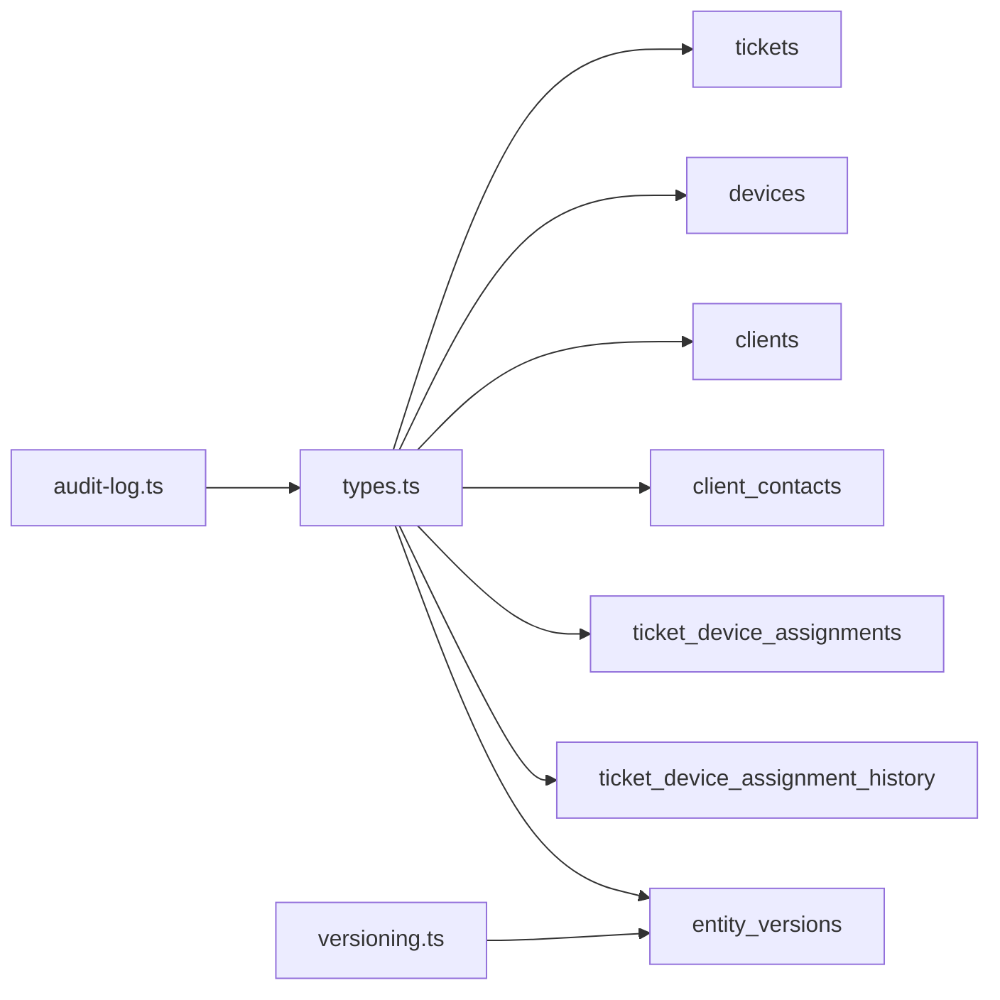

# Core Entities and Relationships

<cite>
**Referenced Files in This Document**
- [split_assets_clients_tickets.sql](file://supabase/migrations/20260430170000_split_assets_clients_tickets.sql)
- [expand_clients_contacts.sql](file://supabase/migrations/20260430182000_expand_clients_contacts.sql)
- [complete_ticket_device_separation.sql](file://supabase/migrations/20260509002000_complete_ticket_device_separation.sql)
- [create_ticket_device_assignment_history.sql](file://supabase/migrations/20260504183000_create_ticket_device_assignment_history.sql)
- [entity_versions.sql](file://supabase/migrations/20260503120000_entity_versions.sql)
- [harden_entity_versions.sql](file://supabase/migrations/20260509123300_harden_entity_versions.sql)
- [types.ts](file://src/integrations/supabase/types.ts)
- [versioning.ts](file://src/lib/versioning.ts)
- [audit-log.ts](file://src/lib/audit-log.ts)
</cite>

## Table of Contents
1. [Introduction](#introduction)
2. [Project Structure](#project-structure)
3. [Core Components](#core-components)
4. [Architecture Overview](#architecture-overview)
5. [Detailed Component Analysis](#detailed-component-analysis)
6. [Dependency Analysis](#dependency-analysis)
7. [Performance Considerations](#performance-considerations)
8. [Troubleshooting Guide](#troubleshooting-guide)
9. [Conclusion](#conclusion)

## Introduction
This document describes PCReady’s core domain entities and their relationships: USERS, CLIENTS, CONTACTS, DEVICES, TICKETS, and the many-to-many relationship between TICKETS and DEVICES mediated by TICKET_DEVICE_ASSIGNMENTS. It details primary keys, foreign keys, referential integrity, constraints, and audit/tracking mechanisms. It also explains entity lifecycle management, validation rules, and common query patterns grounded in the repository’s migrations and TypeScript type definitions.

## Project Structure
The core schema is defined in Supabase migrations and mirrored in TypeScript types. The key areas are:
- Entity definitions and constraints in migrations
- Type-safe table definitions in TypeScript
- Versioning and audit infrastructure
- Historical tracking for ticket-device assignments

**Diagram sources**
- [split_assets_clients_tickets.sql:3-137](file://supabase/migrations/20260430170000_split_assets_clients_tickets.sql#L3-L137)
- [complete_ticket_device_separation.sql:1-83](file://supabase/migrations/20260509002000_complete_ticket_device_separation.sql#L1-L83)
- [entity_versions.sql:1-41](file://supabase/migrations/20260503120000_entity_versions.sql#L1-L41)

**Section sources**
- [split_assets_clients_tickets.sql:1-137](file://supabase/migrations/20260430170000_split_assets_clients_tickets.sql#L1-L137)
- [complete_ticket_device_separation.sql:1-83](file://supabase/migrations/20260509002000_complete_ticket_device_separation.sql#L1-L83)
- [entity_versions.sql:1-41](file://supabase/migrations/20260503120000_entity_versions.sql#L1-L41)

## Core Components
This section defines each core entity, its primary key, fields, data types, constraints, and relationships.

- USERS
  - Purpose: Application users/profiles tracked via auth.users and profiles.
  - Primary key: id (UUID)
  - Notes: Referenced by several entities (e.g., tickets.assignee_id, devices.created_by, entity_versions.created_by).
  - Constraints: Not defined here; see related policies and relationships in other tables.

- CLIENTS
  - Purpose: Organizations or customer companies.
  - Primary key: id (UUID)
  - Fields: name (unique), company_name (unique), vat_number, fiscal_code, email, phone, address, website_url, notes, timestamps.
  - Constraints: name and company_name uniqueness enforced via indexes; device_id foreign key on tickets uses ON DELETE SET NULL.
  - Security: Row Level Security enabled; policies allow authenticated users to read; tech/admin can insert/update; admin can delete.

- CONTACTS (client_contacts)
  - Purpose: Contact persons for clients.
  - Primary key: id (UUID)
  - Fields: client_id (FK to clients), first_name, last_name, full_name, email, phone, role/job_title, department, is_primary, notes, timestamps.
  - Constraints: Unique constraint on (client_id, first_name, last_name, email); unique index on one primary contact per client.
  - Security: RLS enabled; authenticated users can read; tech/admin can insert/update; admin can delete.

- DEVICES
  - Purpose: Hardware assets associated with clients.
  - Primary key: id (UUID)
  - Fields: client_id (FK), serial (unique when present), model, os, assigned_to, status (enum: available, assigned, maintenance, retired), notes, created_by (FK to auth.users), timestamps.
  - Constraints: serial uniqueness enforced via partial unique index; device_status enum; client_id uses ON DELETE RESTRICT.
  - Security: RLS enabled; authenticated users can read; tech/admin can insert/update/delete.

- TICKETS
  - Purpose: Service requests/work items.
  - Primary key: id (UUID)
  - Key foreign keys: client_id (FK to clients), requester_contact_id (FK to client_contacts), device_id (FK to devices), assignee_id (FK to profiles).
  - Additional fields: ticket_code (unique), category, priority, status, checklist/checklist_structure, notes/public_notes, source, software/model/os/end_user, timestamps, closed_at.
  - Constraints: device_id FK allows NULL (ON DELETE SET NULL); indexes on device_id, client_id, requester_contact_id for performance.
  - Security: RLS enabled; policies grant read/write access to tech/admin roles.

- TICKET_DEVICE_ASSIGNMENTS (many-to-many bridge)
  - Purpose: Tracks assignment/unassignment/replacement of devices to tickets.
  - Primary key: id (UUID)
  - Fields: ticket_id (FK), device_id (FK), assigned_at, assigned_by, unassigned_at, notes.
  - Constraints: References to tickets and devices; historical tracking via trigger writes to ticket_device_assignment_history.
  - Security: RLS enabled; authenticated users can read; tech/admin can insert.

- TICKET_DEVICE_ASSIGNMENT_HISTORY (historical audit)
  - Purpose: Persistent history of assignment actions even if tickets/devices are deleted.
  - Fields: id, ticket_id, device_id, assignment_id, action (assigned/unassigned/replaced/deleted), occurred_at, actor_id, changed_fields, notes.
  - Security: RLS enabled; authenticated users can read; tech/admin can insert.

- ENTITY_VERSIONS (global audit/versioning)
  - Purpose: Snapshot-based versioning for any entity_type/entity_id with change tracking.
  - Fields: id, entity_type, entity_id, version_number, operation (create/update/restore/delete), snapshot, previous_snapshot, changed_fields, change_note, created_at, created_by, app_version, request_id.
  - Constraints: Unique index on (entity_type, entity_id, version_number); operation check constraint; RLS policies restrict inserts to authenticated users and enforce created_by equals current user for create/update; admin-only restores.

**Section sources**
- [split_assets_clients_tickets.sql:3-137](file://supabase/migrations/20260430170000_split_assets_clients_tickets.sql#L3-L137)
- [expand_clients_contacts.sql:1-29](file://supabase/migrations/20260430182000_expand_clients_contacts.sql#L1-L29)
- [complete_ticket_device_separation.sql:1-83](file://supabase/migrations/20260509002000_complete_ticket_device_separation.sql#L1-L83)
- [create_ticket_device_assignment_history.sql:1-74](file://supabase/migrations/20260504183000_create_ticket_device_assignment_history.sql#L1-L74)
- [entity_versions.sql:1-41](file://supabase/migrations/20260503120000_entity_versions.sql#L1-L41)
- [harden_entity_versions.sql:1-44](file://supabase/migrations/20260509123300_harden_entity_versions.sql#L1-L44)
- [types.ts:277-1092](file://src/integrations/supabase/types.ts#L277-L1092)

## Architecture Overview
The system separates concerns across:
- Core entities (CLIENTS, CONTACTS, DEVICES, TICKETS)
- Assignment bridge (TICKET_DEVICE_ASSIGNMENTS) and its history (TICKET_DEVICE_ASSIGNMENT_HISTORY)
- Global versioning (ENTITY_VERSIONS) for audit and restore
- Typed access via Supabase TypeScript types

**Diagram sources**
- [types.ts:277-1092](file://src/integrations/supabase/types.ts#L277-L1092)
- [split_assets_clients_tickets.sql:3-137](file://supabase/migrations/20260430170000_split_assets_clients_tickets.sql#L3-L137)
- [complete_ticket_device_separation.sql:1-83](file://supabase/migrations/20260509002000_complete_ticket_device_separation.sql#L1-L83)
- [create_ticket_device_assignment_history.sql:1-74](file://supabase/migrations/20260504183000_create_ticket_device_assignment_history.sql#L1-L74)
- [entity_versions.sql:1-41](file://supabase/migrations/20260503120000_entity_versions.sql#L1-L41)

## Detailed Component Analysis

### Entity Lifecycle Management and Validation Rules
- Creation and updates
  - Timestamps: updated_at triggers are defined for clients, client_contacts, devices.
  - RLS policies: authenticated users can read; tech/admin can insert/update; admin can delete for most entities.
  - Unique constraints: clients.name, clients.company_name; devices.serial; client_contacts unique tuple; one primary contact per client.
- Deletion behavior
  - client_contacts cascade delete with client_id; devices ON DELETE RESTRICT prevents orphaning; tickets.device_id ON DELETE SET NULL to preserve ticket history.
- Many-to-many separation
  - tickets.device_id was migrated to optional; a dedicated bridge table ticket_device_assignments manages assignments with assigned/unassigned timestamps and notes.
  - A trigger mirrors assignment changes into ticket_device_assignment_history for durable audit trails.

**Section sources**
- [split_assets_clients_tickets.sql:50-84](file://supabase/migrations/20260430170000_split_assets_clients_tickets.sql#L50-L84)
- [expand_clients_contacts.sql:22-29](file://supabase/migrations/20260430182000_expand_clients_contacts.sql#L22-L29)
- [complete_ticket_device_separation.sql:1-83](file://supabase/migrations/20260509002000_complete_ticket_device_separation.sql#L1-L83)
- [create_ticket_device_assignment_history.sql:34-74](file://supabase/migrations/20260504183000_create_ticket_device_assignment_history.sql#L34-L74)

### Business Constraints and Referential Integrity
- Tickets
  - client_id, requester_contact_id, device_id optional but interdependent; device_id FK allows NULL; indexes support filtering.
  - Assignee references profiles; template_id references checklist_templates.
- Devices
  - client_id FK with ON DELETE RESTRICT; serial uniqueness enforced via partial unique index; status enum controls availability.
- Client_contacts
  - Unique tuple across client_id, names, and email; one primary contact per client enforced by unique index on is_primary.
- Ticket-device assignments
  - Bridge table enforces referential integrity; unassigned_at indicates removal; replacement recorded with changed_fields.

**Section sources**
- [types.ts:967-1092](file://src/integrations/supabase/types.ts#L967-L1092)
- [types.ts:842-886](file://src/integrations/supabase/types.ts#L842-L886)
- [types.ts:277-335](file://src/integrations/supabase/types.ts#L277-L335)
- [types.ts:384-436](file://src/integrations/supabase/types.ts#L384-L436)

### Audit Trail and Change Tracking
- Entity versioning
  - entity_versions snapshots entire entity state per operation with computed changed_fields; supports create, update, restore, delete.
  - Policies restrict creation to authenticated users and enforce created_by equals current user; admin-only restores.
- Activity log
  - activity_log captures user/system actions with deduplication and export capabilities.
- Ticket-device assignment history
  - track_ticket_device_assignment_history trigger records assigned, unassigned, replaced, and deleted actions with actor_id and notes.

**Diagram sources**
- [versioning.ts:97-135](file://src/lib/versioning.ts#L97-L135)
- [entity_versions.sql:1-41](file://supabase/migrations/20260503120000_entity_versions.sql#L1-L41)

**Section sources**
- [versioning.ts:1-271](file://src/lib/versioning.ts#L1-L271)
- [entity_versions.sql:1-41](file://supabase/migrations/20260503120000_entity_versions.sql#L1-L41)
- [harden_entity_versions.sql:1-44](file://supabase/migrations/20260509123300_harden_entity_versions.sql#L1-L44)
- [audit-log.ts:1-183](file://src/lib/audit-log.ts#L1-L183)

### Many-to-Many Relationship: TICKETS ↔ DEVICES via TICKET_DEVICE_ASSIGNMENTS
- Relationship
  - One ticket can be assigned to zero or one device at a time via ticket_device_assignments; historical changes persist in ticket_device_assignment_history.
- Assignment lifecycle
  - Insert creates an assignment; update sets unassigned_at to unassign; replacement detected by device_id change and recorded with changed_fields.
- Query patterns
  - Find current device for a ticket: join tickets with ticket_device_assignments where unassigned_at is null.
  - List historical assignments for a ticket/device: query ticket_device_assignment_history ordered by occurred_at desc.

**Diagram sources**
- [create_ticket_device_assignment_history.sql:34-74](file://supabase/migrations/20260504183000_create_ticket_device_assignment_history.sql#L34-L74)

**Section sources**
- [complete_ticket_device_separation.sql:41-51](file://supabase/migrations/20260509002000_complete_ticket_device_separation.sql#L41-L51)
- [create_ticket_device_assignment_history.sql:1-74](file://supabase/migrations/20260504183000_create_ticket_device_assignment_history.sql#L1-L74)

### Common Query Patterns
- Retrieve ticket with client and contact details
  - Join tickets with clients and client_contacts on client_id and requester_contact_id.
- List devices for a client with status filter
  - Select devices where client_id equals client id and status matches desired enum.
- Find current device assignment for a ticket
  - Join tickets with ticket_device_assignments where unassigned_at is null.
- View version history for an entity
  - Query entity_versions by entity_type and entity_id, ordered by version_number desc.
- Export audit log
  - Use exported function to fetch deduplicated activity_log rows and produce CSV.

**Section sources**
- [types.ts:967-1092](file://src/integrations/supabase/types.ts#L967-L1092)
- [types.ts:842-886](file://src/integrations/supabase/types.ts#L842-L886)
- [versioning.ts:162-180](file://src/lib/versioning.ts#L162-L180)
- [audit-log.ts:109-183](file://src/lib/audit-log.ts#L109-L183)

## Dependency Analysis
- Internal dependencies
  - TypeScript types define relationships and enums used across the frontend.
  - Versioning library depends on Supabase client and computes diffs.
  - Audit-log library depends on Supabase admin client and deduplicates activity log entries.
- External dependencies
  - Supabase auth.users and RLS policies govern who can access and modify entities.
  - Triggers and policies enforce referential integrity and audit requirements.

**Diagram sources**
- [types.ts:277-1092](file://src/integrations/supabase/types.ts#L277-L1092)
- [versioning.ts:1-271](file://src/lib/versioning.ts#L1-L271)
- [audit-log.ts:1-183](file://src/lib/audit-log.ts#L1-L183)

**Section sources**
- [types.ts:277-1092](file://src/integrations/supabase/types.ts#L277-L1092)
- [versioning.ts:1-271](file://src/lib/versioning.ts#L1-L271)
- [audit-log.ts:1-183](file://src/lib/audit-log.ts#L1-L183)

## Performance Considerations
- Indexes
  - tickets: device_id, client_id, requester_contact_id (with WHERE clauses for non-null).
  - entity_versions: composite indexes on (entity_type, entity_id, version_number) and (entity_type, entity_id, created_at DESC).
  - ticket_device_assignment_history: indexes on (ticket_id, occurred_at DESC) and (device_id, occurred_at DESC).
- Deduplication
  - activity_log dedup view reduces noise in audit exports and improves performance.
- Triggers
  - Mirroring assignment events to history adds write overhead; ensure appropriate monitoring and retention policies.

**Section sources**
- [complete_ticket_device_separation.sql:13-23](file://supabase/migrations/20260509002000_complete_ticket_device_separation.sql#L13-L23)
- [entity_versions.sql:21-27](file://supabase/migrations/20260503120000_entity_versions.sql#L21-L27)
- [create_ticket_device_assignment_history.sql:16-20](file://supabase/migrations/20260504183000_create_ticket_device_assignment_history.sql#L16-L20)
- [audit-log.ts:36-89](file://src/lib/audit-log.ts#L36-L89)

## Troubleshooting Guide
- Versioning errors
  - createVersionSnapshot throws on DB errors; ensure authenticated user context and valid snapshot.
  - restoreEntityVersion requires admin role; verify get_user_role policy enforcement.
- Audit log discrepancies
  - Deduplication removes repeated messages within the same second; adjust filters accordingly.
- Assignment history gaps
  - Verify trigger existence and function permissions; ensure ticket_device_assignments operations fire the trigger.

**Section sources**
- [versioning.ts:97-135](file://src/lib/versioning.ts#L97-L135)
- [versioning.ts:209-261](file://src/lib/versioning.ts#L209-L261)
- [audit-log.ts:73-82](file://src/lib/audit-log.ts#L73-L82)
- [create_ticket_device_assignment_history.sql:68-74](file://supabase/migrations/20260504183000_create_ticket_device_assignment_history.sql#L68-L74)

## Conclusion
PCReady’s core domain is modeled with clear primary and foreign keys, robust referential integrity, and strong audit and versioning capabilities. The separation of concerns—clients, contacts, devices, tickets—and the explicit bridge table for ticket-device assignments enable precise lifecycle tracking. The global versioning and assignment history systems provide reliable change tracking and restoration, while RLS and policies ensure secure access control across entities.