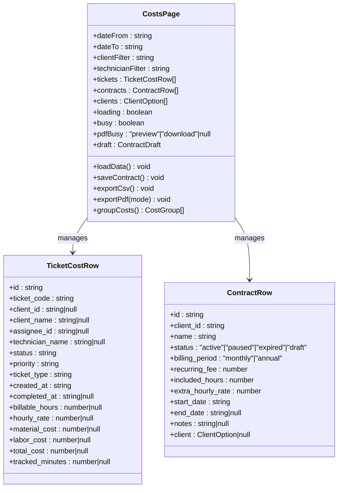
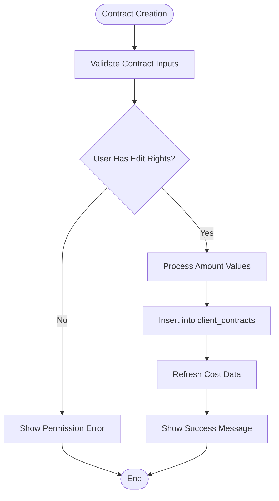
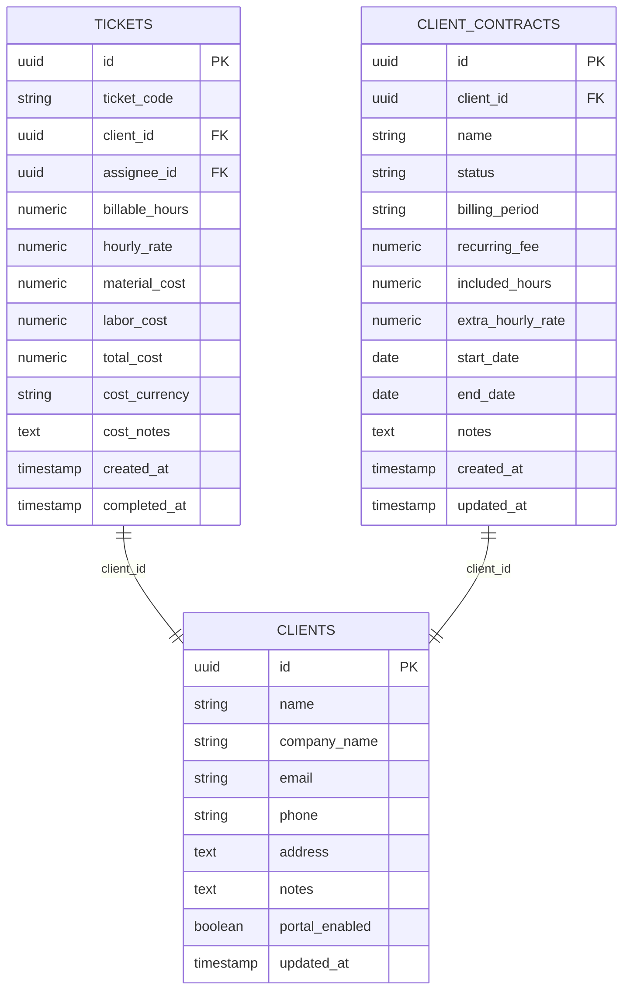
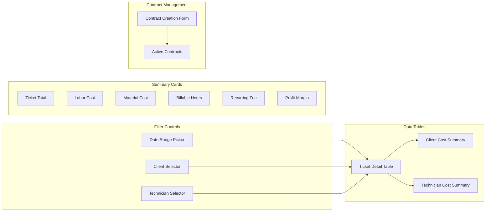
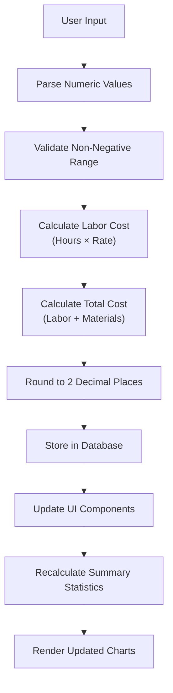
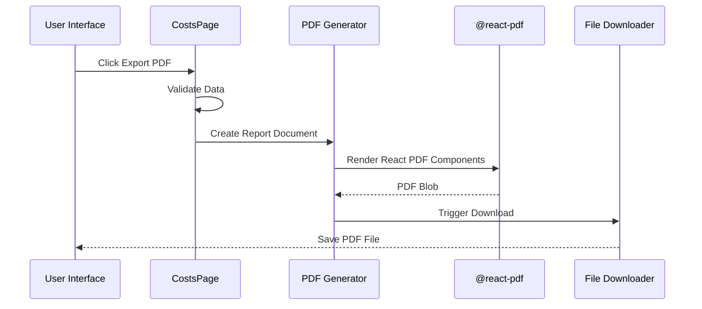
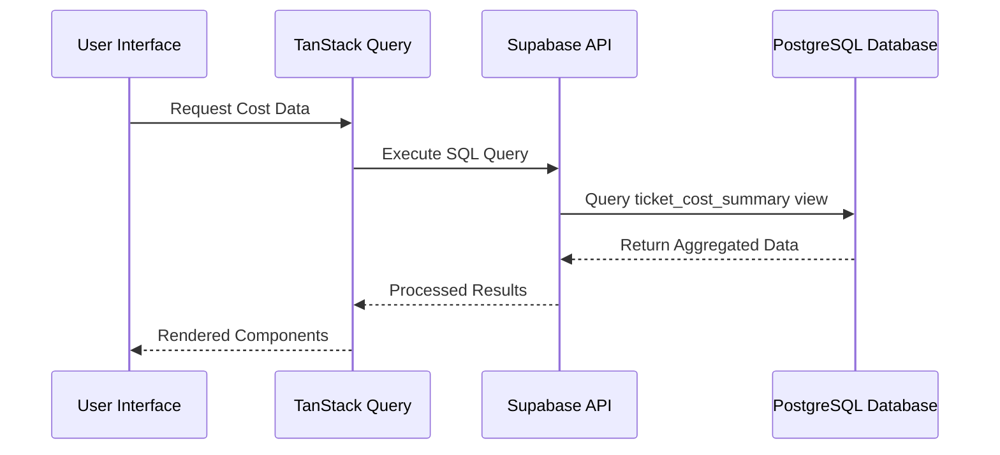
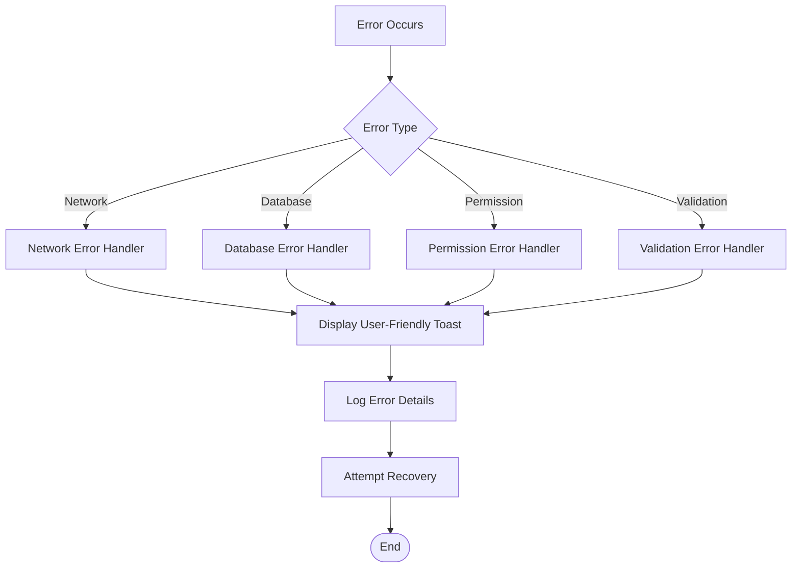

# Cost Management System

<cite>
**Referenced Files in This Document**
- [costs.tsx](file://src/routes/_app/costs.tsx)
- [20260524120000_cost_management.sql](file://supabase/migrations/20260524120000_cost_management.sql)
- [TicketDetailModal.tsx](file://src/components/pcready/TicketDetailModal.tsx)
- [export.tsx](file://src/components/pcready/pdf/export.tsx)
- [shared.tsx](file://src/components/pcready/pdf/shared.tsx)
- [auth-context.tsx](file://src/lib/auth-context.tsx)
- [downloads.ts](file://src/lib/downloads.ts)
</cite>

## Table of Contents
1. [Introduction](#introduction)
2. [System Architecture](#system-architecture)
3. [Core Components](#core-components)
4. [Data Model](#data-model)
5. [User Interface](#user-interface)
6. [PDF Reporting](#pdf-reporting)
7. [Security and Permissions](#security-and-permissions)
8. [Performance Considerations](#performance-considerations)
9. [Integration Points](#integration-points)
10. [Troubleshooting Guide](#troubleshooting-guide)
11. [Conclusion](#conclusion)

## Introduction

The Cost Management System is a comprehensive financial tracking and reporting solution integrated into the PCReady service management platform. This system enables organizations to monitor and analyze their operational costs, track billable hours, manage client contracts, and generate detailed financial reports for invoicing and budgeting purposes.

The system provides real-time visibility into ticket-related expenses, technician labor costs, material expenditures, and recurring contract fees. It serves as a critical tool for financial oversight, helping managers make informed decisions about resource allocation, pricing strategies, and profitability analysis.

## System Architecture

The cost management system follows a modern React-based architecture with server-side data processing and secure database integration:

```mermaid
graph TB
subgraph "Frontend Layer"
UI[Costs Page UI]
Components[React Components]
PDF[PDF Generation]
end
subgraph "Application Layer"
Auth[Authentication Context]
Queries[TanStack Query]
Utils[Utility Functions]
end
subgraph "Data Layer"
Supabase[Supabase Database]
Views[Database Views]
Functions[Stored Procedures]
end
subgraph "External Services"
PDFRenderer[@react-pdf/renderer]
Toast[Notification System]
end
UI --> Components
Components --> Auth
Components --> Queries
Components --> PDF
Queries --> Supabase
Supabase --> Views
Supabase --> Functions
PDF --> PDFRenderer
Components --> Toast
```

**Diagram sources**
- [costs.tsx:1-774](file://src/routes/_app/costs.tsx#L1-L774)
- [auth-context.tsx:1-35](file://src/lib/auth-context.tsx#L1-L35)

## Core Components

### Costs Management Page

The main cost management interface provides comprehensive financial oversight through multiple interactive components:



**Diagram sources**
- [costs.tsx:32-66](file://src/routes/_app/costs.tsx#L32-L66)
- [costs.tsx:94-136](file://src/routes/_app/costs.tsx#L94-L136)

### Contract Management System

The system includes sophisticated contract management capabilities for client service agreements:



**Diagram sources**
- [costs.tsx:188-213](file://src/routes/_app/costs.tsx#L188-L213)

**Section sources**
- [costs.tsx:94-556](file://src/routes/_app/costs.tsx#L94-L556)

## Data Model

The cost management system is built on a robust PostgreSQL data model with specialized views and constraints:

### Database Schema Evolution

The system evolved from a simpler cost tracking model to a comprehensive financial management solution:



**Diagram sources**
- [20260524120000_cost_management.sql:31-45](file://supabase/migrations/20260524120000_cost_management.sql#L31-L45)

### Key Database Features

The system implements several advanced database features:

- **Generated Columns**: Automatic calculation of labor and total costs
- **Constraints**: Data validation for non-negative values
- **Indexes**: Optimized queries for cost filtering and reporting
- **Views**: Pre-aggregated data for efficient reporting
- **Row Level Security**: Role-based access control

**Section sources**
- [20260524120000_cost_management.sql:1-118](file://supabase/migrations/20260524120000_cost_management.sql#L1-L118)

## User Interface

### Interactive Dashboard Components

The user interface provides multiple visualization and interaction mechanisms:



**Diagram sources**
- [costs.tsx:271-555](file://src/routes/_app/costs.tsx#L271-L555)

### Cost Calculation Logic

The system implements sophisticated cost calculation algorithms:



**Diagram sources**
- [costs.tsx:637-649](file://src/routes/_app/costs.tsx#L637-L649)

**Section sources**
- [costs.tsx:271-555](file://src/routes/_app/costs.tsx#L271-L555)

## PDF Reporting

### Comprehensive Report Generation

The system provides professional PDF report generation capabilities:



**Diagram sources**
- [costs.tsx:246-269](file://src/routes/_app/costs.tsx#L246-L269)
- [export.tsx:1-18](file://src/components/pcready/pdf/export.tsx#L1-L18)

### Report Structure

The PDF reports follow a standardized structure with multiple sections:

| Report Section | Content | Purpose |
|---------------|---------|---------|
| Header | Company branding, report title, date | Professional presentation |
| Summary Stats | Key financial metrics | Quick overview |
| Client Breakdown | Cost analysis by client | Client profitability |
| Technician Breakdown | Cost analysis by technician | Performance evaluation |
| Detailed Records | Complete ticket records | Invoice support |

**Section sources**
- [shared.tsx:297-365](file://src/components/pcready/pdf/shared.tsx#L297-L365)
- [costs.tsx:651-750](file://src/routes/_app/costs.tsx#L651-L750)

## Security and Permissions

### Role-Based Access Control

The system implements a tiered permission structure:

```mermaid
graph TD
subgraph "User Roles"
Viewer[Viewer]
Tech[Tech]
Admin[Admin]
end
subgraph "Access Levels"
ReadOnly[Read-Only Access]
EditAccess[Edit Access]
FullControl[Full System Control]
end
Viewer --> ReadOnly
Tech --> EditAccess
Admin --> FullControl
ReadOnly --> ["View Cost Reports"]
EditAccess --> ["Edit Tickets<br/>Create Contracts"]
FullControl --> ["Manage Users<br/>System Configuration"]
```

**Diagram sources**
- [auth-context.tsx:4-26](file://src/lib/auth-context.tsx#L4-L26)

### Contract Management Permissions

Contract creation and modification requires elevated permissions:

| Action | Required Role | Description |
|--------|---------------|-------------|
| View Contracts | Viewer | Read-only access to contract data |
| Create Contracts | Tech/Admin | Add new client contracts |
| Modify Contracts | Admin | Edit existing contracts |
| Delete Contracts | Admin | Remove contracts from system |

**Section sources**
- [costs.tsx:95-96](file://src/routes/_app/costs.tsx#L95-L96)
- [auth-context.tsx:1-35](file://src/lib/auth-context.tsx#L1-L35)

## Performance Considerations

### Database Optimization

The system implements several performance optimization strategies:

- **Indexing Strategy**: Composite indexes on frequently queried columns
- **Materialized Views**: Pre-aggregated data for faster reporting
- **Constraint Validation**: Efficient data validation at insertion time
- **Pagination**: Large dataset handling with limit/offset patterns

### Frontend Performance

- **Memoization**: Computed values cached with dependency arrays
- **Parallel Loading**: Multiple data sources fetched concurrently
- **Virtual Scrolling**: Large tables optimized for rendering
- **Lazy Loading**: PDF generation deferred until needed

## Integration Points

### External Dependencies

The system integrates with several key technologies:

```mermaid
graph LR
subgraph "Core Dependencies"
React[React 18+]
TanStack[TanStack Query]
Supabase[Supabase Client]
end
subgraph "PDF Generation"
ReactPDF[@react-pdf/renderer]
PDFLib[PDFKit]
end
subgraph "UI Components"
LucideIcons[Lucide Icons]
Sonner[Toast Notifications]
end
React --> TanStack
TanStack --> Supabase
React --> ReactPDF
ReactPDF --> PDFLib
React --> LucideIcons
React --> Sonner
```

**Diagram sources**
- [costs.tsx:1-18](file://src/routes/_app/costs.tsx#L1-L18)

### Data Flow Architecture



**Diagram sources**
- [costs.tsx:109-136](file://src/routes/_app/costs.tsx#L109-L136)

## Troubleshooting Guide

### Common Issues and Solutions

| Issue | Symptoms | Solution |
|-------|----------|----------|
| Data Loading Errors | Empty tables, loading spinners | Check network connectivity, verify database permissions |
| PDF Generation Failures | Blank PDFs, export errors | Verify @react-pdf installation, check browser compatibility |
| Permission Denied | Contract creation fails | Ensure user has appropriate role (admin/tech) |
| Performance Issues | Slow loading times | Check database indexes, optimize queries |

### Error Handling Patterns

The system implements comprehensive error handling:



**Diagram sources**
- [costs.tsx:131-135](file://src/routes/_app/costs.tsx#L131-L135)

**Section sources**
- [costs.tsx:131-135](file://src/routes/_app/costs.tsx#L131-L135)

## Conclusion

The Cost Management System represents a comprehensive solution for financial oversight in service management environments. Through its robust data model, intuitive user interface, and professional reporting capabilities, it provides organizations with the tools necessary to effectively manage costs, track profitability, and make informed business decisions.

Key strengths of the system include its real-time data processing, role-based security model, comprehensive reporting features, and seamless integration with the broader PCReady platform. The modular architecture ensures maintainability and extensibility for future enhancements.

The system successfully balances functionality with usability, providing both detailed analytical capabilities for financial teams and accessible summaries for operational stakeholders. Its implementation demonstrates best practices in modern web application development, including proper state management, error handling, and performance optimization.