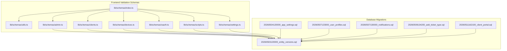
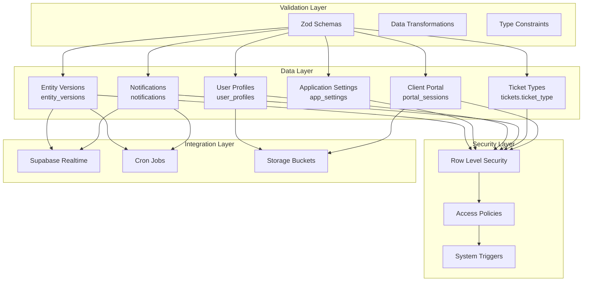
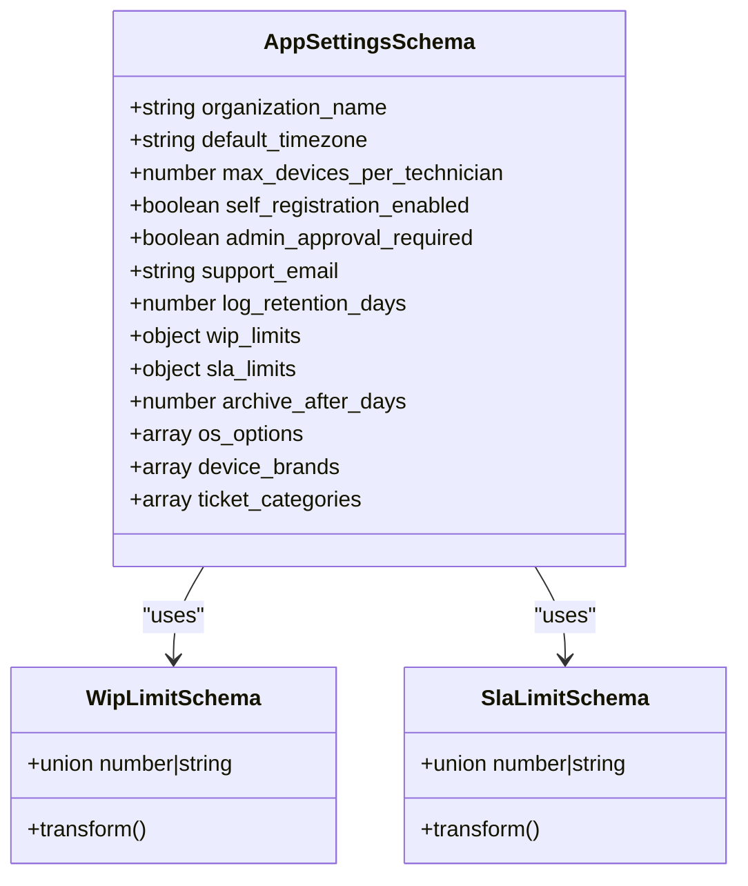
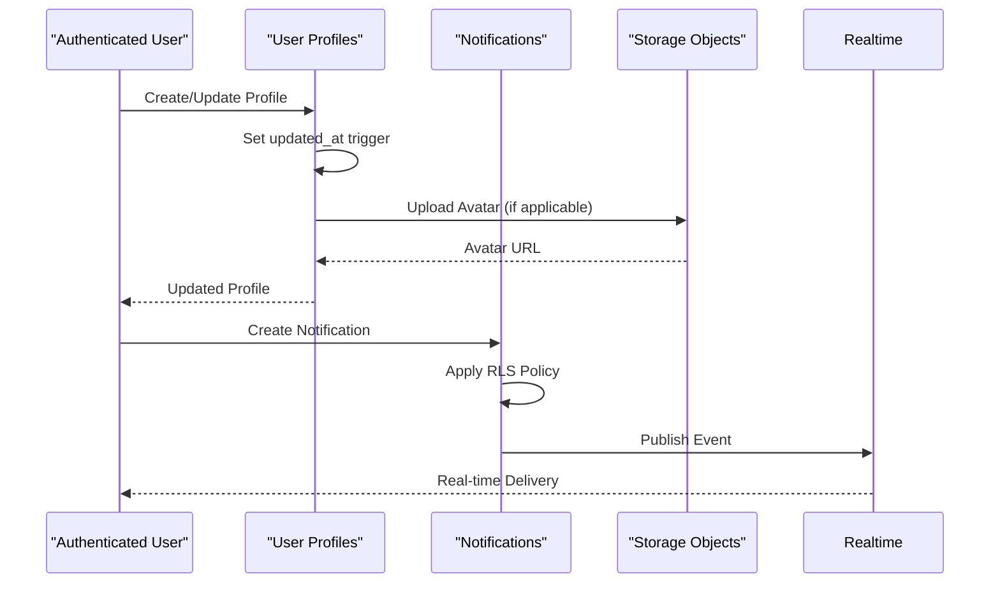
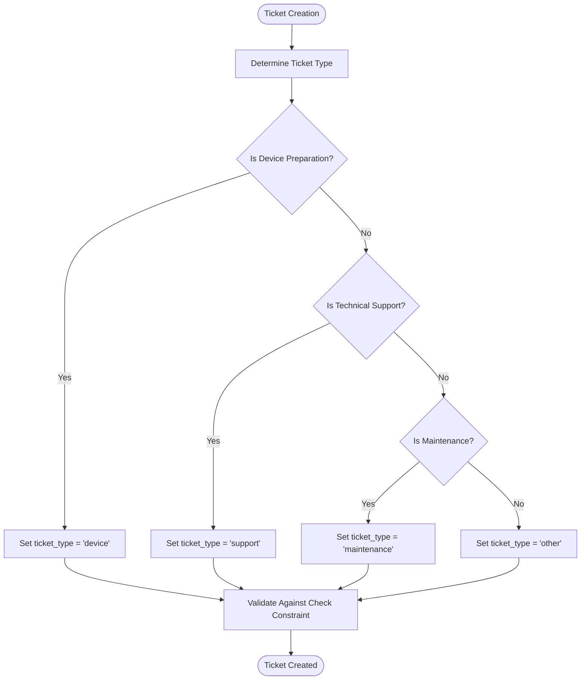
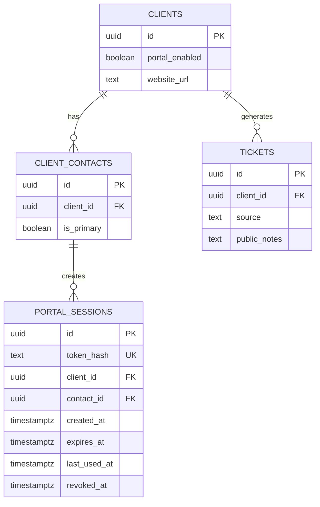
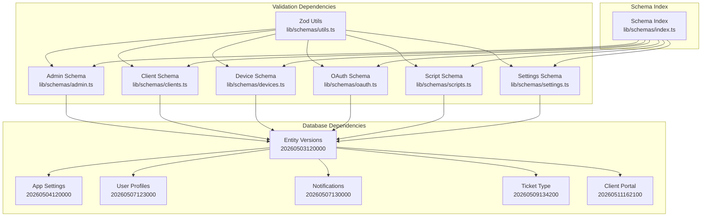

# Database Schema Enhancements

<cite>
**Referenced Files in This Document**
- [lib/schemas/index.ts](file://lib/schemas/index.ts)
- [lib/schemas/utils.ts](file://lib/schemas/utils.ts)
- [lib/schemas/admin.ts](file://lib/schemas/admin.ts)
- [lib/schemas/clients.ts](file://lib/schemas/clients.ts)
- [lib/schemas/devices.ts](file://lib/schemas/devices.ts)
- [lib/schemas/oauth.ts](file://lib/schemas/oauth.ts)
- [lib/schemas/scripts.ts](file://lib/schemas/scripts.ts)
- [lib/schemas/settings.ts](file://lib/schemas/settings.ts)
- [supabase/migrations/20260503120000_entity_versions.sql](file://supabase/migrations/20260503120000_entity_versions.sql)
- [supabase/migrations/20260504120000_app_settings.sql](file://supabase/migrations/20260504120000_app_settings.sql)
- [supabase/migrations/20260507123000_user_profiles.sql](file://supabase/migrations/20260507123000_user_profiles.sql)
- [supabase/migrations/20260507130000_notifications.sql](file://supabase/migrations/20260507130000_notifications.sql)
- [supabase/migrations/20260509134200_add_ticket_type.sql](file://supabase/migrations/20260509134200_add_ticket_type.sql)
- [supabase/migrations/20260511162100_client_portal.sql](file://supabase/migrations/20260511162100_client_portal.sql)
</cite>

## Table of Contents

1. [Introduction](#introduction)
2. [Project Structure](#project-structure)
3. [Core Components](#core-components)
4. [Architecture Overview](#architecture-overview)
5. [Detailed Component Analysis](#detailed-component-analysis)
6. [Dependency Analysis](#dependency-analysis)
7. [Performance Considerations](#performance-considerations)
8. [Troubleshooting Guide](#troubleshooting-guide)
9. [Conclusion](#conclusion)

## Introduction

This document analyzes the database schema enhancements implemented in the project, focusing on the evolution from a unified assets-clients-tickets model to a more granular, versioned, and feature-rich architecture. The enhancements span across entity versioning, application settings, user profiles, notifications, ticket categorization, and client portal capabilities. These changes introduce robust auditing, configurable application behavior, real-time communication channels, and improved operational workflows.

## Project Structure

The schema enhancements are organized around two primary areas:

- Frontend validation schemas: Located under lib/schemas/, these define input validation and transformation rules for various entities.
- Backend migrations: Stored in supabase/migrations/, these implement the database schema changes, policies, and triggers.



**Diagram sources**

- [lib/schemas/index.ts:1-8](file://lib/schemas/index.ts#L1-L8)
- [lib/schemas/utils.ts:1-20](file://lib/schemas/utils.ts#L1-L20)
- [lib/schemas/admin.ts:1-10](file://lib/schemas/admin.ts#L1-L10)
- [lib/schemas/clients.ts:1-27](file://lib/schemas/clients.ts#L1-L27)
- [lib/schemas/devices.ts:1-15](file://lib/schemas/devices.ts#L1-L15)
- [lib/schemas/oauth.ts:1-16](file://lib/schemas/oauth.ts#L1-L16)
- [lib/schemas/scripts.ts:1-15](file://lib/schemas/scripts.ts#L1-L15)
- [lib/schemas/settings.ts:1-49](file://lib/schemas/settings.ts#L1-L49)
- [supabase/migrations/20260503120000_entity_versions.sql:1-41](file://supabase/migrations/20260503120000_entity_versions.sql#L1-L41)
- [supabase/migrations/20260504120000_app_settings.sql:1-41](file://supabase/migrations/20260504120000_app_settings.sql#L1-L41)
- [supabase/migrations/20260507123000_user_profiles.sql:1-107](file://supabase/migrations/20260507123000_user_profiles.sql#L1-L107)
- [supabase/migrations/20260507130000_notifications.sql:1-77](file://supabase/migrations/20260507130000_notifications.sql#L1-L77)
- [supabase/migrations/20260509134200_add_ticket_type.sql:1-20](file://supabase/migrations/20260509134200_add_ticket_type.sql#L1-L20)
- [supabase/migrations/20260511162100_client_portal.sql:1-47](file://supabase/migrations/20260511162100_client_portal.sql#L1-L47)

**Section sources**

- [lib/schemas/index.ts:1-8](file://lib/schemas/index.ts#L1-L8)
- [lib/schemas/utils.ts:1-20](file://lib/schemas/utils.ts#L1-L20)
- [lib/schemas/admin.ts:1-10](file://lib/schemas/admin.ts#L1-L10)
- [lib/schemas/clients.ts:1-27](file://lib/schemas/clients.ts#L1-L27)
- [lib/schemas/devices.ts:1-15](file://lib/schemas/devices.ts#L1-L15)
- [lib/schemas/oauth.ts:1-16](file://lib/schemas/oauth.ts#L1-L16)
- [lib/schemas/scripts.ts:1-15](file://lib/schemas/scripts.ts#L1-L15)
- [lib/schemas/settings.ts:1-49](file://lib/schemas/settings.ts#L1-L49)

## Core Components

The schema enhancement suite comprises three core components:

### Entity Versioning System

The entity versioning system provides comprehensive audit trails for all major entities. It captures create, update, restore, and delete operations with detailed snapshots and change metadata.

Key features:

- UUID primary keys with auto-generated identifiers
- Operation tracking with validation constraints
- Snapshot storage for historical reconstruction
- Change field identification for diff analysis
- Multi-entity support with composite indexing

### Application Settings Framework

The application settings framework enables centralized configuration management with type safety and validation.

Core capabilities:

- JSONB storage for flexible configuration values
- Role-based access control with administrative restrictions
- Default value provision for seamless deployment
- Real-time updates through Row Level Security

### User Profile and Notification Infrastructure

The user profile system extends authentication with comprehensive user metadata and preferences, while the notification system provides real-time communication channels.

Distinctive aspects:

- Comprehensive notification types covering ticket, automation, and mention events
- Real-time publication integration for instant delivery
- Automated cleanup policies for maintaining system hygiene
- Personalized preference management for user experience

**Section sources**

- [supabase/migrations/20260503120000_entity_versions.sql:1-41](file://supabase/migrations/20260503120000_entity_versions.sql#L1-L41)
- [supabase/migrations/20260504120000_app_settings.sql:1-41](file://supabase/migrations/20260504120000_app_settings.sql#L1-L41)
- [supabase/migrations/20260507123000_user_profiles.sql:1-107](file://supabase/migrations/20260507123000_user_profiles.sql#L1-L107)
- [supabase/migrations/20260507130000_notifications.sql:1-77](file://supabase/migrations/20260507130000_notifications.sql#L1-L77)

## Architecture Overview

The enhanced database architecture follows a layered approach with clear separation of concerns:



**Diagram sources**

- [supabase/migrations/20260503120000_entity_versions.sql:29-41](file://supabase/migrations/20260503120000_entity_versions.sql#L29-L41)
- [supabase/migrations/20260504120000_app_settings.sql:9-30](file://supabase/migrations/20260504120000_app_settings.sql#L9-L30)
- [supabase/migrations/20260507123000_user_profiles.sql:18-26](file://supabase/migrations/20260507123000_user_profiles.sql#L18-L26)
- [supabase/migrations/20260507130000_notifications.sql:22-37](file://supabase/migrations/20260507130000_notifications.sql#L22-L37)
- [supabase/migrations/20260509134200_add_ticket_type.sql:1-20](file://supabase/migrations/20260509134200_add_ticket_type.sql#L1-L20)
- [supabase/migrations/20260511162100_client_portal.sql:36-42](file://supabase/migrations/20260511162100_client_portal.sql#L36-L42)

## Detailed Component Analysis

### Entity Versioning System

The entity versioning system represents a comprehensive audit trail mechanism designed to capture all significant changes to core business entities.

```mermaid
erDiagram
ENTITY_VERSIONS {
uuid id PK
text entity_type
uuid entity_id
integer version_number
text operation
jsonb snapshot
jsonb previous_snapshot
jsonb changed_fields
text change_note
timestamptz created_at
uuid created_by
text app_version
uuid request_id
}
ENTITY_VERSIONS {
"Unique constraint: entity_type + entity_id + version_number"
"Index: entity_type + entity_id + created_at DESC"
}
```

**Diagram sources**

- [supabase/migrations/20260503120000_entity_versions.sql:5-19](file://supabase/migrations/20260503120000_entity_versions.sql#L5-L19)

Implementation characteristics:

- **Operation Tracking**: Validates operations against predefined constraints (create, update, restore, delete)
- **Snapshot Management**: Maintains complete entity state for historical reconstruction
- **Change Detection**: Identifies modified fields for efficient diff analysis
- **Multi-entity Support**: Generic design supporting any entity type through entity_type field
- **Performance Optimization**: Strategic indexing for efficient querying and sorting

**Section sources**

- [supabase/migrations/20260503120000_entity_versions.sql:1-41](file://supabase/migrations/20260503120000_entity_versions.sql#L1-L41)

### Application Settings Framework

The application settings framework provides a centralized configuration management system with robust validation and access controls.



**Diagram sources**

- [lib/schemas/settings.ts:4-46](file://lib/schemas/settings.ts#L4-L46)

Key validation features:

- **Type Transformation**: Automatic conversion from string to number for numeric fields
- **Range Validation**: Minimum value enforcement for critical parameters
- **Default Values**: Comprehensive defaults for seamless deployment
- **Array Configuration**: Flexible lists for OS options, brands, and categories
- **Role-Based Access**: Administrative restrictions for sensitive settings

**Section sources**

- [lib/schemas/settings.ts:1-49](file://lib/schemas/settings.ts#L1-L49)
- [supabase/migrations/20260504120000_app_settings.sql:1-41](file://supabase/migrations/20260504120000_app_settings.sql#L1-L41)

### User Profile and Notification Infrastructure

The user profile system extends authentication with comprehensive user metadata and integrates with a sophisticated notification system.



**Diagram sources**

- [supabase/migrations/20260507123000_user_profiles.sql:28-31](file://supabase/migrations/20260507123000_user_profiles.sql#L28-L31)
- [supabase/migrations/20260507130000_notifications.sql:39-53](file://supabase/migrations/20260507130000_notifications.sql#L39-L53)

Notification system capabilities:

- **Event Types**: Comprehensive coverage of ticket, automation, and mention events
- **Real-time Delivery**: Integration with Supabase realtime for instant notifications
- **Cleanup Automation**: Scheduled jobs for removing old notifications
- **Personal Preferences**: User-controlled notification channels and preferences

**Section sources**

- [supabase/migrations/20260507123000_user_profiles.sql:1-107](file://supabase/migrations/20260507123000_user_profiles.sql#L1-L107)
- [supabase/migrations/20260507130000_notifications.sql:1-77](file://supabase/migrations/20260507130000_notifications.sql#L1-L77)

### Ticket Type Enhancement

The ticket type enhancement introduces categorical classification for tickets, enabling specialized workflows and reporting.



**Diagram sources**

- [supabase/migrations/20260509134200_add_ticket_type.sql:1-20](file://supabase/migrations/20260509134200_add_ticket_type.sql#L1-L20)

Classification categories:

- **Device**: PC preparation work orders
- **Support**: Technical assistance requests
- **Maintenance**: Preventive and routine maintenance tasks
- **Other**: Miscellaneous or special cases

**Section sources**

- [supabase/migrations/20260509134200_add_ticket_type.sql:1-20](file://supabase/migrations/20260509134200_add_ticket_type.sql#L1-L20)

### Client Portal Integration

The client portal integration enables external customer access to ticketing workflows while maintaining security and auditability.



**Diagram sources**

- [supabase/migrations/20260511162100_client_portal.sql:20-34](file://supabase/migrations/20260511162100_client_portal.sql#L20-L34)

Portal capabilities:

- **Session Management**: Secure token-based authentication for portal access
- **Dual Source Tracking**: Distinguishes internal vs portal-created tickets
- **Public Notes**: Customer-visible notes for transparency
- **Role-Based Access**: Administrative controls for session lifecycle

**Section sources**

- [supabase/migrations/20260511162100_client_portal.sql:1-47](file://supabase/migrations/20260511162100_client_portal.sql#L1-L47)

## Dependency Analysis

The schema enhancements demonstrate a well-structured dependency hierarchy with clear separation of concerns:



**Diagram sources**

- [lib/schemas/index.ts:1-8](file://lib/schemas/index.ts#L1-L8)
- [lib/schemas/utils.ts:1-20](file://lib/schemas/utils.ts#L1-L20)
- [lib/schemas/admin.ts:1-10](file://lib/schemas/admin.ts#L1-L10)
- [lib/schemas/clients.ts:1-27](file://lib/schemas/clients.ts#L1-L27)
- [lib/schemas/devices.ts:1-15](file://lib/schemas/devices.ts#L1-L15)
- [lib/schemas/oauth.ts:1-16](file://lib/schemas/oauth.ts#L1-L16)
- [lib/schemas/scripts.ts:1-15](file://lib/schemas/scripts.ts#L1-L15)
- [lib/schemas/settings.ts:1-49](file://lib/schemas/settings.ts#L1-L49)

**Section sources**

- [lib/schemas/index.ts:1-8](file://lib/schemas/index.ts#L1-L8)
- [lib/schemas/utils.ts:1-20](file://lib/schemas/utils.ts#L1-L20)
- [lib/schemas/admin.ts:1-10](file://lib/schemas/admin.ts#L1-L10)
- [lib/schemas/clients.ts:1-27](file://lib/schemas/clients.ts#L1-L27)
- [lib/schemas/devices.ts:1-15](file://lib/schemas/devices.ts#L1-L15)
- [lib/schemas/oauth.ts:1-16](file://lib/schemas/oauth.ts#L1-L16)
- [lib/schemas/scripts.ts:1-15](file://lib/schemas/scripts.ts#L1-L15)
- [lib/schemas/settings.ts:1-49](file://lib/schemas/settings.ts#L1-L49)

## Performance Considerations

The schema enhancements incorporate several performance optimization strategies:

### Indexing Strategy

- **Composite Indexes**: Strategic multi-column indexes for frequently queried combinations
- **Descending Sort Optimization**: Optimized ordering for time-series queries
- **Partial Indexes**: Selective indexing for unread notifications and specific conditions

### Security Performance

- **Row Level Security**: Efficient policy evaluation at the database level
- **Minimal Overhead**: Policies designed for optimal performance impact
- **Selective Enforcement**: Context-aware security application

### Data Integrity

- **Constraint Validation**: Early detection of invalid data at insertion time
- **Type Safety**: Compile-time validation through Zod schemas
- **Default Values**: Reduced NULL handling overhead

## Troubleshooting Guide

Common issues and resolutions for the enhanced schema:

### Entity Versioning Issues

- **Duplicate Version Numbers**: Verify unique constraint enforcement and proper version increment logic
- **Snapshot Corruption**: Check JSONB serialization and ensure consistent data transformation
- **Performance Degradation**: Monitor index usage and consider partitioning for high-volume entities

### Application Settings Problems

- **Permission Denied**: Verify administrative role membership and policy evaluation
- **Configuration Conflicts**: Check for concurrent updates and implement proper locking mechanisms
- **Default Value Issues**: Validate migration order and ensure proper seeding

### User Profile and Notification Challenges

- **Avatar Upload Failures**: Verify storage bucket configuration and user permission checks
- **Notification Delivery Issues**: Check realtime publication setup and client subscription status
- **Preference Sync Problems**: Implement proper event-driven updates and cache invalidation

**Section sources**

- [supabase/migrations/20260503120000_entity_versions.sql:21-27](file://supabase/migrations/20260503120000_entity_versions.sql#L21-L27)
- [supabase/migrations/20260504120000_app_settings.sql:12-30](file://supabase/migrations/20260504120000_app_settings.sql#L12-L30)
- [supabase/migrations/20260507123000_user_profiles.sql:40-71](file://supabase/migrations/20260507123000_user_profiles.sql#L40-L71)
- [supabase/migrations/20260507130000_notifications.sql:39-53](file://supabase/migrations/20260507130000_notifications.sql#L39-L53)

## Conclusion

The database schema enhancements represent a comprehensive evolution toward a more robust, auditable, and user-centric system. The implementation demonstrates careful consideration of security, performance, and maintainability through:

- **Comprehensive Auditing**: Entity versioning provides complete change tracking and historical reconstruction
- **Centralized Configuration**: Application settings framework enables dynamic, role-based configuration management
- **Enhanced User Experience**: User profiles and notifications improve user engagement and communication
- **Operational Flexibility**: Ticket categorization and client portal integration support diverse workflow requirements
- **Architectural Soundness**: Well-structured dependencies and clear separation of concerns ensure long-term maintainability

These enhancements establish a solid foundation for future development while providing immediate benefits in terms of operational visibility, user experience, and system reliability.
