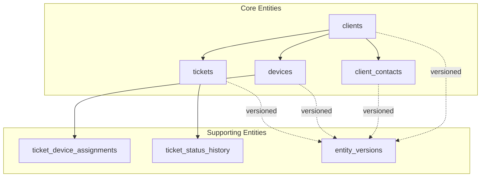
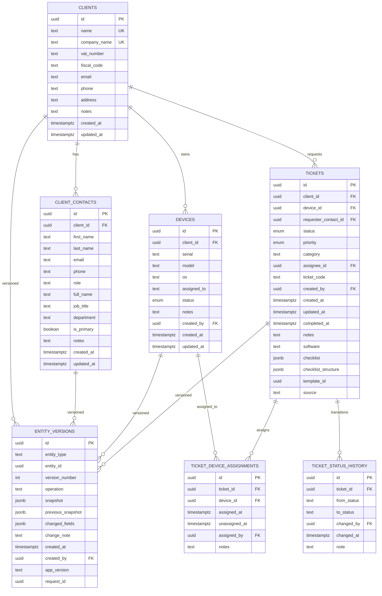
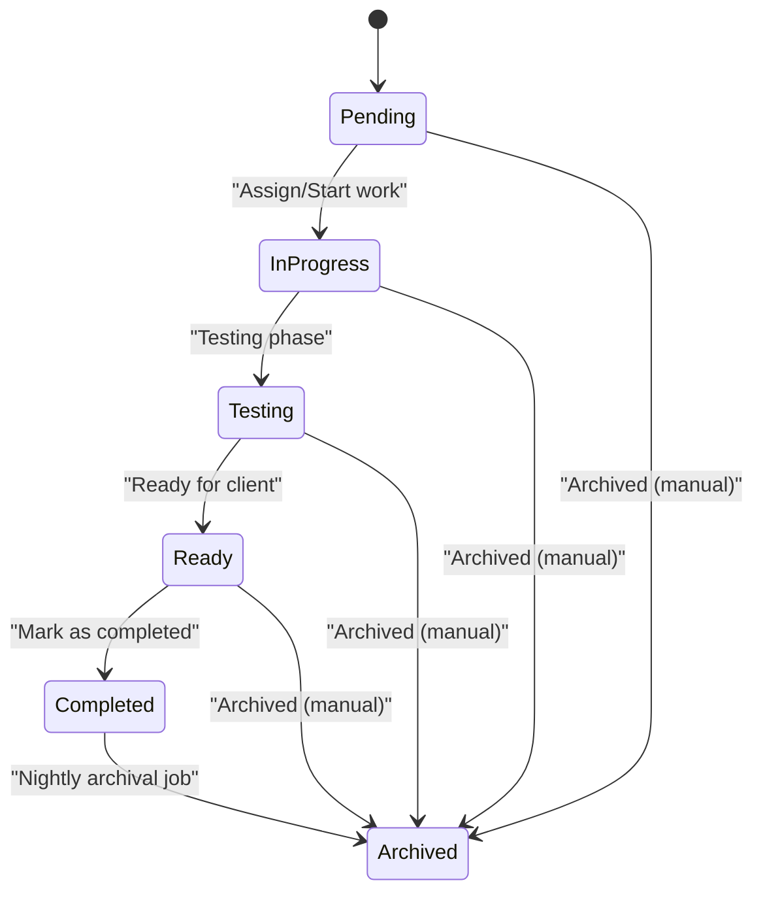
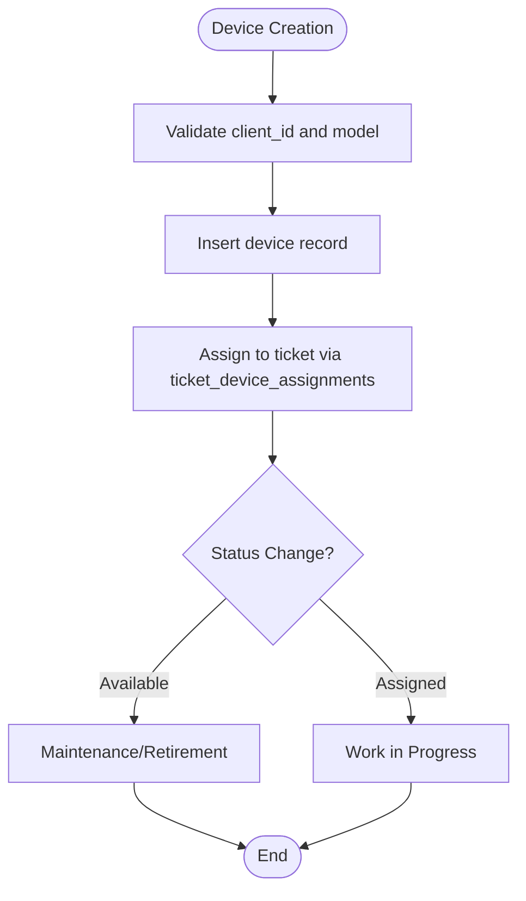
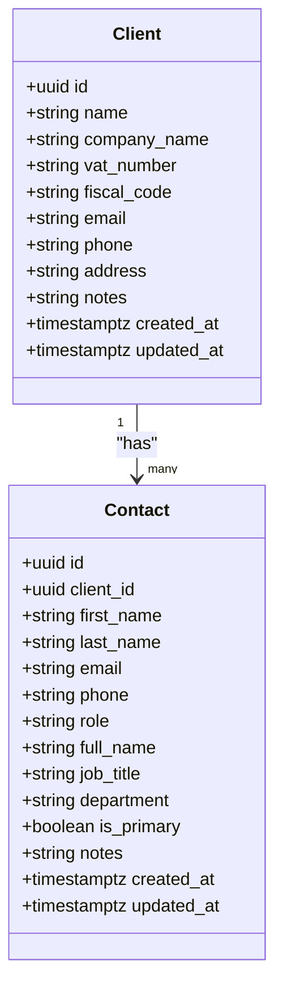
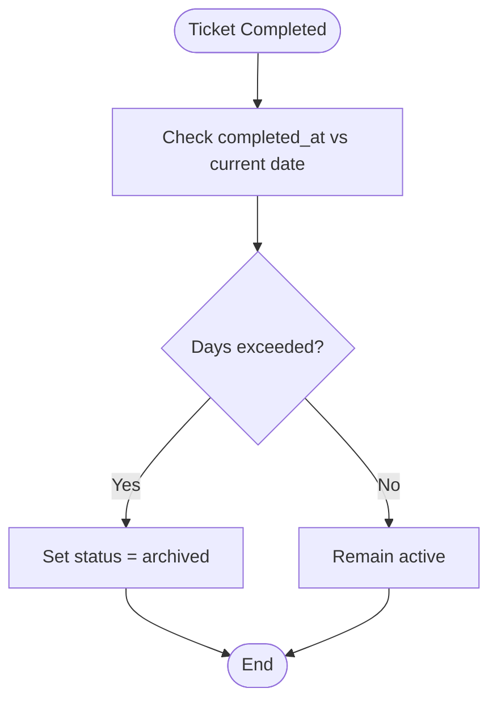
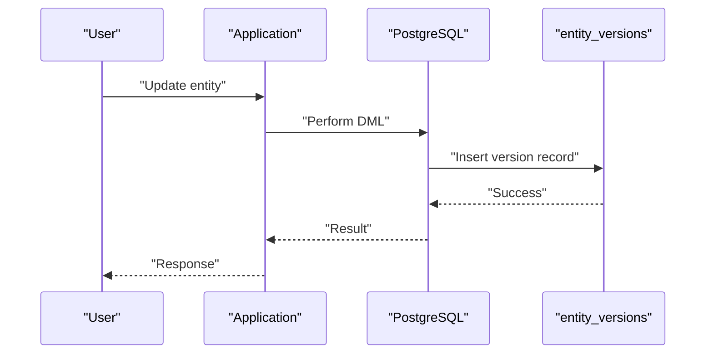
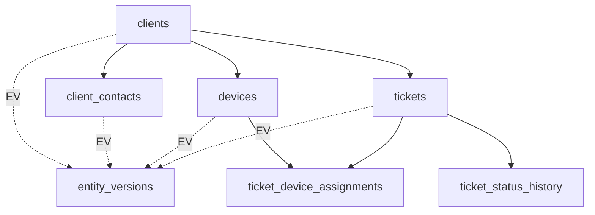
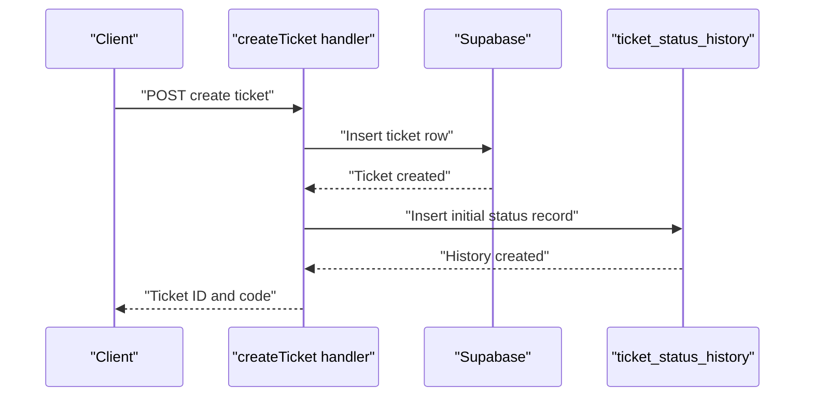

# Domain Model and Database Schema

<cite>
**Referenced Files in This Document**
- [20260430170000_split_assets_clients_tickets.sql](file://supabase/migrations/20260430170000_split_assets_clients_tickets.sql)
- [20260430182000_expand_clients_contacts.sql](file://supabase/migrations/20260430182000_expand_clients_contacts.sql)
- [20260430193000_asset_ticket_separation_history.sql](file://supabase/migrations/20260430193000_asset_ticket_separation_history.sql)
- [20260509002000_complete_ticket_device_separation.sql](file://supabase/migrations/20260509002000_complete_ticket_device_separation.sql)
- [20260511180000_ticket_status_history.sql](file://supabase/migrations/20260511180000_ticket_status_history.sql)
- [20260511190000_ticket_completed_status.sql](file://supabase/migrations/20260511190000_ticket_completed_status.sql)
- [20260511193000_add_archived_status.sql](file://supabase/migrations/20260511193000_add_archived_status.sql)
- [20260511194000_add_archived_enum.sql](file://supabase/migrations/20260511194000_add_archived_enum.sql)
- [20260503120000_entity_versions.sql](file://supabase/migrations/20260503120000_entity_versions.sql)
- [20260509123300_harden_entity_versions.sql](file://supabase/migrations/20260509123300_harden_entity_versions.sql)
- [20260430154500_ticket_code_sequence_trigger.sql](file://supabase/migrations/20260430154500_ticket_code_sequence_trigger.sql)
- [20260514182000_realtime_replica_identity_core_tables.sql](file://supabase/migrations/20260514182000_realtime_replica_identity_core_tables.sql)
- [20260515120000_realtime_ticket_device_assignments.sql](file://supabase/migrations/20260515120000_realtime_ticket_device_assignments.sql)
- [20260514210000_tickets_tech_delete_policy.sql](fileAssistant: "Client schema definition"
- [clients.ts](file://lib/schemas/clients.ts)
- [devices.ts](file://lib/schemas/devices.ts)
- [tickets.ts](file://src/lib/tickets.ts)
- [database.types.ts](file://src/types/database.types.ts)
</cite>

## Table of Contents
1. [Introduction](#introduction)
2. [Project Structure](#project-structure)
3. [Core Components](#core-components)
4. [Architecture Overview](#architecture-overview)
5. [Detailed Component Analysis](#detailed-component-analysis)
6. [Dependency Analysis](#dependency-analysis)
7. [Performance Considerations](#performance-considerations)
8. [Troubleshooting Guide](#troubleshooting-guide)
9. [Conclusion](#conclusion)
10. [Appendices](#appendices)

## Introduction
This document provides comprehensive domain model and database schema documentation for PCReady's core entities: clients, client_contacts, devices, and tickets. It details table structures, relationships, constraints, indexes, and policies; explains the ticket workflow model and device inventory model; outlines data lifecycle management and versioning; and describes security controls via Supabase Row Level Security (RLS). The goal is to enable developers, administrators, and stakeholders to understand how data flows through the system and how business rules are enforced at the database level.

## Project Structure
The domain model is implemented primarily through PostgreSQL schema migrations under the Supabase configuration, with supporting TypeScript schemas and server-side logic validating and inserting data. The key areas covered here are:
- Core domain tables: clients, client_contacts, devices, tickets
- Supporting tables: ticket_device_assignments, ticket_status_history, entity_versions
- Security: RLS policies and access control
- Lifecycle: status tracking, archival, and versioning

**Diagram sources**
- [20260430170000_split_assets_clients_tickets.sql:3-40](file://supabase/migrations/20260430170000_split_assets_clients_tickets.sql#L3-L40)
- [20260430193000_asset_ticket_separation_history.sql:4-12](file://supabase/migrations/20260430193000_asset_ticket_separation_history.sql#L4-L12)
- [20260503120000_entity_versions.sql:5-19](file://supabase/migrations/20260503120000_entity_versions.sql#L5-L19)

**Section sources**
- [20260430170000_split_assets_clients_tickets.sql:1-137](file://supabase/migrations/20260430170000_split_assets_clients_tickets.sql#L1-L137)
- [20260430182000_expand_clients_contacts.sql:1-29](file://supabase/migrations/20260430182000_expand_clients_contacts.sql#L1-L29)
- [20260430193000_asset_ticket_separation_history.sql:1-89](file://supabase/migrations/20260430193000_asset_ticket_separation_history.sql#L1-L89)
- [20260503120000_entity_versions.sql:1-41](file://supabase/migrations/20260503120000_entity_versions.sql#L1-L41)

## Core Components
This section defines the core domain entities and their attributes, constraints, and relationships.

### Clients
- Purpose: Organizations or companies served by PCReady.
- Primary key: id (UUID)
- Notable constraints:
  - name is unique and not null
  - Optional company_name with unique constraint
  - Timestamps created_at/updated_at managed by triggers
- Security: RLS enabled; policies allow authenticated users to read and tech/admin users to insert/update/delete.

Fields summary:
- id: UUID, PK
- name: Text, not null, unique
- company_name: Text, unique when present
- vat_number: Text
- fiscal_code: Text
- email: Text
- phone: Text
- address: Text
- notes: Text
- created_at/updated_at: Timestamptz

Indexes and constraints:
- Unique index on lower(name)
- Optional unique index on lower(company_name)
- RLS policies for authenticated access

**Section sources**
- [20260430170000_split_assets_clients_tickets.sql:3-13](file://supabase/migrations/20260430170000_split_assets_clients_tickets.sql#L3-L13)
- [20260430182000_expand_clients_contacts.sql:1-29](file://supabase/migrations/20260430182000_expand_clients_contacts.sql#L1-L29)
- [20260430170000_split_assets_clients_tickets.sql:46-71](file://supabase/migrations/20260430170000_split_assets_clients_tickets.sql#L46-L71)

### Client Contacts
- Purpose: Individuals associated with clients (requesters, contacts).
- Primary key: id (UUID)
- Foreign key: client_id → clients.id (CASCADE on delete)
- Notable constraints:
  - Composite unique on (client_id, first_name, last_name, email)
  - Optional full_name, job_title, department, is_primary, notes
- Security: RLS enabled; policies mirror clients.

Fields summary:
- id: UUID, PK
- client_id: UUID, FK to clients.id
- first_name: Text, not null
- last_name: Text
- email: Text
- phone: Text
- role: Text
- full_name: Text
- job_title: Text
- department: Text
- is_primary: Boolean, default false
- notes: Text
- created_at/updated_at: Timestamptz

Indexes and constraints:
- Composite unique index on (client_id, first_name, last_name, email)
- Unique index on (client_id) where is_primary is true
- RLS policies for authenticated access

**Section sources**
- [20260430170000_split_assets_clients_tickets.sql:15-26](file://supabase/migrations/20260430170000_split_assets_clients_tickets.sql#L15-L26)
- [20260430182000_expand_clients_contacts.sql:9-28](file://supabase/migrations/20260430182000_expand_clients_contacts.sql#L9-L28)
- [20260430170000_split_assets_clients_tickets.sql:47-71](file://supabase/migrations/20260430170000_split_assets_clients_tickets.sql#L47-L71)

### Devices
- Purpose: Physical or virtual computing assets tracked against clients.
- Primary key: id (UUID)
- Foreign key: client_id → clients.id (RESTRICT on delete)
- Enum: status (available, assigned, maintenance, retired)
- Notable constraints:
  - Unique index on lower(serial) where serial is not null/empty
  - Optional created_by → auth.users(id) (SET NULL on delete)
- Security: RLS enabled; policies mirror clients.

Fields summary:
- id: UUID, PK
- client_id: UUID, FK to clients.id
- serial: Text
- model: Text, not null
- os: Text
- assigned_to: Text
- status: Enum, default available
- notes: Text
- created_by: UUID → auth.users(id)
- created_at/updated_at: Timestamptz

Indexes and constraints:
- Unique index on lower(serial) with WHERE clause
- RLS policies for authenticated access

**Section sources**
- [20260430170000_split_assets_clients_tickets.sql:28-40](file://supabase/migrations/20260430170000_split_assets_clients_tickets.sql#L28-L40)
- [20260430170000_split_assets_clients_tickets.sql:42-44](file://supabase/migrations/20260430170000_split_assets_clients_tickets.sql#L42-L44)
- [20260430170000_split_assets_clients_tickets.sql:47-79](file://supabase/migrations/20260430170000_split_assets_clients_tickets.sql#L47-L79)

### Tickets
- Purpose: Work orders tracking client requests, devices, and status transitions.
- Primary key: id (UUID)
- Foreign keys:
  - client_id → clients.id (SET NULL on delete)
  - device_id → devices.id (SET NULL on delete)
  - requester_contact_id → client_contacts.id (SET NULL on delete)
- Status workflow: pending, in-progress, testing, ready, completed, archived
- Additional fields: timestamps, priority, category, assignee, notes, source, checklist, template metadata
- Security: RLS enabled; policies allow authenticated users to read and tech/admin users to insert/update/delete.

Fields summary:
- id: UUID, PK
- client_id: UUID → clients.id
- device_id: UUID → devices.id
- requester_contact_id: UUID → client_contacts.id
- status: Enum with workflow values
- priority: Enum (low, med, high)
- category: Text
- assignee_id: UUID → auth.users(id)
- ticket_code: Generated sequence
- created_by: UUID → auth.users(id)
- created_at/updated_at: Timestamptz
- completed_at: Timestamptz (when status becomes completed)
- notes, software, checklist, checklist_structure, template_id, source

Indexes and constraints:
- Indexes on client_id, device_id, requester_contact_id
- Status check constraint expanded to include completed and archived
- RLS policies for authenticated access

**Section sources**
- [20260430170000_split_assets_clients_tickets.sql:81-84](file://supabase/migrations/20260430170000_split_assets_clients_tickets.sql#L81-L84)
- [20260511190000_ticket_completed_status.sql:4-23](file://supabase/migrations/20260511190000_ticket_completed_status.sql#L4-L23)
- [20260511193000_add_archived_status.sql:4-20](file://supabase/migrations/20260511193000_add_archived_status.sql#L4-L20)
- [20260430170000_split_assets_clients_tickets.sql:46-79](file://supabase/migrations/20260430170000_split_assets_clients_tickets.sql#L46-L79)

### Ticket Device Assignments
- Purpose: Historical tracking of which device was assigned to which ticket over time.
- Primary key: id (UUID)
- Foreign keys: ticket_id → tickets.id (CASCADE), device_id → devices.id (RESTRICT)
- Fields: assigned_at, unassigned_at, assigned_by → auth.users(id), notes
- Security: RLS enabled; policies mirror tickets.

Indexes and constraints:
- Indexes on (ticket_id, assigned_at DESC) and (device_id, assigned_at DESC)
- RLS policies for authenticated access

**Section sources**
- [20260430193000_asset_ticket_separation_history.sql:4-12](file://supabase/migrations/20260430193000_asset_ticket_separation_history.sql#L4-L12)
- [20260430193000_asset_ticket_separation_history.sql:14-18](file://supabase/migrations/20260430193000_asset_ticket_separation_history.sql#L14-L18)
- [20260430193000_asset_ticket_separation_history.sql:20-30](file://supabase/migrations/20260430193000_asset_ticket_separation_history.sql#L20-L30)

### Ticket Status History
- Purpose: Immutable audit trail of status transitions for tickets.
- Primary key: id (UUID)
- Foreign key: ticket_id → tickets.id (CASCADE)
- Fields: from_status, to_status, changed_by → auth.users(id), changed_at, note
- Security: RLS enabled; policies allow authenticated users to view all history and clients to view history for their own tickets.

Indexes and constraints:
- Indexes on ticket_id, changed_at, changed_by
- RLS policies for selective visibility

**Section sources**
- [20260511180000_ticket_status_history.sql:5-13](file://supabase/migrations/20260511180000_ticket_status_history.sql#L5-L13)
- [20260511180000_ticket_status_history.sql:15-18](file://supabase/migrations/20260511180000_ticket_status_history.sql#L15-L18)
- [20260511180000_ticket_status_history.sql:20-59](file://supabase/migrations/20260511180000_ticket_status_history.sql#L20-L59)

### Entity Versions
- Purpose: Application-wide versioning of entities for audit and restore.
- Primary key: id (UUID)
- Fields: entity_type, entity_id, version_number, operation (create, update, restore, delete), snapshot, previous_snapshot, changed_fields, change_note, created_at, created_by → auth.users(id), app_version, request_id
- Constraints: Unique index on (entity_type, entity_id, version_number); operation check constraint
- Security: RLS enabled; policies allow authenticated users to view versions and create versions with constraints

**Section sources**
- [20260503120000_entity_versions.sql:5-19](file://supabase/migrations/20260503120000_entity_versions.sql#L5-L19)
- [20260509123300_harden_entity_versions.sql:1-44](file://supabase/migrations/20260509123300_harden_entity_versions.sql#L1-L44)

## Architecture Overview
The domain model centers around three core entities with explicit relationships and supporting tables for historical tracking and versioning. The architecture enforces referential integrity, data validation, and access control through database constraints and RLS policies.

**Diagram sources**
- [20260430170000_split_assets_clients_tickets.sql:3-40](file://supabase/migrations/20260430170000_split_assets_clients_tickets.sql#L3-L40)
- [20260430193000_asset_ticket_separation_history.sql:4-12](file://supabase/migrations/20260430193000_asset_ticket_separation_history.sql#L4-L12)
- [20260511180000_ticket_status_history.sql:5-13](file://supabase/migrations/20260511180000_ticket_status_history.sql#L5-L13)
- [20260503120000_entity_versions.sql:5-19](file://supabase/migrations/20260503120000_entity_versions.sql#L5-L19)

## Detailed Component Analysis

### Ticket Workflow Model
The ticket workflow tracks status transitions through the following states: pending, in-progress, testing, ready, completed, archived. Transitions are recorded in ticket_status_history, ensuring immutability and auditability.

**Diagram sources**
- [20260511190000_ticket_completed_status.sql:16-18](file://supabase/migrations/20260511190000_ticket_completed_status.sql#L16-L18)
- [20260511193000_add_archived_status.sql:14-16](file://supabase/migrations/20260511193000_add_archived_status.sql#L14-L16)
- [20260511180000_ticket_status_history.sql:5-13](file://supabase/migrations/20260511180000_ticket_status_history.sql#L5-L13)

Key behaviors:
- Status transitions are logged with from_status, to_status, changed_by, changed_at, and optional note.
- completed_at is set when status becomes completed.
- Nightly job archives completed tickets older than a configurable number of days.

**Section sources**
- [20260511180000_ticket_status_history.sql:1-67](file://supabase/migrations/20260511180000_ticket_status_history.sql#L1-L67)
- [20260511190000_ticket_completed_status.sql:1-66](file://supabase/migrations/20260511190000_ticket_completed_status.sql#L1-L66)
- [20260511193000_add_archived_status.sql:1-60](file://supabase/migrations/20260511193000_add_archived_status.sql#L1-L60)
- [20260511194000_add_archived_enum.sql:1-19](file://supabase/migrations/20260511194000_add_archived_enum.sql#L1-L19)

### Device Inventory Model
Devices are owned by clients and tracked for availability and assignment. The model supports:
- Asset tracking via serial/model
- Assignment to tickets via ticket_device_assignments
- Status lifecycle (available, assigned, maintenance, retired)

**Diagram sources**
- [20260430170000_split_assets_clients_tickets.sql:28-40](file://supabase/migrations/20260430170000_split_assets_clients_tickets.sql#L28-L40)
- [20260430193000_asset_ticket_separation_history.sql:4-12](file://supabase/migrations/20260430193000_asset_ticket_separation_history.sql#L4-L12)

Constraints and indexes:
- Unique index on lower(serial) prevents duplicates
- Device ownership enforced via foreign key to clients
- Device assignment history tracked via ticket_device_assignments

**Section sources**
- [20260430170000_split_assets_clients_tickets.sql:28-44](file://supabase/migrations/20260430170000_split_assets_clients_tickets.sql#L28-L44)
- [20260430193000_asset_ticket_separation_history.sql:1-89](file://supabase/migrations/20260430193000_asset_ticket_separation_history.sql#L1-L89)

### Client-Contact Relationship Model
Clients can have multiple contacts; a contact belongs to exactly one client. The model supports:
- Primary contact designation
- Full name derivation
- Unique composite constraint preventing duplicate contact entries per client

**Diagram sources**
- [20260430170000_split_assets_clients_tickets.sql:3-26](file://supabase/migrations/20260430170000_split_assets_clients_tickets.sql#L3-L26)
- [20260430182000_expand_clients_contacts.sql:1-29](file://supabase/migrations/20260430182000_expand_clients_contacts.sql#L1-L29)

**Section sources**
- [20260430170000_split_assets_clients_tickets.sql:15-26](file://supabase/migrations/20260430170000_split_assets_clients_tickets.sql#L15-L26)
- [20260430182000_expand_clients_contacts.sql:9-28](file://supabase/migrations/20260430182000_expand_clients_contacts.sql#L9-L28)

### Data Access Patterns
Common access patterns supported by the schema:
- List tickets by client with status filtering
- Retrieve device assignment history for a ticket
- View status history for transparency
- Query clients with contacts and devices

These patterns leverage indexes on client_id, device_id, requester_contact_id, status, and ticket_id.

**Section sources**
- [20260511190000_ticket_completed_status.sql:38-41](file://supabase/migrations/20260511190000_ticket_completed_status.sql#L38-L41)
- [20260509002000_complete_ticket_device_separation.sql:13-23](file://supabase/migrations/20260509002000_complete_ticket_device_separation.sql#L13-L23)
- [20260430193000_asset_ticket_separation_history.sql:14-18](file://supabase/migrations/20260430193000_asset_ticket_separation_history.sql#L14-L18)

### Data Validation Rules and Business Rules
- Clients: name uniqueness; optional company_name uniqueness; address/email/phone/notes are free-form
- Contacts: composite uniqueness across client_id, first_name, last_name, email; full_name/job_title derived from inputs
- Devices: serial uniqueness (case-insensitive, trimmed); model required; status enum enforced; device ownership via foreign key
- Tickets: status constrained to workflow values; foreign keys for client/device/requester; ticket_code generated via trigger
- Device assignment: historical tracking via ticket_device_assignments; unassignment and replacement recorded
- Status history: immutable audit trail; client portal can only see their own ticket history

**Section sources**
- [20260430170000_split_assets_clients_tickets.sql:3-40](file://supabase/migrations/20260430170000_split_assets_clients_tickets.sql#L3-L40)
- [20260430182000_expand_clients_contacts.sql:1-29](file://supabase/migrations/20260430182000_expand_clients_contacts.sql#L1-L29)
- [20260430193000_asset_ticket_separation_history.sql:1-89](file://supabase/migrations/20260430193000_asset_ticket_separation_history.sql#L1-L89)
- [20260511180000_ticket_status_history.sql:1-67](file://supabase/migrations/20260511180000_ticket_status_history.sql#L1-L67)

### Data Lifecycle Management, Retention, and Archival
- Completed tickets are automatically archived by a nightly job after a configurable number of days (default 7).
- Archive policy reads from app_settings for archive_after_days; otherwise defaults to 7 days.
- Archived tickets remain queryable but are excluded from typical active workflows.

**Diagram sources**
- [20260511193000_add_archived_status.sql:25-48](file://supabase/migrations/20260511193000_add_archived_status.sql#L25-L48)

**Section sources**
- [20260511193000_add_archived_status.sql:1-60](file://supabase/migrations/20260511193000_add_archived_status.sql#L1-L60)

### Versioning System and Audit Trail
Entity versions capture snapshots of clients, contacts, devices, and tickets across create, update, restore, and delete operations. This enables:
- Auditing changes
- Restoring previous versions (admin-only)
- Tracking who changed what and when

**Diagram sources**
- [20260503120000_entity_versions.sql:5-19](file://supabase/migrations/20260503120000_entity_versions.sql#L5-L19)
- [20260509123300_harden_entity_versions.sql:1-44](file://supabase/migrations/20260509123300_harden_entity_versions.sql#L1-L44)

**Section sources**
- [20260503120000_entity_versions.sql:1-41](file://supabase/migrations/20260503120000_entity_versions.sql#L1-L41)
- [20260509123300_harden_entity_versions.sql:1-44](file://supabase/migrations/20260509123300_harden_entity_versions.sql#L1-L44)

### Data Security and Access Control
- Row Level Security (RLS) is enabled on all relevant tables.
- Policies grant authenticated users read access; insert/update/delete restricted to tech/admin roles.
- Client portal users can only view ticket status history for tickets belonging to their client.
- Device assignment history and status history are visible to authenticated users for administrative oversight.

**Section sources**
- [20260430170000_split_assets_clients_tickets.sql:46-79](file://supabase/migrations/20260430170000_split_assets_clients_tickets.sql#L46-L79)
- [20260430193000_asset_ticket_separation_history.sql:20-30](file://supabase/migrations/20260430193000_asset_ticket_separation_history.sql#L20-L30)
- [20260511180000_ticket_status_history.sql:23-38](file://supabase/migrations/20260511180000_ticket_status_history.sql#L23-L38)
- [20260509123300_harden_entity_versions.sql:22-43](file://supabase/migrations/20260509123300_harden_entity_versions.sql#L22-L43)

### Sample Data Structures and Common Query Patterns
Sample structures (described):
- Client: company_name, vat_number, fiscal_code, email, phone, address, notes
- Contact: full_name, email, phone, job_title, department, is_primary, notes
- Device: model, serial, client_id, end_user, os, notes
- Ticket: client_id, device_id, requester_contact_id, status, priority, category, assignee_id, ticket_code, notes, source

Common query patterns:
- List tickets by client with status filter
- Get device assignment history for a ticket ordered by most recent
- Find all tickets for a given device within a time window
- Retrieve status history for a ticket ordered by changed_at

Note: These patterns are supported by the indexes and foreign keys defined in the migrations.

**Section sources**
- [clients.ts:4-26](file://lib/schemas/clients.ts#L4-L26)
- [devices.ts:5-14](file://lib/schemas/devices.ts#L5-L14)
- [tickets.ts:8-30](file://src/lib/tickets.ts#L8-L30)
- [20260511190000_ticket_completed_status.sql:38-41](file://supabase/migrations/20260511190000_ticket_completed_status.sql#L38-L41)
- [20260509002000_complete_ticket_device_separation.sql:13-23](file://supabase/migrations/20260509002000_complete_ticket_device_separation.sql#L13-L23)
- [20260430193000_asset_ticket_separation_history.sql:14-18](file://supabase/migrations/20260430193000_asset_ticket_separation_history.sql#L14-L18)

## Dependency Analysis
The following diagram shows dependencies among core tables and supporting tables:

**Diagram sources**
- [20260430170000_split_assets_clients_tickets.sql:3-40](file://supabase/migrations/20260430170000_split_assets_clients_tickets.sql#L3-L40)
- [20260430193000_asset_ticket_separation_history.sql:4-12](file://supabase/migrations/20260430193000_asset_ticket_separation_history.sql#L4-L12)
- [20260511180000_ticket_status_history.sql:5-13](file://supabase/migrations/20260511180000_ticket_status_history.sql#L5-L13)
- [20260503120000_entity_versions.sql:5-19](file://supabase/migrations/20260503120000_entity_versions.sql#L5-L19)

**Section sources**
- [20260430170000_split_assets_clients_tickets.sql:1-137](file://supabase/migrations/20260430170000_split_assets_clients_tickets.sql#L1-L137)
- [20260430193000_asset_ticket_separation_history.sql:1-89](file://supabase/migrations/20260430193000_asset_ticket_separation_history.sql#L1-L89)
- [20260511180000_ticket_status_history.sql:1-67](file://supabase/migrations/20260511180000_ticket_status_history.sql#L1-L67)
- [20260503120000_entity_versions.sql:1-41](file://supabase/migrations/20260503120000_entity_versions.sql#L1-L41)

## Performance Considerations
- Indexes on foreign keys and frequently filtered columns (client_id, device_id, requester_contact_id, status) improve query performance.
- Unique indexes on lower(serial) and lower(company_name) enable efficient deduplication while maintaining case-insensitive uniqueness.
- Triggers and functions (e.g., set_updated_at, track_ticket_device_assignment) add overhead; ensure they are minimal and indexed appropriately.
- Real-time replica identity settings facilitate efficient replication and streaming.

[No sources needed since this section provides general guidance]

## Troubleshooting Guide
- If tickets cannot be inserted, verify status values conform to the updated check constraint and that foreign keys resolve to existing rows.
- If device serials appear duplicated, confirm the unique index on lower(serial) and trim whitespace during ingestion.
- If client portal cannot see status history, ensure the client is authenticated and the ticket belongs to their client.
- If versioning fails, check RLS policies for authenticated users and admin privileges for restores.

**Section sources**
- [20260511190000_ticket_completed_status.sql:4-23](file://supabase/migrations/20260511190000_ticket_completed_status.sql#L4-L23)
- [20260430170000_split_assets_clients_tickets.sql:42-44](file://supabase/migrations/20260430170000_split_assets_clients_tickets.sql#L42-L44)
- [20260511180000_ticket_status_history.sql:23-31](file://supabase/migrations/20260511180000_ticket_status_history.sql#L23-L31)
- [20260509123300_harden_entity_versions.sql:22-43](file://supabase/migrations/20260509123300_harden_entity_versions.sql#L22-L43)

## Conclusion
PCReady’s domain model establishes clear relationships among clients, contacts, devices, and tickets, with robust constraints, indexes, and RLS policies to enforce data integrity and access control. The ticket workflow, device assignment history, and entity versioning provide strong auditability and operational insight. Lifecycle management through archival ensures long-term data hygiene, while real-time capabilities support responsive dashboards and integrations.

[No sources needed since this section summarizes without analyzing specific files]

## Appendices

### Database Schema Diagrams
- Core entity relationships and referential integrity are shown in the ER diagram above.
- Real-time and streaming support is enabled via replica identity settings.

**Section sources**
- [20260514182000_realtime_replica_identity_core_tables.sql](file://supabase/migrations/20260514182000_realtime_replica_identity_core_tables.sql)
- [20260515120000_realtime_ticket_device_assignments.sql](file://supabase/migrations/20260515120000_realtime_ticket_device_assignments.sql)

### Data Migration Paths and Version Management
- Migrations are applied in chronological order; each migration is designed to be idempotent where possible.
- Versioning is centralized in entity_versions, enabling safe rollbacks and restores (admin-only).
- Ticket device separation introduces historical tracking and triggers to maintain consistency.

**Section sources**
- [20260430170000_split_assets_clients_tickets.sql:81-137](file://supabase/migrations/20260430170000_split_assets_clients_tickets.sql#L81-L137)
- [20260430193000_asset_ticket_separation_history.sql:37-89](file://supabase/migrations/20260430193000_asset_ticket_separation_history.sql#L37-L89)
- [20260503120000_entity_versions.sql:1-41](file://supabase/migrations/20260503120000_entity_versions.sql#L1-L41)

### Ticket Creation Flow (Server-Side)

**Diagram sources**
- [tickets.ts:50-110](file://src/lib/tickets.ts#L50-L110)