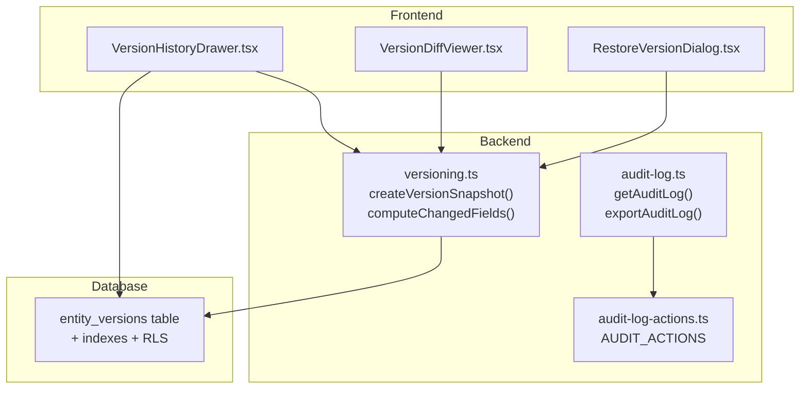
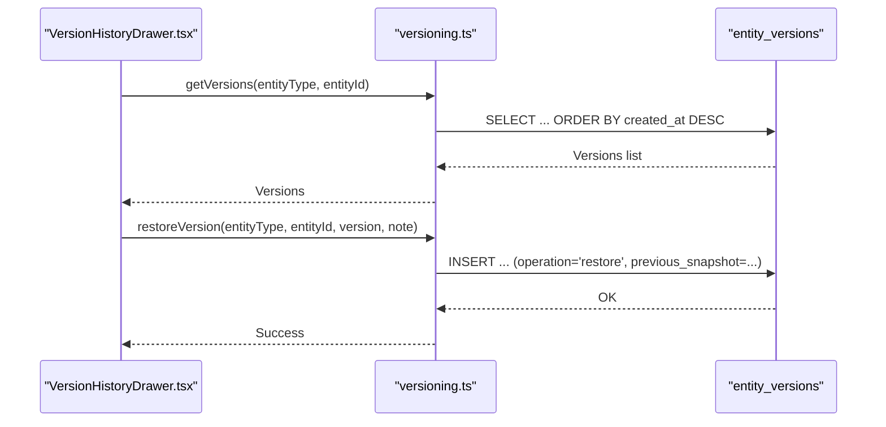
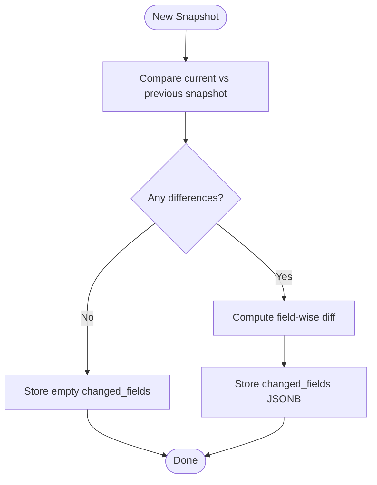
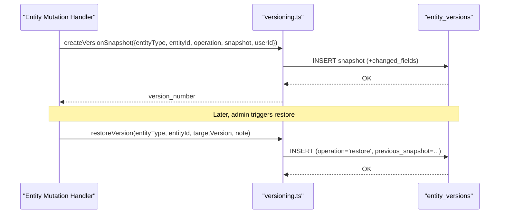
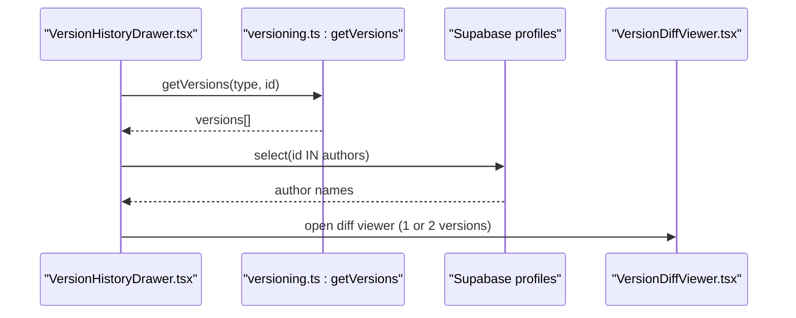
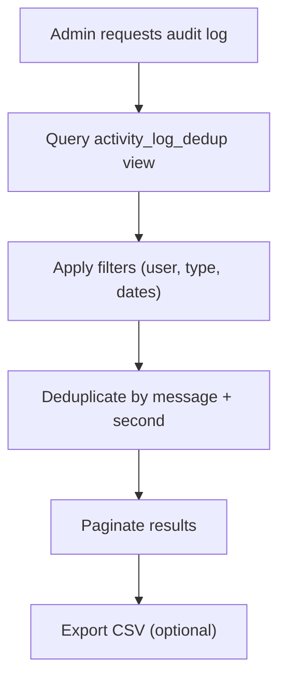
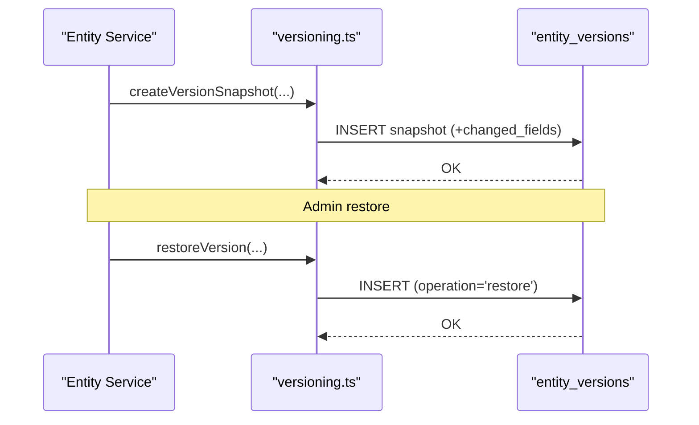
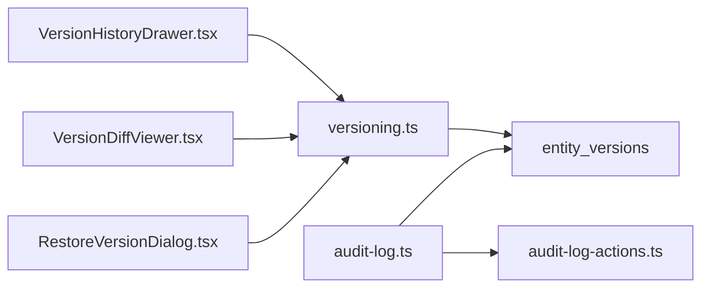

# Entity Versioning and Audit Trail

<cite>
**Referenced Files in This Document**
- [entity_versions.sql](file://supabase/migrations/20260503120000_entity_versions.sql)
- [harden_entity_versions.sql](file://supabase/migrations/20260509123300_harden_entity_versions.sql)
- [versioning.test.ts](file://src/__tests__/versioning.test.ts)
- [versioning.ts](file://src/lib/versioning.ts)
- [VersionHistoryDrawer.tsx](file://src/components/pcready/VersionHistoryDrawer.tsx)
- [VersionDiffViewer.tsx](file://src/components/pcready/VersionDiffViewer.tsx)
- [RestoreVersionDialog.tsx](file://src/components/pcready/RestoreVersionDialog.tsx)
- [audit-log.ts](file://src/lib/audit-log.ts)
- [audit-log-actions.ts](file://src/lib/audit-log-actions.ts)
</cite>

## Table of Contents
1. [Introduction](#introduction)
2. [Project Structure](#project-structure)
3. [Core Components](#core-components)
4. [Architecture Overview](#architecture-overview)
5. [Detailed Component Analysis](#detailed-component-analysis)
6. [Dependency Analysis](#dependency-analysis)
7. [Performance Considerations](#performance-considerations)
8. [Troubleshooting Guide](#troubleshooting-guide)
9. [Conclusion](#conclusion)
10. [Appendices](#appendices)

## Introduction
This document explains PCReady’s entity versioning and audit trail system. It covers the ENTITIES_VERSIONS table schema, delta tracking, change detection, version retrieval, rollback mechanisms, and integration with entity modification events. It also documents audit log generation, compliance features, and guidance for extending the system to new entities.

## Project Structure
The versioning and audit trail system spans database migrations, server-side libraries, and UI components:
- Database: ENTITIES_VERSIONS table and policies
- Backend: Versioning library and audit log utilities
- Frontend: UI drawers and dialogs for browsing, comparing, and restoring versions

**Diagram sources**
- [entity_versions.sql:1-41](file://supabase/migrations/20260503120000_entity_versions.sql#L1-L41)
- [harden_entity_versions.sql:1-44](file://supabase/migrations/20260509123300_harden_entity_versions.sql#L1-L44)
- [versioning.ts](file://src/lib/versioning.ts)
- [audit-log.ts:1-183](file://src/lib/audit-log.ts#L1-L183)
- [audit-log-actions.ts:1-28](file://src/lib/audit-log-actions.ts#L1-L28)
- [VersionHistoryDrawer.tsx:1-243](file://src/components/pcready/VersionHistoryDrawer.tsx#L1-L243)
- [VersionDiffViewer.tsx](file://src/components/pcready/VersionDiffViewer.tsx)
- [RestoreVersionDialog.tsx](file://src/components/pcready/RestoreVersionDialog.tsx)

**Section sources**
- [entity_versions.sql:1-41](file://supabase/migrations/20260503120000_entity_versions.sql#L1-L41)
- [harden_entity_versions.sql:1-44](file://supabase/migrations/20260509123300_harden_entity_versions.sql#L1-L44)
- [audit-log.ts:1-183](file://src/lib/audit-log.ts#L1-L183)
- [audit-log-actions.ts:1-28](file://src/lib/audit-log-actions.ts#L1-L28)
- [VersionHistoryDrawer.tsx:1-243](file://src/components/pcready/VersionHistoryDrawer.tsx#L1-L243)

## Core Components
- ENTITIES_VERSIONS table: Stores snapshots of entities with metadata, operation type, and optional change notes.
- Versioning library: Provides snapshot creation, change detection, and restoration.
- Audit log: Aggregates and exports activity logs for compliance.
- UI components: Allow users to browse versions, compare diffs, and restore previous states.

Key responsibilities:
- Capture entity changes via snapshotting and delta computation
- Enforce row-level security and role-based access for restores
- Provide UI for version inspection and rollback
- Generate audit trails for compliance reporting

**Section sources**
- [entity_versions.sql:5-19](file://supabase/migrations/20260503120000_entity_versions.sql#L5-L19)
- [harden_entity_versions.sql:16-34](file://supabase/migrations/20260509123300_harden_entity_versions.sql#L16-L34)
- [versioning.ts](file://src/lib/versioning.ts)
- [audit-log.ts:23-107](file://src/lib/audit-log.ts#L23-L107)

## Architecture Overview
The system integrates frontend UI, backend libraries, and database constraints to maintain a tamper-evident version history.

**Diagram sources**
- [VersionHistoryDrawer.tsx:44-77](file://src/components/pcready/VersionHistoryDrawer.tsx#L44-L77)
- [versioning.ts](file://src/lib/versioning.ts)
- [entity_versions.sql:21-27](file://supabase/migrations/20260503120000_entity_versions.sql#L21-L27)
- [harden_entity_versions.sql:27-34](file://supabase/migrations/20260509123300_harden_entity_versions.sql#L27-L34)

## Detailed Component Analysis

### ENTITIES_VERSIONS Table Schema
The table captures entity snapshots with rich metadata for auditing and rollback:
- Primary key: id
- Entity identity: entity_type, entity_id
- Versioning: version_number (unique per entity)
- Operation: create, update, restore, delete
- Snapshots: snapshot (current), previous_snapshot (optional)
- Change tracking: changed_fields (JSONB diff)
- Metadata: created_at, created_by, app_version, request_id
- Security: RLS enabled with policies for select and insert

Indexing and constraints:
- Unique index on (entity_type, entity_id, version_number)
- Index on (entity_type, entity_id, created_at DESC) for efficient history queries
- Check constraint on operation values
- Row-level security policies restrict inserts to authenticated users and admins for restores

**Section sources**
- [entity_versions.sql:5-19](file://supabase/migrations/20260503120000_entity_versions.sql#L5-L19)
- [entity_versions.sql:21-27](file://supabase/migrations/20260503120000_entity_versions.sql#L21-L27)
- [harden_entity_versions.sql:1-14](file://supabase/migrations/20260509123300_harden_entity_versions.sql#L1-L14)
- [harden_entity_versions.sql:16-20](file://supabase/migrations/20260509123300_harden_entity_versions.sql#L16-L20)
- [harden_entity_versions.sql:22-34](file://supabase/migrations/20260509123300_harden_entity_versions.sql#L22-L34)

### Delta Tracking and Change Detection
Delta tracking computes differences between successive snapshots:
- computeChangedFields compares two JSONB snapshots and returns changed fields with from/to values
- The versioning library stores changed_fields as JSONB for quick diff rendering
- Tests validate that the algorithm detects additions, deletions, and modifications

**Diagram sources**
- [versioning.test.ts:64-71](file://src/__tests__/versioning.test.ts#L64-L71)
- [versioning.ts](file://src/lib/versioning.ts)

**Section sources**
- [versioning.test.ts:64-71](file://src/__tests__/versioning.test.ts#L64-L71)
- [versioning.ts](file://src/lib/versioning.ts)

### Version Creation and Rollback
- Automatic version creation: The versioning library exposes createVersionSnapshot to capture entity changes with operation type and metadata
- Next version numbering: Tests assert that the library returns the next sequential version number
- Rollback: restoreVersion inserts a new version with operation='restore' and optional change_note, enabling point-in-time recovery

**Diagram sources**
- [versioning.test.ts:43-62](file://src/__tests__/versioning.test.ts#L43-L62)
- [versioning.ts](file://src/lib/versioning.ts)
- [harden_entity_versions.sql:36-43](file://supabase/migrations/20260509123300_harden_entity_versions.sql#L36-L43)

**Section sources**
- [versioning.test.ts:43-62](file://src/__tests__/versioning.test.ts#L43-L62)
- [versioning.ts](file://src/lib/versioning.ts)

### Version History Queries and Diff Viewing
- Version history retrieval: The UI drawer fetches ordered versions by created_at DESC and enriches authors via profiles lookup
- Diff viewing: Two-version comparison is supported; single-version preview is also available
- Selection and actions: Users can select versions, compare, and trigger restore (admin-only)

**Diagram sources**
- [VersionHistoryDrawer.tsx:44-77](file://src/components/pcready/VersionHistoryDrawer.tsx#L44-L77)
- [VersionHistoryDrawer.tsx:212-230](file://src/components/pcready/VersionHistoryDrawer.tsx#L212-L230)
- [VersionDiffViewer.tsx](file://src/components/pcready/VersionDiffViewer.tsx)

**Section sources**
- [VersionHistoryDrawer.tsx:1-243](file://src/components/pcready/VersionHistoryDrawer.tsx#L1-L243)
- [VersionDiffViewer.tsx](file://src/components/pcready/VersionDiffViewer.tsx)

### Audit Log Generation and Compliance
- Activity aggregation: The audit log service queries a deduplicated view to remove near-simultaneous duplicates
- Filtering: Supports filtering by user, action type, and date range
- Export: Generates CSV with localized timestamps and human-readable action types
- Compliance: Uses RLS and admin-only access to protect sensitive operations

**Diagram sources**
- [audit-log.ts:23-107](file://src/lib/audit-log.ts#L23-L107)
- [audit-log.ts:109-182](file://src/lib/audit-log.ts#L109-L182)
- [audit-log-actions.ts:1-28](file://src/lib/audit-log-actions.ts#L1-L28)

**Section sources**
- [audit-log.ts:1-183](file://src/lib/audit-log.ts#L1-L183)
- [audit-log-actions.ts:1-28](file://src/lib/audit-log-actions.ts#L1-L28)

### Integration with Entity Modification Events
- Event-driven versioning: Entity mutation handlers call createVersionSnapshot to capture pre/post states and operation type
- Automatic versioning: The versioning library manages version numbering and delta computation
- Restore workflow: Admins can initiate restore operations that insert a new version with operation='restore'

**Diagram sources**
- [versioning.test.ts:43-62](file://src/__tests__/versioning.test.ts#L43-L62)
- [versioning.ts](file://src/lib/versioning.ts)
- [harden_entity_versions.sql:36-43](file://supabase/migrations/20260509123300_harden_entity_versions.sql#L36-L43)

**Section sources**
- [versioning.test.ts:1-73](file://src/__tests__/versioning.test.ts#L1-L73)
- [versioning.ts](file://src/lib/versioning.ts)

## Dependency Analysis
- Database dependencies: entity_versions table defines schema, indexes, and RLS policies
- Backend dependencies: versioning.ts depends on Supabase client for DB operations; audit-log.ts depends on Supabase admin client and RLS views
- Frontend dependencies: VersionHistoryDrawer.tsx depends on versioning.ts and UI components; it enriches authors via profiles

**Diagram sources**
- [VersionHistoryDrawer.tsx:1-243](file://src/components/pcready/VersionHistoryDrawer.tsx#L1-L243)
- [VersionDiffViewer.tsx](file://src/components/pcready/VersionDiffViewer.tsx)
- [RestoreVersionDialog.tsx](file://src/components/pcready/RestoreVersionDialog.tsx)
- [versioning.ts](file://src/lib/versioning.ts)
- [audit-log.ts:1-183](file://src/lib/audit-log.ts#L1-L183)
- [audit-log-actions.ts:1-28](file://src/lib/audit-log-actions.ts#L1-L28)
- [entity_versions.sql:1-41](file://supabase/migrations/20260503120000_entity_versions.sql#L1-L41)

**Section sources**
- [VersionHistoryDrawer.tsx:1-243](file://src/components/pcready/VersionHistoryDrawer.tsx#L1-L243)
- [audit-log.ts:1-183](file://src/lib/audit-log.ts#L1-L183)

## Performance Considerations
- Indexing: The unique index on (entity_type, entity_id, version_number) prevents duplicates and supports fast lookups
- Query ordering: The index on (entity_type, entity_id, created_at DESC) optimizes version history retrieval
- Deduplication: Audit log deduplication reduces noise and improves pagination performance
- Snapshot size: Keep snapshots minimal to reduce storage and transfer overhead; rely on changed_fields for diffs

[No sources needed since this section provides general guidance]

## Troubleshooting Guide
Common issues and resolutions:
- Missing author names in version history: Ensure profiles lookup succeeds; verify created_by references valid users
- Restore permission denied: Only authenticated users with admin role can perform restores; check RLS policy
- Duplicate versions: Unique index prevents duplicate version numbers per entity; investigate duplicate insert triggers
- Empty version list: Confirm entity_type and entity_id match the stored records; verify RLS allows select access

**Section sources**
- [VersionHistoryDrawer.tsx:44-77](file://src/components/pcready/VersionHistoryDrawer.tsx#L44-L77)
- [harden_entity_versions.sql:22-34](file://supabase/migrations/20260509123300_harden_entity_versions.sql#L22-L34)

## Conclusion
PCReady’s versioning and audit trail system provides robust, auditable change tracking with efficient delta computation, secure restore capabilities, and comprehensive UI for inspection and rollback. The modular design enables straightforward extension to new entities while maintaining compliance and performance.

[No sources needed since this section summarizes without analyzing specific files]

## Appendices

### Implementing Custom Versioning for New Entities
Steps:
- Define entity schema and ensure entity_type and entity_id are consistently used
- Integrate createVersionSnapshot in mutation handlers to capture pre/post states and operation type
- Use computeChangedFields to populate changed_fields for diff rendering
- Expose getVersions and restoreVersion for UI integration
- Add UI drawer/dialogs to present version history and enable admin restores

Guidance:
- Keep snapshots concise; store only necessary fields
- Use operation='create' for initial snapshots, 'update' for changes, and 'restore' for rollbacks
- Leverage RLS policies to enforce access controls per entity type

**Section sources**
- [versioning.test.ts:43-62](file://src/__tests__/versioning.test.ts#L43-L62)
- [VersionHistoryDrawer.tsx:1-243](file://src/components/pcready/VersionHistoryDrawer.tsx#L1-L243)
- [harden_entity_versions.sql:22-34](file://supabase/migrations/20260509123300_harden_entity_versions.sql#L22-L34)