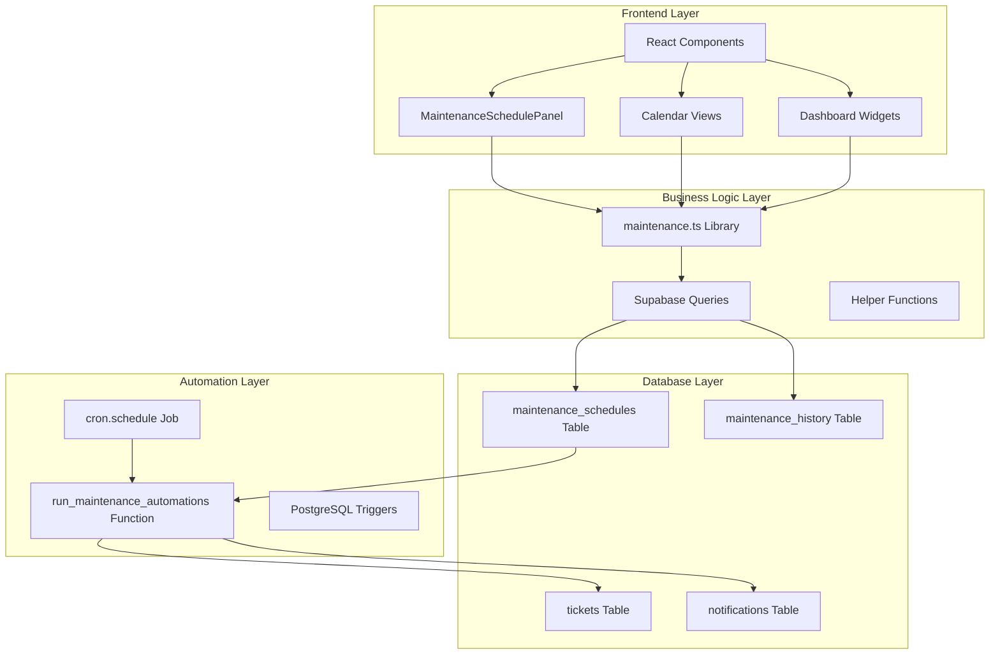
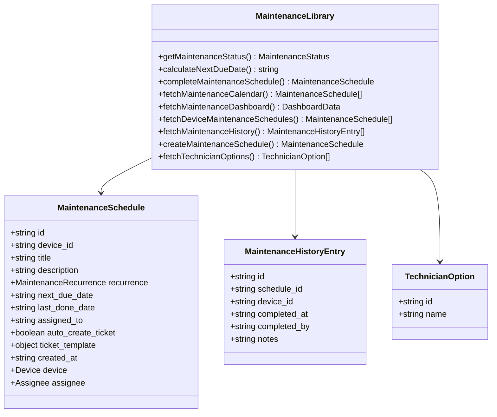
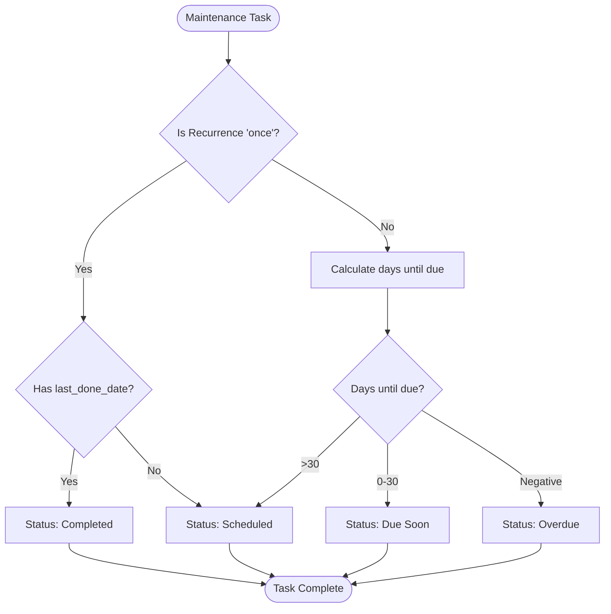
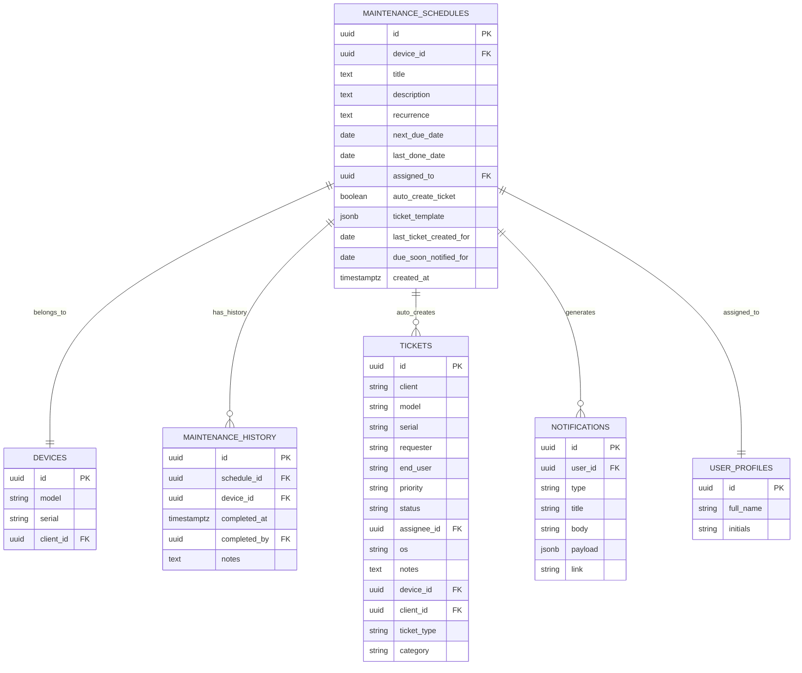
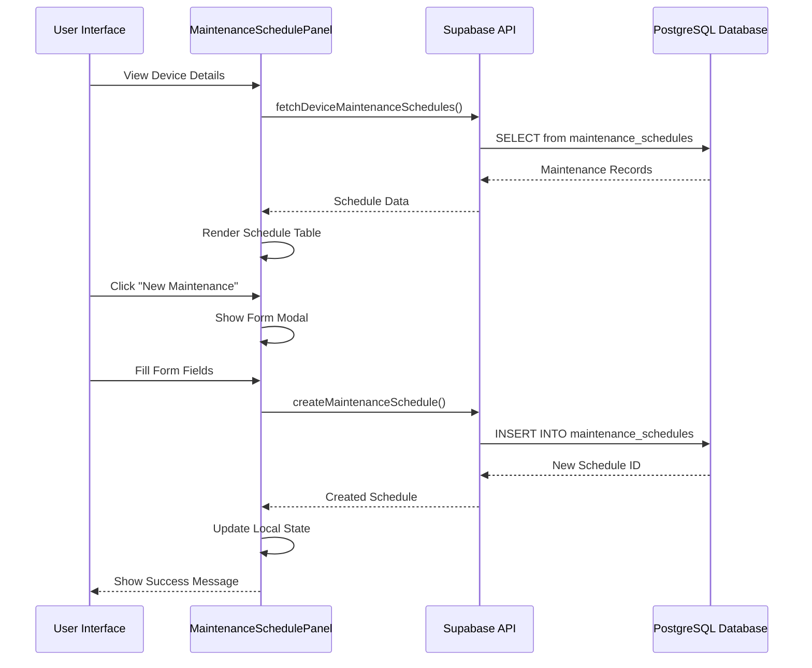
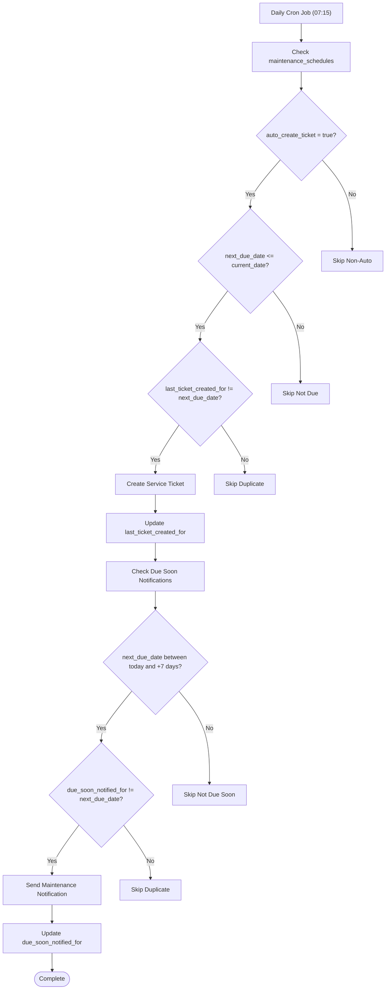
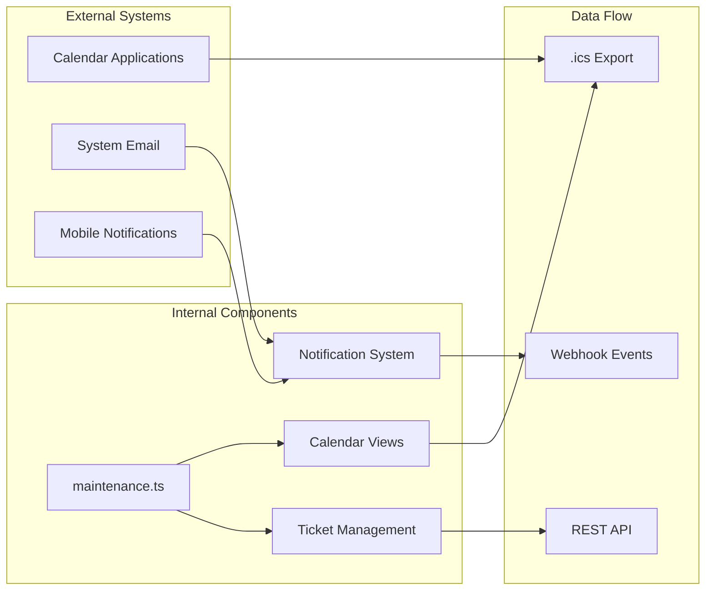

# Maintenance Scheduling System

<cite>
**Referenced Files in This Document**
- [maintenance.ts](file://src/lib/maintenance.ts)
- [MaintenanceSchedulePanel.tsx](file://src/components/inventory/MaintenanceSchedulePanel.tsx)
- [maintenance_schedules.sql](file://supabase/migrations/20260523120000_maintenance_schedules.sql)
- [inventory.tsx](file://src/routes/_app/inventory.tsx)
- [dashboard.tsx](file://src/routes/_app/dashboard.tsx)
- [calendar.tsx](file://src/routes/_app/calendar.tsx)
- [calendar-ical.ts](file://src/lib/calendar-ical.ts)
- [types.ts](file://src/components/calendar/types.ts)
</cite>

## Table of Contents

1. [Introduction](#introduction)
2. [System Architecture](#system-architecture)
3. [Core Components](#core-components)
4. [Data Model](#data-model)
5. [User Interface Components](#user-interface-components)
6. [Database Schema](#database-schema)
7. [Automation Engine](#automation-engine)
8. [Integration Points](#integration-points)
9. [Performance Considerations](#performance-considerations)
10. [Troubleshooting Guide](#troubleshooting-guide)
11. [Conclusion](#conclusion)

## Introduction

The Maintenance Scheduling System is a comprehensive solution designed to manage preventive maintenance operations for IT equipment and devices. This system enables organizations to schedule recurring maintenance tasks, track completion status, automate ticket creation, and maintain historical records of maintenance activities.

The system integrates seamlessly with the broader PCReady platform, providing both frontend interfaces for user interaction and backend automation capabilities powered by PostgreSQL triggers and cron jobs. It supports multiple maintenance frequencies (daily, weekly, monthly, quarterly, yearly) and offers real-time status tracking with visual indicators for upcoming, due soon, overdue, and completed maintenance tasks.

## System Architecture

The Maintenance Scheduling System follows a modern React-based frontend architecture with a PostgreSQL backend, implementing a clean separation of concerns between presentation, business logic, and data persistence layers.

**Diagram sources**

- [maintenance.ts:1-242](file://src/lib/maintenance.ts#L1-L242)
- [MaintenanceSchedulePanel.tsx:1-331](file://src/components/inventory/MaintenanceSchedulePanel.tsx#L1-L331)
- [maintenance_schedules.sql:1-233](file://supabase/migrations/20260523120000_maintenance_schedules.sql#L1-L233)

## Core Components

### Maintenance Management Library

The core business logic is encapsulated in the `maintenance.ts` library, which provides comprehensive functionality for managing maintenance schedules, calculating due dates, and handling status transitions.

**Diagram sources**

- [maintenance.ts:7-41](file://src/lib/maintenance.ts#L7-L41)

**Section sources**

- [maintenance.ts:1-242](file://src/lib/maintenance.ts#L1-L242)

### Status Management System

The system implements a sophisticated status management mechanism that automatically calculates maintenance task states based on due dates and completion history.

**Diagram sources**

- [maintenance.ts:87-96](file://src/lib/maintenance.ts#L87-L96)

**Section sources**

- [maintenance.ts:87-96](file://src/lib/maintenance.ts#L87-L96)

## Data Model

The system maintains a normalized data model optimized for efficient querying and reporting of maintenance operations.

**Diagram sources**

- [maintenance_schedules.sql:1-25](file://supabase/migrations/20260523120000_maintenance_schedules.sql#L1-L25)

**Section sources**

- [maintenance_schedules.sql:1-25](file://supabase/migrations/20260523120000_maintenance_schedules.sql#L1-L25)

## User Interface Components

### Maintenance Schedule Panel

The primary user interface component for managing individual device maintenance schedules, providing a comprehensive form for creating, editing, and tracking maintenance tasks.

**Diagram sources**

- [MaintenanceSchedulePanel.tsx:92-119](file://src/components/inventory/MaintenanceSchedulePanel.tsx#L92-L119)

**Section sources**

- [MaintenanceSchedulePanel.tsx:1-331](file://src/components/inventory/MaintenanceSchedulePanel.tsx#L1-L331)

### Calendar Integration

The system provides comprehensive calendar views for visualizing maintenance schedules across different time periods and filtering options.

**Section sources**

- [inventory.tsx:959-1149](file://src/routes/_app/inventory.tsx#L959-L1149)
- [calendar.tsx:1-200](file://src/routes/_app/calendar.tsx#L1-L200)

## Database Schema

The PostgreSQL schema implements robust data integrity with foreign key constraints, row-level security policies, and optimized indexing for performance.

### Table Structure and Constraints

| Table                   | Purpose                                    | Key Features                                                                                |
| ----------------------- | ------------------------------------------ | ------------------------------------------------------------------------------------------- |
| `maintenance_schedules` | Core maintenance schedule storage          | UUID primary key, foreign key to devices, recurrence validation, auto-create ticket support |
| `maintenance_history`   | Historical record of completed maintenance | Cascade deletion with devices, audit trail of completions                                   |
| `user_profiles`         | Technician and admin profiles              | Integration with auth system for role-based access                                          |
| `tickets`               | Auto-generated service tickets             | Integration with maintenance schedules for automated work orders                            |

### Security and Access Control

The system implements comprehensive Row Level Security (RLS) policies ensuring data isolation and appropriate access permissions based on user roles.

**Section sources**

- [maintenance_schedules.sql:26-80](file://supabase/migrations/20260523120000_maintenance_schedules.sql#L26-L80)

## Automation Engine

The system includes a sophisticated automation engine that handles routine maintenance tasks without manual intervention.

**Diagram sources**

- [maintenance_schedules.sql:128-213](file://supabase/migrations/20260523120000_maintenance_schedules.sql#L128-L213)

**Section sources**

- [maintenance_schedules.sql:128-213](file://supabase/migrations/20260523120000_maintenance_schedules.sql#L128-L213)

### Notification System

The automation engine generates contextual notifications for technicians when maintenance tasks are approaching their due dates, ensuring timely intervention.

**Section sources**

- [maintenance_schedules.sql:190-211](file://supabase/migrations/20260523120000_maintenance_schedules.sql#L190-L211)

## Integration Points

### External System Integrations

The system integrates with several external components to provide comprehensive maintenance management capabilities.

**Diagram sources**

- [calendar-ical.ts:74-124](file://src/lib/calendar-ical.ts#L74-L124)
- [calendar.tsx:190-195](file://src/routes/_app/calendar.tsx#L190-L195)

**Section sources**

- [calendar-ical.ts:1-152](file://src/lib/calendar-ical.ts#L1-L152)
- [types.ts:1-8](file://src/components/calendar/types.ts#L1-L8)

### Dashboard Integration

The maintenance system provides comprehensive dashboard widgets that display key metrics and upcoming maintenance tasks.

**Section sources**

- [dashboard.tsx:995-1099](file://src/routes/_app/dashboard.tsx#L995-L1099)

## Performance Considerations

### Database Optimization

The system implements several performance optimization strategies:

- **Indexing Strategy**: Composite indexes on `(device_id, next_due_date)` and `(next_due_date, assigned_to)` for efficient querying
- **Partitioning**: Logical partitioning through date-range queries for large datasets
- **Caching**: Frontend caching with React Query for reduced API calls
- **Pagination**: Limiting dashboard results to 25 entries for optimal performance

### Frontend Performance

- **Lazy Loading**: Components are loaded on-demand to reduce initial bundle size
- **Memoization**: React `useMemo` hooks prevent unnecessary re-renders
- **Efficient State Management**: Optimized state updates to minimize DOM manipulation

## Troubleshooting Guide

### Common Issues and Solutions

| Issue                                       | Symptoms                             | Solution                                                                         |
| ------------------------------------------- | ------------------------------------ | -------------------------------------------------------------------------------- |
| Maintenance tasks not appearing in calendar | Empty calendar view                  | Verify cron job is running and check `run_maintenance_automations` function logs |
| Tickets not auto-created                    | Missing service tickets              | Check `auto_create_ticket` flag and verify function execution                    |
| Status not updating                         | Incorrect maintenance status display | Verify `getMaintenanceStatus` calculations and date formatting                   |
| Notification delivery failures              | Missing technician notifications     | Check notification type validation and user preferences                          |

### Database Maintenance

Regular maintenance tasks include:

- Monitoring cron job execution logs
- Verifying trigger function permissions
- Checking index utilization and query performance
- Validating RLS policy effectiveness

**Section sources**

- [maintenance_schedules.sql:215-233](file://supabase/migrations/20260523120000_maintenance_schedules.sql#L215-L233)

## Conclusion

The Maintenance Scheduling System provides a robust, scalable solution for managing preventive maintenance operations. Its comprehensive feature set, including automated ticket creation, intelligent status tracking, and integration with calendar systems, makes it an essential tool for maintaining IT infrastructure reliability.

The system's modular architecture ensures maintainability and extensibility, while its automation capabilities reduce manual overhead and improve operational efficiency. The combination of frontend user interfaces and backend automation creates a seamless maintenance management experience that scales with organizational needs.

Key strengths of the system include its comprehensive automation engine, flexible recurrence patterns, detailed reporting capabilities, and seamless integration with existing PCReady platform components. The implementation demonstrates best practices in database design, security, and user experience optimization.
