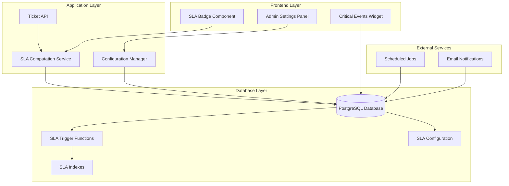
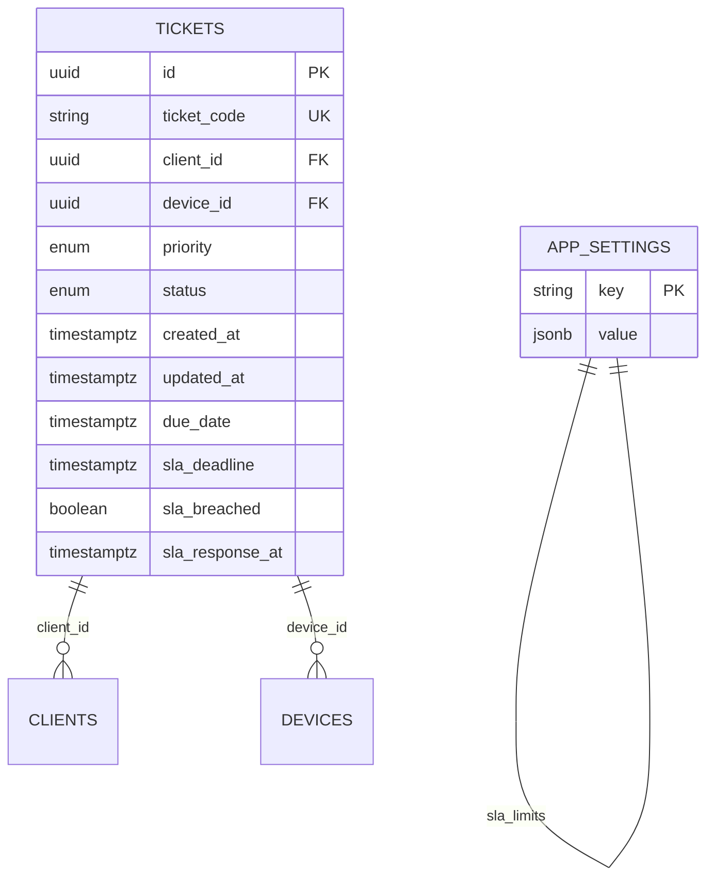
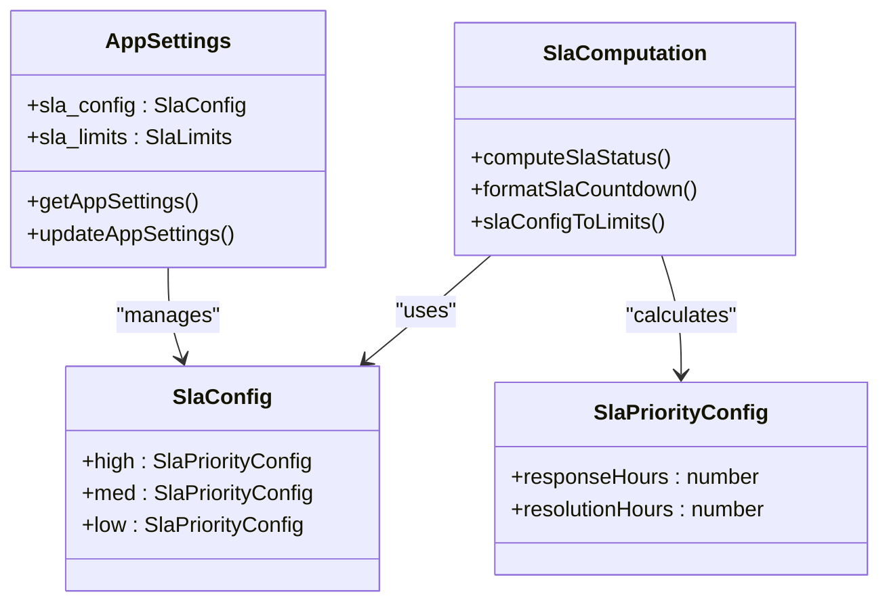
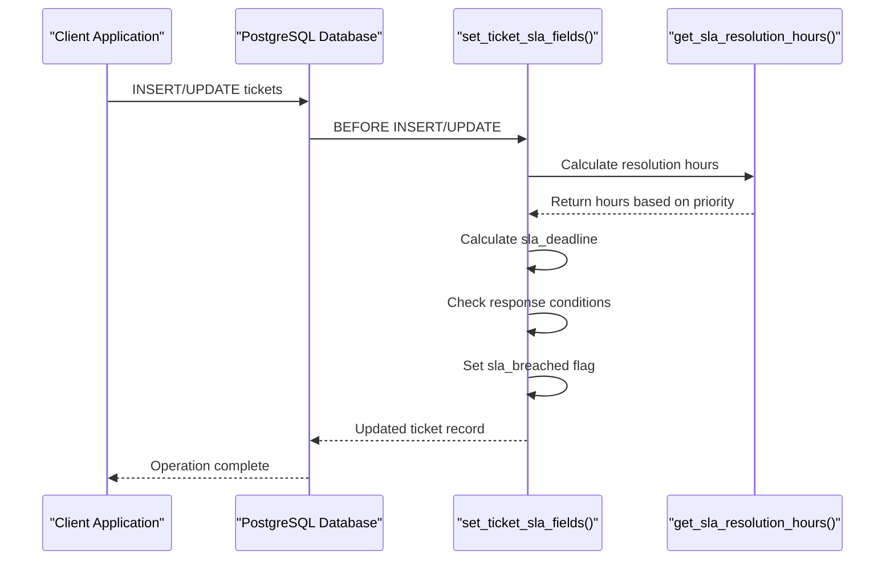
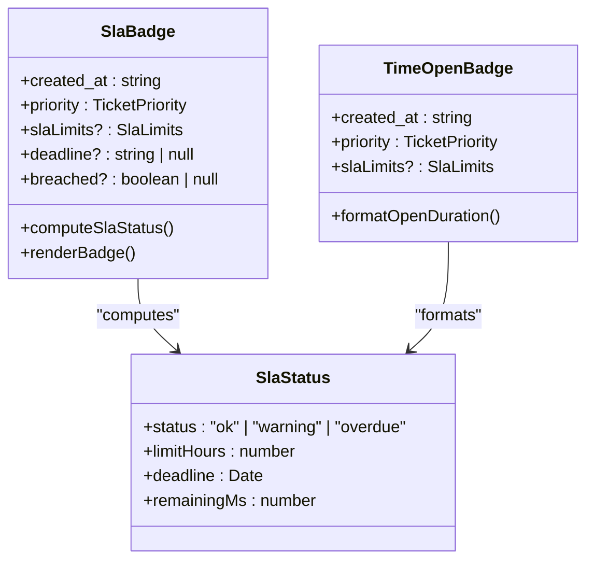
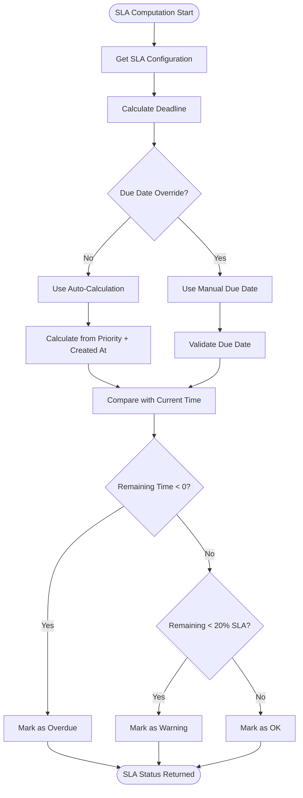
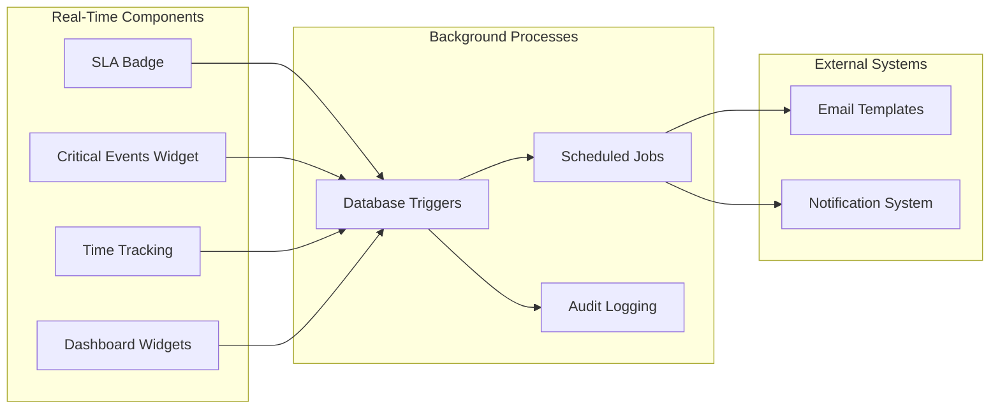

# SLA Tracking System

<cite>
**Referenced Files in This Document**
- [20260516120000_ticket_sla_tracking.sql](file://supabase/migrations/20260516120000_ticket_sla_tracking.sql)
- [pcready.ts](file://src/lib/pcready.ts)
- [tickets.tsx](file://src/routes/_app/tickets.tsx)
- [AdminSettingsTab.tsx](file://src/components/admin/AdminSettingsTab.tsx)
- [app-settings.ts](file://src/lib/app-settings.ts)
- [TicketTimeTracking.tsx](file://src/components/tickets/TicketTimeTracking.tsx)
- [CriticalEventsWidget.tsx](file://src/components/dashboard/CriticalEventsWidget.tsx)
</cite>

## Table of Contents

1. [Introduction](#introduction)
2. [System Architecture](#system-architecture)
3. [Database Schema](#database-schema)
4. [Core SLA Components](#core-sla-components)
5. [Frontend Implementation](#frontend-implementation)
6. [Administration Interface](#administration-interface)
7. [SLA Calculation Logic](#sla-calculation-logic)
8. [Integration Points](#integration-points)
9. [Performance Considerations](#performance-considerations)
10. [Troubleshooting Guide](#troubleshooting-guide)
11. [Conclusion](#conclusion)

## Introduction

The SLA (Service Level Agreement) Tracking System is a comprehensive solution integrated into the ticketing platform that monitors and manages service level compliance for customer support tickets. This system automatically calculates deadlines, tracks response times, and provides real-time visibility into SLA compliance across different ticket priorities.

The system consists of three main components: database-level triggers and functions that handle automatic SLA calculations, backend logic for managing SLA configurations, and frontend components that display SLA status to users. It supports configurable SLA policies with different response and resolution targets for high, medium, and low priority tickets.

## System Architecture

The SLA Tracking System follows a multi-layered architecture with clear separation of concerns:



**Diagram sources**

- [20260516120000_ticket_sla_tracking.sql:1-146](file://supabase/migrations/20260516120000_ticket_sla_tracking.sql#L1-L146)
- [pcready.ts:307-333](file://src/lib/pcready.ts#L307-L333)
- [tickets.tsx:1081-1127](file://src/routes/_app/tickets.tsx#L1081-L1127)

## Database Schema

The SLA tracking system extends the tickets table with several key columns that enable automated SLA monitoring:



**Diagram sources**

- [20260516120000_ticket_sla_tracking.sql:3-7](file://supabase/migrations/20260516120000_ticket_sla_tracking.sql#L3-L7)
- [20260516120000_ticket_sla_tracking.sql:17-21](file://supabase/migrations/20260516120000_ticket_sla_tracking.sql#L17-L21)

The database schema includes:

- **due_date**: Manual override for SLA deadlines set by staff/administrators
- **sla_deadline**: Automatic calculation of resolution deadlines based on priority and configuration
- **sla_breached**: Boolean flag indicating SLA violations
- **sla_response_at**: Timestamp of first response or assignment
- **Indexes**: Optimized queries for active tickets and breach detection

**Section sources**

- [20260516120000_ticket_sla_tracking.sql:3-15](file://supabase/migrations/20260516120000_ticket_sla_tracking.sql#L3-L15)

## Core SLA Components

### SLA Configuration Management

The system maintains SLA configurations through the application settings table, supporting both legacy and modern configuration formats:



**Diagram sources**

- [pcready.ts:13-37](file://src/lib/pcready.ts#L13-L37)
- [app-settings.ts:27-46](file://src/lib/app-settings.ts#L27-L46)

### Database Trigger System

The SLA logic is implemented through PostgreSQL triggers that automatically calculate and update SLA fields:



**Diagram sources**

- [20260516120000_ticket_sla_tracking.sql:61-104](file://supabase/migrations/20260516120000_ticket_sla_tracking.sql#L61-L104)

**Section sources**

- [20260516120000_ticket_sla_tracking.sql:23-97](file://supabase/migrations/20260516120000_ticket_sla_tracking.sql#L23-L97)

## Frontend Implementation

### SLA Badge Component

The frontend displays SLA status through a comprehensive badge component that shows real-time SLA information:



**Diagram sources**

- [tickets.tsx:1081-1127](file://src/routes/_app/tickets.tsx#L1081-L1127)
- [pcready.ts:307-333](file://src/lib/pcready.ts#L307-L333)

The SLA badge component provides three visual states:

- **Green (OK)**: SLA within acceptable limits
- **Yellow (Warning)**: SLA approaching deadline (20% of total SLA time remaining)
- **Red (Overdue)**: SLA violation detected

**Section sources**

- [tickets.tsx:1081-1187](file://src/routes/_app/tickets.tsx#L1081-L1187)
- [pcready.ts:307-364](file://src/lib/pcready.ts#L307-L364)

## Administration Interface

### SLA Configuration Panel

Administrators can configure SLA parameters through an intuitive settings interface:

| Priority Level | Response Hours | Resolution Hours |
| -------------- | -------------- | ---------------- |
| High           | 1 hour         | 4 hours          |
| Medium         | 4 hours        | 24 hours         |
| Low            | 24 hours       | 72 hours         |

The configuration panel allows administrators to:

- Set response time targets for first response
- Configure resolution time targets for ticket completion
- Override default SLA values per priority level
- Apply changes immediately to new tickets

**Section sources**

- [AdminSettingsTab.tsx:390-430](file://src/components/admin/AdminSettingsTab.tsx#L390-L430)
- [app-settings.ts:302-328](file://src/lib/app-settings.ts#L302-L328)

## SLA Calculation Logic

### Core Algorithm

The SLA computation follows a sophisticated algorithm that considers multiple factors:



**Diagram sources**

- [pcready.ts:307-333](file://src/lib/pcready.ts#L307-L333)

### Database-Level Calculations

The PostgreSQL functions handle critical SLA calculations:

1. **get_sla_resolution_hours()**: Retrieves resolution hours from configuration
2. **set_ticket_sla_fields()**: Trigger function that updates SLA fields
3. **refresh_ticket_sla_breaches()**: Batch job for updating breach status

**Section sources**

- [20260516120000_ticket_sla_tracking.sql:23-125](file://supabase/migrations/20260516120000_ticket_sla_tracking.sql#L23-L125)

## Integration Points

### Real-Time Updates

The system integrates with various platform components:



**Diagram sources**

- [CriticalEventsWidget.tsx:69-95](file://src/components/dashboard/CriticalEventsWidget.tsx#L69-L95)
- [TicketTimeTracking.tsx:1-231](file://src/components/tickets/TicketTimeTracking.tsx#L1-L231)

### Dashboard Integration

SLA status is prominently featured in dashboard widgets:

- **Critical Events Widget**: Highlights tickets with SLA violations
- **Overdue Tickets Widget**: Shows tickets exceeding SLA deadlines
- **SLA Compliance Metrics**: Provides organization-wide SLA performance indicators

**Section sources**

- [CriticalEventsWidget.tsx:69-95](file://src/components/dashboard/CriticalEventsWidget.tsx#L69-L95)

## Performance Considerations

### Database Optimization

The SLA system includes several performance optimizations:

- **Index Strategy**: Separate indexes for active tickets and breach detection
- **Trigger Efficiency**: Minimal computational overhead during insert/update operations
- **Batch Processing**: Scheduled jobs for bulk SLA breach updates
- **Caching**: Client-side caching of SLA configurations

### Scalability Features

- **Partitioning**: Active vs. archived tickets separated for query optimization
- **Asynchronous Processing**: Background jobs for heavy computations
- **Configuration Caching**: Reduced database load through client-side caching
- **Efficient Queries**: Optimized indexes for common SLA-related queries

## Troubleshooting Guide

### Common Issues

**SLA Not Updating**

- Verify database trigger is active
- Check application settings configuration
- Ensure proper indexing exists

**Incorrect SLA Calculations**

- Validate SLA configuration values
- Check timezone settings
- Review ticket creation timestamps

**Performance Issues**

- Monitor database query performance
- Check index utilization
- Review scheduled job execution

### Diagnostic Commands

```sql
-- Check SLA trigger status
SELECT tgname, tgrelid::regclass, tgenabled
FROM pg_trigger
WHERE tgname = 'tickets_sla_fields';

-- Verify SLA configuration
SELECT key, value FROM app_settings WHERE key LIKE 'sla%';

-- Test SLA calculation
SELECT get_sla_resolution_hours('high'::ticket_priority);
```

**Section sources**

- [20260516120000_ticket_sla_tracking.sql:106-125](file://supabase/migrations/20260516120000_ticket_sla_tracking.sql#L106-L125)

## Conclusion

The SLA Tracking System provides a robust, configurable solution for monitoring and managing service level agreements within the ticketing platform. Its multi-layered architecture ensures reliable SLA enforcement while maintaining excellent performance and user experience.

Key benefits include:

- **Automated SLA Management**: Reduces manual oversight requirements
- **Flexible Configuration**: Supports various SLA policies across different ticket types
- **Real-Time Visibility**: Provides immediate feedback on SLA compliance
- **Administrative Control**: Allows fine-tuned SLA policy management
- **Performance Optimization**: Minimizes impact on system performance

The system successfully balances automation with flexibility, providing administrators with powerful tools to maintain high service standards while ensuring operational efficiency.
