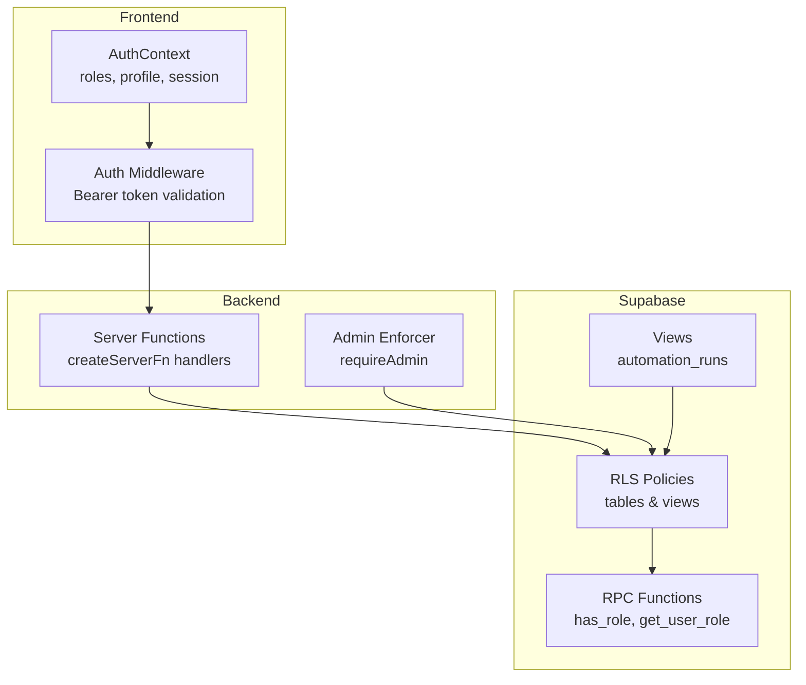
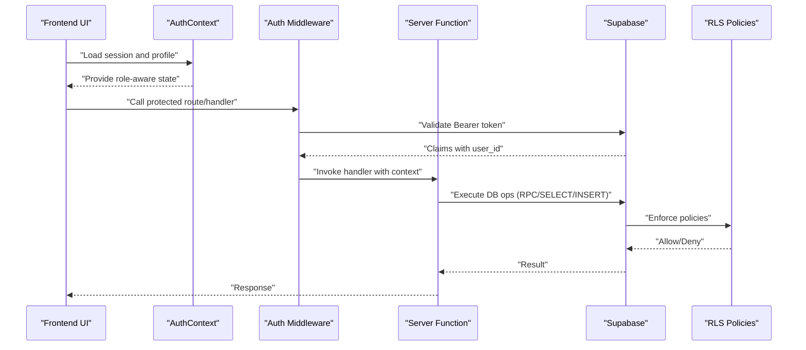
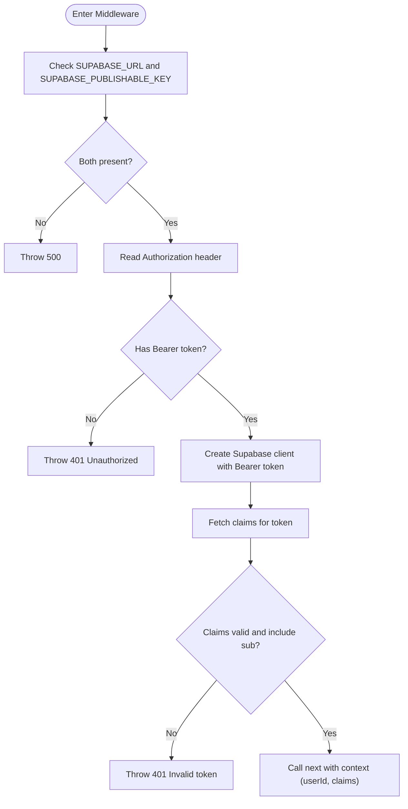
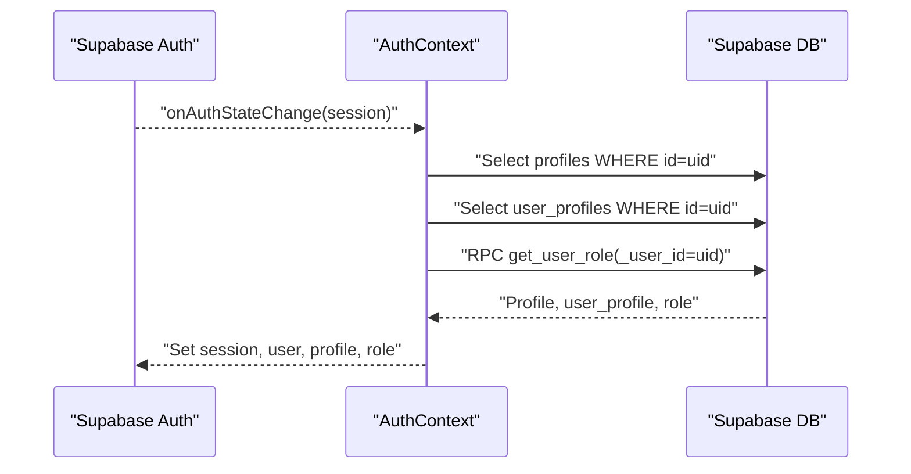
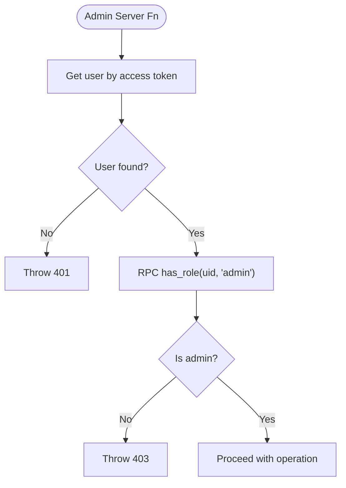
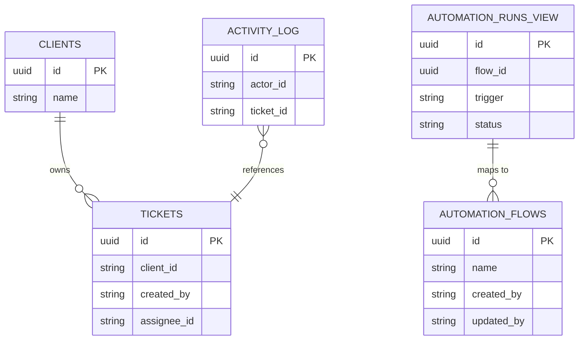
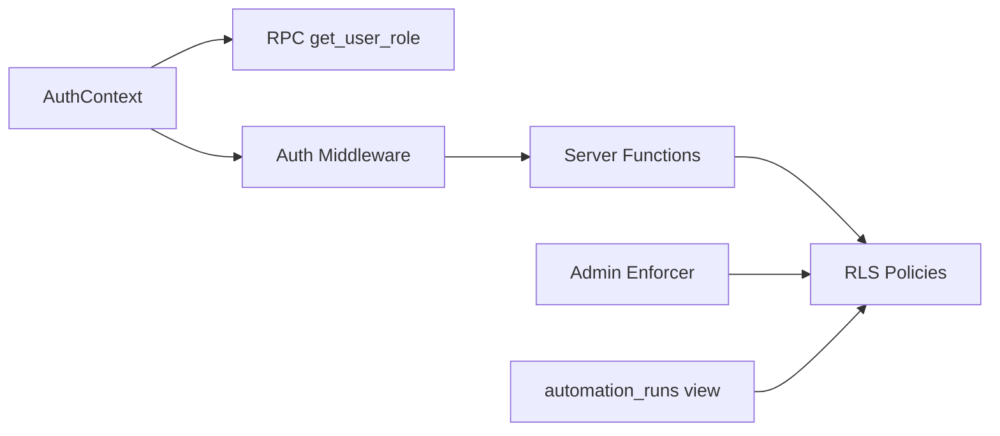

# Security and Access Control

<cite>
**Referenced Files in This Document**
- [auth-middleware.ts](file://src/integrations/supabase/auth-middleware.ts)
- [auth-context.tsx](file://src/lib/auth-context.tsx)
- [admin-users.server.ts](file://src/lib/admin-users.server.ts)
- [admin-users.ts](file://src/lib/admin-users.ts)
- [technicians.ts](file://src/lib/technicians.ts)
- [tickets.ts](file://src/lib/tickets.ts)
- [types.ts](file://src/integrations/supabase/types.ts)
- [database.types.ts](file://src/types/database.types.ts)
- [20260430143000_admin_user_management_rls.sql](file://supabase/migrations/20260430143000_admin_user_management_rls.sql)
- [20260504170000_add_rls_policies_automation_flows.sql](file://supabase/migrations/20260504170000_add_rls_policies_automation_flows.sql)
- [20260514210000_tickets_tech_delete_policy.sql](file://supabase/migrations/20260514210000_tickets_tech_delete_policy.sql)
- [20260514182000_realtime_replica_identity_core_tables.sql](file://supabase/migrations/20260514182000_realtime_replica_identity_core_tables.sql)
- [20260515160000_automation_runs_view.sql](file://supabase/migrations/20260515160000_automation_runs_view.sql)
</cite>

## Table of Contents
1. [Introduction](#introduction)
2. [Project Structure](#project-structure)
3. [Core Components](#core-components)
4. [Architecture Overview](#architecture-overview)
5. [Detailed Component Analysis](#detailed-component-analysis)
6. [Dependency Analysis](#dependency-analysis)
7. [Performance Considerations](#performance-considerations)
8. [Troubleshooting Guide](#troubleshooting-guide)
9. [Conclusion](#conclusion)
10. [Appendices](#appendices)

## Introduction
This document explains PCReady’s security model and access control mechanisms. It covers:
- Role-based access control (RBAC) with roles used in the frontend and backend
- Supabase Row Level Security (RLS) policies across key tables
- Customer isolation and data access boundaries
- Authentication middleware, session management, and token validation
- Integration between user roles, customer associations, and permissions
- Practical policy configurations and common access control scenarios
- Security best practices and compliance considerations

## Project Structure
PCReady integrates Supabase for authentication and authorization, with client-side React components and server-side TanStack Start server functions. The security model spans:
- Frontend authentication context and role-aware UI
- Backend authentication middleware and admin enforcement
- Supabase RLS policies on tables and views
- RPC functions and views that enforce access rules

**Diagram sources**
- [auth-context.tsx:1-173](file://src/lib/auth-context.tsx#L1-L173)
- [auth-middleware.ts:1-74](file://src/integrations/supabase/auth-middleware.ts#L1-L74)
- [admin-users.server.ts:1-18](file://src/lib/admin-users.server.ts#L1-L18)
- [admin-users.ts:1-279](file://src/lib/admin-users.ts#L1-L279)
- [20260430143000_admin_user_management_rls.sql:1-13](file://supabase/migrations/20260430143000_admin_user_management_rls.sql#L1-L13)
- [20260504170000_add_rls_policies_automation_flows.sql:1-30](file://supabase/migrations/20260504170000_add_rls_policies_automation_flows.sql#L1-L30)
- [20260515160000_automation_runs_view.sql:1-30](file://supabase/migrations/20260515160000_automation_runs_view.sql#L1-L30)

**Section sources**
- [auth-context.tsx:1-173](file://src/lib/auth-context.tsx#L1-L173)
- [auth-middleware.ts:1-74](file://src/integrations/supabase/auth-middleware.ts#L1-L74)
- [admin-users.server.ts:1-18](file://src/lib/admin-users.server.ts#L1-L18)
- [admin-users.ts:1-279](file://src/lib/admin-users.ts#L1-L279)
- [20260430143000_admin_user_management_rls.sql:1-13](file://supabase/migrations/20260430143000_admin_user_management_rls.sql#L1-L13)
- [20260504170000_add_rls_policies_automation_flows.sql:1-30](file://supabase/migrations/20260504170000_add_rls_policies_automation_flows.sql#L1-L30)
- [20260515160000_automation_runs_view.sql:1-30](file://supabase/migrations/20260515160000_automation_runs_view.sql#L1-L30)

## Core Components
- Authentication middleware validates Bearer tokens and injects user claims and user ID into server contexts.
- Auth context loads user profile, resolves app role via RPC, and exposes role-aware booleans for UI rendering.
- Admin server functions enforce admin-only access and delegate role checks to RPC functions.
- Supabase RLS policies govern table-level access for authenticated users, with explicit “own” rules and staff/admin allowances.
- Views encapsulate read-only access to operational logs with security invoker to enforce caller policies.

**Section sources**
- [auth-middleware.ts:7-74](file://src/integrations/supabase/auth-middleware.ts#L7-L74)
- [auth-context.tsx:52-94](file://src/lib/auth-context.tsx#L52-L94)
- [admin-users.server.ts:3-17](file://src/lib/admin-users.server.ts#L3-L17)
- [admin-users.ts:137-167](file://src/lib/admin-users.ts#L137-L167)
- [20260504170000_add_rls_policies_automation_flows.sql:6-25](file://supabase/migrations/20260504170000_add_rls_policies_automation_flows.sql#L6-L25)
- [20260515160000_automation_runs_view.sql:4-29](file://supabase/migrations/20260515160000_automation_runs_view.sql#L4-L29)

## Architecture Overview
The security architecture combines client-side session management, server-side middleware, and Supabase RLS. The flow below shows how a request moves from UI to database with enforced policies.

**Diagram sources**
- [auth-context.tsx:114-146](file://src/lib/auth-context.tsx#L114-L146)
- [auth-middleware.ts:7-74](file://src/integrations/supabase/auth-middleware.ts#L7-L74)
- [admin-users.ts:137-167](file://src/lib/admin-users.ts#L137-L167)
- [20260504170000_add_rls_policies_automation_flows.sql:6-25](file://supabase/migrations/20260504170000_add_rls_policies_automation_flows.sql#L6-L25)

## Detailed Component Analysis

### Authentication Middleware and Token Validation
- Validates presence of Supabase URL and publishable key
- Requires Authorization header with Bearer token
- Creates a Supabase client configured with the provided token
- Calls a claims endpoint to extract user ID and claims
- Injects user ID and claims into the server context for downstream handlers

**Diagram sources**
- [auth-middleware.ts:7-74](file://src/integrations/supabase/auth-middleware.ts#L7-L74)

**Section sources**
- [auth-middleware.ts:7-74](file://src/integrations/supabase/auth-middleware.ts#L7-L74)

### Session Management and Role Resolution
- Loads session and user from Supabase auth
- Concurrently fetches profile, user profile, and app role via RPC
- Normalizes display name and initials
- Exposes role-aware booleans for UI decisions (canEdit, isAdmin)

**Diagram sources**
- [auth-context.tsx:52-94](file://src/lib/auth-context.tsx#L52-L94)

**Section sources**
- [auth-context.tsx:43-166](file://src/lib/auth-context.tsx#L43-L166)

### Admin Access Control and Enforcement
- Admin-only server functions validate access tokens and enforce admin role via RPC
- Enforces constraints such as preventing removal of the last admin
- Provides user listing, updates, invitations, resends, disabling, and deletion

**Diagram sources**
- [admin-users.server.ts:3-17](file://src/lib/admin-users.server.ts#L3-L17)
- [admin-users.ts:137-167](file://src/lib/admin-users.ts#L137-L167)

**Section sources**
- [admin-users.server.ts:1-18](file://src/lib/admin-users.server.ts#L1-L18)
- [admin-users.ts:88-135](file://src/lib/admin-users.ts#L88-L135)
- [admin-users.ts:169-225](file://src/lib/admin-users.ts#L169-L225)
- [admin-users.ts:250-279](file://src/lib/admin-users.ts#L250-L279)

### RBAC Roles and Scope
- App roles surfaced in the frontend include admin, tech, and viewer
- Role resolution occurs via RPC and is used to gate UI and server operations
- Technician listing filters to users with roles admin or tech

**Section sources**
- [auth-context.tsx:13-35](file://src/lib/auth-context.tsx#L13-L35)
- [technicians.ts:10-33](file://src/lib/technicians.ts#L10-L33)
- [admin-users.ts:53](file://src/lib/admin-users.ts#L53)

### Supabase RLS Policies and Data Access Boundaries
- Profiles: Admins can read and update profiles
- Automation flows: Select allowed broadly; insert/update/delete restricted to owner (created_by/updated_by)
- Tickets: Deletion allowed for admins and techs
- Realtime: Core tables configured for full replica identity and realtime publication
- View automation_runs: Security invoker ensures caller policies apply when accessing run logs

**Diagram sources**
- [20260504170000_add_rls_policies_automation_flows.sql:6-25](file://supabase/migrations/20260504170000_add_rls_policies_automation_flows.sql#L6-L25)
- [20260514210000_tickets_tech_delete_policy.sql:4-7](file://supabase/migrations/20260514210000_tickets_tech_delete_policy.sql#L4-L7)
- [20260515160000_automation_runs_view.sql:4-29](file://supabase/migrations/20260515160000_automation_runs_view.sql#L4-L29)

**Section sources**
- [20260430143000_admin_user_management_rls.sql:5-12](file://supabase/migrations/20260430143000_admin_user_management_rls.sql#L5-L12)
- [20260504170000_add_rls_policies_automation_flows.sql:6-25](file://supabase/migrations/20260504170000_add_rls_policies_automation_flows.sql#L6-L25)
- [20260514210000_tickets_tech_delete_policy.sql:4-7](file://supabase/migrations/20260514210000_tickets_tech_delete_policy.sql#L4-L7)
- [20260514182000_realtime_replica_identity_core_tables.sql:4-7](file://supabase/migrations/20260514182000_realtime_replica_identity_core_tables.sql#L4-L7)
- [20260515160000_automation_runs_view.sql:4-29](file://supabase/migrations/20260515160000_automation_runs_view.sql#L4-L29)

### Customer Isolation and Data Access Boundaries
- Clients and related entities (e.g., devices, tickets) are linked via foreign keys
- RLS policies on tables and views enforce access based on authenticated user and ownership/role
- Realtime configuration ensures clients see only relevant events filtered by RLS

**Section sources**
- [20260514182000_realtime_replica_identity_core_tables.sql:4-7](file://supabase/migrations/20260514182000_realtime_replica_identity_core_tables.sql#L4-L7)

### Integration Between Roles, Associations, and Permissions
- Role RPC functions resolve effective app roles for users
- UI components conditionally render based on role booleans
- Server functions enforce admin-only operations and ownership constraints

**Section sources**
- [auth-context.tsx:155-156](file://src/lib/auth-context.tsx#L155-L156)
- [admin-users.server.ts:10-14](file://src/lib/admin-users.server.ts#L10-L14)
- [technicians.ts:16-20](file://src/lib/technicians.ts#L16-L20)

### Example Policy Configurations
- Profiles: Admins can read and update profiles
- Automation flows: Select allowed; insert/update/delete restricted to owner
- Tickets: Deletion allowed for admins and techs
- View automation_runs: Security invoker applies caller policies

**Section sources**
- [20260430143000_admin_user_management_rls.sql:5-12](file://supabase/migrations/20260430143000_admin_user_management_rls.sql#L5-L12)
- [20260504170000_add_rls_policies_automation_flows.sql:9-23](file://supabase/migrations/20260504170000_add_rls_policies_automation_flows.sql#L9-L23)
- [20260514210000_tickets_tech_delete_policy.sql:6-7](file://supabase/migrations/20260514210000_tickets_tech_delete_policy.sql#L6-L7)
- [20260515160000_automation_runs_view.sql:4-29](file://supabase/migrations/20260515160000_automation_runs_view.sql#L4-L29)

### Common Access Control Scenarios
- Creating a ticket: Requires authenticated user; inserts with created_by set; rate-limited
- Listing technicians: Filters to users with roles admin or tech
- Admin user management: Requires admin role; enforces constraints like preventing removal of the last admin

**Section sources**
- [tickets.ts:50-111](file://src/lib/tickets.ts#L50-L111)
- [technicians.ts:10-33](file://src/lib/technicians.ts#L10-L33)
- [admin-users.ts:69-86](file://src/lib/admin-users.ts#L69-L86)

## Dependency Analysis
The following diagram maps key dependencies among authentication, server functions, and RLS policies.

**Diagram sources**
- [auth-context.tsx:69](file://src/lib/auth-context.tsx#L69)
- [auth-middleware.ts:56](file://src/integrations/supabase/auth-middleware.ts#L56)
- [admin-users.server.ts:10](file://src/lib/admin-users.server.ts#L10)
- [20260504170000_add_rls_policies_automation_flows.sql:6](file://supabase/migrations/20260504170000_add_rls_policies_automation_flows.sql#L6)
- [20260515160000_automation_runs_view.sql:4](file://supabase/migrations/20260515160000_automation_runs_view.sql#L4)

**Section sources**
- [auth-context.tsx:69](file://src/lib/auth-context.tsx#L69)
- [auth-middleware.ts:56](file://src/integrations/supabase/auth-middleware.ts#L56)
- [admin-users.server.ts:10](file://src/lib/admin-users.server.ts#L10)
- [20260504170000_add_rls_policies_automation_flows.sql:6](file://supabase/migrations/20260504170000_add_rls_policies_automation_flows.sql#L6)
- [20260515160000_automation_runs_view.sql:4](file://supabase/migrations/20260515160000_automation_runs_view.sql#L4)

## Performance Considerations
- Minimize concurrent DB calls in auth context; current implementation uses Promise.all for profile, user profile, and role resolution
- Prefer server-side RLS to avoid redundant client-side filtering
- Use views with security invoker to centralize permission logic and reduce repeated checks
- Enable full replica identity for tables participating in realtime to ensure efficient diffs and reduced payload sizes

[No sources needed since this section provides general guidance]

## Troubleshooting Guide
- Missing environment variables: Middleware throws 500 when Supabase URL or publishable key are not set
- Missing or invalid Authorization header: Middleware throws 401 for missing or unsupported headers
- Invalid token: Claims retrieval failure leads to 401
- Admin enforcement failures: requireAdmin throws 401 for invalid tokens and 403 for insufficient roles
- Rate limiting: Ticket creation and admin invites are rate-limited; errors surface as server errors

**Section sources**
- [auth-middleware.ts:9-41](file://src/integrations/supabase/auth-middleware.ts#L9-L41)
- [admin-users.server.ts:7-8](file://src/lib/admin-users.server.ts#L7-L8)
- [admin-users.ts:172-174](file://src/lib/admin-users.ts#L172-L174)
- [tickets.ts:62](file://src/lib/tickets.ts#L62)

## Conclusion
PCReady’s security model leverages Supabase authentication and RLS to enforce role-based access control, ownership constraints, and customer isolation. The frontend auth context and middleware provide robust token validation and role-aware UI, while server functions enforce admin-only operations and ownership rules. RLS policies on tables and views ensure consistent access boundaries, and views with security invoker centralize permission logic. Adhering to the best practices outlined here will help maintain a secure and compliant system.

[No sources needed since this section summarizes without analyzing specific files]

## Appendices

### Appendix A: Supabase Types and Database Types
- Supabase-generated types define tables, enums, and relationships used across the application
- Database types re-export Supabase types for consistent typing

**Section sources**
- [types.ts:1-800](file://src/integrations/supabase/types.ts#L1-L800)
- [database.types.ts:1-2](file://src/types/database.types.ts#L1-L2)