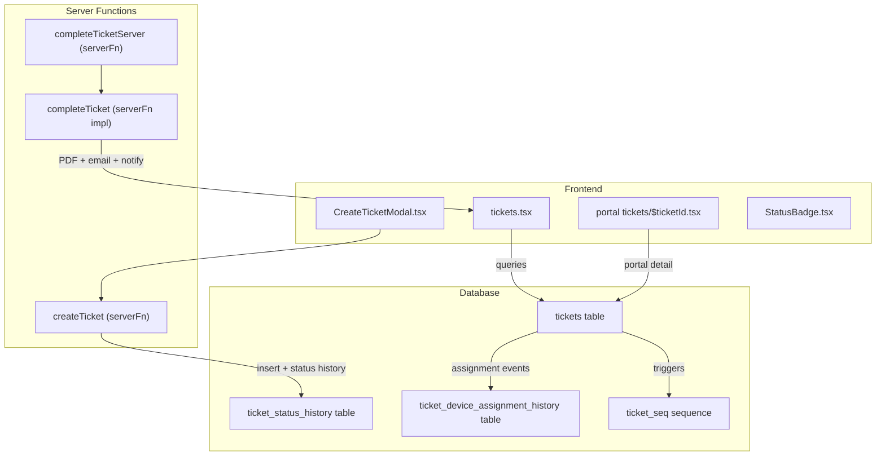
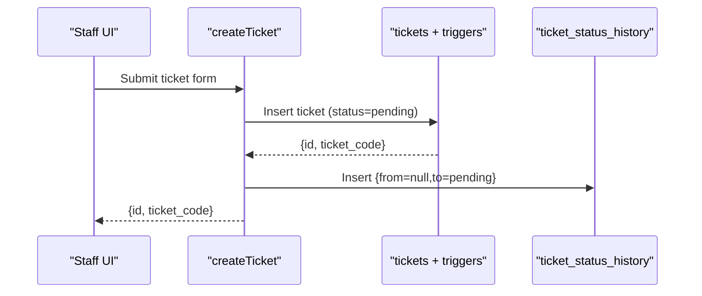
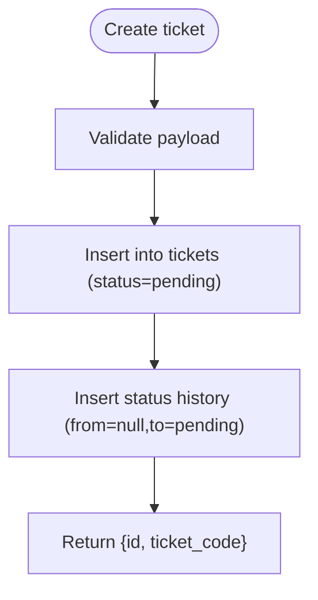
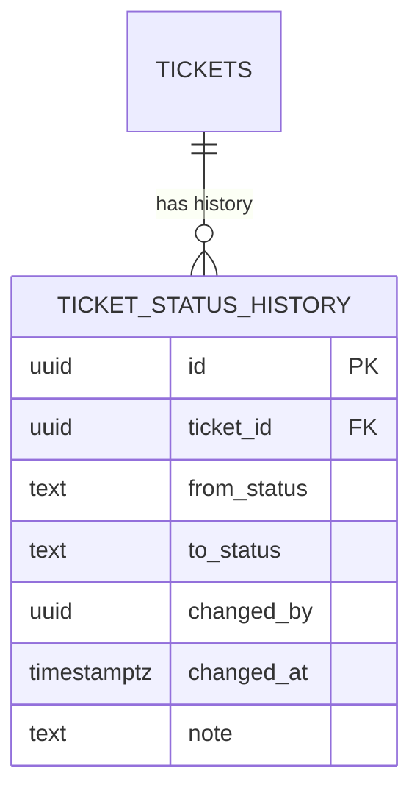
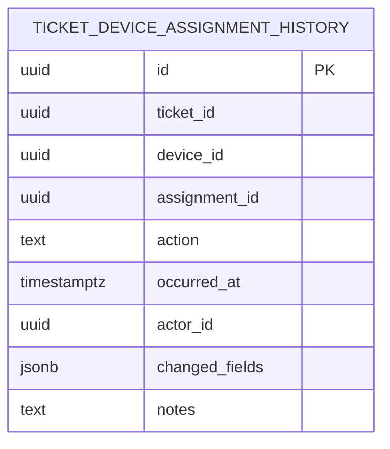
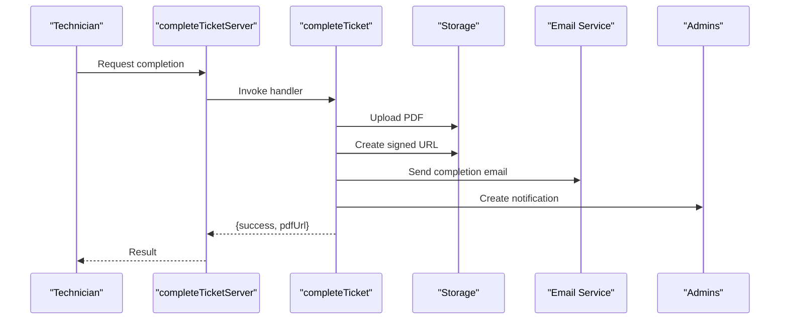
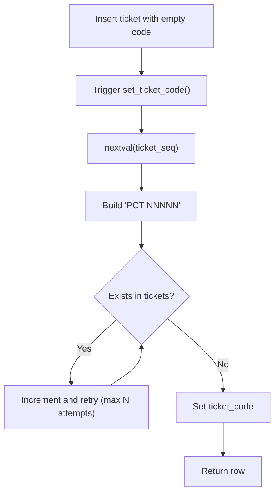
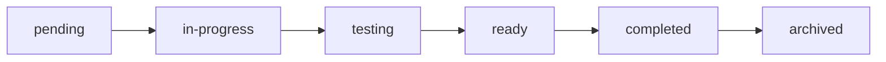
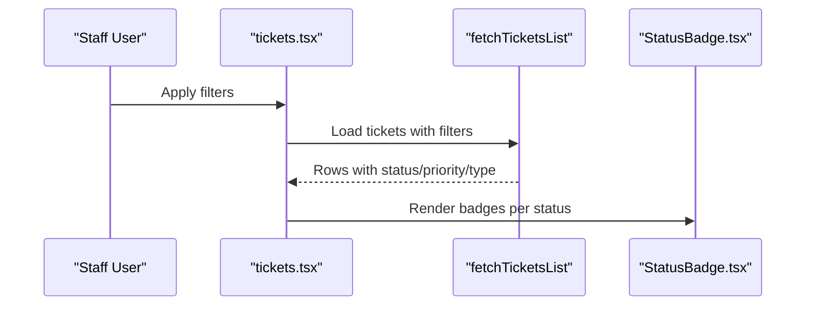
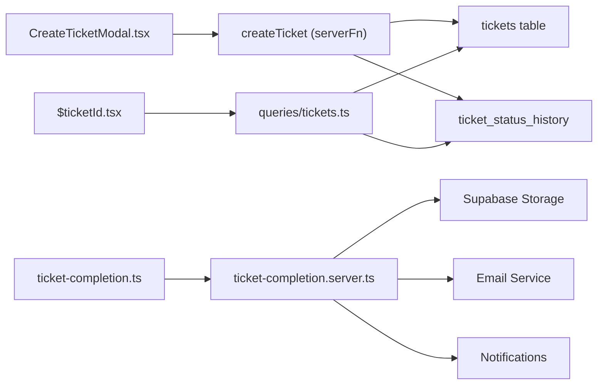

# Ticket Workflow and Status Management

<cite>
**Referenced Files in This Document**
- [tickets.ts](file://src/lib/tickets.ts)
- [ticket-completion.ts](file://src/lib/ticket-completion.ts)
- [ticket-completion.server.ts](file://src/lib/ticket-completion.server.ts)
- [tickets.tsx](file://src/routes/_app/tickets.tsx)
- [$ticketId.tsx](file://src/routes/portal/tickets/$ticketId.tsx)
- [pcready.ts](file://src/lib/pcready.ts)
- [StatusBadge.tsx](file://src/components/pcready/StatusBadge.tsx)
- [tickets.ts](file://src/lib/queries/tickets.ts)
- [CreateTicketModal.tsx](file://src/components/pcready/CreateTicketModal.tsx)
- [new.tsx](file://src/routes/portal/tickets/new.tsx)
- [ticket_status_history.sql](file://supabase/migrations/20260511180000_ticket_status_history.sql)
- [ticket_completed_status.sql](file://supabase/migrations/20260511190000_ticket_completed_status.sql)
- [add_archived_status.sql](file://supabase/migrations/20260511193000_add_archived_status.sql)
- [ticket_code_sequence_trigger.sql](file://supabase/migrations/20260430154500_ticket_code_sequence_trigger.sql)
- [ticket_code_unique_allocation.sql](file://supabase/migrations/20260516200000_ticket_code_unique_allocation.sql)
- [create_ticket_device_assignment_history.sql](file://supabase/migrations/20260430183000_create_ticket_device_assignment_history.sql)
</cite>

## Table of Contents
1. [Introduction](#introduction)
2. [Project Structure](#project-structure)
3. [Core Components](#core-components)
4. [Architecture Overview](#architecture-overview)
5. [Detailed Component Analysis](#detailed-component-analysis)
6. [Dependency Analysis](#dependency-analysis)
7. [Performance Considerations](#performance-considerations)
8. [Troubleshooting Guide](#troubleshooting-guide)
9. [Conclusion](#conclusion)
10. [Appendices](#appendices)

## Introduction
This document explains PCReady’s ticket workflow model and status management system. It covers the end-to-end lifecycle from creation to closure, including status transitions, code generation, device assignment history, completion tracking, status history logging, and automated triggers. It also documents priority and assignment rules, and provides examples of typical workflows.

## Project Structure
The ticket system spans frontend UI components, server functions, Supabase database tables and triggers, and client queries. Key areas:
- Frontend forms and views for staff and portal users
- Server functions for creating tickets and completing them
- Database migrations defining schema, constraints, and triggers
- Queries and UI components for status badges and lists



**Diagram sources**
- [CreateTicketModal.tsx:138-300](file://src/components/pcready/CreateTicketModal.tsx#L138-L300)
- [tickets.tsx:66-122](file://src/routes/_app/tickets.tsx#L66-L122)
- [$ticketId.tsx:15-40](file://src/routes/portal/tickets/$ticketId.tsx#L15-L40)
- [StatusBadge.tsx:11-14](file://src/components/pcready/StatusBadge.tsx#L11-L14)
- [tickets.ts:50-110](file://src/lib/tickets.ts#L50-L110)
- [ticket-completion.ts:10-15](file://src/lib/ticket-completion.ts#L10-L15)
- [ticket-completion.server.ts:49-181](file://src/lib/ticket-completion.server.ts#L49-L181)
- [ticket_status_history.sql:5-18](file://supabase/migrations/20260511180000_ticket_status_history.sql#L5-L18)
- [create_ticket_device_assignment_history.sql:4-21](file://supabase/migrations/20260430183000_create_ticket_device_assignment_history.sql#L4-L21)
- [ticket_code_sequence_trigger.sql:2-41](file://supabase/migrations/20260430154500_ticket_code_sequence_trigger.sql#L2-L41)

**Section sources**
- [tickets.tsx:66-122](file://src/routes/_app/tickets.tsx#L66-L122)
- [pcready.ts:1-60](file://src/lib/pcready.ts#L1-L60)

## Core Components
- Ticket creation pipeline: validates inputs, inserts a ticket, and logs the initial status.
- Status metadata and UI badges: defines states, labels, and next-state transitions.
- Status history: immutable audit trail of state changes.
- Device assignment history: persistent log of assignment/unassignment/replacement actions.
- Ticket completion: generates a PDF, uploads to storage, emails the client, notifies admins, and updates status.
- Unique ticket code generation: database-triggered sequence with collision avoidance.
- Portal and staff views: list, filter, and detail pages for tickets.

**Section sources**
- [tickets.ts:50-110](file://src/lib/tickets.ts#L50-L110)
- [pcready.ts:1-60](file://src/lib/pcready.ts#L1-L60)
- [ticket_status_history.sql:5-18](file://supabase/migrations/20260511180000_ticket_status_history.sql#L5-L18)
- [create_ticket_device_assignment_history.sql:4-21](file://supabase/migrations/20260430183000_create_ticket_device_assignment_history.sql#L4-L21)
- [ticket-completion.server.ts:49-181](file://src/lib/ticket-completion.server.ts#L49-L181)
- [ticket_code_sequence_trigger.sql:2-41](file://supabase/migrations/20260430154500_ticket_code_sequence_trigger.sql#L2-L41)

## Architecture Overview
The system enforces a strict workflow with explicit status transitions and immutable history. Creation sets the initial state and logs it. Updates are captured in the status history table. Device assignments are tracked separately. Completion triggers PDF generation, email delivery, and admin notifications.



**Diagram sources**
- [tickets.ts:50-110](file://src/lib/tickets.ts#L50-L110)
- [ticket_status_history.sql:5-18](file://supabase/migrations/20260511180000_ticket_status_history.sql#L5-L18)

**Section sources**
- [tickets.ts:50-110](file://src/lib/tickets.ts#L50-L110)
- [ticket_status_history.sql:5-18](file://supabase/migrations/20260511180000_ticket_status_history.sql#L5-L18)

## Detailed Component Analysis

### Ticket Creation Pipeline
- Input validation ensures required fields and acceptable values.
- Inserts the ticket with initial status and optional device/assignee/contact/template data.
- Immediately creates a status history record for the initial state.
- Returns the generated ticket identifier and code.



**Diagram sources**
- [tickets.ts:50-110](file://src/lib/tickets.ts#L50-L110)

**Section sources**
- [tickets.ts:50-110](file://src/lib/tickets.ts#L50-L110)

### Status Transitions and Metadata
- Defined states: pending, in-progress, testing, ready, completed, archived.
- Each state includes a human-readable label, CSS class, and the next state in the workflow.
- The portal displays a timeline of status changes using the history table.

```mermaid
stateDiagram-v2
[*] --> pending
pending --> "in-progress"
"in-progress" --> testing
testing --> ready
ready --> completed
completed --> archived
archived --> [*]
```

**Diagram sources**
- [pcready.ts:11-26](file://src/lib/pcready.ts#L11-L26)
- [$ticketId.tsx:96-98](file://src/routes/portal/tickets/$ticketId.tsx#L96-L98)

**Section sources**
- [pcready.ts:11-26](file://src/lib/pcready.ts#L11-L26)
- [$ticketId.tsx:96-98](file://src/routes/portal/tickets/$ticketId.tsx#L96-L98)

### Status History Logging
- Immutable audit trail capturing who changed the status, when, and why.
- Policies restrict visibility to clients for their own tickets and to authenticated users for admin access.
- Used by both staff and portal views to render timelines.



**Diagram sources**
- [ticket_status_history.sql:5-18](file://supabase/migrations/20260511180000_ticket_status_history.sql#L5-L18)

**Section sources**
- [ticket_status_history.sql:5-18](file://supabase/migrations/20260511180000_ticket_status_history.sql#L5-L18)
- [tickets.ts:244-261](file://src/lib/queries/tickets.ts#L244-L261)

### Device Assignment Tracking
- Persistent history of assignment events, including replacements and deletions.
- Tracked via a trigger on the assignment table to keep a durable log.
- Supports auditing and reporting even if original records are removed.



**Diagram sources**
- [create_ticket_device_assignment_history.sql:4-21](file://supabase/migrations/20260430183000_create_ticket_device_assignment_history.sql#L4-L21)

**Section sources**
- [create_ticket_device_assignment_history.sql:4-21](file://supabase/migrations/20260430183000_create_ticket_device_assignment_history.sql#L4-L21)
- [tickets.ts:125-136](file://src/lib/queries/tickets.ts#L125-L136)

### Ticket Completion Workflow
- On completion:
  - Generates a PDF report and uploads it to storage.
  - Creates a long-lived signed URL for the client.
  - Sends an email to the client with completion details.
  - Notifies administrators.
  - Updates the ticket’s status to completed and records timestamps.



**Diagram sources**
- [ticket-completion.ts:10-15](file://src/lib/ticket-completion.ts#L10-L15)
- [ticket-completion.server.ts:49-181](file://src/lib/ticket-completion.server.ts#L49-L181)

**Section sources**
- [ticket-completion.ts:10-15](file://src/lib/ticket-completion.ts#L10-L15)
- [ticket-completion.server.ts:49-181](file://src/lib/ticket-completion.server.ts#L49-L181)

### Ticket Code Generation and Uniqueness
- A dedicated sequence generates base numbers.
- A database trigger assigns a unique code with a fixed prefix and zero-padded numeric suffix.
- A uniqueness check loop prevents collisions during concurrent creation.
- The sequence is aligned with existing codes to avoid gaps or duplicates.



**Diagram sources**
- [ticket_code_sequence_trigger.sql:20-41](file://supabase/migrations/20260430154500_ticket_code_sequence_trigger.sql#L20-L41)
- [ticket_code_unique_allocation.sql:20-46](file://supabase/migrations/20260516200000_ticket_code_unique_allocation.sql#L20-L46)

**Section sources**
- [ticket_code_sequence_trigger.sql:20-41](file://supabase/migrations/20260430154500_ticket_code_sequence_trigger.sql#L20-L41)
- [ticket_code_unique_allocation.sql:20-46](file://supabase/migrations/20260516200000_ticket_code_unique_allocation.sql#L20-L46)

### Lifecycle: From Creation to Closure and Archiving
- Creation: pending with initial status history.
- Work progression: pending → in-progress → testing → ready.
- Closure: ready → completed; completion triggers PDF/email/notification.
- Retention: completed tickets are automatically archived after a configurable delay.



**Diagram sources**
- [pcready.ts:11-26](file://src/lib/pcready.ts#L11-L26)
- [ticket_completed_status.sql:14-23](file://supabase/migrations/20260511190000_ticket_completed_status.sql#L14-L23)
- [add_archived_status.sql:14-20](file://supabase/migrations/20260511193000_add_archived_status.sql#L14-L20)

**Section sources**
- [pcready.ts:11-26](file://src/lib/pcready.ts#L11-L26)
- [ticket_completed_status.sql:14-23](file://supabase/migrations/20260511190000_ticket_completed_status.sql#L14-L23)
- [add_archived_status.sql:25-48](file://supabase/migrations/20260511193000_add_archived_status.sql#L25-L48)

### Views and Interactions
- Staff list view: filters by status, priority, type, client; paginated; real-time updates; export to PDF.
- Status badge rendering: maps state to label and style.
- Portal detail view: shows current status, priority, assignee, notes, and status timeline.



**Diagram sources**
- [tickets.tsx:80-122](file://src/routes/_app/tickets.tsx#L80-L122)
- [StatusBadge.tsx:11-14](file://src/components/pcready/StatusBadge.tsx#L11-L14)
- [tickets.ts:148-172](file://src/lib/queries/tickets.ts#L148-L172)

**Section sources**
- [tickets.tsx:80-122](file://src/routes/_app/tickets.tsx#L80-L122)
- [StatusBadge.tsx:11-14](file://src/components/pcready/StatusBadge.tsx#L11-L14)
- [tickets.ts:148-172](file://src/lib/queries/tickets.ts#L148-L172)

### Portal Ticket Detail
- Loads ticket and history via server functions.
- Renders status, priority, assignee, notes, and a timeline of status changes.
- Provides a link to download the completion PDF when ready.

**Section sources**
- [$ticketId.tsx:15-106](file://src/routes/portal/tickets/$ticketId.tsx#L15-L106)

## Dependency Analysis
- Frontend forms depend on server functions for creation and completion.
- Server functions depend on Supabase client libraries and storage/email/notification services.
- Database constraints and triggers enforce data integrity and uniqueness.
- Queries encapsulate list, detail, and history retrieval.



**Diagram sources**
- [CreateTicketModal.tsx:196-300](file://src/components/pcready/CreateTicketModal.tsx#L196-L300)
- [tickets.ts:50-110](file://src/lib/tickets.ts#L50-L110)
- [$ticketId.tsx:15-40](file://src/routes/portal/tickets/$ticketId.tsx#L15-L40)
- [tickets.ts:148-172](file://src/lib/queries/tickets.ts#L148-L172)
- [ticket-completion.ts:10-15](file://src/lib/ticket-completion.ts#L10-L15)
- [ticket-completion.server.ts:49-181](file://src/lib/ticket-completion.server.ts#L49-L181)

**Section sources**
- [CreateTicketModal.tsx:196-300](file://src/components/pcready/CreateTicketModal.tsx#L196-L300)
- [tickets.ts:50-110](file://src/lib/tickets.ts#L50-L110)
- [ticket-completion.ts:10-15](file://src/lib/ticket-completion.ts#L10-L15)
- [ticket-completion.server.ts:49-181](file://src/lib/ticket-completion.server.ts#L49-L181)

## Performance Considerations
- Indexes on tickets and history tables optimize filtering and sorting by status and timestamps.
- Real-time updates via Postgres changes reduce polling overhead in the staff list.
- PDF generation is deferred to server-side execution; signed URLs minimize repeated generation.
- Concurrency-safe code generation uses a bounded retry loop to avoid excessive contention.

[No sources needed since this section provides general guidance]

## Troubleshooting Guide
Common issues and remedies:
- Ticket creation fails due to rate limits or invalid session: verify access token and rate limit thresholds.
- Status history not appearing: confirm the history table exists and policies allow access.
- Duplicate ticket codes: inspect the uniqueness loop and sequence alignment logic.
- Completion PDF missing: check storage permissions, signed URL creation, and email delivery.

**Section sources**
- [tickets.ts:50-110](file://src/lib/tickets.ts#L50-L110)
- [ticket_status_history.sql:5-18](file://supabase/migrations/20260511180000_ticket_status_history.sql#L5-L18)
- [ticket_code_unique_allocation.sql:20-46](file://supabase/migrations/20260516200000_ticket_code_unique_allocation.sql#L20-L46)
- [ticket-completion.server.ts:103-131](file://src/lib/ticket-completion.server.ts#L103-L131)

## Conclusion
PCReady’s ticket system combines a clear workflow, immutable audit trails, and robust automation. The database enforces uniqueness and transitions, while server functions orchestrate completion and notifications. Together, these components provide a reliable foundation for managing preparation tickets from creation to archival.

[No sources needed since this section summarizes without analyzing specific files]

## Appendices

### Status Definitions and Next States
- pending → in-progress
- in-progress → testing
- testing → ready
- ready → completed
- completed → archived

**Section sources**
- [pcready.ts:11-26](file://src/lib/pcready.ts#L11-L26)

### Priority and Type Labels
- Priorities: high, med, low
- Types: device, support, maintenance, other

**Section sources**
- [pcready.ts:28-50](file://src/lib/pcready.ts#L28-L50)

### Example Workflows
- Standard preparation ticket:
  - Create with type “device”, assign a technician, set priority.
  - Transition: pending → in-progress → testing → ready → completed.
- Support ticket:
  - Create with type “support”, no device, set priority.
  - Transition: pending → in-progress → testing → ready → completed.
- Escalation pattern:
  - Raise priority mid-workflow; maintain status history for auditability.

[No sources needed since this section provides general guidance]