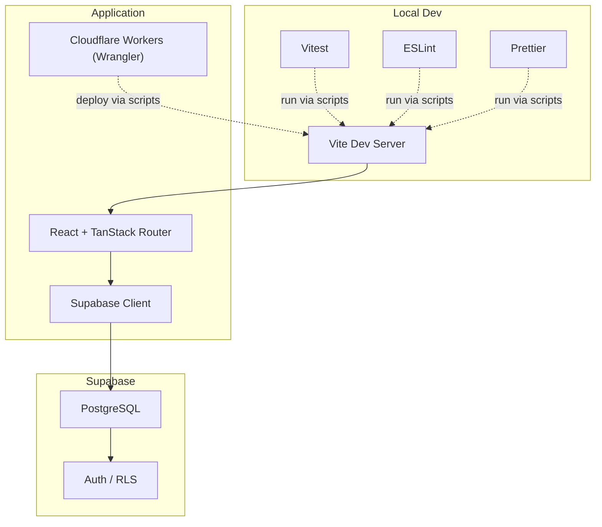
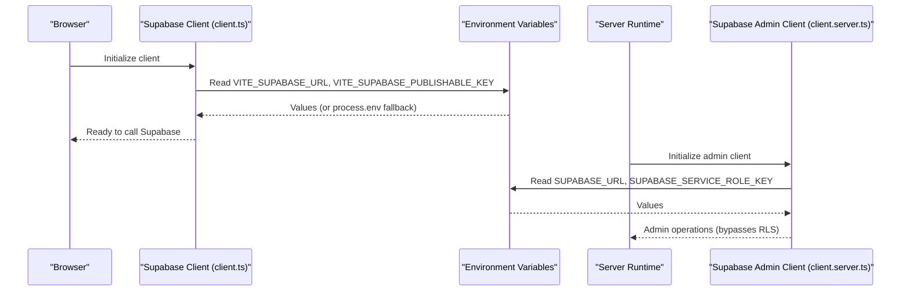
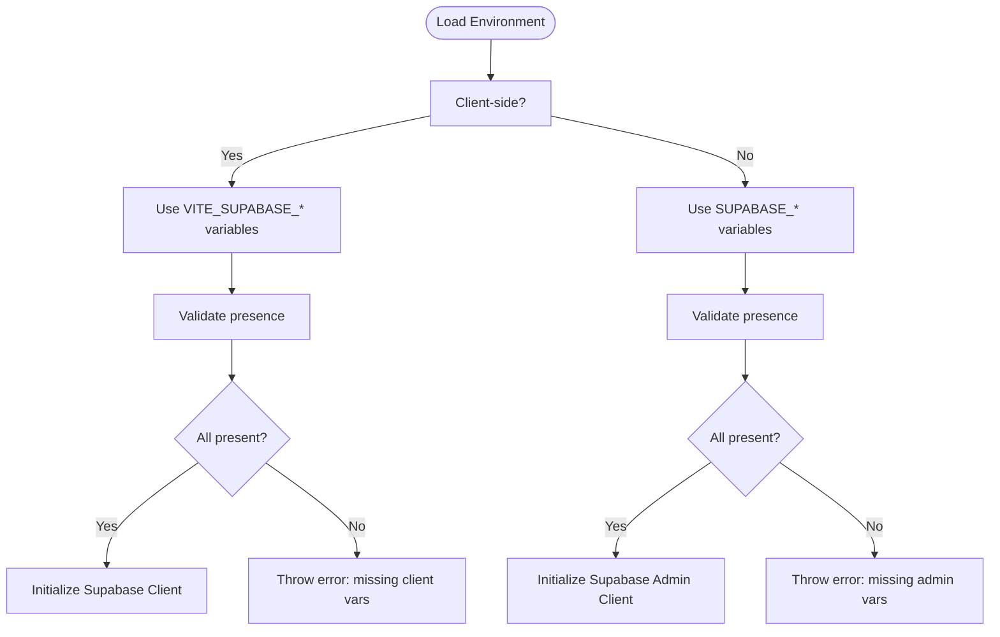
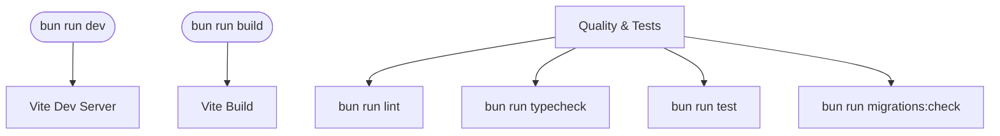
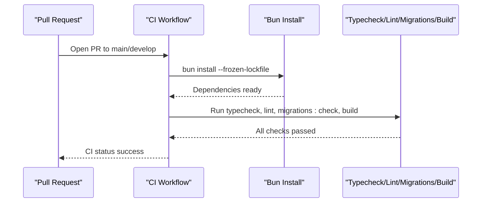
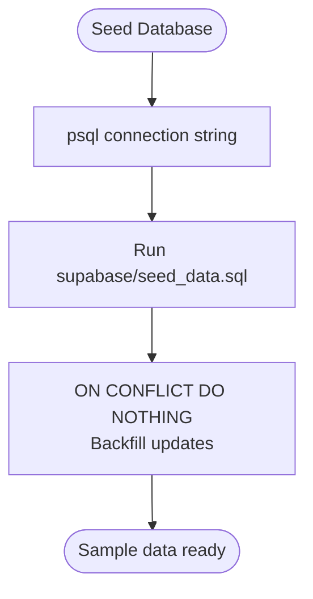
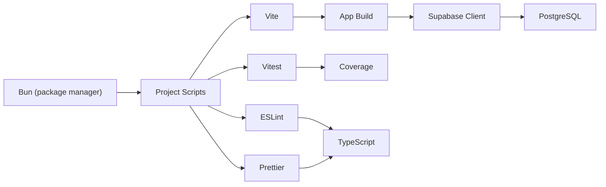

# Getting Started

<cite>
**Referenced Files in This Document**
- [README.md](file://README.md)
- [package.json](file://package.json)
- [bunfig.toml](file://bunfig.toml)
- [vite.config.ts](file://vite.config.ts)
- [wrangler.jsonc](file://wrangler.jsonc)
- [scripts/validate-migrations.mjs](file://scripts/validate-migrations.mjs)
- [.github/workflows/ci.yml](file://.github/workflows/ci.yml)
- [.github/workflows/deploy.yml](file://.github/workflows/deploy.yml)
- [src/integrations/supabase/client.ts](file://src/integrations/supabase/client.ts)
- [src/integrations/supabase/client.server.ts](file://src/integrations/supabase/client.server.ts)
- [supabase/config.toml](file://supabase/config.toml)
- [supabase/seed_data.sql](file://supabase/seed_data.sql)
- [tsconfig.json](file://tsconfig.json)
</cite>

## Table of Contents

1. [Introduction](#introduction)
2. [Project Structure](#project-structure)
3. [Core Components](#core-components)
4. [Architecture Overview](#architecture-overview)
5. [Detailed Component Analysis](#detailed-component-analysis)
6. [Dependency Analysis](#dependency-analysis)
7. [Performance Considerations](#performance-considerations)
8. [Troubleshooting Guide](#troubleshooting-guide)
9. [Conclusion](#conclusion)
10. [Appendices](#appendices)

## Introduction

This guide helps you set up the PCReady development environment locally and in CI/CD. It covers prerequisites, installation, environment configuration, development workflow, quality assurance commands, CI/CD secrets, and database seeding. It also highlights security best practices for Supabase environment variables and provides Windows-specific guidance for using Bun.

## Project Structure

PCReady is a React + TypeScript application using TanStack Router and TanStack Start with file-based routing, Vite for dev/build, Supabase for authentication, database, and storage, and Cloudflare Workers via Wrangler for deployment. The Supabase project is configured with migrations and seed data.

**Diagram sources**

- [vite.config.ts:1-58](file://vite.config.ts#L1-L58)
- [wrangler.jsonc:1-8](file://wrangler.jsonc#L1-L8)
- [src/integrations/supabase/client.ts:1-41](file://src/integrations/supabase/client.ts#L1-L41)

**Section sources**

- [README.md:50-148](file://README.md#L50-L148)
- [package.json:7-21](file://package.json#L7-L21)
- [wrangler.jsonc:1-8](file://wrangler.jsonc#L1-L8)

## Core Components

- Package manager: Bun (>= 1.x). The project uses Bun’s lockfile and scripts.
- Supabase integration: Two clients are provided—one for the browser using VITE*SUPABASE*_ keys and one for server/admin using SUPABASE\__ keys.
- Build and dev: Vite dev server and build pipeline.
- Quality and tests: ESLint, TypeScript typecheck, Vitest, and a migration validator script.
- CI/CD: GitHub Actions workflows for CI and deployment to Cloudflare Workers.

**Section sources**

- [README.md:52-103](file://README.md#L52-L103)
- [package.json:7-21](file://package.json#L7-L21)
- [src/integrations/supabase/client.ts:5-29](file://src/integrations/supabase/client.ts#L5-L29)
- [src/integrations/supabase/client.server.ts:8-29](file://src/integrations/supabase/client.server.ts#L8-L29)

## Architecture Overview

The Supabase client configuration supports both client and server environments:

- Client-side client reads VITE*SUPABASE*\* variables (exposed at build time) and falls back to process.env for SSR.
- Server-side admin client reads SUPABASE\_\* variables from the server environment and uses the service role key.

**Diagram sources**

- [src/integrations/supabase/client.ts:5-29](file://src/integrations/supabase/client.ts#L5-L29)
- [src/integrations/supabase/client.server.ts:8-29](file://src/integrations/supabase/client.server.ts#L8-L29)

## Detailed Component Analysis

### Prerequisites

- Bun >= 1.x
- Supabase account and a configured project with migrations applied
- Windows users: use Bun for dependency management; some verification commands can be run with npm.cmd on Windows

**Section sources**

- [README.md:52-57](file://README.md#L52-L57)
- [README.md:143-147](file://README.md#L143-L147)

### Installation

- Install dependencies using Bun:
  - bun install

**Section sources**

- [README.md:60-62](file://README.md#L60-L62)
- [package.json:7-21](file://package.json#L7-L21)

### Environment Variables and Security Best Practices

- Copy the example environment file to .env.local and fill in Supabase values.
- Server-side variables (SUPABASE_URL, SUPABASE_SERVICE_ROLE_KEY) must remain server-only.
- Client-side variables (VITE_SUPABASE_URL, VITE_SUPABASE_PUBLISHABLE_KEY) are exposed to the browser and must not include the service role key.
- The Supabase client prefers VITE\_\* variables in the browser and falls back to process.env for SSR.

**Diagram sources**

- [src/integrations/supabase/client.ts:5-29](file://src/integrations/supabase/client.ts#L5-L29)
- [src/integrations/supabase/client.server.ts:8-29](file://src/integrations/supabase/client.server.ts#L8-L29)

**Section sources**

- [README.md:64-73](file://README.md#L64-L73)
- [src/integrations/supabase/client.ts:5-29](file://src/integrations/supabase/client.ts#L5-L29)
- [src/integrations/supabase/client.server.ts:8-29](file://src/integrations/supabase/client.server.ts#L8-L29)

### Development Workflow

- Local development:
  - bun run dev
- Production build:
  - bun run build
- Quality and tests:
  - bun run lint
  - bun run typecheck
  - bun run test
  - bun run migrations:check

**Diagram sources**

- [package.json:11-19](file://package.json#L11-L19)
- [scripts/validate-migrations.mjs:1-43](file://scripts/validate-migrations.mjs#L1-L43)

**Section sources**

- [README.md:74-93](file://README.md#L74-L93)
- [package.json:7-21](file://package.json#L7-L21)

### CI/CD Configuration (GitHub Actions)

- CI workflow runs on pull requests to main and develop, validating typecheck, lint, migrations, and build.
- Deploy workflow runs on pushes to main, building and deploying to Cloudflare Workers after validating required secrets.
- Required secrets for CI:
  - SUPABASE_URL
  - SUPABASE_PUBLISHABLE_KEY
  - SUPABASE_SERVICE_ROLE_KEY
  - VITE_SUPABASE_URL
  - VITE_SUPABASE_PUBLISHABLE_KEY
- Required secrets for deployment:
  - CLOUDFLARE_API_TOKEN
  - CLOUDFLARE_ACCOUNT_ID
  - SUPABASE_DB_URL

**Diagram sources**

- [.github/workflows/ci.yml:1-32](file://.github/workflows/ci.yml#L1-L32)

**Section sources**

- [.github/workflows/ci.yml:1-32](file://.github/workflows/ci.yml#L1-L32)
- [.github/workflows/deploy.yml:1-53](file://.github/workflows/deploy.yml#L1-L53)
- [README.md:95-103](file://README.md#L95-L103)

### Database Seeding

- Apply the seed data SQL to your local/dev database using psql or the Supabase CLI.
- The seed is idempotent and safe to re-run; it uses ON CONFLICT checks and backfill updates.

**Diagram sources**

- [supabase/seed_data.sql:1-226](file://supabase/seed_data.sql#L1-L226)

**Section sources**

- [README.md:149-159](file://README.md#L149-L159)
- [supabase/seed_data.sql:1-226](file://supabase/seed_data.sql#L1-L226)

### Windows-Specific Considerations

- Use Bun for dependency management and scripts.
- Some verification commands can be executed with npm.cmd on Windows, but dependency management remains Bun’s responsibility.

**Section sources**

- [README.md:143-147](file://README.md#L143-L147)

## Dependency Analysis

- Bun is the primary package manager; the project specifies Bun’s behavior in bunfig.toml.
- Supabase configuration is identified by project_id in supabase/config.toml.
- TypeScript configuration enables bundler module resolution and strictness.

**Diagram sources**

- [bunfig.toml:1-3](file://bunfig.toml#L1-L3)
- [package.json:7-21](file://package.json#L7-L21)
- [vite.config.ts:1-58](file://vite.config.ts#L1-L58)
- [tsconfig.json:1-30](file://tsconfig.json#L1-L30)

**Section sources**

- [bunfig.toml:1-3](file://bunfig.toml#L1-L3)
- [supabase/config.toml:1-1](file://supabase/config.toml#L1-L1)
- [tsconfig.json:1-30](file://tsconfig.json#L1-L30)

## Performance Considerations

- Vite build warnings and Rollup chunking are tuned in vite.config.ts to manage bundle sizes and SSR compatibility.
- Consider enabling parallel builds and caching in CI/CD for faster feedback.

[No sources needed since this section provides general guidance]

## Troubleshooting Guide

- Missing Supabase variables:
  - Client-side: Ensure VITE_SUPABASE_URL and VITE_SUPABASE_PUBLISHABLE_KEY are set.
  - Server-side: Ensure SUPABASE_URL and SUPABASE_SERVICE_ROLE_KEY are set.
- Migration validation failures:
  - The migrations check script validates filename patterns, emptiness, merge conflict markers, and balanced dollar-quoted blocks.
- CI/CD secrets:
  - Verify GitHub Secrets are configured for SUPABASE_URL, SUPABASE_PUBLISHABLE_KEY, SUPABASE_SERVICE_ROLE_KEY, VITE_SUPABASE_URL, VITE_SUPABASE_PUBLISHABLE_KEY, CLOUDFLARE_API_TOKEN, CLOUDFLARE_ACCOUNT_ID, and SUPABASE_DB_URL.

**Section sources**

- [src/integrations/supabase/client.ts:12-20](file://src/integrations/supabase/client.ts#L12-L20)
- [src/integrations/supabase/client.server.ts:12-20](file://src/integrations/supabase/client.server.ts#L12-L20)
- [scripts/validate-migrations.mjs:9-32](file://scripts/validate-migrations.mjs#L9-L32)
- [.github/workflows/ci.yml:10-15](file://.github/workflows/ci.yml#L10-L15)
- [.github/workflows/deploy.yml:34-46](file://.github/workflows/deploy.yml#L34-L46)

## Conclusion

You now have a complete guide to set up PCReady locally and in CI/CD, configure environment variables securely, run quality checks, and seed the database. Follow the steps above to ensure a smooth development experience with Bun, Supabase, and Cloudflare Workers.

## Appendices

### Appendix A: Environment Variable Reference

- Client-side (browser):
  - VITE_SUPABASE_URL
  - VITE_SUPABASE_PUBLISHABLE_KEY
- Server-side (admin):
  - SUPABASE_URL
  - SUPABASE_SERVICE_ROLE_KEY

**Section sources**

- [README.md:64-73](file://README.md#L64-L73)
- [src/integrations/supabase/client.ts:5-29](file://src/integrations/supabase/client.ts#L5-L29)
- [src/integrations/supabase/client.server.ts:8-29](file://src/integrations/supabase/client.server.ts#L8-L29)
