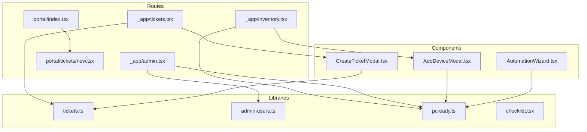
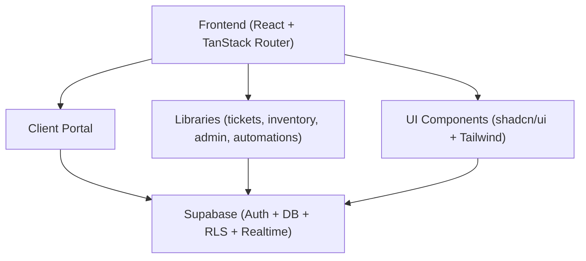
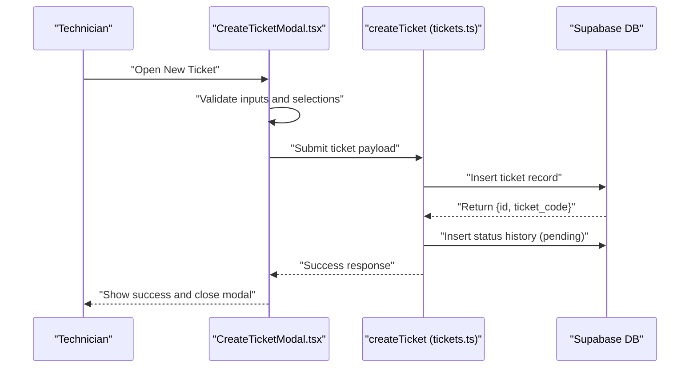
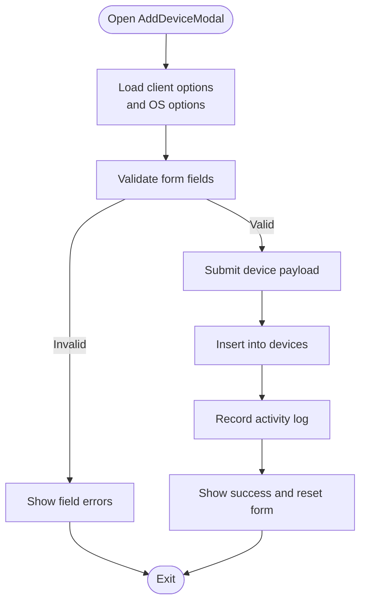
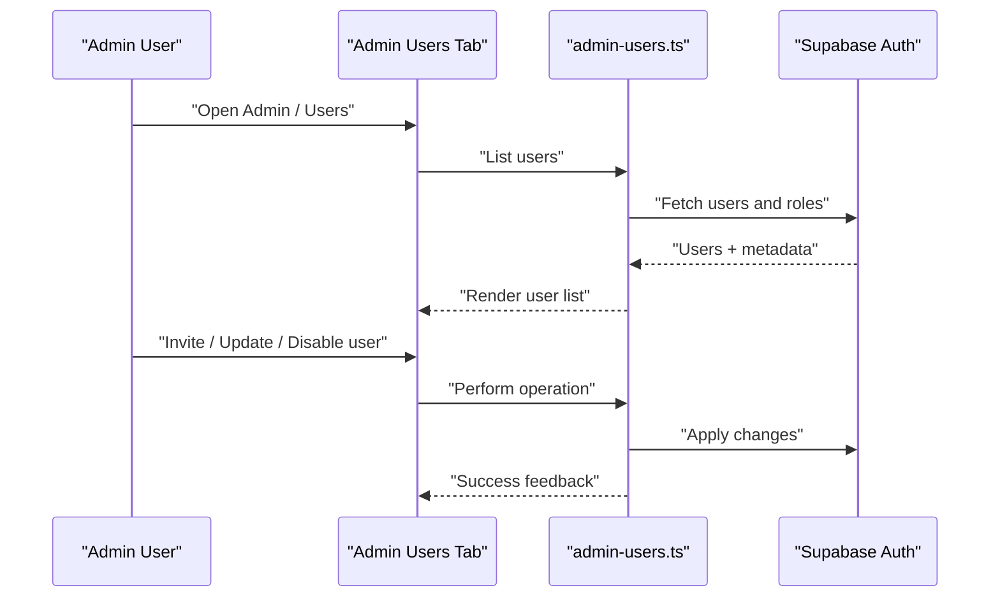
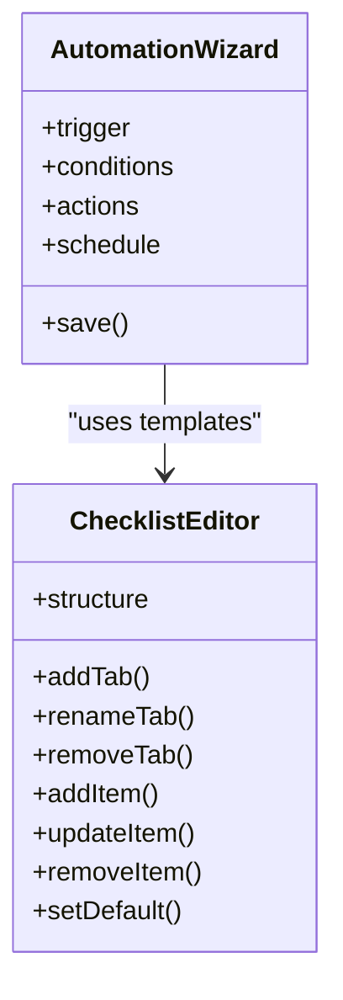
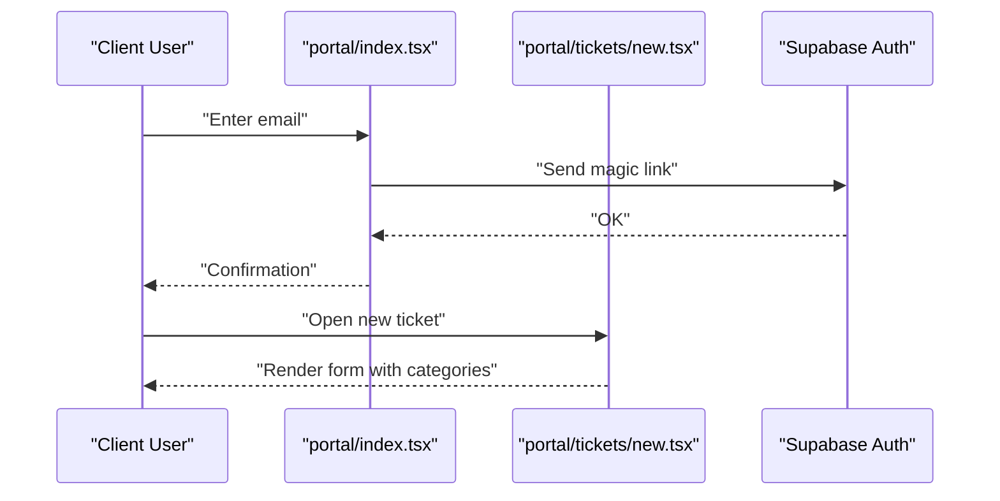
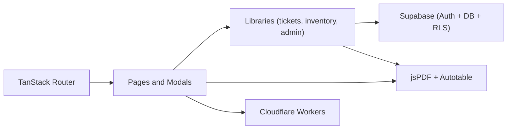

# Introduction

<cite>
**Referenced Files in This Document**
- [README.md](file://README.md)
- [pcready.ts](file://src/lib/pcready.ts)
- [tickets.tsx](file://src/routes/_app/tickets.tsx)
- [inventory.tsx](file://src/routes/_app/inventory.tsx)
- [admin.tsx](file://src/routes/_app/admin.tsx)
- [CreateTicketModal.tsx](file://src/components/pcready/CreateTicketModal.tsx)
- [AddDeviceModal.tsx](file://src/components/pcready/AddDeviceModal.tsx)
- [tickets.ts](file://src/lib/tickets.ts)
- [admin-users.ts](file://src/lib/admin-users.ts)
- [checklist.tsx](file://src/routes/_app/checklist.tsx)
- [checklist-structure.ts](file://src/types/checklist-structure.ts)
- [index.tsx](file://src/routes/portal/index.tsx)
- [new.tsx](file://src/routes/portal/tickets/new.tsx)
- [AutomationWizard.tsx](file://src/components/automations/AutomationWizard.tsx)
</cite>

## Table of Contents

1. [Introduction](#introduction)
2. [Project Structure](#project-structure)
3. [Core Components](#core-components)
4. [Architecture Overview](#architecture-overview)
5. [Detailed Component Analysis](#detailed-component-analysis)
6. [Dependency Analysis](#dependency-analysis)
7. [Performance Considerations](#performance-considerations)
8. [Troubleshooting Guide](#troubleshooting-guide)
9. [Conclusion](#conclusion)

## Introduction

PCReady is a centralized web application designed to streamline enterprise-grade IT service management workflows around PC preparation and device lifecycle operations. It unifies three pillars:

- Operational ticketing: end-to-end ticket workflow for PC preparation and related tasks
- Device inventory: structured tracking and status management of physical assets
- Automation and standardization: configurable checklist templates and automation rules to reduce manual effort and enforce repeatable procedures

At its core, PCReady reduces manual overhead by standardizing processes, automating routine steps, and providing clear visibility into ticket progress and device status. This enables technicians to focus on execution while administrators maintain governance and compliance.

### Value Proposition

- Reduce manual overhead: automated ticket numbering, checklist templates, and PDF exports minimize repetitive tasks.
- Standardize procedures: predefined checklist structures and automation rules ensure consistent outcomes across teams.
- Centralized visibility: unified dashboards and real-time updates keep stakeholders informed on ticket and inventory status.
- Scalable governance: role-based access, audit logging, and admin controls support enterprise needs.

### Practical Use Cases

- Technician creates a PC preparation ticket, selects an existing device, assigns a checklist template, and starts work. The system generates a unique ticket code and tracks status history.
- Administrator manages users, roles, and app settings, and can configure automation rules to trigger actions when tickets meet specific conditions.
- Client portal user requests a new ticket via a secure magic-link login, describes their issue, and receives updates through the portal.

## Project Structure

PCReady follows a file-based routing architecture with clear separation of concerns:

- Routes define top-level pages and subpages for staff and client portals
- Components encapsulate reusable UI and domain-specific building blocks
- Libraries provide shared logic for tickets, inventory, checklists, automations, and admin operations
- Integrations connect to Supabase for authentication, database, and real-time features

**Diagram sources**

- [tickets.tsx:1-400](file://src/routes/_app/tickets.tsx#L1-L400)
- [inventory.tsx:1-580](file://src/routes/_app/inventory.tsx#L1-L580)
- [admin.tsx:1-50](file://src/routes/_app/admin.tsx#L1-L50)
- [index.tsx:1-73](file://src/routes/portal/index.tsx#L1-L73)
- [new.tsx:1-76](file://src/routes/portal/tickets/new.tsx#L1-L76)
- [CreateTicketModal.tsx:1-559](file://src/components/pcready/CreateTicketModal.tsx#L1-L559)
- [AddDeviceModal.tsx:1-218](file://src/components/pcready/AddDeviceModal.tsx#L1-L218)
- [AutomationWizard.tsx:1-168](file://src/components/automations/AutomationWizard.tsx#L1-L168)
- [tickets.ts:1-111](file://src/lib/tickets.ts#L1-L111)
- [admin-users.ts:1-279](file://src/lib/admin-users.ts#L1-L279)
- [pcready.ts:1-241](file://src/lib/pcready.ts#L1-L241)
- [checklist.tsx:1-556](file://src/routes/_app/checklist.tsx#L1-L556)

**Section sources**

- [README.md:125-134](file://README.md#L125-L134)
- [tickets.tsx:1-400](file://src/routes/_app/tickets.tsx#L1-L400)
- [inventory.tsx:1-580](file://src/routes/_app/inventory.tsx#L1-L580)
- [admin.tsx:1-50](file://src/routes/_app/admin.tsx#L1-L50)
- [index.tsx:1-73](file://src/routes/portal/index.tsx#L1-L73)
- [new.tsx:1-76](file://src/routes/portal/tickets/new.tsx#L1-L76)

## Core Components

This section outlines the primary building blocks that enable PC preparation workflows and operational excellence.

- Ticket workflow
  - End-to-end lifecycle from creation to completion, with statuses, priorities, and types
  - Unique ticket code generation handled server-side to prevent collisions
  - Checklist templates and dynamic structures to standardize preparation steps
  - PDF export of ticket lists for reporting and audits

- Device inventory
  - Dedicated device management with status tracking (available, assigned, maintenance, retired)
  - Barcode/QR scanning and CSV import for efficient onboarding
  - Real-time status badges and batch operations for streamlined updates

- Administration
  - Role-based access control (admin, tech, viewer)
  - User management, invitations, and status controls
  - Audit logs and activity tracking for governance

- Automation
  - Visual wizard to define triggers, conditions, actions, and schedules
  - Versioning and change notes for rule evolution and compliance

- Client portal
  - Secure magic-link login for clients
  - Form-driven ticket creation with category selection and notes

**Section sources**

- [README.md:17-29](file://README.md#L17-L29)
- [pcready.ts:1-241](file://src/lib/pcready.ts#L1-L241)
- [tickets.tsx:1-400](file://src/routes/_app/tickets.tsx#L1-L400)
- [inventory.tsx:1-580](file://src/routes/_app/inventory.tsx#L1-L580)
- [admin.tsx:1-50](file://src/routes/_app/admin.tsx#L1-L50)
- [CreateTicketModal.tsx:1-559](file://src/components/pcready/CreateTicketModal.tsx#L1-L559)
- [AddDeviceModal.tsx:1-218](file://src/components/pcready/AddDeviceModal.tsx#L1-L218)
- [tickets.ts:1-111](file://src/lib/tickets.ts#L1-L111)
- [admin-users.ts:1-279](file://src/lib/admin-users.ts#L1-L279)
- [checklist.tsx:1-556](file://src/routes/_app/checklist.tsx#L1-L556)
- [checklist-structure.ts:1-30](file://src/types/checklist-structure.ts#L1-L30)
- [index.tsx:1-73](file://src/routes/portal/index.tsx#L1-L73)
- [new.tsx:1-76](file://src/routes/portal/tickets/new.tsx#L1-L76)

## Architecture Overview

PCReady integrates a modern frontend stack with Supabase for backend services. The architecture emphasizes:

- Frontend: React + TypeScript with file-based routing, TanStack Router, and shadcn/ui + Tailwind
- Backend: Supabase for authentication, database, storage, and real-time subscriptions
- DevOps: Vite build, Cloudflare Workers deployment, and GitHub Actions CI

**Diagram sources**

- [README.md:7-16](file://README.md#L7-L16)
- [tickets.tsx:1-400](file://src/routes/_app/tickets.tsx#L1-L400)
- [inventory.tsx:1-580](file://src/routes/_app/inventory.tsx#L1-L580)
- [admin.tsx:1-50](file://src/routes/_app/admin.tsx#L1-L50)
- [index.tsx:1-73](file://src/routes/portal/index.tsx#L1-L73)
- [new.tsx:1-76](file://src/routes/portal/tickets/new.tsx#L1-L76)

## Detailed Component Analysis

### Ticket Workflow

The ticket workflow orchestrates PC preparation from creation to completion. It includes:

- Creation modal with client/contact/device selection, checklist template assignment, and optional software list
- Server-side creation enforcing validation and inserting records with a generated ticket code
- Status transitions tracked via dedicated history entries
- PDF export of filtered ticket lists for reporting

**Diagram sources**

- [CreateTicketModal.tsx:196-300](file://src/components/pcready/CreateTicketModal.tsx#L196-L300)
- [tickets.ts:50-111](file://src/lib/tickets.ts#L50-L111)

**Section sources**

- [README.md:30-42](file://README.md#L30-L42)
- [CreateTicketModal.tsx:1-559](file://src/components/pcready/CreateTicketModal.tsx#L1-L559)
- [tickets.ts:1-111](file://src/lib/tickets.ts#L1-L111)
- [tickets.tsx:1-400](file://src/routes/_app/tickets.tsx#L1-L400)
- [pcready.ts:1-60](file://src/lib/pcready.ts#L1-L60)

### Device Inventory

The inventory module supports device onboarding, status management, and reporting:

- Add device modal captures brand/model/serial, client/end user, OS, and notes
- Status badges allow quick updates with safeguards (e.g., preventing state changes during active assignments)
- Barcode scanner and QR code dialogs improve discovery and labeling
- CSV import and batch printing streamline large-scale operations

**Diagram sources**

- [AddDeviceModal.tsx:27-118](file://src/components/pcready/AddDeviceModal.tsx#L27-L118)

**Section sources**

- [README.md:38-42](file://README.md#L38-L42)
- [AddDeviceModal.tsx:1-218](file://src/components/pcready/AddDeviceModal.tsx#L1-L218)
- [inventory.tsx:1-580](file://src/routes/_app/inventory.tsx#L1-L580)
- [pcready.ts:52-64](file://src/lib/pcready.ts#L52-L64)

### Administration and User Management

Administrators manage users, roles, and system settings:

- List, update, invite, resend invites, disable, and delete users
- Enforce constraints (e.g., preventing removal of the last admin)
- Real-time notifications and audit logs for governance

**Diagram sources**

- [admin-users.ts:88-135](file://src/lib/admin-users.ts#L88-L135)
- [admin.tsx:23-48](file://src/routes/_app/admin.tsx#L23-L48)

**Section sources**

- [README.md:135-142](file://README.md#L135-L142)
- [admin-users.ts:1-279](file://src/lib/admin-users.ts#L1-L279)
- [admin.tsx:1-50](file://src/routes/_app/admin.tsx#L1-L50)

### Automation and Checklist Templates

PCReady provides powerful automation and checklist customization:

- Automation wizard defines triggers, conditions, actions, scheduling, and review
- Checklist editor allows creating, renaming, deleting sections and items, and setting a default template
- Versioning and change notes ensure traceability and compliance

**Diagram sources**

- [AutomationWizard.tsx:1-168](file://src/components/automations/AutomationWizard.tsx#L1-L168)
- [checklist.tsx:267-556](file://src/routes/_app/checklist.tsx#L267-L556)
- [checklist-structure.ts:1-30](file://src/types/checklist-structure.ts#L1-L30)

**Section sources**

- [checklist.tsx:1-556](file://src/routes/_app/checklist.tsx#L1-L556)
- [checklist-structure.ts:1-30](file://src/types/checklist-structure.ts#L1-L30)
- [pcready.ts:66-127](file://src/lib/pcready.ts#L66-L127)
- [AutomationWizard.tsx:1-168](file://src/components/automations/AutomationWizard.tsx#L1-L168)

### Client Portal Access

The client portal enables secure, passwordless access:

- Magic-link login via email
- Category-aware ticket creation form
- Seamless navigation to dashboard and ticket list

**Diagram sources**

- [index.tsx:16-72](file://src/routes/portal/index.tsx#L16-L72)
- [new.tsx:15-76](file://src/routes/portal/tickets/new.tsx#L15-L76)

**Section sources**

- [index.tsx:1-73](file://src/routes/portal/index.tsx#L1-L73)
- [new.tsx:1-76](file://src/routes/portal/tickets/new.tsx#L1-L76)

## Dependency Analysis

PCReady’s dependencies reflect a cohesive stack emphasizing developer productivity and reliability:

- Routing and rendering: TanStack Router and TanStack Start
- UI: shadcn/ui + Tailwind CSS
- Data and auth: Supabase (auth, database, RLS, realtime)
- PDF generation: jsPDF + jspdf-autotable
- Deployment: Cloudflare Workers with Wrangler

**Diagram sources**

- [README.md:7-16](file://README.md#L7-L16)
- [tickets.tsx:1-400](file://src/routes/_app/tickets.tsx#L1-L400)
- [inventory.tsx:1-580](file://src/routes/_app/inventory.tsx#L1-L580)
- [admin.tsx:1-50](file://src/routes/_app/admin.tsx#L1-L50)

**Section sources**

- [README.md:7-16](file://README.md#L7-L16)

## Performance Considerations

- Server-side pagination and filtering reduce memory usage and improve responsiveness for large datasets
- Real-time channels subscribe to updates for near-instant UI refreshes
- PDF generation targets current page filters to avoid heavy client-side computations
- Batch operations (e.g., device status updates, checklist bulk edits) minimize repeated network calls

[No sources needed since this section provides general guidance]

## Troubleshooting Guide

Common issues and resolutions:

- Authentication failures: verify environment variables for Supabase and ensure access tokens are present during server-side operations
- Rate limiting: server functions enforce limits for ticket creation and user invitations; retry after cooldown
- Real-time updates: ensure Supabase realtime channels are subscribed and properly unsubscribed on route changes
- PDF export errors: confirm current page filters and session access token availability before generating exports

**Section sources**

- [tickets.ts:50-111](file://src/lib/tickets.ts#L50-L111)
- [admin-users.ts:1-279](file://src/lib/admin-users.ts#L1-L279)
- [tickets.tsx:112-122](file://src/routes/_app/tickets.tsx#L112-L122)
- [inventory.tsx:142-176](file://src/routes/_app/inventory.tsx#L142-L176)

## Conclusion

PCReady delivers a robust, scalable platform for enterprise IT service management centered on PC preparation. By integrating ticket workflow, device inventory, automation, and a secure client portal, it standardizes processes, reduces manual overhead, and improves operational visibility. Administrators gain strong governance tools, while technicians benefit from streamlined workflows and consistent procedures. The result is a reliable foundation for growing IT operations with predictable outcomes and clear audit trails.
