# Key Features

<cite>
**Referenced Files in This Document**
- [README.md](file://README.md)
- [dashboard.tsx](file://src/routes/_app/dashboard.tsx)
- [tickets.tsx](file://src/routes/_app/tickets.tsx)
- [kanban.tsx](file://src/routes/_app/kanban.tsx)
- [inventory.tsx](file://src/routes/_app/inventory.tsx)
- [admin.tsx](file://src/routes/_app/admin.tsx)
- [CreateTicketModal.tsx](file://src/components/pcready/CreateTicketModal.tsx)
- [AddDeviceModal.tsx](file://src/components/pcready/AddDeviceModal.tsx)
- [TicketListPdf.tsx](file://src/components/pcready/pdf/TicketListPdf.tsx)
- [InventoryPdf.tsx](file://src/components/pcready/pdf/InventoryPdf.tsx)
- [SwimLaneView.tsx](file://src/components/kanban/SwimLaneView.tsx)
- [AdminUsersTab.tsx](file://src/components/admin/AdminUsersTab.tsx)
- [audit-log.ts](file://src/lib/audit-log.ts)
- [export-data.ts](file://src/lib/export-data.ts)
- [BackupMetric.tsx](file://src/components/admin/BackupMetric.tsx)
</cite>

## Table of Contents
1. [Introduction](#introduction)
2. [Project Structure](#project-structure)
3. [Core Components](#core-components)
4. [Architecture Overview](#architecture-overview)
5. [Detailed Component Analysis](#detailed-component-analysis)
6. [Dependency Analysis](#dependency-analysis)
7. [Performance Considerations](#performance-considerations)
8. [Troubleshooting Guide](#troubleshooting-guide)
9. [Conclusion](#conclusion)

## Introduction
This document presents the key features of PCReady as implemented in the application. It covers the operational dashboard, server-side filtered and paginated ticket listing, Kanban board for ticket states, configurable checklist templates, dedicated device inventory workflow, formatted PDF exports, PC preparation scripts derived from ticket data, user and role management via the Admin section, activity logging for user actions and automations, and Admin backup & disaster recovery with ZIP-like CSV exports. The content balances stakeholder-friendly explanations with developer-oriented implementation details and references.

## Project Structure
PCReady is a React + TypeScript application with file-based routing, Supabase for authentication, database, and real-time replication, and PDF generation via @react-pdf/renderer. The routes under the application shell expose the primary features:
- Dashboard: overview widgets, recent tickets, state distribution, and recent activity
- Tickets: server-side filtered list with pagination and PDF export
- Kanban: drag-and-drop board with swim lanes and WIP limits
- Inventory: device listing with status badges, filters, QR/CSV/label utilities, and PDF export
- Admin: user management, settings, OAuth apps, audit log, and backup/recovery

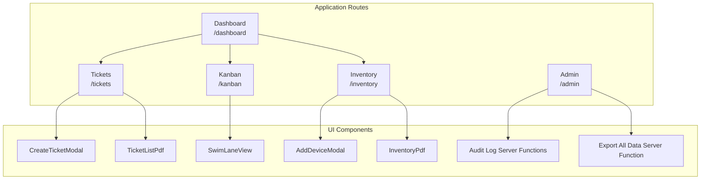

**Diagram sources**
- [dashboard.tsx:1-448](file://src/routes/_app/dashboard.tsx#L1-L448)
- [tickets.tsx:1-400](file://src/routes/_app/tickets.tsx#L1-L400)
- [kanban.tsx:1-420](file://src/routes/_app/kanban.tsx#L1-L420)
- [inventory.tsx:1-580](file://src/routes/_app/inventory.tsx#L1-L580)
- [admin.tsx:1-50](file://src/routes/_app/admin.tsx#L1-L50)
- [CreateTicketModal.tsx:1-559](file://src/components/pcready/CreateTicketModal.tsx#L1-L559)
- [AddDeviceModal.tsx:1-218](file://src/components/pcready/AddDeviceModal.tsx#L1-L218)
- [SwimLaneView.tsx:1-140](file://src/components/kanban/SwimLaneView.tsx#L1-L140)
- [TicketListPdf.tsx:1-125](file://src/components/pcready/pdf/TicketListPdf.tsx#L1-L125)
- [InventoryPdf.tsx:1-93](file://src/components/pcready/pdf/InventoryPdf.tsx#L1-L93)
- [audit-log.ts:1-183](file://src/lib/audit-log.ts#L1-L183)
- [export-data.ts:1-62](file://src/lib/export-data.ts#L1-L62)

**Section sources**
- [README.md:17-28](file://README.md#L17-L28)
- [dashboard.tsx:1-448](file://src/routes/_app/dashboard.tsx#L1-L448)
- [tickets.tsx:1-400](file://src/routes/_app/tickets.tsx#L1-L400)
- [kanban.tsx:1-420](file://src/routes/_app/kanban.tsx#L1-L420)
- [inventory.tsx:1-580](file://src/routes/_app/inventory.tsx#L1-L580)
- [admin.tsx:1-50](file://src/routes/_app/admin.tsx#L1-L50)

## Core Components
- Dashboard: displays summary cards, analytics widgets, recent tickets, state distribution, and recent activity logs. It supports date-range filtering and PDF export of analytics.
- Tickets: server-side paginated list with filters for status, priority, type, and client; supports PDF preview/download of current page.
- Kanban: drag-and-drop board with “pending”, “in-progress”, “testing”, “ready” lanes; swim lane view; WIP limits; status history and completion workflow; real-time updates.
- Inventory: device listing with status badges, filters, QR/CSV/label utilities; PDF preview/download of current page; barcode scanner integration.
- Admin: user management (invite, bulk actions, CSV export), settings, OAuth applications, audit log viewer and CSV export, backup/recovery data export.
- PDF Exporters: branded PDFs for tickets and inventory with statistics and tables.
- Activity Logging: centralized audit log with deduplication and CSV export.

**Section sources**
- [dashboard.tsx:55-447](file://src/routes/_app/dashboard.tsx#L55-L447)
- [tickets.tsx:66-394](file://src/routes/_app/tickets.tsx#L66-L394)
- [kanban.tsx:58-406](file://src/routes/_app/kanban.tsx#L58-L406)
- [inventory.tsx:63-491](file://src/routes/_app/inventory.tsx#L63-L491)
- [admin.tsx:23-48](file://src/routes/_app/admin.tsx#L23-L48)
- [TicketListPdf.tsx:27-96](file://src/components/pcready/pdf/TicketListPdf.tsx#L27-L96)
- [InventoryPdf.tsx:26-84](file://src/components/pcready/pdf/InventoryPdf.tsx#L26-L84)
- [audit-log.ts:23-107](file://src/lib/audit-log.ts#L23-L107)

## Architecture Overview
The application follows a layered architecture:
- Routes define pages and orchestrate data fetching and rendering.
- Components encapsulate UI and interactions (modals, views, PDF renderers).
- Hooks and server functions abstract data access, real-time updates, and server-side operations.
- Supabase provides authentication, database, RLS, and real-time replication.

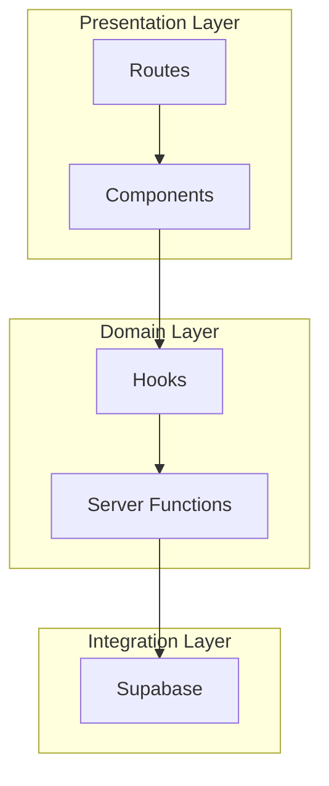

[No sources needed since this diagram shows conceptual workflow, not actual code structure]

## Detailed Component Analysis

### Dashboard: Operational Overview and Recent Activity
- Purpose: Provide a snapshot of ticket and device health, plus recent activity.
- Key capabilities:
  - Summary cards for totals and highlights
  - Analytics widgets with date-range picker and PDF export
  - Recent tickets table with quick navigation
  - State distribution pie and recent activity feed
- Implementation highlights:
  - Uses server functions for public app settings to personalize PDFs
  - Integrates analytics helpers and PDF generator for reports
  - Pulls deduplicated activity logs for display

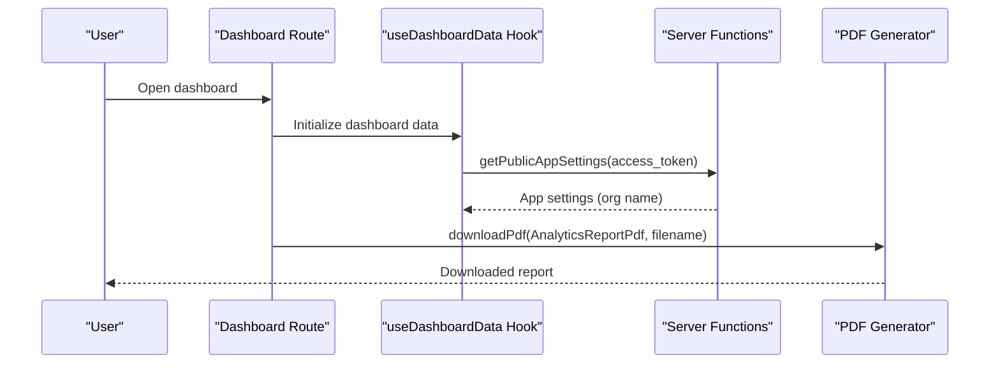

**Diagram sources**
- [dashboard.tsx:55-190](file://src/routes/_app/dashboard.tsx#L55-L190)
- [audit-log.ts:23-107](file://src/lib/audit-log.ts#L23-L107)

**Section sources**
- [dashboard.tsx:55-447](file://src/routes/_app/dashboard.tsx#L55-L447)

### Tickets: Server-Side Filtering, Pagination, and PDF Export
- Purpose: Manage PC preparation tickets with efficient browsing and reporting.
- Key capabilities:
  - Filters: status, priority, type, client
  - Pagination: fixed page size with total count
  - Real-time updates indicator
  - PDF preview and download of current page
- Implementation highlights:
  - Server-side query with count and filters
  - Real-time channel subscription for updates
  - PDF renderer builds a table with priority/status badges

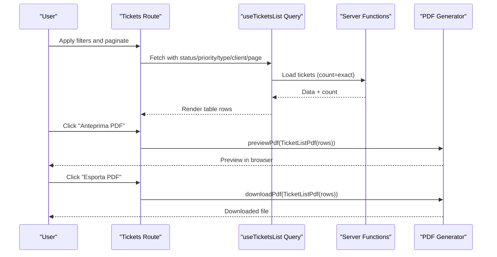

**Diagram sources**
- [tickets.tsx:66-195](file://src/routes/_app/tickets.tsx#L66-L195)
- [TicketListPdf.tsx:27-96](file://src/components/pcready/pdf/TicketListPdf.tsx#L27-L96)

**Section sources**
- [tickets.tsx:66-394](file://src/routes/_app/tickets.tsx#L66-L394)

### Kanban Board: Drag-and-Drop Workflow with WIP Limits
- Purpose: Visualize and move tickets across states with constraints and real-time updates.
- Key capabilities:
  - Columns view and swim lane view
  - WIP limits per state
  - Drag-and-drop with visual feedback
  - Status history and completion workflow
  - Notifications and email on assignment
- Implementation highlights:
  - Real-time table hook for live updates
  - Server function to update ticket status and assignee
  - Activity logging for user actions
  - Completion workflow triggers automation and notifications

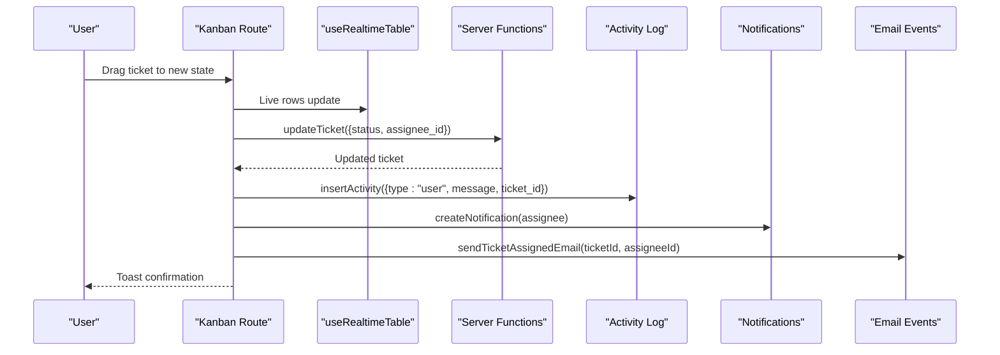

**Diagram sources**
- [kanban.tsx:86-205](file://src/routes/_app/kanban.tsx#L86-L205)
- [audit-log.ts:23-107](file://src/lib/audit-log.ts#L23-L107)

**Section sources**
- [kanban.tsx:58-406](file://src/routes/_app/kanban.tsx#L58-L406)
- [SwimLaneView.tsx:34-139](file://src/components/kanban/SwimLaneView.tsx#L34-L139)

### Configurable Checklist Templates and Ticket Creation
- Purpose: Standardize and pre-populate checklist structures for tickets.
- Key capabilities:
  - Template selection with default option
  - Dynamic fields for device tickets (software, notes)
  - Requester selection or free-text fallback
  - Optional device association
- Implementation highlights:
  - Loads templates and technician/device/client/contact options
  - Validates technician device limits for device tickets
  - Inserts activity log and sends notifications/emails

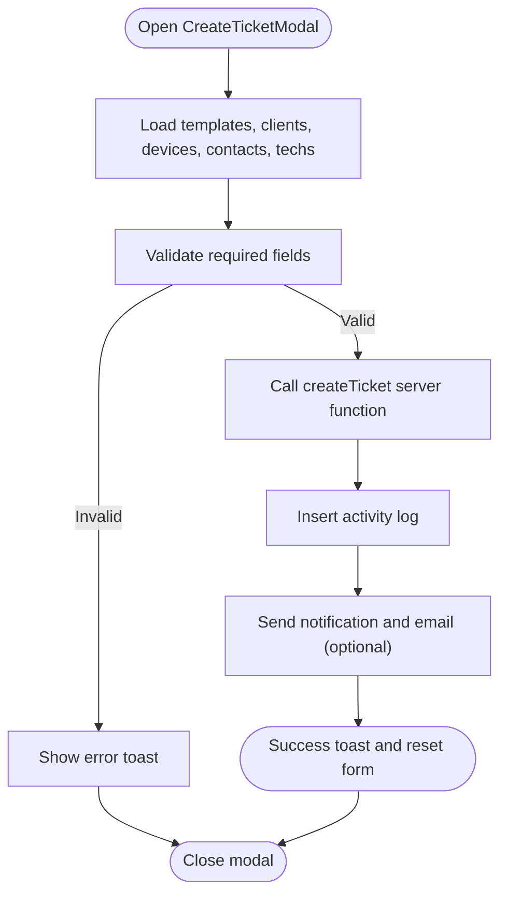

**Diagram sources**
- [CreateTicketModal.tsx:138-300](file://src/components/pcready/CreateTicketModal.tsx#L138-L300)

**Section sources**
- [CreateTicketModal.tsx:138-559](file://src/components/pcready/CreateTicketModal.tsx#L138-L559)

### Dedicated Device Inventory Workflow
- Purpose: Manage physical devices independently from tickets.
- Key capabilities:
  - Add device via modal with client, model, serial, OS, notes
  - List devices with status badges and filters
  - QR code dialog, CSV import, barcode scanner
  - PDF preview/download and label printing
- Implementation highlights:
  - Zod-based form validation
  - Settings-driven OS options and brands
  - Status change with constraints and real-time updates

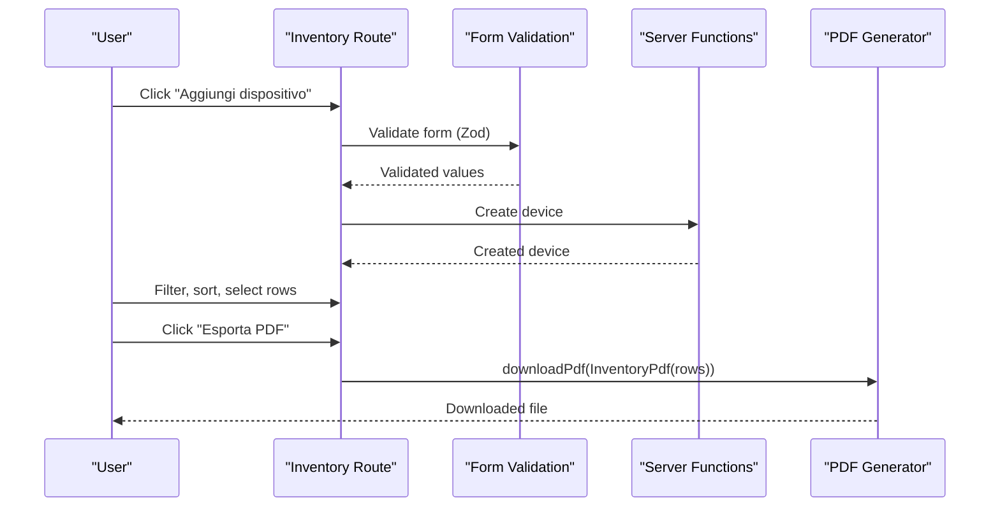

**Diagram sources**
- [AddDeviceModal.tsx:27-118](file://src/components/pcready/AddDeviceModal.tsx#L27-L118)
- [inventory.tsx:63-176](file://src/routes/_app/inventory.tsx#L63-L176)
- [InventoryPdf.tsx:26-84](file://src/components/pcready/pdf/InventoryPdf.tsx#L26-L84)

**Section sources**
- [AddDeviceModal.tsx:27-218](file://src/components/pcready/AddDeviceModal.tsx#L27-L218)
- [inventory.tsx:63-491](file://src/routes/_app/inventory.tsx#L63-L491)

### Formatted PDF Exports for Tickets and Inventory
- Purpose: Produce branded, printable reports for audits and handovers.
- Key capabilities:
  - Statistics strip summarizing priorities/statuses
  - Structured tables with badges for priority/status
  - Organization branding and metadata
- Implementation highlights:
  - Shared components for branded pages, sections, and tables
  - Theme palette for consistent colors

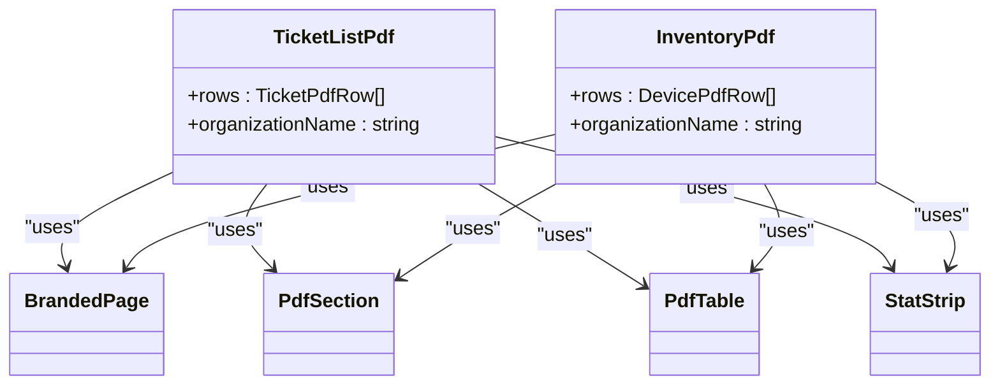

**Diagram sources**
- [TicketListPdf.tsx:27-96](file://src/components/pcready/pdf/TicketListPdf.tsx#L27-L96)
- [InventoryPdf.tsx:26-84](file://src/components/pcready/pdf/InventoryPdf.tsx#L26-L84)

**Section sources**
- [TicketListPdf.tsx:27-125](file://src/components/pcready/pdf/TicketListPdf.tsx#L27-L125)
- [InventoryPdf.tsx:26-93](file://src/components/pcready/pdf/InventoryPdf.tsx#L26-L93)

### User and Role Management via Admin
- Purpose: Invite users, manage roles, enable/disable accounts, bulk operations, and export user data.
- Key capabilities:
  - Invite new users with role selection
  - Bulk role assignment and enable/disable
  - CSV export of selected users
  - Search and filter by role
- Implementation highlights:
  - Admin-only access enforced
  - Server functions for invites, updates, and status toggles
  - CSV generation and download utilities

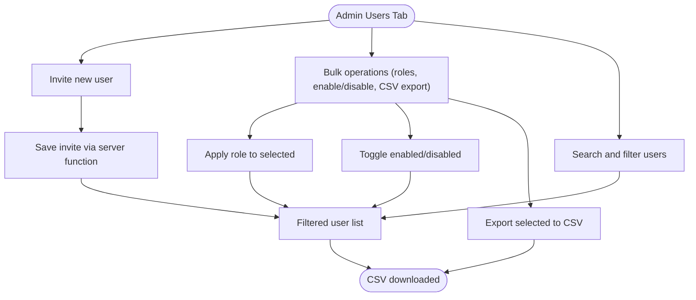

**Diagram sources**
- [AdminUsersTab.tsx:26-491](file://src/components/admin/AdminUsersTab.tsx#L26-L491)

**Section sources**
- [AdminUsersTab.tsx:26-497](file://src/components/admin/AdminUsersTab.tsx#L26-L497)
- [admin.tsx:23-48](file://src/routes/_app/admin.tsx#L23-L48)

### Activity Logging for User Actions and Automations
- Purpose: Track who did what, when, and optionally which ticket was affected.
- Key capabilities:
  - Deduplicated log entries by message and second
  - Filters by user, action type, and date range
  - CSV export of audit log
- Implementation highlights:
  - Server function loads deduplicated view
  - CSV generation with localized timestamps and actor names

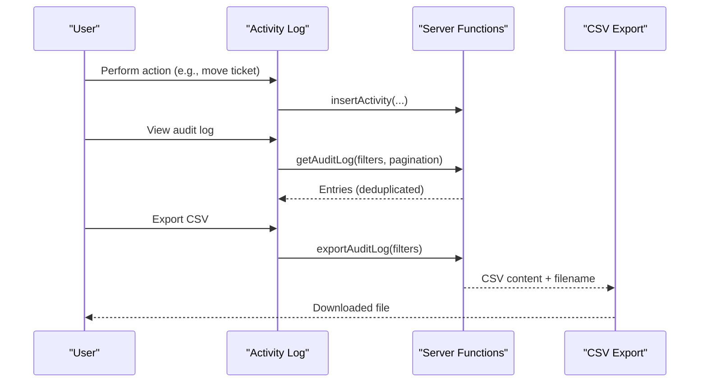

**Diagram sources**
- [audit-log.ts:23-182](file://src/lib/audit-log.ts#L23-L182)

**Section sources**
- [audit-log.ts:23-183](file://src/lib/audit-log.ts#L23-L183)

### Admin Backup & Disaster Recovery with Data Exports
- Purpose: Provide a controlled mechanism to export core data for backup/recovery.
- Key capabilities:
  - Export tickets, devices, and clients to CSV files
  - Rate-limited operation requiring admin access
  - Single endpoint returns multiple CSVs with filenames and row counts
- Implementation highlights:
  - Server function performs concurrent reads and CSV generation
  - Utility for CSV cell escaping and header building

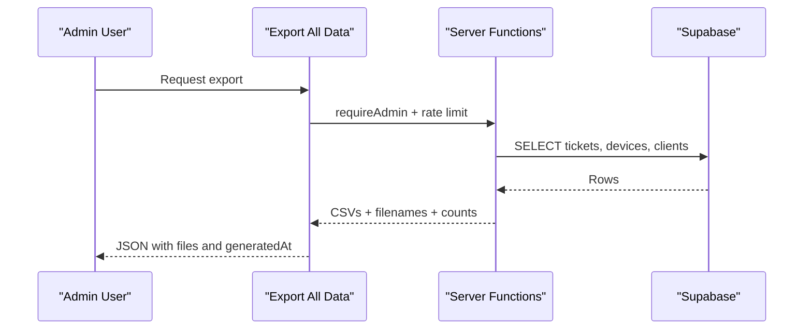

**Diagram sources**
- [export-data.ts:11-52](file://src/lib/export-data.ts#L11-L52)

**Section sources**
- [export-data.ts:1-62](file://src/lib/export-data.ts#L1-L62)
- [BackupMetric.tsx:1-10](file://src/components/admin/BackupMetric.tsx#L1-L10)

## Dependency Analysis
- Routes depend on hooks and server functions for data fetching and mutations.
- Components rely on shared UI primitives and PDF renderers.
- Real-time updates leverage Supabase channels and hooks.
- Admin features enforce role checks and rate limiting.

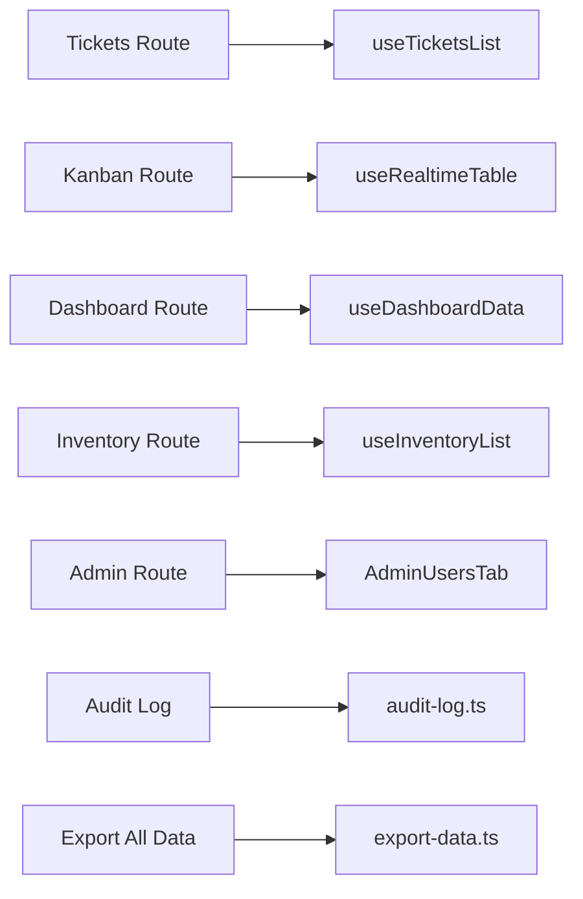

**Diagram sources**
- [tickets.tsx:80-88](file://src/routes/_app/tickets.tsx#L80-L88)
- [kanban.tsx:86-95](file://src/routes/_app/kanban.tsx#L86-L95)
- [dashboard.tsx:59-79](file://src/routes/_app/dashboard.tsx#L59-L79)
- [inventory.tsx:86-94](file://src/routes/_app/inventory.tsx#L86-L94)
- [admin.tsx:23-48](file://src/routes/_app/admin.tsx#L23-L48)
- [audit-log.ts:23-107](file://src/lib/audit-log.ts#L23-L107)
- [export-data.ts:11-52](file://src/lib/export-data.ts#L11-L52)

**Section sources**
- [tickets.tsx:80-88](file://src/routes/_app/tickets.tsx#L80-L88)
- [kanban.tsx:86-95](file://src/routes/_app/kanban.tsx#L86-L95)
- [dashboard.tsx:59-79](file://src/routes/_app/dashboard.tsx#L59-L79)
- [inventory.tsx:86-94](file://src/routes/_app/inventory.tsx#L86-L94)
- [admin.tsx:23-48](file://src/routes/_app/admin.tsx#L23-L48)
- [audit-log.ts:23-107](file://src/lib/audit-log.ts#L23-L107)
- [export-data.ts:11-52](file://src/lib/export-data.ts#L11-L52)

## Performance Considerations
- Server-side pagination and filtering prevent loading large datasets client-side.
- Real-time updates use targeted channels and local caching to minimize redundant renders.
- PDF generation operates on current page data to avoid heavy client-side computations.
- Audit log deduplication reduces noise and improves readability.
- Export endpoints are rate-limited and admin-restricted to protect resources.

[No sources needed since this section provides general guidance]

## Troubleshooting Guide
- Tickets list shows stale data:
  - Use the “Aggiorna” button triggered by real-time updates.
  - Verify Supabase channel subscription and network connectivity.
- Kanban drag-and-drop fails:
  - Ensure user has edit permissions.
  - Confirm status transitions and WIP limits are respected.
- PDF export fails:
  - Verify current page has data and session access token.
  - Check browser PDF preview support and permissions.
- Admin actions blocked:
  - Confirm admin role and valid session.
  - Review rate limits for export operations.
- Audit log appears duplicated:
  - Deduplication occurs by message and second; verify filters and date range.

**Section sources**
- [tickets.tsx:108-122](file://src/routes/_app/tickets.tsx#L108-L122)
- [kanban.tsx:113-146](file://src/routes/_app/kanban.tsx#L113-L146)
- [audit-log.ts:31-81](file://src/lib/audit-log.ts#L31-L81)
- [export-data.ts:19-20](file://src/lib/export-data.ts#L19-L20)

## Conclusion
PCReady delivers a comprehensive operational platform for PC preparation and device management. Its features combine robust UI workflows with server-side efficiency, real-time collaboration, and strong administrative controls. The dashboard, tickets, Kanban, inventory, PDF exports, checklist templates, user management, activity logging, and backup/recovery collectively support streamlined operations, compliance, and scalability.