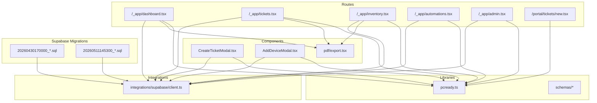
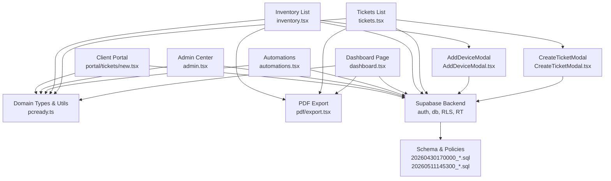
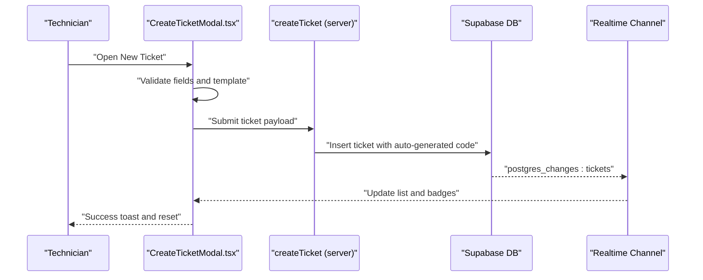
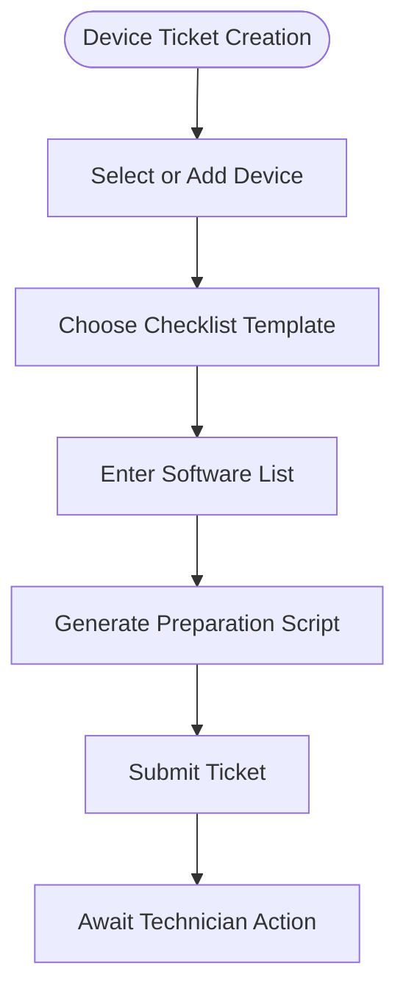
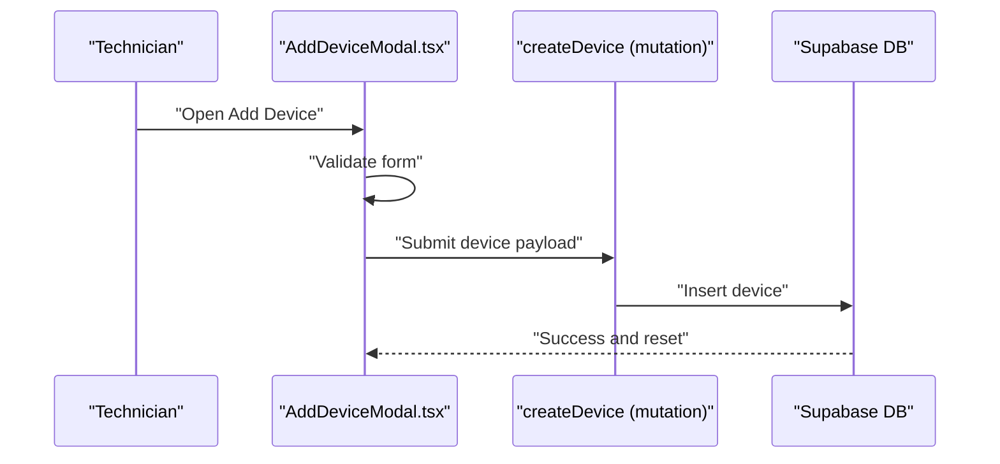
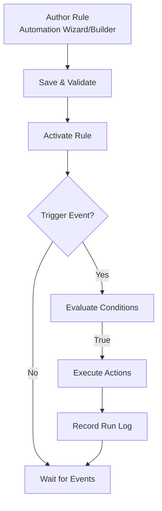
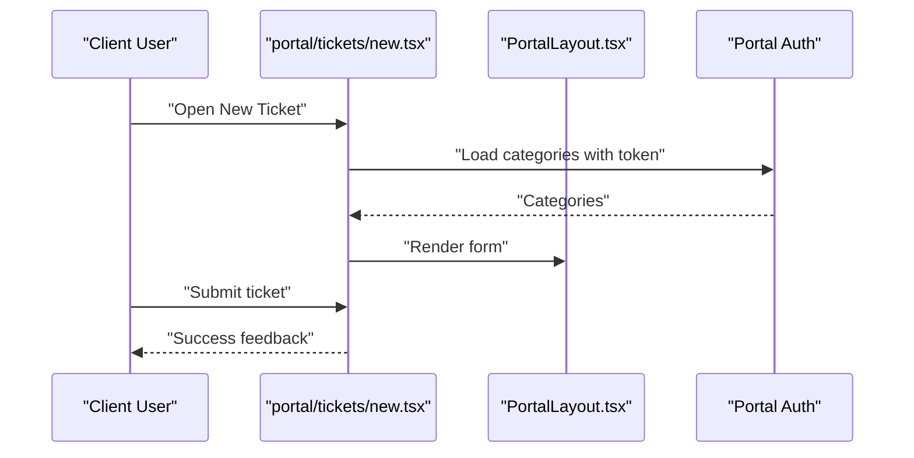
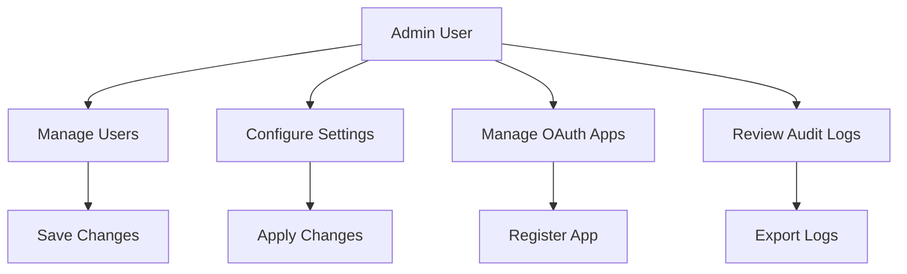
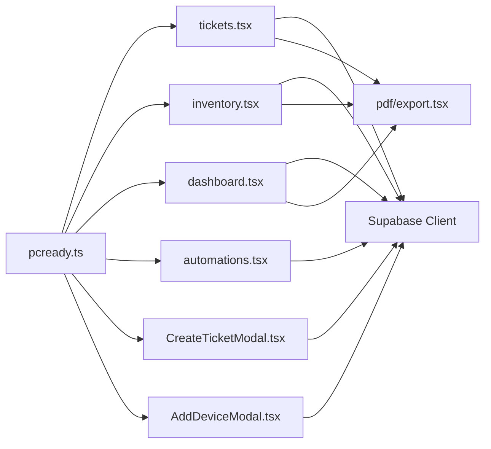

# Project Overview

<cite>
**Referenced Files in This Document**
- [README.md](file://README.md)
- [pcready.ts](file://src/lib/pcready.ts)
- [tickets.tsx](file://src/routes/_app/tickets.tsx)
- [inventory.tsx](file://src/routes/_app/inventory.tsx)
- [dashboard.tsx](file://src/routes/_app/dashboard.tsx)
- [automations.tsx](file://src/routes/_app/automations.tsx)
- [CreateTicketModal.tsx](file://src/components/pcready/CreateTicketModal.tsx)
- [AddDeviceModal.tsx](file://src/components/pcready/AddDeviceModal.tsx)
- [export.tsx](file://src/components/pcready/pdf/export.tsx)
- [new.tsx](file://src/routes/portal/tickets/new.tsx)
- [PortalLayout.tsx](file://src/components/portal/PortalLayout.tsx)
- [admin.tsx](file://src/routes/_app/admin.tsx)
- [20260430170000_split_assets_clients_tickets.sql](file://supabase/migrations/20260430170000_split_assets_clients_tickets.sql)
- [20260511145300_dashboard_analytics_rpc_functions.sql](file://supabase/migrations/20260511145300_dashboard_analytics_rpc_functions.sql)
</cite>

## Table of Contents
1. [Introduction](#introduction)
2. [Project Structure](#project-structure)
3. [Core Components](#core-components)
4. [Architecture Overview](#architecture-overview)
5. [Detailed Component Analysis](#detailed-component-analysis)
6. [Dependency Analysis](#dependency-analysis)
7. [Performance Considerations](#performance-considerations)
8. [Troubleshooting Guide](#troubleshooting-guide)
9. [Conclusion](#conclusion)

## Introduction
PCReady is a centralized platform designed to streamline IT service operations for corporate environments. It focuses on three primary workflows:
- Device preparation tickets: end-to-end orchestration for PC provisioning, including checklist-driven workflows, device assignment, and automated script generation.
- Device inventory management: structured tracking of hardware assets with status management, barcode/QR scanning, and batch label printing.
- Automated workflows: rule-based automation for ticket lifecycle actions, notifications, and operational tasks.

Target audience:
- Technicians: create and manage tickets, track device preparation progress, and leverage automation.
- Administrators: configure system settings, manage users and OAuth applications, monitor audit logs, and oversee backups.
- Clients: access a self-service portal to submit tickets, track status, and review documents.

Core value proposition:
- Unified ticket workflow for PC preparation with integrated checklist management and device assignment.
- Real-time dashboards and analytics with exportable reports.
- Automated notifications and run logs for transparency and compliance.
- Secure, scalable backend powered by Supabase with row-level security and real-time channels.

## Project Structure
At a high level, the application is organized around:
- Routes: file-based routing via TanStack Router for both internal app and client portal.
- Components: reusable UI and domain-specific components under src/components.
- Libraries: shared logic for queries, schemas, PDF exports, and domain utilities under src/lib.
- Integrations: Supabase client and typed database access under src/integrations/supabase.
- Supabase migrations: database schema, policies, triggers, and analytics functions.

**Diagram sources**
- [dashboard.tsx:1-448](file://src/routes/_app/dashboard.tsx#L1-L448)
- [tickets.tsx:1-400](file://src/routes/_app/tickets.tsx#L1-L400)
- [inventory.tsx:1-580](file://src/routes/_app/inventory.tsx#L1-L580)
- [automations.tsx:1-261](file://src/routes/_app/automations.tsx#L1-L261)
- [admin.tsx:1-50](file://src/routes/_app/admin.tsx#L1-L50)
- [CreateTicketModal.tsx:1-559](file://src/components/pcready/CreateTicketModal.tsx#L1-L559)
- [AddDeviceModal.tsx:1-218](file://src/components/pcready/AddDeviceModal.tsx#L1-L218)
- [export.tsx:1-18](file://src/components/pcready/pdf/export.tsx#L1-L18)
- [pcready.ts:1-241](file://src/lib/pcready.ts#L1-L241)
- [20260430170000_split_assets_clients_tickets.sql:1-137](file://supabase/migrations/20260430170000_split_assets_clients_tickets.sql#L1-L137)
- [20260511145300_dashboard_analytics_rpc_functions.sql:1-102](file://supabase/migrations/20260511145300_dashboard_analytics_rpc_functions.sql#L1-L102)

**Section sources**
- [README.md:125-134](file://README.md#L125-L134)
- [dashboard.tsx:1-448](file://src/routes/_app/dashboard.tsx#L1-L448)
- [tickets.tsx:1-400](file://src/routes/_app/tickets.tsx#L1-L400)
- [inventory.tsx:1-580](file://src/routes/_app/inventory.tsx#L1-L580)
- [automations.tsx:1-261](file://src/routes/_app/automations.tsx#L1-L261)
- [admin.tsx:1-50](file://src/routes/_app/admin.tsx#L1-L50)

## Core Components
- Ticket workflow: end-to-end lifecycle from creation to completion, with statuses, priorities, types, and checklist templates.
- Device preparation: dedicated ticket type for PC provisioning, including OS selection, software list, and generated preparation scripts.
- Device inventory: asset tracking with status transitions, client/device linkage, and batch operations.
- Automation engine: rule-based triggers, conditions, and actions with dry-run and version history.
- Client portal: self-service submission and status tracking for external users.
- Admin center: user management, OAuth apps, settings, and audit logs.
- PDF reporting: exportable lists for tickets and inventory, plus analytics reports.

**Section sources**
- [README.md:17-28](file://README.md#L17-L28)
- [pcready.ts:1-241](file://src/lib/pcready.ts#L1-L241)
- [CreateTicketModal.tsx:138-300](file://src/components/pcready/CreateTicketModal.tsx#L138-L300)
- [AddDeviceModal.tsx:27-118](file://src/components/pcready/AddDeviceModal.tsx#L27-L118)
- [export.tsx:5-17](file://src/components/pcready/pdf/export.tsx#L5-L17)
- [new.tsx:15-75](file://src/routes/portal/tickets/new.tsx#L15-L75)
- [admin.tsx:23-49](file://src/routes/_app/admin.tsx#L23-L49)

## Architecture Overview
PCReady follows a modern frontend architecture with a Supabase backend:
- Frontend: React + TypeScript with TanStack Router for file-based routing, shadcn/ui + Tailwind for UI, and Supabase client for auth, database, and real-time.
- Backend: Supabase with row-level security, triggers, and stored procedures for ticket analytics and closed timestamps.
- Data model: normalized tables for clients, contacts, devices, and tickets, with foreign keys enabling device preparation workflows.

**Diagram sources**
- [dashboard.tsx:1-448](file://src/routes/_app/dashboard.tsx#L1-L448)
- [tickets.tsx:1-400](file://src/routes/_app/tickets.tsx#L1-L400)
- [inventory.tsx:1-580](file://src/routes/_app/inventory.tsx#L1-L580)
- [automations.tsx:1-261](file://src/routes/_app/automations.tsx#L1-L261)
- [admin.tsx:1-50](file://src/routes/_app/admin.tsx#L1-L50)
- [new.tsx:1-76](file://src/routes/portal/tickets/new.tsx#L1-L76)
- [CreateTicketModal.tsx:1-559](file://src/components/pcready/CreateTicketModal.tsx#L1-L559)
- [AddDeviceModal.tsx:1-218](file://src/components/pcready/AddDeviceModal.tsx#L1-L218)
- [pcready.ts:1-241](file://src/lib/pcready.ts#L1-L241)
- [export.tsx:1-18](file://src/components/pcready/pdf/export.tsx#L1-L18)
- [20260430170000_split_assets_clients_tickets.sql:1-137](file://supabase/migrations/20260430170000_split_assets_clients_tickets.sql#L1-L137)
- [20260511145300_dashboard_analytics_rpc_functions.sql:1-102](file://supabase/migrations/20260511145300_dashboard_analytics_rpc_functions.sql#L1-L102)

## Detailed Component Analysis

### Ticket Workflow
The ticket workflow is the core of PCReady’s device preparation system:
- Creation: technicians use CreateTicketModal to define client, requester, device (for device tickets), priority, assignee, checklist template, and notes.
- Lifecycle: statuses progress through pending → in-progress → testing → ready → completed/archived with metadata for labels, colors, and next state.
- Lists and filtering: server-side pagination, filters by status, priority, type, and client; export to PDF.
- Checklist management: configurable templates with categorized items (OS, Software, Security, Network) and progress computation.

**Diagram sources**
- [CreateTicketModal.tsx:196-300](file://src/components/pcready/CreateTicketModal.tsx#L196-L300)
- [tickets.tsx:113-122](file://src/routes/_app/tickets.tsx#L113-L122)
- [pcready.ts:1-60](file://src/lib/pcready.ts#L1-L60)

**Section sources**
- [CreateTicketModal.tsx:138-300](file://src/components/pcready/CreateTicketModal.tsx#L138-L300)
- [tickets.tsx:66-122](file://src/routes/_app/tickets.tsx#L66-L122)
- [pcready.ts:1-60](file://src/lib/pcready.ts#L1-L60)

### Device Preparation
Device preparation is modeled as a specialized ticket type with:
- Required device association for device tickets.
- Checklist templates tailored for OS setup, software installation, security hardening, and networking.
- Generated preparation scripts derived from ticket data (OS, software list).

**Diagram sources**
- [CreateTicketModal.tsx:379-494](file://src/components/pcready/CreateTicketModal.tsx#L379-L494)
- [pcready.ts:66-100](file://src/lib/pcready.ts#L66-L100)
- [pcready.ts:201-240](file://src/lib/pcready.ts#L201-L240)

**Section sources**
- [CreateTicketModal.tsx:379-494](file://src/components/pcready/CreateTicketModal.tsx#L379-L494)
- [pcready.ts:66-100](file://src/lib/pcready.ts#L66-L100)
- [pcready.ts:201-240](file://src/lib/pcready.ts#L201-L240)

### Device Inventory Management
Inventory management supports:
- Adding devices with brand, model, serial, client, end user, OS, and notes.
- Status transitions (available, assigned, maintenance, retired) with safeguards for active assignments.
- Batch operations: QR code generation, barcode scanning, CSV import, and label printing.
- Filtering and pagination with server-side queries and PDF export.

**Diagram sources**
- [AddDeviceModal.tsx:78-118](file://src/components/pcready/AddDeviceModal.tsx#L78-L118)
- [inventory.tsx:242-275](file://src/routes/_app/inventory.tsx#L242-L275)

**Section sources**
- [AddDeviceModal.tsx:27-118](file://src/components/pcready/AddDeviceModal.tsx#L27-L118)
- [inventory.tsx:63-121](file://src/routes/_app/inventory.tsx#L63-L121)

### Automation Engine
The automation engine enables rule-based actions:
- Rule authoring: guided wizard or advanced builder for triggers, conditions, and actions.
- Execution: run now, dry-run, pause, archive, and version history.
- Monitoring: KPIs, run statistics, and logs per rule.

**Diagram sources**
- [automations.tsx:22-160](file://src/routes/_app/automations.tsx#L22-L160)

**Section sources**
- [automations.tsx:22-160](file://src/routes/_app/automations.tsx#L22-L160)

### Client Portal
The client portal allows external users to:
- Authenticate and submit tickets via a guided form.
- Access navigation to dashboard, tickets, and documents.

**Diagram sources**
- [new.tsx:15-75](file://src/routes/portal/tickets/new.tsx#L15-L75)
- [PortalLayout.tsx:5-35](file://src/components/portal/PortalLayout.tsx#L5-L35)

**Section sources**
- [new.tsx:15-75](file://src/routes/portal/tickets/new.tsx#L15-L75)
- [PortalLayout.tsx:5-35](file://src/components/portal/PortalLayout.tsx#L5-L35)

### Admin Center
Administrators can:
- Manage users, roles, and status.
- Configure application settings and OAuth clients.
- Review audit logs and perform backup/export operations.

**Diagram sources**
- [admin.tsx:23-49](file://src/routes/_app/admin.tsx#L23-L49)

**Section sources**
- [admin.tsx:23-49](file://src/routes/_app/admin.tsx#L23-L49)

## Dependency Analysis
Key dependencies and relationships:
- UI components depend on domain utilities (pcready.ts) for statuses, priorities, types, and checklist structures.
- Routes integrate with Supabase client for queries, mutations, and real-time channels.
- PDF export relies on @react-pdf/renderer and shared download utilities.
- Migrations define the schema, enums, RLS policies, and analytics functions.

**Diagram sources**
- [pcready.ts:1-241](file://src/lib/pcready.ts#L1-L241)
- [tickets.tsx:1-400](file://src/routes/_app/tickets.tsx#L1-L400)
- [inventory.tsx:1-580](file://src/routes/_app/inventory.tsx#L1-L580)
- [dashboard.tsx:1-448](file://src/routes/_app/dashboard.tsx#L1-L448)
- [automations.tsx:1-261](file://src/routes/_app/automations.tsx#L1-L261)
- [CreateTicketModal.tsx:1-559](file://src/components/pcready/CreateTicketModal.tsx#L1-L559)
- [AddDeviceModal.tsx:1-218](file://src/components/pcready/AddDeviceModal.tsx#L1-L218)
- [export.tsx:1-18](file://src/components/pcready/pdf/export.tsx#L1-L18)

**Section sources**
- [pcready.ts:1-241](file://src/lib/pcready.ts#L1-L241)
- [tickets.tsx:1-400](file://src/routes/_app/tickets.tsx#L1-L400)
- [inventory.tsx:1-580](file://src/routes/_app/inventory.tsx#L1-L580)
- [dashboard.tsx:1-448](file://src/routes/_app/dashboard.tsx#L1-L448)
- [automations.tsx:1-261](file://src/routes/_app/automations.tsx#L1-L261)
- [CreateTicketModal.tsx:1-559](file://src/components/pcready/CreateTicketModal.tsx#L1-L559)
- [AddDeviceModal.tsx:1-218](file://src/components/pcready/AddDeviceModal.tsx#L1-L218)
- [export.tsx:1-18](file://src/components/pcready/pdf/export.tsx#L1-L18)

## Performance Considerations
- Server-side pagination: both tickets and inventory pages use fixed page sizes and exact counts to avoid memory pressure.
- Real-time updates: Supabase realtime channels notify UI of changes, reducing polling overhead.
- PDF generation: exports operate on current filtered page data to prevent large browser workloads.
- Analytics functions: database-side RPCs compute monthly metrics and KPIs efficiently.

**Section sources**
- [README.md:44-48](file://README.md#L44-L48)
- [tickets.tsx:64-88](file://src/routes/_app/tickets.tsx#L64-L88)
- [inventory.tsx:61-94](file://src/routes/_app/inventory.tsx#L61-L94)
- [export.tsx:5-17](file://src/components/pcready/pdf/export.tsx#L5-L17)
- [20260511145300_dashboard_analytics_rpc_functions.sql:31-97](file://supabase/migrations/20260511145300_dashboard_analytics_rpc_functions.sql#L31-L97)

## Troubleshooting Guide
Common issues and resolutions:
- Ticket creation fails: verify permissions, required fields, and device limits for device tickets; check server function error formatting.
- Device status change blocked: assigned devices with active tickets cannot be changed to avoid inconsistency.
- PDF export empty: ensure filters are applied and data exists on the current page.
- Portal ticket submission: confirm token presence and category loading; retry on network errors.

**Section sources**
- [CreateTicketModal.tsx:196-300](file://src/components/pcready/CreateTicketModal.tsx#L196-L300)
- [inventory.tsx:242-275](file://src/routes/_app/inventory.tsx#L242-L275)
- [export.tsx:5-17](file://src/components/pcready/pdf/export.tsx#L5-L17)
- [new.tsx:23-40](file://src/routes/portal/tickets/new.tsx#L23-L40)

## Conclusion
PCReady consolidates IT service operations into a cohesive platform:
- Technicians benefit from streamlined device preparation tickets, checklist templates, and automation.
- Administrators gain powerful controls over users, settings, and auditability.
- Clients enjoy a simple portal for submitting and tracking tickets.
The system’s modular architecture, robust data model, and automation engine position it as a scalable solution for enterprise IT service management.