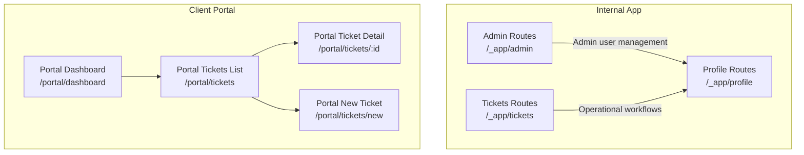
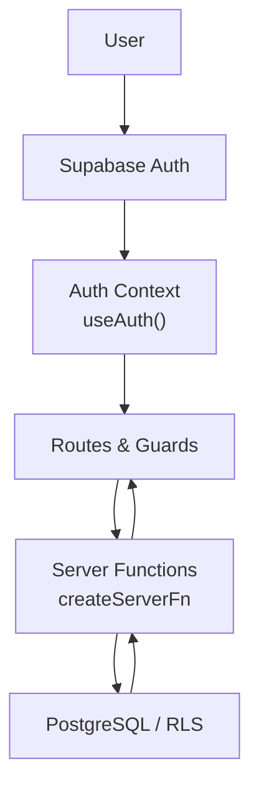
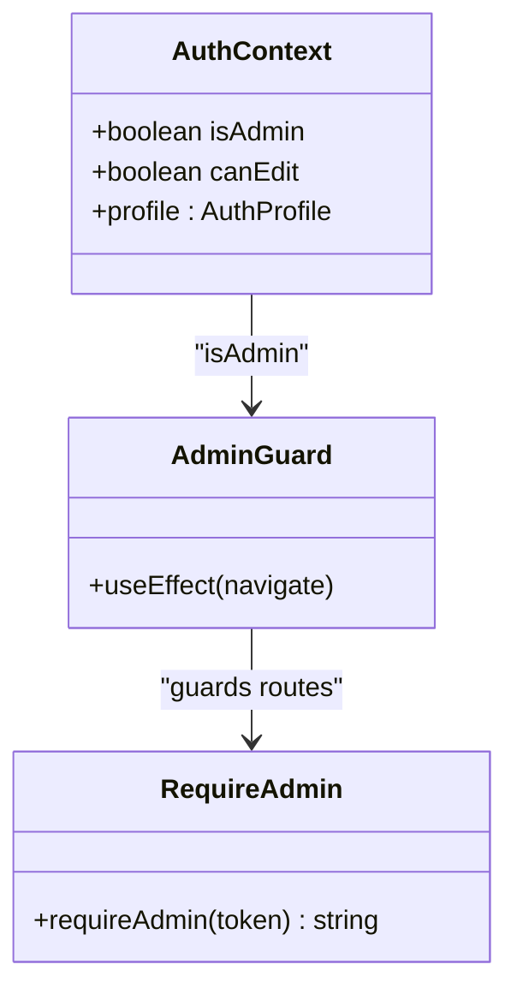
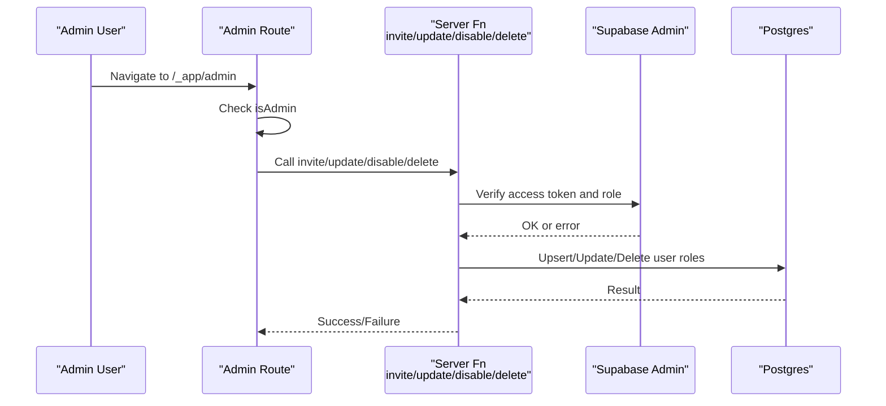
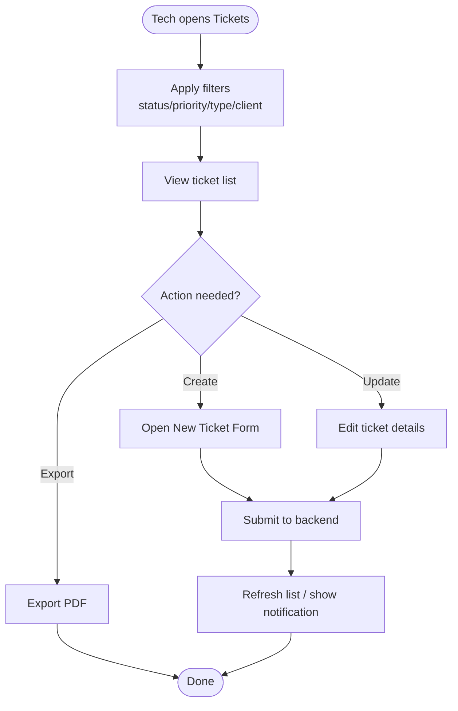
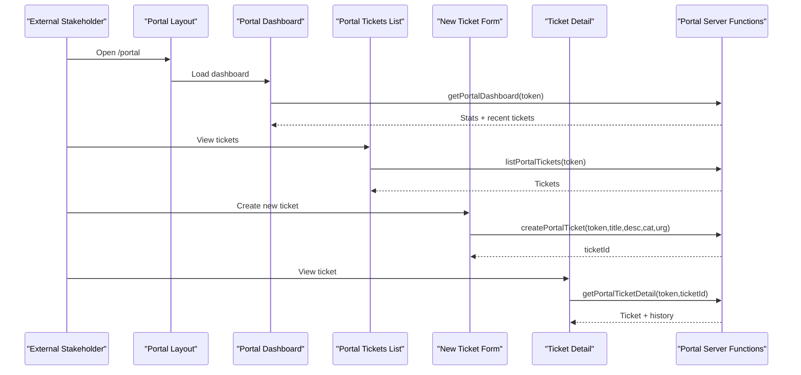
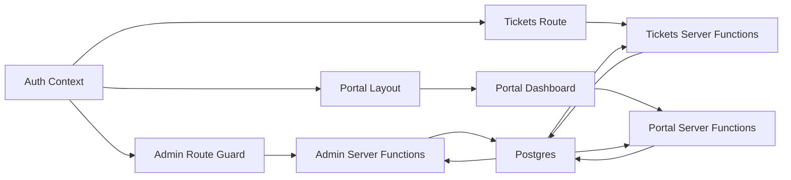

# Target Audience

<cite>
**Referenced Files in This Document**
- [auth-context.tsx](file://src/lib/auth-context.tsx)
- [admin-users.ts](file://src/lib/admin-users.ts)
- [admin-users.server.ts](file://src/lib/admin-users.server.ts)
- [technicians.ts](file://src/lib/technicians.ts)
- [admin-constants.ts](file://src/lib/admin/admin-constants.ts)
- [admin.tsx](file://src/routes/_app/admin.tsx)
- [tickets.tsx](file://src/routes/_app/tickets.tsx)
- [profile.tsx](file://src/routes/_app/profile.tsx)
- [portal-auth.ts](file://src/lib/portal-auth.ts)
- [portal-tickets.ts](file://src/lib/portal-tickets.ts)
- [dashboard.tsx](file://src/routes/portal/dashboard.tsx)
- [tickets/index.tsx](file://src/routes/portal/tickets/index.tsx)
- [tickets/new.tsx](file://src/routes/portal/tickets/new.tsx)
- [tickets/$ticketId.tsx](file://src/routes/portal/tickets/$ticketId.tsx)
- [PortalLayout.tsx](file://src/components/portal/PortalLayout.tsx)
- [NewTicketForm.tsx](file://src/components/portal/NewTicketForm.tsx)
- [types.ts](file://src/integrations/supabase/types.ts)
</cite>

## Table of Contents
1. [Introduction](#introduction)
2. [Project Structure](#project-structure)
3. [Core Components](#core-components)
4. [Architecture Overview](#architecture-overview)
5. [Detailed Component Analysis](#detailed-component-analysis)
6. [Dependency Analysis](#dependency-analysis)
7. [Performance Considerations](#performance-considerations)
8. [Troubleshooting Guide](#troubleshooting-guide)
9. [Conclusion](#conclusion)

## Introduction
This document describes the target audience and stakeholder groups served by the application, focusing on three primary user roles and the client portal experience. It explains the personas, access capabilities, and technical requirements for each group, and maps their workflows to specific application components and backend policies.

- Admin: Full administrative access for user management, configuration, and system auditing.
- Tech: Operational access to create, modify, and manage tickets, checklists, and resources.
- Viewer: Read-only access for monitoring and reporting.
- Client Portal: External stakeholders can track ticket status, create tickets, and access documents via a secure session.

## Project Structure
The application separates internal and external experiences:
- Internal app under /_app exposes administration, ticketing, and operational features.
- Client portal under /portal provides read-only and submission capabilities for external stakeholders.

**Diagram sources**
- [admin.tsx:11-49](file://src/routes/_app/admin.tsx#L11-L49)
- [tickets.tsx:37-47](file://src/routes/_app/tickets.tsx#L37-L47)
- [dashboard.tsx:10-14](file://src/routes/portal/dashboard.tsx#L10-L14)
- [tickets/index.tsx:10-14](file://src/routes/portal/tickets/index.tsx#L10-L14)
- [tickets/new.tsx:9-13](file://src/routes/portal/tickets/new.tsx#L9-L13)
- [tickets/$ticketId.tsx:9-13](file://src/routes/portal/tickets/$ticketId.tsx#L9-L13)

**Section sources**
- [admin.tsx:11-49](file://src/routes/_app/admin.tsx#L11-L49)
- [tickets.tsx:37-47](file://src/routes/_app/tickets.tsx#L37-L47)
- [dashboard.tsx:10-14](file://src/routes/portal/dashboard.tsx#L10-L14)
- [tickets/index.tsx:10-14](file://src/routes/portal/tickets/index.tsx#L10-L14)
- [tickets/new.tsx:9-13](file://src/routes/portal/tickets/new.tsx#L9-L13)
- [tickets/$ticketId.tsx:9-13](file://src/routes/portal/tickets/$ticketId.tsx#L9-L13)

## Core Components
- Authentication and roles:
  - AppRole union and role-aware UI helpers define admin, tech, viewer.
  - Admin-only routes guard access to administrative areas.
  - Role resolution via RPC and profile loading.
- Administration:
  - Admin user listing, invites, updates, disabling, and deletion.
  - Role editor and constants for admin UI.
- Operations:
  - Ticket listing, filtering, and export.
  - Technician selection for assignments.
- Client portal:
  - Secure session management and token-based access.
  - Dashboard, ticket listing, creation, and detail views.
  - Navigation and forms tailored for external users.

**Section sources**
- [auth-context.tsx:13-35](file://src/lib/auth-context.tsx#L13-L35)
- [admin-users.ts:53-135](file://src/lib/admin-users.ts#L53-L135)
- [admin-users.server.ts:3-17](file://src/lib/admin-users.server.ts#L3-L17)
- [admin-constants.ts:3-22](file://src/lib/admin/admin-constants.ts#L3-L22)
- [admin.tsx:23-49](file://src/routes/_app/admin.tsx#L23-L49)
- [tickets.tsx:66-394](file://src/routes/_app/tickets.tsx#L66-L394)
- [technicians.ts:10-33](file://src/lib/technicians.ts#L10-L33)
- [portal-auth.ts:27-60](file://src/lib/portal-auth.ts#L27-L60)
- [portal-tickets.ts:19-52](file://src/lib/portal-tickets.ts#L19-L52)
- [PortalLayout.tsx:5-34](file://src/components/portal/PortalLayout.tsx#L5-L34)
- [NewTicketForm.tsx:8-83](file://src/components/portal/NewTicketForm.tsx#L8-L83)

## Architecture Overview
The system enforces role-based access control at both UI and backend levels:
- UI guards prevent unauthorized navigation.
- Backend server functions validate tokens and roles.
- Supabase RLS and RPC enforce row-level policies and role checks.

**Diagram sources**
- [auth-context.tsx:43-166](file://src/lib/auth-context.tsx#L43-L166)
- [admin-users.server.ts:3-17](file://src/lib/admin-users.server.ts#L3-L17)
- [admin-users.ts:88-135](file://src/lib/admin-users.ts#L88-L135)
- [types.ts:743-762](file://src/integrations/supabase/types.ts#L743-L762)

**Section sources**
- [auth-context.tsx:43-166](file://src/lib/auth-context.tsx#L43-L166)
- [admin-users.server.ts:3-17](file://src/lib/admin-users.server.ts#L3-L17)
- [admin-users.ts:88-135](file://src/lib/admin-users.ts#L88-L135)
- [types.ts:743-762](file://src/integrations/supabase/types.ts#L743-L762)

## Detailed Component Analysis

### Roles and Access Control Model
- AppRole: admin | tech | viewer.
- UI capability flags:
  - canEdit: admin or tech.
  - isAdmin: admin.
- Admin-only route protection:
  - Redirects non-admins to dashboard.
- Backend enforcement:
  - requireAdmin validates access token and checks admin role via RPC.

**Diagram sources**
- [auth-context.tsx:148-163](file://src/lib/auth-context.tsx#L148-L163)
- [admin.tsx:23-49](file://src/routes/_app/admin.tsx#L23-L49)
- [admin-users.server.ts:3-17](file://src/lib/admin-users.server.ts#L3-L17)

**Section sources**
- [auth-context.tsx:13-35](file://src/lib/auth-context.tsx#L13-L35)
- [auth-context.tsx:148-163](file://src/lib/auth-context.tsx#L148-L163)
- [admin.tsx:23-49](file://src/routes/_app/admin.tsx#L23-L49)
- [admin-users.server.ts:3-17](file://src/lib/admin-users.server.ts#L3-L17)

### Admin Role
- Responsibilities:
  - Manage users (invite, update role, disable, delete).
  - Configure application settings.
  - Audit activities.
- UI and workflows:
  - Admin tabbed interface with Users, Settings, OAuth, Audit.
  - Role editor component supports role changes.
  - Rate-limited invite endpoint.
- Security model:
  - requireAdmin enforces admin role on server functions.
  - Prevents removal of sole admin.

**Diagram sources**
- [admin.tsx:23-49](file://src/routes/_app/admin.tsx#L23-L49)
- [admin-users.ts:169-225](file://src/lib/admin-users.ts#L169-L225)
- [admin-users.ts:137-167](file://src/lib/admin-users.ts#L137-L167)
- [admin-users.ts:250-264](file://src/lib/admin-users.ts#L250-L264)
- [admin-users.ts:266-278](file://src/lib/admin-users.ts#L266-L278)
- [admin-users.server.ts:3-17](file://src/lib/admin-users.server.ts#L3-L17)

**Section sources**
- [admin.tsx:36-47](file://src/routes/_app/admin.tsx#L36-L47)
- [admin-users.ts:53-135](file://src/lib/admin-users.ts#L53-L135)
- [admin-users.ts:169-225](file://src/lib/admin-users.ts#L169-L225)
- [admin-users.ts:250-278](file://src/lib/admin-users.ts#L250-L278)
- [admin-users.server.ts:3-17](file://src/lib/admin-users.server.ts#L3-L17)
- [admin-constants.ts:3-22](file://src/lib/admin/admin-constants.ts#L3-L22)

### Tech Role
- Responsibilities:
  - Create and modify tickets.
  - Assign and follow up on work-in-progress items.
  - Use operational resources (checklists, scripts).
- UI and workflows:
  - Tickets list with filters, export, and real-time updates.
  - Technician selection for assignments.
  - Profile page for personal settings and notifications.
- Security model:
  - canEdit flag enables editing actions.
  - Role enforced in UI and backend.

**Diagram sources**
- [tickets.tsx:66-394](file://src/routes/_app/tickets.tsx#L66-L394)
- [technicians.ts:10-33](file://src/lib/technicians.ts#L10-L33)
- [profile.tsx:69-250](file://src/routes/_app/profile.tsx#L69-L250)

**Section sources**
- [tickets.tsx:66-394](file://src/routes/_app/tickets.tsx#L66-L394)
- [technicians.ts:10-33](file://src/lib/technicians.ts#L10-L33)
- [profile.tsx:69-250](file://src/routes/_app/profile.tsx#L69-L250)

### Viewer Role
- Responsibilities:
  - Read-only monitoring and reporting.
  - Limited visibility into dashboards and lists.
- UI and workflows:
  - Access to dashboards and lists with read-only controls.
  - No write actions permitted.
- Security model:
  - Viewer role inferred when no admin/tech role is present.

**Section sources**
- [auth-context.tsx:155-156](file://src/lib/auth-context.tsx#L155-L156)
- [dashboard.tsx:20-104](file://src/routes/portal/dashboard.tsx#L20-L104)

### Client Portal
- Purpose:
  - Allow external stakeholders to track ticket status, create tickets, and access documents.
- Access and session:
  - Token-based session validated server-side.
  - Portal links can be generated and revoked for contacts.
- Workflows:
  - Dashboard: overview of open/in-progress/resolved counts and recent tickets.
  - Tickets list: view all tickets and navigate to details.
  - New ticket: form with category and urgency selection.
  - Ticket detail: status timeline, notes, and document download when ready.

**Diagram sources**
- [PortalLayout.tsx:5-34](file://src/components/portal/PortalLayout.tsx#L5-L34)
- [dashboard.tsx:20-104](file://src/routes/portal/dashboard.tsx#L20-L104)
- [tickets/index.tsx:16-92](file://src/routes/portal/tickets/index.tsx#L16-L92)
- [tickets/new.tsx:15-75](file://src/routes/portal/tickets/new.tsx#L15-L75)
- [tickets/$ticketId.tsx:15-106](file://src/routes/portal/tickets/$ticketId.tsx#L15-L106)
- [portal-auth.ts:27-60](file://src/lib/portal-auth.ts#L27-L60)
- [portal-tickets.ts:19-52](file://src/lib/portal-tickets.ts#L19-L52)
- [NewTicketForm.tsx:8-83](file://src/components/portal/NewTicketForm.tsx#L8-L83)

**Section sources**
- [PortalLayout.tsx:5-34](file://src/components/portal/PortalLayout.tsx#L5-L34)
- [dashboard.tsx:20-104](file://src/routes/portal/dashboard.tsx#L20-L104)
- [tickets/index.tsx:16-92](file://src/routes/portal/tickets/index.tsx#L16-L92)
- [tickets/new.tsx:15-75](file://src/routes/portal/tickets/new.tsx#L15-L75)
- [tickets/$ticketId.tsx:15-106](file://src/routes/portal/tickets/$ticketId.tsx#L15-L106)
- [portal-auth.ts:27-60](file://src/lib/portal-auth.ts#L27-L60)
- [portal-tickets.ts:19-52](file://src/lib/portal-tickets.ts#L19-L52)
- [NewTicketForm.tsx:8-83](file://src/components/portal/NewTicketForm.tsx#L8-L83)

## Dependency Analysis
- UI-to-backend:
  - Internal routes depend on server functions for tickets and admin operations.
  - Portal routes depend on portal-specific server functions for dashboard, tickets, and authentication.
- Role dependencies:
  - Admin-only server functions require admin role via RPC.
  - UI guards rely on auth context flags.
- Data model:
  - Profiles and user roles tables support role resolution.
  - Portal sessions table supports client portal access.

**Diagram sources**
- [auth-context.tsx:148-163](file://src/lib/auth-context.tsx#L148-L163)
- [admin.tsx:23-49](file://src/routes/_app/admin.tsx#L23-L49)
- [admin-users.ts:88-135](file://src/lib/admin-users.ts#L88-L135)
- [tickets.tsx:66-394](file://src/routes/_app/tickets.tsx#L66-L394)
- [PortalLayout.tsx:5-34](file://src/components/portal/PortalLayout.tsx#L5-L34)
- [dashboard.tsx:20-104](file://src/routes/portal/dashboard.tsx#L20-L104)
- [portal-tickets.ts:19-52](file://src/lib/portal-tickets.ts#L19-L52)
- [types.ts:743-762](file://src/integrations/supabase/types.ts#L743-L762)

**Section sources**
- [auth-context.tsx:148-163](file://src/lib/auth-context.tsx#L148-L163)
- [admin-users.ts:88-135](file://src/lib/admin-users.ts#L88-L135)
- [tickets.tsx:66-394](file://src/routes/_app/tickets.tsx#L66-L394)
- [PortalLayout.tsx:5-34](file://src/components/portal/PortalLayout.tsx#L5-L34)
- [dashboard.tsx:20-104](file://src/routes/portal/dashboard.tsx#L20-L104)
- [portal-tickets.ts:19-52](file://src/lib/portal-tickets.ts#L19-L52)
- [types.ts:743-762](file://src/integrations/supabase/types.ts#L743-L762)

## Performance Considerations
- Real-time updates:
  - Tickets list subscribes to PostgreSQL changes for live refresh indicators.
- Batch operations:
  - Admin user listing performs concurrent queries for users, profiles, and roles.
- Export and previews:
  - PDF generation supports both preview and download modes with busy states.

**Section sources**
- [tickets.tsx:112-122](file://src/routes/_app/tickets.tsx#L112-L122)
- [admin-users.ts:93-101](file://src/lib/admin-users.ts#L93-L101)
- [tickets.tsx:161-195](file://src/routes/_app/tickets.tsx#L161-L195)

## Troubleshooting Guide
- Admin access denied:
  - Ensure the access token is valid and the user has admin role via RPC check.
- Role validation failures:
  - Confirm role resolution in auth context and that server functions enforce requireAdmin.
- Portal session issues:
  - Verify token presence in local storage and that portal server functions validate tokens.
- Ticket creation errors:
  - Check form validation and server function error messages for missing fields or invalid urgency/category.

**Section sources**
- [admin-users.server.ts:3-17](file://src/lib/admin-users.server.ts#L3-L17)
- [auth-context.tsx:79-86](file://src/lib/auth-context.tsx#L79-L86)
- [portal-auth.ts:27-60](file://src/lib/portal-auth.ts#L27-L60)
- [portal-tickets.ts:40-45](file://src/lib/portal-tickets.ts#L40-L45)
- [NewTicketForm.tsx:16-28](file://src/components/portal/NewTicketForm.tsx#L16-L28)

## Conclusion
The application provides a clear separation of concerns between internal operators and external clients. Role-based access control is enforced consistently across UI guards and backend validations, ensuring that each persona can perform only authorized tasks. The client portal offers a streamlined experience for stakeholders to track and engage with tickets while maintaining strict session-based security.