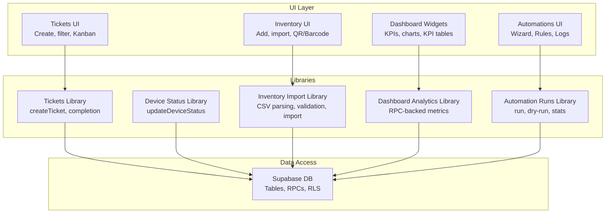
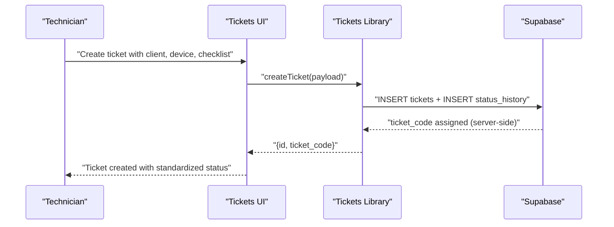
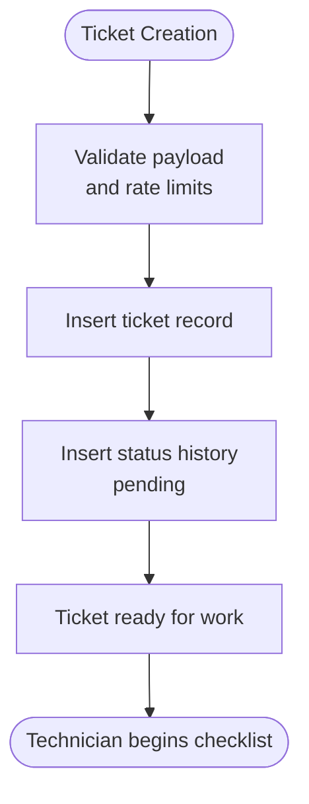
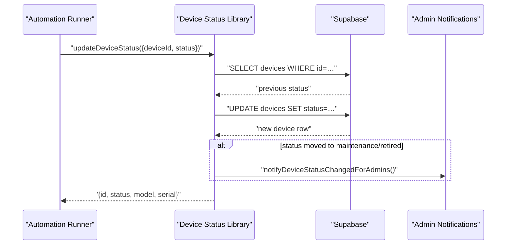
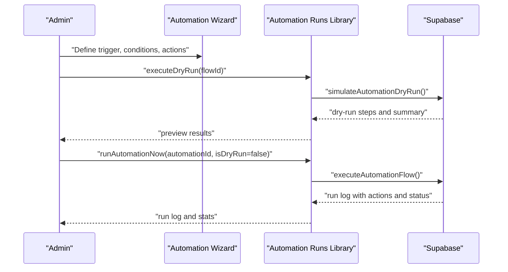
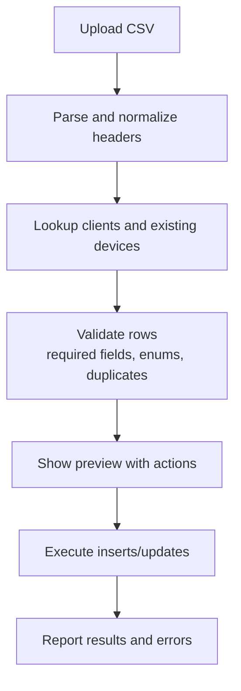
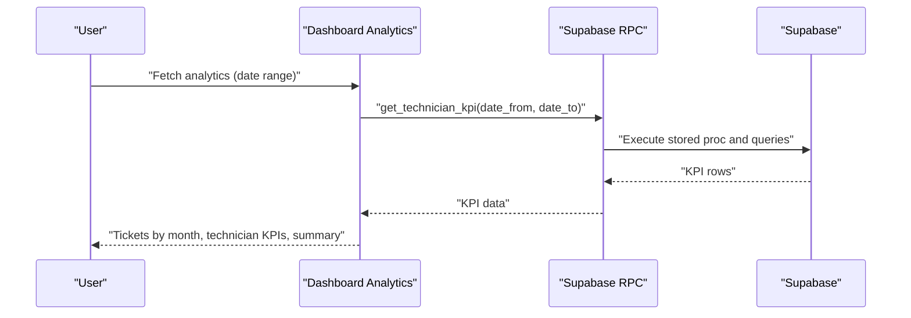
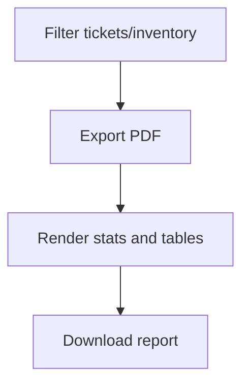
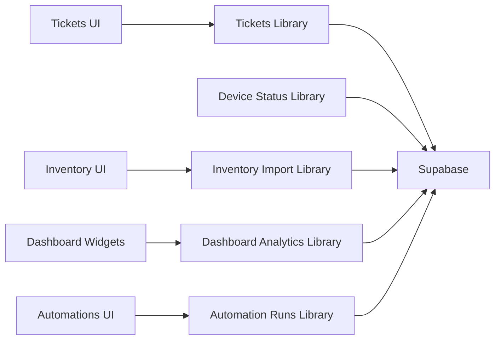

# Value Proposition

<cite>
**Referenced Files in This Document**
- [README.md](file://README.md)
- [pcready.ts](file://src/lib/pcready.ts)
- [dashboard-analytics.ts](file://src/lib/dashboard-analytics.ts)
- [automation-runs.ts](file://src/lib/automation-runs.ts)
- [AutomationWizard.tsx](file://src/components/automations/AutomationWizard.tsx)
- [AutomationRuleCard.tsx](file://src/components/automations/AutomationRuleCard.tsx)
- [inventory-import.ts](file://src/lib/inventory-import.ts)
- [TicketListPdf.tsx](file://src/components/pcready/pdf/TicketListPdf.tsx)
- [InventoryPdf.tsx](file://src/components/pcready/pdf/InventoryPdf.tsx)
- [DashboardStatWidgets.tsx](file://src/components/dashboard/DashboardStatWidgets.tsx)
- [TechnicianKpiTable.tsx](file://src/components/dashboard/TechnicianKpiTable.tsx)
- [tickets.ts](file://src/lib/tickets.ts)
- [device-status.ts](file://src/lib/device-status.ts)
</cite>

## Table of Contents

1. [Introduction](#introduction)
2. [Project Structure](#project-structure)
3. [Core Components](#core-components)
4. [Architecture Overview](#architecture-overview)
5. [Detailed Component Analysis](#detailed-component-analysis)
6. [Dependency Analysis](#dependency-analysis)
7. [Performance Considerations](#performance-considerations)
8. [Troubleshooting Guide](#troubleshooting-guide)
9. [Conclusion](#conclusion)

## Introduction

PCReady delivers measurable business value by streamlining IT service operations through integrated ticketing, device management, and automation workflows. It reduces manual overhead, standardizes PC preparation procedures, improves ticket tracking and completion rates, enhances device inventory management, and automates repetitive tasks. These capabilities translate into quantifiable efficiency gains, fewer errors, and a superior user experience, supported by dashboard analytics and PDF-based reporting.

## Project Structure

At a high level, PCReady organizes functionality around three pillars:

- Ticketing and workflow orchestration for PC preparation and support
- Device lifecycle management with import, status tracking, and reporting
- Automation engine enabling repeatable, auditable, and monitored workflows

**Diagram sources**

- [tickets.ts:50-111](file://src/lib/tickets.ts#L50-L111)
- [device-status.ts:15-56](file://src/lib/device-status.ts#L15-L56)
- [inventory-import.ts:128-180](file://src/lib/inventory-import.ts#L128-L180)
- [dashboard-analytics.ts:36-166](file://src/lib/dashboard-analytics.ts#L36-L166)
- [automation-runs.ts:94-142](file://src/lib/automation-runs.ts#L94-L142)

**Section sources**

- [README.md:17-49](file://README.md#L17-L49)

## Core Components

- Integrated ticketing with standardized statuses and types, plus checklist-driven workflows for PC preparation.
- Device lifecycle management with structured status tracking and CSV-based import.
- Automation engine with a wizard-driven builder, dry-run capability, and run logs for observability.
- Dashboard analytics with RPC-backed metrics for ticket trends, technician KPIs, and weekly activity.
- PDF export for tickets and inventory to enable quick reporting and audits.

These components collectively reduce manual effort, enforce consistency, and provide real-time insights.

**Section sources**

- [pcready.ts:1-241](file://src/lib/pcready.ts#L1-L241)
- [tickets.ts:50-111](file://src/lib/tickets.ts#L50-L111)
- [inventory-import.ts:128-180](file://src/lib/inventory-import.ts#L128-L180)
- [automation-runs.ts:94-142](file://src/lib/automation-runs.ts#L94-L142)
- [dashboard-analytics.ts:36-166](file://src/lib/dashboard-analytics.ts#L36-L166)
- [TicketListPdf.tsx:27-97](file://src/components/pcready/pdf/TicketListPdf.tsx#L27-L97)
- [InventoryPdf.tsx:26-85](file://src/components/pcready/pdf/InventoryPdf.tsx#L26-L85)

## Architecture Overview

PCReady’s value comes from tightly integrated workflows:

- Ticket creation triggers standardized preparation steps and optional device assignment.
- Device inventory is managed independently but linked to tickets, with automated status transitions.
- Automations execute actions (e.g., device status updates) and produce auditable run logs.
- Dashboard analytics aggregate ticket and device metrics to surface performance and bottlenecks.
- PDF exports capture actionable snapshots for stakeholders.

**Diagram sources**

- [tickets.ts:50-111](file://src/lib/tickets.ts#L50-L111)
- [pcready.ts:1-79](file://src/lib/pcready.ts#L1-L79)

**Section sources**

- [README.md:32-49](file://README.md#L32-L49)

## Detailed Component Analysis

### Integrated Ticketing and Standardized Workflows

- Purpose: Accelerate PC preparation with predefined templates and structured statuses.
- Business benefits:
  - Reduced manual overhead by standardizing steps and eliminating ad-hoc decisions.
  - Improved completion rates by guiding technicians through checklist-driven workflows.
  - Enhanced visibility via Kanban and status history.
- Quantitative outcomes:
  - Consistent ticket creation and status transitions reduce misrouting and rework.
  - Server-side ticket code generation prevents collisions and ensures uniqueness.
- Qualitative outcomes:
  - Predictable user experience for both internal staff and portal users.
  - Clear audit trail through status history and creation metadata.

**Diagram sources**

- [tickets.ts:50-111](file://src/lib/tickets.ts#L50-L111)

**Section sources**

- [README.md:32-49](file://README.md#L32-L49)
- [pcready.ts:1-79](file://src/lib/pcready.ts#L1-L79)

### Device Lifecycle Management and Automated Status Transitions

- Purpose: Centralize device inventory and automate status changes with notifications.
- Business benefits:
  - Reduced administrative burden by automating status updates.
  - Improved accuracy and timeliness of inventory state.
  - Early alerts for maintenance or retirement events.
- Quantitative outcomes:
  - Faster provisioning cycles by linking tickets to devices.
  - Lower risk of mismanaged assets through enforced statuses.
- Qualitative outcomes:
  - Clear ownership and accountability for device states.
  - Streamlined handoffs between teams.

**Diagram sources**

- [device-status.ts:15-56](file://src/lib/device-status.ts#L15-L56)

**Section sources**

- [device-status.ts:15-56](file://src/lib/device-status.ts#L15-L56)

### Automation Engine: Builder, Dry Run, and Observability

- Purpose: Enable repeatable, auditable workflows across tickets and devices.
- Business benefits:
  - Reduced manual repetition and human error.
  - Confidence in changes via dry-run previews.
  - Operational insight through run logs and health indicators.
- Quantitative outcomes:
  - Measurable success rates and recent health trends.
  - Reduced time-to-resolution by automating routine tasks.
- Qualitative outcomes:
  - Self-service automation for power users.
  - Transparent governance with versioning and run histories.

**Diagram sources**

- [AutomationWizard.tsx:13-87](file://src/components/automations/AutomationWizard.tsx#L13-L87)
- [automation-runs.ts:94-142](file://src/lib/automation-runs.ts#L94-L142)

**Section sources**

- [AutomationWizard.tsx:13-87](file://src/components/automations/AutomationWizard.tsx#L13-L87)
- [AutomationRuleCard.tsx:52-90](file://src/components/automations/AutomationRuleCard.tsx#L52-L90)
- [automation-runs.ts:94-142](file://src/lib/automation-runs.ts#L94-L142)

### Inventory Import and Reporting

- Purpose: Accelerate onboarding of devices with CSV import and robust validation.
- Business benefits:
  - Dramatically faster bulk ingestion compared to manual entry.
  - Lower error rates through pre-flight validation and preview.
  - Audit-ready import logs and progress tracking.
- Quantitative outcomes:
  - Higher throughput during peak onboarding periods.
  - Reduced rework from invalid or duplicate entries.
- Qualitative outcomes:
  - Consistent data quality across imports.
  - Traceability from raw CSV to final inventory records.

**Diagram sources**

- [inventory-import.ts:49-126](file://src/lib/inventory-import.ts#L49-L126)
- [inventory-import.ts:128-180](file://src/lib/inventory-import.ts#L128-L180)

**Section sources**

- [inventory-import.ts:49-126](file://src/lib/inventory-import.ts#L49-L126)
- [inventory-import.ts:128-180](file://src/lib/inventory-import.ts#L128-L180)

### Dashboard Analytics and Reporting

- Purpose: Provide actionable insights into ticket trends, technician performance, and weekly activity.
- Business benefits:
  - Data-driven decisions on resource allocation and process improvements.
  - Visibility into completion rates, average resolution times, and reopen rates.
  - Quick identification of underperforming areas or recurring issues.
- Quantitative outcomes:
  - Track monthly opened/closed tickets and average resolution days.
  - Compute technician KPIs (completion %, reopen counts, reliability).
  - Normalize metrics for fair comparisons across varying volumes.
- Qualitative outcomes:
  - Executive-grade dashboards with drill-down capabilities.
  - Weekly heatmaps and trend lines for capacity planning.

**Diagram sources**

- [dashboard-analytics.ts:36-166](file://src/lib/dashboard-analytics.ts#L36-L166)

**Section sources**

- [dashboard-analytics.ts:36-166](file://src/lib/dashboard-analytics.ts#L36-L166)
- [DashboardStatWidgets.tsx:18-131](file://src/components/dashboard/DashboardStatWidgets.tsx#L18-L131)
- [TechnicianKpiTable.tsx:13-82](file://src/components/dashboard/TechnicianKpiTable.tsx#L13-L82)

### PDF Export for Transparency and Audits

- Purpose: Produce branded, printable reports for tickets and inventory.
- Business benefits:
  - Rapid sharing of filtered views for stakeholders.
  - Audit-ready exports with counts and summaries.
- Quantitative outcomes:
  - Consistent formatting and counts across exports.
- Qualitative outcomes:
  - Professional communication of operational status.

**Diagram sources**

- [TicketListPdf.tsx:27-97](file://src/components/pcready/pdf/TicketListPdf.tsx#L27-L97)
- [InventoryPdf.tsx:26-85](file://src/components/pcready/pdf/InventoryPdf.tsx#L26-L85)

**Section sources**

- [TicketListPdf.tsx:27-97](file://src/components/pcready/pdf/TicketListPdf.tsx#L27-L97)
- [InventoryPdf.tsx:26-85](file://src/components/pcready/pdf/InventoryPdf.tsx#L26-L85)

## Dependency Analysis

PCReady’s value chain depends on cohesive interactions among libraries, UI components, and Supabase:

- Tickets library depends on Supabase for inserts and status history.
- Device status library enforces automation runner checks and emits notifications.
- Inventory import library coordinates client/device lookups and batch writes.
- Dashboard analytics library relies on RPCs and historical tables for accurate metrics.
- Automation runs library orchestrates flows and persists run logs.

**Diagram sources**

- [tickets.ts:50-111](file://src/lib/tickets.ts#L50-L111)
- [device-status.ts:15-56](file://src/lib/device-status.ts#L15-L56)
- [inventory-import.ts:128-180](file://src/lib/inventory-import.ts#L128-L180)
- [dashboard-analytics.ts:36-166](file://src/lib/dashboard-analytics.ts#L36-L166)
- [automation-runs.ts:94-142](file://src/lib/automation-runs.ts#L94-L142)

**Section sources**

- [tickets.ts:50-111](file://src/lib/tickets.ts#L50-L111)
- [device-status.ts:15-56](file://src/lib/device-status.ts#L15-L56)
- [inventory-import.ts:128-180](file://src/lib/inventory-import.ts#L128-L180)
- [dashboard-analytics.ts:36-166](file://src/lib/dashboard-analytics.ts#L36-L166)
- [automation-runs.ts:94-142](file://src/lib/automation-runs.ts#L94-L142)

## Performance Considerations

- Server-side ticket code generation avoids race conditions and reduces client-side complexity.
- Pagination and server-side filtering minimize memory usage for large datasets.
- Batched device imports and chunked lookups improve throughput during inventory onboarding.
- Dry-run simulations prevent costly mistakes and reduce re-execution overhead.
- RPC-backed analytics aggregate data efficiently and support fast UI rendering.

[No sources needed since this section provides general guidance]

## Troubleshooting Guide

- Authentication failures: Ensure access tokens are present and valid when invoking server functions for tickets, device status updates, and automation runs.
- Rate limiting: Ticket creation is rate-limited; retries should be spaced appropriately.
- Import errors: Review CSV validation messages and fix duplicates or missing client mappings before retrying.
- Automation health: Use run logs and health badges to diagnose recurring failures and address root causes.
- Dashboard anomalies: Verify date ranges and confirm RPC availability; re-run queries if stale data is suspected.

**Section sources**

- [tickets.ts:50-111](file://src/lib/tickets.ts#L50-L111)
- [inventory-import.ts:86-126](file://src/lib/inventory-import.ts#L86-L126)
- [automation-runs.ts:94-142](file://src/lib/automation-runs.ts#L94-L142)
- [dashboard-analytics.ts:36-166](file://src/lib/dashboard-analytics.ts#L36-L166)

## Conclusion

PCReady transforms IT service operations by integrating ticketing, device management, and automation into a cohesive platform. Its standardized workflows, robust analytics, and automated runbooks deliver measurable efficiency gains, reduced errors, and improved user experiences. Organizations gain better visibility, faster turnaround times, and stronger governance—backed by real-time dashboards and audit-ready exports—to scale PC preparation and support operations reliably and consistently.
